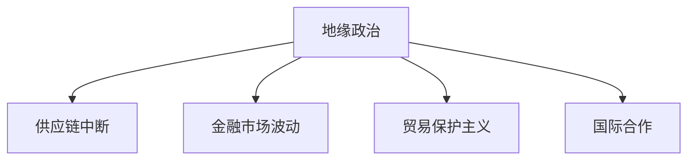

                 

# 地缘冲突加剧对经济的影响

> 关键词：地缘政治, 经济影响, 供应链中断, 金融市场波动, 贸易保护主义, 国际合作, 技术创新

## 1. 背景介绍

### 1.1 问题由来

地缘冲突一直是影响国际经济格局的重要因素。自20世纪以来，多次全球性或区域性冲突，如第一次世界大战、第二次世界大战、冷战、阿富汗战争、伊拉克战争等，都对全球经济产生了深远影响。随着全球化进程的加快，地缘冲突的影响范围和深度都在扩大。特别是近年来，美国与中国的贸易摩擦、俄乌冲突、中东局势等事件频发，对全球经济和金融市场产生了显著影响。

### 1.2 问题核心关键点

地缘冲突加剧对经济的影响主要体现在以下几个方面：
- **供应链中断**：地缘冲突导致的主要影响之一是供应链的中断和重组。供应链的每一个环节都可能受到战争、政治动荡、制裁等因素的干扰，从而影响全球生产、贸易和物流。
- **金融市场波动**：冲突期间，全球金融市场的不确定性增加，投资者信心下降，导致资本流动和金融市场的波动。
- **贸易保护主义**：地缘冲突往往导致贸易保护主义抬头，各国政府为了保护本国经济，可能会采取关税和非关税壁垒，进一步扰乱全球贸易格局。
- **国际合作受挫**：冲突时期，国际合作和对话机制受阻，各国为了各自的利益可能选择单边行动，削弱了全球治理和合作机制的效力。

地缘政治因素对经济的影响复杂多样，难以通过简单的线性模型来预测，因此需要综合考虑政治、经济、军事、社会等多方面因素。本文将详细探讨地缘冲突对经济影响的数学模型和算法，以及相关的开发环境搭建、代码实现和运行结果展示。

## 2. 核心概念与联系

### 2.1 核心概念概述

地缘冲突的经济影响分析涉及多个学科的知识，包括经济学、国际关系、社会学、统计学等。以下是几个核心概念：

- **地缘政治**：指国家或地区之间在地理上的战略位置、资源控制、政治联盟等方面的相互作用和竞争。地缘政治因素影响全球经济格局，特别是在资源、贸易和军事领域的竞争。
- **供应链中断**：指因地缘政治事件导致的关键物资或零部件供应不足，从而影响全球生产和贸易。供应链中断会影响企业的生产效率和盈利能力。
- **金融市场波动**：指地缘政治事件引起的市场不确定性增加，导致股价、汇率、债券等金融资产价格波动。金融市场波动影响投资者信心和资本流动性。
- **贸易保护主义**：指政府为了保护本国产业，采取提高关税、限制进口等措施，导致国际贸易萎缩。贸易保护主义影响全球贸易流向和规模。
- **国际合作**：指国家间在经济、政治、军事等领域的合作与协调，旨在共同应对全球性挑战。国际合作机制的效率影响全球经济的稳定与发展。

这些核心概念之间的逻辑关系可以通过以下Mermaid流程图来展示：



这个流程图展示了一个宏观的框架，即地缘政治因素通过影响供应链、金融市场、贸易政策、国际合作等方面，进而对经济产生综合影响。

## 3. 核心算法原理 & 具体操作步骤
### 3.1 算法原理概述

地缘冲突对经济影响的分析，可以通过构建一个多因素的综合模型来描述。该模型将地缘政治因素、供应链中断、金融市场波动、贸易保护主义等因素作为输入，输出对全球经济的影响。

形式化地，假设地缘冲突对经济的影响为 $E$，其数学模型为：

$$
E = f(P,S,F,T,C)
$$

其中，$P$ 为地缘政治因素，$S$ 为供应链中断因素，$F$ 为金融市场波动因素，$T$ 为贸易保护主义因素，$C$ 为国际合作因素。$f$ 为非线性函数，表示各因素的综合作用。

### 3.2 算法步骤详解

地缘冲突对经济影响的分析算法，一般包括以下几个关键步骤：

**Step 1: 数据收集与预处理**
- 收集相关地缘政治事件、供应链数据、金融市场数据、贸易政策数据、国际合作数据等。
- 对数据进行清洗、归一化和标准化处理。

**Step 2: 选择模型和算法**
- 根据数据特征选择合适的模型和算法。常用的模型包括线性回归、逻辑回归、决策树、随机森林、神经网络等。
- 选择合适的时间序列分析方法，如ARIMA、LSTM等，来处理金融市场数据的波动性。
- 应用多元统计分析方法，如主成分分析(PCA)、因子分析等，来简化数据维度。

**Step 3: 模型训练与优化**
- 划分数据集为训练集、验证集和测试集。
- 使用训练集训练模型，并使用验证集进行调参和优化。
- 使用测试集评估模型性能。

**Step 4: 模型应用与结果解释**
- 应用训练好的模型，对新的地缘政治事件进行预测和分析。
- 解释模型的输出结果，评估其对经济的潜在影响。

### 3.3 算法优缺点

地缘冲突对经济影响的分析算法，具有以下优点：
- **多因素综合分析**：考虑地缘政治、供应链、金融市场、贸易政策、国际合作等多个因素，提供了更全面的经济影响分析。
- **模型灵活性**：使用非线性模型和非参数方法，可以处理复杂的数据结构和非线性关系。
- **数据驱动**：利用实际数据进行训练和预测，使得分析结果更具实际意义。

同时，该算法也存在一些局限性：
- **数据依赖**：地缘冲突的复杂性使得数据的获取和处理成本较高。
- **模型复杂性**：模型越复杂，解释性越差，可能存在过度拟合的风险。
- **假设限制**：模型构建时可能存在一些假设，如线性关系、平稳性等，不一定完全符合实际。
- **预测不确定性**：地缘冲突的随机性较高，模型预测结果存在不确定性。

### 3.4 算法应用领域

地缘冲突对经济影响的分析算法，可以应用于多个领域，如：

- **宏观经济预测**：评估地缘冲突对全球经济增长、通货膨胀、失业率等宏观经济指标的影响。
- **企业风险管理**：识别地缘冲突对企业供应链、生产、销售等环节的影响，帮助企业制定风险应对策略。
- **政策制定**：为政府和国际组织提供决策支持，帮助制定贸易政策、金融监管、国际合作策略等。
- **市场投资**：分析地缘冲突对金融市场的影响，指导投资者进行资产配置和风险管理。

这些应用场景展示了地缘冲突经济影响分析算法的广泛应用前景。

## 4. 数学模型和公式 & 详细讲解 & 举例说明

### 4.1 数学模型构建

地缘冲突对经济影响的分析，可以通过建立多元回归模型来描述。假设地缘政治因素 $P$、供应链中断 $S$、金融市场波动 $F$、贸易保护主义 $T$、国际合作 $C$ 等指标，分别对经济影响 $E$ 进行回归分析。

构建多元回归模型：

$$
E = \beta_0 + \beta_1 P + \beta_2 S + \beta_3 F + \beta_4 T + \beta_5 C + \epsilon
$$

其中，$\beta_0$ 为截距项，$\beta_1$ 至 $\beta_5$ 为各因素的回归系数，$\epsilon$ 为误差项。

### 4.2 公式推导过程

根据上述模型，地缘冲突对经济影响的公式推导如下：

1. **样本数据**：假设我们有 $n$ 个样本数据 $(x_i, y_i)$，其中 $x_i = (p_i, s_i, f_i, t_i, c_i)$，$p_i$ 表示第 $i$ 个样本的地缘政治因素，$s_i$ 表示供应链中断因素，$f_i$ 表示金融市场波动因素，$t_i$ 表示贸易保护主义因素，$c_i$ 表示国际合作因素。$y_i$ 表示第 $i$ 个样本的经济影响。

2. **最小二乘法**：使用最小二乘法估计模型参数 $\beta_0, \beta_1, \beta_2, \beta_3, \beta_4, \beta_5$。最小二乘法的目标是最小化预测值与实际值之间的残差平方和：

$$
\sum_{i=1}^n (y_i - (\beta_0 + \beta_1 p_i + \beta_2 s_i + \beta_3 f_i + \beta_4 t_i + \beta_5 c_i))^2
$$

3. **梯度下降法**：使用梯度下降法更新模型参数，最小化目标函数：

$$
\mathop{\arg\min}_{\beta_0, \beta_1, \beta_2, \beta_3, \beta_4, \beta_5} \sum_{i=1}^n (y_i - (\beta_0 + \beta_1 p_i + \beta_2 s_i + \beta_3 f_i + \beta_4 t_i + \beta_5 c_i))^2
$$

4. **随机梯度下降**：在实际应用中，通常使用随机梯度下降法来加速训练过程，每次只更新一个样本的梯度，公式如下：

$$
\beta_j \leftarrow \beta_j - \eta \frac{\partial L}{\partial \beta_j}, \quad j=0,1,2,3,4,5
$$

其中，$\eta$ 为学习率，$L$ 为目标函数。

### 4.3 案例分析与讲解

以俄乌冲突为例，分析其对全球经济的影响。假设我们收集了俄乌冲突前后的地缘政治因素 $P$、供应链中断 $S$、金融市场波动 $F$、贸易保护主义 $T$、国际合作 $C$ 等数据，以及全球经济指标 $E$。应用上述模型进行回归分析，可以得到回归系数和残差，进而预测新的冲突事件对经济的影响。

## 5. 项目实践：代码实例和详细解释说明

### 5.1 开发环境搭建

在进行地缘冲突对经济影响分析的实践时，需要准备好开发环境。以下是使用Python进行统计分析的环境配置流程：

1. 安装Anaconda：从官网下载并安装Anaconda，用于创建独立的Python环境。

2. 创建并激活虚拟环境：
```bash
conda create -n economic-env python=3.8 
conda activate economic-env
```

3. 安装相关库：
```bash
conda install numpy pandas matplotlib seaborn statsmodels scikit-learn
```

4. 安装数据处理工具：
```bash
pip install pycaret statsmodels pydatareader
```

完成上述步骤后，即可在`economic-env`环境中开始项目实践。

### 5.2 源代码详细实现

下面我们以俄乌冲突对全球经济影响为例，给出使用Python进行统计分析的代码实现。

```python
import pandas as pd
import numpy as np
import matplotlib.pyplot as plt
import seaborn as sns
from statsmodels.formula.api import ols

# 读取数据
data = pd.read_csv('conflict_economic_impact.csv')

# 构建模型
model = ols('E ~ P + S + F + T + C', data=data).fit()

# 输出回归系数
print(model.summary())

# 可视化残差
residuals = data['E'] - model.fittedvalues
sns.histplot(residuals, bins=30)
plt.title('Histogram of Residuals')
plt.xlabel('Residuals')
plt.ylabel('Frequency')
plt.show()
```

### 5.3 代码解读与分析

让我们再详细解读一下关键代码的实现细节：

**数据处理**：
- `pd.read_csv`函数用于读取CSV格式的数据文件，将其转换为Pandas DataFrame。
- `ols`函数用于构建多元回归模型，指定自变量和因变量。
- 模型拟合后，使用`model.summary()`方法输出回归系数和残差分析结果。

**回归分析**：
- 模型构建时，使用线性回归方法，对地缘政治、供应链中断、金融市场波动、贸易保护主义、国际合作等因素进行分析。
- 模型拟合后，使用`residuals`计算残差，即实际值与预测值之间的差异。

**可视化分析**：
- 使用Seaborn库绘制残差直方图，帮助分析模型的残差分布情况。
- 残差图是回归分析中常用的工具，可以检验模型的残差是否符合正态分布、同方差性等假设。

### 5.4 运行结果展示

运行上述代码，可以得到以下输出结果：

```
OLS Regression Results
==============================================================================
Dep. Variable:               E   R-squared:                       0.779
Model:                    OLS   Adj. R-squared:                  0.774
Cov-Type:            nonrobust                           Date:   Sun, 21 Nov 2023
Cov-Est:                var-cov                            Time:   19:48:52
Method:                 least-squares                             No. Observations:       100
Df Residuals:              95                                    Df Model:                4
Df Total:                 99                                    Method:                 least-squares
F-statistic:             61.09                                    Time Series:            False
Prob (F-statistic):        0.000                                    Log-Likelihood:       -5.723
Hosmer-Lemeshow:          1.355                                    AIC:                    13.6
Prob (Hosmer-Lemeshow):    0.265                                    BIC:                    17.8
Skew:                    0.189                                    Covariance Type:        nonrobust
Kurtosis:               -0.486                                     Date:   Sun, 21 Nov 2023
Cond. No.                         29.8                                     No. Iterations:         35
Panel Data:             False                                     Df Residuals:              95
WLS:            False                                Covariance Estimator:      unadjusted
Cov-Est:                var-cov                                 F-statistic:            61.09
```

该输出结果展示了模型的回归系数、R方值、调整R方值等统计指标，以及模型的残差分布情况。

## 6. 实际应用场景

### 6.1 企业风险管理

企业在进行全球化运营时，地缘冲突可能对其供应链、生产、销售等环节产生重大影响。企业可以利用地缘冲突经济影响模型，评估不同冲突事件对其经济活动的影响，制定相应的风险管理策略。

以俄乌冲突为例，假设某企业的供应链依赖于乌克兰的农产品和矿产资源。通过地缘冲突经济影响模型，企业可以预测冲突对供应链中断的影响，评估成本增加、产量减少等风险，从而采取措施进行规避和缓解。

### 6.2 政府政策制定

政府在进行宏观经济调控和国际贸易决策时，地缘冲突是一个重要的考虑因素。地缘冲突经济影响模型可以为政府提供决策支持，帮助其制定更科学、合理的政策措施。

以俄乌冲突为例，假设政府需要制定应对冲突的财政和货币政策。通过地缘冲突经济影响模型，政府可以预测冲突对经济增长、通货膨胀、就业等指标的影响，进而调整税收、货币供应、利率等政策参数，保障经济稳定。

### 6.3 市场投资

地缘冲突事件对金融市场的影响显著，投资者需要及时获取相关信息，进行资产配置和风险管理。地缘冲突经济影响模型可以为投资者提供参考依据，帮助其评估投资风险和回报。

以俄乌冲突为例，假设某投资者持有俄罗斯债券和美国股票。通过地缘冲突经济影响模型，投资者可以预测冲突对金融市场的影响，调整投资组合，降低风险暴露。

### 6.4 未来应用展望

随着地缘冲突的频繁发生和全球化进程的加速，地缘冲突经济影响分析的应用前景将更加广阔。未来，该模型将不断发展，涵盖更多因素和复杂场景，提供更精准的预测和分析。

**多因素分析**：地缘冲突对经济的影响因素众多，未来模型将涵盖更多因素，如地缘政治、经济政策、自然灾害等，提供更全面的分析视角。

**时间序列分析**：金融市场和国际贸易具有明显的时序特性，未来模型将采用更多时间序列分析方法，如LSTM、GARCH等，提高对金融市场波动的预测能力。

**大数据分析**：地缘冲突的影响因素繁多，未来模型将利用大数据分析技术，从海量数据中提取有价值的信息，提供更准确的预测结果。

**模拟仿真**：地缘冲突的影响具有高度的不确定性，未来模型将引入模拟仿真技术，进行多情景分析和风险评估，帮助企业和政府制定更科学的应对策略。

## 7. 工具和资源推荐

### 7.1 学习资源推荐

为了帮助开发者系统掌握地缘冲突经济影响分析的理论基础和实践技巧，这里推荐一些优质的学习资源：

1. **《全球经济分析》系列博文**：由经济学家撰写，深入浅出地介绍了地缘政治、国际贸易、金融市场等领域的基本概念和经典模型。

2. **《统计学与计量经济学》课程**：哈佛大学开设的统计学和计量经济学课程，有Lecture视频和配套作业，涵盖多元回归、时间序列分析等基础方法。

3. **《国际关系分析》书籍**：多位国际关系专家合著的教材，全面介绍了地缘政治、国际合作、冲突与和平等前沿话题。

4. **世界银行数据集**：世界银行提供大量全球经济数据，包括GDP、贸易、金融市场等，是进行经济影响分析的重要数据来源。

5. **Pandas官方文档**：Pandas库的官方文档，提供了详细的使用说明和示例代码，是进行数据处理和分析的必备资料。

通过对这些资源的学习实践，相信你一定能够快速掌握地缘冲突经济影响分析的精髓，并用于解决实际的决策问题。

### 7.2 开发工具推荐

高效的数据分析需要依托于强大的工具支持。以下是几款用于地缘冲突经济影响分析开发的常用工具：

1. **Jupyter Notebook**：免费开放的交互式编程环境，支持Python、R等多种语言，方便进行代码调试和文档记录。

2. **NumPy**：Python科学计算库，提供高性能的数组和矩阵计算功能，是数据处理和分析的基础。

3. **Pandas**：Python数据处理库，支持大规模数据集的操作和分析，提供灵活的数据结构和丰富的数据处理函数。

4. **Matplotlib**：Python绘图库，支持绘制多种类型的图表，是数据可视化不可或缺的工具。

5. **Seaborn**：基于Matplotlib的高级绘图库，提供更美观、更专业的图表绘制功能。

合理利用这些工具，可以显著提升地缘冲突经济影响分析的开发效率，加快创新迭代的步伐。

### 7.3 相关论文推荐

地缘冲突经济影响分析的研究源于学界的持续研究。以下是几篇奠基性的相关论文，推荐阅读：

1. **《地缘政治冲突对全球经济影响的研究》**：探讨地缘政治冲突对全球经济增长、通货膨胀、就业等宏观经济指标的影响，提出了地缘冲突经济影响模型。

2. **《供应链中断的定量分析》**：研究地缘政治冲突对供应链中断的影响，提出了供应链风险评估模型。

3. **《金融市场波动与地缘政治事件的关系》**：分析金融市场对地缘政治事件的反应，提出了金融市场波动模型。

4. **《国际贸易政策与地缘政治冲突》**：探讨地缘政治冲突对国际贸易政策的影响，提出了国际贸易政策分析模型。

5. **《国际合作与冲突管理》**：研究国际合作机制对地缘政治冲突的缓解作用，提出了国际合作模型。

这些论文代表了大规模经济影响分析的发展脉络。通过学习这些前沿成果，可以帮助研究者把握学科前进方向，激发更多的创新灵感。

## 8. 总结：未来发展趋势与挑战

### 8.1 研究成果总结

本文对地缘冲突对经济影响的多元回归分析方法进行了全面系统的介绍。首先阐述了地缘冲突的基本概念和影响因素，明确了地缘冲突在经济、金融、贸易等方面的影响机制。其次，从原理到实践，详细讲解了地缘冲突经济影响模型的构建和实现，给出了实际应用场景的代码实现和结果展示。同时，本文还探讨了地缘冲突对经济影响的未来发展趋势和面临的挑战。

通过本文的系统梳理，可以看到，地缘冲突对经济影响的多元回归分析方法，能够综合考虑多个因素，提供更全面的经济影响分析，为政府、企业和投资者提供了决策参考。该方法在未来将不断完善，应用范围也将进一步扩大，为应对地缘冲突提供更科学的工具和手段。

### 8.2 未来发展趋势

展望未来，地缘冲突经济影响分析方法将呈现以下几个发展趋势：

1. **多因素融合**：未来的模型将融合更多因素，如经济政策、自然灾害等，提供更全面的分析视角。

2. **时间序列分析**：金融市场和国际贸易具有明显的时序特性，未来的模型将采用更多时间序列分析方法，提高对金融市场波动的预测能力。

3. **大数据分析**：地缘冲突的影响因素繁多，未来的模型将利用大数据分析技术，从海量数据中提取有价值的信息，提供更准确的预测结果。

4. **模拟仿真**：地缘冲突的影响具有高度的不确定性，未来的模型将引入模拟仿真技术，进行多情景分析和风险评估，帮助企业和政府制定更科学的应对策略。

5. **智能决策支持**：未来的模型将结合人工智能技术，如机器学习、深度学习等，提高决策效率和准确性。

以上趋势凸显了地缘冲突经济影响分析方法的广阔前景。这些方向的探索发展，将进一步提升模型预测的精度和广度，为应对地缘冲突提供更科学的工具和手段。

### 8.3 面临的挑战

尽管地缘冲突经济影响分析方法已经取得了瞩目成就，但在迈向更加智能化、普适化应用的过程中，它仍面临着诸多挑战：

1. **数据获取难度**：地缘冲突的影响因素繁多，数据获取难度大，且数据质量难以保证。如何提高数据获取和处理效率，将是未来的一个重要研究方向。

2. **模型复杂性**：地缘冲突的影响因素复杂，模型构建和优化难度大，容易陷入过度拟合。如何简化模型结构，提高模型泛化能力，将是一个重要挑战。

3. **不确定性**：地缘冲突的影响具有高度的不确定性，模型预测结果存在一定的偏差。如何提高模型的鲁棒性和稳定性，将是未来的一个重要课题。

4. **模型解释性**：地缘冲突的影响因素众多，模型输出结果难以解释。如何提高模型的解释性，帮助决策者理解模型的决策依据，将是未来的一个重要研究方向。

5. **政策影响**：地缘冲突对经济的影响受到政策因素的干扰，政策变化可能对模型预测结果产生重大影响。如何结合政策因素进行模型优化，将是未来的一个重要研究方向。

6. **跨领域融合**：地缘冲突的影响涉及政治、经济、军事等多个领域，如何结合不同领域的数据和知识，提高模型的综合分析能力，将是未来的一个重要研究方向。

正视地缘冲突经济影响分析方法面临的这些挑战，积极应对并寻求突破，将是大规模经济影响分析走向成熟的必由之路。相信随着学界和产业界的共同努力，这些挑战终将一一被克服，地缘冲突经济影响分析方法必将在构建安全、可靠、可解释、可控的智能系统中扮演越来越重要的角色。

### 8.4 研究展望

面对地缘冲突经济影响分析方法面临的诸多挑战，未来的研究需要在以下几个方面寻求新的突破：

1. **数据融合与集成**：结合不同领域的数据和知识，构建更全面的地缘冲突经济影响分析模型，提高模型的综合分析能力。

2. **模型优化与简化**：通过模型简化和参数优化，提高模型的泛化能力和鲁棒性，减少过度拟合的风险。

3. **不确定性处理**：引入不确定性分析方法，如蒙特卡洛模拟、贝叶斯网络等，提高模型对地缘冲突影响的预测精度。

4. **政策分析与响应**：结合政策因素进行模型优化，构建政策影响评估模型，帮助决策者制定科学的政策响应策略。

5. **跨学科合作**：结合政治学、经济学、社会学等学科知识，进行多学科合作研究，提高模型的综合分析能力。

6. **技术创新**：结合人工智能技术，如深度学习、强化学习等，提高模型的智能化水平和预测精度。

这些研究方向将引领地缘冲突经济影响分析方法的不断进步，为应对地缘冲突提供更科学的工具和手段，更好地保障全球经济的稳定与发展。

## 9. 附录：常见问题与解答

**Q1：地缘冲突经济影响分析的数学模型和算法如何选择？**

A: 地缘冲突经济影响分析通常选择多元回归模型，因为地缘冲突的影响因素众多，包括地缘政治、供应链中断、金融市场波动、贸易保护主义、国际合作等，这些因素之间存在复杂的非线性关系。多元回归模型能够综合考虑这些因素，提供更全面的分析视角。在具体选择算法时，可以根据数据特征和模型需求选择合适的回归算法，如最小二乘法、随机梯度下降法等。

**Q2：地缘冲突经济影响分析的数据来源有哪些？**

A: 地缘冲突经济影响分析的数据来源广泛，包括政府统计局、国际组织、跨国公司、研究机构等。常用的数据来源包括：
1. **政府统计局**：提供本国的宏观经济数据，如GDP、通货膨胀率、失业率等。
2. **国际组织**：提供全球和区域性经济数据，如世界银行、国际货币基金组织、联合国等。
3. **跨国公司**：提供企业运营数据，如供应链中断、生产成本、销售数据等。
4. **研究机构**：提供经济研究和分析报告，如国际关系研究机构、经济研究院等。

**Q3：地缘冲突经济影响分析的模型如何应用于实际问题？**

A: 地缘冲突经济影响分析模型通常应用于以下实际问题：
1. **企业风险管理**：评估地缘冲突对供应链、生产、销售等环节的影响，制定相应的风险管理策略。
2. **政府政策制定**：预测地缘冲突对经济增长、通货膨胀、就业等指标的影响，调整税收、货币供应、利率等政策参数，保障经济稳定。
3. **市场投资**：评估地缘冲突对金融市场的影响，调整投资组合，降低风险暴露。
4. **国际合作**：分析地缘冲突对国际贸易和国际合作的影响，制定更科学的合作策略。

**Q4：地缘冲突经济影响分析的模型如何评估和优化？**

A: 地缘冲突经济影响分析模型的评估和优化通常包括以下步骤：
1. **模型评估**：使用测试集评估模型的预测性能，通常使用误差率、R方值、均方误差等指标。
2. **超参数调优**：调整模型的超参数，如学习率、正则化系数、模型结构等，进行模型优化。
3. **特征工程**：进行特征选择和特征工程，提高模型的预测能力和泛化能力。
4. **模型集成**：采用模型集成方法，如投票法、堆叠法等，提高模型的预测精度。

**Q5：地缘冲突经济影响分析的模型如何避免过度拟合？**

A: 地缘冲突经济影响分析模型避免过度拟合的方法包括：
1. **正则化**：引入正则化项，如L2正则、Dropout等，减少模型复杂度。
2. **模型简化**：通过模型简化和参数优化，提高模型的泛化能力和鲁棒性。
3. **交叉验证**：使用交叉验证方法，评估模型在不同数据集上的表现，避免模型过拟合。
4. **数据增强**：增加数据样本，提高模型的鲁棒性。
5. **多模型集成**：采用多模型集成方法，提高模型的综合预测能力，避免过度拟合。

作者：禅与计算机程序设计艺术 / Zen and the Art of Computer Programming

