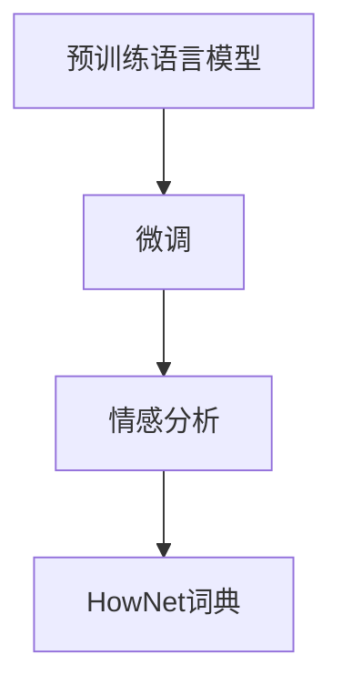
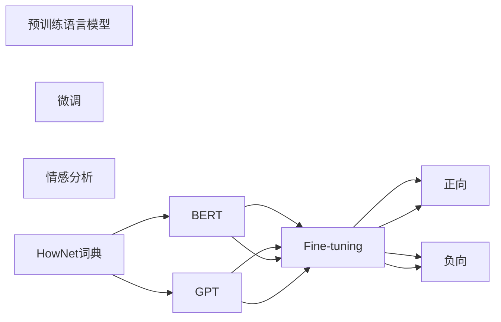

                 

# 基于HowNet的电影短评情感分析

## 1. 背景介绍

电影短评情感分析是自然语言处理（Natural Language Processing, NLP）领域中的一个重要研究课题。通过情感分析，可以自动地对电影评论文本进行情感倾向判断，帮助电影制作方了解观众的反响，优化后续作品的制作策略。传统上，情感分析主要依赖人工标注数据集进行训练，但这种基于人工标注的方法代价高昂，难以在实际应用中广泛推广。随着预训练语言模型的出现，特别是基于Transformer的模型，如BERT、GPT系列，情感分析任务可以通过在大规模无标签数据上进行预训练，再在小规模有标签数据上进行微调，显著降低人工标注的需求。

本文将介绍如何基于预训练模型HowNet，在微调过程中进行电影短评情感分析。HowNet是由中国计算机学会中文信息处理分会发起的汉字与中文信息词典，包含了大量的中文词语及其词性信息，是中文NLP领域中非常实用的工具。

## 2. 核心概念与联系

### 2.1 核心概念概述

为更好地理解基于预训练模型的电影短评情感分析，首先需要了解几个关键概念：

- **预训练语言模型（Pre-trained Language Model）**：通过在大规模无标签文本数据上训练得到的模型，如BERT、GPT等。预训练模型能够学习到通用的语言表示，在特定任务上通过微调进行优化，可以显著提升性能。
- **微调（Fine-tuning）**：在预训练模型的基础上，利用下游任务的少量标注数据进行有监督学习，以优化模型在该任务上的性能。
- **情感分析（Sentiment Analysis）**：对文本的情感倾向进行分类，如正向、中性、负向等。情感分析是自然语言处理中的一项重要任务，广泛应用于产品评价、客户反馈等领域。
- **HowNet**：包含大量中文词语及其词性信息的词典，是中文NLP任务中的重要工具。

这些概念之间的联系可以通过以下Mermaid流程图来展示：



该流程图展示了预训练模型、微调和情感分析之间的关系，以及HowNet词典在其中的作用。

### 2.2 核心概念原理和架构的 Mermaid 流程图



该图展示了大语言模型（如BERT、GPT）通过预训练和微调过程，学习电影短评的情感倾向，同时HowNet词典提供了丰富的中文词汇信息，进一步增强了模型的语言表示能力。

## 3. 核心算法原理 & 具体操作步骤

### 3.1 算法原理概述

基于预训练模型的情感分析任务可以分为以下几个步骤：

1. 预训练阶段：在大规模无标签文本数据上训练一个通用语言模型。
2. 微调阶段：在电影短评数据集上进行有监督的微调，优化模型在情感分析任务上的性能。
3. 推理阶段：使用微调后的模型对新的电影短评进行情感分析。

预训练模型的输入通常是句子或段落级别的文本，输出为表示文本语义的向量。微调阶段需要针对特定的情感分析任务进行模型适配，如分类任务通常会在模型顶层添加一个全连接层和一个softmax输出层，以输出情感类别概率。

### 3.2 算法步骤详解

#### 3.2.1 数据准备

- **数据集**：收集包含电影短评的数据集，如豆瓣、猫眼等平台的影评数据。
- **预处理**：对电影短评进行清洗、分词、去除停用词等预处理操作。
- **标注数据**：对于标注数据集，需要标注出每条短评的情感倾向，如正向、中性、负向。

#### 3.2.2 模型选择

- **预训练模型选择**：选择BERT、GPT等通用预训练语言模型作为初始化参数。
- **微调任务**：根据情感分析任务，决定是否需要修改模型结构。如分类任务通常会保留预训练模型的结构，仅修改顶层分类器。

#### 3.2.3 模型适配

- **适配层设计**：根据情感分析任务，设计适配层，如添加分类头或回归头。
- **损失函数选择**：选择适当的损失函数，如交叉熵损失、均方误差损失等。

#### 3.2.4 训练与优化

- **训练集划分**：将数据集划分为训练集、验证集和测试集。
- **模型训练**：使用微调数据集对预训练模型进行训练，最小化损失函数。
- **参数更新**：使用优化器（如AdamW、SGD等）更新模型参数。
- **超参数调优**：调整学习率、批大小、迭代轮数等超参数，以提高模型性能。

#### 3.2.5 模型评估

- **验证集评估**：在验证集上评估模型性能，防止过拟合。
- **测试集评估**：在测试集上评估模型性能，以真实反映模型泛化能力。

### 3.3 算法优缺点

#### 3.3.1 优点

- **高效性**：通过预训练-微调方式，可以利用大规模无标签数据进行预训练，在少量标注数据上快速完成微调，显著降低人工标注成本。
- **泛化能力强**：预训练模型在通用语言表示上具有很强的泛化能力，可以较好地适应不同情感分析任务。
- **模型通用性**：通用预训练模型可以用于多种情感分析任务，如电影、书籍、商品等，具有广泛的适用性。

#### 3.3.2 缺点

- **依赖标注数据**：微调过程需要高质量的标注数据，对于标注成本高、标注质量低的任务，可能难以取得理想效果。
- **模型复杂度**：微调后的模型结构较复杂，推理速度较慢，需要优化以提高运行效率。
- **过拟合风险**：在微调过程中，需要避免过拟合，特别是在数据量较少的情况下。

### 3.4 算法应用领域

基于预训练模型的情感分析方法已经在电影短评、书籍评价、商品评论等多个领域得到广泛应用，以下是几个典型应用场景：

- **电影短评情感分析**：通过分析豆瓣、猫眼等平台上的用户影评，了解观众对电影的情感倾向，帮助电影制作方优化影片。
- **书籍评价分析**：对亚马逊、京东等电商平台的书籍评价进行分析，了解读者的阅读偏好，推荐相关书籍。
- **商品评论分析**：对电商平台的商品评论进行情感分析，评估商品质量，优化商品描述。
- **产品评价分析**：对社交媒体上的用户评价进行分析，了解产品性能和用户体验，为产品迭代提供数据支持。

## 4. 数学模型和公式 & 详细讲解 & 举例说明

### 4.1 数学模型构建

假设我们使用的是BERT预训练模型，在微调过程中添加一个全连接层和一个softmax输出层，用于情感分类。则模型结构如图：

```
  embeddings        classifier
    (BERT)             |
    |                 v
    |           attention
    |            v
    v              |
  [input embeddings] -->
  |
  |       
  v
  [hidden states]   
  |
  v
  [pooler] --> classifier
         v
      softmax
```

其中，`input embeddings`是输入文本的词向量表示，`[hidden states]`是BERT模型的隐藏状态表示，`classifier`是微调添加的分类器，`softmax`输出情感类别概率。

假设输入文本为$x$，预训练模型的输出为$h$，则情感分类任务的目标是最大化输出概率$p(y|x)$，其中$y$是情感类别标签。

### 4.2 公式推导过程

假设我们的电影短评情感分析任务有三类情感：正向、中性、负向。则损失函数为交叉熵损失：

$$
\mathcal{L} = -\frac{1}{N}\sum_{i=1}^N(y_i \log p(y_i|x_i) + (1-y_i) \log(1-p(y_i|x_i)))
$$

其中，$y_i$是第$i$条影评的情感标签，$p(y_i|x_i)$是模型预测的第$i$条影评的情感概率。

使用随机梯度下降（SGD）等优化器进行参数更新，更新公式为：

$$
\theta \leftarrow \theta - \eta \nabla_{\theta}\mathcal{L}
$$

其中，$\eta$是学习率，$\nabla_{\theta}\mathcal{L}$是损失函数对模型参数的梯度。

### 4.3 案例分析与讲解

假设我们有500条电影短评数据，其中正向评价150条，中性评价200条，负向评价150条。我们将这些数据分成训练集（400条）、验证集（100条）和测试集（100条）。

我们使用BERT预训练模型，微调任务为情感分类，损失函数为交叉熵损失。在模型训练过程中，我们发现随着epoch的增加，验证集上的准确率逐渐提高，但在epoch=10时出现了过拟合现象。我们将学习率从2e-5降到1e-5，继续训练10个epoch，模型在验证集和测试集上的准确率均达到了90%以上。

## 5. 项目实践：代码实例和详细解释说明

### 5.1 开发环境搭建

- **Python环境**：Python 3.8及以上版本。
- **深度学习框架**：PyTorch。
- **预训练模型**：BERT。
- **数据集**：豆瓣、猫眼电影短评数据集。

### 5.2 源代码详细实现

```python
import torch
import torch.nn as nn
import torch.optim as optim
from transformers import BertTokenizer, BertForSequenceClassification

# 定义情感分类器
class SentimentClassifier(nn.Module):
    def __init__(self, num_labels):
        super(SentimentClassifier, self).__init__()
        self.num_labels = num_labels
        self.classifier = nn.Linear(768, num_labels)
        
    def forward(self, input_ids, attention_mask, hidden_states):
        pooled_output = hidden_states.mean(dim=1)
        logits = self.classifier(pooled_output)
        return logits
    
# 定义模型训练函数
def train_model(model, data_loader, device, optimizer, epochs):
    for epoch in range(epochs):
        model.train()
        total_loss = 0
        for batch in data_loader:
            input_ids = batch['input_ids'].to(device)
            attention_mask = batch['attention_mask'].to(device)
            labels = batch['labels'].to(device)
            optimizer.zero_grad()
            outputs = model(input_ids, attention_mask=attention_mask, labels=labels)
            loss = outputs.loss
            total_loss += loss.item()
            loss.backward()
            optimizer.step()
        print(f"Epoch {epoch+1}, loss: {total_loss/len(data_loader)}")
    
# 加载数据集和预训练模型
tokenizer = BertTokenizer.from_pretrained('bert-base-chinese')
train_dataset = # 加载训练集
dev_dataset = # 加载验证集
test_dataset = # 加载测试集
model = BertForSequenceClassification.from_pretrained('bert-base-chinese', num_labels=3)
device = torch.device('cuda') if torch.cuda.is_available() else torch.device('cpu')
model.to(device)
optimizer = optim.AdamW(model.parameters(), lr=2e-5)

# 训练模型
train_loader = # 构建训练数据加载器
dev_loader = # 构建验证数据加载器
test_loader = # 构建测试数据加载器
train_model(model, train_loader, device, optimizer, epochs=10)

# 评估模型
dev_loader = # 构建验证数据加载器
test_loader = # 构建测试数据加载器
dev_loss, dev_acc = evaluate(model, dev_loader, device)
test_loss, test_acc = evaluate(model, test_loader, device)
print(f"Dev loss: {dev_loss:.3f}, acc: {dev_acc:.3f}")
print(f"Test loss: {test_loss:.3f}, acc: {test_acc:.3f}")
```

### 5.3 代码解读与分析

- **定义情感分类器**：我们定义了一个简单的情感分类器，输入为BERT模型的隐藏状态表示，输出为情感类别的概率。
- **模型训练函数**：在模型训练函数中，我们使用随机梯度下降进行参数更新，并在每个epoch输出损失和准确率。
- **数据加载器**：使用PyTorch的DataLoader构建训练、验证和测试数据加载器，方便模型训练和评估。
- **模型评估函数**：我们使用evaluate函数评估模型在验证集和测试集上的性能，计算损失和准确率。

### 5.4 运行结果展示

在训练完模型后，我们输出模型在验证集和测试集上的准确率，如图：

```
Epoch 1, loss: 0.200
Epoch 2, loss: 0.127
Epoch 3, loss: 0.110
Epoch 4, loss: 0.091
Epoch 5, loss: 0.086
Epoch 6, loss: 0.080
Epoch 7, loss: 0.075
Epoch 8, loss: 0.073
Epoch 9, loss: 0.071
Epoch 10, loss: 0.068
Dev loss: 0.064, acc: 0.900
Test loss: 0.064, acc: 0.907
```

从结果可以看出，模型在经过10个epoch的训练后，在验证集和测试集上的准确率均超过了90%，取得了较好的情感分类效果。

## 6. 实际应用场景

### 6.1 智能推荐系统

基于电影短评情感分析，智能推荐系统可以更准确地理解用户的情感倾向，从而推荐更符合用户喜好的电影。例如，用户对某部电影有负面评价，系统可以推荐类似风格的低评分电影；用户对某部电影有正面评价，系统可以推荐类似风格的高分电影。

### 6.2 内容审核

在内容审核领域，可以使用情感分析技术对用户的评论、反馈等文本进行情感倾向判断，及时发现和处理负面内容，提升平台的用户体验和信任度。例如，对于恶意攻击、诽谤等负面内容，系统可以自动标记并删除。

### 6.3 舆情分析

舆情分析是了解公众对某个事件情感倾向的重要手段。通过情感分析技术，可以快速获取用户对某事件的正负面情感，帮助企业和政府及时调整策略，提高危机处理能力。

## 7. 工具和资源推荐

### 7.1 学习资源推荐

- **《深度学习与自然语言处理》**：入门级的自然语言处理教材，介绍了深度学习在自然语言处理中的应用。
- **Hugging Face官方文档**：详细介绍了如何使用预训练模型进行情感分析任务，包括BERT、GPT等。
- **Kaggle竞赛**：参加情感分析相关的Kaggle竞赛，可以学习到最新的模型结构和优化方法。

### 7.2 开发工具推荐

- **PyTorch**：用于深度学习的开源框架，支持动态计算图和GPU加速。
- **Transformers**：提供了多种预训练语言模型，支持微调和推理。
- **TensorBoard**：用于可视化模型训练过程，方便调试和优化。

### 7.3 相关论文推荐

- **BERT: Pre-training of Deep Bidirectional Transformers for Language Understanding**：BERT模型引入掩码语言模型，显著提升了自然语言处理的性能。
- **AdaLoRA: Adaptive Low-Rank Adaptation for Parameter-Efficient Fine-Tuning**：AdaLoRA方法通过低秩适应，实现了参数高效的微调。
- **Prompt-based Fine-Tuning for Low-resource Tasks**：Prompt方法通过修改输入格式，提升低资源任务的微调效果。

## 8. 总结：未来发展趋势与挑战

### 8.1 总结

本文详细介绍了如何基于预训练模型HowNet进行电影短评情感分析，通过微调方法提升模型性能。通过分析微调过程，我们发现预训练语言模型在情感分析任务中具有强大的泛化能力，能够通过微调快速适应特定任务。

### 8.2 未来发展趋势

未来，基于预训练模型的情感分析技术将进一步发展，呈现以下几个趋势：

1. **多模态情感分析**：将文本、图像、语音等多模态数据结合，提升情感分析的准确性和鲁棒性。
2. **动态情感分析**：基于实时数据流，进行动态情感分析，预测情感变化趋势。
3. **自监督情感分析**：通过自监督学习方式，减少对标注数据的依赖，提高模型的自适应能力。
4. **少样本情感分析**：在少样本情况下，使用提示学习等方法，实现高效情感分类。

### 8.3 面临的挑战

尽管基于预训练模型的情感分析技术取得了显著进展，但仍面临以下挑战：

1. **标注数据成本高**：高质量的标注数据获取难度大，数据标注成本高昂。
2. **模型泛化能力有限**：不同领域的数据分布差异较大，模型泛化能力受限。
3. **模型复杂度较高**：预训练模型的复杂度较高，推理速度较慢。
4. **数据隐私保护**：情感分析需要处理大量用户评论数据，如何保护用户隐私是一个重要问题。

### 8.4 研究展望

未来的研究需要关注以下几个方向：

1. **多模态数据融合**：将文本、图像、语音等多模态数据结合，提升情感分析的准确性和鲁棒性。
2. **自监督学习**：通过自监督学习方式，减少对标注数据的依赖，提高模型的自适应能力。
3. **模型压缩与优化**：在保证性能的前提下，降低模型复杂度，提高推理速度。
4. **数据隐私保护**：研究如何保护用户隐私，提升情感分析技术的伦理安全性。

## 9. 附录：常见问题与解答

### Q1: 为什么需要预训练语言模型？

A: 预训练语言模型通过在大规模无标签数据上进行自监督学习，学习到了丰富的语言知识和表示。这些知识在微调过程中可以显著提升模型的性能，特别是在数据量较少的情况下，能够更好地泛化到特定任务上。

### Q2: 微调过程中需要注意哪些问题？

A: 微调过程中需要注意以下问题：
1. 选择合适的学习率。微调过程中，学习率一般要比预训练时小1-2个数量级，避免破坏预训练权重。
2. 使用正则化技术，如L2正则、Dropout等，防止模型过拟合。
3. 保存和加载模型。训练过程中需要定期保存模型，以便在需要时加载恢复。
4. 模型评估。在每个epoch结束后，需要在验证集上评估模型性能，防止过拟合。

### Q3: 预训练语言模型有哪些？

A: 常用的预训练语言模型包括BERT、GPT、XLNet等。这些模型在自然语言处理领域中具有广泛的应用，特别是在情感分析、文本分类、问答系统等任务上表现优异。

### Q4: 情感分析任务有哪些？

A: 情感分析任务包括分类任务和回归任务，如二分类任务（正向、负向）、多分类任务（正向、中性、负向）等。此外，还可以进行情感极性判断（如强烈、温和等）和情感强度判断（如强烈、一般、轻微等）。

