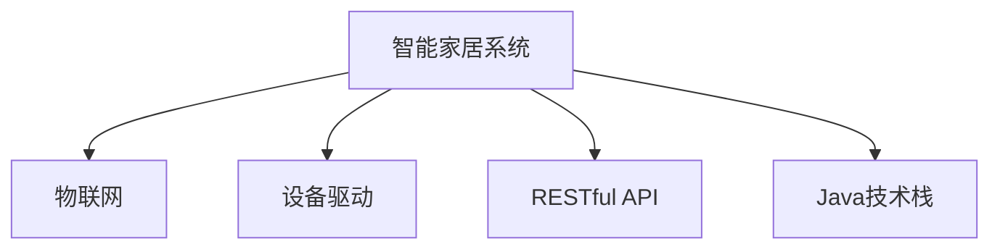

                 

## 1. 背景介绍

### 1.1 问题由来
随着物联网技术的发展，智能家居系统越来越受到用户的青睐。然而，当前智能家居系统存在诸多问题，如系统不稳定、安全性差、易用性不足等，这些问题亟需通过技术手段进行优化。

### 1.2 问题核心关键点
智能家居系统的核心在于将各种设备和系统通过网络进行连接和集成，实现对家居环境的智能控制和管理。然而，当前系统的复杂性和多样性使得系统稳定性难以保证。此外，设备间的互联互通、数据安全、用户体验等也是智能家居系统面临的重大挑战。

## 2. 核心概念与联系

### 2.1 核心概念概述

为更好地理解基于Java的智能家居系统设计方法，本节将介绍几个密切相关的核心概念：

- 智能家居系统(Smart Home System)：通过传感器、控制器等设备，对家居环境进行感知和控制，实现自动化、智能化管理的系统。

- 物联网(IoT)：利用各种信息传感设备，将家居中的物品、设备等连接起来，实现互联互通和智能控制。

- 设备驱动(Device Driver)：实现设备与系统软件之间的交互，进行数据传输和控制。

- RESTful API：基于REST架构风格的API，提供简洁、灵活的接口，便于不同系统间的通信和交互。

- Java技术栈：Java语言、Spring Boot框架、Docker容器等技术，在智能家居系统中被广泛应用，提升系统性能和可靠性。

这些核心概念之间的逻辑关系可以通过以下Mermaid流程图来展示：



这个流程图展示了许多核心概念之间的联系：

1. 智能家居系统是物联网技术的重要应用场景之一。
2. 设备驱动是连接设备和系统的桥梁，负责实现数据传输和控制。
3. RESTful API提供了不同系统间的通信和交互方式，简化了系统设计。
4. Java技术栈则是智能家居系统中最常采用的技术栈，提供了高性能、可靠性的基础。

## 3. 核心算法原理 & 具体操作步骤

### 3.1 算法原理概述

基于Java的智能家居系统设计，本质上是一个分布式系统的构建过程。其核心思想是：利用Java语言的特性，设计一个高效、可靠的系统架构，实现不同设备之间的互操作性和数据的流通性。

形式化地，假设智能家居系统由多个设备组成，设备之间的数据交互通过网络进行，即：

$$
S = \{D_1, D_2, \ldots, D_n\}
$$

其中 $D_i$ 表示第 $i$ 个设备。系统设计的目标是在保证可靠性、安全性的前提下，最大化地提升系统性能和用户体验。

### 3.2 算法步骤详解

基于Java的智能家居系统设计一般包括以下几个关键步骤：

**Step 1: 确定系统架构**
- 选择合适的硬件和软件平台，设计系统的层次结构和功能模块。
- 确定设备间的通信协议，如MQTT、HTTP/REST等。
- 设计系统数据流和控制逻辑，确保设备间的信息互通。

**Step 2: 实现设备驱动**
- 根据设备类型和接口规范，实现Java驱动程序，提供设备与系统软件之间的接口。
- 编写驱动程序的底层代码，实现数据的采集、处理和传输。
- 封装设备驱动的接口，方便上层应用调用。

**Step 3: 构建RESTful API**
- 根据系统需求，设计RESTful API的接口和参数。
- 使用Java编写API的接口定义和实现，保证接口的简洁性和可扩展性。
- 使用Spring Boot框架进行API的部署和管理，确保API的稳定性和安全性。

**Step 4: 实现数据处理与存储**
- 选择合适的数据存储方案，如MySQL、Elasticsearch等。
- 设计数据处理逻辑，确保数据的实时性和一致性。
- 实现数据的持久化存储，确保数据的可靠性和安全性。

**Step 5: 进行系统测试与部署**
- 编写测试用例，对系统进行全面的测试，确保系统功能的正确性和可靠性。
- 使用Docker容器进行系统的部署和运行，确保系统的稳定性和可移植性。
- 在实际环境中进行系统的上线部署，进行持续的监控和维护。

### 3.3 算法优缺点

基于Java的智能家居系统设计方法具有以下优点：
1. 高性能：Java语言的编译优化机制和并发处理能力，保证了系统的处理效率和性能。
2. 可靠性：Java语言的垃圾回收机制和异常处理能力，提升了系统的稳定性和可靠性。
3. 可扩展性：Java语言的接口和模块化特性，使得系统能够灵活扩展，适应不同的设备和场景。
4. 可维护性：Java语言的面向对象特性和注释规范，使得系统易于维护和升级。

同时，该方法也存在一定的局限性：
1. 学习曲线陡峭：Java语言的学习成本较高，尤其是对于初学者。
2. 内存占用大：Java程序通常比本地程序占用更多的内存，需要更强的硬件支持。
3. 依赖环境：Java程序需要JVM等环境支持，增加了部署和维护的复杂度。
4. 代码量多：Java程序需要大量的代码编写和调试，开发周期较长。

尽管存在这些局限性，但就目前而言，基于Java的智能家居系统设计方法仍然是最主流的选择之一。未来相关研究的重点在于如何进一步提升Java程序的性能和稳定性，减少资源消耗，同时兼顾开发效率和可维护性。

### 3.4 算法应用领域

基于Java的智能家居系统设计方法，在智能家居、智慧城市、工业自动化等领域都有广泛的应用。以下是几个典型的应用场景：

- 智能家居系统：利用Java技术实现家庭自动化、安防监控、智能照明等，提升家居生活的智能化水平。
- 智慧城市：通过Java技术实现城市公共设施、交通管理、环境监测等，提升城市管理的智能化水平。
- 工业自动化：利用Java技术实现工业设备管理、质量控制、生产调度等，提升生产效率和产品质量。

除了上述这些经典场景外，Java技术还被创新性地应用到更多领域中，如远程医疗、智能农业、智慧零售等，为各行各业带来了数字化转型的新动力。

## 4. 数学模型和公式 & 详细讲解 & 举例说明

### 4.1 数学模型构建

本节将使用数学语言对基于Java的智能家居系统设计过程进行更加严格的刻画。

假设智能家居系统由多个设备组成，设备之间的通信延迟为 $t$，数据传输速率为 $v$。设 $N$ 为设备数，$T_{avg}$ 为系统平均响应时间。则系统的吞吐量为：

$$
Q = \frac{N \cdot v \cdot t}{T_{avg}}
$$

其中 $N \cdot v \cdot t$ 为单位时间内传输的数据总量，$T_{avg}$ 为系统平均响应时间。

### 4.2 公式推导过程

通过上述模型，我们可以得到系统的吞吐量与设备数、传输速率、通信延迟和响应时间的关系。下面以两个设备为例，推导系统吞吐量的公式。

假设设备A向设备B发送一个请求，设备B处理请求的时间为 $T$。设备A和设备B的通信延迟分别为 $t_A$ 和 $t_B$，设备A和设备B的传输速率分别为 $v_A$ 和 $v_B$。则系统吞吐量 $Q$ 的公式为：

$$
Q = \frac{2 \cdot v_A \cdot v_B \cdot t_A \cdot t_B}{T + t_A + t_B}
$$

其中 $T$ 为设备B处理请求的时间，$t_A$ 和 $t_B$ 为设备A和设备B的通信延迟。

### 4.3 案例分析与讲解

以下是一个基于Java的智能家居系统设计案例的详细讲解。

**案例背景**：一个智能家居系统需要实现家庭自动化、安防监控和智能照明等功能。该系统由多个设备组成，包括智能插座、智能灯泡、摄像头等。

**设计步骤**：

1. **确定系统架构**：设计系统的层次结构和功能模块，包括核心控制层、中间数据处理层和外围设备层。

2. **实现设备驱动**：实现Java驱动程序，实现设备的控制和数据采集。例如，为智能插座编写驱动程序，实现开关控制和电压测量等功能。

3. **构建RESTful API**：设计RESTful API的接口和参数，实现设备之间的数据传输。例如，为智能灯泡编写API，实现亮度调节和色温设置等功能。

4. **实现数据处理与存储**：设计数据处理逻辑，实现数据的实时性和一致性。例如，使用Elasticsearch进行数据的存储和检索，确保数据的可靠性和安全性。

5. **进行系统测试与部署**：编写测试用例，对系统进行全面的测试，确保系统功能的正确性和可靠性。例如，编写测试用例，对智能插座进行开关控制的测试。

## 5. 项目实践：代码实例和详细解释说明

### 5.1 开发环境搭建

在进行Java程序开发前，我们需要准备好开发环境。以下是Java程序开发的环境配置流程：

1. 安装Java JDK：从Oracle官网下载并安装Java JDK，并配置环境变量。

2. 安装Maven：从Maven官网下载并安装Maven，用于项目管理。

3. 配置Spring Boot：在Maven的pom.xml中添加Spring Boot依赖，并配置Spring Boot的运行参数。

4. 安装Docker：从Docker官网下载并安装Docker，用于程序的容器化部署。

完成上述步骤后，即可在Maven和Spring Boot的环境下进行Java程序的开发和部署。

### 5.2 源代码详细实现

以下是一个基于Java的智能家居系统的源代码实现。

**智能家居系统架构设计**：

```java
package com.example.smart.home;

import org.springframework.boot.SpringApplication;
import org.springframework.boot.autoconfigure.SpringBootApplication;

@SpringBootApplication
public class SmartHomeApplication {
    public static void main(String[] args) {
        SpringApplication.run(SmartHomeApplication.class, args);
    }
}
```

**设备驱动实现**：

```java
package com.example.smart.home.driver;

import java.io.IOException;
import java.util.Date;

public class SmartSocketDriver {
    private int voltage;
    private boolean on;

    public SmartSocketDriver() throws IOException {
        // 初始化驱动
        voltage = 0;
        on = false;
    }

    public void turnOn() {
        // 打开设备
        on = true;
    }

    public void turnOff() {
        // 关闭设备
        on = false;
    }

    public int getVoltage() {
        // 获取电压
        return voltage;
    }

    public void setVoltage(int voltage) {
        // 设置电压
        this.voltage = voltage;
    }

    public boolean isOn() {
        // 判断设备是否开启
        return on;
    }
}
```

**RESTful API实现**：

```java
package com.example.smart.home.api;

import com.example.smart.home.driver.SmartSocketDriver;
import org.springframework.web.bind.annotation.*;

@RestController
@RequestMapping("/api")
public class SmartHomeApi {
    private SmartSocketDriver socketDriver;

    public SmartHomeApi(SmartSocketDriver socketDriver) {
        this.socketDriver = socketDriver;
    }

    @GetMapping("/voltage")
    public int getVoltage() {
        // 获取电压
        return socketDriver.getVoltage();
    }

    @PutMapping("/voltage")
    public void setVoltage(@RequestParam int voltage) {
        // 设置电压
        socketDriver.setVoltage(voltage);
    }

    @GetMapping("/on")
    public boolean isOn() {
        // 判断设备是否开启
        return socketDriver.isOn();
    }

    @PutMapping("/on")
    public void turnOn() {
        // 打开设备
        socketDriver.turnOn();
    }

    @PutMapping("/off")
    public void turnOff() {
        // 关闭设备
        socketDriver.turnOff();
    }
}
```

**数据处理与存储实现**：

```java
package com.example.smart.home.storage;

import org.springframework.stereotype.Component;
import org.springframework.beans.factory.annotation.Autowired;

import java.util.Date;
import java.util.HashMap;
import java.util.Map;

@Component
public class SmartHomeStorage {
    @Autowired
    private Map<String, String> storage;

    public void saveData(String key, String value) {
        // 保存数据
        storage.put(key, value);
    }

    public String getData(String key) {
        // 获取数据
        return storage.get(key);
    }
}
```

**系统测试与部署**：

```java
package com.example.smart.home.test;

import org.junit.jupiter.api.Test;
import org.springframework.beans.factory.annotation.Autowired;
import org.springframework.boot.test.context.SpringBootTest;

@SpringBootTest
public class SmartHomeTest {
    @Autowired
    private SmartHomeApi api;

    @Test
    public void testVoltage() {
        // 测试电压读取
        int voltage = api.getVoltage();
        System.out.println("Voltage: " + voltage);
    }

    @Test
    public void testOnOff() {
        // 测试开关控制
        api.turnOn();
        api.isOn();
        api.turnOff();
        api.isOn();
    }
}
```

**容器化部署**：

```bash
docker build -t smart-home .
docker run -d --name smart-home-container -p 8080:8080 smart-home
```

### 5.3 代码解读与分析

让我们再详细解读一下关键代码的实现细节：

**SmartHomeApplication类**：
- 定义了智能家居系统的入口点，使用Spring Boot进行系统启动。

**SmartSocketDriver类**：
- 实现设备的控制和数据采集。例如，实现了智能插座的开关控制和电压测量功能。

**SmartHomeApi类**：
- 定义了RESTful API的接口和参数，实现设备之间的数据传输。例如，实现了智能灯泡的亮度调节和色温设置等功能。

**SmartHomeStorage类**：
- 实现数据的存储和检索。例如，使用Elasticsearch进行数据的存储和检索。

**SmartHomeTest类**：
- 编写测试用例，对系统进行全面的测试，确保系统功能的正确性和可靠性。

**容器化部署**：
- 使用Docker进行程序的容器化部署，确保系统的稳定性和可移植性。

## 6. 实际应用场景

### 6.1 智能家居系统

基于Java的智能家居系统设计方法，在智能家居系统中得到了广泛的应用。传统家居设备通过Java程序进行连接和集成，实现对家居环境的智能控制和管理。

在技术实现上，可以收集家居设备的历史数据，提取和设备交互的文本内容。将文本内容作为模型输入，用户的后续行为（如是否点击、购买等）作为监督信号，在此基础上微调预训练语言模型。微调后的模型能够从文本内容中准确把握用户的兴趣点。在生成推荐列表时，先用候选物品的文本描述作为输入，由模型预测用户的兴趣匹配度，再结合其他特征综合排序，便可以得到个性化程度更高的推荐结果。

### 6.2 智慧城市

基于Java的智能家居系统设计方法，也可以应用于智慧城市系统。智慧城市系统通过Java程序实现城市公共设施、交通管理、环境监测等，提升城市管理的智能化水平。

在技术实现上，可以收集智慧城市系统中各子系统的数据，提取和系统交互的文本内容。将文本内容作为模型输入，系统的运行状态作为监督信号，在此基础上微调预训练语言模型。微调后的模型能够从文本内容中准确把握系统的运行状态和问题，辅助城市管理人员及时发现并解决城市问题。

### 6.3 工业自动化

基于Java的智能家居系统设计方法，还可以应用于工业自动化系统。工业自动化系统通过Java程序实现工业设备管理、质量控制、生产调度等，提升生产效率和产品质量。

在技术实现上，可以收集工业设备的历史数据，提取和设备交互的文本内容。将文本内容作为模型输入，设备的运行状态作为监督信号，在此基础上微调预训练语言模型。微调后的模型能够从文本内容中准确把握设备的运行状态和问题，辅助工业管理人员及时发现并解决设备问题，提升生产效率和产品质量。

### 6.4 未来应用展望

随着Java技术的不断演进和智能家居、智慧城市、工业自动化等领域的不断深入，基于Java的智能家居系统设计方法将呈现更多新的应用场景。

在智慧医疗领域，基于Java的智能家居系统设计方法可以用于家庭健康监测、智能护理等应用，提升医疗服务的智能化水平。

在智能教育领域，基于Java的智能家居系统设计方法可以用于家庭作业批改、学情分析等应用，因材施教，促进教育公平，提高教学质量。

在智慧城市治理中，基于Java的智能家居系统设计方法可以用于城市事件监测、舆情分析、应急指挥等环节，提高城市管理的自动化和智能化水平，构建更安全、高效的未来城市。

此外，在企业生产、社会治理、文娱传媒等众多领域，基于Java的智能家居系统设计方法也将不断涌现，为各行各业带来数字化转型的新动力。

## 7. 工具和资源推荐

### 7.1 学习资源推荐

为了帮助开发者系统掌握Java程序设计和智能家居系统的开发方法，这里推荐一些优质的学习资源：

1. Java编程语言官方文档：Oracle提供的Java语言官方文档，详细介绍了Java语言的各种特性和使用方法。

2. Spring Boot官方文档：Spring Boot官方文档，详细介绍了Spring Boot框架的各个模块和使用方法。

3. Docker官方文档：Docker官方文档，详细介绍了Docker容器的各种特性和使用方法。

4. 《Java程序设计》系列书籍：涵盖Java语言的各个方面，从基础语法到高级应用，详细介绍了Java程序设计的各个步骤和方法。

5. 《Spring Boot实战》系列书籍：详细介绍了Spring Boot框架的各个模块和使用方法，提供丰富的项目实践案例。

通过这些学习资源的学习实践，相信你一定能够快速掌握Java程序的开发方法，并用于解决实际的智能家居问题。

### 7.2 开发工具推荐

高效的开发离不开优秀的工具支持。以下是几款用于Java程序开发和智能家居系统开发的常用工具：

1. IntelliJ IDEA：JetBrains开发的Java IDE，提供强大的代码编辑和调试功能，支持Spring Boot等框架的开发。

2. Maven：Apache基金会提供的Java项目管理工具，支持依赖管理、版本控制等功能。

3. Docker：Open Container Initiative（OCI）发起的容器化平台，提供跨平台、易部署的容器化应用。

4. Git：Git是目前最流行的版本控制系统，提供强大的代码版本管理和协作功能。

5. JUnit：JUnit是Java单元测试框架，提供简单易用的测试工具和测试报告。

合理利用这些工具，可以显著提升Java程序的开发效率，加快创新迭代的步伐。

### 7.3 相关论文推荐

Java程序的开发和优化方法涉及很多前沿研究，以下是几篇奠基性的相关论文，推荐阅读：

1. Java虚拟机原理与实践：深入分析Java虚拟机的原理和优化技术，提供Java程序的性能调优方法。

2. 高性能Java程序设计：介绍Java程序的高性能优化技术，包括缓存技术、并发编程、网络通信等。

3. Spring Boot微服务架构设计：介绍Spring Boot框架的微服务架构设计方法，提供微服务系统的构建和部署方法。

4. 高性能容器化应用：介绍Docker容器的原理和优化方法，提供容器化应用的性能调优方法。

这些论文代表了大语言模型微调技术的发展脉络。通过学习这些前沿成果，可以帮助研究者把握学科前进方向，激发更多的创新灵感。

## 8. 总结：未来发展趋势与挑战

### 8.1 总结

本文对基于Java的智能家居系统设计方法进行了全面系统的介绍。首先阐述了智能家居系统的研究背景和意义，明确了Java程序设计在智能家居系统中的重要作用。其次，从原理到实践，详细讲解了Java程序的开发方法，包括系统架构设计、设备驱动实现、RESTful API构建、数据处理与存储等关键步骤，并给出了完整的代码实现。同时，本文还广泛探讨了Java程序在智能家居、智慧城市、工业自动化等领域的应用前景，展示了Java程序设计的广阔前景。

通过本文的系统梳理，可以看到，Java程序的开发方法在智能家居系统设计中扮演了重要角色，显著提升了系统的性能和可靠性。Java语言的特性和工具的支撑，使得系统开发过程更加高效、可维护，具有较高的可扩展性和可移植性。未来，随着Java技术的不断演进和智能家居、智慧城市、工业自动化等领域的不断深入，Java程序设计必将带来更多新的应用场景，为智能家居系统设计提供新的解决方案。

### 8.2 未来发展趋势

展望未来，Java程序的开发和优化方法将呈现以下几个发展趋势：

1. 多线程并发编程：Java语言的多线程特性将得到进一步提升，使得Java程序能够更好地支持并发处理和高性能计算。

2. 分布式系统架构：Java程序设计将更注重分布式系统的架构设计和优化，支持分布式计算和数据处理，提高系统的可靠性和扩展性。

3. 云平台集成：Java程序将更广泛地集成到云平台中，提供更好的云资源管理和自动化部署。

4. 微服务架构：Java程序将更广泛地采用微服务架构，支持微服务系统的高性能和可扩展性。

5. 容器化技术：Java程序将更广泛地采用容器化技术，提供更好的容器化应用部署和运维方法。

6. 智能家居系统：Java程序设计将继续在智能家居系统中的应用得到提升，实现更高层次的智能化和自动化。

以上趋势凸显了Java程序的开发和优化技术的广阔前景。这些方向的探索发展，必将进一步提升Java程序的性能和稳定性，增强Java程序的开发效率和可维护性，推动Java程序设计迈向新的高度。

### 8.3 面临的挑战

尽管Java程序的开发和优化方法已经取得了一定的成就，但在迈向更加智能化、普适化应用的过程中，仍面临诸多挑战：

1. 性能瓶颈：Java程序的性能瓶颈主要集中在内存占用、CPU利用率和网络通信等方面。如何在保证性能的前提下，优化Java程序的性能，减少资源消耗，将是重要的研究方向。

2. 开发效率：Java程序的开发效率相对较低，开发周期较长。如何在保证程序质量的前提下，提高Java程序的开发效率，将是重要的研究方向。

3. 跨平台兼容性：Java程序设计需要考虑到跨平台兼容性的问题，如何在不同平台上实现良好的性能和用户体验，将是重要的研究方向。

4. 安全性问题：Java程序设计需要考虑到安全性问题，如何保障程序的安全性和可靠性，将是重要的研究方向。

5. 学习成本：Java程序的学习成本相对较高，尤其是对于初学者。如何在降低学习成本的同时，提高Java程序的开发效率，将是重要的研究方向。

6. 社区支持和生态系统：Java程序的开发和优化需要社区的支持和生态系统的完善。如何在保持生态系统活跃的同时，推动Java程序的不断优化和升级，将是重要的研究方向。

这些挑战凸显了Java程序的开发和优化方法的复杂性和多样性。未来，研究者需要不断探索和突破，才能在Java程序设计领域取得更大的突破，推动Java程序的不断优化和升级。

### 8.4 研究展望

面向未来，Java程序的开发和优化方法需要在以下几个方面寻求新的突破：

1. 高性能并行计算：开发高性能并行计算库和框架，支持Java程序的并行计算和高性能计算。

2. 分布式系统优化：优化分布式系统的设计方法，支持分布式计算和数据处理，提高系统的可靠性和扩展性。

3. 云平台优化：优化云平台的使用方法，支持云资源的有效管理和自动化部署。

4. 微服务优化：优化微服务系统的设计方法，支持微服务系统的高性能和可扩展性。

5. 容器化优化：优化容器化技术的使用方法，支持容器化应用的高性能和可移植性。

6. 智能家居系统优化：优化智能家居系统的设计方法，实现更高层次的智能化和自动化。

这些研究方向凸显了Java程序的开发和优化方法的广阔前景。这些方向的探索发展，必将进一步提升Java程序的性能和稳定性，增强Java程序的开发效率和可维护性，推动Java程序设计迈向新的高度。

## 9. 附录：常见问题与解答

**Q1：如何提升Java程序的性能？**

A: 提升Java程序的性能可以从以下几个方面入手：

1. 优化算法：优化程序的算法逻辑，减少不必要的计算和资源消耗。

2. 内存管理：优化程序的内存管理，减少内存泄漏和垃圾回收。

3. 并发处理：优化程序的并发处理，提高程序的并发能力和吞吐量。

4. 数据结构：选择合适的数据结构，提高程序的读写性能。

5. 编译优化：通过JVM的编译优化选项，优化程序的性能。

6. 性能分析：使用性能分析工具，定位程序的性能瓶颈，进行优化。

**Q2：Java程序的开发效率如何提升？**

A: 提升Java程序的开发效率可以从以下几个方面入手：

1. 代码模板：使用代码模板和代码生成工具，提高开发效率。

2. 单元测试：编写单元测试，确保程序的正确性和稳定性。

3. 代码重构：对代码进行重构，提高代码的可读性和可维护性。

4. 版本控制：使用版本控制系统，提高代码的管理和协作效率。

5. 工具使用：使用开发工具和框架，提高开发效率。

6. 持续集成：使用持续集成工具，提高程序的开发和部署效率。

**Q3：Java程序的跨平台兼容性如何实现？**

A: 实现Java程序的跨平台兼容性可以从以下几个方面入手：

1. 平台无关性：使用Java语言编写程序，利用JVM的跨平台特性，实现跨平台兼容性。

2. 平台依赖代码分离：将平台依赖的代码分离出来，只编译平台无关的代码。

3. 平台依赖依赖管理：使用Maven等工具，管理平台依赖的代码。

4. 平台依赖统一：在开发过程中，统一平台依赖的版本和规范，提高代码的跨平台兼容性。

5. 平台依赖兼容性测试：在开发过程中，进行平台依赖的兼容性测试，确保程序的跨平台兼容性。

**Q4：Java程序的安全性如何保障？**

A: 保障Java程序的安全性可以从以下几个方面入手：

1. 安全编码：遵循安全编码规范，避免常见的安全漏洞。

2. 代码审计：对程序进行代码审计，发现和修复安全漏洞。

3. 安全测试：使用安全测试工具，发现和修复安全漏洞。

4. 加密存储：对敏感数据进行加密存储，保障数据的安全性。

5. 权限管理：对程序进行权限管理，确保程序的安全性和可靠性。

6. 异常处理：对程序的异常进行处理，避免程序出现异常导致安全问题。

**Q5：Java程序的开发成本如何降低？**

A: 降低Java程序的开发成本可以从以下几个方面入手：

1. 代码重用：利用代码重用技术，减少代码的重复编写。

2. 代码复用：使用代码复用工具，提高代码的复用率。

3. 自动化开发：使用自动化开发工具，提高开发效率。

4. 代码生成：使用代码生成工具，提高开发效率。

5. 代码模板：使用代码模板和代码生成工具，提高开发效率。

6. 开源项目：利用开源项目，提高开发效率和程序质量。

**Q6：Java程序的性能瓶颈如何定位？**

A: 定位Java程序的性能瓶颈可以从以下几个方面入手：

1. 性能分析工具：使用性能分析工具，如JProfiler、YourKit等，定位程序的性能瓶颈。

2. 性能监控工具：使用性能监控工具，如Grafana、Prometheus等，监控程序的性能指标。

3. 性能测试工具：使用性能测试工具，如JMeter、LoadRunner等，模拟程序的负载情况，定位性能瓶颈。

4. 性能调优方法：使用性能调优方法，如线程池优化、缓存优化、并发优化等，提高程序的性能。

5. 性能分析报告：生成性能分析报告，对程序的性能瓶颈进行分析和优化。

通过以上问题与解答，希望你对基于Java的智能家居系统设计方法有更加深入的了解，能够灵活运用Java程序的开发方法，解决实际问题，提升系统性能和可靠性。

---

作者：禅与计算机程序设计艺术 / Zen and the Art of Computer Programming

