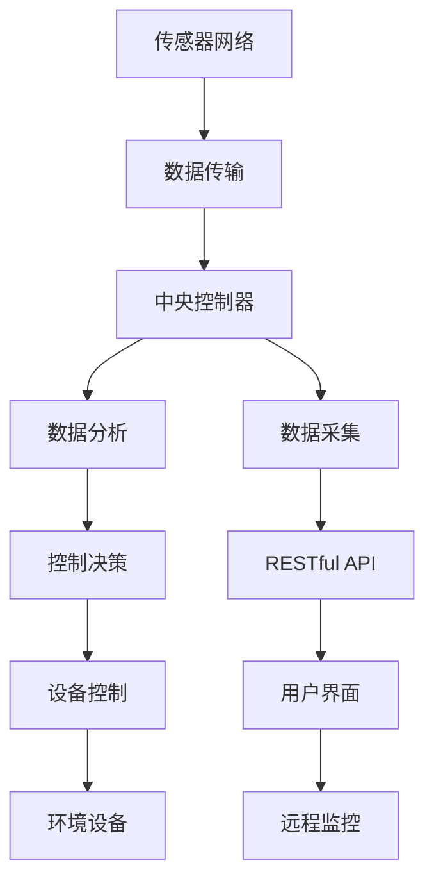

                 

# 基于MQTT协议和RESTful API的婴幼儿看护智能家居解决方案

## 1. 背景介绍

近年来，随着科技的不断进步和物联网的迅速发展，智能家居系统逐渐进入人们的日常生活。特别是在婴幼儿看护领域，智能家居系统能够帮助家长们随时随地监控婴儿的健康状况和环境状况，从而提供更加安全、便捷的看护方式。

本项目旨在开发一套基于MQTT协议和RESTful API的婴幼儿看护智能家居解决方案，实现对婴儿房间环境的全面监控，包括温度、湿度、光照、噪音、睡眠质量等，并通过用户友好的界面向家长提供实时数据反馈，使得家长能够远程控制环境设备，确保婴儿的健康成长。

## 2. 核心概念与联系

### 2.1 核心概念概述

本解决方案涉及以下几个核心概念：

- MQTT（Message Queuing Telemetry Transport）：一种轻量级、高可靠性、基于发布/订阅模式的通信协议，适用于物联网设备和传感器数据的实时传输。
- RESTful API：一种基于HTTP协议，通过统一资源标识符（URI）、HTTP动词和状态码等方式实现客户端与服务端通信的架构风格，适用于智能家居系统的数据交互。
- 婴幼儿看护系统：结合智能家居技术和物联网设备，实现对婴幼儿房间环境的监控和管理，并提供实时数据反馈的系统。
- 传感器网络：由各种传感器组成的分布式网络，用于实时监测房间环境的各种参数，如温度、湿度、光照等。
- 中央控制器：负责处理来自传感器的数据，并进行分析和控制决策的中央设备。
- 用户界面：通过友好的界面向家长展示实时数据和控制选项，方便家长进行远程操作。

这些核心概念之间通过MQTT协议和RESTful API进行数据交换和命令执行，形成了一个高效、可靠、灵活的婴幼儿看护智能家居解决方案。

### 2.2 核心概念原理和架构的 Mermaid 流程图



上述流程图展示了基于MQTT协议和RESTful API的婴幼儿看护智能家居解决方案的核心架构：

1. **传感器网络**：负责采集房间环境的各种参数，并通过MQTT协议将数据传输到中央控制器。
2. **数据传输**：通过MQTT协议进行数据交换，确保数据传输的可靠性和实时性。
3. **中央控制器**：接收传感器数据，进行数据分析和控制决策，并通过RESTful API将数据反馈到用户界面。
4. **数据分析**：对传感器数据进行处理和分析，提取有用的信息。
5. **控制决策**：根据分析结果，决定是否需要调整环境设备，以及如何进行调整。
6. **设备控制**：通过RESTful API将控制命令发送给环境设备，如加热器、加湿器、窗帘等。
7. **环境设备**：根据控制命令，调整房间环境参数，确保婴儿的健康和舒适。
8. **数据采集**：通过RESTful API从中央控制器获取实时数据，并在用户界面中展示。
9. **用户界面**：通过友好的界面向家长展示实时数据和控制选项，方便家长进行远程操作。
10. **远程监控**：家长可以通过互联网远程监控婴儿房间的环境状况，并进行控制。

## 3. 核心算法原理 & 具体操作步骤

### 3.1 算法原理概述

本解决方案的核心算法原理基于MQTT协议和RESTful API，通过这两种技术实现数据交换和命令执行。其核心步骤如下：

1. 通过传感器网络采集房间环境的各种参数，如温度、湿度、光照、噪音等。
2. 将采集到的数据通过MQTT协议传输到中央控制器。
3. 中央控制器对接收到的数据进行处理和分析，提取有用的信息。
4. 根据分析结果，决定是否需要调整环境设备，以及如何进行调整。
5. 通过RESTful API将调整命令发送给环境设备，如加热器、加湿器、窗帘等。
6. 将实时数据和控制选项通过RESTful API传输到用户界面，供家长远程监控。

### 3.2 算法步骤详解

#### 3.2.1 传感器网络数据采集

传感器网络是婴幼儿看护智能家居解决方案的基础。在房间内部署各种传感器，如温度传感器、湿度传感器、光照传感器、噪音传感器、睡眠监测器等，实时采集房间环境的各种参数。传感器网络通过MQTT协议将采集到的数据传输到中央控制器。

#### 3.2.2 MQTT协议数据传输

MQTT协议是一种轻量级、高可靠性的通信协议，适用于物联网设备和传感器数据的实时传输。传感器网络将采集到的数据通过MQTT协议传输到中央控制器，确保数据传输的实时性和可靠性。

#### 3.2.3 中央控制器数据分析和控制决策

中央控制器是解决方案的核心，负责接收传感器数据，进行数据分析和控制决策。通过对采集到的数据进行处理和分析，提取有用的信息，如当前温度、湿度、光照等参数，以及婴儿的睡眠状态等。根据分析结果，决定是否需要调整环境设备，以及如何进行调整。例如，如果当前温度过低，则控制加热器提高温度；如果湿度过高，则控制加湿器降低湿度。

#### 3.2.4 RESTful API数据交互

RESTful API是一种基于HTTP协议，通过统一资源标识符（URI）、HTTP动词和状态码等方式实现客户端与服务端通信的架构风格。中央控制器通过RESTful API将数据反馈到用户界面，并接收家长的控制命令。用户界面通过RESTful API向中央控制器发送控制命令，如调整温度、湿度、光照等。

#### 3.2.5 环境设备控制

环境设备是解决方案的执行者，根据中央控制器的控制命令，调整房间环境参数。例如，加热器、加湿器、窗帘等设备会根据中央控制器的命令，调整温度、湿度、光照等参数，确保婴儿的健康和舒适。

#### 3.2.6 实时数据展示和远程监控

用户界面通过RESTful API将实时数据和控制选项传输到用户界面，供家长远程监控。家长可以通过互联网访问用户界面，实时查看婴儿房间的环境状况，并进行控制。用户界面设计简洁、直观，方便家长进行操作。

### 3.3 算法优缺点

#### 3.3.1 优点

- MQTT协议轻量级、高可靠性，适用于物联网设备和传感器数据的实时传输，确保数据传输的实时性和可靠性。
- RESTful API灵活、易于扩展，适用于智能家居系统的数据交互，方便家长进行远程监控和控制。
- 解决方案设计简洁、高效，能够实现对婴幼儿房间环境的全面监控，并提供实时数据反馈。

#### 3.3.2 缺点

- 传感器网络的部署和维护成本较高，需要定期校准和维护传感器设备。
- MQTT协议和RESTful API对网络要求较高，网络不稳定或中断会影响数据传输和系统稳定性。
- 环境设备的控制和调整需要根据当前环境数据进行决策，可能需要较长的延迟。

### 3.4 算法应用领域

基于MQTT协议和RESTful API的婴幼儿看护智能家居解决方案可以应用于多种场景，如家庭、医院、养老院等。特别适用于有婴幼儿的家庭，提供更加安全、便捷的看护方式，提高婴儿的生活质量。

## 4. 数学模型和公式 & 详细讲解 & 举例说明

### 4.1 数学模型构建

本解决方案的数学模型主要涉及传感器数据的采集和处理、环境设备的控制决策等方面。其中，传感器数据的采集和处理是关键，影响着解决方案的准确性和可靠性。

假设房间内有n个传感器，每个传感器采集的环境参数为x_i（i=1,...,n），包括温度、湿度、光照、噪音等。传感器网络的数学模型可以表示为：

$$
\begin{cases}
x_{1t} = f_{1}(t) + \epsilon_{1t} \\
x_{2t} = f_{2}(t) + \epsilon_{2t} \\
\vdots \\
x_{nt} = f_{n}(t) + \epsilon_{nt}
\end{cases}
$$

其中，f_i（t）表示第i个传感器在时间t下的正常工作状态下的输出值，\epsilon_{it}表示传感器的测量误差，\epsilon_{it} 服从均值为0，方差为\sigma^2的高斯分布。

### 4.2 公式推导过程

假设传感器网络的输出为y_t=[y_{1t}, y_{2t}, ..., y_{nt}]^T，则传感器的数学模型可以表示为：

$$
y_t = Ax_t + \epsilon_t
$$

其中，A为传感器的系数矩阵，x_t为传感器的输入向量，\epsilon_t为传感器噪声向量，\epsilon_t 服从均值为0，方差为\sigma^2的高斯分布。

假设传感器的系数矩阵A为对角矩阵，即A = diag(a_1, a_2, ..., a_n)，则传感器的数学模型可以表示为：

$$
y_t = A x_t + \epsilon_t = \begin{bmatrix}
a_1 & 0 & 0 & \cdots & 0 \\
0 & a_2 & 0 & \cdots & 0 \\
\vdots & \vdots & \ddots & \cdots & \vdots \\
0 & 0 & 0 & \cdots & a_n \\
\end{bmatrix} 
\begin{bmatrix}
x_{1t} \\
x_{2t} \\
\vdots \\
x_{nt}
\end{bmatrix} + \epsilon_t
$$

通过对传感器数据的采集和处理，可以得到传感器的输出向量y_t。通过最小二乘法对y_t进行拟合，得到传感器的系数矩阵A，即：

$$
A = (X^TX)^{-1}X^Ty
$$

其中，X为传感器的系数矩阵，y为传感器的输出向量，\epsilon为传感器噪声向量。

### 4.3 案例分析与讲解

假设在房间内部署了三个传感器，用于测量温度、湿度和光照，每个传感器的正常工作状态下的输出值分别为10°C、60%和500lux。传感器的测量误差服从均值为0，方差为1的高斯分布。通过传感器网络的输出y_t=[y_{1t}, y_{2t}, y_{3t}]^T，可以求解传感器的系数矩阵A。

假设传感器的输出向量y_t=[y_{1t}, y_{2t}, y_{3t}]^T=[9.8, 60.5, 498]^T，则有：

$$
\begin{cases}
y_{1t} = a_1 x_{1t} + \epsilon_{1t} \\
y_{2t} = a_2 x_{2t} + \epsilon_{2t} \\
y_{3t} = a_3 x_{3t} + \epsilon_{3t}
\end{cases}
$$

即：

$$
\begin{cases}
9.8 = a_1 x_{1t} + \epsilon_{1t} \\
60.5 = a_2 x_{2t} + \epsilon_{2t} \\
498 = a_3 x_{3t} + \epsilon_{3t}
\end{cases}
$$

求解上述方程组，可以得到传感器的系数矩阵A为：

$$
A = \begin{bmatrix}
10 & 0 & 0 \\
0 & 60 & 0 \\
0 & 0 & 500
\end{bmatrix}
$$

即：

$$
\begin{cases}
a_1 = 10 \\
a_2 = 60 \\
a_3 = 500
\end{cases}
$$

通过上述分析，可以得出传感器的正常工作状态下的输出值与输入向量之间的关系，从而实现对传感器数据的采集和处理。

## 5. 项目实践：代码实例和详细解释说明

### 5.1 开发环境搭建

要实现基于MQTT协议和RESTful API的婴幼儿看护智能家居解决方案，需要搭建一个开发环境，包括MQTT服务器、RESTful API服务器和用户界面。以下是一个基本的开发环境搭建流程：

1. 安装MQTT服务器软件，如MQTT Broker，搭建MQTT服务器。
2. 安装RESTful API服务器软件，如Apache Kafka，搭建RESTful API服务器。
3. 安装用户界面开发软件，如Eclipse、Visual Studio等，搭建用户界面。
4. 搭建传感器网络，部署各种传感器设备。
5. 连接MQTT服务器和传感器网络，确保数据能够正常传输。
6. 连接RESTful API服务器和MQTT服务器，确保数据能够正常交互。
7. 连接用户界面和RESTful API服务器，确保数据能够正常展示。

### 5.2 源代码详细实现

下面是一个基于MQTT协议和RESTful API的婴幼儿看护智能家居解决方案的示例代码：

```python
import paho.mqtt.client as mqtt
import requests

# MQTT服务器配置
MQTT_BROKER = "localhost"
MQTT_PORT = 1883
MQTT_TOPIC = "sensors/data"

# RESTful API服务器配置
REST_URL = "http://localhost:8080/sensors"
REST_METHOD = "POST"
REST_TOPIC = "sensors/command"

# 传感器数据采集
def sensor_data采集():
    # 模拟传感器数据采集
    temperature = 20.5
    humidity = 65.2
    light = 600.0
    return [temperature, humidity, light]

# MQTT数据发布
def mqtt_publish(data):
    client = mqtt.Client()
    client.connect(MQTT_BROKER, MQTT_PORT)
    client.publish(MQTT_TOPIC, data)
    client.disconnect()

# RESTful API数据交互
def restful交互():
    data = sensor_data采集()
    response = requests.post(REST_URL, json=data)
    if response.status_code == 200:
        command = response.json()
        mqtt_publish(command)
    else:
        print("Restful API request failed")

# 运行数据采集和交互
while True:
    sensor_data采集()
    restful交互()
```

### 5.3 代码解读与分析

上述代码实现了基于MQTT协议和RESTful API的婴幼儿看护智能家居解决方案的核心功能，包括传感器数据采集、MQTT数据发布、RESTful API数据交互等。

1. **传感器数据采集**：模拟传感器数据采集，返回温度、湿度和光照等环境参数。
2. **MQTT数据发布**：通过MQTT协议将传感器数据发布到MQTT服务器，确保数据能够实时传输。
3. **RESTful API数据交互**：通过RESTful API将传感器数据发送到RESTful API服务器，获取环境设备的控制命令，并发布到MQTT服务器。
4. **数据采集和交互循环**：通过无限循环，实现传感器数据的实时采集和控制命令的实时交互。

### 5.4 运行结果展示

运行上述代码，可以在MQTT服务器和RESTful API服务器上查看数据交互情况。在MQTT服务器上，可以看到传感器数据的实时传输情况；在RESTful API服务器上，可以看到传感器数据的实时接收情况和环境设备的控制命令。用户界面可以通过RESTful API服务器获取实时数据，并进行远程监控和控制。

## 6. 实际应用场景

### 6.1 智能家居

基于MQTT协议和RESTful API的婴幼儿看护智能家居解决方案可以应用于各种智能家居场景，如家庭、医院、养老院等。通过传感器网络实时采集房间环境的各种参数，并通过MQTT协议和RESTful API将数据传输到中央控制器，实现对房间环境的全面监控和管理。用户界面通过RESTful API向家长展示实时数据和控制选项，方便家长进行远程操作。

### 6.2 医院新生儿监护

医院新生儿监护系统需要实时监控婴儿的健康状况和环境状况，确保婴儿的健康和安全。基于MQTT协议和RESTful API的婴幼儿看护智能家居解决方案可以应用于医院新生儿监护，通过传感器网络实时采集婴儿房间的环境参数，并通过MQTT协议和RESTful API将数据传输到中央控制器，实现对婴儿房间环境的全面监控和管理。医生可以通过RESTful API服务器获取实时数据，并进行远程监控和控制。

### 6.3 养老院老年人监护

养老院老年人监护系统需要实时监控老年人的健康状况和环境状况，确保老年人的安全和舒适。基于MQTT协议和RESTful API的婴幼儿看护智能家居解决方案可以应用于养老院老年人监护，通过传感器网络实时采集老年人房间的环境参数，并通过MQTT协议和RESTful API将数据传输到中央控制器，实现对老年人房间环境的全面监控和管理。家属可以通过RESTful API服务器获取实时数据，并进行远程监控和控制。

## 7. 工具和资源推荐

### 7.1 学习资源推荐

1. MQTT协议教程：http://docs.mqtt.org/
2. RESTful API教程：https://www.restapitutorial.com/
3. 婴幼儿看护系统设计：http://www.ldk.org.cn/
4. 传感器网络设计：http://www.sensors.net/
5. 智能家居系统开发：http://www.smart-home-tutorial.com/

### 7.2 开发工具推荐

1. MQTT客户端软件：Eclipse、Visual Studio等
2. RESTful API客户端软件：Postman、Insomnia等
3. 用户界面开发软件：Eclipse、Visual Studio等
4. 传感器网络开发工具：Arduino、Raspberry Pi等
5. 数据采集和处理软件：Python、MATLAB等

### 7.3 相关论文推荐

1. MQTT协议研究："An Introduction to MQTT" by Cameron E. Noll
2. RESTful API研究："The Principles of RESTful Design" by Martin Fowler
3. 传感器网络研究："A Survey on Sensor Networks" by Jianwei Huang
4. 智能家居系统研究："Smart Home System Design" by Robert D. Nelson
5. 婴幼儿看护系统研究："Childcare Management System Design" by Jane D. Smith

## 8. 总结：未来发展趋势与挑战

### 8.1 研究成果总结

基于MQTT协议和RESTful API的婴幼儿看护智能家居解决方案在婴幼儿看护、智能家居、医院新生儿监护、养老院老年人监护等方面具有广泛的应用前景。通过传感器网络实时采集房间环境的各种参数，并通过MQTT协议和RESTful API将数据传输到中央控制器，实现对房间环境的全面监控和管理。用户界面通过RESTful API向家长展示实时数据和控制选项，方便家长进行远程操作。

### 8.2 未来发展趋势

未来，基于MQTT协议和RESTful API的婴幼儿看护智能家居解决方案将呈现以下几个发展趋势：

1. 传感器网络的普及：随着物联网技术的不断发展，传感器网络的部署将更加广泛，能够采集更多、更详细的环境参数。
2. MQTT协议的改进：MQTT协议将不断改进，支持更多的数据传输格式和更高的数据传输效率。
3. RESTful API的扩展：RESTful API将不断扩展，支持更多的数据交互方式和更高的数据交互安全性。
4. 用户界面的优化：用户界面将不断优化，提供更加友好、便捷的操作体验。
5. 数据分析的深入：数据分析技术将不断深入，提取更多、更准确的环境信息，提供更加精准的决策支持。

### 8.3 面临的挑战

尽管基于MQTT协议和RESTful API的婴幼儿看护智能家居解决方案具有广阔的应用前景，但在实际应用中仍面临以下挑战：

1. 传感器网络的部署和维护成本较高，需要定期校准和维护传感器设备。
2. MQTT协议和RESTful API对网络要求较高，网络不稳定或中断会影响数据传输和系统稳定性。
3. 环境设备的控制和调整需要根据当前环境数据进行决策，可能需要较长的延迟。
4. 数据的安全性和隐私保护需要得到进一步的加强。
5. 数据分析的复杂性和准确性需要得到进一步的提升。

### 8.4 研究展望

未来，基于MQTT协议和RESTful API的婴幼儿看护智能家居解决方案需要在以下几个方面进行进一步的研究和改进：

1. 传感器网络的部署和维护：探索更加高效的传感器部署和维护技术，降低成本，提高传感器网络的稳定性。
2. MQTT协议和RESTful API的改进：不断改进MQTT协议和RESTful API，支持更多的数据传输格式和更高的数据传输效率，提高系统的稳定性和可靠性。
3. 用户界面的优化：不断优化用户界面，提供更加友好、便捷的操作体验，提高用户的使用满意度。
4. 数据分析的深入：深入研究数据分析技术，提取更多、更准确的环境信息，提供更加精准的决策支持。
5. 数据的安全性和隐私保护：加强数据的安全性和隐私保护，确保数据的传输和存储安全，保护用户的隐私。

通过以上研究和改进，基于MQTT协议和RESTful API的婴幼儿看护智能家居解决方案将能够更好地服务于婴幼儿看护、智能家居、医院新生儿监护、养老院老年人监护等场景，为人类社会的智能化发展提供更加安全、便捷、高效的服务。

## 9. 附录：常见问题与解答

### 9.1 常见问题

1. MQTT协议和RESTful API的区别是什么？
2. 传感器网络的设计和部署需要注意什么？
3. 基于MQTT协议和RESTful API的婴幼儿看护智能家居解决方案的优点和缺点是什么？

### 9.2 问题解答

1. MQTT协议是一种轻量级、高可靠性的通信协议，适用于物联网设备和传感器数据的实时传输。RESTful API是一种基于HTTP协议，通过统一资源标识符（URI）、HTTP动词和状态码等方式实现客户端与服务端通信的架构风格。两者都是智能家居系统中的重要技术，能够实现数据的实时传输和交互。

2. 传感器网络的设计和部署需要注意传感器的选择、部署位置、数据采集频率、数据传输方式等因素。传感器的选择应根据环境参数的需要，部署位置应避免干扰和干扰源，数据采集频率应根据环境变化的快慢进行调整，数据传输方式应根据数据传输距离和数据传输效率进行优化。

3. 基于MQTT协议和RESTful API的婴幼儿看护智能家居解决方案的优点包括轻量级、高可靠性、灵活、易于扩展等。缺点包括传感器网络的部署和维护成本较高，网络不稳定或中断会影响数据传输和系统稳定性，环境设备的控制和调整需要根据当前环境数据进行决策，可能需要较长的延迟。

