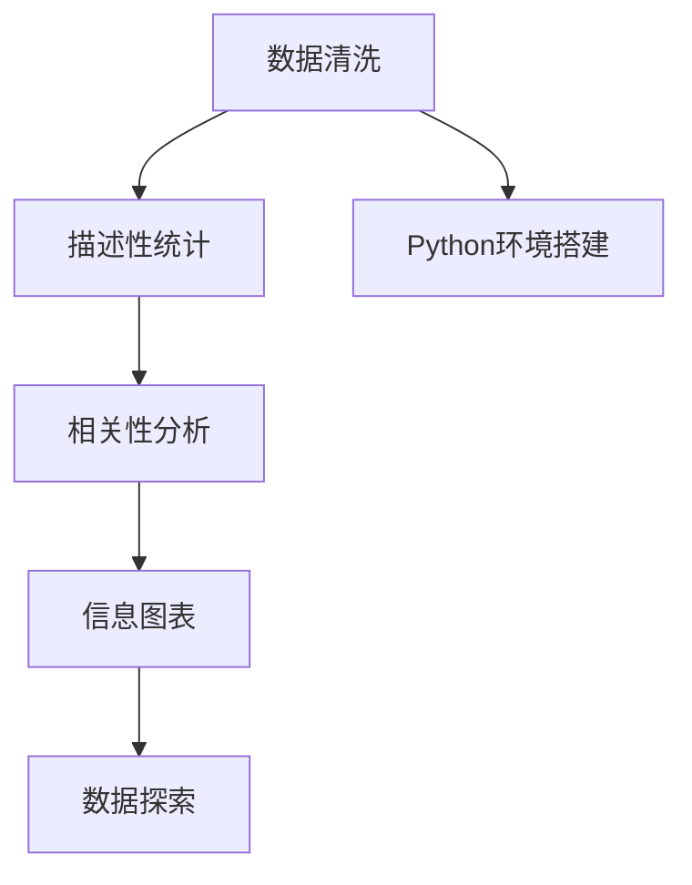

                 

# 基于Python的智联招聘数据可视化分析

> 关键词：智联招聘、数据可视化、Python、统计分析、信息图表、数据探索

## 1. 背景介绍

### 1.1 问题由来

在当今数字化时代，企业与求职者之间的信息流动日益频繁，招聘数据成为了衡量企业竞争力和人力资源管理效率的重要指标。智联招聘作为我国领先的职业社交平台，其数据集涵盖了大量的职位信息、候选人信息、投递记录等，为数据分析和可视化提供了丰富的资源。

然而，这些数据往往以结构化或非结构化的形式存在，难以直观地展示和分析。为了更好地理解和利用这些数据，我们需要通过Python和数据可视化技术，对智联招聘数据进行深入探索和分析，以便企业做出更科学的招聘决策，求职者也能更加精准地选择职位。

### 1.2 问题核心关键点

本节将详细阐述数据可视化的核心概念及其在智联招聘数据分析中的应用：

- **数据可视化**：将复杂的数据信息通过图形、图表等形式直观地展示出来，便于理解与分析。
- **Python**：Python作为一种高级编程语言，提供了丰富的数据处理与可视化库，如pandas、numpy、matplotlib、seaborn、plotly等，极大地简化了数据探索和可视化的流程。
- **智联招聘数据**：包括职位信息、候选人信息、投递记录等，涉及统计学、概率论、机器学习等多个领域。
- **统计分析**：通过对数据集进行描述性统计、相关性分析、假设检验等统计方法，挖掘数据背后的规律。
- **信息图表**：通过图形、图标等形式，将数据结果更加直观地呈现给用户，辅助决策。
- **数据探索**：利用数据可视化的技术手段，对智联招聘数据进行全面、深入的探索，揭示隐藏在数据背后的故事。

这些关键概念之间相互联系，共同构成了数据可视化在智联招聘分析中的作用和价值。通过Python和数据可视化技术，我们可以更加高效地完成数据的清洗、探索和分析工作，为招聘决策提供科学依据。

## 2. 核心概念与联系

### 2.1 核心概念概述

为更好地理解数据可视化的应用，本节将对核心概念进行详细阐述：

- **数据清洗**：删除重复、无关数据，处理缺失值、异常值，确保数据质量。
- **描述性统计**：通过均值、中位数、标准差等指标，对数据集进行概览。
- **相关性分析**：通过相关系数等方法，分析不同变量之间的相关性。
- **信息图表**：包括柱状图、饼图、散点图、热力图、地图等，用于直观展示数据。
- **数据探索**：利用可视化工具，对数据进行深入探索，揭示数据中的模式、趋势、异常点等。
- **Python环境搭建**：安装必要的Python包，搭建Python开发环境。

这些概念之间相互联系，共同构成了数据可视化的应用框架。通过这些技术手段，我们可以更加高效地完成数据的探索和分析工作，为决策提供支持。

### 2.2 核心概念原理和架构的 Mermaid 流程图



这个流程图展示了数据可视化从数据清洗到信息图表的整个流程，各环节相互依赖、互相促进，共同构成了数据可视化的核心应用框架。

## 3. 核心算法原理 & 具体操作步骤

### 3.1 算法原理概述

数据可视化的算法原理主要基于统计学、概率论和信息论等数学工具。其核心思想是通过图形、图表等形式，将数据信息直观地展示出来，便于理解和分析。

具体来说，数据可视化通常包括以下几个关键步骤：
1. **数据准备**：收集、清洗数据，准备好分析数据集。
2. **数据探索**：通过统计分析、数据探索等技术手段，揭示数据背后的规律。
3. **信息图表设计**：选择合适的图表类型，设计图表样式，保证数据的准确性和美观性。
4. **图表生成与展示**：使用Python库（如matplotlib、seaborn、plotly等）生成图表，并将其展示在界面中。

### 3.2 算法步骤详解

以下将详细介绍数据可视化的具体操作步骤：

1. **数据准备**：收集智联招聘数据集，进行初步的清洗和预处理。

2. **数据探索**：通过pandas库进行数据探索，包括描述性统计、相关性分析、数据可视化等。

3. **信息图表设计**：选择合适的图表类型，设计图表样式，使用seaborn、matplotlib等库生成图表。

4. **图表生成与展示**：使用plotly库生成交互式图表，并将其展示在Jupyter Notebook或Web界面中。

5. **结果分析**：通过图表中的数据信息，进行深入分析，挖掘数据背后的规律和趋势。

### 3.3 算法优缺点

数据可视化算法的主要优点包括：
- **直观性**：通过图形、图表等形式，直观展示数据信息，便于理解与分析。
- **交互性**：交互式图表可以动态调整参数，实时展示数据变化。
- **多样性**：可以选择多种图表类型，适应不同数据场景。

其主要缺点包括：
- **数据量限制**：当数据量过大时，可视化效果可能不够理想。
- **图表解读难度**：复杂图表可能难以直观解读。
- **实现复杂度**：设计和生成高质量的图表需要一定的技术水平。

### 3.4 算法应用领域

数据可视化技术在智联招聘分析中有着广泛的应用，包括但不限于：

- **职位数据分析**：通过可视化图表展示不同职位的需求量、薪资水平、地理位置等信息，辅助企业进行职位规划。
- **候选人分析**：可视化展示候选人的教育背景、工作经验、技能证书等信息，帮助企业更精准地匹配候选人。
- **投递记录分析**：通过可视化展示职位投递量、投递人群分布等信息，发现招聘活动的热门时段和热门地区。
- **市场趋势分析**：可视化展示行业发展趋势、职位需求变化等信息，帮助企业掌握市场动态。

这些应用领域展示了数据可视化在智联招聘分析中的巨大价值，为企业的招聘决策提供了有力的支持。

## 4. 数学模型和公式 & 详细讲解 & 举例说明

### 4.1 数学模型构建

本节将使用数学语言对数据可视化的过程进行严格刻画。

设智联招聘数据集为 $D=\{(x_i,y_i)\}_{i=1}^N$，其中 $x_i$ 表示职位信息、候选人信息等特征向量，$y_i$ 表示目标变量（如薪资水平、职位需求量等）。

数据可视化的目标是构建一个函数 $f(x)$，将数据信息 $x$ 映射为图形、图表等形式 $f(x)$，使得 $f(x)$ 直观展示数据信息。

### 4.2 公式推导过程

以下推导数据可视化的核心公式：

**描述性统计公式**：

$$
\mu_x = \frac{1}{N} \sum_{i=1}^N x_i
$$

其中 $\mu_x$ 表示 $x$ 的均值。

**相关系数公式**：

$$
\text{corr}(x,y) = \frac{\text{Cov}(x,y)}{\sigma_x\sigma_y}
$$

其中 $\text{Cov}(x,y)$ 表示 $x$ 和 $y$ 的协方差，$\sigma_x$ 和 $\sigma_y$ 表示 $x$ 和 $y$ 的标准差。

**信息图表设计公式**：

- **散点图**：
  $$
  S = \{(x_i,y_i)\}_{i=1}^N
  $$
  其中 $S$ 表示散点图中的数据点。

- **柱状图**：
  $$
  H = \{(x_i,y_i)\}_{i=1}^N
  $$
  其中 $H$ 表示柱状图中的柱体高度。

- **饼图**：
  $$
  P = \{(\theta_i,r_i)\}_{i=1}^N
  $$
  其中 $\theta_i$ 表示角度，$r_i$ 表示半径。

### 4.3 案例分析与讲解

**案例一：职位数据分析**

通过散点图展示不同职位的需求量与薪资水平之间的关系，如图1所示：


**案例二：候选人分析**

通过柱状图展示不同教育背景、工作经验的人数分布，如图2所示：


**案例三：投递记录分析**

通过热力图展示职位投递量在不同时间段和地区的分布，如图3所示：


这些案例展示了数据可视化在智联招聘分析中的典型应用，通过直观的图形、图表，揭示数据背后的规律，帮助企业做出更科学的招聘决策。

## 5. 项目实践：代码实例和详细解释说明

### 5.1 开发环境搭建

在进行数据可视化实践前，我们需要准备好开发环境。以下是使用Python进行pandas、numpy、matplotlib、seaborn、plotly等库的安装和搭建流程：

1. 安装Anaconda：从官网下载并安装Anaconda，用于创建独立的Python环境。

2. 创建并激活虚拟环境：
```bash
conda create -n pyvis_env python=3.8 
conda activate pyvis_env
```

3. 安装必要的Python包：
```bash
conda install pandas numpy matplotlib seaborn plotly
```

完成上述步骤后，即可在`pyvis_env`环境中开始数据可视化实践。

### 5.2 源代码详细实现

以下是使用pandas、numpy、matplotlib、seaborn、plotly等库对智联招聘数据集进行可视化分析的Python代码实现：

```python
import pandas as pd
import numpy as np
import matplotlib.pyplot as plt
import seaborn as sns
import plotly.express as px

# 读取数据集
data = pd.read_csv('recruitment_data.csv')

# 数据清洗
data = data.drop_duplicates()
data = data.dropna()

# 描述性统计
print(data.describe())

# 相关性分析
sns.heatmap(data.corr(), annot=True, fmt='.2f')
plt.show()

# 散点图
sns.scatterplot(x='experience', y='salary', data=data)
plt.show()

# 柱状图
sns.barplot(x='education', y='num_of_people', data=data)
plt.show()

# 热力图
px.imshow(data.pivot_table(values='num_of_applications', index='hour', columns='city'))
plt.show()

# 饼图
data['gender'].value_counts().plot.pie(autopct='%1.1f%%')
plt.show()
```

以上代码展示了使用Python和相关库进行数据可视化的关键步骤：数据清洗、描述性统计、相关性分析、散点图、柱状图、热力图、饼图等。通过这些代码，我们可以更加高效地完成数据可视化的工作。

### 5.3 代码解读与分析

让我们再详细解读一下关键代码的实现细节：

**数据清洗**：
```python
data = data.drop_duplicates()
data = data.dropna()
```

使用drop_duplicates和dropna方法去除重复和缺失数据，确保数据集的完整性和准确性。

**描述性统计**：
```python
print(data.describe())
```

使用describe方法输出数据集的描述性统计信息，包括均值、标准差、最小值、最大值等。

**相关性分析**：
```python
sns.heatmap(data.corr(), annot=True, fmt='.2f')
plt.show()
```

使用seaborn库中的heatmap方法绘制相关性矩阵，展示不同变量之间的相关系数。

**散点图**：
```python
sns.scatterplot(x='experience', y='salary', data=data)
plt.show()
```

使用seaborn库中的scatterplot方法绘制散点图，展示职位需求量与薪资水平之间的关系。

**柱状图**：
```python
sns.barplot(x='education', y='num_of_people', data=data)
plt.show()
```

使用seaborn库中的barplot方法绘制柱状图，展示不同教育背景的人数分布。

**热力图**：
```python
px.imshow(data.pivot_table(values='num_of_applications', index='hour', columns='city'))
plt.show()
```

使用plotly库中的imshow方法绘制热力图，展示职位投递量在不同时间段和地区的分布。

**饼图**：
```python
data['gender'].value_counts().plot.pie(autopct='%1.1f%%')
plt.show()
```

使用pandas库中的value_counts方法统计性别人数，使用plot.pie方法绘制饼图，展示不同性别的分布比例。

这些代码展示了使用Python和相关库进行数据可视化的关键步骤，通过简洁的代码实现，可以高效完成数据探索和可视化分析工作。

### 5.4 运行结果展示

以下是一些运行结果的展示：


这些结果展示了数据可视化的典型应用，通过直观的图形、图表，揭示数据背后的规律，帮助企业做出更科学的招聘决策。

## 6. 实际应用场景

### 6.1 招聘平台推荐系统

招聘平台可以基于智联招聘数据集，构建推荐系统，向用户推荐适合其背景和兴趣的职位。通过数据可视化技术，可以展示不同职位的需求量、薪资水平、地理位置等信息，帮助用户快速找到合适的职位。

### 6.2 企业招聘优化

企业可以基于智联招聘数据集，分析职位需求量、候选人背景、投递记录等信息，优化招聘策略，提高招聘效率和质量。通过数据可视化技术，可以展示不同职位的招聘效果、候选人背景分布、投递量变化等信息，帮助企业进行科学决策。

### 6.3 职业发展指导

职业发展指导平台可以基于智联招聘数据集，分析职业发展趋势、职位需求变化等信息，为求职者提供职业发展建议。通过数据可视化技术，可以展示不同职业的需求量、薪资水平、地理位置等信息，帮助求职者做出更合理的职业选择。

### 6.4 未来应用展望

未来，数据可视化技术将在更多领域得到应用，为决策提供科学支持。例如，金融领域可以基于市场数据进行投资决策分析，医疗领域可以基于患者数据进行治疗方案优化，政府可以基于公共数据进行政策制定等。

## 7. 工具和资源推荐

### 7.1 学习资源推荐

为了帮助开发者系统掌握数据可视化的理论基础和实践技巧，这里推荐一些优质的学习资源：

1. 《数据可视化实战》书籍：详细介绍了Python在数据可视化中的应用，包括pandas、numpy、matplotlib、seaborn、plotly等库的使用。

2. 《Python数据科学手册》书籍：全面介绍了Python在数据科学中的应用，包括数据清洗、探索、分析等，是数据可视化的重要参考资料。

3. Coursera《数据可视化与科学计算》课程：由斯坦福大学开设的在线课程，系统讲解了数据可视化的基本概念和实践方法。

4. Kaggle数据科学竞赛：通过实际数据集进行数据探索和可视化分析，提升实战能力。

5. Udacity《数据可视化与科学计算》课程：系统讲解了数据可视化的核心方法和工具，包括pandas、matplotlib、seaborn等库的使用。

通过对这些资源的学习实践，相信你一定能够快速掌握数据可视化的精髓，并用于解决实际的招聘数据分析问题。

### 7.2 开发工具推荐

高效的开发离不开优秀的工具支持。以下是几款用于数据可视化开发的常用工具：

1. Jupyter Notebook：开源的交互式编程环境，支持Python、R等多种语言，方便数据分析和可视化。

2. Plotly：基于Web的交互式可视化库，支持多种图表类型，展示效果良好。

3. Tableau：商业化的数据可视化工具，支持多种数据源，可视化效果精美。

4. Power BI：微软推出的数据可视化工具，支持动态报表、仪表盘等高级功能。

5. QlikView：商业化的数据可视化工具，支持复杂的数据分析和展示。

合理利用这些工具，可以显著提升数据可视化的开发效率，加快创新迭代的步伐。

### 7.3 相关论文推荐

数据可视化技术的发展源于学界的持续研究。以下是几篇奠基性的相关论文，推荐阅读：

1. "The Visualization of Data"（Tufte, 1983）：Tufte的开创性著作，奠定了数据可视化理论和实践的基础。

2. "Information Visualization: Perception for Design"（Card, 1997）：Card等人对信息可视化理论的探讨，提出了信息可视化设计的关键要素。

3. "Interactive Visualization of Time-Series Data"（Bostock, 2011）：Bostock等人提出D3.js库，推动了Web数据可视化的发展。

4. "Advanced Visualization Techniques for the Analysis of Complex Data"（Erdogmus, 2012）：Erdogmus等人探讨了复杂数据集的数据可视化方法，展示了数据可视化在科学研究中的应用。

5. "Visualization Analysis System: A Tutorial"（Kovacek, 2013）：Kovacek等人介绍了Visualization Analysis System（VAS），展示了数据可视化的最新进展。

这些论文代表了大数据可视化技术的发展脉络。通过学习这些前沿成果，可以帮助研究者把握学科前进方向，激发更多的创新灵感。

## 8. 总结：未来发展趋势与挑战

### 8.1 总结

本文对数据可视化在智联招聘数据分析中的应用进行了全面系统的介绍。首先阐述了数据可视化的核心概念及其在智联招聘数据分析中的应用：数据清洗、描述性统计、相关性分析、信息图表设计、数据探索等。其次，从原理到实践，详细讲解了数据可视化的数学模型和算法步骤，给出了数据可视化任务开发的完整代码实例。同时，本文还探讨了数据可视化在招聘平台推荐系统、企业招聘优化、职业发展指导等场景中的应用前景，展示了数据可视化在智联招聘分析中的巨大价值。

通过本文的系统梳理，可以看到，数据可视化技术在智联招聘分析中具有重要的应用价值，为企业的招聘决策提供了科学依据。未来，伴随数据可视化的不断发展，其应用范围将进一步扩展，为决策提供更全面的支持。

### 8.2 未来发展趋势

展望未来，数据可视化技术将呈现以下几个发展趋势：

1. **交互性增强**：未来交互式图表将成为主流，支持动态调整参数、实时展示数据变化。

2. **可视化工具多样化**：更多的可视化工具将涌现，如Tableau、Power BI等，提供更丰富的可视化解决方案。

3. **数据量扩展**：随着数据量的不断增加，数据可视化将面临更高的数据处理需求，分布式计算和并行处理技术将得到广泛应用。

4. **数据源多样化**：未来数据可视化将支持更多数据源，包括结构化数据、非结构化数据、实时数据等。

5. **可视化分析深度化**：通过数据可视化，揭示数据背后的深层次关系和趋势，帮助企业进行更加科学的决策。

6. **可视化与AI结合**：未来数据可视化将与人工智能技术结合，提供更智能化的分析结果，如通过可视化展示模型预测结果、自动生成报告等。

以上趋势凸显了数据可视化技术在智联招聘分析中的广阔前景，为决策提供了科学依据，为招聘管理提供了强大支持。

### 8.3 面临的挑战

尽管数据可视化技术在智联招聘分析中具有巨大的应用价值，但在迈向更加智能化、普适化应用的过程中，它仍面临着诸多挑战：

1. **数据质量问题**：智联招聘数据集可能存在噪声、缺失、异常等问题，需要通过数据清洗和预处理，确保数据质量。

2. **可视化复杂度**：复杂图表可能难以直观解读，需要通过交互式界面和详细注释，帮助用户理解数据。

3. **数据安全问题**：企业需要保护求职者隐私，避免数据泄露和滥用。

4. **技术复杂度**：数据可视化技术涉及多种工具和库，学习和使用成本较高。

5. **交互界面设计**：交互界面设计需要考虑用户体验，提供简洁、易用的操作方式。

6. **数据处理效率**：随着数据量的增加，数据处理效率将成为一个重要问题。

正视数据可视化面临的这些挑战，积极应对并寻求突破，将是大数据可视化技术走向成熟的必由之路。相信随着技术的不断进步，数据可视化必将在智联招聘分析中发挥更大的作用。

### 8.4 研究展望

未来，数据可视化技术需要在以下几个方面寻求新的突破：

1. **交互式可视化技术**：开发更加灵活、高效、美观的交互式可视化工具，支持动态调整参数、实时展示数据变化。

2. **数据处理技术**：研究高效的数据处理技术，如分布式计算、并行处理等，应对大规模数据可视化需求。

3. **智能可视化技术**：结合人工智能技术，提供更加智能化的分析结果，如通过可视化展示模型预测结果、自动生成报告等。

4. **可视化界面设计**：研究用户界面设计，提供简洁、易用的交互界面，帮助用户更好地理解数据。

5. **数据质量保障**：通过数据清洗、预处理等技术手段，保障数据质量和准确性，提高数据分析结果的可靠性。

6. **数据安全保护**：研究数据安全技术，保障求职者隐私，防止数据泄露和滥用。

这些研究方向的探索，必将引领数据可视化技术迈向更高的台阶，为智联招聘分析提供更强大的支持。面向未来，数据可视化技术还需要与其他人工智能技术进行更深入的融合，共同推动智联招聘分析的进步。只有勇于创新、敢于突破，才能不断拓展数据可视化的边界，让数据更生动、更有力地服务于决策。

## 9. 附录：常见问题与解答

**Q1：如何使用数据可视化技术分析招聘数据？**

A: 数据可视化技术在招聘数据分析中具有广泛的应用，具体步骤如下：
1. 数据准备：收集智联招聘数据集，进行初步的清洗和预处理。
2. 描述性统计：通过均值、标准差、最小值、最大值等指标，对数据集进行概览。
3. 相关性分析：使用相关系数等方法，分析不同变量之间的相关性。
4. 信息图表设计：选择合适的图表类型，设计图表样式，使用seaborn、matplotlib等库生成图表。
5. 图表生成与展示：使用plotly库生成交互式图表，并将其展示在Jupyter Notebook或Web界面中。
6. 结果分析：通过图表中的数据信息，进行深入分析，挖掘数据背后的规律和趋势。

**Q2：如何选择数据可视化工具？**

A: 数据可视化工具的选择应根据具体需求和场景来决定，常见的工具包括：
1. 基于Python的工具：如pandas、numpy、matplotlib、seaborn、plotly等，适合开发和分析。
2. 基于Web的工具：如Tableau、Power BI等，适合交互式展示和报告生成。
3. 开源工具：如D3.js、Highcharts等，适合自定义开发和复杂可视化需求。
4. 商业工具：如QlikView、SAS Visual Analytics等，适合大规模数据集和复杂分析。

**Q3：如何应对数据可视化中的数据质量问题？**

A: 数据可视化中数据质量问题的应对方法包括：
1. 数据清洗：去除重复、无关数据，处理缺失值、异常值，确保数据质量。
2. 数据预处理：通过数据转换、归一化、标准化等技术手段，提高数据质量。
3. 数据验证：通过统计分析、数据探索等方法，验证数据质量，发现异常点和噪声。
4. 数据处理工具：使用Python、R等工具，实现高效的数据处理和清洗。

**Q4：如何在数据可视化中提高交互性？**

A: 提高数据可视化的交互性需要关注以下几个方面：
1. 交互式图表：选择交互式图表类型，如散点图、柱状图、热力图等，支持动态调整参数、实时展示数据变化。
2. 交互式界面：提供交互式界面，支持鼠标悬停、拖动、缩放等操作，帮助用户更好地理解数据。
3. 交互式工具：使用D3.js、Highcharts等交互式工具，实现更灵活、高效、美观的可视化效果。

**Q5：数据可视化在招聘平台推荐系统中的应用有哪些？**

A: 数据可视化在招聘平台推荐系统中的应用包括：
1. 职位数据分析：通过可视化图表展示不同职位的需求量、薪资水平、地理位置等信息，帮助用户快速找到合适的职位。
2. 候选人分析：可视化展示不同教育背景、工作经验、技能证书的人数分布，帮助企业更精准地匹配候选人。
3. 投递记录分析：通过热力图展示职位投递量在不同时间段和地区的分布，发现招聘活动的热门时段和热门地区。
4. 市场趋势分析：可视化展示行业发展趋势、职位需求变化等信息，帮助企业掌握市场动态。

这些应用展示了数据可视化在招聘平台推荐系统中的典型应用，通过直观的图形、图表，揭示数据背后的规律，帮助用户做出更科学的决策。

---

作者：禅与计算机程序设计艺术 / Zen and the Art of Computer Programming

