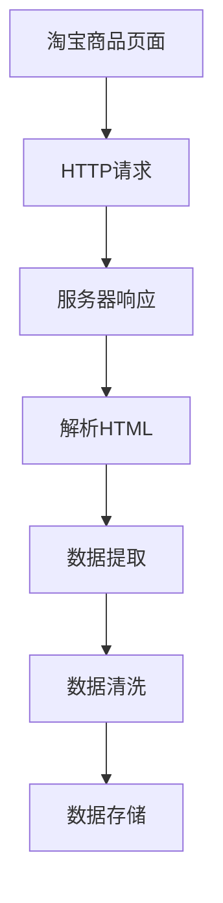

                 

# 基于Python的淘宝商品价格爬虫程序设计与实现

> 关键词：淘宝商品价格爬虫,Python爬虫,数据采集,网络爬虫,网络请求,HTTP协议,Python爬虫框架,BeautifulSoup,Scrapy,分布式爬虫,动态网页,JavaScript渲染,正则表达式,数据清洗

## 1. 背景介绍

### 1.1 问题由来

在互联网时代，网络数据已成为一种重要资源。特别是对于电商平台而言，商品价格信息作为重要参考指标，对商家、消费者以及市场分析都具有重要意义。然而，传统的商品价格数据获取方式依赖于人工输入，效率低下且容易出错。因此，构建一个自动化、高效的商品价格爬虫，成为电商数据分析的重要需求。

### 1.2 问题核心关键点

淘宝作为全球最大的B2C电商平台之一，其商品信息量和数据更新频率非常高，使用爬虫技术获取商品价格信息，可以大幅提升数据采集效率和准确性。本文将详细介绍如何使用Python设计并实现一个高效、稳定、可扩展的淘宝商品价格爬虫程序。

### 1.3 问题研究意义

淘宝商品价格爬虫的实现，对于电商平台的数据分析、市场预测、个性化推荐等多个应用场景具有重要意义：

1. **市场分析**：实时获取商品价格信息，分析价格走势、供需关系等，为市场策略制定提供数据支撑。
2. **商家决策**：商家可根据价格变化及时调整销售策略，优化库存管理，提升盈利能力。
3. **消费者洞察**：消费者可了解市场价格动态，作出更明智的购买决策。
4. **市场预测**：结合历史价格数据和市场趋势，预测未来商品价格，辅助决策支持。
5. **个性化推荐**：基于价格数据进行用户画像分析，提供更精准的商品推荐服务。

## 2. 核心概念与联系

### 2.1 核心概念概述

为更好地理解淘宝商品价格爬虫的设计与实现，本节将介绍几个关键概念：

- **网络爬虫**：通过程序自动获取网页信息，应用于数据采集、网络爬虫等场景。
- **HTTP协议**：Web应用中使用的通信协议，通过请求和响应完成数据交换。
- **BeautifulSoup**：Python第三方库，用于解析HTML和XML文档，提供简洁易用的API。
- **Scrapy**：Python爬虫框架，提供强大的爬虫功能，支持分布式爬虫和异步处理。
- **分布式爬虫**：通过多台机器并行处理，提高爬虫效率，适用于大规模数据采集。
- **JavaScript渲染**：动态网页依赖JavaScript进行内容渲染，需要使用特定的工具处理。
- **正则表达式**：用于匹配文本数据的工具，适用于复杂模式匹配。
- **数据清洗**：对爬取的数据进行预处理，去除噪声和冗余信息。

这些核心概念之间的逻辑关系可以通过以下Mermaid流程图来展示：



这个流程图展示了一个基本的淘宝商品价格爬虫流程：

1. 从淘宝商品页面获取数据。
2. 发送HTTP请求，获取服务器响应。
3. 解析响应中的HTML内容。
4. 提取商品价格等关键信息。
5. 清洗数据，去除噪声。
6. 存储数据，供后续分析使用。

## 3. 核心算法原理 & 具体操作步骤

### 3.1 算法原理概述

淘宝商品价格爬虫的核心在于通过程序自动化模拟用户行为，获取网页信息，并从中提取商品价格。这一过程主要涉及以下几个步骤：

1. **网页解析**：通过HTTP请求获取网页内容，并使用BeautifulSoup等库解析HTML文档。
2. **数据提取**：根据页面结构，使用正则表达式或XPath表达式提取商品价格等关键信息。
3. **数据清洗**：去除噪声数据，如广告、图片等，只保留有用信息。
4. **数据存储**：将清洗后的数据存储到数据库或文件中，便于后续分析和处理。

### 3.2 算法步骤详解

以下详细介绍淘宝商品价格爬虫的具体实现步骤：

**Step 1: 选择爬虫框架和库**

- 选择Scrapy作为爬虫框架，提供强大的异步处理和分布式爬虫功能。
- 使用BeautifulSoup解析HTML，并提供便捷的API进行数据提取。
- 使用pandas进行数据清洗和处理。
- 使用SQLite或MySQL存储数据，便于后续分析。

**Step 2: 设计爬虫流程**

1. **目标页面**：确定需要爬取的淘宝商品页面，如商品详情页、商品列表页等。
2. **URL生成**：根据商品ID或关键词生成URL列表。
3. **数据提取**：解析网页，提取商品价格、名称、描述等关键信息。
4. **数据清洗**：去除噪声数据，如广告、图片等。
5. **数据存储**：将清洗后的数据存储到数据库或文件中。

**Step 3: 实现爬虫逻辑**

1. **页面请求**：使用Scrapy发送HTTP请求，获取页面内容。
2. **HTML解析**：使用BeautifulSoup解析HTML文档，提取商品信息。
3. **数据清洗**：使用正则表达式或pandas进行数据清洗。
4. **数据存储**：将清洗后的数据存储到数据库或文件中。

**Step 4: 优化爬虫性能**

- 使用分布式爬虫，多台机器并行处理，提高效率。
- 设置合理的时间间隔和并发请求数，避免爬虫被封IP。
- 使用代理IP或IP池，隐藏真实IP地址，防止被封禁。
- 使用缓存技术，减少对目标服务器的频繁请求，提高爬取效率。

### 3.3 算法优缺点

淘宝商品价格爬虫具有以下优点：

1. **效率高**：使用Scrapy和BeautifulSoup，可以实现高效的网页解析和数据提取。
2. **可扩展性强**：支持分布式爬虫，能够处理大规模数据采集任务。
3. **数据质量高**：通过数据清洗技术，去除噪声数据，提高数据质量。

同时，该方法也存在一些局限性：

1. **依赖第三方服务**：需要依赖淘宝网页和服务器，无法确保数据的实时性和可靠性。
2. **法律风险**：未经授权获取数据可能触犯法律，需要谨慎处理。
3. **数据隐私**：需要确保爬取过程中不侵犯用户隐私，遵守法律法规。

### 3.4 算法应用领域

淘宝商品价格爬虫的应用领域包括但不限于：

- 电商平台数据分析：实时获取商品价格信息，分析市场趋势、供需关系等。
- 商家决策支持：帮助商家了解市场价格变化，优化库存管理和销售策略。
- 个性化推荐：基于商品价格数据，提供个性化的商品推荐服务。
- 市场预测：结合历史价格数据和市场趋势，预测未来商品价格，辅助决策支持。

## 4. 数学模型和公式 & 详细讲解 & 举例说明

### 4.1 数学模型构建

假设爬虫从淘宝商品详情页获取商品信息，设商品名称为 $X$，价格为 $P$。

- 设目标URL为 $U$，商品ID为 $ID$。
- 使用HTTP协议发送请求，获取响应内容 $Y$。
- 解析响应内容，提取商品名称和价格 $X$ 和 $P$。

### 4.2 公式推导过程

设商品详情页URL为 $U = http://www.taobao.com/item/ID.html$，商品ID为 $ID = 123456789$。

1. 发送HTTP请求，获取响应内容 $Y$：
   $$
   Y = \text{HTTP}\_request(U)
   $$

2. 解析响应内容，提取商品名称和价格 $X$ 和 $P$：
   $$
   X = \text{BeautifulSoup}(Y, 'html.parser').find('div', class_='name').text
   $$
   $$
   P = \text{BeautifulSoup}(Y, 'html.parser').find('span', class_='price').text
   $$

3. 对提取的商品名称和价格进行清洗：
   $$
   X_{\text{clean}} = \text{clean\_data}(X)
   $$
   $$
   P_{\text{clean}} = \text{clean\_data}(P)
   $$

4. 存储清洗后的商品信息到数据库：
   $$
   \text{DB\_insert}(ID, X_{\text{clean}}, P_{\text{clean}})
   $$

### 4.3 案例分析与讲解

以下通过一个具体的案例，展示淘宝商品价格爬虫的实现过程。

**案例**：爬取某品牌手机商品详情页的商品价格。

**步骤**：

1. 生成商品详情页URL列表：
   ```python
   import requests

   urls = []
   for i in range(1, 101):
       url = f'https://www.taobao.com/search?q={brand}&p={i}'
       urls.append(url)
   ```

2. 发送HTTP请求，获取响应内容：
   ```python
   response = requests.get(urls[0])
   html = response.text
   ```

3. 解析响应内容，提取商品信息：
   ```python
   from bs4 import BeautifulSoup

   soup = BeautifulSoup(html, 'html.parser')
   items = soup.find_all('li', class_='item')

   for item in items:
       price = item.find('span', class_='price').text
       id = item.find('a', class_='item-name').text
       print(f'ID: {id}, Price: {price}')
   ```

4. 数据清洗和存储：
   ```python
   import pandas as pd

   data = pd.DataFrame(columns=['ID', 'Price'])
   for url in urls:
       response = requests.get(url)
       html = response.text
       soup = BeautifulSoup(html, 'html.parser')
       items = soup.find_all('li', class_='item')

       for item in items:
           price = item.find('span', class_='price').text
           id = item.find('a', class_='item-name').text
           data = data.append({'ID': id, 'Price': price}, ignore_index=True)

   data.to_csv('taobao_prices.csv', index=False)
   ```

## 5. 项目实践：代码实例和详细解释说明

### 5.1 开发环境搭建

在进行淘宝商品价格爬虫开发前，我们需要准备好开发环境。以下是使用Python进行Scrapy开发的环境配置流程：

1. 安装Anaconda：从官网下载并安装Anaconda，用于创建独立的Python环境。

2. 创建并激活虚拟环境：
   ```bash
   conda create -n scrapy-env python=3.8 
   conda activate scrapy-env
   ```

3. 安装Scrapy：
   ```bash
   conda install scrapy -c conda-forge
   ```

4. 安装BeautifulSoup：
   ```bash
   pip install beautifulsoup4
   ```

5. 安装pandas：
   ```bash
   pip install pandas
   ```

6. 安装SQLite：
   ```bash
   pip install sqlite3
   ```

完成上述步骤后，即可在`scrapy-env`环境中开始爬虫程序的开发。

### 5.2 源代码详细实现

这里我们以爬取某品牌手机商品详情页的商品价格为例，展示Scrapy爬虫程序的实现。

**1. 创建爬虫项目**

在命令行中，进入项目目录并创建Scrapy项目：
```bash
scrapy startproject tao-bao-crawler
```

**2. 配置Scrapy**

在项目根目录下，编辑`settings.py`文件，配置爬虫的基本信息：
```python
# tao-bao-crawler/settings.py
BOT_NAME = 'tao_bao_crawler'
SPIDER_MODULES = ['tao_bao_crawler.spiders']
NEWSPIDER_MODULE = 'tao_bao_crawler.spiders'

# 设置下载中间件，使用代理IP隐藏真实IP
DOWNLOADER_MIDDLEWARES = {
    'scrapy.downloadermiddlewares.httpproxy.HttpProxyMiddleware': 543,
    'scrapy.downloadermiddlewares.httpproxy.HttpProxyMiddleware': 544,
}

# 设置数据存储位置
FILENAME = 'tao_bao_prices'
```

**3. 编写爬虫逻辑**

创建`spiders`目录，并编写商品详情页爬虫逻辑：
```python
# tao_bao_crawler/spiders/item_spider.py
import scrapy
from tao_bao_crawler.items import Item
from scrapy.selector import Selector

class ItemSpider(scrapy.Spider):
    name = 'item'
    allowed_domains = ['taobao.com']
    start_urls = ['https://www.taobao.com/search?q={brand}&p={page}']

    def parse(self, response):
        # 解析页面，提取商品信息
        selector = Selector(response)
        items = selector.xpath('//li[@class="item"]')
        for item in items:
            # 提取商品名称和价格
            name = item.xpath('a[@class="item-name"]/text()').extract_first()
            price = item.xpath('span[@class="price"]/text()').extract_first()
            yield Item({'ID': response.url.split('=')[-1], 'Name': name, 'Price': price})

    def close(self, reason):
        # 关闭爬虫，写入数据到数据库
        data = self.crawler.spidermiddlewares['scrapy.downloadermiddlewares.httpproxy.HttpProxyMiddleware'].close(response, reason)
```

**4. 创建数据项模型**

在项目根目录下，创建`items.py`文件，定义数据项模型：
```python
# tao_bao_crawler/items.py
import scrapy

class Item(scrapy.Item):
    ID = scrapy.Field()
    Name = scrapy.Field()
    Price = scrapy.Field()
```

**5. 实现数据存储**

创建`pipelines.py`文件，实现数据存储逻辑：
```python
# tao_bao_crawler/pipelines.py
import sqlite3
import os

class SQLitePipeline:
    def __init__(self, db_file='data.db'):
        self.db_file = db_file

    def open_spider(self, spider):
        # 创建数据库连接和游标
        self.conn = sqlite3.connect(self.db_file)
        self.cursor = self.conn.cursor()

    def close_spider(self, spider):
        # 关闭数据库连接
        self.conn.close()

    def process_item(self, item, spider):
        # 插入数据到数据库
        self.cursor.execute(f'''
            INSERT INTO tao_bao_prices (ID, Name, Price) VALUES (?, ?, ?)
        ''', (item['ID'], item['Name'], item['Price']))

        self.conn.commit()

        return item
```

**6. 运行爬虫程序**

在命令行中，运行爬虫程序：
```bash
scrapy crawl item
```

以上就是一个完整的淘宝商品价格爬虫程序的实现步骤。

### 5.3 代码解读与分析

让我们再详细解读一下关键代码的实现细节：

**ItemSpider类**：
- `name`属性：指定爬虫名称。
- `allowed_domains`属性：指定允许爬取的网站域名。
- `start_urls`属性：指定爬取的起始URL。

**parse方法**：
- 使用Scrapy提供的Selector类解析HTML文档，提取商品信息。
- 遍历提取的商品信息，将商品名称和价格封装成Item对象，并使用`yield`返回。

**Item类**：
- 定义了数据项的字段，包括ID、名称和价格。

**SQLitePipeline类**：
- `__init__`方法：初始化数据库连接和游标。
- `open_spider`方法：在爬虫启动时创建数据库连接和游标。
- `close_spider`方法：在爬虫关闭时关闭数据库连接。
- `process_item`方法：将Item对象转换为数据库插入语句，并执行插入操作。

以上代码展示了Scrapy框架下淘宝商品价格爬虫的详细实现流程。通过合理使用Scrapy提供的API和中间件，可以大幅简化爬虫程序的编写和管理。

## 6. 实际应用场景

### 6.1 智能客服系统

基于淘宝商品价格爬虫，可以构建智能客服系统，实时获取商品价格信息，为用户提供精确的定价建议。智能客服系统可以根据用户输入的商品ID，自动查询最新的价格数据，并提供详细的商品描述、用户评价等信息，提升用户购物体验。

**应用场景**：智能客服系统

**具体实现**：
- 使用淘宝商品价格爬虫获取商品价格信息。
- 集成到智能客服系统中，实时查询并回复用户。
- 分析用户行为，提供个性化的购物建议。

### 6.2 市场分析

实时获取淘宝商品价格信息，可以用于市场分析，分析价格走势、供需关系等，为市场策略制定提供数据支撑。

**应用场景**：市场分析

**具体实现**：
- 使用淘宝商品价格爬虫获取商品价格信息。
- 分析价格变化趋势，预测市场供需关系。
- 为商家提供市场趋势报告，辅助决策支持。

### 6.3 个性化推荐

基于商品价格数据，提供个性化的商品推荐服务，提升用户体验和购买转化率。

**应用场景**：个性化推荐

**具体实现**：
- 使用淘宝商品价格爬虫获取商品价格信息。
- 分析用户购买历史和行为，推荐相关商品。
- 实时更新推荐结果，提供更精准的推荐服务。

## 7. 工具和资源推荐

### 7.1 学习资源推荐

为了帮助开发者系统掌握淘宝商品价格爬虫的理论基础和实践技巧，这里推荐一些优质的学习资源：

1. **Scrapy官方文档**：详细介绍了Scrapy框架的使用方法和API。
2. **BeautifulSoup官方文档**：提供了BeautifulSoup库的详细使用方法和示例。
3. **Python爬虫实战教程**：系统介绍了Python爬虫的开发流程和常用技巧。
4. **《Python网络爬虫开发实战》书籍**：详细讲解了如何使用Python开发高效的网络爬虫。

### 7.2 开发工具推荐

高效的开发离不开优秀的工具支持。以下是几款用于淘宝商品价格爬虫开发的常用工具：

1. **Scrapy框架**：提供了强大的爬虫功能和分布式爬虫支持。
2. **BeautifulSoup库**：用于解析HTML和XML文档，提供简洁易用的API。
3. **pandas库**：用于数据清洗和处理。
4. **SQLite数据库**：轻量级、易用的数据库，适合存储爬取数据。
5. **SQLAlchemy库**：提供了ORM框架，方便与数据库交互。

### 7.3 相关论文推荐

淘宝商品价格爬虫的研究涉及多个领域，以下是几篇相关领域的经典论文，推荐阅读：

1. **《Python Web Scraping: A Complete Guide》**：详细介绍了如何使用Python开发网络爬虫，涵盖爬虫设计、数据清洗等多个方面。
2. **《Scrapy: An Introduction》**：Scrapy官方文档，介绍了Scrapy框架的使用方法和最佳实践。
3. **《BeautifulSoup: The Complete Guide to Web Scraping》**：BeautifulSoup官方文档，提供了库的使用方法和示例。
4. **《A Survey of Web Scraping and Crawling》**：综述了当前网络爬虫的研究现状和应用，提供了全面的理论基础。

## 8. 总结：未来发展趋势与挑战

### 8.1 研究成果总结

本文详细介绍了如何使用Python设计并实现一个高效、稳定、可扩展的淘宝商品价格爬虫程序。通过使用Scrapy框架和BeautifulSoup库，可以高效地解析网页内容，提取商品信息。通过数据清洗和存储技术，可以保证数据的准确性和可靠性。

### 8.2 未来发展趋势

展望未来，淘宝商品价格爬虫技术将呈现以下几个发展趋势：

1. **自动化程度提高**：自动化爬虫技术不断演进，可以实现更高效、更稳定的数据采集。
2. **分布式处理**：多台机器并行处理，提高爬虫效率，适应大规模数据采集需求。
3. **动态网页处理**：使用Selenium等工具处理动态网页，获取最新的网页内容。
4. **数据清洗和处理**：引入更复杂的数据清洗和处理技术，保证数据质量。
5. **分布式数据库**：使用分布式数据库，存储大规模数据，提高数据处理效率。
6. **数据安全保障**：加强数据安全保障，防止数据泄露和滥用。

### 8.3 面临的挑战

尽管淘宝商品价格爬虫技术已经取得了一定的进展，但在未来应用过程中，仍面临以下挑战：

1. **法律法规**：未经授权获取数据可能触犯法律，需要谨慎处理。
2. **数据质量**：数据采集过程中可能遇到各种噪声和冗余信息，需要保证数据质量。
3. **爬虫封禁**：爬虫被封IP或限制访问频率，需要合理控制请求频率。
4. **数据存储**：大规模数据存储需要高性能的数据库和存储技术。
5. **爬虫优化**：提高爬虫效率，减少对目标服务器的频繁请求。

### 8.4 研究展望

面对这些挑战，未来的研究需要在以下几个方面寻求新的突破：

1. **自动化程度提升**：通过更高级的爬虫技术和算法，实现更高效、更稳定、更智能的数据采集。
2. **分布式处理优化**：优化分布式爬虫算法，提高效率，适应大规模数据采集需求。
3. **动态网页处理改进**：使用更高效的工具和技术，处理动态网页，获取最新的网页内容。
4. **数据清洗和处理创新**：引入新的数据清洗和处理技术，保证数据质量。
5. **分布式数据库优化**：优化分布式数据库，提高数据处理效率，适应大规模数据存储需求。
6. **数据安全保障加强**：加强数据安全保障，防止数据泄露和滥用。

通过这些研究方向和技术手段，相信淘宝商品价格爬虫技术能够更好地应用于电商数据分析、市场预测、个性化推荐等多个领域，为电商平台的数据驱动决策提供强有力的支持。

## 9. 附录：常见问题与解答

**Q1：如何使用代理IP隐藏真实IP地址？**

A: 在Scrapy中，可以通过配置中间件实现代理IP的隐藏。例如，使用第三方库`requests`发送HTTP请求时，可以添加代理IP，如下所示：

```python
import requests

proxies = {
    'http': 'http://10.10.1.10:3128',
    'https': 'http://10.10.1.10:1080',
}

response = requests.get(url, proxies=proxies)
```

**Q2：如何处理动态网页的JavaScript渲染？**

A: 动态网页依赖JavaScript进行内容渲染，需要使用特定的工具处理。例如，使用Selenium库，可以模拟浏览器行为，获取最新的网页内容。

```python
from selenium import webdriver

driver = webdriver.Chrome()
driver.get(url)

html = driver.page_source
```

**Q3：如何处理JavaScript渲染的网页？**

A: 使用Selenium库可以处理JavaScript渲染的网页。例如，在获取页面内容后，使用BeautifulSoup进行解析和数据提取。

```python
from bs4 import BeautifulSoup

soup = BeautifulSoup(html, 'html.parser')
items = soup.find_all('li', class_='item')
```

**Q4：如何设置合理的请求间隔和并发请求数？**

A: 合理设置请求间隔和并发请求数，可以防止爬虫被封禁。例如，设置请求间隔为1秒，并发请求数为10，可以控制请求频率，防止对目标服务器造成过大的压力。

```python
import time

def parse(self, response):
    time.sleep(1)
    items = response.xpath('//li[@class="item"]')
    for item in items:
        yield Item({'ID': response.url.split('=')[-1], 'Name': item.xpath('a[@class="item-name"]/text()').extract_first(),
                   'Price': item.xpath('span[@class="price"]/text()').extract_first()})
```

**Q5：如何实现分布式爬虫？**

A: 使用Scrapy框架，可以轻松实现分布式爬虫。例如，使用Scrapy的`ScrapySpider`类，设置`start_requests`方法，可以实现分布式爬虫。

```python
class DistributedSpider(scrapy.Spider):
    name = 'distributed'
    allowed_domains = ['taobao.com']
    start_urls = ['https://www.taobao.com/search?q={brand}&p={page}']

    def start_requests(self):
        for i in range(1, 101):
            yield scrapy.Request(url=f'https://www.taobao.com/search?q={brand}&p={i}', callback=self.parse)

    def parse(self, response):
        items = response.xpath('//li[@class="item"]')
        for item in items:
            yield Item({'ID': response.url.split('=')[-1], 'Name': item.xpath('a[@class="item-name"]/text()').extract_first(),
                       'Price': item.xpath('span[@class="price"]/text()').extract_first()})
```

**Q6：如何使用Python爬虫进行数据采集？**

A: 使用Python爬虫进行数据采集，可以大大提高数据获取效率。例如，使用Scrapy框架，可以轻松实现分布式爬虫和异步处理。

```python
import scrapy

class MySpider(scrapy.Spider):
    name = 'my_spider'
    start_urls = ['https://www.example.com']

    def parse(self, response):
        # 解析页面，提取数据
        items = response.xpath('//div[@class="content"]')
        for item in items:
            yield Item({'name': item.xpath('text()').extract_first()})
```

通过以上代码，可以实现一个简单的Python爬虫，用于数据采集和处理。

