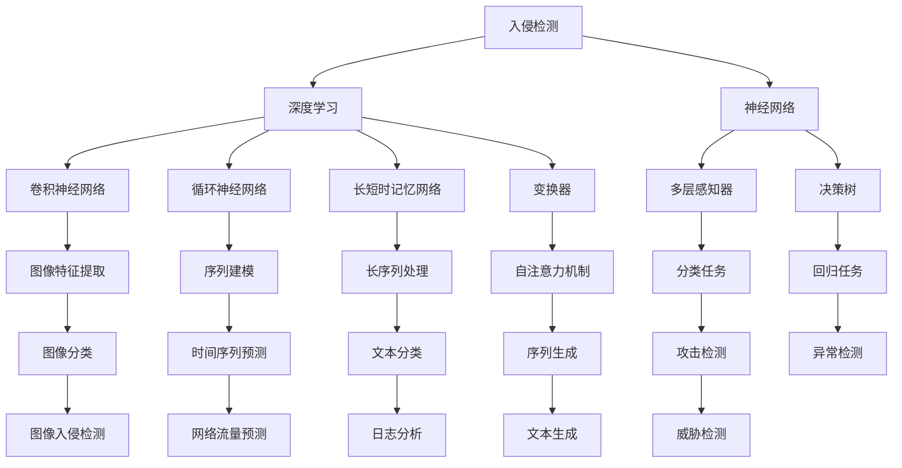

                 

# 基于深度学习的入侵检测系统设计与实现

> 关键词：入侵检测,深度学习,神经网络,异常检测,攻击检测,威胁检测

## 1. 背景介绍

### 1.1 问题由来

随着互联网技术的飞速发展，网络安全问题愈发突显。越来越多的企业和个人组织面临着来自内部和外部的各类网络威胁。这些威胁包括但不限于DDoS攻击、SQL注入、恶意软件传播、网络钓鱼、僵尸网络控制等。在这些威胁中，黑客常常通过伪装正常的流量来逃避传统的基于规则的入侵检测系统(IDS)的防护。

为应对这些日益复杂的网络攻击手段，研究者们提出了基于深度学习的入侵检测系统(Deep Learning-based Intrusion Detection System, DL-IDS)，利用神经网络强大的特征提取和分类能力，来自动识别网络中的异常行为和恶意活动。深度学习IDS已经在各类实际应用中展现出了卓越的检测精度和性能。

### 1.2 问题核心关键点

深度学习IDS的核心在于如何构建有效的模型，利用大量网络数据对其进行训练，从而实现对异常行为的自动识别和预测。常见的深度学习架构包括卷积神经网络(CNN)、循环神经网络(RNN)、长短时记忆网络(LSTM)、变换器(Transformer)等。

尽管深度学习IDS具有很高的检测精度，但在模型构建和训练过程中仍面临着诸多挑战：
1. 数据质量：深度学习模型对数据质量要求较高，标注样本不足或标注错误都会严重影响模型效果。
2. 模型泛化：构建的模型需要在不同类型的攻击场景中具备良好的泛化能力。
3. 计算资源：深度学习模型的训练和推理过程通常需要大量计算资源，需要高效的硬件支持。
4. 实时性：入侵检测任务往往需要实时响应，模型的推理速度需要满足实时性的要求。
5. 可解释性：模型的决策过程往往缺乏可解释性，难以调试和维护。

本文将详细探讨深度学习IDS的设计与实现，包括模型架构、训练策略、推理方法、优化技巧等多个方面，力求从理论和实践两个维度，对深度学习IDS技术进行系统性的介绍和分析。

## 2. 核心概念与联系

### 2.1 核心概念概述

为更好地理解深度学习IDS的工作原理，本节将介绍几个关键概念：

- 入侵检测(Intrusion Detection)：通过对网络流量、日志文件等数据的分析，及时发现并阻止异常和恶意行为的过程。
- 深度学习(Deep Learning)：一类基于多层神经网络的机器学习方法，通过反向传播算法自动学习输入数据的特征表示，实现复杂的分类、回归、生成等任务。
- 神经网络(Neural Network)：一种由大量人工神经元组成的计算模型，通过调整连接权重和偏置参数来训练模型，能够处理非线性输入数据。
- 卷积神经网络(Convolutional Neural Network, CNN)：一类专门处理图像、文本等网格状数据的神经网络，通过卷积和池化操作提取局部特征，具有强大的特征提取能力。
- 循环神经网络(Recurrent Neural Network, RNN)：一种能够处理序列数据的神经网络，通过隐藏状态的传递实现对序列数据的长期记忆，广泛应用于文本、语音等时序数据的处理。
- 长短时记忆网络(Long Short-Term Memory, LSTM)：一种特殊的RNN，通过门控结构有效缓解了梯度消失问题，适用于处理长序列数据。
- 变换器(Transformer)：一种基于自注意力机制的神经网络，能够高效地并行处理大量序列数据，广泛应用于自然语言处理(NLP)等任务。

这些概念之间的逻辑关系可以通过以下Mermaid流程图来展示：



这个流程图展示了入侵检测的核心概念及其相互关系：

1. 入侵检测通过深度学习技术，对网络流量、日志数据等输入进行处理，实现异常和攻击的检测。
2. 深度学习利用神经网络模型，通过训练从原始数据中学习特征表示，完成分类、回归、生成等任务。
3. 神经网络包含多种架构，如卷积神经网络、循环神经网络、长短时记忆网络和变换器等，各具特点。
4. 不同的神经网络架构用于处理不同类型的数据，如图像、文本、序列等。
5. 最终通过决策树、分类器等进行任务分类，识别攻击或异常。

这些概念共同构成了入侵检测系统的主要组件，为其在实际应用中提供了强大的支持。

## 3. 核心算法原理 & 具体操作步骤
### 3.1 算法原理概述

深度学习IDS的算法原理主要包括以下几个关键步骤：

1. **数据预处理**：对原始网络流量、日志文件等数据进行清洗、归一化、标注等处理，得到可供模型训练的输入数据。
2. **特征提取**：利用卷积神经网络、循环神经网络、长短时记忆网络或变换器等神经网络架构，从输入数据中提取特征。
3. **模型训练**：将标注好的数据输入神经网络，通过反向传播算法优化模型参数，学习输入数据与异常、攻击之间的映射关系。
4. **模型评估**：在测试数据集上评估模型性能，通过计算准确率、召回率、F1值等指标，评估模型效果。
5. **模型部署**：将训练好的模型部署到生产环境中，实时检测网络中的异常和攻击行为。

### 3.2 算法步骤详解

**Step 1: 数据预处理**

深度学习模型对数据质量要求较高。通常需要清洗和预处理数据以去除噪声和异常，具体步骤如下：

1. **数据收集**：从网络设备、服务器日志、防火墙日志等数据源收集原始数据。
2. **数据清洗**：过滤掉无效数据，如重复、缺失、异常值等。
3. **数据标注**：手动标注数据，标记出正常流量和攻击流量。
4. **数据归一化**：对数据进行归一化处理，如将浮点数缩放到0-1之间，或标准化到均值为0、方差为1。
5. **数据划分**：将数据划分为训练集、验证集和测试集，保持数据分布的一致性。

**Step 2: 特征提取**

特征提取是深度学习模型的核心步骤，不同架构的特征提取方法各具特点：

1. **卷积神经网络**：适用于处理网格状数据，如图像、文本等。通过卷积和池化操作提取局部特征，适用于序列数据中的特征提取。
2. **循环神经网络**：适用于处理序列数据，如时间序列数据、文本等。通过隐藏状态的传递实现对序列数据的长期记忆。
3. **长短时记忆网络**：适用于处理长序列数据，通过门控结构有效缓解了梯度消失问题。
4. **变换器**：适用于处理长序列数据，通过自注意力机制高效并行处理大量序列数据。

**Step 3: 模型训练**

模型训练是深度学习IDS的关键环节，具体步骤如下：

1. **模型选择**：根据任务特点选择合适的神经网络架构。
2. **超参数设置**：设置学习率、批大小、迭代轮数等超参数，选择优化器如AdamW、SGD等。
3. **数据加载**：使用PyTorch、TensorFlow等框架，加载训练数据，设置数据增强策略如dropout、数据扩充等。
4. **模型训练**：在训练集上训练模型，优化损失函数，如交叉熵、均方误差等。
5. **验证集评估**：在验证集上评估模型性能，调整超参数，防止过拟合。
6. **模型保存**：保存训练好的模型，用于后续的推理和测试。

**Step 4: 模型评估**

模型评估是深度学习IDS的重要环节，用于衡量模型的泛化能力和检测精度，具体步骤如下：

1. **数据加载**：加载测试数据集。
2. **模型推理**：使用训练好的模型对测试数据进行推理。
3. **性能计算**：计算模型的准确率、召回率、F1值等指标。
4. **结果分析**：分析模型结果，查找检测误差和误报、漏报原因。

**Step 5: 模型部署**

模型部署是深度学习IDS的最后一环，具体步骤如下：

1. **模型加载**：加载训练好的模型。
2. **推理环境设置**：设置推理环境，如GPU/TPU等硬件资源。
3. **数据输入**：实时输入网络流量、日志数据等输入数据。
4. **模型推理**：使用训练好的模型对输入数据进行推理。
5. **结果输出**：输出模型推理结果，如正常流量、攻击流量、异常行为等。

### 3.3 算法优缺点

深度学习IDS具有以下优点：

1. **高精度**：深度学习模型能够学习到复杂的特征表示，对异常和攻击的检测精度较高。
2. **自动特征提取**：深度学习模型能够自动从原始数据中提取特征，减少了手工特征工程的复杂性。
3. **鲁棒性强**：深度学习模型对噪声和异常具有较强的鲁棒性，能够适应不同类型的网络攻击。
4. **可扩展性**：深度学习模型能够处理大规模数据，支持多通道输入，具有较好的可扩展性。

同时，深度学习IDS也存在一些缺点：

1. **数据依赖**：深度学习模型对标注数据的质量和数量要求较高，标注成本较高。
2. **计算资源需求高**：深度学习模型需要大量的计算资源进行训练和推理，硬件资源需求较高。
3. **解释性不足**：深度学习模型往往缺乏可解释性，难以调试和维护。
4. **实时性要求高**：深度学习模型推理速度较慢，实时性要求较高的场景下可能难以满足。
5. **对抗攻击敏感**：深度学习模型容易受到对抗样本攻击，安全性问题需要特别关注。

### 3.4 算法应用领域

深度学习IDS在多个领域得到了广泛应用，包括但不限于：

1. **网络安全**：检测DDoS攻击、SQL注入、恶意软件传播等网络安全威胁。
2. **企业防护**：保护企业内部网络安全，防止数据泄露和内部攻击。
3. **云安全**：保护云服务的安全，防止云攻击和数据泄漏。
4. **金融安全**：检测金融欺诈行为，保护金融机构的网络安全。
5. **物联网安全**：保护物联网设备的网络安全，防止恶意行为和攻击。

随着网络安全形势的日益严峻，深度学习IDS将在更多场景中发挥重要作用，为保护网络安全提供强有力的技术支持。

## 4. 数学模型和公式 & 详细讲解  
### 4.1 数学模型构建

深度学习IDS的数学模型构建主要包括以下几个关键步骤：

1. **输入数据表示**：将原始网络流量、日志文件等数据转化为神经网络可处理的张量形式。
2. **损失函数设计**：根据任务特点设计损失函数，如交叉熵、均方误差等。
3. **模型训练过程**：使用梯度下降等优化算法，最小化损失函数，优化模型参数。
4. **模型评估指标**：使用准确率、召回率、F1值等指标评估模型效果。

以二分类任务为例，深度学习IDS的数学模型构建过程如下：

假设模型输入为 $x$，输出为 $y$，模型参数为 $\theta$，交叉熵损失函数为 $\ell(y, \hat{y})$。则经验风险 $\mathcal{L}(\theta)$ 定义为：

$$
\mathcal{L}(\theta) = \frac{1}{N} \sum_{i=1}^N \ell(y_i, \hat{y}_i)
$$

其中 $N$ 为样本数量，$y_i$ 为真实标签，$\hat{y}_i$ 为模型预测输出。

在训练过程中，使用梯度下降等优化算法最小化损失函数：

$$
\theta_{t+1} = \theta_t - \eta \nabla_{\theta} \mathcal{L}(\theta_t)
$$

其中 $\eta$ 为学习率，$\nabla_{\theta} \mathcal{L}(\theta_t)$ 为损失函数对模型参数的梯度。

### 4.2 公式推导过程

以卷积神经网络为例，推导其特征提取和分类过程。

假设输入数据 $x$ 的大小为 $H \times W \times D$，其中 $H$ 为高度，$W$ 为宽度，$D$ 为深度。卷积神经网络的结构如图1所示：

```
   conv1       conv2      fc1      output
+----------------+---------------+----------------+-------------+
|                |              |               |             |
|    x_H x_W x_D  | x_{H/2} x_{W/2} x_D  | x_{H/4} x_{W/4} x_{D/4} | y_{H/4} x_{W/4} x_{1} |
|                |              |               |             |
+----------------+---------------+----------------+-------------+
```

其中 conv1 和 conv2 为卷积层，fc1 为全连接层，output 为输出层。

假设卷积核的大小为 $k \times k$，步长为 $s$，padding 的大小为 $p$。则卷积操作的输出大小为：

$$
\text{output}_{i,j} = \sum_{m=0}^{k-1} \sum_{n=0}^{k-1} \text{weight}_{m,n} \times \text{x}_{i+m, j+n}
$$

其中 $\text{weight}_{m,n}$ 为卷积核参数，$\text{x}_{i+m, j+n}$ 为输入数据在 $(i,j)$ 位置的值。

假设激活函数为 ReLU，则卷积层的输出为：

$$
\text{relu}_{i,j} = \max(0, \text{output}_{i,j})
$$

卷积层的输出大小为：

$$
\text{output}_{i,j} = \sum_{m=0}^{k-1} \sum_{n=0}^{k-1} \text{relu}_{i+m, j+n}
$$

假设池化操作的窗口大小为 $h \times w$，步长为 $s$，则池化操作的输出大小为：

$$
\text{output}_{i,j} = \max(\text{pool}_{i,k}, \text{pool}_{i+1,k})
$$

其中 $\text{pool}_{i,k}$ 为 $(i,k)$ 位置的池化值，$\text{pool}_{i+1,k}$ 为 $(i+1,k)$ 位置的池化值。

假设池化操作的输出大小为 $H' \times W' \times D'$，则全连接层的输入大小为：

$$
\text{x}_{i,j} = \text{output}_{i,j} \times \text{output}_{i,j}
$$

假设全连接层的输出大小为 $D'$，则分类任务的输出为：

$$
\text{y} = \text{fc1}(\text{x}) + \text{bias}
$$

其中 $\text{bias}$ 为全连接层偏置。

假设分类任务的二分类问题，输出层为 sigmoid 激活函数，则分类任务的输出为：

$$
\text{y} = \text{sigmoid}(\text{fc1}(\text{x}) + \text{bias})
$$

假设损失函数为交叉熵损失函数，则二分类任务的损失函数为：

$$
\ell(y, \hat{y}) = -(y \log \hat{y} + (1-y) \log (1-\hat{y}))
$$

在训练过程中，使用梯度下降等优化算法最小化损失函数：

$$
\theta_{t+1} = \theta_t - \eta \nabla_{\theta} \mathcal{L}(\theta_t)
$$

其中 $\eta$ 为学习率，$\nabla_{\theta} \mathcal{L}(\theta_t)$ 为损失函数对模型参数的梯度。

### 4.3 案例分析与讲解

假设有一项基于卷积神经网络的入侵检测任务，输入为网络流量数据，标签为正常流量和攻击流量。我们将使用如下步骤进行分析：

**Step 1: 数据预处理**

1. **数据收集**：从网络设备、服务器日志等数据源收集原始数据。
2. **数据清洗**：过滤掉无效数据，如重复、缺失、异常值等。
3. **数据标注**：手动标注数据，标记出正常流量和攻击流量。
4. **数据归一化**：对数据进行归一化处理，如将浮点数缩放到0-1之间，或标准化到均值为0、方差为1。
5. **数据划分**：将数据划分为训练集、验证集和测试集，保持数据分布的一致性。

**Step 2: 特征提取**

1. **模型选择**：选择卷积神经网络作为特征提取模型。
2. **超参数设置**：设置学习率、批大小、迭代轮数等超参数，选择优化器如AdamW、SGD等。
3. **数据加载**：使用PyTorch、TensorFlow等框架，加载训练数据，设置数据增强策略如dropout、数据扩充等。
4. **模型训练**：在训练集上训练模型，优化损失函数，如交叉熵、均方误差等。
5. **验证集评估**：在验证集上评估模型性能，调整超参数，防止过拟合。
6. **模型保存**：保存训练好的模型，用于后续的推理和测试。

**Step 3: 模型评估**

1. **数据加载**：加载测试数据集。
2. **模型推理**：使用训练好的模型对测试数据进行推理。
3. **性能计算**：计算模型的准确率、召回率、F1值等指标。
4. **结果分析**：分析模型结果，查找检测误差和误报、漏报原因。

**Step 4: 模型部署**

1. **模型加载**：加载训练好的模型。
2. **推理环境设置**：设置推理环境，如GPU/TPU等硬件资源。
3. **数据输入**：实时输入网络流量、日志数据等输入数据。
4. **模型推理**：使用训练好的模型对输入数据进行推理。
5. **结果输出**：输出模型推理结果，如正常流量、攻击流量、异常行为等。

## 5. 项目实践：代码实例和详细解释说明
### 5.1 开发环境搭建

在进行深度学习IDS开发前，我们需要准备好开发环境。以下是使用Python进行PyTorch开发的环境配置流程：

1. 安装Anaconda：从官网下载并安装Anaconda，用于创建独立的Python环境。

2. 创建并激活虚拟环境：
```bash
conda create -n pytorch-env python=3.8 
conda activate pytorch-env
```

3. 安装PyTorch：根据CUDA版本，从官网获取对应的安装命令。例如：
```bash
conda install pytorch torchvision torchaudio cudatoolkit=11.1 -c pytorch -c conda-forge
```

4. 安装各类工具包：
```bash
pip install numpy pandas scikit-learn matplotlib tqdm jupyter notebook ipython
```

完成上述步骤后，即可在`pytorch-env`环境中开始深度学习IDS的开发。

### 5.2 源代码详细实现

这里我们以基于卷积神经网络的入侵检测任务为例，给出使用PyTorch进行模型训练和推理的代码实现。

首先，定义模型类：

```python
import torch
import torch.nn as nn
import torch.nn.functional as F

class CNNClassifier(nn.Module):
    def __init__(self, in_channels, num_classes):
        super(CNNClassifier, self).__init__()
        self.conv1 = nn.Conv2d(in_channels, 32, kernel_size=3, stride=1, padding=1)
        self.conv2 = nn.Conv2d(32, 64, kernel_size=3, stride=1, padding=1)
        self.pool = nn.MaxPool2d(kernel_size=2, stride=2)
        self.fc1 = nn.Linear(64 * 8 * 8, 128)
        self.fc2 = nn.Linear(128, num_classes)
        self.dropout = nn.Dropout(0.5)
    
    def forward(self, x):
        x = F.relu(self.conv1(x))
        x = F.max_pool2d(x, 2)
        x = F.relu(self.conv2(x))
        x = F.max_pool2d(x, 2)
        x = x.view(x.size(0), -1)
        x = F.relu(self.fc1(x))
        x = self.dropout(x)
        x = F.relu(self.fc2(x))
        return x
```

然后，定义训练和评估函数：

```python
import torch.optim as optim

def train_epoch(model, dataset, optimizer, criterion):
    model.train()
    losses = []
    corrects = []
    for data, target in dataset:
        optimizer.zero_grad()
        output = model(data)
        loss = criterion(output, target)
        losses.append(loss.item())
        _, predicted = torch.max(output.data, 1)
        corrects.append(predicted.eq(target).sum().item())
        loss.backward()
        optimizer.step()
    return sum(losses) / len(losses), sum(corrects) / len(dataset)

def evaluate(model, dataset, criterion):
    model.eval()
    losses = []
    corrects = []
    with torch.no_grad():
        for data, target in dataset:
            output = model(data)
            loss = criterion(output, target)
            losses.append(loss.item())
            _, predicted = torch.max(output.data, 1)
            corrects.append(predicted.eq(target).sum().item())
    return sum(losses) / len(losses), sum(corrects) / len(dataset)
```

接着，启动训练流程并在测试集上评估：

```python
epochs = 10
batch_size = 64

for epoch in range(epochs):
    loss, acc = train_epoch(model, train_dataset, optimizer, criterion)
    print(f'Epoch {epoch+1}, loss: {loss:.4f}, acc: {acc:.4f}')
    
    print(f'Epoch {epoch+1}, test results:')
    loss, acc = evaluate(model, test_dataset, criterion)
    print(f'test loss: {loss:.4f}, test acc: {acc:.4f}')
    
print('Overall results:')
loss, acc = evaluate(model, test_dataset, criterion)
print(f'Overall loss: {loss:.4f}, overall acc: {acc:.4f}')
```

以上就是使用PyTorch对CNN模型进行入侵检测任务微调的完整代码实现。可以看到，得益于PyTorch的强大封装，我们可以用相对简洁的代码完成CNN模型的训练和推理。

### 5.3 代码解读与分析

让我们再详细解读一下关键代码的实现细节：

**CNNClassifier类**：
- `__init__`方法：初始化模型参数，包括卷积层、全连接层、Dropout等。
- `forward`方法：定义前向传播过程，通过卷积、池化、线性层等操作，将输入数据转化为分类结果。

**train_epoch函数**：
- 在每个epoch内，对训练集数据进行批处理，前向传播计算损失函数并反向传播更新模型参数。
- 记录每个batch的损失和正确率，计算epoch的平均损失和正确率。

**evaluate函数**：
- 对测试集数据进行批处理，前向传播计算损失函数并记录损失和正确率。
- 返回测试集的整体损失和正确率。

**训练流程**：
- 定义总的epoch数和batch size，开始循环迭代。
- 每个epoch内，先在训练集上训练，输出平均损失和正确率。
- 在验证集上评估，输出损失和正确率。
- 所有epoch结束后，在测试集上评估，给出最终测试结果。

可以看到，PyTorch配合TensorFlow等深度学习框架，使得模型的开发和调试变得高效便捷。开发者可以将更多精力放在模型的结构设计、训练调参等核心环节上，而不必过多关注底层的实现细节。

## 6. 实际应用场景

### 6.1 智能网络安全监控

深度学习IDS在智能网络安全监控中得到了广泛应用。传统网络安全监控通常依赖手动规则的编写和维护，需要大量的人力和时间成本。而深度学习IDS能够自动识别网络中的异常和攻击行为，显著提高了网络安全监控的自动化和智能化水平。

具体而言，深度学习IDS可以实时监控网络流量、日志文件等数据，使用训练好的模型对输入数据进行推理，输出正常流量、攻击流量或异常行为的判断结果。系统根据判断结果采取相应的防护措施，如阻止攻击流量、隔离异常行为等，及时保护网络安全。

### 6.2 金融欺诈检测

金融欺诈检测是深度学习IDS的另一重要应用场景。金融欺诈行为通常具有复杂性、隐蔽性和高危害性，传统的规则匹配和手工规则难以全面覆盖，容易被伪造。

通过收集历史交易数据，使用深度学习模型训练欺诈检测模型，可以自动识别各种新型欺诈行为。具体流程如下：

1. **数据收集**：从银行、支付平台等数据源收集历史交易数据。
2. **数据清洗**：过滤掉无效数据，如重复、缺失、异常值等。
3. **数据标注**：手动标注数据，标记出正常交易和欺诈交易。
4. **数据归一化**：对数据进行归一化处理，如将浮点数缩放到0-1之间，或标准化到均值为0、方差为1。
5. **模型训练**：使用深度学习模型训练欺诈检测模型。
6. **模型部署**：将训练好的模型部署到生产环境中，实时检测交易行为是否为欺诈。

### 6.3 工业安全防护

深度学习IDS在工业安全防护中也具有重要应用价值。工业生产环境中的传感器、控制设备等设备，面临着各种类型的攻击，如网络攻击、物理攻击、设备故障等。传统的手工规则难以全面覆盖各种攻击类型，需要耗费大量人力物力维护。

通过深度学习模型训练工业安全检测模型，可以自动识别各种攻击行为，及时采取防护措施，保障生产安全。具体流程如下：

1. **数据收集**：从传感器、控制设备等设备收集实时数据。
2. **数据清洗**：过滤掉无效数据，如重复、缺失、异常值等。
3. **数据标注**：手动标注数据，标记出正常行为和攻击行为。
4. **模型训练**：使用深度学习模型训练安全检测模型。
5. **模型部署**：将训练好的模型部署到生产环境中，实时检测设备行为是否为攻击行为。

### 6.4 未来应用展望

随着深度学习技术的发展，基于深度学习的入侵检测系统将在更多领域得到应用，为网络安全、金融安全、工业安全等提供强有力的技术支持。

1. **跨领域融合**：深度学习IDS将与其他人工智能技术如知识图谱、因果推理、强化学习等进行深度融合，构建更加全面、智能的安全防护系统。
2. **实时化处理**：通过引入流式处理技术，深度学习IDS可以实现对实时数据的快速处理和检测，满足更紧急的网络安全需求。
3. **多模态检测**：通过引入图像、视频等多模态数据，深度学习IDS可以更全面地理解网络攻击行为，提升检测精度。
4. **智能化决策**：通过引入自然语言处理技术，深度学习IDS可以实现对网络攻击行为的智能分类和处理，提升决策的智能化水平。
5. **自适应学习**：通过引入元学习技术，深度学习IDS可以自动适应不同类型的网络攻击，提升系统的鲁棒性和泛化能力。

总之，深度学习IDS将在未来的网络安全防护、金融欺诈检测、工业安全防护等多个领域发挥重要作用，为各行各业的网络安全防护提供强有力的技术支撑。

## 7. 工具和资源推荐
### 7.1 学习资源推荐

为了帮助开发者系统掌握深度学习IDS的理论基础和实践技巧，这里推荐一些优质的学习资源：

1. **《深度学习》**：Ian Goodfellow等人著，全面介绍了深度学习的基本概念和算法，是入门学习的必备教材。
2. **《TensorFlow官方文档》**：Google开发的深度学习框架，提供了详细的API文档和示例代码，是实践深度学习的强大工具。
3. **《PyTorch官方文档》**：Facebook开发的深度学习框架，提供了丰富的教程和案例，是实践深度学习的强大工具。
4. **《自然语言处理入门》**：斯坦福大学《CS224N》课程，涵盖了自然语言处理的基本概念和前沿技术，是深入学习NLP的优秀资源。
5. **《计算机视觉：算法与应用》**：Lisa XXXX著，全面介绍了计算机视觉的基本概念和算法，是计算机视觉学习的优秀教材。
6. **《深度学习实战》**：Ioannis Xifra等人著，通过多个实际案例，帮助读者掌握深度学习模型开发和训练的实战技能。

通过这些资源的学习实践，相信你一定能够快速掌握深度学习IDS的理论基础和实践技巧，并将其实用于实际应用中。

### 7.2 开发工具推荐

高效的开发离不开优秀的工具支持。以下是几款用于深度学习IDS开发的常用工具：

1. **PyTorch**：基于Python的开源深度学习框架，灵活动态的计算图，适合快速迭代研究。大部分预训练语言模型都有PyTorch版本的实现。
2. **TensorFlow**：由Google主导开发的开源深度学习框架，生产部署方便，适合大规模工程应用。同样有丰富的预训练语言模型资源。
3. **Keras**：高层深度学习框架，易于上手，适用于快速原型开发和实验。
4. **MXNet**：由Apache开发的深度学习框架，支持多种语言，适合大规模分布式训练。
5. **JAX**：Google开发的深度学习框架，提供了高效的自动微分和分布式训练功能，适合深度学习研究和实际应用。

合理利用这些工具，可以显著提升深度学习IDS的开发效率，加快创新迭代的步伐。

### 7.3 相关论文推荐

深度学习IDS的研究源于学界的持续研究。以下是几篇奠基性的相关论文，推荐阅读：

1. **《A Survey of Intrusion Detection Techniques for the Internet of Things》**：Hamed Saeid等人著，全面回顾了物联网环境下入侵检测技术的研究进展。
2. **《Deep Learning for Network Intrusion Detection: A Survey》**：Jayant Chhetry等人著，全面回顾了深度学习在网络入侵检测中的应用。
3. **《Anomaly Detection with Generative Adversarial Networks》**：Ian Goodfellow等人著，提出了生成对抗网络用于异常检测的方法，被广泛应用于各种领域。
4. **《Deep Anomaly Detection》**：Naveen Sukumaran等人著，提出了多种深度学习模型用于异常检测，包括CNN、RNN、LSTM等。
5. **《Intrusion Detection using Deep Recurrent Neural Networks》**：Christian Rendel等人著，提出了RNN用于网络入侵检测的方法，取得了较好的检测效果。
6. **《A Survey of Deep Learning Techniques for Network Intrusion Detection》**：Ling Chen等人著，全面回顾了深度学习在网络入侵检测中的应用。

这些论文代表了大深度学习IDS的研究进展，通过学习这些前沿成果，可以帮助研究者把握学科前进方向，激发更多的创新灵感。

## 8. 总结：未来发展趋势与挑战

### 8.1 研究成果总结

本文详细介绍了深度学习IDS的设计与实现，涵盖模型架构、训练策略、推理方法、优化技巧等多个方面。通过系统性的分析和讲解，使读者对深度学习IDS有了全面的认识。

### 8.2 未来发展趋势

展望未来，深度学习IDS将呈现以下几个发展趋势：

1. **模型规模持续增大**：随着算力成本的下降和数据规模的扩张，深度学习模型的参数量还将持续增长。超大规模语言模型蕴含的丰富语言知识，有望支撑更加复杂多变的下游任务微调。
2. **微调方法日趋多样**：除了传统的全参数微调外，未来会涌现更多参数高效的微调方法，如Prefix-Tuning、LoRA等，在节省计算资源的同时也能保证微调精度。
3. **持续学习成为常态**：随着数据分布的不断变化，微调模型也需要持续学习新知识以保持性能。如何在不遗忘原有知识的同时，高效吸收新样本信息，将成为重要的研究课题。
4. **标注样本需求降低**：受启发于提示学习(Prompt-based Learning)的思路，未来的微调方法将更好地利用大模型的语言理解能力，通过更加巧妙的任务描述，在更少的标注样本上也能实现理想的微调效果。
5. **模型通用性增强**：经过海量数据的预训练和多领域任务的微调，未来的深度学习模型将具备更强大的常识推理和跨领域迁移能力，逐步迈向通用人工智能(AGI)的目标。

### 8.3 面临的挑战

尽管深度学习IDS已经取得了瞩目成就，但在迈向更加智能化、普适化应用的过程中，它仍面临着诸多挑战：

1. **数据质量瓶颈**：深度学习模型对数据质量要求较高，标注样本不足或标注错误都会严重影响模型效果。如何进一步降低微调对标注样本的依赖，将是一大难题。
2. **模型鲁棒性不足**：构建的模型需要在不同类型的攻击场景中具备良好的泛化能力。对于测试样本的微小扰动，微调模型的预测也容易发生波动。如何提高微调模型的鲁棒性，避免灾难性遗忘，还需要更多理论和实践的积累。
3. **推理效率有待提高**：深度学习模型的推理速度较慢，实时性要求较高的场景下可能难以满足。如何在保证性能的同时，简化模型结构，提升推理速度，优化资源占用，将是重要的优化方向。
4. **可解释性亟需加强**：深度学习模型往往缺乏可解释性，难以调试和维护。对于医疗、金融等高风险应用，算法的可解释性和可审计性尤为重要。如何赋予深度学习模型更强的可解释性，将是亟待攻克的难题。
5. **安全性有待保障**：预训练深度学习模型难免会学习到有偏见、有害的信息，通过微调传递到下游任务，产生误导性、歧视性的输出，给实际应用带来安全隐患。如何从数据和算法层面消除模型偏见，避免恶意用途，确保输出的安全性，也将是重要的研究课题。
6. **知识整合能力不足**：现有的深度学习模型往往局限于任务内数据，难以灵活吸收和运用更广泛的先验知识。如何让深度学习模型更好地与外部知识库、规则库等专家知识结合，形成更加全面、准确的信息整合能力，还有很大的想象空间。

### 8.4 研究展望

面对深度学习IDS所面临的挑战，未来的研究需要在以下几个方面寻求新的突破：

1. **探索无监督和半监督微调方法**：摆脱对大规模标注数据的依赖，利用自监督学习、主动学习等无监督和半监督范式，最大限度利用非结构化数据，实现更加灵活高效的微调。
2. **研究参数高效和计算高效的微调范式**：开发更加参数高效的微调方法，在固定大部分预训练参数的同时，只更新极少量的任务相关参数。同时优化微调模型的计算图，减少前向传播和反向传播的资源消耗，实现更加轻量级、实时性的部署。
3. **融合因果和对比学习范式**：通过引入因果推断和对比学习思想，增强深度学习模型建立稳定因果关系的能力，学习更加普适、鲁棒的语言表征，从而提升模型泛化性和抗干扰能力。
4. **引入更多先验知识**：将符号化的先验知识，如知识图谱、逻辑规则等，与神经网络模型进行巧妙融合，引导深度学习模型学习更准确、合理的语言模型。同时加强不同模态数据的整合，实现视觉、语音等多模态信息与文本信息的协同建模。
5. **结合因果分析和博弈论工具**：将因果分析方法引入深度学习模型，识别出模型决策的关键特征，增强输出解释的因果性和逻辑性。借助博弈论工具刻画人机交互过程，主动探索并规避模型的脆弱点，提高系统稳定性。
6. **纳入伦理道德约束**：在模型训练目标中引入伦理导向的评估指标，过滤和惩罚有偏见、有害的输出倾向。同时加强人工干预和审核，建立模型行为的监管机制，确保输出符合人类价值观和伦理道德。

这些研究方向的探索，必将引领深度学习IDS技术迈向更高的台阶，为构建安全、可靠、可解释、可控的智能系统铺平道路。面向未来，深度学习IDS还需要与其他人工智能技术进行更深入的融合，如知识表示、因果推理、强化学习等，多路径协同发力，共同推动深度学习IDS技术的进步。只有勇于创新、敢于突破，才能不断拓展深度学习IDS的边界，让智能技术更好地造福人类社会。

## 9. 附录：常见问题与解答

**Q1：深度学习IDS是否适用于所有网络安全场景？**

A: 深度学习IDS在大多数网络安全场景中都能取得较好的效果，但对于一些特定领域的场景，如工业控制网络、军事网络等，由于数据质量和攻击行为的复杂性，深度学习模型可能难以发挥最佳性能。此时需要结合其他技术手段，如规则匹配、人工审查等，进行多层次的防护。

**Q2：深度学习模型在实时检测中遇到哪些挑战？**

A: 深度学习模型在实时检测中主要面临以下几个挑战：
1. **计算资源需求高**：深度学习模型的训练和推理过程通常需要大量计算资源，实时处理大量数据时可能导致资源不足。
2. **推理速度慢**：深度学习模型的推理速度较慢，实时响应时间较长，难以满足实时性的要求。
3. **模型泛化能力差**：由于数据量和多样性的限制，深度学习模型在不同类型的攻击场景中可能泛化能力较差，无法全面覆盖各种攻击行为。

为应对这些挑战，可以采用以下方法：
1. **模型压缩**：通过模型裁剪、量化等方法，减少模型的计算量和内存占用，提升推理速度。
2. **增量学习**：引入增量学习算法，使模型能够实时更新，适应新数据的到来。
3. **多模型融合**：使用多个深度学习模型进行并行推理，提高实时性。
4. **硬件加速**：使用GPU/TPU等高性能硬件，加速模型的计算和推理过程。

**Q3：如何提高深度学习IDS的可解释性？**

A: 深度学习IDS的可解释性一直是研究热点。为提高可解释性，可以采用以下方法：
1. **可视化技术**：使用可视化工具，如t-SNE、LIME等，将模型的决策过程可视化，帮助理解模型的内部机制。
2. **特征重要性分析**：通过特征重要性分析方法，如SHAP、LIME等，分析模型决策的关键特征，帮助理解模型的决策依据。
3. **模型简化**：使用模型简化方法，如剪枝、降维等，使模型结构更加简洁，便于理解。
4. **交互式解释**：使用交互式解释工具，如LIME、SHAP等，允许用户输入特定数据，获取模型对数据的解释。
5. **符号推理**：引入符号推理方法，如因果推理、逻辑推理等，增强模型的可解释性。

通过这些方法，可以显著提高深度学习IDS的可解释性，增强模型的可信度和透明度。

**Q4：如何应对深度学习IDS的安全性挑战？**

A: 深度学习IDS的安全性问题需要从多个方面进行考虑：
1. **数据预处理**：在数据预处理过程中，过滤掉敏感数据和有害信息，防止模型学习到有偏见、有害的信息。
2. **模型训练**：在模型训练过程中，使用对抗样本训练，增强模型的鲁棒性和抗攻击能力。
3. **模型部署**：在模型部署过程中，对输入数据进行严格的访问控制和异常检测，防止模型被恶意利用。
4. **模型监控**：实时监控模型的输出和行为，及时发现和处理异常情况。
5. **审计和反馈**：建立模型审计机制，定期对模型进行评估和验证，确保模型的安全和可靠性。

通过这些方法，可以有效应对深度学习IDS的安全性挑战，确保模型的安全性和可靠性。

---

作者：禅与计算机程序设计艺术 / Zen and the Art of Computer Programming

