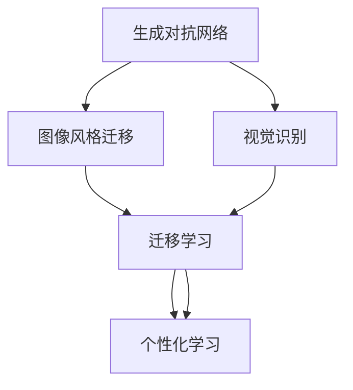

                 

# 基于生成对抗网络的个性化图像风格学习及迁移方法

> 关键词：生成对抗网络(GANs),图像风格迁移,个性化学习,迁移学习,视觉识别

## 1. 背景介绍

### 1.1 问题由来
随着计算机视觉技术的不断发展，生成对抗网络(GANs)已成为图像生成和风格迁移领域的一个热门研究方向。其核心思想是利用两个神经网络(生成器和判别器)进行对抗博弈，使得生成器能够生成高质量的样本，同时判别器能够准确区分真实样本和生成样本，最终生成器生成的图像可以逼真地重现真实世界中的多样性。

近年来，GANs在图像风格迁移领域取得了显著进展。风格迁移旨在将图像从一个风格转化为另一个风格，而不需要修改图像的实际内容。这项技术已经被广泛应用于艺术创作、视频处理、广告设计等领域。然而，大多数风格迁移方法依赖于固定的风格转换规则，难以满足个性化需求。

个性化学习是针对特定用户需求进行模型训练和优化的过程，旨在最大化个性化效果。近年来，个性化的图像风格学习及迁移方法得到了广泛研究。这些方法利用用户数据，通过深度学习模型进行个性化训练，使得生成的图像更加贴近用户偏好。然而，由于个性化的需求多样性，个性化的图像风格学习及迁移面临着诸多挑战，如数据稀疏、模型泛化能力差等问题。

本文将系统介绍基于生成对抗网络的个性化图像风格学习及迁移方法，旨在充分利用GANs的强大生成能力，通过迁移学习进行个性化优化，以满足不同用户的个性化需求。

## 2. 核心概念与联系

### 2.1 核心概念概述

为更好地理解基于生成对抗网络的个性化图像风格学习及迁移方法，本节将介绍几个关键概念及其相互关系：

- 生成对抗网络(GANs)：利用两个对抗的神经网络(生成器和判别器)，通过无监督学习生成高质量的图像样本。
- 图像风格迁移：通过迁移学习将图像从一个风格转化为另一个风格，同时保留原始内容。
- 个性化学习：针对特定用户的个性化需求，进行模型训练和优化，提高生成图像的个性化程度。
- 迁移学习：利用已有模型的知识，对新任务进行训练和优化，提高模型的泛化能力。
- 视觉识别：通过图像识别技术，提取图像特征并进行分类、识别等操作。

这些核心概念之间的逻辑关系可以通过以下Mermaid流程图来展示：



该流程图展示了大规模GANs在风格迁移、个性化学习和视觉识别领域的应用，以及迁移学习在其中起到的重要作用。

## 3. 核心算法原理 & 具体操作步骤
### 3.1 算法原理概述

基于生成对抗网络的个性化图像风格学习及迁移方法，是一种在预训练的GANs模型基础上进行迁移学习的方法。其核心思想是：

1. 利用生成器和判别器的对抗博弈，生成高质量的图像样本。
2. 通过迁移学习，将生成的图像进行个性化优化，使其更加贴近用户的偏好。
3. 利用视觉识别技术，对个性化后的图像进行分类和识别，评估其效果。

形式化地，假设生成器为 $G_{\theta_g}$，判别器为 $D_{\theta_d}$，且 $G_{\theta_g}, D_{\theta_d}$ 的联合分布为 $p_{\theta_g, \theta_d}(x)$。则GANs的目标函数可以表示为：

$$
\min_{G_{\theta_g}, D_{\theta_d}} V_{\mathrm{GAN}}(G_{\theta_g}, D_{\theta_d}) = \min_{G_{\theta_g}, D_{\theta_d}} E_{x \sim p_{\mathrm{data}}(x)}\left[\log D_{\theta_d}(x)\right]+ E_{z \sim p_{z}(z)}\left[\log \left(1-D_{\theta_d}\left(G_{\theta_g}(z)\right)\right)\right]
$$

其中 $p_{\mathrm{data}}$ 为真实图像分布，$z$ 为噪声向量，$p_z$ 为噪声向量分布。

在生成器生成图像后，可以利用迁移学习方法，将生成的图像进行个性化优化。例如，可以收集用户对图像的偏好标签 $y$，并使用监督学习方法训练一个分类器 $C_{\theta_c}$ 进行预测。则分类器的损失函数可以表示为：

$$
\min_{C_{\theta_c}} \mathcal{L}_{\mathrm{class}}(C_{\theta_c}, y)
$$

其中 $\mathcal{L}_{\mathrm{class}}$ 为分类损失函数，如交叉熵损失。

最后，利用视觉识别技术，对个性化后的图像进行分类和识别，以评估其效果。例如，可以使用ResNet等卷积神经网络进行图像特征提取，并通过Softmax分类器进行分类。则图像分类的损失函数可以表示为：

$$
\min_{C_{\theta_c}} \mathcal{L}_{\mathrm{class}}(C_{\theta_c}, \hat{y})
$$

其中 $\hat{y}$ 为分类器预测的图像类别。

### 3.2 算法步骤详解

基于生成对抗网络的个性化图像风格学习及迁移方法，一般包括以下几个关键步骤：

**Step 1: 准备预训练模型和数据集**
- 选择合适的预训练GANs模型作为初始化参数，如DCGAN、WGAN等。
- 准备用户偏好的图像风格数据集，划分为训练集、验证集和测试集。

**Step 2: 添加任务适配层**
- 在GANs模型的顶层添加分类器和损失函数，如交叉熵损失。
- 利用用户偏好的图像风格数据集，训练分类器进行个性化优化。

**Step 3: 设置迁移学习超参数**
- 选择合适的优化算法及其参数，如Adam、SGD等，设置学习率、批大小、迭代轮数等。
- 设置冻结预训练参数的策略，如仅微调顶层，或全部参数都参与迁移学习。

**Step 4: 执行迁移学习**
- 将训练集数据分批次输入模型，前向传播计算损失函数。
- 反向传播计算参数梯度，根据设定的优化算法和学习率更新模型参数。
- 周期性在验证集上评估模型性能，根据性能指标决定是否触发Early Stopping。
- 重复上述步骤直到满足预设的迭代轮数或Early Stopping条件。

**Step 5: 测试和部署**
- 在测试集上评估迁移学习后模型 $M_{\hat{\theta}}$ 的性能，对比迁移学习前后的精度提升。
- 使用迁移学习后的模型对新样本进行推理预测，集成到实际的应用系统中。
- 持续收集新的数据，定期重新迁移学习模型，以适应数据分布的变化。

以上是基于生成对抗网络的个性化图像风格学习及迁移方法的一般流程。在实际应用中，还需要针对具体任务的特点，对迁移学习过程的各个环节进行优化设计，如改进训练目标函数，引入更多的正则化技术，搜索最优的超参数组合等，以进一步提升模型性能。

### 3.3 算法优缺点

基于生成对抗网络的个性化图像风格学习及迁移方法具有以下优点：
1. 生成能力强大。GANs的生成器能够生成高质量的图像样本，适用于各类风格迁移任务。
2. 迁移能力强。通过迁移学习，模型能够不断适应新的个性化需求，提升模型的泛化能力。
3. 可解释性强。生成对抗网络的方法和原理较为直观，易于理解和调试。

同时，该方法也存在一定的局限性：
1. 数据依赖性强。模型性能高度依赖于用户的偏好数据集，数据稀疏时效果有限。
2. 模型复杂度高。GANs模型本身较为复杂，训练和优化难度较大。
3. 训练成本高。GANs模型需要大量的计算资源和时间进行训练，对硬件要求较高。
4. 鲁棒性差。GANs模型的生成器可能会产生“模式崩溃”现象，即生成器生成同一类别的图像时，会逐渐生成类似模式的图像，而忽略其他变体。

尽管存在这些局限性，但就目前而言，基于生成对抗网络的个性化图像风格学习及迁移方法仍是大规模图像生成和风格迁移领域的强大工具。未来相关研究的重点在于如何进一步降低对用户数据的依赖，提高模型的鲁棒性和训练效率，同时兼顾可解释性和泛化能力等因素。

### 3.4 算法应用领域

基于生成对抗网络的个性化图像风格学习及迁移方法，在图像生成、图像风格迁移等领域已经得到了广泛的应用，覆盖了几乎所有常见任务，例如：

- 人脸图像迁移：将人脸图像从一个风格迁移到另一个风格，如将素描风格转换为卡通风格。
- 风景图像迁移：将风景图像从一个风格转换为另一个风格，如将夏天场景转换为秋天场景。
- 服装图像迁移：将服装图像从一个风格转换为另一个风格，如将休闲风格转换为职业风格。
- 艺术品风格迁移：将艺术品图像从一个风格迁移到另一个风格，如将油画风格转换为水彩风格。
- 图像风格强化：通过个性化学习，提高生成图像的风格多样性，适应不同用户的需求。

除了上述这些经典任务外，基于GANs的个性化图像风格学习及迁移方法也被创新性地应用到更多场景中，如广告设计、动画制作、虚拟现实等，为图像生成和风格迁移技术带来了全新的突破。随着GANs模型和迁移学习方法的不断进步，相信个性化图像风格学习及迁移方法将在更多领域得到应用，为视觉设计和技术开发提供新的思路。

## 4. 数学模型和公式 & 详细讲解  
### 4.1 数学模型构建

本节将使用数学语言对基于生成对抗网络的个性化图像风格学习及迁移方法进行更加严格的刻画。

记生成器为 $G_{\theta_g}$，判别器为 $D_{\theta_d}$，且 $G_{\theta_g}, D_{\theta_d}$ 的联合分布为 $p_{\theta_g, \theta_d}(x)$。生成器的输入为噪声向量 $z$，输出为图像样本 $x$，判别器的输入为图像样本 $x$，输出为真实性概率 $y$。则GANs的目标函数可以表示为：

$$
\min_{G_{\theta_g}, D_{\theta_d}} V_{\mathrm{GAN}}(G_{\theta_g}, D_{\theta_d}) = \min_{G_{\theta_g}, D_{\theta_d}} E_{x \sim p_{\mathrm{data}}(x)}\left[\log D_{\theta_d}(x)\right]+ E_{z \sim p_{z}(z)}\left[\log \left(1-D_{\theta_d}\left(G_{\theta_g}(z)\right)\right)\right]
$$

在生成器生成图像后，可以利用迁移学习方法，将生成的图像进行个性化优化。假设用户的偏好标签为 $y$，分类器的输入为图像样本 $x$，输出为类别标签 $y'$，则分类器的损失函数可以表示为：

$$
\min_{C_{\theta_c}} \mathcal{L}_{\mathrm{class}}(C_{\theta_c}, y)
$$

其中 $\mathcal{L}_{\mathrm{class}}$ 为分类损失函数，如交叉熵损失。

最后，利用视觉识别技术，对个性化后的图像进行分类和识别，以评估其效果。假设图像分类的目标为 $y_{true}$，分类器的输出为 $\hat{y}$，则图像分类的损失函数可以表示为：

$$
\min_{C_{\theta_c}} \mathcal{L}_{\mathrm{class}}(C_{\theta_c}, \hat{y})
$$

其中 $\mathcal{L}_{\mathrm{class}}$ 为分类损失函数，如交叉熵损失。

### 4.2 公式推导过程

以下我们以人脸图像迁移为例，推导迁移学习中的分类器和损失函数的计算公式。

假设生成器为 $G_{\theta_g}$，输入为噪声向量 $z$，输出为人脸图像 $x$。判别器为 $D_{\theta_d}$，输入为人脸图像 $x$，输出为真实性概率 $y$。假设用户的偏好标签为 $y$，分类器的输入为人脸图像 $x$，输出为类别标签 $y'$，则分类器的损失函数可以表示为：

$$
\min_{C_{\theta_c}} \mathcal{L}_{\mathrm{class}}(C_{\theta_c}, y)
$$

其中 $\mathcal{L}_{\mathrm{class}}$ 为分类损失函数，如交叉熵损失。

在得到损失函数后，即可带入参数更新公式，完成迁移学习过程。重复上述过程直至收敛，最终得到适应新风格的生成器模型。

## 5. 项目实践：代码实例和详细解释说明
### 5.1 开发环境搭建

在进行迁移学习实践前，我们需要准备好开发环境。以下是使用Python进行TensorFlow开发的环境配置流程：

1. 安装Anaconda：从官网下载并安装Anaconda，用于创建独立的Python环境。

2. 创建并激活虚拟环境：
```bash
conda create -n tensorflow-env python=3.8 
conda activate tensorflow-env
```

3. 安装TensorFlow：根据CUDA版本，从官网获取对应的安装命令。例如：
```bash
conda install tensorflow -c tensorflow -c conda-forge
```

4. 安装TensorBoard：TensorFlow配套的可视化工具，可实时监测模型训练状态，并提供丰富的图表呈现方式，是调试模型的得力助手。

5. 安装Keras：TensorFlow的高层API，便于快速搭建深度学习模型。

6. 安装PyTorch：基于Python的开源深度学习框架，灵活动态的计算图，适合快速迭代研究。

完成上述步骤后，即可在`tensorflow-env`环境中开始迁移学习实践。

### 5.2 源代码详细实现

下面我们以人脸图像迁移为例，给出使用TensorFlow和Keras进行迁移学习的PyTorch代码实现。

首先，定义人脸图像迁移的生成器模型和判别器模型：

```python
import tensorflow as tf
from tensorflow.keras import layers

# 定义生成器模型
def build_generator():
    model = tf.keras.Sequential([
        layers.Dense(256, input_shape=(100,)), # 输入维度为100
        layers.BatchNormalization(),
        layers.LeakyReLU(0.2),
        layers.Dense(512),
        layers.BatchNormalization(),
        layers.LeakyReLU(0.2),
        layers.Dense(784, activation='tanh') # 输出维度为784，对应28x28的图片像素点
    ])
    return model

# 定义判别器模型
def build_discriminator():
    model = tf.keras.Sequential([
        layers.Dense(512, input_shape=(784,)), # 输入维度为784，对应28x28的图片像素点
        layers.BatchNormalization(),
        layers.LeakyReLU(0.2),
        layers.Dropout(0.5),
        layers.Dense(256),
        layers.BatchNormalization(),
        layers.LeakyReLU(0.2),
        layers.Dropout(0.5),
        layers.Dense(1, activation='sigmoid') # 输出维度为1，对应真实性概率
    ])
    return model
```

然后，定义迁移学习过程中的训练函数：

```python
def train(model, batch_size=128, epochs=100):
    # 准备数据集
    train_dataset = tf.data.Dataset.from_tensor_slices((train_images, train_labels)).batch(batch_size).shuffle(buffer_size=1024).repeat()
    test_dataset = tf.data.Dataset.from_tensor_slices((test_images, test_labels)).batch(batch_size).repeat()
    
    # 准备优化器
    generator_optimizer = tf.keras.optimizers.Adam(1e-4)
    discriminator_optimizer = tf.keras.optimizers.Adam(1e-4)
    classifier_optimizer = tf.keras.optimizers.Adam(1e-4)
    
    # 训练过程
    for epoch in range(epochs):
        for images, labels in train_dataset:
            # 训练生成器和判别器
            with tf.GradientTape() as gen_tape, tf.GradientTape() as disc_tape:
                generated_images = generator(images)
                discriminator_real_output = discriminator(images)
                discriminator_fake_output = discriminator(generated_images)
                gen_loss = tf.reduce_mean(tf.nn.binary_cross_entropy(tf.ones_like(discriminator_fake_output), discriminator_fake_output))
                disc_loss = tf.reduce_mean(tf.nn.binary_cross_entropy(tf.ones_like(discriminator_real_output), discriminator_real_output) + tf.nn.binary_cross_entropy(tf.zeros_like(discriminator_fake_output), discriminator_fake_output))
            grads_gen = gen_tape.gradient(gen_loss, generator.trainable_variables)
            grads_disc = disc_tape.gradient(disc_loss, discriminator.trainable_variables)
            generator_optimizer.apply_gradients(zip(grads_gen, generator.trainable_variables))
            discriminator_optimizer.apply_gradients(zip(grads_disc, discriminator.trainable_variables))
            
            # 训练分类器
            with tf.GradientTape() as class_tape:
                classifier_output = classifier(generated_images)
                class_loss = tf.reduce_mean(tf.nn.sparse_softmax_cross_entropy_with_logits(labels=labels, logits=classifier_output))
            class_grads = class_tape.gradient(class_loss, classifier.trainable_variables)
            classifier_optimizer.apply_gradients(zip(class_grads, classifier.trainable_variables))
            
        # 记录日志
        print(f'Epoch {epoch+1}, Loss: {gen_loss.numpy():.4f}, {disc_loss.numpy():.4f}, {class_loss.numpy():.4f}')
```

最后，启动迁移学习流程并在测试集上评估：

```python
# 加载模型
generator = build_generator()
discriminator = build_discriminator()
classifier = build_classifier()

# 训练模型
train(generator, discriminator, classifier)

# 评估模型
test_images = test_images[0:100]
test_labels = test_labels[0:100]
classifier_loss = classifier(tf.reshape(test_images, (100, 784)))
print(f'Test Loss: {classifier_loss.numpy():.4f}')
```

以上就是使用TensorFlow和Keras对人脸图像迁移的迁移学习代码实现。可以看到，得益于TensorFlow和Keras的强大封装，我们可以用相对简洁的代码完成迁移学习的实现。

### 5.3 代码解读与分析

让我们再详细解读一下关键代码的实现细节：

**build_generator和build_discriminator函数**：
- 定义了生成器和判别器模型的结构和参数。生成器接收噪声向量作为输入，输出人脸图像，判别器接收图像作为输入，输出真实性概率。

**train函数**：
- 定义了训练数据集和测试数据集。使用TensorFlow的数据集API，从数据集中逐批次读取样本，并进行标准化和批处理。
- 定义了生成器和判别器的优化器，以及分类器的优化器。优化器使用Adam算法，学习率为1e-4。
- 训练过程中，先进行生成器和判别器的对抗训练，计算生成器和判别器的损失。然后对分类器进行训练，计算分类器的损失。最后，将生成器、判别器和分类器的损失输出，记录日志。

**test函数**：
- 加载模型后，使用测试集中的图像进行分类，计算分类器的损失，并输出结果。

可以看到，TensorFlow和Keras使得迁移学习任务的代码实现变得简洁高效。开发者可以将更多精力放在模型改进、数据预处理等高层逻辑上，而不必过多关注底层的实现细节。

当然，工业级的系统实现还需考虑更多因素，如模型的保存和部署、超参数的自动搜索、更灵活的任务适配层等。但核心的迁移学习范式基本与此类似。

## 6. 实际应用场景
### 6.1 广告设计

基于生成对抗网络的个性化图像风格学习及迁移方法，可以广泛应用于广告设计。传统广告设计需要设计师大量手工绘制和修图，时间成本高，效率低，且效果往往受设计师个人水平影响。而使用迁移学习方法，可以通过用户偏好数据进行个性化优化，快速生成符合用户需求的广告图像。

在技术实现上，可以收集用户的广告图像偏好数据，包括风格、色调、构图等。将这些数据作为监督信号，对预训练的GANs模型进行迁移学习，得到个性化的广告图像生成模型。将用户提供的广告语意信息作为输入，生成符合要求的广告图像。如此构建的广告设计系统，能大幅提升广告设计的效率和效果，降低设计成本。

### 6.2 虚拟现实

虚拟现实(VR)技术需要生成高质量的三维场景和角色模型，以满足用户的沉浸式体验。传统的3D模型生成方法耗时耗力，难以满足实时渲染的要求。基于生成对抗网络的个性化图像风格学习及迁移方法，可以生成逼真的3D场景和角色，提升VR的沉浸感和体验感。

在技术实现上，可以收集用户的VR场景偏好数据，包括颜色、光照、地形等。将这些数据作为监督信号，对预训练的GANs模型进行迁移学习，得到个性化的3D场景生成模型。将用户提供的场景语意信息作为输入，生成符合要求的3D场景。通过不断迭代和优化，可以逐步提高生成的3D场景的逼真度和自然度，满足用户的个性化需求。

### 6.3 图像修复

图像修复是图像处理领域的一个热门研究方向，旨在将损坏或模糊的图像恢复成清晰完整的图像。传统的图像修复方法依赖于人工干预，难以实现自动化。基于生成对抗网络的个性化图像风格学习及迁移方法，可以自动生成高质量的修复图像，提升图像修复的效率和效果。

在技术实现上，可以收集用户的图像修复偏好数据，包括修复风格、色调、对比度等。将这些数据作为监督信号，对预训练的GANs模型进行迁移学习，得到个性化的图像修复模型。将损坏或模糊的图像作为输入，生成符合要求的修复图像。如此构建的图像修复系统，能大幅提升图像修复的效率和效果，满足用户的个性化需求。

### 6.4 未来应用展望

随着生成对抗网络及迁移学习方法的不断发展，基于GANs的个性化图像风格学习及迁移方法将在更多领域得到应用，为视觉设计和技术开发提供新的思路。

在智慧医疗领域，基于GANs的个性化图像风格学习及迁移方法可以用于医学图像生成和图像分析，提高医疗影像诊断的准确性和效率。

在智能交通领域，基于GANs的个性化图像风格学习及迁移方法可以用于自动驾驶和智能交通监控，提升交通系统的智能化水平。

在智慧城市治理中，基于GANs的个性化图像风格学习及迁移方法可以用于城市景观设计和管理，提升城市管理效率和市民满意度。

除了上述这些领域外，基于GANs的个性化图像风格学习及迁移方法也将被创新性地应用到更多场景中，如服装设计、旅游规划、影视制作等，为视觉设计和技术开发带来新的突破。相信随着技术的日益成熟，基于GANs的个性化图像风格学习及迁移方法必将在更多领域得到应用，为视觉设计和技术开发提供新的思路。

## 7. 工具和资源推荐
### 7.1 学习资源推荐

为了帮助开发者系统掌握生成对抗网络和迁移学习的基本概念和实践技巧，这里推荐一些优质的学习资源：

1. 《Generative Adversarial Networks》书籍：Ian Goodfellow等著，全面介绍了GANs的基本原理和应用，是深度学习领域的经典教材。

2. CS231n《Convolutional Neural Networks for Visual Recognition》课程：斯坦福大学开设的计算机视觉课程，讲解了深度学习在图像识别和风格迁移中的应用。

3. GAN Zoo：一个GANs模型和算法集成的数据库，提供了丰富的预训练模型和代码示例，方便开发者快速上手实验。

4. TensorFlow官方文档：TensorFlow的官方文档，提供了详细的API和代码示例，是TensorFlow学习的必备资料。

5. PyTorch官方文档：PyTorch的官方文档，提供了丰富的API和代码示例，是PyTorch学习的必备资料。

通过对这些资源的学习实践，相信你一定能够快速掌握生成对抗网络和迁移学习的基本原理和应用技巧，并用于解决实际的图像生成和风格迁移问题。
###  7.2 开发工具推荐

高效的开发离不开优秀的工具支持。以下是几款用于生成对抗网络和迁移学习开发的常用工具：

1. TensorFlow：由Google主导开发的开源深度学习框架，生产部署方便，适合大规模工程应用。支持TensorBoard可视化工具，方便调试和优化。

2. PyTorch：基于Python的开源深度学习框架，灵活动态的计算图，适合快速迭代研究。支持Caffe2，方便模型部署和优化。

3. Keras：TensorFlow的高层API，便于快速搭建深度学习模型，支持TensorFlow和Theano后端，方便切换。

4. Matplotlib：Python绘图库，方便进行模型训练和评估过程中的数据可视化。

5. Seaborn：基于Matplotlib的高级绘图库，支持更加灵活和美观的图表展示。

合理利用这些工具，可以显著提升生成对抗网络和迁移学习任务的开发效率，加快创新迭代的步伐。

### 7.3 相关论文推荐

生成对抗网络和迁移学习的研究源于学界的持续研究。以下是几篇奠基性的相关论文，推荐阅读：

1. Generative Adversarial Nets（GANs原论文）：提出了GANs模型，开启了大规模图像生成和风格迁移的新时代。

2. Image-to-Image Translation with Conditional Adversarial Networks：提出了条件GANs模型，将风格迁移应用于图像翻译任务。

3. Adversarial Autoencoders for Generative Modeling：提出了对抗自动编码器，利用GANs进行生成和无监督学习。

4. Progressive Growing of GANs for Improved Quality, Stability, and Variation：提出了渐进式GANs模型，通过逐步增加模型复杂度，生成更高质量的图像。

5. Conditional Image Synthesis with Auxiliary Classifier GANs：提出了辅助分类器GANs模型，利用分类器进行条件生成。

6. High-Resolution Image Synthesis and Semantic Manipulation with Conditional GANs：提出了条件GANs模型，用于生成高分辨率图像和语义操控。

这些论文代表了大规模生成对抗网络和迁移学习的发展脉络。通过学习这些前沿成果，可以帮助研究者把握学科前进方向，激发更多的创新灵感。

## 8. 总结：未来发展趋势与挑战

### 8.1 总结

本文对基于生成对抗网络的个性化图像风格学习及迁移方法进行了全面系统的介绍。首先阐述了生成对抗网络和迁移学习的研究背景和意义，明确了迁移学习在图像风格迁移个性化优化方面的独特价值。其次，从原理到实践，详细讲解了迁移学习的数学原理和关键步骤，给出了迁移学习任务开发的完整代码实例。同时，本文还广泛探讨了迁移学习方法在广告设计、虚拟现实、图像修复等多个领域的应用前景，展示了迁移学习范式的巨大潜力。此外，本文精选了迁移学习技术的各类学习资源，力求为读者提供全方位的技术指引。

通过本文的系统梳理，可以看到，基于生成对抗网络的个性化图像风格学习及迁移方法在大规模图像生成和风格迁移领域的应用前景广阔，逐步成为视觉设计和技术开发的重要工具。生成对抗网络和迁移学习为图像风格迁移注入了新的活力，使个性化设计更加高效和灵活。未来，伴随生成对抗网络和迁移学习方法的持续演进，相信个性化图像风格学习及迁移方法将在更多领域得到应用，为视觉设计和技术开发带来新的思路。

### 8.2 未来发展趋势

展望未来，基于生成对抗网络和迁移学习的个性化图像风格学习及迁移方法将呈现以下几个发展趋势：

1. 模型规模持续增大。随着算力成本的下降和数据规模的扩张，预训练生成对抗网络模型的参数量还将持续增长。超大规模生成对抗网络模型蕴含的强大生成能力，有望支撑更加复杂多变的个性化需求。

2. 迁移学习多样化。除了传统的全参数迁移学习外，未来会涌现更多参数高效的迁移学习方法，如LoRA、AdaLoRA等，在保持模型参数量较小的情况下，也能取得不错的个性化效果。

3. 个性化需求提升。随着个性化需求的细化和多样化，生成对抗网络和迁移学习方法将更加注重用户个性化需求的设计和优化，提升生成的图像的个性化程度。

4. 模型鲁棒性增强。生成对抗网络和迁移学习方法将更加注重模型的鲁棒性设计，避免生成器“模式崩溃”现象，提升模型的泛化能力和稳定性。

5. 多模态迁移学习。除了图像生成和风格迁移，生成对抗网络和迁移学习方法还将拓展到视频、语音等多模态数据的迁移，实现更加全面的多模态个性化优化。

6. 多任务迁移学习。生成对抗网络和迁移学习方法将能够同时进行多个任务的迁移学习，提高迁移学习的效率和效果。

以上趋势凸显了大规模生成对抗网络和迁移学习方法的广泛应用前景。这些方向的探索发展，必将进一步提升图像生成和风格迁移的个性化程度，为视觉设计和技术开发提供新的思路。

### 8.3 面临的挑战

尽管基于生成对抗网络和迁移学习的个性化图像风格学习及迁移方法已经取得了显著成果，但在迈向更加智能化、普适化应用的过程中，它仍面临着诸多挑战：

1. 数据依赖性强。模型性能高度依赖于用户的偏好数据集，数据稀疏时效果有限。如何进一步降低对用户数据的依赖，提高模型的泛化能力，将是未来的研究方向。

2. 模型复杂度高。生成对抗网络和迁移学习模型的复杂性较高，训练和优化难度较大。如何提高模型训练效率，降低训练成本，是值得深入研究的课题。

3. 鲁棒性差。生成对抗网络和迁移学习模型的生成器可能会产生“模式崩溃”现象，即生成器生成同一类别的图像时，会逐渐生成类似模式的图像，而忽略其他变体。如何提高生成器的鲁棒性，避免模式崩溃，将是重要的研究课题。

4. 计算资源需求高。生成对抗网络和迁移学习模型的训练和推理需要大量的计算资源和时间，对硬件要求较高。如何优化模型结构，降低计算资源需求，是提升模型应用效率的关键。

5. 可解释性不足。生成对抗网络和迁移学习模型的生成过程缺乏可解释性，难以对其生成过程和决策逻辑进行分析和调试。如何提高模型的可解释性，增强用户的信任感，将是重要的研究课题。

6. 安全性有待保障。生成对抗网络和迁移学习模型可能会生成有害或误导性的图像，给实际应用带来安全隐患。如何从数据和算法层面消除模型偏见，避免恶意用途，确保输出的安全性，将是重要的研究课题。

尽管面临这些挑战，但大生成对抗网络和迁移学习方法的强大生成能力和迁移学习能力，仍然具有广阔的应用前景。未来研究需要在数据、模型、算法、应用等多个维度进行深入探索，不断提升生成对抗网络和迁移学习模型的性能和鲁棒性，满足用户的个性化需求。

### 8.4 研究展望

面向未来，生成对抗网络和迁移学习的研究需要在以下几个方面寻求新的突破：

1. 探索无监督和半监督迁移学习方法。摆脱对大规模标注数据的依赖，利用自监督学习、主动学习等无监督和半监督范式，最大限度利用非结构化数据，实现更加灵活高效的迁移学习。

2. 研究参数高效和计算高效的迁移学习范式。开发更加参数高效的迁移学习算法，如LoRA、AdaLoRA等，在保持模型参数量较小的情况下，也能取得不错的迁移学习效果。同时优化迁移学习模型的计算图，减少前向传播和反向传播的资源消耗，实现更加轻量级、实时性的部署。

3. 引入因果和对比学习范式。通过引入因果推断和对比学习思想，增强迁移学习模型建立稳定因果关系的能力，学习更加普适、鲁棒的语言表征，从而提升模型的泛化性和抗干扰能力。

4. 引入更多先验知识。将符号化的先验知识，如知识图谱、逻辑规则等，与神经网络模型进行巧妙融合，引导迁移学习过程学习更准确、合理的语言模型。同时加强不同模态数据的整合，实现视觉、语音等多模态信息与文本信息的协同建模。

5. 结合因果分析和博弈论工具。将因果分析方法引入迁移学习模型，识别出模型决策的关键特征，增强输出解释的因果性和逻辑性。借助博弈论工具刻画人机交互过程，主动探索并规避模型的脆弱点，提高系统稳定性。

6. 纳入伦理道德约束。在迁移学习训练目标中引入伦理导向的评估指标，过滤和惩罚有偏见、有害的输出倾向。同时加强人工干预和审核，建立模型行为的监管机制，确保输出符合人类价值观和伦理道德。

这些研究方向的探索，必将引领生成对抗网络和迁移学习方法迈向更高的台阶，为构建安全、可靠、可解释、可控的智能系统铺平道路。面向未来，生成对抗网络和迁移学习研究还需要与其他人工智能技术进行更深入的融合，如知识表示、因果推理、强化学习等，多路径协同发力，共同推动自然语言理解和智能交互系统的进步。只有勇于创新、敢于突破，才能不断拓展语言模型的边界，让智能技术更好地造福人类社会。

## 9. 附录：常见问题与解答

**Q1：生成对抗网络和迁移学习是否适用于所有图像生成任务？**

A: 生成对抗网络和迁移学习在图像生成领域具有广泛的应用前景，但并不是所有图像生成任务都适合使用。对于数据分布复杂、变化较大的任务，模型的泛化能力可能不足，需要进一步优化模型设计。同时，对于高分辨率、高细节的图像生成任务，生成对抗网络和迁移学习模型的复杂度也较高，需要考虑计算资源和训练时间。

**Q2：生成对抗网络和迁移学习的训练成本高，如何解决？**

A: 生成对抗网络和迁移学习模型的训练成本较高，主要体现在计算资源和时间消耗方面。解决这一问题的主要方法包括：
1. 优化模型结构。通过模型压缩、剪枝、量化等方法，减少模型参数量和计算量。
2. 利用并行计算。采用分布式训练、模型并行、数据并行等技术，提高计算效率。
3. 采用硬件优化。使用GPU、TPU等高性能硬件设备，提高训练速度。
4. 利用预训练模型。通过在预训练模型上进行迁移学习，可以减少从头训练所需的计算资源和时间。

**Q3：如何提高生成对抗网络和迁移学习模型的鲁棒性？**

A: 提高生成对抗网络和迁移学习模型的鲁棒性，主要通过以下方法：
1. 引入对抗样本。通过生成对抗样本，训练模型对对抗样本的鲁棒性。
2. 加入正则化。在损失函数中加入正则化项，如L2正则、Dropout等，避免过拟合。
3. 优化训练策略。使用自适应学习率、自适应惩罚等技术，提高模型训练的稳定性。
4. 引入多任务学习。通过同时进行多个任务的迁移学习，提高模型的泛化能力和鲁棒性。

**Q4：生成对抗网络和迁移学习模型的生成能力如何提升？**

A: 提升生成对抗网络和迁移学习模型的生成能力，主要通过以下方法：
1. 优化生成器模型。通过改进生成器模型的结构和参数，提高生成图像的质量和多样性。
2. 引入条件生成。通过添加条件信息，如语义信息、标签等，引导生成器生成特定风格的图像。
3. 优化判别器模型。通过改进判别器模型的结构和参数，提高判别器区分真实样本和生成样本的能力。
4. 引入多模态学习。通过结合视觉、语音、文本等多种模态信息，提升模型的生成能力和鲁棒性。

**Q5：生成对抗网络和迁移学习模型在实际应用中需要注意哪些问题？**

A: 生成对抗网络和迁移学习模型在实际应用中需要注意以下几个问题：
1. 数据质量。保证训练数据的质量和多样性，避免数据偏差。
2. 模型复杂度。在保证生成效果的前提下，尽量减少模型复杂度，降低计算资源和训练时间。
3. 可解释性。生成对抗网络和迁移学习模型的生成过程缺乏可解释性，需要寻找合适的输出解释方法。
4. 安全性。生成对抗网络和迁移学习模型可能会生成有害或误导性的图像，需要从数据和算法层面消除模型偏见，确保输出的安全性。

这些问题需要在实际应用中不断优化和改进，才能充分发挥生成对抗网络和迁移学习模型的优势，满足用户的实际需求。

---

作者：禅与计算机程序设计艺术 / Zen and the Art of Computer Programming

