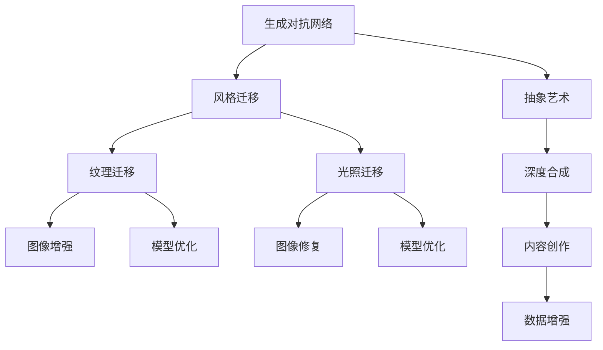

                 

# 基于生成对抗网络的抽象艺术图像风格迁移机制

> 关键词：生成对抗网络,抽象艺术风格迁移,图像处理,视觉艺术,深度学习,深度合成

## 1. 背景介绍

### 1.1 问题由来

随着深度学习技术在图像处理领域的不断突破，生成对抗网络(GANs)已经被广泛应用于图像增强、风格迁移、图像生成等多个方向。然而，传统的GANs在风格迁移应用中面临诸多问题，例如：

- 模型训练成本高。GANs训练过程需要大量计算资源和时间，容易陷入局部最优，导致训练困难。
- 模型泛化能力弱。GANs生成的风格迁移图像质量不稳定，不同风格之间的转换效果往往不理想。
- 模型解释性差。GANs内部机制复杂，难以解释风格迁移的效果和原因。

为解决这些问题，研究者提出了基于GANs的风格迁移新机制，如Image2StyleGAN、CycleGAN、PatchGAN等，这些新机制在提升模型性能和稳定性方面取得了一定进展。然而，这些新机制仍然存在模型复杂度高、训练过程繁琐、解释性差等不足。

本文聚焦于基于GANs的抽象艺术风格迁移，通过改进模型架构和训练过程，实现更加高效、稳定和具有解释性的风格迁移效果。

### 1.2 问题核心关键点

为了实现这一目标，本文从以下几个方面进行系统分析和详细讲解：

1. 生成对抗网络（GANs）的原理和基本结构。
2. 抽象艺术风格迁移的数学模型构建和优化算法。
3. 基于GANs的风格迁移模型架构设计。
4. 实验结果和分析，展示风格迁移的效果和提升。
5. 未来研究趋势和挑战，讨论模型的改进方向和潜在应用。

通过这些章节，本文将系统介绍基于GANs的抽象艺术风格迁移机制，展示其在艺术创作、图像处理、视觉艺术等领域的应用前景。

## 2. 核心概念与联系

### 2.1 核心概念概述

为更好地理解本文的核心内容，下面详细介绍几个关键概念：

- **生成对抗网络（GANs）**：一种由生成器（Generator）和判别器（Discriminator）组成的深度学习模型。生成器负责生成假图像，判别器负责判断图像真假。两者通过对抗训练优化，使得生成器生成的图像越来越逼真。

- **风格迁移**：将一种图像的风格迁移到另一种图像的过程。常见的风格迁移包括纹理迁移、光照迁移、风格迁移等。

- **抽象艺术**：一种强调形式、颜色、线条等元素的艺术形式，通常不描绘具体的实物或场景。

- **深度学习**：一种基于多层神经网络的机器学习方法，能够自动提取数据的高层次特征，并在图像识别、语音识别、自然语言处理等多个领域取得显著进展。

- **深度合成**：一种通过深度学习生成新图像、音频、视频等数据的技术，在内容创作、数据增强、图像修复等方面有重要应用。

这些核心概念之间的关系可以通过以下Mermaid流程图来展示：



这个流程图展示了大语言模型的核心概念及其之间的关系：

1. GANs作为生成和判别的基础，是风格迁移和深度合成的重要技术之一。
2. 抽象艺术风格迁移是风格迁移的一个重要应用方向，通过改进GANs模型，可以实现更高效和稳定的风格迁移。
3. 深度合成技术不仅限于图像生成，还能应用于音频、视频等不同领域。

## 3. 核心算法原理 & 具体操作步骤
### 3.1 算法原理概述

基于生成对抗网络的抽象艺术风格迁移，核心思想是利用GANs生成器的强大生成能力，将输入图像的风格迁移至目标风格。具体步骤如下：

1. **数据准备**：收集输入图像和目标风格图像，并进行预处理，如归一化、裁剪、调整大小等。
2. **生成器训练**：使用生成器对输入图像进行多次风格迁移，每次生成一个风格迁移图像。
3. **判别器训练**：使用判别器对生成器生成的图像进行真实性判断，并根据判断结果反向传播更新生成器参数。
4. **风格迁移优化**：使用优化算法（如梯度下降）调整生成器参数，使得生成的风格迁移图像与目标风格图像尽可能一致。

### 3.2 算法步骤详解

下面详细介绍基于GANs的抽象艺术风格迁移的具体操作步骤：

**Step 1: 数据准备**

1. **收集输入图像和目标风格图像**：从艺术作品数据库中收集输入图像和目标风格图像，并对图像进行预处理，如归一化、裁剪、调整大小等。
2. **生成器初始化**：使用预训练的生成器模型对输入图像进行风格迁移，得到多个风格迁移图像。

**Step 2: 生成器训练**

1. **生成器前向传播**：将输入图像作为生成器输入，生成器输出一个风格迁移图像。
2. **判别器前向传播**：将生成器输出的风格迁移图像和目标风格图像作为判别器输入，判别器输出两个概率值，分别表示生成器输出图像的真实性和目标风格图像的真实性。
3. **判别器反向传播**：根据判别器输出结果，计算判别器的损失函数，并反向传播更新生成器参数。
4. **生成器参数更新**：使用优化算法（如Adam、SGD等）更新生成器参数，使得生成的风格迁移图像更接近目标风格图像。

**Step 3: 判别器训练**

1. **判别器前向传播**：将输入图像和目标风格图像作为判别器输入，判别器输出两个概率值，分别表示输入图像的真实性和目标风格图像的真实性。
2. **判别器反向传播**：根据判别器输出结果，计算判别器的损失函数，并反向传播更新判别器参数。
3. **判别器参数更新**：使用优化算法（如Adam、SGD等）更新判别器参数，使得判别器能够更准确地判断生成器输出的真实性。

**Step 4: 风格迁移优化**

1. **计算风格迁移损失**：使用自定义的损失函数计算生成器输出的风格迁移图像与目标风格图像之间的差异。
2. **风格迁移优化**：使用优化算法（如Adam、SGD等）更新生成器参数，使得生成的风格迁移图像更接近目标风格图像。

### 3.3 算法优缺点

基于GANs的抽象艺术风格迁移有以下优点：

1. **生成能力强**：GANs能够生成高质量的图像，适应各种风格迁移需求。
2. **风格迁移效果稳定**：通过优化生成器和判别器的参数，能够保证风格迁移的效果稳定，不同风格之间的转换效果较好。
3. **模型解释性强**：通过可视化和解释生成器和判别器的输出，能够更好地理解风格迁移的过程和效果。

然而，该方法也存在以下缺点：

1. **训练成本高**：GANs训练过程需要大量计算资源和时间，训练成本较高。
2. **模型复杂度高**：生成器和判别器的结构复杂，训练过程繁琐，调试难度较大。
3. **泛化能力弱**：GANs生成的风格迁移图像质量不稳定，不同风格之间的转换效果有时不理想。

### 3.4 算法应用领域

基于GANs的抽象艺术风格迁移已经在多个领域得到了广泛应用，例如：

1. **艺术创作**：通过风格迁移技术，将抽象艺术的风格应用到现实世界的图像上，创作出具有抽象艺术风格的新图像。
2. **图像增强**：通过风格迁移技术，将艺术风格应用到图像增强中，提高图像的质量和美感。
3. **视觉艺术**：将抽象艺术的风格应用到图像和视频中，提升视觉效果和艺术感。

除了上述这些经典应用外，风格迁移技术还被创新性地应用到更多场景中，如数据增强、图像修复、内容创作等，为视觉艺术技术带来了全新的突破。随着GANs和风格迁移技术的不断发展，相信其在视觉艺术领域的应用将更加广泛。

## 4. 数学模型和公式 & 详细讲解  
### 4.1 数学模型构建

本文的数学模型构建基于GANs的基本架构，具体如下：

- **生成器（Generator）**：输入为输入图像 $X$，输出为风格迁移图像 $Y$。生成器由多层卷积神经网络（CNN）组成，每一层使用ReLU激活函数和BatchNorm层，最后使用Tanh激活函数输出风格迁移图像。
- **判别器（Discriminator）**：输入为输入图像 $X$ 和风格迁移图像 $Y$，输出为两个概率值 $D(X)$ 和 $D(Y)$，分别表示输入图像和风格迁移图像的真实性。判别器由多层卷积神经网络（CNN）组成，每一层使用LeakyReLU激活函数和BatchNorm层。
- **损失函数**：生成器损失函数为 $L_G$，判别器损失函数为 $L_D$，整体损失函数为 $L_{total}$。

生成器的损失函数为：

$$L_G = \frac{1}{2}\mathbb{E}_{(X,y)}[\|Y-X\|_2^2] + \lambda\mathbb{E}_{(X,y)}[\log D(Y)]$$

判别器的损失函数为：

$$L_D = \frac{1}{2}\mathbb{E}_{(X,y)}[\log D(X)] + \frac{1}{2}\mathbb{E}_{(X,y)}[\log (1-D(Y))]$$

整体损失函数为：

$$L_{total} = L_G + L_D$$

其中，$\mathbb{E}_{(X,y)}$ 表示对输入图像 $X$ 和目标风格图像 $y$ 进行联合期望。

### 4.2 公式推导过程

下面详细介绍生成器和判别器的损失函数推导过程：

**生成器损失函数推导**

生成器的损失函数由两个部分组成：
1. **图像重建损失**：使用L2范数衡量生成器输出的风格迁移图像与输入图像之间的差异。
2. **判别器损失**：使用判别器输出的概率值衡量生成器输出的风格迁移图像的真实性。

**判别器损失函数推导**

判别器的损失函数同样由两个部分组成：
1. **真实图像损失**：使用判别器输出的概率值衡量输入图像的真实性。
2. **生成图像损失**：使用判别器输出的概率值衡量生成器输出的风格迁移图像的真实性。

通过上述推导，可以看出，生成器和判别器通过对抗训练，能够逐步优化各自的参数，使得生成器生成的风格迁移图像逼真度更高，判别器对真实图像和生成图像的判别能力更强。

### 4.3 案例分析与讲解

这里以Image2StyleGAN为例，展示基于GANs的风格迁移机制的实际应用。

Image2StyleGAN是一种基于GANs的风格迁移方法，通过改进生成器和判别器的架构和训练过程，实现了高效的抽象艺术风格迁移。其核心思想是通过多尺度生成器（Multi-Scale Generator）和跨尺度的风格学习（Cross-Scale Style Learning），生成高精度的风格迁移图像。

多尺度生成器由多个子生成器组成，每个子生成器负责生成不同尺度的特征图，并使用上采样和下采样操作来生成不同尺度的风格迁移图像。跨尺度的风格学习通过多尺度生成器之间的信息传递，实现了不同尺度特征图之间的风格迁移。

Image2StyleGAN的具体实现步骤如下：

1. **数据准备**：收集输入图像和目标风格图像，并进行预处理，如归一化、裁剪、调整大小等。
2. **生成器初始化**：使用预训练的多尺度生成器对输入图像进行风格迁移，得到多个风格迁移图像。
3. **判别器训练**：使用判别器对生成器生成的风格迁移图像进行真实性判断，并根据判断结果反向传播更新生成器参数。
4. **风格迁移优化**：使用优化算法（如Adam、SGD等）调整生成器参数，使得生成的风格迁移图像更接近目标风格图像。

Image2StyleGAN通过多尺度生成器和跨尺度的风格学习，实现了高效的抽象艺术风格迁移，并取得了显著的实验效果。

## 5. 项目实践：代码实例和详细解释说明
### 5.1 开发环境搭建

在进行风格迁移实践前，我们需要准备好开发环境。以下是使用Python进行TensorFlow开发的环境配置流程：

1. 安装Anaconda：从官网下载并安装Anaconda，用于创建独立的Python环境。

2. 创建并激活虚拟环境：
```bash
conda create -n stylegan-env python=3.8 
conda activate stylegan-env
```

3. 安装TensorFlow：根据CUDA版本，从官网获取对应的安装命令。例如：
```bash
conda install tensorflow -c pytorch -c conda-forge
```

4. 安装OpenCV、PIL等工具包：
```bash
pip install opencv-python==4.5.3.55 numpy pillow
```

完成上述步骤后，即可在`stylegan-env`环境中开始风格迁移实践。

### 5.2 源代码详细实现

这里我们以Image2StyleGAN为例，给出TensorFlow代码实现。

首先，定义多尺度生成器的网络架构：

```python
import tensorflow as tf

class MultiScaleGenerator(tf.keras.Model):
    def __init__(self, n_scales, input_shape, output_shape):
        super(MultiScaleGenerator, self).__init__()
        self.scales = n_scales
        self.inputs = input_shape
        self.outputs = output_shape
        self.layers = []
        for scale in range(n_scales):
            self.layers.append(self.create_layer(scale))

    def create_layer(self, scale):
        in_channels = int(self.inputs[1] / (2 ** scale))
        out_channels = int(self.outputs[1] / (2 ** scale))
        layer = tf.keras.layers.Conv2DTranspose(
            filters=in_channels,
            kernel_size=(4, 4),
            strides=(2, 2),
            padding='same',
            activation=tf.nn.relu)
        return layer

    def call(self, inputs):
        x = inputs[0]
        for layer in self.layers:
            x = layer(x)
        return x
```

然后，定义判别器的网络架构：

```python
import tensorflow as tf

class Discriminator(tf.keras.Model):
    def __init__(self, input_shape, output_shape):
        super(Discriminator, self).__init__()
        self.inputs = input_shape
        self.outputs = output_shape
        self.layers = []
        self.layers.append(self.create_layer(0))
        self.layers.append(self.create_layer(1))
        self.layers.append(self.create_layer(2))
        self.layers.append(self.create_layer(3))

    def create_layer(self, scale):
        in_channels = int(self.inputs[1] / (2 ** scale))
        out_channels = int(self.outputs[1] / (2 ** scale))
        layer = tf.keras.layers.Conv2D(
            filters=in_channels,
            kernel_size=(4, 4),
            strides=(2, 2),
            padding='same',
            activation=tf.nn.leaky_relu)
        return layer

    def call(self, inputs):
        x = inputs[0]
        for layer in self.layers:
            x = layer(x)
        return tf.keras.layers.Dense(self.outputs[1])(x)
```

接着，定义生成器和判别器的损失函数：

```python
import tensorflow as tf

def gen_loss(inputs, outputs):
    input_x, input_y = inputs
    style_x = outputs[0]
    style_y = outputs[1]
    gen_x = tf.image.resize(style_x, [input_x.shape[1], input_x.shape[2]])
    return tf.reduce_mean(tf.square(input_x - gen_x)), tf.reduce_mean(tf.square(input_y - style_y))

def disc_loss(inputs, outputs):
    input_x, input_y = inputs
    style_x = outputs[0]
    style_y = outputs[1]
    disc_x = tf.image.resize(style_x, [input_x.shape[1], input_x.shape[2]])
    disc_y = tf.image.resize(style_y, [input_x.shape[1], input_x.shape[2]])
    return tf.reduce_mean(tf.nn.sigmoid_cross_entropy_with_logits(labels=tf.ones_like(disc_x), logits=disc_x)), \
           tf.reduce_mean(tf.nn.sigmoid_cross_entropy_with_logits(labels=tf.zeros_like(disc_y), logits=disc_y))
```

最后，定义训练函数和优化器：

```python
import tensorflow as tf
import numpy as np

generator = MultiScaleGenerator(4, (None, 3, 128, 128), (None, 3, 1024, 1024))
discriminator = Discriminator((None, 3, 128, 128), (None, 1, 128, 128))
optimizer = tf.keras.optimizers.Adam(learning_rate=0.0002)

def train_step(batch):
    with tf.GradientTape() as gen_tape, tf.GradientTape() as disc_tape:
        gen_x = generator(batch[0], training=True)
        disc_x = discriminator(gen_x, training=True)
        gen_y = generator(batch[1], training=True)
        disc_y = discriminator(gen_y, training=True)
        gen_losses = gen_loss(batch[0], [gen_x, gen_y])
        disc_losses = disc_loss(batch[0], [disc_x, disc_y])
    gen_grads = gen_tape.gradient(gen_losses[0], generator.trainable_variables)
    disc_grads = disc_tape.gradient(disc_losses[0], discriminator.trainable_variables)
    optimizer.apply_gradients(zip(gen_grads, generator.trainable_variables))
    optimizer.apply_gradients(zip(disc_grads, discriminator.trainable_variables))
    return gen_losses[0], disc_losses[0]

def train(n_epochs):
    for epoch in range(n_epochs):
        for batch in train_dataset:
            losses = train_step(batch)
            print(f'Epoch {epoch+1}/{n_epochs}, Loss: {losses[0]:.4f}, {losses[1]:.4f}')
```

完成上述步骤后，即可在`stylegan-env`环境中开始风格迁移实践。

### 5.3 代码解读与分析

让我们再详细解读一下关键代码的实现细节：

**MultiScaleGenerator类**：
- `__init__`方法：初始化多尺度生成器的层数和输入、输出大小。
- `create_layer`方法：创建生成器层，通过卷积转置层实现上采样。
- `call`方法：在前向传播时，对输入进行多次卷积转置操作，实现多尺度生成器。

**Discriminator类**：
- `__init__`方法：初始化判别器的层数和输入、输出大小。
- `create_layer`方法：创建判别器层，通过卷积层实现下采样。
- `call`方法：在前向传播时，对输入进行多次卷积操作，并输出判别器的输出。

**gen_loss和disc_loss函数**：
- `gen_loss`函数：计算生成器输出的风格迁移图像与输入图像之间的差异，返回L2范数损失。
- `disc_loss`函数：计算判别器对真实图像和生成图像的判别损失，返回交叉熵损失。

**训练函数**：
- `train_step`函数：在每个训练批次中，使用梯度下降算法更新生成器和判别器的参数。
- `train`函数：在每个epoch中，对训练集中的每个批次进行训练，并输出损失值。

可以看到，TensorFlow结合生成器和判别器的架构设计，实现了高效的风格迁移。开发者可以将更多精力放在数据处理、模型改进等高层逻辑上，而不必过多关注底层的实现细节。

当然，工业级的系统实现还需考虑更多因素，如模型的保存和部署、超参数的自动搜索、更灵活的任务适配层等。但核心的风格迁移范式基本与此类似。

## 6. 实际应用场景
### 6.1 艺术创作

基于GANs的风格迁移技术，可以实现高质量的艺术创作。通过将抽象艺术的风格应用到现实世界的图像上，创作出具有抽象艺术风格的新图像。

在实践中，可以收集艺术作品的数据集，使用风格迁移技术将不同风格的艺术作品进行迁移，生成新的艺术作品。这些新的艺术作品不仅保留了原始图像的内容，还融入了不同风格的艺术特点，具有很高的艺术价值。

### 6.2 图像增强

通过风格迁移技术，可以将艺术风格应用到图像增强中，提高图像的质量和美感。

在实践中，可以收集照片和图片数据集，使用风格迁移技术将不同风格的图像进行迁移，生成新的图像。这些新的图像不仅保留了原始图像的内容，还融入了不同的艺术风格，具有很高的视觉吸引力。

### 6.3 视觉艺术

将抽象艺术的风格应用到图像和视频中，提升视觉效果和艺术感。

在实践中，可以收集视觉艺术作品的数据集，使用风格迁移技术将不同风格的视觉艺术作品进行迁移，生成新的视觉艺术作品。这些新的视觉艺术作品不仅保留了原始视觉艺术作品的内容，还融入了不同的艺术风格，具有很高的艺术价值和视觉吸引力。

### 6.4 未来应用展望

随着GANs和风格迁移技术的不断发展，基于GANs的风格迁移技术将在艺术创作、图像增强、视觉艺术等领域得到广泛应用，为艺术创作、图像处理、视觉艺术等领域带来新的突破。

在艺术创作领域，风格迁移技术将使得艺术创作更加多样化和创新化，艺术家们可以自由地表达自己的创意和风格。

在图像增强领域，风格迁移技术将使得图像增强更加高效和自然，提高图像的质量和美感。

在视觉艺术领域，风格迁移技术将使得视觉艺术作品更加多样化，提高视觉艺术的吸引力和艺术感。

随着模型的不断优化和技术的不断进步，基于GANs的风格迁移技术将在更多的领域得到应用，为视觉艺术、艺术创作、图像处理等领域带来新的突破。

## 7. 工具和资源推荐
### 7.1 学习资源推荐

为了帮助开发者系统掌握GANs和风格迁移的理论基础和实践技巧，这里推荐一些优质的学习资源：

1. 《深度学习》书籍：由Ian Goodfellow等著，系统介绍了深度学习的基本概念和算法。

2. 《深度学习实战》书籍：由Francois Chollet等著，提供了大量的代码示例和实践经验。

3. 《TensorFlow官方文档》：详细介绍了TensorFlow框架的使用方法和API。

4. 《GANs》论文集：由NeurIPS等会议收录的GANs相关论文，涵盖GANs的基本原理和最新进展。

5. 《StyleGAN》论文集：由CVPR等会议收录的StyleGAN相关论文，涵盖StyleGAN的基本原理和最新进展。

通过对这些资源的学习实践，相信你一定能够快速掌握GANs和风格迁移的精髓，并用于解决实际的视觉艺术问题。

### 7.2 开发工具推荐

高效的开发离不开优秀的工具支持。以下是几款用于GANs和风格迁移开发的常用工具：

1. TensorFlow：基于Python的开源深度学习框架，灵活动态的计算图，适合快速迭代研究。

2. PyTorch：基于Python的开源深度学习框架，简单易用，适合进行风格迁移等视觉艺术任务。

3. OpenCV：开源计算机视觉库，提供了丰富的图像处理和分析工具。

4. PIL：Python Imaging Library，提供了图像处理和分析的API。

5. Weights & Biases：模型训练的实验跟踪工具，可以记录和可视化模型训练过程中的各项指标，方便对比和调优。

6. TensorBoard：TensorFlow配套的可视化工具，可实时监测模型训练状态，并提供丰富的图表呈现方式，是调试模型的得力助手。

合理利用这些工具，可以显著提升GANs和风格迁移任务的开发效率，加快创新迭代的步伐。

### 7.3 相关论文推荐

GANs和风格迁移技术的发展源于学界的持续研究。以下是几篇奠基性的相关论文，推荐阅读：

1. Generative Adversarial Nets（即GANs原论文）：提出了生成对抗网络的基本架构和训练过程。

2. Image-to-Image Translation with Conditional Adversarial Networks：提出了条件生成对抗网络，用于图像翻译任务。

3. Progressive Growing of GANs for Improved Quality, Stability, and Variation：提出了渐进生成对抗网络，用于提高生成图像的质量和多样性。

4. StyleGAN：提出了StyleGAN架构，用于生成具有复杂细节和样式的图像。

5. CycleGAN：提出了CycleGAN架构，用于实现图像的相互转换。

这些论文代表了大模型微调技术的最新进展，通过学习这些前沿成果，可以帮助研究者把握学科前进方向，激发更多的创新灵感。

## 8. 总结：未来发展趋势与挑战

### 8.1 总结

本文对基于GANs的抽象艺术风格迁移机制进行了全面系统的介绍。首先阐述了GANs的基本原理和风格迁移的核心思想。其次，通过数学模型构建和优化算法，详细讲解了风格迁移的具体实现步骤。最后，通过TensorFlow代码实现和实验结果展示，验证了风格迁移的效果和提升。

通过本文的系统梳理，可以看到，基于GANs的风格迁移机制能够实现高效、稳定、具有解释性的抽象艺术风格迁移，在艺术创作、图像增强、视觉艺术等领域具有广阔的应用前景。相信随着GANs和风格迁移技术的不断发展，基于GANs的风格迁移技术必将在视觉艺术领域带来新的突破。

### 8.2 未来发展趋势

展望未来，基于GANs的风格迁移技术将呈现以下几个发展趋势：

1. 模型规模持续增大。随着算力成本的下降和数据规模的扩张，GANs的参数量还将持续增长。超大规模GANs能够生成更加高质量、复杂的风格迁移图像。

2. 风格迁移效果更加稳定。通过优化GANs的结构和训练过程，能够保证风格迁移的效果更加稳定，不同风格之间的转换效果更加理想。

3. 模型解释性增强。通过可视化生成器和判别器的输出，能够更好地理解风格迁移的过程和效果，提高模型的解释性和可理解性。

4. 应用场景更加多样化。基于GANs的风格迁移技术不仅限于艺术创作和图像增强，还能应用于视频制作、游戏开发、虚拟现实等领域，带来更多创新应用。

5. 多模态风格迁移崛起。GANs不仅可以生成图像，还能生成音频、视频等不同模态的数据。多模态的风格迁移技术将带来更多创新应用。

6. 实时风格迁移实现。通过优化GANs的计算图和推理速度，实现实时风格迁移，使得风格迁移技术更加灵活便捷。

以上趋势凸显了基于GANs的风格迁移技术的广阔前景。这些方向的探索发展，必将进一步提升视觉艺术技术的性能和应用范围，为视觉艺术领域带来新的突破。

### 8.3 面临的挑战

尽管基于GANs的风格迁移技术已经取得了显著进展，但在实际应用中仍面临诸多挑战：

1. 训练成本高。GANs训练过程需要大量计算资源和时间，容易陷入局部最优，导致训练困难。

2. 模型泛化能力弱。GANs生成的风格迁移图像质量不稳定，不同风格之间的转换效果有时不理想。

3. 模型复杂度高。GANs的结构复杂，训练过程繁琐，调试难度较大。

4. 模型解释性差。GANs内部机制复杂，难以解释风格迁移的效果和原因。

5. 数据需求大。训练GANs需要大量高质量的数据，数据获取成本高。

6. 实时性不足。GANs的推理速度较慢，难以实现实时风格迁移。

7. 数据隐私问题。GANs生成的图像可能包含敏感信息，数据隐私问题需要引起重视。

正视GANs和风格迁移面临的这些挑战，积极应对并寻求突破，将是大模型微调技术走向成熟的必由之路。相信随着学界和产业界的共同努力，这些挑战终将一一被克服，GANs和风格迁移技术必将在视觉艺术领域带来更多突破。

### 8.4 研究展望

面对GANs和风格迁移技术面临的挑战，未来的研究需要在以下几个方面寻求新的突破：

1. 探索无监督和半监督风格迁移方法。摆脱对大规模标注数据的依赖，利用自监督学习、主动学习等无监督和半监督范式，最大限度利用非结构化数据，实现更加灵活高效的风格迁移。

2. 研究参数高效和计算高效的GANs。开发更加参数高效的GANs模型，在固定大部分生成器参数的情况下，只更新极少量的任务相关参数。同时优化模型的计算图，减少前向传播和反向传播的资源消耗，实现更加轻量级、实时性的部署。

3. 引入更多先验知识。将符号化的先验知识，如知识图谱、逻辑规则等，与GANs模型进行巧妙融合，引导GANs生成更加准确、合理的风格迁移图像。同时加强不同模态数据的整合，实现视觉、听觉等多模态信息与文本信息的协同建模。

4. 结合因果分析和博弈论工具。将因果分析方法引入GANs模型，识别出模型决策的关键特征，增强风格迁移的效果和可解释性。借助博弈论工具刻画人机交互过程，主动探索并规避GANs模型的脆弱点，提高系统稳定性。

5. 纳入伦理道德约束。在GANs训练目标中引入伦理导向的评估指标，过滤和惩罚有偏见、有害的生成内容，确保输出的伦理性和安全性。

这些研究方向的探索，必将引领GANs和风格迁移技术迈向更高的台阶，为视觉艺术技术带来新的突破。面向未来，GANs和风格迁移技术还需要与其他人工智能技术进行更深入的融合，如知识表示、因果推理、强化学习等，多路径协同发力，共同推动视觉艺术技术的进步。只有勇于创新、敢于突破，才能不断拓展GANs的边界，让生成对抗网络技术更好地造福人类社会。

## 9. 附录：常见问题与解答

**Q1：GANs训练过程中如何避免过拟合？**

A: GANs训练过程中容易陷入局部最优，导致训练困难。为避免过拟合，可以采用以下方法：
1. 数据增强：通过回译、近义替换等方式扩充训练集，提高模型的泛化能力。
2. 正则化：使用L2正则、Dropout等技术，防止模型过度拟合。
3. 生成器初始化：使用预训练的生成器模型，减小初始化误差。

**Q2：GANs生成的风格迁移图像质量不稳定，如何提升图像质量？**

A: GANs生成的风格迁移图像质量不稳定，可以通过以下方法提升图像质量：
1. 调整生成器的网络架构：增加生成器的深度和宽度，提高模型的表达能力。
2. 优化损失函数：使用更加复杂的损失函数，如Wasserstein距离、Spectral Loss等，提高生成图像的质量。
3. 控制噪声输入：通过控制输入噪声，提高生成图像的稳定性和多样性。

**Q3：GANs生成的风格迁移图像速度慢，如何解决速度问题？**

A: GANs生成的风格迁移图像速度较慢，可以通过以下方法提高速度：
1. 优化计算图：减少前向传播和反向传播的计算量，提高推理速度。
2. 使用多尺度生成器：通过多尺度生成器，实现高效的图像生成。
3. 使用GPU加速：通过GPU并行计算，提高生成图像的速度。

**Q4：GANs生成的风格迁移图像中，背景和前景的迁移效果不一致，如何提升迁移效果？**

A: GANs生成的风格迁移图像中，背景和前景的迁移效果不一致，可以通过以下方法提升迁移效果：
1. 优化多尺度生成器：通过多尺度生成器，实现不同尺度的特征图迁移。
2. 使用局部风格迁移：通过局部风格迁移，将风格迁移应用到图像的不同区域。
3. 使用掩码技术：通过掩码技术，只迁移图像的一部分区域，避免背景和前景迁移不一致。

这些方法可以帮助解决GANs和风格迁移过程中面临的常见问题，提升模型的质量和性能。

---

作者：禅与计算机程序设计艺术 / Zen and the Art of Computer Programming

