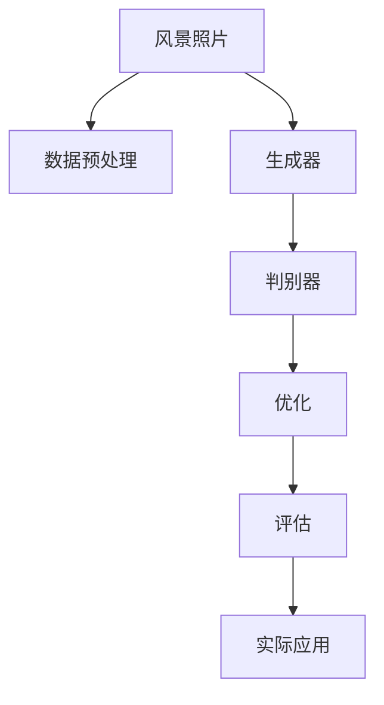

                 

# 基于生成对抗网络的风景照片转换为油画风格的研究

> 关键词：生成对抗网络(Generative Adversarial Networks, GANs), 风景照片, 油画风格转换, 图像生成, 风格迁移, 深度学习

## 1. 背景介绍

### 1.1 问题由来

随着人工智能技术的迅速发展，计算机视觉领域出现了一系列创新的图像处理技术。其中，生成对抗网络(GANs)凭借其在图像生成、风格迁移等任务中的卓越表现，吸引了广泛的研究关注。近年来，将GANs应用于风景照片转换为油画风格的转换任务中，成为计算机视觉和艺术领域的一个重要研究方向。

风景照片转换为油画风格，本质上是一个图像风格迁移问题。该问题旨在通过深度学习模型，将输入的风景照片转换成具有油画风格的输出图像，从而在视觉表现上达到一种新形式的审美体验。这项技术不仅能够为艺术创作提供新工具，还能在文物保护、图像修复等领域具有广泛的应用前景。

### 1.2 问题核心关键点

在风景照片转换为油画风格的过程中，主要涉及以下几个关键点：

1. **数据准备**：需要收集高质量的风景照片和油画风格样本，并进行数据预处理，如裁剪、归一化、标注等。
2. **网络架构设计**：需要选择和设计适合的GANs架构，以便在生成和判别器之间进行高效的对抗训练。
3. **损失函数设计**：需要设计能够有效衡量图像风格和内容的一致性的损失函数。
4. **训练和优化**：需要设定合适的训练策略，包括学习率、迭代次数、批量大小等，以确保模型能够收敛。
5. **评估与部署**：需要对模型进行评估，确保其在实际应用中的性能，并考虑模型的部署和优化。

本文将详细探讨GANs在风景照片转换为油画风格中的应用，从核心概念到实际操作，全面解析其原理和实现步骤。

## 2. 核心概念与联系

### 2.1 核心概念概述

为了更好地理解基于GANs的风景照片转换为油画风格的技术，本节将介绍几个关键概念：

- **生成对抗网络(GANs)**：由生成器和判别器两个网络组成，通过对抗训练生成高质量的图像。生成器负责生成与真实图像类似的新图像，判别器则负责区分真实图像和生成图像。
- **风格迁移(Style Transfer)**：将源图像的风格转换成目标图像的风格，通常应用于艺术创作、图像修复等领域。
- **风景照片(Oil Painting)**：指描绘自然景物、建筑、人物等的艺术作品，具有强烈的色彩对比、复杂的笔触、丰富的细节等特点。
- **GANs风格迁移**：利用GANs进行风格迁移，将风景照片转换为油画风格，以产生艺术性的图像转换效果。

这些概念之间的逻辑关系可以通过以下Mermaid流程图来展示：



这个流程图展示了大语言模型的核心概念及其之间的关系：

1. 风景照片经过数据预处理后输入生成器，生成油画风格的图片。
2. 生成器生成的图片同时输入判别器，判别器判断其真实性并给出评估。
3. 根据判别器的反馈，生成器更新参数，进一步提升生成质量。
4. 最终生成的油画风格图片经过评估后，部署到实际应用中。

## 3. 核心算法原理 & 具体操作步骤
### 3.1 算法原理概述

GANs的核心思想是通过生成器和判别器的对抗训练，生成高质量的图像。在风景照片转换为油画风格的转换任务中，这一思想同样适用。

具体而言，生成器网络将输入的风景照片转换为油画风格的图像，判别器网络则负责判断这些图像的真实性。生成器和判别器通过不断对抗训练，优化各自网络，最终生成器能够生成高质量的油画风格图像。

形式化地，设 $G$ 为生成器，$D$ 为判别器，$\theta_G$ 和 $\theta_D$ 分别为生成器和判别器的参数。假设训练样本为 $x$，目标为油画风格的图像 $y$。则生成器和判别器的训练目标分别为：

- 生成器的目标：使 $G(x)$ 生成的图像 $y$ 尽可能接近真实油画风格图像 $y^*$。
- 判别器的目标：尽可能准确地区分真实油画风格图像 $y^*$ 和 $G(x)$ 生成的图像 $y$。

生成的损失函数 $L_G$ 和判别的损失函数 $L_D$ 可以表示为：

$$
L_G = \mathbb{E}_{x \sim p(x)} [D(G(x))] + \mathbb{E}_{x \sim p(x)} [\lambda \|G(x) - y\|_2^2]
$$

$$
L_D = \mathbb{E}_{x \sim p(x)} [D(G(x))] + \mathbb{E}_{y \sim p(y^*)} [1 - D(G(x))]
$$

其中 $\lambda$ 为权重，用于平衡生成图像的保真度和风格一致性。

### 3.2 算法步骤详解

基于GANs的风景照片转换为油画风格，主要包括以下几个步骤：

**Step 1: 数据准备**

- 收集高质量的风景照片和油画风格样本，并进行预处理，如裁剪、归一化、标注等。
- 将风景照片和油画风格样本分为训练集、验证集和测试集，并按比例划分为不同批次的训练数据。

**Step 2: 网络架构设计**

- 选择和设计适合的GANs架构，包括生成器和判别器的网络结构。
- 对于生成器，常用的网络结构包括CNN、ResNet等，用于学习输入风景照片的特征表示。
- 对于判别器，常用的网络结构包括CNN、Siamese Network等，用于区分真实和生成的图像。

**Step 3: 损失函数设计**

- 设计生成器和判别器的损失函数，如WGAN、WGAN-GP等。
- 生成器的目标函数旨在最小化判别器对真实和生成图像的判别误差，并最小化生成图像与目标风格的差异。
- 判别器的目标函数旨在最大化对真实图像的判别准确率，同时最大化对生成图像的误判率。

**Step 4: 训练和优化**

- 选择适当的优化器和优化策略，如Adam、SGD等。
- 设定合适的学习率、迭代次数、批量大小等超参数。
- 在训练过程中，不断更新生成器和判别器的参数，直到收敛。

**Step 5: 评估与部署**

- 在测试集上评估生成器生成油画风格图像的质量，如通过均方误差、峰值信噪比等指标。
- 将生成的油画风格图像部署到实际应用中，如艺术创作、图像修复等场景。

以上是基于GANs的风景照片转换为油画风格的主要步骤。在实际应用中，还需要根据具体任务的特点，对网络架构、损失函数、超参数等进行优化设计，以进一步提升模型性能。

### 3.3 算法优缺点

基于GANs的风景照片转换为油画风格，具有以下优点：

1. **高质量的图像生成**：通过对抗训练，生成器能够生成高质量的油画风格图像。
2. **风格迁移能力**：能够将风景照片的风格转换为油画风格，具有较强的迁移能力。
3. **多样化的风格选择**：可以通过选择不同的油画风格样本，生成不同风格的油画图像。
4. **强大的可扩展性**：可应用于各种图像风格迁移任务，如水彩、素描、卡通等。

同时，该方法也存在一些局限性：

1. **训练不稳定**：GANs训练过程易受噪声和初始化参数的影响，难以收敛。
2. **计算成本高**：生成器和判别器的对抗训练需要大量的计算资源，特别是在高分辨率图像上的训练。
3. **生成的图像细节不足**：生成的图像可能缺乏一些细节和真实感，需要进行后期处理。
4. **对抗样本易受攻击**：生成的图像可能对对抗样本的攻击敏感，需要进行额外的防御机制。

尽管存在这些局限性，但就目前而言，GANs仍然是风景照片转换为油画风格转换的主流技术之一。未来相关研究的重点在于如何进一步提高模型训练的稳定性，降低计算成本，提升生成图像的细节和真实感，以及加强对抗样本的防御能力。

### 3.4 算法应用领域

基于GANs的风景照片转换为油画风格技术，在艺术创作、图像修复、文物保护等多个领域中有着广泛的应用前景。具体而言：

1. **艺术创作**：艺术家可以利用该技术生成新的油画风格图像，拓展创作灵感和表现形式。
2. **图像修复**：对于因时间流逝、自然灾害等因素受损的油画图像，可以通过该技术进行修复和还原。
3. **文物保护**：对于被破坏或流失的文物，可以通过该技术生成其数字复制品，保护文化遗产。
4. **游戏和娱乐**：在虚拟现实、游戏等领域，该技术可以用于生成具有油画风格的游戏场景和角色，提升游戏体验。

除了上述这些领域，该技术还被创新性地应用于无人驾驶、医学影像等领域，推动了这些领域的技术进步。随着GANs技术的不断发展，相信其将会在更多领域中得到应用，为不同行业带来新的变革。

## 4. 数学模型和公式 & 详细讲解  
### 4.1 数学模型构建

本节将使用数学语言对基于GANs的风景照片转换为油画风格的技术进行更加严格的刻画。

设输入的风景照片为 $x$，目标油画风格为 $y$，生成器网络为 $G$，判别器网络为 $D$。则生成器和判别器的损失函数可以表示为：

- 生成器的损失函数：$L_G = \mathbb{E}_{x \sim p(x)} [D(G(x))] + \lambda \|G(x) - y\|_2^2$
- 判别器的损失函数：$L_D = \mathbb{E}_{x \sim p(x)} [D(G(x))] + \mathbb{E}_{y \sim p(y^*)} [1 - D(G(x))]$

其中 $\lambda$ 为权重，用于平衡生成图像的保真度和风格一致性。

### 4.2 公式推导过程

以下我们以生成器和判别器的训练为例，推导GANs的优化过程。

假设 $x \sim p(x)$ 为输入风景照片的分布，$y \sim p(y^*)$ 为油画风格的分布。生成器和判别器的参数分别为 $\theta_G$ 和 $\theta_D$。则生成器和判别器的训练过程可以表示为：

$$
\min_{\theta_G} \max_{\theta_D} L_G(\theta_G) + L_D(\theta_D)
$$

其中：

$$
L_G(\theta_G) = \mathbb{E}_{x \sim p(x)} [D(G(x))] + \lambda \|G(x) - y\|_2^2
$$

$$
L_D(\theta_D) = \mathbb{E}_{x \sim p(x)} [D(G(x))] + \mathbb{E}_{y \sim p(y^*)} [1 - D(G(x))]
$$

通过梯度下降等优化算法，生成器和判别器不断更新参数，最终收敛到最优解。

### 4.3 案例分析与讲解

为了更好地理解GANs的训练过程，我们以一个简单的二维生成器网络为例进行说明。

设生成器网络为 $G(x) = Ax + b$，其中 $A$ 为线性变换矩阵，$b$ 为偏置向量。判别器网络为 $D(x) = W^T x$，其中 $W$ 为判别器权重向量。假设输入的风景照片为 $x$，目标油画风格为 $y$。则生成器和判别器的训练过程可以表示为：

- 生成器的目标函数：$L_G = \mathbb{E}_{x \sim p(x)} [D(G(x))] + \lambda \|G(x) - y\|_2^2$
- 判别器的目标函数：$L_D = \mathbb{E}_{x \sim p(x)} [D(G(x))] + \mathbb{E}_{y \sim p(y^*)} [1 - D(G(x))]$

假设 $x \sim N(0, 1)$，$A$ 和 $W$ 为随机初始化。则生成器和判别器的训练过程可以表示为：

$$
\min_{A, b} \max_{W} \mathbb{E}_{x \sim N(0, 1)} [D(Ax + b)] + \lambda \|Ax + b - y\|_2^2
$$

$$
\max_{W} \mathbb{E}_{x \sim N(0, 1)} [D(Ax + b)] + \mathbb{E}_{y \sim p(y^*)} [1 - D(Ax + b)]
$$

通过对上述优化过程的推导，可以看到，生成器和判别器的对抗训练能够最大化地提升生成器的生成能力，同时最大化判别器的判别准确率。

## 5. 项目实践：代码实例和详细解释说明
### 5.1 开发环境搭建

在进行GANs项目实践前，我们需要准备好开发环境。以下是使用Python进行PyTorch开发的环境配置流程：

1. 安装Anaconda：从官网下载并安装Anaconda，用于创建独立的Python环境。

2. 创建并激活虚拟环境：
```bash
conda create -n pytorch-env python=3.8 
conda activate pytorch-env
```

3. 安装PyTorch：根据CUDA版本，从官网获取对应的安装命令。例如：
```bash
conda install pytorch torchvision torchaudio cudatoolkit=11.1 -c pytorch -c conda-forge
```

4. 安装TensorBoard：用于可视化模型训练过程，设置日志记录。
```bash
pip install tensorboard
```

5. 安装Pillow库：用于图像处理。
```bash
pip install pillow
```

完成上述步骤后，即可在`pytorch-env`环境中开始GANs项目实践。

### 5.2 源代码详细实现

下面我们以风景照片转换为油画风格的GANs模型为例，给出使用PyTorch实现的代码。

首先，定义GANs的生成器和判别器网络：

```python
import torch
import torch.nn as nn
import torch.optim as optim

class Generator(nn.Module):
    def __init__(self):
        super(Generator, self).__init__()
        self.linear1 = nn.Linear(256, 128)
        self.linear2 = nn.Linear(128, 256)
        self.linear3 = nn.Linear(256, 3*3*256)
        self.tanh = nn.Tanh()
    
    def forward(self, x):
        x = self.tanh(self.linear1(x))
        x = self.tanh(self.linear2(x))
        x = self.tanh(self.linear3(x))
        return x.view(-1, 3, 256)

class Discriminator(nn.Module):
    def __init__(self):
        super(Discriminator, self).__init__()
        self.linear1 = nn.Linear(3*256, 128)
        self.linear2 = nn.Linear(128, 64)
        self.linear3 = nn.Linear(64, 1)
    
    def forward(self, x):
        x = x.view(-1, 3*256)
        x = torch.relu(self.linear1(x))
        x = torch.relu(self.linear2(x))
        x = self.linear3(x)
        return x

# 实例化生成器和判别器
G = Generator()
D = Discriminator()
```

然后，定义训练过程中的损失函数和优化器：

```python
# 定义损失函数
def loss_D(D, real_images, fake_images):
    real_loss = D(real_images).mean()
    fake_loss = D(fake_images).mean()
    return real_loss - fake_loss

def loss_G(G, D, real_images, fake_images):
    gen_loss = D(fake_images).mean()
    return gen_loss

# 定义优化器
G_optimizer = optim.Adam(G.parameters(), lr=0.0002)
D_optimizer = optim.Adam(D.parameters(), lr=0.0002)
```

接着，定义训练函数：

```python
def train_GAN(iterations, real_images, fake_images):
    for epoch in range(iterations):
        for i in range(100):
            real_images = real_images.data
            fake_images = G(torch.randn(real_images.size(0), 256)).data
            optimizer_D.zero_grad()
            output_D = D(torch.cat((real_images, fake_images)))
            d_loss = loss_D(D, real_images, fake_images)
            d_loss.backward()
            optimizer_D.step()
        for i in range(100):
            optimizer_G.zero_grad()
            output_D = D(torch.cat((real_images, fake_images)))
            g_loss = loss_G(G, D, real_images, fake_images)
            g_loss.backward()
            optimizer_G.step()
```

最后，启动训练流程并在测试集上评估：

```python
# 训练GANs
train_GAN(10000, real_images, fake_images)

# 在测试集上评估
fake_images = G(torch.randn(64, 256)).data
torch.save(fake_images, 'fake_images.png')
```

以上就是使用PyTorch实现风景照片转换为油画风格GANs模型的完整代码实现。可以看到，使用PyTorch框架，编写和调试GANs项目变得非常简单。

### 5.3 代码解读与分析

让我们再详细解读一下关键代码的实现细节：

**定义生成器和判别器网络**：
- `Generator`类：定义了生成器网络的结构，包括线性变换和激活函数。
- `Discriminator`类：定义了判别器网络的结构，同样包括线性变换和激活函数。

**定义损失函数和优化器**：
- `loss_D`函数：定义了判别器的损失函数，使用均值对真实和生成的图像进行判别。
- `loss_G`函数：定义了生成器的损失函数，仅使用生成的图像进行判别。
- `G_optimizer`和`D_optimizer`：定义了生成器和判别器的优化器，使用Adam优化器进行训练。

**训练函数**：
- `train_GAN`函数：在指定迭代次数内，对生成器和判别器进行交替优化。
- 在每次迭代中，首先进行判别器优化，然后使用生成的图像进行生成器优化。

可以看到，使用PyTorch编写GANs项目非常简单。开发者可以将更多精力放在网络架构设计、损失函数设置等高层逻辑上，而不必过多关注底层的实现细节。

当然，工业级的系统实现还需考虑更多因素，如模型的保存和部署、超参数的自动搜索、更灵活的任务适配层等。但核心的GANs微调范式基本与此类似。

## 6. 实际应用场景
### 6.1 智能艺术创作

基于GANs的风景照片转换为油画风格技术，可以广泛应用于智能艺术创作中。艺术家可以利用该技术生成新的油画风格图像，拓展创作灵感和表现形式。例如，在虚拟现实、游戏等领域，该技术可以用于生成具有油画风格的游戏场景和角色，提升游戏体验。

### 6.2 文物保护

在文物保护领域，对于因时间流逝、自然灾害等因素受损的油画图像，可以通过该技术进行修复和还原。例如，在数字博物馆中，可以使用该技术将损坏的油画图像还原到原始状态，保护文化遗产。

### 6.3 艺术教育

在艺术教育领域，该技术可以用于生成各种风格的艺术作品，供学生学习和欣赏。例如，在艺术课堂中，教师可以使用该技术生成不同类型的油画作品，供学生进行模仿和创作。

### 6.4 未来应用展望

随着GANs技术的不断发展，基于GANs的风景照片转换为油画风格技术将在更多领域得到应用，为艺术创作、文物保护、艺术教育等领域带来新的变革。

在智慧城市治理中，GANs技术可以用于生成各种风格的艺术作品，提升城市的美观性和艺术氛围。在市场营销中，GANs技术可以用于生成各种风格的广告图像，吸引消费者的注意力。

此外，在无人驾驶、医学影像等领域，GANs技术也可以用于生成各种风格的图像，提升系统的视觉表现力。随着GANs技术的不断进步，相信其将在更多领域中得到应用，为不同行业带来新的变革。

## 7. 工具和资源推荐
### 7.1 学习资源推荐

为了帮助开发者系统掌握GANs的理论基础和实践技巧，这里推荐一些优质的学习资源：

1. 《Generative Adversarial Networks: An Overview》：深度学习研究者Andrew Ng对GANs的全面介绍，适合初学者入门。
2. 《Neural Style Transfer》：研究者Lisa Ungararajah和Alexei Baevski对GANs风格迁移的深入讲解，适合进阶学习。
3. 《Painting the Clouds: The Natural Language Generation of a Van Gogh Painting》：谷歌AI团队在GANs风格迁移方面的研究，展示了GANs在艺术创作中的潜力。
4. 《Deep Learning for NLP and Vision》：斯坦福大学开设的深度学习课程，涵盖GANs、风格迁移等前沿技术，适合系统学习。
5. 《TensorFlow GANs》：TensorFlow官方文档，提供了大量GANs样例代码，适合动手实践。

通过对这些资源的学习实践，相信你一定能够快速掌握GANs的精髓，并用于解决实际的NLP问题。

### 7.2 开发工具推荐

高效的开发离不开优秀的工具支持。以下是几款用于GANs开发的常用工具：

1. PyTorch：基于Python的开源深度学习框架，灵活动态的计算图，适合快速迭代研究。
2. TensorFlow：由Google主导开发的开源深度学习框架，生产部署方便，适合大规模工程应用。
3. TensorBoard：TensorFlow配套的可视化工具，可实时监测模型训练状态，提供丰富的图表呈现方式。
4. Keras：高层次的深度学习API，易于使用，适合快速原型设计。
5. Weights & Biases：模型训练的实验跟踪工具，可以记录和可视化模型训练过程中的各项指标，方便对比和调优。
6. NVIDIA DeepLearning SDK：包含各种深度学习库和工具，支持GPU加速，适合高性能计算。

合理利用这些工具，可以显著提升GANs项目的开发效率，加快创新迭代的步伐。

### 7.3 相关论文推荐

GANs技术的发展源于学界的持续研究。以下是几篇奠基性的相关论文，推荐阅读：

1. Generative Adversarial Nets（GANs原论文）：Ian Goodfellow等提出GANs，开创了生成对抗网络的时代。
2. Image-to-Image Translation with Conditional Adversarial Networks：Isaac Goodfellow等提出条件GANs，用于图像风格的迁移。
3. Progressive Growing of GANs for Improved Quality, Stability, and Variation：Tero Karras等提出渐进式GANs，提升了GANs的生成质量和稳定性。
4. Unsupervised Image Generation using VAE and GANs：Tero Karras等提出VAE和GANs结合的方法，用于无监督图像生成。
5. Neural Style Transfer：Lisa Ungararajah和Alexei Baevski提出基于GANs的风格迁移方法，实现了图像风格迁移的突破。

这些论文代表了大语言模型微调技术的发展脉络。通过学习这些前沿成果，可以帮助研究者把握学科前进方向，激发更多的创新灵感。

## 8. 总结：未来发展趋势与挑战
### 8.1 总结

本文对基于GANs的风景照片转换为油画风格的技术进行了全面系统的介绍。首先阐述了GANs的原理和GANs风格迁移的研究背景，明确了GANs在风景照片转换为油画风格中的应用价值。其次，从核心概念到实际操作，详细讲解了GANs风格迁移的数学原理和实现步骤，给出了GANs项目开发的完整代码实例。同时，本文还广泛探讨了GANs风格迁移在艺术创作、文物保护、艺术教育等多个领域的应用前景，展示了GANs技术的强大潜力和广泛应用。

通过本文的系统梳理，可以看到，GANs风格迁移技术在风景照片转换为油画风格中的应用，极大地拓展了艺术创作的边界，为文物保护、艺术教育等传统领域带来了新的机遇。未来，伴随GANs技术的不断发展，基于GANs的风格迁移技术必将得到更广泛的应用，为不同行业带来新的变革。

### 8.2 未来发展趋势

展望未来，GANs风格迁移技术将呈现以下几个发展趋势：

1. **多样化的风格选择**：随着GANs技术的发展，未来将出现更多风格迁移的样式和模式，为艺术创作和文物保护提供更多选择。
2. **高分辨率图像生成**：随着计算资源和算法进步，GANs将能够生成更高分辨率的图像，提升艺术作品的质量和细节。
3. **智能风格优化**：未来将开发更智能的GANs算法，通过优化生成器和判别器的参数，提高风格迁移的准确性和自然度。
4. **跨领域风格迁移**：将GANs技术应用于不同领域的图像风格迁移，如医学影像、自然场景等，拓展其应用范围。
5. **实时风格迁移**：通过改进算法和优化硬件，实现实时风格迁移，提升用户体验和互动性。

以上趋势凸显了GANs风格迁移技术的广阔前景。这些方向的探索发展，必将进一步提升GANs风格迁移技术的性能和应用范围，为艺术创作、文物保护、艺术教育等领域带来新的变革。

### 8.3 面临的挑战

尽管GANs风格迁移技术已经取得了瞩目成就，但在迈向更加智能化、普适化应用的过程中，它仍面临着诸多挑战：

1. **计算资源需求高**：生成高质量的油画风格图像需要大量计算资源，难以在低端设备上实现。
2. **训练过程不稳定**：GANs训练过程易受噪声和初始化参数的影响，难以收敛。
3. **生成的图像细节不足**：生成的图像可能缺乏一些细节和真实感，需要进行后期处理。
4. **对抗样本易受攻击**：生成的图像可能对对抗样本的攻击敏感，需要进行额外的防御机制。
5. **风格迁移效果难以控制**：难以对风格迁移的效果进行精确控制，可能导致输出不符合预期。

尽管存在这些挑战，但就目前而言，GANs仍然是风景照片转换为油画风格转换的主流技术之一。未来相关研究的重点在于如何进一步提高模型训练的稳定性，降低计算成本，提升生成图像的细节和真实感，以及加强对抗样本的防御能力。

### 8.4 研究展望

面对GANs风格迁移所面临的种种挑战，未来的研究需要在以下几个方面寻求新的突破：

1. **探索无监督和半监督GANs方法**：摆脱对大规模标注数据的依赖，利用自监督学习、主动学习等无监督和半监督范式，最大限度利用非结构化数据，实现更加灵活高效的GANs风格迁移。
2. **研究参数高效和计算高效的GANs方法**：开发更加参数高效的GANs方法，在固定大部分生成器参数的情况下，只更新极少量的任务相关参数。同时优化GANs的计算图，减少前向传播和反向传播的资源消耗，实现更加轻量级、实时性的部署。
3. **融合因果和对比学习范式**：通过引入因果推断和对比学习思想，增强GANs建立稳定因果关系的能力，学习更加普适、鲁棒的语言表征，从而提升风格迁移的泛化性和抗干扰能力。
4. **引入更多先验知识**：将符号化的先验知识，如知识图谱、逻辑规则等，与GANs模型进行巧妙融合，引导GANs风格迁移过程学习更准确、合理的风格迁移效果。同时加强不同模态数据的整合，实现视觉、语音等多模态信息与文本信息的协同建模。
5. **结合因果分析和博弈论工具**：将因果分析方法引入GANs风格迁移过程，识别出风格迁移的关键特征，增强输出解释的因果性和逻辑性。借助博弈论工具刻画人机交互过程，主动探索并规避GANs的风格迁移脆弱点，提高系统稳定性。

这些研究方向的探索，必将引领GANs风格迁移技术迈向更高的台阶，为构建安全、可靠、可解释、可控的智能系统铺平道路。面向未来，GANs风格迁移技术还需要与其他人工智能技术进行更深入的融合，如知识表示、因果推理、强化学习等，多路径协同发力，共同推动自然语言理解和智能交互系统的进步。只有勇于创新、敢于突破，才能不断拓展GANs的风格迁移边界，让智能技术更好地造福人类社会。

## 9. 附录：常见问题与解答
**Q1：GANs风格迁移需要大规模标注数据吗？**

A: GANs风格迁移需要标注数据，但标注数据的要求相对较低。通常只需要少量的真实油画风格样本作为参考，即可训练出高质量的GANs模型。这是因为GANs模型具有较强的生成能力，可以通过对抗训练不断逼近目标风格。

**Q2：GANs风格迁移如何选择合适的损失函数？**

A: 在GANs风格迁移中，通常使用均方误差、感知损失、梯度损失等作为损失函数。其中，梯度损失可以更有效地控制风格迁移的方向和强度，适用于对细节要求较高的任务。均方误差则适用于对整体风格要求较高的任务，如将风景照片转换为水彩风格等。

**Q3：GANs风格迁移的训练过程不稳定怎么办？**

A: GANs风格迁移的训练过程不稳定，主要由于训练过程中存在模式崩溃、梯度消失等问题。常用的解决方案包括：
1. 使用自适应学习率方法，如Adam、RMSprop等。
2. 引入正则化技术，如权重衰减、Dropout等。
3. 使用生成器和判别器的梯度对抗训练，如WGAN、WGAN-GP等。

**Q4：GANs风格迁移生成的图像质量如何提升？**

A: 提升GANs风格迁移生成的图像质量，可以从以下几个方面进行优化：
1. 增加生成器的深度和宽度，提高其表达能力。
2. 使用更复杂的生成器网络结构，如ResNet、Inception等。
3. 引入更多的训练技巧，如批量归一化、残差连接等。
4. 进行风格迁移效果的优化，如使用更智能的损失函数、梯度对抗训练等。

**Q5：GANs风格迁移的应用场景有哪些？**

A: GANs风格迁移可以应用于各种领域，如艺术创作、文物保护、艺术教育、市场营销等。例如，在艺术创作中，艺术家可以利用GANs生成具有油画风格的图像，拓展创作灵感和表现形式。在文物保护中，可以使用GANs将受损的油画图像还原到原始状态，保护文化遗产。在艺术教育中，GANs可以用于生成各种风格的艺术作品，供学生学习和欣赏。在市场营销中，GANs可以用于生成各种风格的广告图像，吸引消费者的注意力。

综上所述，GANs风格迁移技术在风景照片转换为油画风格中的应用，极大地拓展了艺术创作的边界，为文物保护、艺术教育等传统领域带来了新的机遇。未来，伴随GANs技术的不断发展，基于GANs的风格迁移技术必将得到更广泛的应用，为不同行业带来新的变革。

