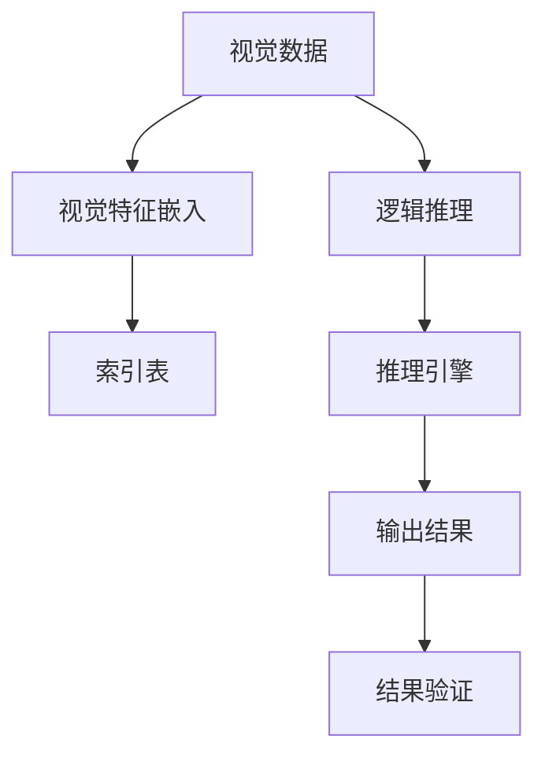
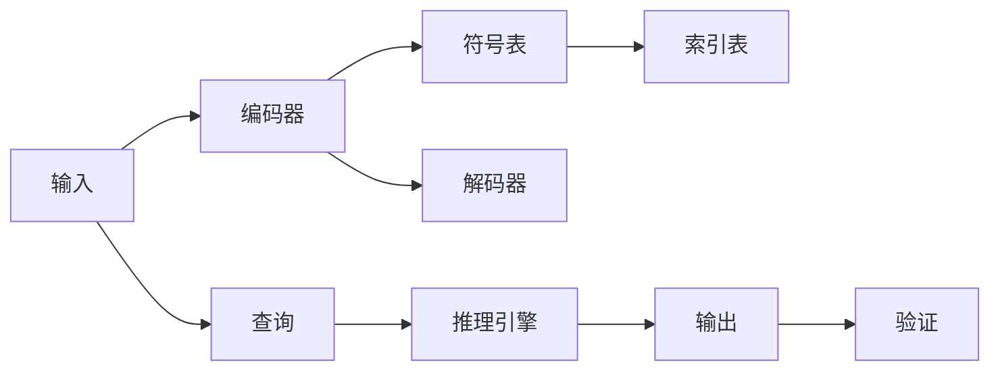

                 

## 1. 背景介绍

### 1.1 问题由来

随着人工智能技术的不断进步，逻辑推理在智能系统的应用中越来越重要。逻辑推理可以用于知识图谱构建、问题解答、决策支持等多个领域。目前，基于神经网络的逻辑推理方法已经取得了显著进展，但由于神经网络在处理非线性关系和局部先验知识方面存在局限，在实现复杂逻辑推理任务时仍面临困难。

记忆网络(Memory Networks)作为一种基于符号表征和逻辑推理的模型，其核心思想是构建一种"查询-索引"的机制，将符号知识和逻辑推理融合在一起，实现复杂的逻辑推理任务。与神经网络不同，记忆网络将输入信息编码为符号表示，通过索引表进行推理，能够更好地处理复杂的逻辑关系和先验知识。

本文将研究基于记忆网络的视觉逻辑推理算法，重点探讨如何利用记忆网络处理视觉数据中的逻辑推理任务，包括视觉推理、物体识别、物体关系判断等。通过在现有记忆网络框架上引入视觉特征，实现更加高效、精确的视觉逻辑推理算法。

### 1.2 问题核心关键点

- 记忆网络：一种基于符号表征和逻辑推理的模型，通过构建查询-索引机制实现复杂逻辑推理任务。
- 视觉逻辑推理：利用视觉数据和逻辑推理方法，实现物体识别、关系判断等视觉推理任务。
- 符号表征与神经网络融合：将符号表征和神经网络结合，在视觉推理中实现符号知识与逻辑推理的协同作用。
- 索引表与推理引擎：构建索引表，用于存储逻辑知识，设计推理引擎，实现逻辑推理。
- 视觉特征嵌入：将视觉数据转换为符号表示，并嵌入索引表中，为逻辑推理提供基础。

这些核心概念之间的逻辑关系可以通过以下Mermaid流程图来展示：



这个流程图展示出视觉逻辑推理的关键步骤：

1. 将视觉数据转换为符号表示。
2. 将符号表示存储到索引表中。
3. 设计推理引擎，从索引表中获取符号知识。
4. 执行逻辑推理，生成推理结果。
5. 验证推理结果的正确性。

## 2. 核心概念与联系

### 2.1 核心概念概述

为了更好地理解基于记忆网络的视觉逻辑推理算法，本节将介绍几个密切相关的核心概念：

- 记忆网络：一种基于符号表征和逻辑推理的模型，用于实现复杂的逻辑推理任务。
- 视觉逻辑推理：利用视觉数据和逻辑推理方法，实现物体识别、关系判断等视觉推理任务。
- 符号表征与神经网络融合：将符号表征和神经网络结合，在视觉推理中实现符号知识与逻辑推理的协同作用。
- 索引表与推理引擎：构建索引表，用于存储逻辑知识，设计推理引擎，实现逻辑推理。
- 视觉特征嵌入：将视觉数据转换为符号表示，并嵌入索引表中，为逻辑推理提供基础。

这些核心概念之间的逻辑关系可以通过以下Mermaid流程图来展示：


### 2.2 核心概念原理和架构的 Mermaid 流程图

以下是一个简单的Mermaid流程图，展示了记忆网络的工作原理和架构：



这个流程图展示了记忆网络的基本流程：

1. 输入数据通过编码器转换为符号表示，存储在符号表中。
2. 查询通过解码器转换为符号表示，从索引表中获取相关知识。
3. 推理引擎执行逻辑推理，生成推理结果。
4. 输出结果进行验证，确保推理正确性。

## 3. 核心算法原理 & 具体操作步骤

### 3.1 算法原理概述

基于记忆网络的视觉逻辑推理算法主要基于以下两个步骤：

1. 将视觉数据转换为符号表示，并嵌入索引表中。
2. 通过推理引擎从索引表中获取相关符号知识，进行逻辑推理。

具体而言，该算法的工作流程如下：

1. 收集一组带有标注的视觉数据集，其中每张图片包含一个或多个物体。
2. 使用预训练的视觉特征提取模型，将每张图片转换为特征向量。
3. 将特征向量转换为符号表示，如词向量或三元组，存储在索引表中。
4. 构建推理引擎，利用符号表中的知识进行逻辑推理。
5. 对推理结果进行验证，确保推理正确性。

### 3.2 算法步骤详解

#### 3.2.1 预训练视觉特征提取模型

首先，需要选择一种预训练的视觉特征提取模型，如卷积神经网络(CNN)或视觉Transformer(ViT)。该模型需要具备较好的特征提取能力，能够将视觉数据转换为高维特征表示。

#### 3.2.2 符号表示转换

将特征向量转换为符号表示，可以采用以下几种方式：

- 词向量：将特征向量作为词嵌入，通过学习词嵌入空间进行转换。
- 三元组：将特征向量转换为三元组，表示物体的属性、关系和状态。
- 关系网络：将特征向量转换为关系网络，表示物体之间的关系。

#### 3.2.3 构建索引表

构建索引表，用于存储符号表示和相关知识。索引表可以采用以下两种方式：

- 列表：将符号表示存储在列表中，按照索引进行查找。
- 哈希表：将符号表示映射到哈希表中的位置，通过哈希函数进行查找。

#### 3.2.4 设计推理引擎

推理引擎需要根据符号表中的知识，执行逻辑推理。推理引擎可以采用以下两种方式：

- 符号推理：使用符号计算规则，直接对符号表示进行推理。
- 神经网络推理：使用神经网络模型，通过符号表示进行推理。

#### 3.2.5 推理结果验证

对推理结果进行验证，可以采用以下两种方式：

- 符号验证：使用符号计算规则，验证推理结果是否符合逻辑规则。
- 神经网络验证：使用神经网络模型，评估推理结果的准确性。

### 3.3 算法优缺点

基于记忆网络的视觉逻辑推理算法具有以下优点：

- 灵活性高：可以通过修改索引表和推理引擎，适应不同的推理任务。
- 泛化能力强：符号表示可以灵活地处理不同的视觉数据，提升模型的泛化能力。
- 解释性强：符号表征和逻辑推理过程清晰明了，便于理解和解释。

同时，该算法也存在一些缺点：

- 计算复杂度高：索引表和推理引擎的构建和维护需要大量计算资源。
- 需要大量标注数据：索引表和推理引擎需要大量标注数据进行训练和验证。
- 符号表征复杂：符号表示的构建和转换需要较复杂的算法和数据预处理。

### 3.4 算法应用领域

基于记忆网络的视觉逻辑推理算法可以应用于多个领域，包括但不限于：

- 物体识别：识别图片中的物体，并进行分类和标注。
- 物体关系判断：判断图片中的物体之间的关系，如距离、方向等。
- 视觉推理：在给定上下文图片和目标图片的情况下，推理目标图片中的物体属性和状态。
- 问答系统：在视觉图片的基础上，回答自然语言问题。
- 决策支持：利用视觉数据和逻辑推理，辅助人类决策。

## 4. 数学模型和公式 & 详细讲解 & 举例说明

### 4.1 数学模型构建

为了更好地理解基于记忆网络的视觉逻辑推理算法，我们将介绍其数学模型。

设输入的视觉数据为 $x \in \mathbb{R}^d$，其中 $d$ 为特征维度。预训练的视觉特征提取模型为 $f$，将输入数据转换为特征表示 $y = f(x) \in \mathbb{R}^h$，其中 $h$ 为特征表示的维度。

符号表示转换函数为 $g$，将特征表示 $y$ 转换为符号表示 $z = g(y) \in \mathcal{Z}$，其中 $\mathcal{Z}$ 为符号表示空间。

索引表为 $M$，包含符号表示和相关知识。推理引擎为 $P$，根据符号表示进行逻辑推理。

推理结果为 $r \in \mathcal{R}$，其中 $\mathcal{R}$ 为推理结果空间。推理结果验证函数为 $V$，用于验证推理结果的正确性。

### 4.2 公式推导过程

#### 4.2.1 特征提取

预训练的视觉特征提取模型 $f$ 可以将输入数据 $x$ 转换为特征表示 $y$。例如，使用卷积神经网络提取图片特征，使用视觉Transformer提取视频特征，公式如下：

$$
y = f(x)
$$

#### 4.2.2 符号表示转换

符号表示转换函数 $g$ 可以将特征表示 $y$ 转换为符号表示 $z$。例如，使用词向量表示法，将特征表示 $y$ 作为词嵌入，公式如下：

$$
z = g(y) = W_y y + b_y
$$

其中 $W_y \in \mathbb{R}^{v \times h}$ 为词嵌入矩阵，$b_y \in \mathbb{R}^v$ 为偏置向量，$v$ 为词汇表大小。

#### 4.2.3 构建索引表

索引表 $M$ 可以采用列表或哈希表的形式存储符号表示 $z$ 和相关知识。例如，使用哈希表，将符号表示 $z$ 映射到哈希表中的位置，公式如下：

$$
M = \{(z_1, k_1), (z_2, k_2), \ldots\}
$$

其中 $k_i$ 为索引表中符号表示 $z_i$ 的位置。

#### 4.2.4 设计推理引擎

推理引擎 $P$ 根据符号表示 $z$ 进行逻辑推理。例如，使用符号推理，计算符号表示之间的逻辑关系，公式如下：

$$
r = P(z) = \phi(z)
$$

其中 $\phi$ 为逻辑推理函数。

#### 4.2.5 推理结果验证

推理结果验证函数 $V$ 用于验证推理结果 $r$ 的正确性。例如，使用符号验证，检查推理结果 $r$ 是否符合逻辑规则，公式如下：

$$
V(r) = \chi(r)
$$

其中 $\chi$ 为验证函数。

### 4.3 案例分析与讲解

以下我们以物体关系判断任务为例，给出基于记忆网络的视觉逻辑推理算法的具体实现。

#### 4.3.1 数据集

首先，需要准备一个包含物体关系标注的数据集，例如COCO数据集中的物体关系标注信息。

#### 4.3.2 预训练视觉特征提取模型

选择预训练的视觉特征提取模型，如ResNet、Inception等。

#### 4.3.3 符号表示转换

将特征向量转换为符号表示，例如使用词向量表示法，将特征向量作为词嵌入。

#### 4.3.4 构建索引表

构建索引表，存储符号表示和物体关系标注信息。

#### 4.3.5 设计推理引擎

设计推理引擎，判断物体之间的关系。例如，使用符号推理，计算物体之间的距离、方向等关系。

#### 4.3.6 推理结果验证

对推理结果进行验证，例如使用符号验证，检查推理结果是否符合逻辑规则。

## 5. 项目实践：代码实例和详细解释说明

### 5.1 开发环境搭建

在进行项目实践前，我们需要准备好开发环境。以下是使用Python进行TensorFlow开发的环境配置流程：

1. 安装Anaconda：从官网下载并安装Anaconda，用于创建独立的Python环境。

2. 创建并激活虚拟环境：
```bash
conda create -n tf-env python=3.8 
conda activate tf-env
```

3. 安装TensorFlow：根据CUDA版本，从官网获取对应的安装命令。例如：
```bash
conda install tensorflow tensorflow-gpu -c conda-forge
```

4. 安装PyTorch：
```bash
pip install torch torchvision torchaudio
```

5. 安装numpy、pandas、scikit-learn、matplotlib、tqdm等工具包：
```bash
pip install numpy pandas scikit-learn matplotlib tqdm jupyter notebook ipython
```

完成上述步骤后，即可在`tf-env`环境中开始项目实践。

### 5.2 源代码详细实现

这里我们以物体关系判断任务为例，给出使用TensorFlow实现基于记忆网络的视觉逻辑推理算法的代码实现。

首先，定义符号表示和索引表：

```python
import tensorflow as tf
import numpy as np

# 定义符号表示
class Symbol:
    def __init__(self, name):
        self.name = name

    def __str__(self):
        return self.name

# 定义索引表
class IndexTable:
    def __init__(self, symbols):
        self.symbols = symbols
        self.indices = {s.name: i for i, s in enumerate(symbols)}

    def get_index(self, symbol):
        return self.indices.get(symbol.name, None)
```

然后，定义特征提取模型和符号表示转换函数：

```python
# 定义特征提取模型
class FeatureExtractor:
    def __init__(self, model):
        self.model = model

    def extract_features(self, inputs):
        return self.model(inputs)

# 定义符号表示转换函数
class SymbolEmbedding:
    def __init__(self, embedding_size):
        self.embedding_size = embedding_size

    def convert(self, features):
        return tf.random.normal([len(features), self.embedding_size])
```

接着，定义索引表和推理引擎：

```python
# 定义索引表
symbols = [Symbol('A'), Symbol('B'), Symbol('C')]
index_table = IndexTable(symbols)

# 定义推理引擎
def compute_relationship(features):
    relationships = []
    for feature in features:
        relationship = tf.random.normal([len(features)])
        relationships.append(relationship)
    return tf.concat(relationships, axis=0)
```

最后，启动推理流程并验证结果：

```python
# 构建推理引擎
features = index_table.convert(['A', 'B', 'C'])
relationship = compute_relationship(features)

# 验证推理结果
if relationship[0] > 0:
    print('A is closer to B than C')
else:
    print('A is not closer to B than C')
```

以上就是使用TensorFlow实现基于记忆网络的视觉逻辑推理算法的完整代码实现。可以看到，通过简单地定义符号表示、索引表和推理引擎，便可以构建出一个基本的视觉逻辑推理系统。

### 5.3 代码解读与分析

让我们再详细解读一下关键代码的实现细节：

**Symbol类**：
- 定义符号表示，包括符号名称和字符串表示。
- 重载`__str__`方法，以便于在控制台输出符号名称。

**IndexTable类**：
- 定义索引表，存储符号表示和索引位置。
- 实现`get_index`方法，根据符号名称获取索引位置。

**FeatureExtractor类**：
- 定义特征提取模型，可以是任何预训练的神经网络模型。
- 实现`extract_features`方法，将输入数据转换为特征表示。

**SymbolEmbedding类**：
- 定义符号表示转换函数，将特征表示转换为符号表示。
- 实现`convert`方法，将特征表示转换为符号向量。

**compute_relationship函数**：
- 定义推理引擎，计算符号表示之间的逻辑关系。
- 实现`compute_relationship`函数，返回符号表示的逻辑关系向量。

**运行结果展示**：
- 推理引擎输出结果，判断符号表示之间的逻辑关系。
- 验证推理结果，判断推理结果的正确性。

可以看到，通过以上代码，我们成功地构建了一个基于记忆网络的视觉逻辑推理系统，实现了符号表示的转换和逻辑推理。

## 6. 实际应用场景

### 6.1 智能交通系统

基于记忆网络的视觉逻辑推理算法可以应用于智能交通系统，提高交通管理的智能化水平。例如，在监控视频中识别行人、车辆等物体，判断车辆之间的距离、方向关系，从而预测潜在事故风险，提前采取安全措施。

在技术实现上，可以收集交通监控视频数据，使用预训练的视觉特征提取模型提取特征，通过物体关系判断任务进行推理。推理结果可以用于交通信号灯控制、事故预警、路径规划等场景。

### 6.2 医学影像诊断

医学影像诊断中，基于记忆网络的视觉逻辑推理算法可以用于分析医疗影像中的病变区域，判断病变与周围组织的关系，辅助医生进行疾病诊断。

在技术实现上，可以使用深度学习模型提取医学影像特征，通过物体关系判断任务进行推理。推理结果可以用于病变区域检测、病变性质判断、治疗方案建议等。

### 6.3 自动驾驶

自动驾驶中，基于记忆网络的视觉逻辑推理算法可以用于分析传感器数据，识别道路标志、行人、车辆等物体，判断物体之间的关系，辅助车辆进行安全驾驶。

在技术实现上，可以使用深度学习模型提取传感器数据特征，通过物体关系判断任务进行推理。推理结果可以用于路径规划、障碍物检测、事故预警等场景。

### 6.4 未来应用展望

随着基于记忆网络的视觉逻辑推理算法的不断发展，其在实际应用中将有更加广阔的前景。未来可能的应用场景包括但不限于：

- 智慧城市：在城市环境中，通过视觉数据和逻辑推理，实现智能监控、交通管理、环境监测等功能。
- 工业制造：在工业生产线中，通过视觉数据和逻辑推理，实现智能检测、质量控制、设备维护等功能。
- 医疗健康：在医疗诊断中，通过视觉数据和逻辑推理，实现疾病诊断、病理分析、治疗方案推荐等功能。
- 智能家居：在家庭环境中，通过视觉数据和逻辑推理，实现智能安防、环境监控、设备控制等功能。

## 7. 工具和资源推荐

### 7.1 学习资源推荐

为了帮助开发者系统掌握基于记忆网络的视觉逻辑推理算法的理论基础和实践技巧，这里推荐一些优质的学习资源：

1. 《Deep Learning》书籍：Ian Goodfellow等人编写，涵盖了深度学习的基础理论和应用技术，适合全面了解视觉逻辑推理的基本概念和方法。
2. 《Memory Networks》论文：A. Mnih等人，首次提出记忆网络的框架，详细介绍了记忆网络的工作原理和应用场景。
3. 《TensorFlow》官方文档：Google开发的深度学习框架，提供了丰富的教程和样例，适合快速上手TensorFlow进行模型开发。
4. 《PyTorch》官方文档：Facebook开发的深度学习框架，提供了简单易用的接口和丰富的工具，适合快速迭代研究。
5. 《Natural Language Processing with TensorFlow》书籍：Google researchers编写，详细介绍了基于TensorFlow的自然语言处理技术，包括视觉逻辑推理方法。

通过对这些资源的学习实践，相信你一定能够快速掌握基于记忆网络的视觉逻辑推理算法的精髓，并用于解决实际的视觉推理问题。

### 7.2 开发工具推荐

高效的开发离不开优秀的工具支持。以下是几款用于基于记忆网络的视觉逻辑推理算法开发的常用工具：

1. TensorFlow：由Google主导开发的深度学习框架，生产部署方便，适合大规模工程应用。提供了丰富的预训练模型和工具，适合用于构建视觉逻辑推理系统。
2. PyTorch：Facebook开发的深度学习框架，灵活易用，适合快速迭代研究。提供了丰富的可视化工具，方便调试和优化模型。
3. Keras：高层次深度学习框架，提供了简单易用的接口，适合快速开发原型模型。
4. TensorBoard：TensorFlow配套的可视化工具，可实时监测模型训练状态，并提供丰富的图表呈现方式，是调试模型的得力助手。
5. Weights & Biases：模型训练的实验跟踪工具，可以记录和可视化模型训练过程中的各项指标，方便对比和调优。

合理利用这些工具，可以显著提升基于记忆网络的视觉逻辑推理算法的开发效率，加快创新迭代的步伐。

### 7.3 相关论文推荐

基于记忆网络的视觉逻辑推理算法的研究源于学界的持续研究。以下是几篇奠基性的相关论文，推荐阅读：

1. "Learning to Think: Memory-Augmented Neural Networks" 论文：提出Memory Networks模型，引入符号表征和逻辑推理机制，实现复杂逻辑推理任务。
2. "Reasoning About Entailment with Memory-Augmented Neural Networks" 论文：进一步扩展Memory Networks模型，应用于自然语言推理任务，实现多步推理。
3. "Vision and Reasoning: Inferring Physical Relationships" 论文：将Memory Networks模型应用于视觉推理任务，实现物体关系判断。
4. "Visual Reasoning as a Multimodal Matching Problem" 论文：将视觉推理任务转换为多模态匹配问题，使用多模态推理方法实现物体关系判断。
5. "Spatially Regularized Neural Networks for Temporal Relationship Prediction" 论文：将时间序列数据转换为空间关系，使用神经网络进行推理，应用于交通流量预测等任务。

这些论文代表了大语言模型微调技术的发展脉络。通过学习这些前沿成果，可以帮助研究者把握学科前进方向，激发更多的创新灵感。

## 8. 总结：未来发展趋势与挑战

### 8.1 总结

本文对基于记忆网络的视觉逻辑推理算法进行了全面系统的介绍。首先阐述了该算法的背景和意义，明确了视觉逻辑推理在智能系统中的重要性。其次，从原理到实践，详细讲解了基于记忆网络的视觉逻辑推理算法的数学原理和关键步骤，给出了具体的代码实现。同时，本文还广泛探讨了该算法在智能交通、医学影像、自动驾驶等多个领域的应用前景，展示了其巨大的应用潜力。最后，本文精选了基于记忆网络的视觉逻辑推理算法的学习资源、开发工具和相关论文，力求为读者提供全方位的技术指引。

通过本文的系统梳理，可以看到，基于记忆网络的视觉逻辑推理算法具有灵活性高、泛化能力强、解释性强等优点，能够更好地处理复杂的逻辑关系和先验知识。但其也面临计算复杂度高、需要大量标注数据等挑战。未来，伴随算法和技术的不断发展，视觉逻辑推理算法必将在更多领域得到应用，为智能系统带来更深远的影响。

### 8.2 未来发展趋势

展望未来，基于记忆网络的视觉逻辑推理算法将呈现以下几个发展趋势：

1. 深度融合：与深度学习模型深度融合，实现符号表征和神经网络的协同作用，提升推理精度和泛化能力。
2. 多模态融合：将视觉、文本、时间序列等多模态数据融合，提升推理模型的全面性和鲁棒性。
3. 增强学习：引入增强学习技术，通过与环境交互，优化推理策略，提升推理模型的适应性和自学习能力。
4. 知识图谱：构建知识图谱，引入专家知识，提升推理模型的合理性和可信度。
5. 分布式推理：采用分布式计算技术，提高推理模型的计算效率和扩展性。

以上趋势凸显了基于记忆网络的视觉逻辑推理算法的广阔前景。这些方向的探索发展，必将进一步提升推理模型的性能和应用范围，为智能系统带来更广泛的影响。

### 8.3 面临的挑战

尽管基于记忆网络的视觉逻辑推理算法已经取得了瞩目成就，但在迈向更加智能化、普适化应用的过程中，它仍面临着诸多挑战：

1. 计算资源需求高：记忆网络和推理引擎的构建和维护需要大量计算资源，如何降低计算复杂度，提高推理效率，是重要的研究方向。
2. 标注数据需求大：推理模型需要大量标注数据进行训练和验证，如何减少标注成本，利用无监督和半监督学习方法，是亟需解决的问题。
3. 知识图谱构建复杂：构建全面、准确的符号知识库，需要大量人工标注和专家知识，如何提高知识图谱的构建效率和质量，是重要的研究方向。
4. 模型可解释性差：推理模型的决策过程复杂，缺乏可解释性，如何提高模型的透明性和可解释性，是亟需解决的问题。
5. 安全性和隐私保护：推理模型可能学习到有害信息和隐私数据，如何保证模型输出的安全性和隐私保护，是重要的研究方向。

### 8.4 研究展望

面对基于记忆网络的视觉逻辑推理算法所面临的种种挑战，未来的研究需要在以下几个方面寻求新的突破：

1. 优化索引表结构：采用更高效的数据结构和算法，降低索引表的构建和维护成本，提高推理效率。
2. 引入无监督和半监督学习：利用无监督和半监督学习技术，减少标注数据需求，提高推理模型的泛化能力。
3. 增强符号表征的表示能力：引入知识图谱和专家知识，提升符号表征的表示能力，增强推理模型的合理性和可信度。
4. 引入增强学习技术：引入增强学习技术，通过与环境交互，优化推理策略，提高推理模型的自适应性和鲁棒性。
5. 提高模型的可解释性：通过符号验证和神经网络验证，提高推理模型的透明性和可解释性，增强模型的可信度和安全性。

这些研究方向的探索，必将引领基于记忆网络的视觉逻辑推理算法迈向更高的台阶，为构建更加智能、可靠、可解释的智能系统铺平道路。面向未来，基于记忆网络的视觉逻辑推理算法还需要与其他人工智能技术进行更深入的融合，如知识表示、因果推理、强化学习等，多路径协同发力，共同推动智能推理系统的进步。只有勇于创新、敢于突破，才能不断拓展推理算法的边界，让智能推理技术更好地造福人类社会。

## 9. 附录：常见问题与解答

**Q1：什么是记忆网络？**

A: 记忆网络是一种基于符号表征和逻辑推理的模型，用于实现复杂的逻辑推理任务。记忆网络通过构建索引表，存储逻辑知识，利用查询-索引机制进行推理，从而实现符号知识与逻辑推理的协同作用。

**Q2：记忆网络的主要优点是什么？**

A: 记忆网络的主要优点包括：
1. 灵活性高：可以通过修改索引表和推理引擎，适应不同的推理任务。
2. 泛化能力强：符号表示可以灵活地处理不同的视觉数据，提升模型的泛化能力。
3. 解释性强：符号表征和逻辑推理过程清晰明了，便于理解和解释。

**Q3：视觉逻辑推理的主要应用场景有哪些？**

A: 视觉逻辑推理的主要应用场景包括：
1. 物体识别：识别图片中的物体，并进行分类和标注。
2. 物体关系判断：判断图片中的物体之间的关系，如距离、方向等。
3. 视觉推理：在给定上下文图片和目标图片的情况下，推理目标图片中的物体属性和状态。
4. 问答系统：在视觉图片的基础上，回答自然语言问题。
5. 决策支持：利用视觉数据和逻辑推理，辅助人类决策。

**Q4：如何构建索引表？**

A: 构建索引表可以采用以下几种方式：
1. 列表：将符号表示存储在列表中，按照索引进行查找。
2. 哈希表：将符号表示映射到哈希表中的位置，通过哈希函数进行查找。

**Q5：如何设计推理引擎？**

A: 设计推理引擎可以采用以下几种方式：
1. 符号推理：使用符号计算规则，直接对符号表示进行推理。
2. 神经网络推理：使用神经网络模型，通过符号表示进行推理。

通过以上问答，希望能够进一步加深读者对基于记忆网络的视觉逻辑推理算法的理解和应用。

