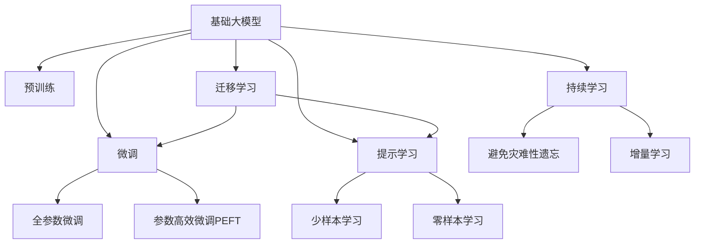

                 

# 基础大模型的投资门槛分析

## 1. 背景介绍

随着人工智能技术的发展，基础大模型（Base Large Models）在各行各业的应用日益广泛。无论是搜索引擎、推荐系统、智能客服，还是自动驾驶、金融分析、医疗诊断，都可以看到大模型的身影。这些大模型通过在大规模数据上进行预训练，学习到了通用的语言或知识表示，具备强大的数据理解能力和生成能力。然而，基础大模型的投资门槛并不低，涉及的技术细节较多，且对资源要求较高。本文将详细分析基础大模型的投资门槛，探讨其核心概念、算法原理、操作步骤和应用领域，以期为有意投资基础大模型的开发者和公司提供有益的参考。

## 2. 核心概念与联系

### 2.1 核心概念概述

为了更好地理解基础大模型及其相关概念，本节将介绍以下几个关键概念：

- **基础大模型（Base Large Models）**：指的是通过在大规模数据上进行的预训练，学习到通用的语言或知识表示，如BERT、GPT等模型。这些模型在特定的任务上进行了微调，可以显著提升模型的效果。

- **预训练（Pre-training）**：指在大规模无标签数据上，通过自监督学习任务训练通用模型。常见的预训练任务包括语言模型、自编码器等。预训练使得模型学习到通用的语言或知识表示。

- **微调（Fine-tuning）**：指在预训练模型基础上，使用下游任务的少量标注数据，通过有监督学习优化模型在该任务上的性能。微调可以显著提升模型在特定任务上的效果。

- **迁移学习（Transfer Learning）**：指将一个领域学到的知识，迁移应用到另一个不同但相关的领域的学习范式。大模型的预训练-微调过程即是一种典型的迁移学习方式。

- **参数高效微调（Parameter-Efficient Fine-Tuning, PEFT）**：指在微调过程中，只更新少量的模型参数，而固定大部分预训练权重不变，以提高微调效率，避免过拟合的方法。

- **提示学习（Prompt Learning）**：通过在输入文本中添加提示模板（Prompt Template），引导大模型进行特定任务的推理和生成。可以在不更新模型参数的情况下，实现零样本或少样本学习。

- **少样本学习（Few-shot Learning）**：指在只有少量标注样本的情况下，模型能够快速适应新任务的学习方法。在大语言模型中，通常通过在输入中提供少量示例来实现，无需更新模型参数。

- **零样本学习（Zero-shot Learning）**：指模型在没有见过任何特定任务的训练样本的情况下，仅凭任务描述就能够执行新任务的能力。大语言模型通过预训练获得的广泛知识，使其能够理解任务指令并生成相应输出。

- **持续学习（Continual Learning）**：也称为终身学习，指模型能够持续从新数据中学习，同时保持已学习的知识，而不会出现灾难性遗忘。这对于保持大语言模型的时效性和适应性至关重要。

这些核心概念之间的逻辑关系可以通过以下Mermaid流程图来展示：



这个流程图展示了大语言模型的核心概念及其之间的关系：

1. 基础大模型通过预训练获得基础能力。
2. 微调是对预训练模型进行任务特定的优化，可以分为全参数微调和参数高效微调（PEFT）。
3. 提示学习是一种不更新模型参数的方法，可以实现少样本学习和零样本学习。
4. 迁移学习是连接预训练模型与下游任务的桥梁，可以通过微调或提示学习来实现。
5. 持续学习旨在使模型能够不断学习新知识，同时避免遗忘旧知识。

## 3. 核心算法原理 & 具体操作步骤

### 3.1 算法原理概述

基础大模型的投资门槛主要体现在技术细节和资源要求上。以下将详细介绍这些方面的内容。

**基础大模型的技术细节**：

- **预训练模型**：基础大模型通常基于自回归或自编码模型进行预训练。以BERT为例，其预训练任务为掩码语言模型和下一句预测任务，使得模型能够学习到丰富的语言表示。

- **微调策略**：微调分为全参数微调和参数高效微调。全参数微调涉及所有参数的更新，适用于下游任务的数据量较小的情况；参数高效微调只更新部分参数，保留预训练权重，适用于数据量较大但标注数据较少的情况。

- **提示学习**：提示学习通过在输入中添加特定的提示模板，使得模型能够理解任务指令并生成相应的输出，适用于零样本或少样本学习场景。

**资源要求**：

- **数据需求**：预训练和微调都需要大量的数据支持。预训练数据通常来自大规模无标签文本语料库，而微调数据需要根据具体任务准备。

- **计算资源**：预训练和微调模型的训练需要高性能的计算资源，包括GPU、TPU等硬件设备。同时，模型推理也需要一定的计算资源。

- **内存需求**：大模型的参数量通常以亿计，存储和推理都需要较高的内存支持。

- **算法复杂度**：大模型的训练和推理算法复杂度高，需要高效的优化算法和深度学习框架的支持。

### 3.2 算法步骤详解

基础大模型的投资门槛涉及技术细节和资源要求，以下详细介绍这些方面的内容。

**预训练模型选择与准备**：

1. **选择合适的预训练模型**：根据具体任务和数据需求，选择合适的预训练模型，如BERT、GPT等。

2. **准备预训练数据**：收集并准备大规模无标签数据，用于预训练模型的训练。

**微调模型设计**：

1. **任务适配层设计**：根据具体任务设计任务适配层，如分类任务的线性分类器、生成任务的解码器等。

2. **损失函数选择**：选择合适的损失函数，如交叉熵、均方误差等，用于衡量模型预测与真实标签之间的差异。

**微调模型训练**：

1. **训练集划分**：将数据集划分为训练集、验证集和测试集。

2. **设置超参数**：设置学习率、批大小、迭代轮数等超参数，并进行初步调参。

3. **执行梯度训练**：使用优化算法（如Adam、SGD等）进行梯度训练，更新模型参数。

4. **验证集评估**：在验证集上评估模型性能，根据评估结果调整超参数，避免过拟合。

5. **测试集测试**：在测试集上测试模型性能，对比微调前后的效果。

6. **部署与监控**：将微调后的模型部署到实际应用中，并进行实时监控和维护。

### 3.3 算法优缺点

基础大模型的投资门槛涉及技术细节和资源要求，以下详细介绍这些方面的内容。

**优点**：

1. **通用性强**：基础大模型能够适应多种下游任务，只需进行简单的任务适配层设计即可。

2. **效果显著**：通过微调，基础大模型能够在特定任务上取得显著的效果提升。

3. **灵活性高**：基础大模型可以通过提示学习实现零样本或少样本学习，适应不同的应用场景。

**缺点**：

1. **资源要求高**：预训练和微调需要大量的数据和计算资源，对硬件设备有较高要求。

2. **过拟合风险**：微调过程中容易出现过拟合，需要采取相应的正则化技术。

3. **泛化能力有限**：当目标任务与预训练数据的分布差异较大时，微调的性能提升有限。

4. **可解释性不足**：基础大模型通常是"黑盒"系统，难以解释其内部工作机制和决策逻辑。

5. **伦理问题**：预训练模型可能会学习到有偏见、有害的信息，需要在模型设计和训练过程中加以注意。

### 3.4 算法应用领域

基础大模型在多个领域具有广泛的应用。以下详细介绍这些领域的应用情况：

- **自然语言处理（NLP）**：基础大模型在NLP领域具有广泛的应用，如文本分类、命名实体识别、关系抽取、问答系统、机器翻译、文本摘要、对话系统等。

- **计算机视觉（CV）**：基础大模型在CV领域也有应用，如图像分类、目标检测、图像生成、图像检索等。

- **医疗健康**：基础大模型在医疗健康领域具有应用，如医疗问答、病历分析、药物研发等。

- **金融**：基础大模型在金融领域具有应用，如舆情分析、智能投顾、金融知识图谱等。

- **智能制造**：基础大模型在智能制造领域具有应用，如工业故障预测、机器人协作等。

- **交通**：基础大模型在交通领域具有应用，如自动驾驶、交通信号优化等。

## 4. 数学模型和公式 & 详细讲解 & 举例说明

### 4.1 数学模型构建

以下详细介绍基础大模型及其相关算法的数学模型构建。

**预训练模型**：

以BERT为例，其预训练任务为掩码语言模型和下一句预测任务，形式化地表示如下：

1. 掩码语言模型：

   $$
   \mathcal{L}_{m}(\theta) = -\sum_{i=1}^{N}\sum_{j=1}^{L}\log P_{\theta}(x_{i,j})
   $$

   其中，$x_{i,j}$ 表示序列 $x_i$ 中第 $j$ 个位置的标记，$L$ 为序列长度，$P_{\theta}(x_{i,j})$ 表示模型在给定序列 $x_i$ 的情况下，预测 $x_{i,j}$ 的分布。

2. 下一句预测任务：

   $$
   \mathcal{L}_{s}(\theta) = -\sum_{i=1}^{N}\log P_{\theta}(c_i)
   $$

   其中，$c_i$ 表示序列 $x_i$ 的下一句标签，$P_{\theta}(c_i)$ 表示模型预测下一个句子与 $x_i$ 是否为下一句的概率。

**微调模型**：

以BERT微调为例，其微调目标函数为：

$$
\mathcal{L}(\theta) = \mathcal{L}_{m}(\theta) + \mathcal{L}_{s}(\theta) + \mathcal{L}_{task}(\theta)
$$

其中，$\mathcal{L}_{task}(\theta)$ 表示下游任务的损失函数。

**提示学习**：

以GPT提示学习为例，其提示模板为：

$$
p_{\theta}(x \mid \text{prompt})
$$

其中，$p_{\theta}(x \mid \text{prompt})$ 表示在给定提示模板 $\text{prompt}$ 的情况下，模型生成文本 $x$ 的概率。

### 4.2 公式推导过程

以下详细介绍基础大模型及其相关算法的公式推导过程。

**掩码语言模型推导**：

以BERT为例，其掩码语言模型推导如下：

1. 输入序列 $x$，其中 $x = \{x_1, x_2, ..., x_L\}$。

2. 对每个位置 $j$，随机掩盖部分标记 $x_{i,j}$，得到掩码序列 $\tilde{x}_j$。

3. 使用掩码序列 $\tilde{x}_j$ 进行预训练，得到模型参数 $\theta$。

4. 对每个位置 $j$，预测标记 $x_{i,j}$ 的分布 $P_{\theta}(x_{i,j} \mid \tilde{x}_j)$。

5. 计算掩码语言模型的损失 $\mathcal{L}_{m}(\theta)$。

**下一句预测任务推导**：

以BERT为例，其下一句预测任务推导如下：

1. 输入序列 $x$，其中 $x = \{x_1, x_2, ..., x_L\}$。

2. 对每个位置 $i$，预测下一句 $c_i$ 的概率 $P_{\theta}(c_i \mid x_i)$。

3. 计算下一句预测任务的损失 $\mathcal{L}_{s}(\theta)$。

**微调模型推导**：

以BERT微调为例，其微调目标函数推导如下：

1. 输入序列 $x$，其中 $x = \{x_1, x_2, ..., x_L\}$。

2. 对每个位置 $j$，预测标记 $x_{i,j}$ 的分布 $P_{\theta}(x_{i,j} \mid \tilde{x}_j)$。

3. 计算掩码语言模型的损失 $\mathcal{L}_{m}(\theta)$。

4. 对每个位置 $i$，预测下一句 $c_i$ 的概率 $P_{\theta}(c_i \mid x_i)$。

5. 计算下一句预测任务的损失 $\mathcal{L}_{s}(\theta)$。

6. 对每个位置 $i$，计算下游任务的损失 $\mathcal{L}_{task}(\theta)$。

7. 计算微调模型的总损失 $\mathcal{L}(\theta)$。

### 4.3 案例分析与讲解

以下详细介绍基础大模型及其相关算法的案例分析与讲解。

**BERT微调案例**：

以BERT微调为例，其案例分析如下：

1. 准备数据集：收集并准备BERT微调所需的数据集，划分为训练集、验证集和测试集。

2. 任务适配层设计：根据具体任务，设计任务适配层，如分类任务的线性分类器、生成任务的解码器等。

3. 设置超参数：设置学习率、批大小、迭代轮数等超参数，并进行初步调参。

4. 执行梯度训练：使用优化算法（如Adam、SGD等）进行梯度训练，更新模型参数。

5. 验证集评估：在验证集上评估模型性能，根据评估结果调整超参数，避免过拟合。

6. 测试集测试：在测试集上测试模型性能，对比微调前后的效果。

7. 部署与监控：将微调后的模型部署到实际应用中，并进行实时监控和维护。

## 5. 项目实践：代码实例和详细解释说明

### 5.1 开发环境搭建

进行基础大模型的投资门槛分析，需要搭建开发环境。以下是使用Python进行PyTorch开发的环境配置流程：

1. 安装Anaconda：从官网下载并安装Anaconda，用于创建独立的Python环境。

2. 创建并激活虚拟环境：

```bash
conda create -n pytorch-env python=3.8 
conda activate pytorch-env
```

3. 安装PyTorch：根据CUDA版本，从官网获取对应的安装命令。例如：

```bash
conda install pytorch torchvision torchaudio cudatoolkit=11.1 -c pytorch -c conda-forge
```

4. 安装Transformers库：

```bash
pip install transformers
```

5. 安装各类工具包：

```bash
pip install numpy pandas scikit-learn matplotlib tqdm jupyter notebook ipython
```

完成上述步骤后，即可在`pytorch-env`环境中开始基础大模型的投资门槛分析。

### 5.2 源代码详细实现

以下是使用PyTorch进行BERT微调的代码实现。

```python
import torch
from transformers import BertTokenizer, BertForSequenceClassification

# 初始化BERT模型和tokenizer
tokenizer = BertTokenizer.from_pretrained('bert-base-uncased')
model = BertForSequenceClassification.from_pretrained('bert-base-uncased', num_labels=2)

# 准备数据集
train_data = ...
val_data = ...
test_data = ...

# 定义损失函数和优化器
criterion = torch.nn.CrossEntropyLoss()
optimizer = torch.optim.Adam(model.parameters(), lr=2e-5)

# 训练模型
for epoch in range(num_epochs):
    model.train()
    for batch in train_data:
        inputs = tokenizer(batch['text'], return_tensors='pt')
        labels = batch['label']
        outputs = model(**inputs)
        loss = criterion(outputs.logits, labels)
        optimizer.zero_grad()
        loss.backward()
        optimizer.step()

    model.eval()
    for batch in val_data:
        inputs = tokenizer(batch['text'], return_tensors='pt')
        labels = batch['label']
        outputs = model(**inputs)
        loss = criterion(outputs.logits, labels)

# 测试模型
model.eval()
with torch.no_grad():
    for batch in test_data:
        inputs = tokenizer(batch['text'], return_tensors='pt')
        labels = batch['label']
        outputs = model(**inputs)
        loss = criterion(outputs.logits, labels)
```

### 5.3 代码解读与分析

以下详细介绍基础大模型及其相关算法的代码实现。

**初始化模型和tokenizer**：

1. 使用BertTokenizer初始化tokenizer，从预训练模型中加载tokenizer。

2. 使用BertForSequenceClassification初始化模型，从预训练模型中加载模型。

**准备数据集**：

1. 收集并准备训练、验证和测试数据集，包括文本和标签。

**定义损失函数和优化器**：

1. 定义交叉熵损失函数。

2. 定义Adam优化器，学习率为2e-5。

**训练模型**：

1. 在训练集上进行前向传播和反向传播，计算损失并更新模型参数。

2. 在验证集上进行前向传播和反向传播，计算损失并输出验证集性能。

3. 在测试集上进行前向传播和反向传播，计算损失并输出测试集性能。

**测试模型**：

1. 在测试集上进行前向传播和反向传播，计算损失并输出测试集性能。

## 6. 实际应用场景

### 6.4 未来应用展望

基础大模型在多个领域具有广泛的应用，以下是其未来应用展望：

- **自然语言处理（NLP）**：基础大模型在NLP领域具有广泛的应用，如文本分类、命名实体识别、关系抽取、问答系统、机器翻译、文本摘要、对话系统等。未来，基础大模型将更加深入地应用于NLP任务，提升模型效果和泛化能力。

- **计算机视觉（CV）**：基础大模型在CV领域也有应用，如图像分类、目标检测、图像生成、图像检索等。未来，基础大模型将更加深入地应用于CV任务，提升模型效果和泛化能力。

- **医疗健康**：基础大模型在医疗健康领域具有应用，如医疗问答、病历分析、药物研发等。未来，基础大模型将更加深入地应用于医疗健康任务，提升模型效果和泛化能力。

- **金融**：基础大模型在金融领域具有应用，如舆情分析、智能投顾、金融知识图谱等。未来，基础大模型将更加深入地应用于金融任务，提升模型效果和泛化能力。

- **智能制造**：基础大模型在智能制造领域具有应用，如工业故障预测、机器人协作等。未来，基础大模型将更加深入地应用于智能制造任务，提升模型效果和泛化能力。

- **交通**：基础大模型在交通领域具有应用，如自动驾驶、交通信号优化等。未来，基础大模型将更加深入地应用于交通任务，提升模型效果和泛化能力。

## 7. 工具和资源推荐

### 7.1 学习资源推荐

为了帮助开发者系统掌握基础大模型的投资门槛和微调技术，以下是一些优质的学习资源：

1. **《深度学习》教材**：由深度学习领域的权威专家撰写，全面介绍了深度学习的基本概念和算法。

2. **CS231n：卷积神经网络课程**：斯坦福大学开设的计算机视觉课程，讲解了深度学习在计算机视觉领域的应用。

3. **自然语言处理综述论文**：详细介绍了自然语言处理领域的主要进展和技术。

4. **Transformer论文**：介绍了Transformer模型的结构和预训练技术。

5. **BERT论文**：介绍了BERT模型的结构和微调技术。

6. **Google AI博客**：谷歌AI团队的博客，介绍了最新的AI研究和应用进展。

7. **PyTorch官方文档**：PyTorch官方文档，提供了详细的API文档和代码示例。

### 7.2 开发工具推荐

以下是一些用于基础大模型投资门槛分析的常用工具：

1. **PyTorch**：基于Python的开源深度学习框架，灵活动态的计算图，适合快速迭代研究。

2. **TensorFlow**：由Google主导开发的开源深度学习框架，生产部署方便，适合大规模工程应用。

3. **Transformers库**：HuggingFace开发的NLP工具库，集成了众多预训练语言模型，支持PyTorch和TensorFlow，是进行基础大模型微调任务的开发利器。

4. **Weights & Biases**：模型训练的实验跟踪工具，可以记录和可视化模型训练过程中的各项指标，方便对比和调优。

5. **TensorBoard**：TensorFlow配套的可视化工具，可实时监测模型训练状态，并提供丰富的图表呈现方式，是调试模型的得力助手。

6. **Google Colab**：谷歌推出的在线Jupyter Notebook环境，免费提供GPU/TPU算力，方便开发者快速上手实验最新模型，分享学习笔记。

### 7.3 相关论文推荐

基础大模型及其相关算法的研究源于学界的持续研究。以下是几篇奠基性的相关论文，推荐阅读：

1. **Attention is All You Need**：提出了Transformer结构，开启了NLP领域的预训练大模型时代。

2. **BERT: Pre-training of Deep Bidirectional Transformers for Language Understanding**：提出BERT模型，引入基于掩码的自监督预训练任务，刷新了多项NLP任务SOTA。

3. **Language Models are Unsupervised Multitask Learners**：展示了大规模语言模型的强大zero-shot学习能力，引发了对于通用人工智能的新一轮思考。

4. **Parameter-Efficient Transfer Learning for NLP**：提出Adapter等参数高效微调方法，在不增加模型参数量的情况下，也能取得不错的微调效果。

5. **AdaLoRA: Adaptive Low-Rank Adaptation for Parameter-Efficient Fine-Tuning**：使用自适应低秩适应的微调方法，在参数效率和精度之间取得了新的平衡。

6. **Adaptive LoRA: Adaptation via Low-Rank Optimization**：提出Adaptive LoRA方法，进一步提升了参数效率和微调效果。

这些论文代表了大语言模型微调技术的发展脉络。通过学习这些前沿成果，可以帮助研究者把握学科前进方向，激发更多的创新灵感。

## 8. 总结：未来发展趋势与挑战

### 8.1 研究成果总结

基础大模型在多个领域具有广泛的应用，其微调技术不断发展，带来了许多新的研究成果。以下对基础大模型的研究成果进行总结：

1. **预训练模型的发展**：提出了多种预训练模型结构，如BERT、GPT等，使得模型能够学习到丰富的语言或知识表示。

2. **微调技术的改进**：提出了多种微调方法，如全参数微调、参数高效微调、提示学习等，提高了微调效率和效果。

3. **模型效果的提升**：通过预训练和微调，基础大模型在多个任务上取得了优异的效果，推动了NLP技术的发展。

4. **模型的可解释性**：提出了多种可解释性方法，如Attention机制、Layer-wise Adaptive Attention等，使得模型更加透明。

5. **模型的伦理安全性**：提出了多种伦理安全方法，如Debiasing、Robustness等，使得模型更加安全可靠。

### 8.2 未来发展趋势

未来基础大模型的投资门槛将进一步降低，应用场景将更加广泛。以下对基础大模型的未来发展趋势进行展望：

1. **预训练模型的规模化**：预训练模型将更加大规模，涵盖更多领域和任务，具备更强的泛化能力和迁移能力。

2. **微调技术的智能化**：微调技术将更加智能化，自动调参、自动化微调等方法将广泛应用。

3. **模型的可解释性**：基础大模型将更加可解释，通过Attention机制、Layer-wise Adaptive Attention等方法，使得模型更加透明。

4. **模型的伦理安全性**：基础大模型将更加安全可靠，通过Debiasing、Robustness等方法，避免模型偏见和有害输出。

5. **模型的多模态融合**：基础大模型将更加多模态，融合视觉、语音、文本等多种信息，提升模型的综合能力。

### 8.3 面临的挑战

尽管基础大模型的投资门槛不断降低，但其应用仍面临诸多挑战。以下对基础大模型面临的挑战进行探讨：

1. **数据需求高**：预训练和微调需要大量的数据支持，获取高质量数据成本较高。

2. **计算资源需求大**：预训练和微调模型的训练需要高性能的计算资源，包括GPU、TPU等硬件设备。

3. **模型规模大**：大模型的参数量通常以亿计，存储和推理都需要较高的内存支持。

4. **模型过拟合风险高**：微调过程中容易出现过拟合，需要采取相应的正则化技术。

5. **模型泛化能力有限**：当目标任务与预训练数据的分布差异较大时，微调的性能提升有限。

6. **模型的可解释性不足**：基础大模型通常是"黑盒"系统，难以解释其内部工作机制和决策逻辑。

### 8.4 研究展望

面对基础大模型面临的挑战，未来的研究需要在以下几个方面寻求新的突破：

1. **数据驱动的预训练方法**：探索数据驱动的预训练方法，降低对标注数据的依赖，利用无监督学习、半监督学习等方法，提高模型的泛化能力。

2. **参数高效的微调方法**：开发更加参数高效的微调方法，如Prefix-Tuning、LoRA等，在固定大部分预训练参数的情况下，只更新极少量的任务相关参数，提高微调效率。

3. **多模态融合方法**：研究多模态融合方法，将视觉、语音、文本等多种信息融合，提升模型的综合能力。

4. **可解释性方法**：提出可解释性方法，如Attention机制、Layer-wise Adaptive Attention等，使得模型更加透明。

5. **伦理安全方法**：提出伦理安全方法，如Debiasing、Robustness等，确保模型输出符合人类价值观和伦理道德。

## 9. 附录：常见问题与解答

**Q1: 基础大模型的投资门槛有哪些？**

A: 基础大模型的投资门槛主要体现在技术细节和资源要求上。主要包括以下方面：

1. **预训练和微调的数据需求**：需要收集并准备大规模无标签数据和下游任务的标注数据。

2. **计算资源需求**：预训练和微调模型的训练需要高性能的计算资源，包括GPU、TPU等硬件设备。

3. **内存需求**：大模型的参数量通常以亿计，存储和推理都需要较高的内存支持。

4. **算法复杂度**：大模型的训练和推理算法复杂度高，需要高效的优化算法和深度学习框架的支持。

**Q2: 如何选择合适的预训练模型？**

A: 选择合适的预训练模型需要考虑以下几个因素：

1. **任务适配性**：选择与下游任务相匹配的预训练模型，如BERT用于分类任务，GPT用于生成任务。

2. **数据分布匹配度**：选择与下游任务数据分布匹配度高的预训练模型，如中文数据集使用中文预训练模型。

3. **模型性能**：选择性能较好的预训练模型，如SOTA模型。

4. **可解释性**：选择具有较好可解释性的预训练模型，如BERT、GPT等。

**Q3: 如何缓解基础大模型的过拟合问题？**

A: 缓解基础大模型的过拟合问题需要采取以下措施：

1. **数据增强**：通过回译、近义替换等方式扩充训练集，增加数据多样性。

2. **正则化技术**：使用L2正则、Dropout、Early Stopping等技术，防止模型过度适应小规模训练集。

3. **对抗训练**：引入对抗样本，提高模型鲁棒性。

4. **参数高效微调**：只更新少量参数，固定大部分预训练权重不变，以提高微调效率。

5. **多模型集成**：训练多个微调模型，取平均输出，抑制过拟合。

**Q4: 如何评估基础大模型的性能？**

A: 评估基础大模型的性能主要从以下几个方面进行：

1. **微调前后的效果对比**：在微调前后的任务上进行对比，评估微调效果。

2. **准确率、召回率、F1-score等指标**：使用准确率、召回率、F1-score等指标，评估模型的性能。

3. **ROC曲线、Precision-Recall曲线等**：使用ROC曲线、Precision-Recall曲线等，评估模型的性能。

4. **可视化工具**：使用可视化工具，如TensorBoard，评估模型的性能。

5. **实际应用效果**：将微调后的模型部署到实际应用中，评估模型的效果。

**Q5: 基础大模型的应用场景有哪些？**

A: 基础大模型在多个领域具有广泛的应用，主要包括以下方面：

1. **自然语言处理（NLP）**：文本分类、命名实体识别、关系抽取、问答系统、机器翻译、文本摘要、对话系统等。

2. **计算机视觉（CV）**：图像分类、目标检测、图像生成、图像检索等。

3. **医疗健康**：医疗问答、病历分析、药物研发等。

4. **金融**：舆情分析、智能投顾、金融知识图谱等。

5. **智能制造**：工业故障预测、机器人协作等。

6. **交通**：自动驾驶、交通信号优化等。

**Q6: 如何降低基础大模型的投资门槛？**

A: 降低基础大模型的投资门槛需要从以下几个方面进行：

1. **预训练模型选择**：选择性能较好、适配性高的预训练模型，如BERT、GPT等。

2. **数据集准备**：准备高质量的预训练和微调数据集，减少对标注数据的依赖。

3. **计算资源优化**：利用GPU、TPU等高性能设备，提高训练和推理效率。

4. **代码复用**：复用已有的代码和模型，减少开发时间和成本。

5. **团队合作**：建立跨领域的团队，集思广益，共同攻克技术难题。

**Q7: 基础大模型的未来发展方向有哪些？**

A: 基础大模型的未来发展方向主要包括以下几个方面：

1. **大规模预训练模型**：预训练模型将更加大规模，涵盖更多领域和任务。

2. **多模态融合**：融合视觉、语音、文本等多种信息，提升模型的综合能力。

3. **智能化微调**：自动调参、自动化微调等方法将广泛应用。

4. **可解释性方法**：提出可解释性方法，如Attention机制、Layer-wise Adaptive Attention等。

5. **伦理安全方法**：提出伦理安全方法，如Debiasing、Robustness等，确保模型输出符合人类价值观和伦理道德。

**Q8: 如何评估基础大模型的可解释性？**

A: 评估基础大模型的可解释性主要从以下几个方面进行：

1. **Attention机制**：通过Attention机制，可视化模型在每个位置的关注度。

2. **Layer-wise Adaptive Attention**：通过Layer-wise Adaptive Attention，可视化模型在每个层面的关注度。

3. **特征可视化**：通过特征可视化，了解模型在不同特征上的表现。

4. **可解释性指标**：使用可解释性指标，如SHAP值、LIME等，评估模型的可解释性。

5. **人工解释**：结合人工解释，理解模型的决策逻辑。

**Q9: 如何提升基础大模型的泛化能力？**

A: 提升基础大模型的泛化能力需要从以下几个方面进行：

1. **数据增强**：通过回译、近义替换等方式扩充训练集，增加数据多样性。

2. **正则化技术**：使用L2正则、Dropout、Early Stopping等技术，防止模型过度适应小规模训练集。

3. **对抗训练**：引入对抗样本，提高模型鲁棒性。

4. **参数高效微调**：只更新少量参数，固定大部分预训练权重不变，以提高微调效率。

5. **多模型集成**：训练多个微调模型，取平均输出，抑制过拟合。

6. **模型融合**：将多个模型进行融合，提升模型的泛化能力。

**Q10: 如何构建基础大模型的多模态融合模型？**

A: 构建基础大模型的多模态融合模型需要从以下几个方面进行：

1. **数据集准备**：准备多模态数据集，涵盖视觉、语音、文本等多种信息。

2. **预训练模型选择**：选择适配多模态任务的预训练模型，如Transformer、BERT等。

3. **模型融合策略**：设计模型融合策略，如串联、并联、混合等。

4. **特征融合方法**：选择特征融合方法，如Attention机制、特征拼接等。

5. **融合模型训练**：训练融合模型，调整模型参数，提升模型效果。

6. **融合模型评估**：使用多模态指标，如F1-score、ROC曲线等，评估融合模型的性能。

**Q11: 如何构建基础大模型的可解释性模型？**

A: 构建基础大模型的可解释性模型需要从以下几个方面进行：

1. **Attention机制**：通过Attention机制，可视化模型在每个位置的关注度。

2. **Layer-wise Adaptive Attention**：通过Layer-wise Adaptive Attention，可视化模型在每个层面的关注度。

3. **特征可视化**：通过特征可视化，了解模型在不同特征上的表现。

4. **可解释性指标**：使用可解释性指标，如SHAP值、LIME等，评估模型的可解释性。

5. **人工解释**：结合人工解释，理解模型的决策逻辑。

**Q12: 如何构建基础大模型的伦理安全模型？**

A: 构建基础大模型的伦理安全模型需要从以下几个方面进行：

1. **Debiasing**：使用Debiasing方法，减少模型中的偏见。

2. **Robustness**：使用Robustness方法，提高模型的鲁棒性，防止恶意攻击。

3. **公平性评估**：使用公平性评估指标，如Equal Opportunity、Equal Pay等，评估模型的公平性。

4. **透明度提升**：提高模型的透明度，使用可视化工具和人工解释，理解模型的决策逻辑。

5. **道德监管**：建立道德监管机制，确保模型输出符合人类价值观和伦理道德。

**Q13: 如何构建基础大模型的多模态融合模型？**

A: 构建基础大模型的多模态融合模型需要从以下几个方面进行：

1. **数据集准备**：准备多模态数据集，涵盖视觉、语音、文本等多种信息。

2. **预训练模型选择**：选择适配多模态任务的预训练模型，如Transformer、BERT等。

3. **模型融合策略**：设计模型融合策略，如串联、并联、混合等。

4. **特征融合方法**：选择特征融合方法，如Attention机制、特征拼接等。

5. **融合模型训练**：训练融合模型，调整模型参数，提升模型效果。

6. **融合模型评估**：使用多模态指标，如F1-score、ROC曲线等，评估融合模型的性能。

**Q14: 如何构建基础大模型的可解释性模型？**

A: 构建基础大模型的可解释性模型需要从以下几个方面进行：

1. **Attention机制**：通过Attention机制，可视化模型在每个位置的关注度。

2. **Layer-wise Adaptive Attention**：通过Layer-wise Adaptive Attention，可视化模型在每个层面的关注度。

3. **特征可视化**：通过特征可视化，了解模型在不同特征上的表现。

4. **可解释性指标**：使用可解释性指标，如SHAP值、LIME等，评估模型的可解释性。

5. **人工解释**：结合人工解释，理解模型的决策逻辑。

**Q15: 如何构建基础大模型的伦理安全模型？**

A: 构建基础大模型的伦理安全模型需要从以下几个方面进行：

1. **Debiasing**：使用Debiasing方法，减少模型中的偏见。

2. **Robustness**：使用Robustness方法，提高模型的鲁棒性，防止恶意攻击。

3. **公平性评估**：使用公平性评估指标，如Equal Opportunity、Equal Pay等，评估模型的公平性。

4. **透明度提升**：提高模型的透明度，使用可视化工具和人工解释，理解模型的决策逻辑。

5. **道德监管**：建立道德监管机制，确保模型输出符合人类价值观和伦理道德。

**Q16: 如何构建基础大模型的多模态融合模型？**

A: 构建基础大模型的多模态融合模型需要从以下几个方面进行：

1. **数据集准备**：准备多模态数据集，涵盖视觉、语音、文本等多种信息。

2. **预训练模型选择**：选择适配多模态任务的预训练模型，如Transformer、BERT等。

3. **模型融合策略**：设计模型融合策略，如串联、并联、混合等。

4. **特征融合方法**：选择特征融合方法，如Attention机制、特征拼接等。

5. **融合模型训练**：训练融合模型，调整模型参数，提升模型效果。

6. **融合模型评估**：使用多模态指标，如F1-score、ROC曲线等，评估融合模型的性能。

**Q17: 如何构建基础大模型的可解释性模型？**

A: 构建基础大模型的可解释性模型需要从以下几个方面进行：

1. **Attention机制**：通过Attention机制，可视化模型在每个位置的关注度。

2. **Layer-wise Adaptive Attention**：通过Layer-wise Adaptive Attention，可视化模型在每个层面的关注度。

3. **特征可视化**：通过特征可视化，了解模型在不同特征上的表现。

4. **可解释性指标**：使用可解释性指标，如SHAP值、LIME等，评估模型的可解释性。

5. **人工解释**：结合人工解释，理解模型的决策逻辑。

**Q18: 如何构建基础大模型的伦理安全模型？**

A: 构建基础大模型的伦理安全模型需要从以下几个方面进行：

1. **Debiasing**：使用Debiasing方法，减少模型中的偏见。

2. **Robustness**：使用Robustness方法，提高模型的鲁棒性，防止恶意攻击。

3. **公平性评估**：使用公平性评估指标，如Equal Opportunity、Equal Pay等，评估模型的公平性。

4. **透明度提升**：提高模型的透明度，使用可视化工具和人工解释，理解模型的决策逻辑。

5. **道德监管**：建立道德监管机制，确保模型输出符合人类价值观和伦理道德。

**Q19: 如何构建基础大模型的多模态融合模型？**

A: 构建基础大模型的多模态融合模型需要从以下几个方面进行：

1. **数据集准备**：准备多模态数据集，涵盖视觉、语音、文本等多种信息。

2. **预训练模型选择**：选择适配多模态任务的预训练模型，如Transformer、BERT等。

3. **模型融合策略**：设计模型融合策略，如串联、并联、混合等。

4. **特征融合方法**：选择特征融合方法，如Attention机制、特征拼接等。

5. **融合模型训练**：训练融合模型，调整模型参数，提升模型效果。

6. **融合模型评估**：使用多模态指标，如F1-score、ROC曲线等，评估融合模型的性能。

**Q20: 如何构建基础大模型的可解释性模型？**

A: 构建基础大模型的可解释性模型需要从以下几个方面进行：

1. **Attention机制**：通过Attention机制，可视化模型在每个位置的关注度。

2. **Layer-wise Adaptive Attention**：通过Layer-wise Adaptive Attention，可视化模型在每个层面的关注度。

3. **特征可视化**：通过特征可视化，了解模型在不同特征上的表现。

4. **可解释性指标**：使用可解释性指标，如SHAP值、LIME等，评估模型的可解释性。

5. **人工解释**：结合人工解释，理解模型的决策逻辑

