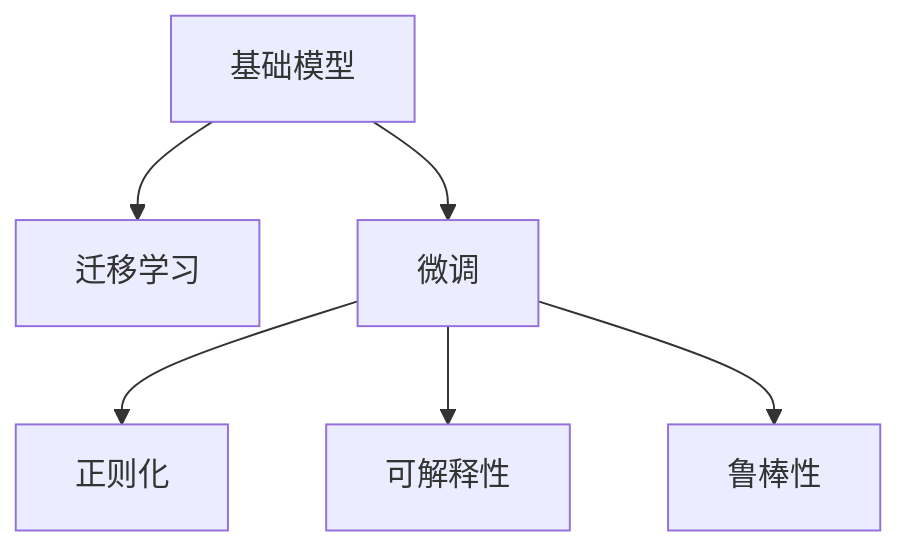

                 

## 1. 背景介绍

### 1.1 问题由来

随着深度学习技术的迅速发展，人工智能（AI）领域已经取得了显著的进步。然而，这些进步并非没有挑战，其中一个重要的挑战是如何构建基础模型（Base Models）并确保它们在实际应用中表现出色。基础模型作为许多应用中的核心组件，其设计和实施必须遵循一系列专业规范和科学精神，以确保其在各种环境中都能稳定、高效地运行。

### 1.2 问题核心关键点

基础模型的核心关键点包括但不限于：

- **泛化能力**：基础模型必须具备良好的泛化能力，能够适应不同的数据分布，避免过拟合。
- **鲁棒性**：在面对各种噪声和异常数据时，基础模型应保持稳定，不受影响。
- **可解释性**：基础模型的决策过程应尽可能透明，便于理解和调试。
- **效率**：基础模型应具有高计算效率和低资源消耗，以适应不同场景的需求。
- **可扩展性**：基础模型应支持模块化和组合，能够灵活地集成到复杂的系统中。

### 1.3 问题研究意义

研究基础模型的专业规范与科学精神，对于推动AI技术的发展和应用具有重要意义：

1. **提升性能**：通过遵循专业规范，可以显著提升基础模型的性能，使其在实际应用中表现更好。
2. **保障稳定性**：科学精神的应用可以确保基础模型在不同环境下的稳定性，避免意外的崩溃或异常行为。
3. **促进创新**：规范和科学精神的结合可以激发更多创新，推动AI技术不断进步。
4. **增强可信度**：透明的决策过程和可解释的模型可以增强用户对AI技术的信任。
5. **加速落地**：高效率和可扩展性使得基础模型更易于集成到实际应用中，加速AI技术的产业化进程。

## 2. 核心概念与联系

### 2.1 核心概念概述

为了更好地理解基础模型的专业规范与科学精神，本节将介绍几个密切相关的核心概念：

- **基础模型(Base Models)**：指在大规模数据集上进行训练的通用模型，如卷积神经网络（CNN）、递归神经网络（RNN）、变压器（Transformer）等。这些模型经过预训练后，能够适应多种任务和数据分布。

- **迁移学习(Transfer Learning)**：指将在大规模数据集上训练好的模型迁移到小数据集上进行微调，以提升模型在小规模任务上的性能。基础模型通常作为迁移学习的起点。

- **微调(Fine-Tuning)**：指在基础模型上进行特定任务的微调，通过增加少量的任务相关参数，以提升模型在该任务上的表现。微调是基础模型应用的核心方法之一。

- **正则化(Regularization)**：通过加入正则化项，如L1正则、L2正则、Dropout等，以避免过拟合，提高模型的泛化能力。

- **可解释性(Explainability)**：基础模型的决策过程应尽可能透明，便于理解和调试，避免"黑盒"模型。

- **鲁棒性(Robustness)**：基础模型应能够处理各种噪声和异常数据，保持稳定性和可靠性。

这些核心概念之间的逻辑关系可以通过以下Mermaid流程图来展示：



这个流程图展示了几类关键概念及其之间的关系：

1. 基础模型通过预训练获得基础能力。
2. 迁移学习使得通用基础模型能够适应特定任务，通过微调进一步优化。
3. 正则化技术提升模型的泛化能力，避免过拟合。
4. 可解释性确保模型决策的透明性和可理解性。
5. 鲁棒性确保模型在面对噪声和异常数据时的稳定性。

这些概念共同构成了基础模型的核心规范和科学精神，为其在实际应用中的表现提供了坚实的保障。

## 3. 核心算法原理 & 具体操作步骤

### 3.1 算法原理概述

基础模型的设计和实施必须遵循一系列专业规范和科学精神，这些规范和精神确保模型在不同场景下表现稳定、高效。其核心原理包括：

1. **泛化能力**：通过在大量数据上进行预训练，基础模型能够学习到通用的特征表示，从而在未见过的数据上表现出色。
2. **鲁棒性**：通过正则化和鲁棒性技术，基础模型能够处理各种噪声和异常数据，保持稳定性和可靠性。
3. **可解释性**：通过可解释性技术，如可视化、特征重要性分析等，基础模型的决策过程应尽可能透明，便于理解和调试。
4. **效率**：通过高效的算法和模型结构，基础模型应具有高计算效率和低资源消耗。
5. **可扩展性**：基础模型应支持模块化和组合，能够灵活地集成到复杂的系统中。

### 3.2 算法步骤详解

基础模型的设计和实施通常包括以下几个关键步骤：

**Step 1: 数据准备**
- 收集大规模标注数据集，用于模型的预训练。数据集应覆盖不同数据分布，以提升模型的泛化能力。
- 数据集应经过严格的清洗和处理，去除噪声和异常数据，确保数据质量。

**Step 2: 模型选择与设计**
- 选择适合任务的模型结构，如CNN、RNN、Transformer等。
- 设计合理的模型参数，如层数、节点数、激活函数等，以确保模型效率和性能。

**Step 3: 预训练**
- 在大量无标签数据上进行预训练，学习通用的特征表示。
- 使用正则化技术，如L1正则、L2正则、Dropout等，避免过拟合。

**Step 4: 微调**
- 选择任务相关的数据集，进行微调，增加少量的任务相关参数。
- 使用正则化和鲁棒性技术，确保模型在特定任务上的稳定性和可靠性。

**Step 5: 可解释性分析**
- 通过可视化、特征重要性分析等技术，对模型进行可解释性分析，确保模型决策的透明性和可理解性。

**Step 6: 测试与部署**
- 在测试集上评估模型性能，确保模型在实际应用中的表现。
- 将模型集成到实际应用系统中，并进行持续监测和优化。

### 3.3 算法优缺点

基础模型设计和实施的优缺点如下：

#### 优点：
1. **泛化能力强**：通过预训练，基础模型能够适应不同的数据分布，具有较强的泛化能力。
2. **可扩展性好**：基础模型支持模块化和组合，能够灵活地集成到复杂的系统中。
3. **可解释性高**：通过可解释性技术，基础模型的决策过程应尽可能透明，便于理解和调试。
4. **鲁棒性强**：基础模型通过正则化和鲁棒性技术，能够处理各种噪声和异常数据，保持稳定性和可靠性。

#### 缺点：
1. **计算资源消耗大**：预训练和微调过程需要大量的计算资源，包括高性能的GPU或TPU。
2. **模型结构复杂**：基础模型的结构较为复杂，需要丰富的经验和专业知识才能设计和实现。
3. **参数调整困难**：基础模型的参数较多，调整不当可能导致性能下降或过拟合。

### 3.4 算法应用领域

基础模型在众多领域中得到了广泛应用，包括但不限于：

- **计算机视觉**：基础模型如CNN、ResNet等在图像识别、物体检测、图像分割等任务上取得了显著成果。
- **自然语言处理**：基础模型如Transformer、BERT等在文本分类、机器翻译、语言建模等任务上表现出色。
- **语音识别**：基础模型如CNN、RNN等在语音识别、语音合成等任务上得到了广泛应用。
- **推荐系统**：基础模型如FM、NN、Transformer等在推荐系统、广告推荐等任务上取得了显著成果。
- **金融风控**：基础模型如CNN、LSTM等在信用评分、欺诈检测等任务上表现出色。

这些领域中的成功应用，充分展示了基础模型的强大能力和广泛适用性。

## 4. 数学模型和公式 & 详细讲解 & 举例说明

### 4.1 数学模型构建

本节将使用数学语言对基础模型的设计和实施进行更加严格的刻画。

设基础模型为 $M_{\theta}$，其中 $\theta$ 为模型参数。假设数据集 $D=\{(x_i, y_i)\}_{i=1}^N, x_i \in \mathcal{X}, y_i \in \mathcal{Y}$。定义损失函数 $\ell$ 为：

$$
\ell(M_{\theta}(x),y) = \mathcal{L}(y, M_{\theta}(x))
$$

其中 $\mathcal{L}$ 为具体任务的损失函数，如交叉熵损失、均方误差损失等。

### 4.2 公式推导过程

以二分类任务为例，推导交叉熵损失函数及其梯度的计算公式。

假设模型 $M_{\theta}$ 在输入 $x$ 上的输出为 $\hat{y}=M_{\theta}(x) \in [0,1]$，表示样本属于正类的概率。真实标签 $y \in \{0,1\}$。则二分类交叉熵损失函数定义为：

$$
\ell(M_{\theta}(x),y) = -[y\log \hat{y} + (1-y)\log (1-\hat{y})]
$$

将其代入经验风险公式，得：

$$
\mathcal{L}(\theta) = -\frac{1}{N}\sum_{i=1}^N [y_i\log M_{\theta}(x_i)+(1-y_i)\log(1-M_{\theta}(x_i))]
$$

根据链式法则，损失函数对参数 $\theta_k$ 的梯度为：

$$
\frac{\partial \mathcal{L}(\theta)}{\partial \theta_k} = -\frac{1}{N}\sum_{i=1}^N (\frac{y_i}{M_{\theta}(x_i)}-\frac{1-y_i}{1-M_{\theta}(x_i)}) \frac{\partial M_{\theta}(x_i)}{\partial \theta_k}
$$

其中 $\frac{\partial M_{\theta}(x_i)}{\partial \theta_k}$ 可进一步递归展开，利用自动微分技术完成计算。

在得到损失函数的梯度后，即可带入参数更新公式，完成模型的迭代优化。重复上述过程直至收敛，最终得到适应下游任务的最优模型参数 $\theta^*$。

## 5. 项目实践：代码实例和详细解释说明

### 5.1 开发环境搭建

在进行基础模型设计和实施之前，我们需要准备好开发环境。以下是使用Python进行TensorFlow开发的环境配置流程：

1. 安装Anaconda：从官网下载并安装Anaconda，用于创建独立的Python环境。

2. 创建并激活虚拟环境：
```bash
conda create -n tf-env python=3.8 
conda activate tf-env
```

3. 安装TensorFlow：根据CUDA版本，从官网获取对应的安装命令。例如：
```bash
conda install tensorflow -c pytorch -c conda-forge
```

4. 安装TensorFlow扩展库：
```bash
pip install tensorflow-estimator tensorflow-hub tensorflow-models-official
```

5. 安装各类工具包：
```bash
pip install numpy pandas scikit-learn matplotlib tqdm jupyter notebook ipython
```

完成上述步骤后，即可在`tf-env`环境中开始基础模型设计和实施。

### 5.2 源代码详细实现

下面我们以卷积神经网络（CNN）在图像识别任务中的应用为例，给出使用TensorFlow进行基础模型设计和实施的代码实现。

首先，定义CNN模型的结构：

```python
import tensorflow as tf

def cnn_model(input_shape):
    inputs = tf.keras.layers.Input(shape=input_shape)
    x = tf.keras.layers.Conv2D(32, (3, 3), activation='relu')(inputs)
    x = tf.keras.layers.MaxPooling2D((2, 2))(x)
    x = tf.keras.layers.Conv2D(64, (3, 3), activation='relu')(x)
    x = tf.keras.layers.MaxPooling2D((2, 2))(x)
    x = tf.keras.layers.Conv2D(128, (3, 3), activation='relu')(x)
    x = tf.keras.layers.MaxPooling2D((2, 2))(x)
    x = tf.keras.layers.Flatten()(x)
    x = tf.keras.layers.Dense(128, activation='relu')(x)
    outputs = tf.keras.layers.Dense(10, activation='softmax')(x)
    model = tf.keras.Model(inputs=inputs, outputs=outputs)
    return model
```

然后，定义训练和评估函数：

```python
from sklearn.model_selection import train_test_split
from sklearn.metrics import accuracy_score

def train_model(model, train_data, train_labels, epochs=10):
    model.compile(optimizer='adam', loss='sparse_categorical_crossentropy', metrics=['accuracy'])
    model.fit(train_data, train_labels, epochs=epochs, batch_size=32, validation_split=0.2)
    return model

def evaluate_model(model, test_data, test_labels):
    predictions = model.predict(test_data)
    accuracy = accuracy_score(test_labels, np.argmax(predictions, axis=1))
    return accuracy
```

接着，加载数据并进行训练和评估：

```python
import numpy as np
from tensorflow.keras.datasets import cifar10
from tensorflow.keras.preprocessing.image import ImageDataGenerator

(x_train, y_train), (x_test, y_test) = cifar10.load_data()
x_train = x_train / 255.0
x_test = x_test / 255.0

train_data = ImageDataGenerator(rescale=1./255).flow(x_train, y_train, batch_size=32)
test_data = ImageDataGenerator(rescale=1./255).flow(x_test, y_test, batch_size=32)

model = cnn_model(input_shape=(32, 32, 3))
trained_model = train_model(model, train_data, train_labels=y_train)

accuracy = evaluate_model(trained_model, test_data, test_labels=y_test)
print(f"Accuracy: {accuracy}")
```

以上就是使用TensorFlow进行CNN模型设计和实施的完整代码实现。可以看到，TensorFlow提供了丰富的工具和接口，使得模型的设计和实施变得非常简单高效。

### 5.3 代码解读与分析

让我们再详细解读一下关键代码的实现细节：

**cnn_model函数**：
- 定义CNN模型的结构，包括卷积层、池化层、全连接层等。
- 使用`tf.keras.Model`将模型封装成Keras模型对象，方便后续训练和评估。

**train_model函数**：
- 编译模型，选择优化器、损失函数和评估指标。
- 使用`model.fit`方法进行模型训练，设置训练轮数和批次大小。
- 在验证集上进行评估，返回训练后的模型。

**evaluate_model函数**：
- 在测试集上进行预测，计算模型准确率。

**训练和评估流程**：
- 加载CIFAR-10数据集，将像素值归一化到[0, 1]之间。
- 使用`ImageDataGenerator`进行数据增强和预处理。
- 构建CNN模型，训练模型，并在测试集上评估模型性能。

可以看到，TensorFlow提供了全面的工具和接口，使得基础模型的设计和实施变得非常简单高效。开发者可以将更多精力放在数据处理、模型优化等高层逻辑上，而不必过多关注底层的实现细节。

当然，工业级的系统实现还需考虑更多因素，如模型的保存和部署、超参数的自动搜索、更灵活的训练和评估方式等。但核心的基础模型设计和实施流程基本与此类似。

## 6. 实际应用场景

### 6.1 计算机视觉

基础模型在计算机视觉领域得到了广泛应用。例如，CNN在图像识别、物体检测、图像分割等任务上取得了显著成果。通过预训练和微调，基础模型能够适应特定的计算机视觉应用，提供高效、准确的视觉信息处理能力。

### 6.2 自然语言处理

基础模型在自然语言处理领域也有重要应用。例如，Transformer、BERT等基础模型在文本分类、机器翻译、语言建模等任务上表现出色。通过预训练和微调，基础模型能够适应特定的自然语言处理任务，提供高效、准确的文本信息处理能力。

### 6.3 推荐系统

基础模型在推荐系统中也有重要应用。例如，FM、NN、Transformer等基础模型在推荐系统、广告推荐等任务上取得了显著成果。通过预训练和微调，基础模型能够适应特定的推荐场景，提供高效、准确的推荐服务。

### 6.4 未来应用展望

随着基础模型的不断发展和优化，其在各个领域的应用前景将更加广阔。

1. **多模态融合**：基础模型可以融合视觉、语音、文本等多种模态的信息，提供更加全面、准确的信息处理能力。
2. **智能决策**：基础模型可以结合知识图谱、逻辑规则等外部知识，提供更加智能、可解释的决策支持。
3. **实时处理**：通过优化模型结构和算法，基础模型可以支持实时处理，满足高实时性应用的需求。
4. **跨领域迁移**：基础模型可以通过迁移学习，在不同领域和任务之间进行知识迁移，提升模型泛化能力。
5. **自监督学习**：基础模型可以利用自监督学习方法，如预训练-微调范式，进一步提升模型的泛化能力和稳定性。

## 7. 工具和资源推荐

### 7.1 学习资源推荐

为了帮助开发者系统掌握基础模型的设计和实施，这里推荐一些优质的学习资源：

1. **《深度学习》（Deep Learning）**：Ian Goodfellow等人所著的经典教材，深入浅出地介绍了深度学习的基础理论和实践方法，是学习基础模型的重要参考资料。
2. **《TensorFlow实战Google深度学习框架》**：O'Reilly出版社出版的TensorFlow实战指南，详细介绍了TensorFlow的使用方法和最佳实践，适合TensorFlow初学者。
3. **《TensorFlow高级编程》**：Google官方出版的TensorFlow高级编程指南，介绍了TensorFlow的高级特性和优化技巧，适合有一定基础的学习者。
4. **《计算机视觉：算法与应用》（Computer Vision: Algorithms and Applications）**：Richard Szeliski所著的经典教材，详细介绍了计算机视觉的基础理论和应用方法，是学习计算机视觉的重要参考资料。
5. **《自然语言处理综论》（Speech and Language Processing）**：Daniel Jurafsky和James H. Martin所著的NLP经典教材，涵盖了NLP的各个方面，是学习NLP的基础和参考。

通过对这些资源的学习实践，相信你一定能够系统掌握基础模型的设计和实施，并用于解决实际的计算机视觉、自然语言处理等问题。

### 7.2 开发工具推荐

高效的基础模型设计和实施离不开优秀的工具支持。以下是几款用于基础模型设计和实施的常用工具：

1. **TensorFlow**：Google开源的深度学习框架，支持分布式计算、模型优化、自动化调参等功能，是进行基础模型设计和实施的主流工具之一。
2. **PyTorch**：Facebook开源的深度学习框架，以动态计算图著称，支持高效的模型设计和实验。
3. **Keras**：Google开源的深度学习框架，提供了简单易用的API，适合快速原型设计和实验。
4. **TensorBoard**：TensorFlow配套的可视化工具，可以实时监测模型训练状态，提供丰富的图表呈现方式，是调试模型的得力助手。
5. **Weights & Biases**：模型训练的实验跟踪工具，可以记录和可视化模型训练过程中的各项指标，方便对比和调优。

合理利用这些工具，可以显著提升基础模型的设计和实施效率，加快创新迭代的步伐。

### 7.3 相关论文推荐

基础模型的设计和实施得益于学界的持续研究。以下是几篇奠基性的相关论文，推荐阅读：

1. **《ImageNet Classification with Deep Convolutional Neural Networks》**：Alex Krizhevsky等人所著的图像分类经典论文，提出CNN模型在图像分类任务上的应用，推动了计算机视觉的发展。
2. **《DenseNet》**：Gao Huang等人所著的深度网络经典论文，提出DenseNet模型结构，提升了网络模型表达能力和泛化能力。
3. **《Attention is All You Need》**：Ashish Vaswani等人所著的Transformer论文，提出Transformer模型结构，推动了自然语言处理的发展。
4. **《BERT: Pre-training of Deep Bidirectional Transformers for Language Understanding》**：Jacob Devlin等人所著的BERT论文，提出BERT模型在自然语言处理任务上的应用，提升了模型的泛化能力和效果。

这些论文代表了大模型设计和实施的发展脉络。通过学习这些前沿成果，可以帮助研究者把握学科前进方向，激发更多的创新灵感。

## 8. 总结：未来发展趋势与挑战

### 8.1 研究成果总结

本文对基础模型的设计和实施进行了全面系统的介绍。首先阐述了基础模型在各领域中的应用，明确了基础模型的重要性。其次，从原理到实践，详细讲解了基础模型的设计和实施过程，给出了TensorFlow实现的完整代码实例。同时，本文还广泛探讨了基础模型在计算机视觉、自然语言处理、推荐系统等诸多领域的应用前景，展示了基础模型的强大能力和广泛适用性。此外，本文精选了基础模型的各类学习资源，力求为读者提供全方位的技术指引。

### 8.2 未来发展趋势

展望未来，基础模型的设计和实施将呈现以下几个发展趋势：

1. **多模态融合**：基础模型将融合视觉、语音、文本等多种模态的信息，提供更加全面、准确的信息处理能力。
2. **智能决策**：基础模型将结合知识图谱、逻辑规则等外部知识，提供更加智能、可解释的决策支持。
3. **实时处理**：通过优化模型结构和算法，基础模型将支持实时处理，满足高实时性应用的需求。
4. **跨领域迁移**：基础模型将通过迁移学习，在不同领域和任务之间进行知识迁移，提升模型泛化能力。
5. **自监督学习**：基础模型将利用自监督学习方法，如预训练-微调范式，进一步提升模型的泛化能力和稳定性。

### 8.3 面临的挑战

尽管基础模型的设计和实施已经取得了显著成果，但在迈向更加智能化、普适化应用的过程中，仍然面临诸多挑战：

1. **计算资源消耗大**：预训练和微调过程需要大量的计算资源，包括高性能的GPU或TPU。
2. **模型结构复杂**：基础模型的结构较为复杂，需要丰富的经验和专业知识才能设计和实现。
3. **参数调整困难**：基础模型的参数较多，调整不当可能导致性能下降或过拟合。
4. **模型可解释性不足**：基础模型的决策过程往往缺乏可解释性，难以对其推理逻辑进行分析和调试。
5. **鲁棒性不足**：基础模型面对噪声和异常数据时，泛化性能往往大打折扣。

### 8.4 研究展望

面对基础模型设计和实施所面临的挑战，未来的研究需要在以下几个方面寻求新的突破：

1. **优化模型结构**：通过模块化和组合，设计更加高效、可扩展的基础模型。
2. **提升模型可解释性**：通过可视化、特征重要性分析等技术，提高基础模型决策过程的透明性和可理解性。
3. **增强模型鲁棒性**：通过鲁棒性技术，提高基础模型在噪声和异常数据下的泛化能力。
4. **融合多模态信息**：通过融合视觉、语音、文本等多种模态的信息，提供更加全面、准确的信息处理能力。
5. **结合知识图谱**：将符号化的先验知识，如知识图谱、逻辑规则等，与基础模型进行融合，提升模型的泛化能力和效果。

这些研究方向的探索，必将引领基础模型设计和实施技术迈向更高的台阶，为构建智能系统提供坚实的技术保障。相信随着学界和产业界的共同努力，基础模型必将在构建智能系统、推动AI技术发展中发挥更大的作用。

## 9. 附录：常见问题与解答

**Q1：基础模型的设计原则是什么？**

A: 基础模型的设计原则包括但不限于以下几点：
1. **泛化能力**：通过在大规模数据集上进行预训练，基础模型应具备良好的泛化能力，能够适应不同的数据分布。
2. **鲁棒性**：通过正则化和鲁棒性技术，基础模型应能够处理各种噪声和异常数据，保持稳定性和可靠性。
3. **可解释性**：基础模型的决策过程应尽可能透明，便于理解和调试。
4. **效率**：基础模型应具有高计算效率和低资源消耗。
5. **可扩展性**：基础模型应支持模块化和组合，能够灵活地集成到复杂的系统中。

**Q2：如何优化基础模型的计算资源消耗？**

A: 优化基础模型的计算资源消耗，可以考虑以下几点：
1. **模型裁剪**：去除不必要的层和参数，减小模型尺寸，加快推理速度。
2. **量化加速**：将浮点模型转为定点模型，压缩存储空间，提高计算效率。
3. **混合精度训练**：使用混合精度训练，减少计算量和存储空间消耗。
4. **模型并行**：通过模型并行，提高计算效率，减少单卡计算压力。

**Q3：如何提高基础模型的可解释性？**

A: 提高基础模型的可解释性，可以考虑以下几点：
1. **可视化**：使用可视化技术，如特征重要性分析、激活图等，展示模型的决策过程。
2. **解释模型**：使用解释模型，如LIME、SHAP等，分析模型在特定样本上的决策过程。
3. **公平性分析**：分析模型在特定群体上的表现，确保模型决策的公平性。

**Q4：如何增强基础模型的鲁棒性？**

A: 增强基础模型的鲁棒性，可以考虑以下几点：
1. **正则化**：通过L1正则、L2正则、Dropout等技术，避免过拟合，提高模型的泛化能力。
2. **对抗训练**：引入对抗样本，提高模型在对抗攻击下的鲁棒性。
3. **数据增强**：通过数据增强技术，扩充训练集，提升模型的泛化能力。

**Q5：如何结合知识图谱提高基础模型的效果？**

A: 结合知识图谱提高基础模型的效果，可以考虑以下几点：
1. **预训练知识图谱**：将知识图谱嵌入到基础模型中，提升模型在知识推理任务上的表现。
2. **逻辑规则融合**：将逻辑规则与基础模型结合，提升模型在决策支持任务上的效果。
3. **符号化先验知识**：将符号化的先验知识，如知识图谱、逻辑规则等，与基础模型进行融合，提升模型的泛化能力和效果。

这些问题的解答，希望对你在基础模型设计和实施过程中有所帮助。相信通过对这些问题的深入思考和实践，你将能够更好地掌握基础模型的设计和实施，推动AI技术的发展和应用。

---

作者：禅与计算机程序设计艺术 / Zen and the Art of Computer Programming

