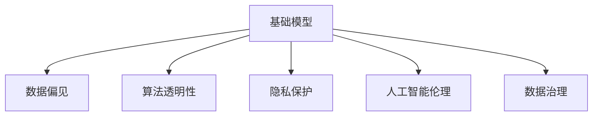

                 

# 基础模型的伦理与法律影响

> 关键词：人工智能伦理,机器学习公平性,隐私保护,算法透明性,数据偏见,人工智能法律,数据治理

## 1. 背景介绍

在人工智能(AI)和机器学习(ML)技术飞速发展的当下，基础模型（如深度神经网络）的应用已经渗透到医疗、金融、教育、司法等诸多领域。随着模型能力的不断提升，其伦理和法律影响日益凸显，引起了广泛的社会关注和讨论。

一方面，基础模型帮助提升了工作效率，提高了决策的精准度，促进了技术进步和产业升级；另一方面，模型可能引发的数据隐私泄露、算法偏见等问题，又给社会带来了新的挑战。本文旨在从伦理和法律角度出发，探讨基础模型对各个领域的影响，并提出相应的应对策略。

## 2. 核心概念与联系

### 2.1 核心概念概述

为更好地理解基础模型对伦理和法律的影响，本节将介绍几个关键概念：

- 基础模型：以深度神经网络为代表的机器学习模型，具备强大的数据处理和预测能力。
- 数据偏见：数据集中存在的偏差或不平衡特征，可能导致模型学习到歧视性、不公平的决策规则。
- 算法透明性：指模型的决策过程是否可被解释、理解和审查。
- 隐私保护：保障个人数据不被滥用，确保数据处理过程中的保密性。
- 人工智能伦理：涉及AI技术开发和应用中应遵循的道德规范和社会价值。
- 数据治理：数据管理的综合概念，涵盖数据收集、存储、使用、共享等环节。

这些概念之间的逻辑关系可以通过以下Mermaid流程图来展示：



这个流程图展示了基础模型与其他核心概念之间的联系：

1. 基础模型通过学习数据中的模式和规律，形成预测和决策能力。
2. 数据偏见可能存在于训练数据中，影响模型的公平性和公正性。
3. 算法的透明性要求模型能够被审查和解释，避免其决策过程过于神秘。
4. 隐私保护是数据治理的核心内容之一，保障数据在处理和使用过程中的安全性和合规性。
5. 人工智能伦理是指导模型开发和应用的道德规范，确保模型行为的合理性和有益性。
6. 数据治理是保障模型安全、合规、透明的基础，涵盖数据的生命周期管理。

这些概念共同构成了基础模型应用的伦理和法律框架，帮助我们理解其潜在的风险和挑战。

## 3. 核心算法原理 & 具体操作步骤
### 3.1 算法原理概述

基础模型的伦理和法律影响主要体现在数据处理、算法决策和模型应用三个环节。以下是这些环节的算法原理概述：

- **数据处理环节**：模型通过学习输入数据中的特征和模式，生成预测结果。数据偏见可能存在于训练数据中，影响模型输出的公平性。
- **算法决策环节**：模型的决策过程可能过于复杂，难以解释和审查，导致算法透明性不足。
- **模型应用环节**：模型的输出结果可能涉及个人隐私、社会安全等敏感信息，需要遵循相应的法律法规。

### 3.2 算法步骤详解

#### 3.2.1 数据处理环节
基础模型通常使用监督学习、无监督学习或半监督学习等方法，通过大量标注数据进行训练。数据偏见可能源于以下几个方面：
1. **数据采集偏差**：数据采集过程中可能存在抽样偏差，如性别、年龄、地域等特征的采样不均衡。
2. **标签偏差**：标签标注不准确或不一致，可能反映社会偏见，导致模型学习到歧视性规则。
3. **特征选择偏差**：特征选择过程中可能忽视某些关键变量，导致模型无法充分捕捉数据特征。

针对数据偏见，常用的处理策略包括：
1. **数据清洗**：识别和剔除数据中的异常值和噪声，确保数据质量。
2. **数据增强**：通过数据扩充和重采样，减少数据偏见的影响。
3. **公平性约束**：在模型训练中引入公平性指标，如Demographic Parity、Equalized Odds等，约束模型输出。

#### 3.2.2 算法决策环节
基础模型的决策过程通常是一个黑盒，难以解释和审查。如何提升算法透明性，使其决策过程可审查、可解释，成为伦理和法律关注的重点：
1. **模型可解释性**：通过特征重要性分析、模型可视化等方法，揭示模型内部决策逻辑。
2. **算法可审查性**：建立模型审查机制，定期对模型进行审计和评估，确保其行为符合伦理规范。
3. **用户参与**：引入用户反馈机制，允许用户对模型的输出结果进行解释和质疑。

#### 3.2.3 模型应用环节
基础模型在实际应用中，可能涉及个人隐私、社会公平等敏感问题。如何确保模型应用的合法合规性，需要考虑以下几个方面：
1. **隐私保护**：采用数据匿名化、加密存储等技术，确保数据在处理过程中的安全性。
2. **合规审查**：遵循各国数据保护法规，如GDPR、CCPA等，确保模型使用的合规性。
3. **社会责任**：模型应用应符合社会伦理和价值观，避免对弱势群体造成不公平的待遇。

### 3.3 算法优缺点

基础模型的伦理和法律影响主要体现在以下几个方面：

**优点**：
1. **高效性**：基础模型具备强大的数据处理和预测能力，能够快速生成精确的决策。
2. **自动化**：模型可以自动化处理大量数据，减轻人工工作负担。
3. **一致性**：模型输出结果具有较高的一致性和稳定性，减少了人为干扰。

**缺点**：
1. **数据偏见**：模型可能学习到数据中的偏差，导致输出结果存在歧视性或偏见。
2. **算法透明性不足**：模型决策过程难以解释和审查，难以确保其公正性和可信度。
3. **隐私风险**：模型处理大量个人数据，可能引发隐私泄露和滥用。
4. **法律合规风险**：模型应用可能涉及多国法律，需遵循不同国家的法律法规。

尽管存在这些局限性，基础模型在许多领域仍具有重要的应用价值。未来相关研究的方向在于如何更好地平衡效率与伦理，确保模型应用的合法合规性。

### 3.4 算法应用领域

基础模型在多个领域的应用已经显现出显著的伦理和法律影响：

- **医疗健康**：基础模型在疾病诊断、医疗影像分析、个性化治疗方案推荐等方面发挥了重要作用，但也引发了数据隐私、算法偏见等问题。
- **金融服务**：模型在信用评估、风险控制、智能投顾等方面提高了效率，但可能引发隐私泄露、算法歧视等问题。
- **教育领域**：模型在智能推荐、学习路径规划、个性化评估等方面提升了教育质量，但也涉及学生隐私和公平性问题。
- **司法系统**：模型在证据筛选、案件预测、智能辅助裁判等方面增强了司法公正性，但也存在算法透明度和数据隐私问题。
- **公共安全**：模型在人脸识别、行为分析、事件监测等方面提高了社会治理能力，但也带来了技术滥用和隐私侵害的风险。

此外，基础模型还在智慧城市、智能交通、环境保护等众多领域得到了广泛应用，带来深远影响。

## 4. 数学模型和公式 & 详细讲解  
### 4.1 数学模型构建

基础模型的伦理和法律影响可以通过数学模型来进一步分析。以线性回归模型为例，我们定义模型为：

$$ y = \mathbf{W} \mathbf{x} + b $$

其中 $\mathbf{x}$ 为输入特征向量，$\mathbf{W}$ 为模型参数，$b$ 为偏置项。模型通过最小化损失函数 $\mathcal{L}(\mathbf{W}, b)$ 进行训练，常见损失函数包括均方误差（MSE）、交叉熵（CE）等。

### 4.2 公式推导过程

以均方误差损失函数为例，其推导过程如下：

$$ \mathcal{L}(\mathbf{W}, b) = \frac{1}{N} \sum_{i=1}^N (y_i - \mathbf{W} \mathbf{x}_i - b)^2 $$

其中 $y_i$ 为真实标签，$\mathbf{x}_i$ 为输入特征。模型的目标是最小化损失函数 $\mathcal{L}(\mathbf{W}, b)$，通过梯度下降等优化算法更新参数 $\mathbf{W}$ 和 $b$。

### 4.3 案例分析与讲解

以一个简单的信用评分模型为例，假设模型输入特征包括收入、年龄、性别、种族等，真实标签为是否违约。模型输出为二分类标签，决策边界为 $\mathbf{W} \mathbf{x} + b = 0$。如果模型在训练数据中学习到性别、种族等特征的偏差，可能导致算法歧视，即模型对不同性别、种族的个体做出不公正的评分。

## 5. 项目实践：代码实例和详细解释说明
### 5.1 开发环境搭建

在进行基础模型伦理和法律影响分析时，需要搭建一个Python开发环境，方便进行模型训练和评估。以下是Python环境的搭建步骤：

1. 安装Python：从官网下载并安装Python 3.x版本。
2. 安装相关库：使用pip命令安装必要的Python库，如NumPy、Pandas、Scikit-Learn等。
3. 搭建虚拟环境：使用虚拟环境管理器（如virtualenv）创建虚拟环境，隔离依赖关系。
4. 安装TensorFlow或PyTorch：根据需求安装TensorFlow或PyTorch，配置GPU支持。

### 5.2 源代码详细实现

以下是一个简单的线性回归模型示例，展示了如何训练和评估模型：

```python
import numpy as np
from sklearn.linear_model import LinearRegression
from sklearn.metrics import mean_squared_error

# 创建训练数据
X_train = np.array([[1, 2], [3, 4], [5, 6]])
y_train = np.array([2, 4, 6])

# 创建测试数据
X_test = np.array([[7, 8], [9, 10]])
y_test = np.array([8, 10])

# 创建线性回归模型
model = LinearRegression()

# 训练模型
model.fit(X_train, y_train)

# 评估模型
y_pred = model.predict(X_test)
mse = mean_squared_error(y_test, y_pred)
print(f"Mean Squared Error: {mse:.2f}")
```

### 5.3 代码解读与分析

**数据创建**：使用NumPy创建训练数据集和测试数据集。

**模型创建**：使用Scikit-Learn的LinearRegression模型创建线性回归模型。

**模型训练**：使用fit方法训练模型，将训练数据作为输入，真实标签作为输出。

**模型评估**：使用预测结果计算均方误差，评估模型性能。

## 6. 实际应用场景
### 6.1 医疗健康

基础模型在医疗健康领域的应用已经广泛展开，如疾病诊断、医学影像分析、个性化治疗方案推荐等。但由于医疗数据的敏感性，其伦理和法律问题尤为突出：

- **数据隐私**：医疗数据包含大量个人隐私信息，需严格保护，防止数据泄露。
- **算法公平性**：模型可能学习到医疗数据中的偏见，导致对某些群体的误诊或歧视。
- **法律合规**：医疗数据涉及多国法律，需遵循各国数据保护法规，如HIPAA、GDPR等。

### 6.2 金融服务

基础模型在金融服务领域的应用包括信用评估、风险控制、智能投顾等。然而，金融数据的敏感性和复杂性，带来了诸多伦理和法律挑战：

- **隐私保护**：金融数据涉及用户资产和交易记录，需采用数据加密、匿名化等技术保护隐私。
- **算法透明性**：模型的风险评估过程可能过于复杂，难以解释和审查，影响用户信任。
- **法律合规**：金融数据需遵循《巴塞尔协议》、《个人信息保护法》等法律法规，确保合规使用。

### 6.3 教育领域

基础模型在教育领域的应用涉及智能推荐、学习路径规划、个性化评估等方面。但模型的伦理和法律问题也不容忽视：

- **学生隐私**：学生数据涉及个人隐私，需严格保护，防止滥用。
- **算法公平性**：模型可能学习到数据中的偏见，导致对某些群体的不公平待遇。
- **法律合规**：教育数据涉及多国法律，需遵循各国教育法规，如《儿童在线隐私保护法》等。

### 6.4 司法系统

基础模型在司法系统中的应用包括案件预测、智能辅助裁判等。但其伦理和法律问题也较为复杂：

- **算法透明性**：司法判决过程需透明，确保公正性。
- **数据隐私**：司法数据涉及案件细节和个人隐私，需严格保护。
- **法律合规**：司法数据需遵循各国法律，如《电子证据法》、《数据保护法》等。

## 7. 工具和资源推荐
### 7.1 学习资源推荐

为帮助开发者系统掌握基础模型伦理和法律影响的知识，这里推荐一些优质的学习资源：

1. **《人工智能伦理与法律》**：介绍AI技术开发和应用中应遵循的道德规范和社会价值。
2. **《数据隐私保护技术》**：详细讲解数据保护技术，如数据匿名化、加密存储等。
3. **《机器学习公平性》**：探讨机器学习中的公平性问题，如数据偏见、算法歧视等。
4. **《人工智能法律基础》**：介绍各国AI相关法律法规，如GDPR、CCPA等。
5. **《数据治理实践》**：涵盖数据收集、存储、使用、共享等环节的详细指南。

通过对这些资源的学习实践，相信你一定能够全面掌握基础模型伦理和法律影响的知识，并将其应用于实际应用场景中。

### 7.2 开发工具推荐

高效的开发离不开优秀的工具支持。以下是几款用于基础模型伦理和法律影响分析的工具：

1. **TensorFlow**：由Google主导开发的深度学习框架，支持GPU/TPU计算，适合大规模模型训练和推理。
2. **PyTorch**：由Facebook开发的深度学习框架，灵活性高，易于调试和优化。
3. **Jupyter Notebook**：开源的交互式笔记本环境，方便进行模型训练和分析。
4. **WEKA**：开源的数据挖掘工具，提供丰富的机器学习算法和可视化功能。
5. **EthicsAI**：专为AI伦理和法律问题设计的开源工具，支持模型审查和合规性评估。

合理利用这些工具，可以显著提升基础模型伦理和法律影响分析的效率，加速创新迭代的步伐。

### 7.3 相关论文推荐

基础模型伦理和法律影响的研究源于学界的持续研究。以下是几篇奠基性的相关论文，推荐阅读：

1. **《人工智能伦理的理论与实践》**：探讨AI技术开发和应用中的伦理问题。
2. **《机器学习公平性研究综述》**：详细分析机器学习中的公平性问题。
3. **《数据隐私保护技术综述》**：系统介绍数据隐私保护技术，如数据匿名化、加密存储等。
4. **《人工智能法律问题》**：介绍各国AI相关法律法规，如GDPR、CCPA等。
5. **《数据治理框架》**：提出数据治理的全面解决方案，涵盖数据管理全生命周期。

这些论文代表了大模型伦理和法律影响的发展脉络。通过学习这些前沿成果，可以帮助研究者把握学科前进方向，激发更多的创新灵感。

## 8. 总结：未来发展趋势与挑战
### 8.1 总结

本文对基础模型的伦理和法律影响进行了全面系统的介绍。首先阐述了基础模型的定义和关键特征，明确了其伦理和法律影响的研究背景和意义。其次，从伦理和法律角度出发，详细讲解了基础模型在数据处理、算法决策和模型应用三个环节的潜在风险和挑战，并给出了相应的应对策略。最后，总结了基础模型在医疗、金融、教育、司法等多个领域的应用前景，并展望了未来的研究方向。

通过本文的系统梳理，我们可以看到，基础模型在提升效率、增强决策准确性等方面具有重要价值，但其伦理和法律问题也值得我们高度关注。只有在技术创新与伦理规范之间找到平衡，才能确保基础模型的健康发展，为人类社会带来更多福祉。

### 8.2 未来发展趋势

展望未来，基础模型的伦理和法律影响将呈现以下几个发展趋势：

1. **伦理规范的完善**：随着基础模型应用的不断扩展，伦理规范将进一步细化和完善，形成系统性的指导框架。
2. **法律法规的全球统一**：国际社会将加强合作，推动AI相关法律法规的全球统一，确保基础模型在全球范围内的合规性。
3. **技术手段的进步**：数据隐私保护、算法透明性等技术手段将不断进步，保障基础模型的伦理和法律合规性。
4. **社会认知的提升**：公众对基础模型伦理和法律问题的认知将进一步提升，促进相关技术和应用的规范发展。
5. **多方合作机制的建立**：学术界、产业界、政府等各方将加强合作，共同推动基础模型伦理和法律问题的解决。

这些趋势将推动基础模型伦理和法律影响的研究和应用，为AI技术的健康发展提供坚实的基础。

### 8.3 面临的挑战

尽管基础模型伦理和法律影响的研究取得了一定的进展，但在迈向更加智能化、普适化应用的过程中，仍然面临诸多挑战：

1. **数据偏见**：基础模型可能学习到数据中的偏见，导致输出结果存在歧视性。如何在模型训练中引入公平性约束，确保算法的公正性，还需进一步研究。
2. **算法透明性**：基础模型的决策过程可能过于复杂，难以解释和审查。如何提升算法透明性，使其决策过程可审查、可解释，仍需更多实践和理论的积累。
3. **隐私保护**：基础模型处理大量个人数据，可能引发隐私泄露和滥用。如何在确保隐私保护的前提下，最大化数据利用价值，仍需进一步探索。
4. **法律合规**：基础模型涉及多国法律，遵循各国法律法规的复杂性和困难性，还需进一步研究。
5. **社会认知**：公众对基础模型的认知和理解仍存在不足，可能引发社会对技术的不信任和质疑。如何提升社会认知，确保基础模型技术的健康发展，还需进一步普及和宣传。

### 8.4 研究展望

面对基础模型伦理和法律面临的挑战，未来的研究需要在以下几个方面寻求新的突破：

1. **公平性约束的研究**：引入更多公平性约束机制，确保模型在多维度上不产生偏见，保障算法的公正性。
2. **算法透明性的提升**：开发更加透明、可解释的算法，使用户能够理解和信任模型的决策过程。
3. **隐私保护的创新**：开发更为高效、安全的数据保护技术，确保数据在处理和使用过程中的安全性。
4. **法律合规的研究**：建立多国协同的法律法规体系，确保基础模型在不同法律环境下都能合规应用。
5. **社会认知的提升**：加强公众教育和宣传，提升社会对基础模型技术的认知和理解，促进其广泛应用。

这些研究方向的探索，必将引领基础模型伦理和法律影响的研究和应用，为构建安全、可靠、可解释、可控的智能系统铺平道路。面向未来，基础模型伦理和法律影响的研究需要更多学界和产业界的共同努力，方能确保其在各个领域的健康发展。

## 9. 附录：常见问题与解答

**Q1：基础模型在医疗领域有哪些伦理和法律问题？**

A: 基础模型在医疗领域的应用可能引发以下伦理和法律问题：
1. **数据隐私**：医疗数据涉及个人隐私，需严格保护，防止数据泄露。
2. **算法偏见**：模型可能学习到医疗数据中的偏见，导致对某些群体的误诊或歧视。
3. **法律合规**：医疗数据涉及多国法律，需遵循各国数据保护法规，如HIPAA、GDPR等。

**Q2：如何在基础模型训练中引入公平性约束？**

A: 引入公平性约束是确保基础模型公正性的重要手段，具体方法包括：
1. **数据清洗**：识别和剔除数据中的异常值和噪声，确保数据质量。
2. **数据增强**：通过数据扩充和重采样，减少数据偏见的影响。
3. **公平性指标**：在模型训练中引入公平性指标，如Demographic Parity、Equalized Odds等，约束模型输出。

**Q3：基础模型在金融领域面临哪些隐私风险？**

A: 基础模型在金融领域可能引发以下隐私风险：
1. **数据泄露**：金融数据涉及用户资产和交易记录，需采用数据加密、匿名化等技术保护隐私。
2. **数据滥用**：金融机构可能滥用客户数据，用于不正当目的。

**Q4：如何提升基础模型的算法透明性？**

A: 提升基础模型的算法透明性，可以从以下几个方面入手：
1. **模型可解释性**：通过特征重要性分析、模型可视化等方法，揭示模型内部决策逻辑。
2. **算法可审查性**：建立模型审查机制，定期对模型进行审计和评估，确保其行为符合伦理规范。
3. **用户参与**：引入用户反馈机制，允许用户对模型的输出结果进行解释和质疑。

**Q5：基础模型在教育领域可能引发哪些法律问题？**

A: 基础模型在教育领域可能引发以下法律问题：
1. **学生隐私**：学生数据涉及个人隐私，需严格保护，防止滥用。
2. **算法公平性**：模型可能学习到数据中的偏见，导致对某些群体的不公平待遇。
3. **法律合规**：教育数据涉及多国法律，需遵循各国教育法规，如《儿童在线隐私保护法》等。

**Q6：如何确保基础模型在司法领域的应用合规性？**

A: 确保基础模型在司法领域的应用合规性，需考虑以下因素：
1. **算法透明性**：司法判决过程需透明，确保公正性。
2. **数据隐私**：司法数据涉及案件细节和个人隐私，需严格保护。
3. **法律合规**：司法数据需遵循各国法律，如《电子证据法》、《数据保护法》等。

通过这些问题的解答，相信你能够更深入地理解基础模型在各领域的伦理和法律影响，并采取相应的措施确保其安全、合规地应用。

---

作者：禅与计算机程序设计艺术 / Zen and the Art of Computer Programming

