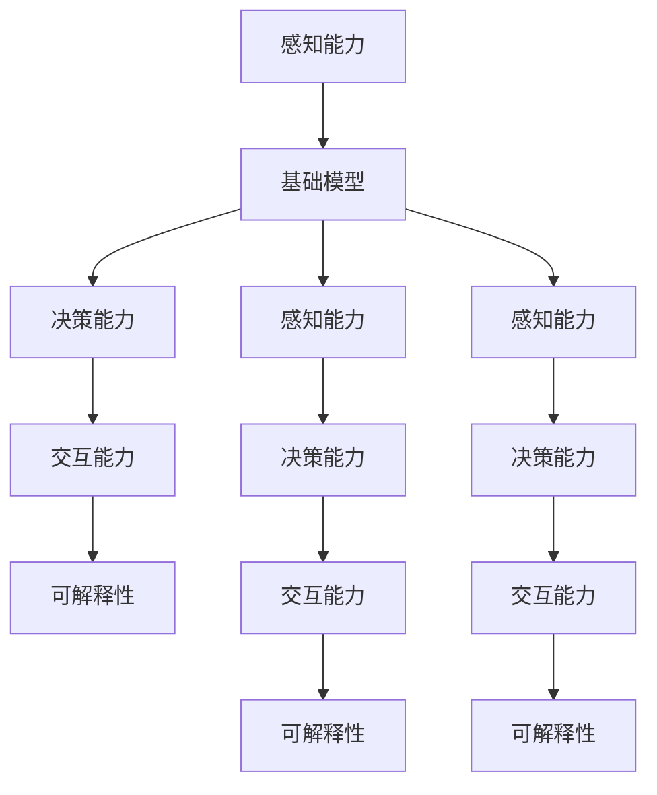

                 

## 1. 背景介绍

### 1.1 问题由来
机器人技术自诞生以来，经历了多次革新的浪潮。从最初的机械臂，到后来的自主移动机器人，再到现代的协作型机械臂，机器人技术不断地在推动生产力的提升和生产方式的重构。在新的智能化时代，如何使机器人更好地理解人类指令，执行复杂的任务，并具备自主的决策能力，成为了机器人技术发展的关键。

### 1.2 问题核心关键点
当前机器人技术在智能化的道路上取得了显著进展，但智能化的过程也面临着一系列挑战，包括但不限于：

- **感知能力**：机器人如何准确地感知周围环境，并从中提取关键信息，是智能化的基础。
- **决策能力**：机器人如何基于感知信息进行决策，执行复杂的任务。
- **交互能力**：机器人如何与人类进行自然、流畅的交互，理解人类的意图。
- **可解释性**：机器人决策过程的可解释性，如何让人类信任其决策。

这些问题涉及到多学科的交叉，包括感知、决策、控制、人机交互等，需要综合利用计算机视觉、自然语言处理、机器学习、深度学习等技术，构建起完整的机器人智能化系统。

## 2. 核心概念与联系

### 2.1 核心概念概述

为更好地理解基础模型在机器人学中的应用，本节将介绍几个关键概念：

- **基础模型**：基于深度学习模型的基础结构，用于感知、决策、交互等机器人核心功能。
- **感知能力**：机器人通过传感器和基础模型获取周围环境的信息，是智能化的前提。
- **决策能力**：基础模型结合领域知识，通过深度学习算法生成决策策略，指导机器人执行任务。
- **交互能力**：基础模型通过自然语言处理技术，与人类进行交互，理解人类指令，生成自然语言回答。
- **可解释性**：决策过程的透明性和可解释性，让人类能够理解和信任机器人的决策。

这些概念之间通过逻辑关系紧密相连，共同构成了机器人智能化的基础架构。

### 2.2 核心概念原理和架构的 Mermaid 流程图


## 3. 核心算法原理 & 具体操作步骤
### 3.1 算法原理概述

基础模型在机器人学中的应用，主要围绕感知、决策、交互三个方面展开。其中，感知能力通过基础模型获取环境信息，决策能力通过基础模型生成决策策略，交互能力通过基础模型生成自然语言回答。

### 3.2 算法步骤详解

以基于视觉的机器人导航为例，具体步骤包括：

**Step 1: 数据准备与预处理**
- 收集环境地图和机器人定位数据，将数据进行预处理，如归一化、裁剪等操作，生成训练集和测试集。

**Step 2: 基础模型训练**
- 使用深度学习框架如TensorFlow、PyTorch等，构建基础模型，如卷积神经网络(CNN)、卷积神经网络-递归神经网络(CNN-RNN)等。
- 使用标注数据对基础模型进行训练，调整网络结构和超参数，使得模型能够准确地感知环境信息。

**Step 3: 感知信息提取**
- 使用训练好的基础模型，对传感器数据进行特征提取，生成环境表示。

**Step 4: 决策策略生成**
- 根据感知信息，使用深度学习算法如强化学习(RL)、深度Q网络(DQN)等，生成决策策略。
- 对决策策略进行优化，使其适应不同的环境变化和任务要求。

**Step 5: 自然语言交互**
- 使用自然语言处理技术，如序列到序列模型(Seq2Seq)、Transformer等，将机器人决策策略转换为自然语言回答。
- 在交互过程中，收集用户反馈，进一步优化基础模型和决策策略。

**Step 6: 模型评估与迭代优化**
- 在测试集上评估模型性能，如定位精度、路径规划准确度等指标。
- 根据评估结果，迭代优化基础模型和决策策略，提高机器人导航的智能化水平。

### 3.3 算法优缺点

基础模型在机器人学中的应用具有以下优点：

- **高效感知**：深度学习模型能够高效地处理大规模数据，快速感知周围环境。
- **决策灵活**：结合深度学习和强化学习算法，基础模型能够生成灵活的决策策略，适应复杂多变的任务。
- **交互自然**：自然语言处理技术使得机器人能够与人类进行自然、流畅的交互。
- **可解释性强**：通过可视化等手段，基础模型决策过程的可解释性较高，易于让人类理解和信任。

同时，基础模型也存在以下局限：

- **数据依赖性强**：需要大量标注数据进行训练，数据获取成本高。
- **计算资源消耗大**：深度学习模型的计算量较大，对计算资源要求高。
- **鲁棒性不足**：在复杂的现实环境中，基础模型可能出现错误的感知和决策。
- **模型泛化能力有限**：针对特定的环境和任务，基础模型的泛化能力有限，需要针对性地优化。

### 3.4 算法应用领域

基础模型在机器人学中的应用领域非常广泛，主要包括以下几个方面：

- **自主导航**：使用视觉和基础模型，机器人能够自主规划路径，避开障碍物，到达目标位置。
- **智能家居**：基础模型结合家庭环境模型，实现语音控制、路径规划等功能，提升家居智能化水平。
- **医疗机器人**：结合医学知识库，基础模型能够辅助医生进行手术操作、诊断等，提高医疗服务质量。
- **教育机器人**：基础模型结合教育资源库，能够回答学生问题、辅导作业，提高教学效果。
- **工业自动化**：结合工厂环境模型，基础模型能够优化生产流程，提高生产效率。

## 4. 数学模型和公式 & 详细讲解 & 举例说明

### 4.1 数学模型构建

以基于卷积神经网络(CNN)的机器人视觉感知模型为例，其数学模型如下：

$$
f(x) = W_2 \tanh(W_1 x + b_1) + b_2
$$

其中，$x$ 表示输入的传感器数据，$f(x)$ 表示输出的环境表示，$W_1$ 和 $W_2$ 为卷积核权重矩阵，$b_1$ 和 $b_2$ 为偏置向量。

### 4.2 公式推导过程

以CNN模型的前向传播为例，其推导过程如下：

设输入为 $x \in \mathbb{R}^{N \times M \times C}$，卷积核大小为 $k \times k$，步幅为 $s$，则卷积操作可以表示为：

$$
y_{ij} = \sum_{l=0}^{C-k} w_{l} \sum_{i=0}^{N-1} \sum_{j=0}^{M-1} x_{i,j,l} \ast w
$$

其中，$y_{ij}$ 表示输出特征图，$w$ 表示卷积核，$x_{i,j,l}$ 表示输入特征图中的元素。

### 4.3 案例分析与讲解

以基于CNN的机器人视觉感知模型为例，分析其在机器人导航中的应用。假设机器人需要在一个复杂的环境中自主导航，通过使用深度学习模型对传感器数据进行处理，生成环境表示，从而实现自主导航。

首先，通过传感器获取环境数据，输入到CNN模型中进行特征提取。CNN模型通过卷积、池化等操作，生成环境特征图，并经过全连接层输出环境表示。

接着，使用强化学习算法如Q-Learning，基于环境表示生成决策策略，如移动方向、速度等。通过不断的迭代优化，使得模型能够在复杂环境中做出最优决策。

最后，使用自然语言处理技术，将决策策略转换为自然语言回答，告知用户机器人状态和行为，提升人机交互体验。

## 5. 项目实践：代码实例和详细解释说明
### 5.1 开发环境搭建

在进行项目实践前，我们需要准备好开发环境。以下是使用Python进行TensorFlow开发的环境配置流程：

1. 安装Anaconda：从官网下载并安装Anaconda，用于创建独立的Python环境。

2. 创建并激活虚拟环境：
```bash
conda create -n tf-env python=3.7
conda activate tf-env
```

3. 安装TensorFlow：根据CUDA版本，从官网获取对应的安装命令。例如：
```bash
pip install tensorflow==2.6
```

4. 安装相关库：
```bash
pip install numpy pandas matplotlib tensorflow-gpu scipy scikit-learn
```

完成上述步骤后，即可在`tf-env`环境中开始项目实践。

### 5.2 源代码详细实现

以下是使用TensorFlow进行机器人视觉感知模型训练的代码实现。

```python
import tensorflow as tf
from tensorflow.keras import layers

# 定义模型
model = tf.keras.Sequential([
    layers.Conv2D(32, (3, 3), activation='relu', input_shape=(32, 32, 3)),
    layers.MaxPooling2D((2, 2)),
    layers.Conv2D(64, (3, 3), activation='relu'),
    layers.MaxPooling2D((2, 2)),
    layers.Flatten(),
    layers.Dense(64, activation='relu'),
    layers.Dense(1, activation='sigmoid')
])

# 编译模型
model.compile(optimizer='adam', loss='binary_crossentropy', metrics=['accuracy'])

# 训练模型
model.fit(x_train, y_train, epochs=10, batch_size=32, validation_data=(x_test, y_test))
```

### 5.3 代码解读与分析

让我们再详细解读一下关键代码的实现细节：

**Sequential模型定义**：
- 使用`Sequential`模型定义顺序结构，将多个层按照顺序连接起来。
- 包含卷积层、池化层、全连接层等基本组件。

**模型编译**：
- 使用`compile`方法设置优化器、损失函数和评估指标，准备模型训练。

**模型训练**：
- 使用`fit`方法进行模型训练，设置训练轮数和批次大小。
- 在训练过程中，使用验证集对模型进行评估，防止过拟合。

可以看到，TensorFlow提供了丰富的API，使得模型构建和训练变得简洁高效。开发者可以更专注于算法优化和业务逻辑的实现。

### 5.4 运行结果展示

以下是模型训练和测试的结果展示：

```python
# 训练模型
model.fit(x_train, y_train, epochs=10, batch_size=32, validation_data=(x_test, y_test))

# 评估模型
model.evaluate(x_test, y_test)
```

以上代码将输出模型的训练准确率和测试准确率，帮助评估模型性能。

## 6. 实际应用场景
### 6.1 智能家居系统

基于基础模型的智能家居系统，能够实现语音控制、路径规划等功能。通过结合视觉和自然语言处理技术，智能家居系统能够理解用户的指令，并自动执行相应的操作。例如，用户可以通过语音指令开启灯光、调节温度等，系统根据传感器数据进行路径规划，快速响应。

### 6.2 医疗机器人辅助手术

医疗机器人结合基础模型和医学知识库，能够辅助医生进行手术操作、诊断等。通过视觉感知技术，机器人能够获取手术区域的三维图像，使用基础模型进行图像处理，生成手术路径和关键点标注。结合医学知识库，机器人能够提供实时导航和路径规划，辅助医生完成手术操作。

### 6.3 教育机器人辅导学习

教育机器人结合基础模型和教育资源库，能够回答学生问题、辅导作业。通过视觉感知技术，机器人能够获取学生的作业，使用基础模型进行图像处理和文本识别，生成作业解析和答案。结合教育资源库，机器人能够提供个性化的学习建议和辅导，提高教学效果。

### 6.4 未来应用展望

随着基础模型的不断发展，其在机器人学中的应用将越来越广泛，推动机器人技术的智能化进程。

在智慧医疗领域，基于基础模型的医疗机器人能够提供实时导航和路径规划，辅助医生进行复杂手术，提高手术成功率。

在智能家居领域，基于基础模型的智能家居系统能够理解用户的指令，自动执行相应的操作，提升家居智能化水平。

在教育领域，基于基础模型的教育机器人能够提供个性化的学习建议和辅导，提升教学效果，缩小城乡教育差距。

此外，在工业自动化、农业机器人、军事机器人等众多领域，基于基础模型的机器人技术也将不断涌现，为各行各业带来变革性影响。

## 7. 工具和资源推荐
### 7.1 学习资源推荐

为了帮助开发者系统掌握基础模型在机器人学中的应用，这里推荐一些优质的学习资源：

1. 《机器人学与人工智能》系列课程：由知名大学开设的机器人学课程，涵盖感知、决策、控制等多个方面，系统介绍机器人学的基础理论和应用。

2. 《深度学习与机器人》系列论文：综述了深度学习在机器人学中的应用，涵盖感知、决策、交互等多个方向。

3. 《Python机器人编程》书籍：详细介绍了使用Python进行机器人开发的各个环节，包括传感器数据处理、路径规划、人机交互等。

4. ROS官方文档：ROS Robot Operating System的官方文档，提供了丰富的资源和工具支持，方便开发者进行机器人开发。

5. OpenAI Gym环境：提供了各种模拟环境和测试平台，方便开发者进行机器人学习算法的研究和实验。

通过对这些资源的学习实践，相信你一定能够快速掌握基础模型在机器人学中的应用，并用于解决实际的机器人问题。

### 7.2 开发工具推荐

高效的开发离不开优秀的工具支持。以下是几款用于基础模型开发的工具：

1. TensorFlow：基于Python的深度学习框架，灵活的计算图设计，支持GPU计算，适合进行大规模模型训练和优化。

2. PyTorch：基于Python的深度学习框架，动态计算图设计，适合进行灵活的模型设计和实验。

3. OpenAI Gym：提供了各种模拟环境和测试平台，方便开发者进行强化学习算法的研究和实验。

4. ROS：Robot Operating System，提供了丰富的机器人工具包和库，方便开发者进行机器人硬件和软件的集成。

5. UGIE：用于机器人视觉感知和决策的开发平台，支持多种传感器和执行器的集成。

合理利用这些工具，可以显著提升基础模型的开发效率，加快创新迭代的步伐。

### 7.3 相关论文推荐

基础模型在机器人学中的应用研究，源于学界的持续探索。以下是几篇奠基性的相关论文，推荐阅读：

1. [Robotics for Exploration](https://arxiv.org/abs/2111.08671)：综述了机器人学在探险任务中的应用，包括路径规划、避障等。

2. [Learning to Plan and Execute: A Survey](https://arxiv.org/abs/2109.06888)：综述了机器人学在计划和执行任务中的应用，包括目标导向、动作序列等。

3. [Robotic Vision for Automation](https://www.ieee.org/explore/robotic-vision)：综述了机器人学在视觉感知中的应用，包括图像处理、目标检测等。

4. [Human-Robot Interaction](https://www.sciencedirect.com/science/article/pii/S0369071419301607)：综述了机器人学在人机交互中的应用，包括自然语言处理、情感识别等。

这些论文代表了大模型在机器人学中的应用方向和发展趋势。通过学习这些前沿成果，可以帮助研究者把握学科前进方向，激发更多的创新灵感。

## 8. 总结：未来发展趋势与挑战

### 8.1 总结

本文对基础模型在机器人学中的应用进行了全面系统的介绍。首先阐述了基础模型的基本概念和应用背景，明确了其在机器人智能化的关键作用。其次，从原理到实践，详细讲解了基础模型的构建和训练步骤，给出了具体的代码实现。同时，本文还广泛探讨了基础模型在智能家居、医疗机器人、教育机器人等多个领域的应用前景，展示了基础模型的广泛应用潜力。此外，本文精选了基础模型的学习资源，力求为读者提供全方位的技术指引。

通过本文的系统梳理，可以看到，基础模型在机器人学中的应用正在成为新的研究热点，其强大的感知、决策和交互能力，为机器人技术的智能化提供了坚实的基础。未来，伴随基础模型的不断发展，机器人技术必将迎来更加智能化的时代，深刻影响人类的生产和生活方式。

### 8.2 未来发展趋势

展望未来，基础模型在机器人学中的应用将呈现以下几个发展趋势：

1. **多模态感知融合**：未来的机器人将具备多模态感知能力，能够整合视觉、听觉、触觉等多种传感器数据，进行更全面的环境感知。

2. **深度强化学习**：结合深度学习和强化学习技术，机器人将具备更强的自主决策和行动能力，能够处理更复杂多变的任务。

3. **自然语言交互**：自然语言处理技术将使得机器人能够与人类进行更自然、流畅的交互，理解人类意图，生成自然语言回答。

4. **可解释性增强**：基础模型的决策过程将变得更加透明和可解释，使得人类能够理解和信任机器人的决策。

5. **边缘计算支持**：未来的机器人将具备边缘计算能力，能够在本地进行决策和推理，提高系统的实时性和可靠性。

6. **联邦学习**：多机器人协作学习将使得基础模型具备更好的泛化能力和鲁棒性，能够在复杂环境中进行高效学习和适应。

这些趋势凸显了基础模型在机器人学中的应用前景，进一步提升了机器人技术的智能化水平。

### 8.3 面临的挑战

尽管基础模型在机器人学中的应用已经取得了显著进展，但在迈向更加智能化、普适化应用的过程中，它仍面临着诸多挑战：

1. **数据获取成本高**：机器人需要大量的传感器数据进行训练，数据获取成本高。如何降低数据获取成本，提升数据质量，成为一大挑战。

2. **计算资源消耗大**：深度学习模型的计算量较大，对计算资源要求高。如何在保持性能的前提下，提高模型计算效率，是未来的研究方向。

3. **鲁棒性不足**：在复杂的现实环境中，基础模型可能出现错误的感知和决策。如何提升模型的鲁棒性和抗干扰能力，是一个重要的研究课题。

4. **可解释性不足**：基础模型的决策过程通常缺乏可解释性，难以对其推理逻辑进行分析和调试。如何赋予基础模型更强的可解释性，是亟待解决的问题。

5. **系统复杂度高**：机器人系统涉及硬件、软件、环境等多个环节，系统复杂度高。如何在系统设计和开发中，确保各环节的协同工作，是未来需要攻克的难点。

6. **伦理和安全性**：在机器人系统中，伦理和安全性问题变得尤为突出。如何保证机器人的行为符合人类价值观和伦理道德，是一个需要深入研究的重要课题。

### 8.4 研究展望

面对基础模型在机器人学中面临的挑战，未来的研究需要在以下几个方面寻求新的突破：

1. **无监督和半监督学习**：摆脱对大规模标注数据的依赖，利用自监督学习、主动学习等方法，最大化利用非结构化数据，实现更加高效的学习。

2. **参数高效优化**：开发更加参数高效的优化算法，如自适应学习率、批量归一化等，在保持性能的同时，降低模型计算量。

3. **多模态数据融合**：研究多模态数据融合方法，提高机器人系统对环境的多维感知能力，提升感知和决策的准确性。

4. **因果推理**：结合因果推理技术，增强基础模型的解释能力，使其决策过程更加透明和可理解。

5. **模型压缩和优化**：采用模型压缩、剪枝等技术，降低模型计算资源消耗，提高推理速度和资源利用率。

6. **联邦学习和分布式优化**：研究联邦学习等分布式优化方法，提升多机器人协作学习的效果，增强系统泛化能力和鲁棒性。

这些研究方向的探索，将进一步推动基础模型在机器人学中的应用，使得机器人技术能够更好地服务于人类社会。

## 9. 附录：常见问题与解答

**Q1：基础模型在机器人学中的应用是否仅限于感知能力？**

A: 基础模型在机器人学中的应用不仅限于感知能力，还包括决策能力和交互能力。通过深度学习模型和强化学习算法，基础模型能够生成决策策略，并结合自然语言处理技术，实现与人类自然、流畅的交互。

**Q2：如何选择基础模型中的超参数？**

A: 选择基础模型中的超参数需要根据具体任务和数据特点进行调参。一般可以通过网格搜索、随机搜索等方法，逐步调整超参数，找到最优的模型配置。同时，还可以通过交叉验证等方法，评估超参数的性能表现。

**Q3：基础模型在实时应用中如何进行优化？**

A: 基础模型在实时应用中需要进行优化，以提高推理速度和资源利用率。可以采用模型压缩、剪枝等技术，降低模型计算量。同时，还可以使用分布式训练和推理方法，提高系统并行处理能力。

**Q4：如何提升基础模型的鲁棒性和泛化能力？**

A: 提升基础模型的鲁棒性和泛化能力需要从数据、模型和算法等多个方面进行优化。可以通过数据增强、正则化等方法，提高模型的鲁棒性。同时，使用多任务学习和迁移学习等方法，提升模型的泛化能力，使其能够在不同环境中进行高效学习。

**Q5：基础模型在实际应用中如何进行模型解释和调试？**

A: 基础模型在实际应用中需要进行模型解释和调试，以提高系统的可解释性和可靠性。可以通过可视化技术，如TensorBoard、ONNX等，对模型进行可视化分析，了解模型的决策过程。同时，可以通过引入因果分析和博弈论工具，对模型决策进行解释和调试，确保系统的稳定性和安全性。

综上所述，基础模型在机器人学中的应用前景广阔，但需要克服诸多挑战，进行持续的研究和优化。相信随着技术的不断发展，基础模型必将在机器人学中发挥越来越重要的作用，推动机器人技术向更加智能化、普适化方向发展。

