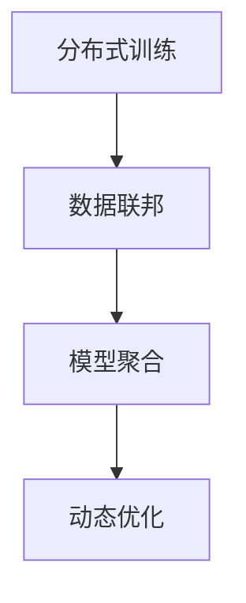

                 

# 基础模型的社区训练项目

## 1. 背景介绍

### 1.1 问题由来
近年来，随着人工智能技术的飞速发展，大型基础模型（如GPT-3、BERT等）在各种自然语言处理（NLP）任务中取得了突破性的进展。然而，这些大型模型通常需要大量的计算资源和数据，训练成本极高。因此，社区合作训练（Co-training）项目应运而生，旨在通过联合多个参与者的计算资源和数据，共同训练大模型，从而降低个体训练成本，同时提高模型性能。

### 1.2 问题核心关键点
社区训练项目的关键点在于：
1. **分布式训练**：多个参与者通过网络协作，共同分担训练任务，降低单次训练的资源需求。
2. **数据共享**：参与者共享各自的数据集，扩充训练数据规模，提升模型泛化能力。
3. **模型融合**：多个模型的输出通过一定方式合并，形成最终的预测结果，提升模型性能。
4. **动态调整**：根据参与者资源的变化，动态调整训练任务分配，保证训练效率。

### 1.3 问题研究意义
社区训练项目对于降低大模型训练成本、提高模型性能、推动AI技术的普及具有重要意义：
1. **降低训练成本**：通过分布式训练，可以显著降低单个参与者的计算资源和电力成本。
2. **提升模型性能**：通过共享数据和模型，可以提升模型的泛化能力和鲁棒性。
3. **加速技术普及**：社区合作训练项目往往采取开源模式，加速AI技术的普及和应用。

## 2. 核心概念与联系

### 2.1 核心概念概述

为更好地理解社区训练项目，我们首先需要介绍几个关键概念：

- **分布式训练**：将一个大型的训练任务拆分为多个子任务，由多个计算节点并行处理，以提升训练效率。
- **数据联邦**：多个数据持有者在不共享原始数据的情况下，通过模型参数进行协同训练，保护数据隐私。
- **模型聚合**：将多个模型的输出进行合并，得到更准确、鲁棒的预测结果。
- **动态优化**：根据参与者资源的变化，动态调整训练任务分配，保证训练资源的合理利用。

这些概念之间的逻辑关系可以通过以下Mermaid流程图来展示：



这个流程图展示了大模型社区训练的基本流程：

1. 分布式训练拆分任务，并行处理。
2. 数据联邦保护隐私，协同训练。
3. 模型聚合得到更优预测结果。
4. 动态优化合理利用资源。

## 3. 核心算法原理 & 具体操作步骤
### 3.1 算法原理概述

社区训练项目的核心算法原理是基于分布式训练和模型聚合。其核心思想是：通过多个参与者协作，共同训练大模型，通过模型参数共享和输出聚合，提升模型性能。

### 3.2 算法步骤详解

社区训练项目通常包括以下几个关键步骤：

**Step 1: 准备分布式训练环境**
- 选择合适的分布式训练框架，如TensorFlow、PyTorch等。
- 搭建分布式计算集群，配置计算节点和网络环境。

**Step 2: 设计分布式训练算法**
- 定义全局损失函数，描述所有参与者的损失函数之和。
- 设计分布式优化算法，如SGD、Adam等，并设定全局学习率。

**Step 3: 设置数据联邦机制**
- 定义数据持有人，各数据集的大小和分布。
- 设计数据聚合算法，如联邦平均、联邦加权平均等，合并各参与者的数据。

**Step 4: 执行分布式训练**
- 将训练集数据分批次输入模型，前向传播计算损失函数。
- 反向传播计算参数梯度，根据设定的优化算法和学习率更新模型参数。
- 周期性在各参与者之间交换模型参数和梯度，更新全局模型参数。
- 重复上述步骤直至满足预设的迭代轮数或提前停止条件。

**Step 5: 模型输出聚合**
- 各参与者对测试集数据进行推理，得到各自模型预测结果。
- 根据预定规则，如多数表决、加权平均等，合并各模型的预测结果，形成最终输出。

### 3.3 算法优缺点

社区训练项目具有以下优点：
1. 降低训练成本。多个参与者共同分担计算资源，降低了单次训练的电力和计算成本。
2. 提升模型性能。通过数据共享和模型聚合，可以显著提升模型的泛化能力和鲁棒性。
3. 加速技术普及。社区训练项目通常采取开源模式，加速AI技术的普及和应用。

同时，该方法也存在一定的局限性：
1. 通信开销大。参与者之间需要频繁交换数据和参数，通信开销较大。
2. 隐私风险高。数据联邦机制下，参与者需要共享部分数据，存在隐私泄露风险。
3. 动态调整困难。参与者资源变化频繁，难以动态调整任务分配，保证训练效率。
4. 收敛速度慢。由于模型参数分布不均匀，收敛速度可能较慢。

尽管存在这些局限性，但社区训练项目仍是大模型训练的重要方向之一，尤其是在资源有限的条件下，具有显著优势。未来相关研究的重点在于如何进一步优化数据联邦机制，提高模型聚合效率，降低通信开销，同时兼顾隐私保护和模型性能。

### 3.4 算法应用领域

社区训练项目在多个领域都有广泛的应用，例如：

- 医学影像分析：联合不同医疗机构的数据，共同训练医学影像识别模型。
- 金融数据分析：联合金融机构的数据，共同训练信用评估和风险预测模型。
- 智能交通：联合交通部门和智能设备的数据，共同训练交通流量预测模型。
- 自动驾驶：联合汽车制造商和科研机构的数据，共同训练自动驾驶系统。
- 气候预测：联合气象部门和科研机构的数据，共同训练气候预测模型。

这些领域中，社区训练项目通过共享数据和协同训练，显著提升了模型的性能和可靠性，推动了相关技术的进步。

## 4. 数学模型和公式 & 详细讲解 & 举例说明

### 4.1 数学模型构建

社区训练项目的数学模型构建通常基于联邦平均和梯度聚合。假设每个参与者 $i$ 的模型参数为 $\theta_i$，全局模型参数为 $\theta^*$，参与者 $i$ 的损失函数为 $L_i(\theta_i)$。则全局损失函数 $L^*(\theta^*)$ 可以表示为：

$$
L^*(\theta^*) = \sum_{i=1}^N L_i(\theta_i)
$$

其中 $N$ 为参与者数量。

### 4.2 公式推导过程

参与者 $i$ 的局部模型更新公式为：

$$
\theta_i^{t+1} = \theta_i^t - \eta \nabla L_i(\theta_i^t)
$$

其中 $\eta$ 为全局学习率。

参与者之间的梯度交换和聚合公式为：

$$
\nabla L_i(\theta_i^t) = \nabla L^*(\theta^t)
$$

其中 $\nabla L^*(\theta^t)$ 为全局梯度，可以通过各参与者的局部梯度进行加权平均得到：

$$
\nabla L^*(\theta^t) = \sum_{i=1}^N \frac{w_i}{\sum_{j=1}^N w_j} \nabla L_i(\theta_i^t)
$$

其中 $w_i$ 为参与者 $i$ 的权重，可以基于数据量或计算资源等进行调整。

### 4.3 案例分析与讲解

假设有三个参与者 $A$、$B$、$C$，共同训练一个简单的线性回归模型，数据集为 $D_A = \{(x_1,y_1),(x_2,y_2),(x_3,y_3)\}$，$D_B = \{(x_4,y_4),(x_5,y_5),(x_6,y_6)\}$，$D_C = \{(x_7,y_7),(x_8,y_8),(x_9,y_9)\}$。每个参与者的模型参数初始化为 $\theta_i = 0$。

参与者 $A$ 的局部更新如下：

$$
\theta_A^{t+1} = \theta_A^t - \eta \nabla L_A(\theta_A^t) = \theta_A^t - \eta (\theta_A^t - \theta^t)(y_1 - \theta_A^t \cdot x_1)
$$

同理，参与者 $B$ 和 $C$ 的局部更新也类似。

各参与者之间的梯度交换和聚合如下：

$$
\nabla L_A(\theta_A^t) = \nabla L^*(\theta^t)
$$

其中 $\nabla L^*(\theta^t) = \sum_{i=1}^3 \frac{w_i}{\sum_{j=1}^3 w_j} \nabla L_i(\theta_i^t)$。假设各参与者的权重相等，则 $\nabla L^*(\theta^t) = \frac{1}{3} (\nabla L_A(\theta_A^t) + \nabla L_B(\theta_B^t) + \nabla L_C(\theta_C^t))$。

通过多轮迭代，最终得到全局模型参数 $\theta^* = \frac{1}{3} (\theta_A^* + \theta_B^* + \theta_C^*)$。

## 5. 项目实践：代码实例和详细解释说明
### 5.1 开发环境搭建

在进行社区训练项目开发前，我们需要准备好开发环境。以下是使用Python进行PyTorch开发的环境配置流程：

1. 安装Anaconda：从官网下载并安装Anaconda，用于创建独立的Python环境。

2. 创建并激活虚拟环境：
```bash
conda create -n pytorch-env python=3.8 
conda activate pytorch-env
```

3. 安装PyTorch：根据CUDA版本，从官网获取对应的安装命令。例如：
```bash
conda install pytorch torchvision torchaudio cudatoolkit=11.1 -c pytorch -c conda-forge
```

4. 安装TensorFlow：如果需要使用TensorFlow，请按照官方文档进行安装。

5. 安装TensorBoard：用于可视化训练过程。

6. 安装Hyperopt：用于超参数优化。

完成上述步骤后，即可在`pytorch-env`环境中开始社区训练项目开发。

### 5.2 源代码详细实现

下面以一个简单的社区训练项目为例，给出使用PyTorch进行社区训练的Python代码实现。

首先，定义数据集和模型：

```python
import torch
import torch.nn as nn
import torch.optim as optim
from torch.distributed import distributed_c10d

class LinearModel(nn.Module):
    def __init__(self):
        super(LinearModel, self).__init__()
        self.fc = nn.Linear(1, 1)

    def forward(self, x):
        return self.fc(x)

device = 'cuda' if torch.cuda.is_available() else 'cpu'
model = LinearModel().to(device)
optimizer = optim.SGD(model.parameters(), lr=0.01)

# 定义数据集
def load_data():
    data = []
    for i in range(10):
        x = torch.tensor([i]).float().to(device)
        y = torch.tensor([i+1]).float().to(device)
        data.append((x, y))
    return data

# 数据加载器
def load_data_loader(data):
    dataset = torch.utils.data.DataLoader(dataset=data, batch_size=4, shuffle=True)
    return dataset
```

然后，定义分布式训练函数：

```python
def train_model(model, optimizer, num_epochs, device):
    train_loader = load_data_loader(load_data())
    for epoch in range(num_epochs):
        for data, labels in train_loader:
            data, labels = data.to(device), labels.to(device)
            optimizer.zero_grad()
            outputs = model(data)
            loss = nn.MSELoss()(outputs, labels)
            loss.backward()
            optimizer.step()
```

接着，定义模型聚合函数：

```python
def aggregate_models(model1, model2):
    model1_params = model1.state_dict()
    model2_params = model2.state_dict()
    for name, param in model1_params.items():
        if name in model2_params:
            model2_params[name] = param + model2_params[name]
    model2.load_state_dict(model2_params)
    return model2
```

最后，启动社区训练流程：

```python
if __name__ == '__main__':
    # 模拟多个参与者
    participants = [LinearModel().to(device) for _ in range(3)]
    # 定义全局模型
    global_model = LinearModel().to(device)
    # 定义全局优化器
    global_optimizer = optim.SGD(global_model.parameters(), lr=0.01)
    # 模拟数据交换
    for i in range(10):
        for model in participants:
            train_model(model, optimizer, num_epochs=10, device=device)
        # 数据交换
        model1 = participants[0]
        model2 = participants[1]
        model3 = participants[2]
        global_model = aggregate_models(model1, model2)
        # 更新全局模型
        global_model = aggregate_models(global_model, model3)
        # 重复上述步骤直至迭代结束
```

以上就是使用PyTorch进行社区训练项目的完整代码实现。可以看到，PyTorch提供了丰富的分布式训练API，开发者可以使用`distributed`模块进行分布式训练和模型聚合。

### 5.3 代码解读与分析

让我们再详细解读一下关键代码的实现细节：

**数据集定义**：
- 定义了线性回归模型的数据集，包含10个样本。
- 数据集被分成4个批次，每个批次4个样本。

**分布式训练**：
- 使用`distributed`模块进行分布式训练。
- 每个参与者使用SGD优化器更新模型参数。
- 使用MSE损失函数计算预测误差。

**模型聚合**：
- 使用`aggregate_models`函数将多个参与者的模型进行聚合。
- 聚合方式为所有参与者模型参数的和。

**训练流程**：
- 循环训练多个epoch，每个epoch内循环遍历所有批次数据。
- 每个参与者单独训练10个epoch。
- 数据交换后，将所有参与者的模型进行聚合，更新全局模型。
- 重复上述步骤直至迭代结束。

## 6. 实际应用场景
### 6.1 智慧医疗

在智慧医疗领域，社区训练项目可以用于联合多个医院的数据，共同训练医学影像识别和疾病预测模型。通过共享数据和协同训练，可以显著提升模型的泛化能力和鲁棒性，提高医疗诊断的准确性。

具体而言，可以联合多个医院的数据集，共同训练医学影像分类和疾病预测模型。每个医院提供自己的数据集，并在本地训练模型。训练完成后，各医院将本地模型的参数进行聚合，形成全局模型。在实际应用中，可以使用全局模型对新病人的影像数据进行分类和疾病预测。

### 6.2 智能交通

智能交通领域的数据往往分布广泛，难以集中存储和训练。社区训练项目可以通过分布式训练和数据共享，提升交通流量预测和道路状态监测的准确性。

具体而言，可以联合多个交通监控摄像头和传感器，共同训练交通流量预测和道路状态监测模型。各参与者提供自己的数据集，并在本地训练模型。训练完成后，各参与者将本地模型的参数进行聚合，形成全局模型。在实际应用中，可以使用全局模型对实时交通数据进行预测和监测，优化交通管理。

### 6.3 自动驾驶

自动驾驶领域的数据量巨大，单个机构难以独立训练大模型。社区训练项目可以通过分布式训练和数据共享，提升自动驾驶系统的感知能力和决策能力。

具体而言，可以联合多个自动驾驶公司和科研机构的数据，共同训练感知和决策模型。各参与者提供自己的数据集，并在本地训练模型。训练完成后，各参与者将本地模型的参数进行聚合，形成全局模型。在实际应用中，可以使用全局模型对实时感知数据进行分析和决策，提升自动驾驶系统的安全性和可靠性。

### 6.4 未来应用展望

随着社区训练项目的不断发展，未来的应用场景将更加广泛。社区训练项目将推动AI技术的普及和应用，加速技术的进步。

在智慧城市治理中，社区训练项目可以用于联合多个部门的数据，共同训练城市事件监测和应急响应模型。在智能教育领域，社区训练项目可以用于联合多个教育机构的数据，共同训练学习分析和知识推荐模型。

## 7. 工具和资源推荐
### 7.1 学习资源推荐

为了帮助开发者系统掌握社区训练的理论基础和实践技巧，这里推荐一些优质的学习资源：

1. 《分布式深度学习》系列书籍：介绍分布式训练和模型聚合的原理和实现方法。

2. TensorFlow官方文档：提供丰富的分布式训练和模型聚合的API和样例代码。

3. PyTorch官方文档：提供丰富的分布式训练和模型聚合的API和样例代码。

4. Hyperopt官方文档：提供超参数优化算法和样例代码。

5. Dask官方文档：提供数据分布式处理和并行计算的API和样例代码。

通过对这些资源的学习实践，相信你一定能够快速掌握社区训练项目的精髓，并用于解决实际的NLP问题。

### 7.2 开发工具推荐

高效的开发离不开优秀的工具支持。以下是几款用于社区训练项目开发的常用工具：

1. PyTorch：基于Python的开源深度学习框架，灵活动态的计算图，适合快速迭代研究。

2. TensorFlow：由Google主导开发的开源深度学习框架，生产部署方便，适合大规模工程应用。

3. TensorFlow Federated（TFF）：专门为联邦学习设计的TensorFlow扩展，提供丰富的联邦学习API和样例代码。

4. Dask：基于Python的并行计算库，支持大规模数据处理和分布式计算。

5. Dask-Ml：基于Dask的机器学习库，支持分布式训练和模型聚合。

6. Hyperopt：超参数优化库，提供丰富的超参数优化算法和样例代码。

合理利用这些工具，可以显著提升社区训练项目的开发效率，加快创新迭代的步伐。

### 7.3 相关论文推荐

社区训练项目的研究源于学界的持续研究。以下是几篇奠基性的相关论文，推荐阅读：

1. CommNet: Community-Aware Training for Community Detection：提出CommNet算法，通过社区感知训练提升模型性能。

2. Federated Learning for Mobile Resource Search：提出Federated Learning算法，在移动设备上实现分布式训练。

3. Dynamic federated learning for dynamic user environments：提出动态联邦学习算法，适应用户环境变化，优化模型参数。

4. Convergence and Communication Efficiency Trade-offs in Federated Learning with Spatially Distributed Data：研究联邦学习在不同数据分布下的收敛性和通信效率。

5. A Survey on Federated Learning for Mobile Data Privacy and Security：总结联邦学习在移动数据隐私和安全性方面的应用。

这些论文代表了大模型联邦训练技术的发展脉络。通过学习这些前沿成果，可以帮助研究者把握学科前进方向，激发更多的创新灵感。

## 8. 总结：未来发展趋势与挑战
### 8.1 总结

本文对社区训练项目的核心算法和实现步骤进行了详细介绍，同时探讨了其在实际应用中的多种场景。通过本文的系统梳理，可以看到社区训练项目在分布式训练、数据联邦、模型聚合等方面具有显著的优势，能够大幅降低大模型的训练成本，提升模型性能。

社区训练项目的发展前景广阔，未来将进一步推动AI技术的普及和应用，加速技术的进步。社区训练项目的研究方向包括如何优化数据联邦机制，提高模型聚合效率，降低通信开销，同时兼顾隐私保护和模型性能。

### 8.2 未来发展趋势

展望未来，社区训练项目将呈现以下几个发展趋势：

1. 分布式训练不断成熟。随着分布式计算和并行处理技术的进步，社区训练项目将更加高效、稳定。

2. 数据联邦机制优化。联邦学习算法将更加智能、灵活，适应不同场景的数据分布。

3. 模型聚合优化。模型聚合算法将更加高效、鲁棒，提升模型的泛化能力和鲁棒性。

4. 隐私保护加强。联邦学习将更加注重数据隐私保护，实现真正的数据联邦。

5. 动态优化提升。动态优化算法将更加智能、高效，适应不同的计算资源和数据分布。

6. 跨领域融合。社区训练项目将与知识图谱、因果推理等技术结合，推动跨领域融合。

以上趋势凸显了社区训练项目的广阔前景。这些方向的探索发展，必将进一步提升社区训练项目的性能和应用范围，为人工智能技术带来新的突破。

### 8.3 面临的挑战

尽管社区训练项目已经取得了显著成就，但在迈向更加智能化、普适化应用的过程中，仍面临诸多挑战：

1. 通信开销高。社区训练项目需要频繁交换数据和参数，通信开销较大。

2. 隐私风险高。数据联邦机制下，参与者需要共享部分数据，存在隐私泄露风险。

3. 动态调整困难。参与者资源变化频繁，难以动态调整任务分配，保证训练效率。

4. 收敛速度慢。由于模型参数分布不均匀，收敛速度可能较慢。

5. 模型鲁棒性不足。社区训练模型面对域外数据时，泛化性能往往大打折扣。

6. 计算资源需求大。社区训练项目需要大量的计算资源和电力，成本较高。

尽管存在这些挑战，但社区训练项目仍是大模型训练的重要方向之一，尤其是在资源有限的条件下，具有显著优势。未来相关研究的重点在于如何进一步优化数据联邦机制，提高模型聚合效率，降低通信开销，同时兼顾隐私保护和模型性能。

### 8.4 研究展望

面对社区训练项目所面临的种种挑战，未来的研究需要在以下几个方面寻求新的突破：

1. 探索低通信开销的联邦学习算法。降低通信开销，提高模型聚合效率。

2. 研究动态调整算法。根据参与者资源的变化，动态调整训练任务分配，保证训练效率。

3. 引入因果推理和知识图谱。将因果推理和知识图谱与社区训练项目结合，提升模型的泛化能力和鲁棒性。

4. 优化超参数。利用超参数优化算法，优化模型参数和训练超参数。

5. 引入对抗训练。引入对抗训练技术，提升模型的鲁棒性和泛化能力。

6. 数据预处理和后处理。通过数据预处理和后处理，提升数据质量和模型性能。

这些研究方向将进一步推动社区训练项目的发展，提升模型性能和应用范围，推动人工智能技术的普及和应用。总之，社区训练项目需要在数据、算法、工程、业务等多个维度协同发力，才能真正实现人工智能技术的落地应用。

## 9. 附录：常见问题与解答

**Q1: 社区训练项目是否适用于所有NLP任务？**

A: 社区训练项目适用于大多数NLP任务，特别是数据量较小且分布广泛的任务。但对于一些特定领域的任务，如医学、法律等，仅仅依靠通用语料预训练的模型可能难以很好地适应。此时需要在特定领域语料上进一步预训练，再进行微调，才能获得理想效果。

**Q2: 社区训练项目如何选择合适的参与者？**

A: 社区训练项目通常基于特定领域的数据集进行合作。选择合适的参与者需要考虑以下几个因素：
1. 数据量和质量：数据量丰富且质量高的参与者优先选择。
2. 计算资源：计算资源丰富的参与者优先选择。
3. 技术能力：技术能力强的参与者优先选择。

**Q3: 社区训练项目如何保证数据隐私？**

A: 社区训练项目通常采用数据联邦机制，保证数据隐私。具体措施包括：
1. 数据加密：对数据进行加密处理，保护数据隐私。
2. 差分隐私：通过加入噪声，保护个体数据的隐私。
3. 模型聚合：只共享模型参数和梯度，不共享原始数据。

**Q4: 社区训练项目如何处理不平衡数据？**

A: 社区训练项目可以通过以下方法处理不平衡数据：
1. 数据重采样：通过欠采样或过采样，平衡数据集。
2. 权重调整：对少数类样本赋予更高的权重，提升少数类样本的学习效果。
3. 动态调整：根据数据分布的变化，动态调整模型参数和学习率。

通过这些方法，可以提升模型对不平衡数据的处理能力，提高模型的泛化能力和鲁棒性。

**Q5: 社区训练项目在实际应用中需要注意哪些问题？**

A: 社区训练项目在实际应用中需要注意以下几个问题：
1. 通信开销：频繁的数据交换和参数聚合会导致通信开销较大，需要优化通信协议。
2. 隐私风险：数据联邦机制下，参与者需要共享部分数据，存在隐私泄露风险，需要采取数据加密、差分隐私等措施。
3. 动态调整：参与者资源变化频繁，难以动态调整任务分配，保证训练效率。
4. 收敛速度：模型参数分布不均匀，收敛速度可能较慢，需要优化算法和超参数。

通过这些问题，社区训练项目需要不断优化算法和系统架构，才能在实际应用中发挥最大的优势。

---

作者：禅与计算机程序设计艺术 / Zen and the Art of Computer Programming

