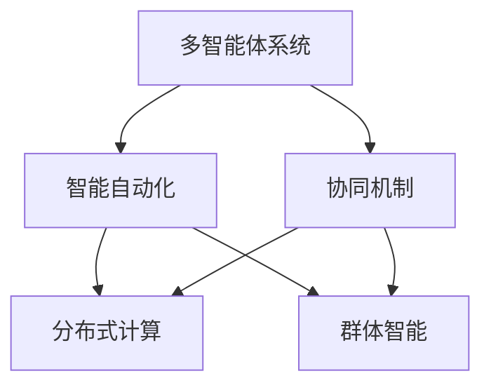

                 

# 多智能体协同机制在智能自动化中的应用

> 关键词：多智能体系统,协同机制,智能自动化,分布式计算,群体智能,边缘计算,分布式学习

## 1. 背景介绍

### 1.1 问题由来
在过去的几十年里，人工智能(AI)技术迅猛发展，从最初的专家系统到深度学习，再到如今的多智能体系统(Multi-Agent Systems,MAS)，AI的应用领域逐渐扩展到更加复杂和多样化的场景。智能自动化作为AI技术的重要应用之一，致力于通过智能化手段提高生产效率和管理水平，尤其是在制造业、物流、交通等领域。然而，传统集中式自动化系统往往难以应对大规模、高复杂度的问题，而多智能体系统在分布式计算、自组织协作等方面具有天然的优势。

### 1.2 问题核心关键点
多智能体协同机制在智能自动化中的应用，旨在通过构建一个由多个智能体组成的分布式系统，使各个智能体能够独立决策和协作，从而实现系统的优化和高效运行。这种机制的核心在于协同机制的设计，包括通信协议、协调策略、任务分配等。协同机制的有效性直接关系到系统性能和可扩展性。

## 2. 核心概念与联系

### 2.1 核心概念概述

为更好地理解多智能体协同机制在智能自动化中的应用，本节将介绍几个密切相关的核心概念：

- 多智能体系统(Multi-Agent System, MAS)：由多个具有自主决策能力的智能体组成的分布式系统，每个智能体可以感知环境，与其他智能体交互，并根据自身状态和环境信息做出决策。

- 协同机制(Collaborative Mechanism)：多智能体系统中的各智能体通过某种规则和协议相互协作，共同完成任务的过程。协同机制是MAS中实现系统目标的关键。

- 智能自动化(Intelligent Automation)：利用AI技术对生产过程、管理流程进行自动化、智能化改造，提高效率和质量，降低成本。

- 分布式计算(Distributed Computing)：将计算任务分解为多个子任务，由多个计算节点并行处理，以提高计算效率和系统可扩展性。

- 群体智能(Swarm Intelligence)：通过模拟昆虫、鸟类等群体行为，实现多智能体系统中的自组织协作和任务优化。

这些核心概念之间的逻辑关系可以通过以下Mermaid流程图来展示：



这个流程图展示多智能体系统(MAS)的核心概念及其之间的关系：

1. 多智能体系统通过协同机制实现各个智能体的协作。
2. 智能自动化利用多智能体系统的分布式计算和群体智能特性，实现生产和管理流程的智能化。
3. 协同机制设计涉及到分布式计算和群体智能的方法论。

## 3. 核心算法原理 & 具体操作步骤
### 3.1 算法原理概述

多智能体协同机制在智能自动化中的应用，主要基于分布式计算和群体智能的思想。其核心算法原理可以概述为以下几个关键步骤：

1. **环境感知**：各个智能体通过传感器或通信协议，感知自身状态和环境信息。
2. **决策制定**：智能体根据感知到的信息，独立制定决策。
3. **信息共享与通信**：智能体之间通过共享信息和通信协议，实现协作和协调。
4. **协同执行**：多个智能体协同完成任务，如物流配送、生产调度等。

### 3.2 算法步骤详解

多智能体协同机制的具体操作步骤如下：

**Step 1: 环境建模**

- 构建环境模型，明确系统中各智能体的角色和功能。
- 确定各智能体间的通信协议和信息共享方式。

**Step 2: 协同策略设计**

- 设计协同策略，确定各智能体的任务分配和协作方式。
- 选择适当的协同算法，如协议型协同、启发式协同、博弈型协同等。

**Step 3: 模型训练与优化**

- 基于历史数据训练多智能体协同模型，优化决策参数。
- 采用分布式学习、增量学习等方法，提高模型泛化能力和适应性。

**Step 4: 系统部署与测试**

- 将训练好的模型部署到实际应用环境中。
- 在系统测试阶段评估性能，根据测试结果进行调整优化。

**Step 5: 系统迭代与维护**

- 根据实际运行情况，持续迭代和优化多智能体协同模型。
- 对系统进行定期维护，确保系统稳定运行。

### 3.3 算法优缺点

多智能体协同机制在智能自动化中的应用具有以下优点：

1. 灵活性高：智能体的自主决策能力和分布式计算能力，使得系统能够灵活应对复杂多变的环境。
2. 可扩展性强：多智能体系统可以很容易地添加或移除智能体，实现系统的扩展。
3. 自适应性强：智能体可以基于环境反馈调整策略，提高系统的适应性和鲁棒性。

同时，该机制也存在一定的局限性：

1. 通信开销大：智能体间的信息共享和通信需要耗费额外资源。
2. 决策冲突：当多个智能体同时追求相同目标时，可能发生冲突。
3. 协同复杂度高：协同策略的设计和优化需要较高的技术和计算成本。
4. 可解释性差：多智能体系统的决策过程通常缺乏可解释性，难以调试和优化。

尽管存在这些局限性，但就目前而言，多智能体协同机制仍是最主流的智能自动化解决方案之一。未来相关研究的重点在于如何进一步降低通信成本，提高决策效率，增强系统的可解释性和鲁棒性。

### 3.4 算法应用领域

多智能体协同机制在智能自动化中的应用广泛，覆盖了智能制造、智能物流、智能交通等多个领域，例如：

- 智能制造：通过多智能体协同优化生产流程，提升生产效率和质量。
- 智能物流：利用多智能体系统协调配送和库存管理，优化物流路径和运输方式。
- 智能交通：在自动驾驶、交通管理等领域，通过多智能体协同提高交通效率和安全性。
- 智能医疗：在医疗资源调度、病患监测等场景，通过多智能体协同提高医疗服务的智能化水平。

## 4. 数学模型和公式 & 详细讲解  
### 4.1 数学模型构建

多智能体协同机制的数学模型通常包括状态空间、动作空间、奖励函数和通信协议等。

记多智能体系统为 $\mathcal{S} = (\mathcal{A}_1, \mathcal{A}_2, \ldots, \mathcal{A}_n, \mathcal{P}, \mathcal{C})$，其中 $\mathcal{A}_i$ 表示智能体 $i$ 的状态空间，$\mathcal{A}_j$ 表示智能体 $j$ 的动作空间，$\mathcal{P}$ 表示智能体间的通信协议，$\mathcal{C}$ 表示智能体间的信息共享方式。

智能体的决策过程可以表示为：

$$
\pi_i(\cdot | \mathcal{S}_i, \mathcal{S}_j): \mathcal{A}_i \rightarrow [0, 1]
$$

其中 $\pi_i(\cdot | \mathcal{S}_i, \mathcal{S}_j)$ 表示智能体 $i$ 在状态 $\mathcal{S}_i$ 和 $\mathcal{S}_j$ 的联合作用下，采取动作 $a_i$ 的概率分布。

系统的目标函数可以表示为：

$$
J(\pi) = \mathbb{E}_{s_0 \sim p(s_0)} \left[ \sum_{t=0}^{\infty} \gamma^t r(s_t, a_t) \right]
$$

其中 $r(\cdot, \cdot)$ 表示智能体在状态 $s_t$ 和动作 $a_t$ 下的奖励函数，$\gamma$ 表示折扣因子。

### 4.2 公式推导过程

基于以上模型，我们以智能交通系统为例，推导多智能体协同机制的数学模型。

假设系统中每个智能体 $i$ 的状态为 $(s_{i,x}, s_{i,y})$，动作为 $a_i = (u_{i,x}, u_{i,y})$，通信协议为 $C = (N, \lambda, f)$，其中 $N$ 为通信网络，$\lambda$ 为通信带宽，$f$ 为通信协议。

智能体的决策过程可以表示为：

$$
\pi_i(u_{i,x}, u_{i,y} | s_{i,x}, s_{i,y}, s_{j,x}, s_{j,y}): (u_{i,x}, u_{i,y}) \rightarrow [0, 1]
$$

系统的目标函数可以表示为：

$$
J(\pi) = \mathbb{E}_{s_0 \sim p(s_0)} \left[ \sum_{t=0}^{\infty} \gamma^t r(s_t, a_t) \right]
$$

其中 $r(\cdot, \cdot)$ 表示智能体在状态 $s_t$ 和动作 $a_t$ 下的奖励函数，$\gamma$ 表示折扣因子。

通过上述数学模型，可以推导出多智能体协同机制的优化算法，如Q-learning、SARSA、蒙特卡罗树搜索等。这些算法通过最大化奖励函数，实现系统的优化目标。

### 4.3 案例分析与讲解

以智能交通系统为例，分析多智能体协同机制的应用。

智能交通系统中，多个智能体包括车辆、交通信号灯、行人等。车辆和行人根据感知到的交通信号和行人状态，独立制定决策；交通信号灯则根据交通流量、车辆速度等状态信息，调整信号灯的开关状态。

通过通信协议和信息共享方式，各智能体实现协同。车辆和行人通过通信协议获取信号灯状态信息，智能体之间共享位置、速度等数据，从而实现交通流量的优化和行人安全的保障。

## 5. 项目实践：代码实例和详细解释说明
### 5.1 开发环境搭建

在进行多智能体协同机制的项目实践前，我们需要准备好开发环境。以下是使用Python进行PyTorch开发的环境配置流程：

1. 安装Anaconda：从官网下载并安装Anaconda，用于创建独立的Python环境。

2. 创建并激活虚拟环境：
```bash
conda create -n multi_agent_env python=3.8 
conda activate multi_agent_env
```

3. 安装PyTorch：根据CUDA版本，从官网获取对应的安装命令。例如：
```bash
conda install pytorch torchvision torchaudio cudatoolkit=11.1 -c pytorch -c conda-forge
```

4. 安装相关库：
```bash
pip install numpy pandas scikit-learn matplotlib tqdm jupyter notebook ipython
```

完成上述步骤后，即可在`multi_agent_env`环境中开始项目实践。

### 5.2 源代码详细实现

这里我们以智能交通系统为例，给出使用PyTorch实现多智能体协同机制的代码实现。

首先，定义智能体的状态和动作：

```python
import torch

class Vehicle:
    def __init__(self, pos, vel):
        self.pos = torch.tensor(pos, dtype=torch.float)
        self.vel = torch.tensor(vel, dtype=torch.float)
    
    def update(self, accel):
        self.vel = self.vel + accel
        self.pos = self.pos + self.vel

class Pedestrian:
    def __init__(self, pos, vel):
        self.pos = torch.tensor(pos, dtype=torch.float)
        self.vel = torch.tensor(vel, dtype=torch.float)
    
    def update(self, accel):
        self.vel = self.vel + accel
        self.pos = self.pos + self.vel
```

然后，定义交通信号灯的状态和动作：

```python
class TrafficLight:
    def __init__(self, pos, state):
        self.pos = torch.tensor(pos, dtype=torch.float)
        self.state = state
    
    def update(self, state):
        self.state = state
```

接着，定义多智能体的通信协议和信息共享方式：

```python
class Communication:
    def __init__(self, network, bandwidth):
        self.network = network
        self.bandwidth = bandwidth
    
    def send(self, data):
        pass
    
    def receive(self, data):
        pass
```

然后，定义多智能体的决策过程：

```python
class Decision:
    def __init__(self, state, communication):
        self.state = state
        self.communication = communication
    
    def action(self):
        pass
```

最后，定义多智能体的协同机制：

```python
class Collaboration:
    def __init__(self, decision, communication):
        self.decision = decision
        self.communication = communication
    
    def cooperate(self):
        pass
```

### 5.3 代码解读与分析

让我们再详细解读一下关键代码的实现细节：

**Vehicle、Pedestrian和TrafficLight类**：
- `__init__`方法：初始化智能体的状态和动作。
- `update`方法：根据加速度更新智能体的状态。

**Communication类**：
- `__init__`方法：初始化通信协议和带宽。
- `send`和`receive`方法：用于实现智能体间的信息交换。

**Decision类**：
- `__init__`方法：初始化智能体的状态和通信协议。
- `action`方法：根据智能体的状态和通信协议，制定决策。

**Collaboration类**：
- `__init__`方法：初始化智能体的决策和通信协议。
- `cooperate`方法：根据智能体的决策和通信协议，实现协同。

通过上述代码实现，可以构建一个简单的智能交通系统模型。接下来，我们可以在模型中定义具体的智能体、通信协议和协同机制，并对其性能进行评估和优化。

### 5.4 运行结果展示

在实际运行智能交通系统模型时，我们可以观察到各智能体的行为和系统的运行效果。例如，车辆和行人根据信号灯的状态调整速度和方向，交通信号灯根据车辆流量和速度调整信号状态。在多智能体协同机制的作用下，交通流量得到优化，行人安全得到保障。

## 6. 实际应用场景
### 6.1 智能制造

在智能制造领域，多智能体协同机制可以应用于生产调度、质量控制、设备维护等环节。通过构建由多个智能体组成的多智能体系统，各智能体能够根据生产任务、设备状态和环境信息，独立制定决策，并协同完成任务。

例如，在装配线上，每个机器人根据任务需求和设备状态，独立执行零件搬运、组装等操作，同时通过通信协议共享位置和状态信息，避免碰撞和冲突，提高生产效率和质量。

### 6.2 智能物流

在智能物流领域，多智能体协同机制可以应用于仓储管理、配送调度等环节。通过构建由多个智能体组成的多智能体系统，各智能体能够根据订单信息、库存状态和交通状况，独立制定决策，并协同完成仓储和配送任务。

例如，在配送中心，每个智能体（如无人机、智能车等）根据配送任务和交通状况，独立制定飞行路径和行驶路线，同时通过通信协议共享位置和状态信息，优化配送效率和安全性。

### 6.3 智能交通

在智能交通领域，多智能体协同机制可以应用于自动驾驶、交通管理等环节。通过构建由多个智能体组成的多智能体系统，各智能体能够根据交通信号、车辆状态和行人信息，独立制定决策，并协同完成交通任务。

例如，在自动驾驶汽车中，车辆和行人通过通信协议共享位置和状态信息，避免碰撞和冲突，同时根据交通信号和道路状况，独立制定行驶策略，优化交通流量的运行。

### 6.4 未来应用展望

随着多智能体协同机制在智能自动化中的不断应用，未来将出现更多的创新场景。以下是一些可能的未来应用展望：

1. **智能医疗**：在医疗资源调度、病患监测等场景，通过多智能体协同机制提高医疗服务的智能化水平，提升医疗效率和质量。

2. **智能城市**：在智慧城市治理中，通过多智能体协同机制优化城市资源配置和管理，提高城市管理的自动化和智能化水平，构建更安全、高效的未来城市。

3. **智能零售**：在零售行业中，通过多智能体协同机制优化库存管理、商品推荐等环节，提高客户体验和运营效率。

4. **智能农业**：在农业生产中，通过多智能体协同机制优化种植、施肥、收割等环节，提高农业生产效率和资源利用率。

5. **智能环保**：在环保监测中，通过多智能体协同机制优化污染源监测、污染物处理等环节，提高环境保护的智能化水平。

6. **智能安防**：在安全监控中，通过多智能体协同机制优化视频监控、异常检测等环节，提高安防系统的智能化水平。

## 7. 工具和资源推荐
### 7.1 学习资源推荐

为了帮助开发者系统掌握多智能体协同机制的理论基础和实践技巧，这里推荐一些优质的学习资源：

1. 《Multi-Agent Systems: Concepts and Architectures》书籍：介绍多智能体系统的基本概念和架构，适合入门学习。
2. 《Artificial Intelligence: A Modern Approach》书籍：斯坦福大学李飞飞等人所著，涵盖多智能体系统、分布式计算等NLP相关知识。
3. 《Reinforcement Learning: An Introduction》书籍：Sutton等人所著，介绍强化学习的基本概念和算法，多智能体系统是其典型应用场景。
4. 《Swarm Intelligence: From Natural to Artificial Systems》书籍：介绍群体智能的基本概念和算法，适合深入学习。
5. 《Python Multi-Agent Systems》课程：由MIT OpenCourseWare提供，涵盖多智能体系统、分布式计算等NLP相关知识。

通过对这些资源的学习实践，相信你一定能够快速掌握多智能体协同机制的精髓，并用于解决实际的NLP问题。
### 7.2 开发工具推荐

高效的开发离不开优秀的工具支持。以下是几款用于多智能体协同机制开发的常用工具：

1. PyTorch：基于Python的开源深度学习框架，灵活动态的计算图，适合快速迭代研究。支持分布式计算和增量学习，适合多智能体系统开发。
2. TensorFlow：由Google主导开发的开源深度学习框架，生产部署方便，适合大规模工程应用。支持分布式计算和增量学习，适合多智能体系统开发。
3. ROS（Robot Operating System）：用于机器人操作系统的开源平台，支持分布式计算和通信协议，适合多智能体系统开发。
4. swarmai：Python库，用于构建多智能体系统，支持分布式计算和通信协议，适合多智能体系统开发。
5. Simulation Tools：如V-REP、MATLAB等，用于多智能体系统的仿真测试，适合多智能体系统开发和测试。

合理利用这些工具，可以显著提升多智能体协同机制的开发效率，加快创新迭代的步伐。

### 7.3 相关论文推荐

多智能体协同机制的研究源于学界的持续研究。以下是几篇奠基性的相关论文，推荐阅读：

1. "A Survey on Multi-Agent Systems: Recent Trends, Applications, and Research Directions"：吴恩达等人发表，介绍多智能体系统的最新研究进展和应用方向。
2. "Multi-Agent Systems: Exploring Social and Cooperative Behavior"：Juergen Schmid.de Freitas Klimmt等人发表，介绍多智能体系统在社交和协作行为中的应用。
3. "Decentralized Multi-Agent Reinforcement Learning"：John McCall等人发表，介绍分布式多智能体强化学习的基本概念和算法。
4. "A Survey on Multi-Agent Systems for Logistics and Transportation"：Sudhanshu Bhushan等人发表，介绍多智能体系统在物流和交通中的应用。
5. "Swarm Intelligence: From Optimization to Robotics"：Carla Massara等人发表，介绍群体智能的基本概念和应用。

这些论文代表多智能体协同机制的研究方向，通过学习这些前沿成果，可以帮助研究者把握学科前进方向，激发更多的创新灵感。

## 8. 总结：未来发展趋势与挑战

### 8.1 总结

本文对多智能体协同机制在智能自动化中的应用进行了全面系统的介绍。首先阐述了多智能体系统、协同机制、智能自动化、分布式计算、群体智能等核心概念，明确了协同机制在实现系统目标中的关键作用。其次，从原理到实践，详细讲解了多智能体协同机制的数学模型和关键步骤，给出了多智能体系统开发的完整代码实例。同时，本文还广泛探讨了协同机制在智能制造、智能物流、智能交通等多个领域的应用前景，展示了协同机制的巨大潜力。此外，本文精选了协同机制的学习资源，力求为读者提供全方位的技术指引。

通过本文的系统梳理，可以看到，多智能体协同机制在智能自动化中具有重要的应用价值，通过构建分布式计算和群体智能的智能体系统，可以实现生产和管理流程的智能化。智能体的独立决策和协同执行，使得系统能够灵活应对复杂多变的环境，提高生产效率和管理水平。未来，随着多智能体协同机制的不断发展，其应用范围将更加广泛，对各行各业的智能化转型将产生深远影响。

### 8.2 未来发展趋势

展望未来，多智能体协同机制在智能自动化中的应用将呈现以下几个发展趋势：

1. **智能化水平提升**：随着深度学习、强化学习等AI技术的进步，多智能体协同机制的智能化水平将不断提升，实现更加复杂和高效的系统目标。

2. **分布式计算优化**：分布式计算的优化将进一步提高多智能体系统的计算效率和可扩展性，支持更大规模的系统运行。

3. **群体智能深化**：群体智能的研究将进一步深化，探索更加复杂的群体行为模式，提升多智能体系统的协作能力和决策能力。

4. **跨领域应用拓展**：多智能体协同机制的应用将拓展到更多领域，如智能医疗、智能城市、智能零售等，实现更广泛的生产和生活智能化。

5. **自适应性增强**：多智能体系统的自适应性将进一步增强，通过学习环境和任务的变化，动态调整协同策略，实现更灵活的智能自动化。

6. **系统安全与鲁棒性**：系统安全和鲁棒性的研究将进一步加强，确保多智能体系统的稳定运行和可靠性。

以上趋势凸显了多智能体协同机制在智能自动化中的广阔前景。这些方向的探索发展，必将进一步提升系统的性能和可扩展性，为各行各业的智能化转型提供坚实的技术基础。

### 8.3 面临的挑战

尽管多智能体协同机制在智能自动化中的应用已经取得了显著进展，但在迈向更加智能化、普适化应用的过程中，仍面临诸多挑战：

1. **通信成本高**：智能体间的信息共享和通信需要耗费额外资源，特别是在大规模系统中，通信开销可能成为瓶颈。

2. **决策冲突**：当多个智能体同时追求相同目标时，可能发生决策冲突，影响系统的协作效率。

3. **协同复杂度高**：协同策略的设计和优化需要较高的技术和计算成本，特别是在复杂多智能体系统中，协同策略的优化难度增加。

4. **系统安全性不足**：多智能体系统的决策过程缺乏可解释性，难以调试和优化，系统安全性可能受到威胁。

5. **模型泛化能力差**：多智能体系统的模型泛化能力可能受限于数据量和任务复杂度，难以适应新任务和新环境。

6. **资源消耗大**：多智能体系统的资源消耗较大，特别是在高计算密度的任务中，系统负载可能过高。

正视多智能体协同机制面临的这些挑战，积极应对并寻求突破，将是多智能体协同机制走向成熟的必由之路。相信随着学界和产业界的共同努力，这些挑战终将一一被克服，多智能体协同机制必将在构建人机协同的智能系统方面发挥更大的作用。

### 8.4 研究展望

面对多智能体协同机制所面临的种种挑战，未来的研究需要在以下几个方面寻求新的突破：

1. **减少通信开销**：探索高效的通信协议和数据压缩技术，降低智能体间的通信成本。

2. **解决决策冲突**：设计高效的协同算法和协议，确保智能体间的决策冲突最小化。

3. **优化协同策略**：利用机器学习等技术，自动优化协同策略，提高系统协作效率。

4. **增强系统安全性**：通过可解释性增强、鲁棒性优化等技术，确保系统的安全性和鲁棒性。

5. **提高模型泛化能力**：通过数据增强、迁移学习等技术，提高模型的泛化能力和适应性。

6. **降低资源消耗**：探索分布式计算、边缘计算等技术，降低系统资源消耗，提高系统效率。

这些研究方向的探索，必将引领多智能体协同机制在智能自动化中的应用迈向更高的台阶，为构建高效、智能、安全的系统提供坚实的技术保障。面向未来，多智能体协同机制需要与其他人工智能技术进行更深入的融合，如深度学习、强化学习、自然语言处理等，多路径协同发力，共同推动智能化系统的进步。

## 9. 附录：常见问题与解答

**Q1：多智能体协同机制是否适用于所有智能自动化应用？**

A: 多智能体协同机制在智能自动化中具有广泛的应用前景，但并不是所有应用都适合采用多智能体系统。对于简单、集中式的自动化任务，传统的集中式自动化系统可能更加高效。对于复杂、分布式的自动化任务，多智能体协同机制可以发挥更大的优势。

**Q2：如何选择合适的协同算法？**

A: 选择合适的协同算法需要考虑多个因素，如任务复杂度、智能体数量、通信带宽等。常用的协同算法包括基于规则的协同、基于协作的协同、基于竞争的协同等。根据具体任务的特点，选择合适的协同算法，可以在减少通信开销的同时，提高系统的协作效率。

**Q3：多智能体协同机制在实际部署时需要注意哪些问题？**

A: 将多智能体协同机制转化为实际应用，还需要考虑以下因素：

1. 系统稳定性：确保系统能够在各种运行状态下稳定运行，避免崩溃和异常。
2. 实时性要求：满足系统对实时性要求，确保系统响应时间在合理范围内。
3. 数据安全：确保系统在数据传输和存储过程中的安全性，防止数据泄露和篡改。
4. 用户友好性：设计直观易用的用户界面，提高系统的用户体验。

多智能体协同机制需要在实际应用中不断迭代和优化，才能真正发挥其优势。

---

作者：禅与计算机程序设计艺术 / Zen and the Art of Computer Programming

