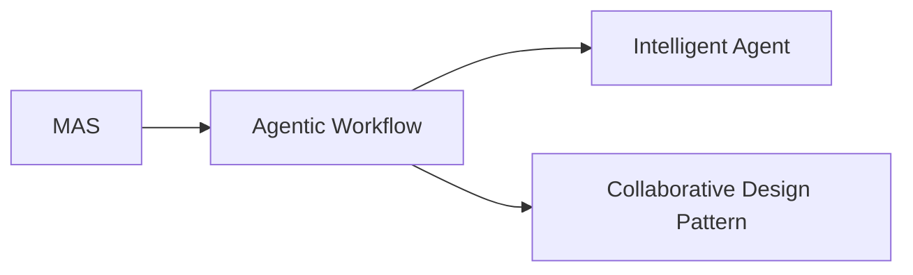
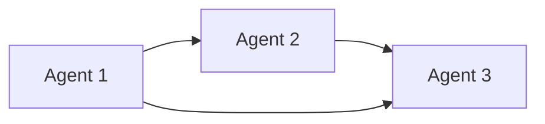
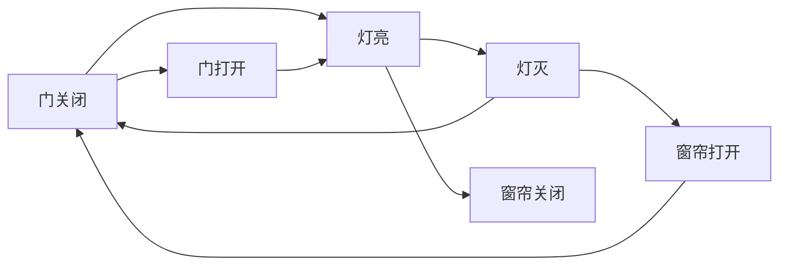

                 

# 多智能体协同设计模式在 Agentic Workflow 中的应用

> 关键词：多智能体系统, 协同设计, Agentic Workflow, 分布式协作, 系统集成

## 1. 背景介绍

在现代软件开发中，复杂系统的开发已经超出了传统单体应用的范畴。分布式、异构的系统越来越多，这些系统往往由多个组件、子系统、微服务构成，各个组件之间存在着复杂的依赖关系。为了提高系统的灵活性和可维护性，团队采取了微服务架构，将系统拆分成多个可独立部署、高内聚低耦合的服务。然而，微服务架构在带来好处的同时，也带来了新的挑战：如何高效地协调和同步多个微服务之间的活动，如何保证各部分协同工作，以实现系统的整体目标。

Agentic Workflow（智能工作流）正是在这种背景下应运而生。它通过引入多智能体系统（Multi-Agent System, MAS）的概念，将系统看作是由多个智能体共同协作完成目标的过程。每个智能体代表系统中的一个组件，通过协作与交互，共同完成任务。多智能体协同设计模式（Multi-Agent Collaborative Design Pattern, MCDP）是Agentic Workflow中的核心思想，它通过定义一系列设计模式，指导多智能体系统的设计和实现，提升系统的协作效率和开发效率。

本文将对多智能体协同设计模式在Agentic Workflow中的应用进行深入探讨，从背景、概念、算法、实际应用等多个方面展开。

## 2. 核心概念与联系

### 2.1 核心概念概述

为了更清晰地理解Agentic Workflow和多智能体协同设计模式，本节将首先介绍几个关键概念：

- **多智能体系统（MAS）**：由多个智能体（Agent）组成的分布式系统，每个智能体具有自主决策和行动的能力，通过交互实现系统目标。MAS广泛应用于任务规划、供应链管理、智能机器人等领域。

- **Agentic Workflow**：一种系统设计和实现框架，通过多智能体系统来协调和调度各个微服务之间的活动，以实现系统的整体目标。

- **智能体（Agent）**：代表系统中的功能模块或服务，具有自主决策和行动的能力，通过交互实现系统目标。

- **协同设计模式（Collaborative Design Pattern）**：在多智能体系统中，用于指导智能体之间的交互和协作的一系列设计原则和模式。

这些概念之间的关系可以由以下Mermaid流程图表示：



这个流程图展示了MAS、Agentic Workflow和智能体之间的联系：MAS是Agentic Workflow的基础架构，智能体是MAS的核心单元，而协同设计模式指导智能体之间的协作行为。

### 2.2 核心概念原理和架构的 Mermaid 流程图

以下是一个简单的MAS系统架构，展示了智能体之间如何通过消息传递实现协作：



在这个简单的架构中，Agent 1、Agent 2和Agent 3通过消息传递实现协作，共同完成任务。每个智能体可以根据接收到的消息，自主决策并执行相应的操作。

## 3. 核心算法原理 & 具体操作步骤

### 3.1 算法原理概述

Agentic Workflow中的多智能体协同设计模式基于MAS的协作理论，通过定义一系列设计模式，指导各个智能体之间的交互和协作行为。常见的协同设计模式包括：

- **集中式调度模式**：所有智能体的调度由一个中央控制器完成，负责分配任务和协调各个智能体的动作。
- **分布式调度模式**：每个智能体自主决策和调度，通过交互实现整体目标。
- **混合调度模式**：结合集中式和分布式调度，根据具体情况动态调整调度策略。

这些模式通过定义智能体之间的通信协议、交互机制、决策规则等，指导系统的设计和实现，提升协作效率和系统稳定性。

### 3.2 算法步骤详解

Agentic Workflow和多智能体协同设计模式的具体操作步骤包括以下几个关键步骤：

**Step 1: 系统需求分析和设计**

- 定义系统的整体目标和需求。
- 分析系统的各个组成部分，确定需要哪些智能体来实现这些部分。
- 设计智能体之间的交互协议，确定通信方式和数据格式。
- 定义协同设计模式，确定各智能体的协作机制和决策规则。

**Step 2: 实现智能体**

- 实现智能体的功能模块，定义其输入、输出和状态。
- 实现智能体之间的通信协议，确保数据传输正确。
- 实现智能体的决策规则，定义其交互行为和协作策略。

**Step 3: 集成和测试**

- 将各个智能体集成到一个系统中，确保它们能够按照设计模式协同工作。
- 进行系统测试，验证各智能体之间的协作效果和系统整体的性能。
- 根据测试结果进行优化和调整，确保系统能够稳定运行。

### 3.3 算法优缺点

多智能体协同设计模式在Agentic Workflow中具有以下优点：

- **灵活性**：智能体可以根据需求进行灵活设计和实现，适应不同的应用场景。
- **可扩展性**：通过增加或减少智能体，可以扩展系统的规模和功能。
- **容错性**：智能体之间的独立性使得系统具有一定的容错能力，部分智能体的故障不会影响整个系统。

同时，也存在一些缺点：

- **复杂性**：设计和管理多智能体系统较为复杂，需要考虑智能体之间的交互和协作机制。
- **通信开销**：智能体之间的通信会增加系统的开销，需要合理设计通信协议和数据格式。
- **协调难度**：不同智能体之间的协作需要协调，可能会出现冲突和延迟，需要有效的调度和管理。

### 3.4 算法应用领域

多智能体协同设计模式在Agentic Workflow中主要应用于以下领域：

- **分布式任务调度**：多个微服务之间的任务调度和管理。
- **智能机器人协作**：多个智能体之间的协调和协作，实现复杂任务。
- **供应链管理**：供应链中各个环节的智能体之间的协作和协调。
- **智能家居系统**：家庭中的各个智能设备之间的协作，实现智能化家居。

## 4. 数学模型和公式 & 详细讲解 & 举例说明

### 4.1 数学模型构建

Agentic Workflow中的协同设计模式可以通过数学模型进行建模。假设系统中有 $n$ 个智能体，每个智能体有 $m$ 种状态和 $k$ 个动作。设 $S$ 为智能体的状态集合，$A$ 为动作集合，$P$ 为状态转移概率矩阵，$R$ 为奖励矩阵。则系统可以表示为如下马尔可夫决策过程（MDP）：

$$
(S, A, P, R)
$$

其中，$S$ 为状态空间，$A$ 为动作空间，$P$ 为状态转移概率矩阵，$R$ 为奖励矩阵。

### 4.2 公式推导过程

在MDP中，每个智能体的决策问题可以表示为求解最优策略 $π$，使得期望奖励最大化：

$$
\max_{π} \mathbb{E}[\sum_{t=0}^{T} R_{t+1}]
$$

其中 $T$ 为时间步长。

通过求解动态规划方程：

$$
V^{*}(s) = \max_{a} (R(s, a) + \sum_{s'} P(s', s) V^{*}(s'))
$$

可以找到最优策略 $π$，使得期望奖励最大化。

### 4.3 案例分析与讲解

假设有一个简单的智能家居系统，包含三个智能体：智能门锁、智能灯泡和智能窗帘。每个智能体可以感知当前状态（门是否关闭、灯光是否亮起、窗帘是否关闭），并执行相应的动作（打开门锁、关闭灯泡、打开窗帘）。目标是在智能门锁关闭时，智能灯泡和智能窗帘也处于关闭状态。

该系统的状态转移图如下所示：



该系统的奖励矩阵为：

$$
R = \begin{bmatrix}
0 & 0 & 0 & -1 & 0 & 1 \\
0 & 0 & 0 & 1 & 0 & 0 \\
0 & 0 & 0 & -1 & 0 & 1 \\
0 & 0 & 0 & 1 & 0 & 0 \\
0 & 0 & 0 & -1 & 0 & 1 \\
0 & 0 & 0 & 1 & 0 & 0 
\end{bmatrix}
$$

其中，智能体处于正确状态时获得奖励 0，处于错误状态时获得奖励 -1。

通过求解动态规划方程，可以求得最优策略 $π$，使得期望奖励最大化。

## 5. 项目实践：代码实例和详细解释说明

### 5.1 开发环境搭建

在进行Agentic Workflow和多智能体协同设计模式的开发前，我们需要准备好开发环境。以下是使用Python进行PyTorch开发的环境配置流程：

1. 安装Anaconda：从官网下载并安装Anaconda，用于创建独立的Python环境。

2. 创建并激活虚拟环境：
```bash
conda create -n pytorch-env python=3.8 
conda activate pytorch-env
```

3. 安装PyTorch：根据CUDA版本，从官网获取对应的安装命令。例如：
```bash
conda install pytorch torchvision torchaudio cudatoolkit=11.1 -c pytorch -c conda-forge
```

4. 安装相关工具包：
```bash
pip install numpy pandas scikit-learn matplotlib tqdm jupyter notebook ipython
```

完成上述步骤后，即可在`pytorch-env`环境中开始开发实践。

### 5.2 源代码详细实现

这里我们以一个简单的智能家居系统为例，展示如何使用Python和PyTorch实现多智能体协同设计模式。

首先，定义智能体的状态和动作：

```python
import torch
import torch.nn as nn
import torch.optim as optim

class Agent(nn.Module):
    def __init__(self, n_states, n_actions, n_neurons):
        super(Agent, self).__init__()
        self.fc1 = nn.Linear(n_states, n_neurons)
        self.fc2 = nn.Linear(n_neurons, n_actions)
        self.relu = nn.ReLU()
    
    def forward(self, x):
        x = self.fc1(x)
        x = self.relu(x)
        x = self.fc2(x)
        return x
```

然后，定义智能体的决策函数：

```python
class QNetwork(nn.Module):
    def __init__(self, n_states, n_actions, n_neurons):
        super(QNetwork, self).__init__()
        self.agent = Agent(n_states, n_actions, n_neurons)
        self.optimizer = optim.Adam(self.agent.parameters(), lr=0.001)
    
    def act(self, state, epsilon=0.1):
        if np.random.rand() < epsilon:
            return np.random.choice(self.agent.n_actions)
        with torch.no_grad():
            q_values = self.agent(state)
            return torch.argmax(q_values).item()
    
    def train(self, state, action, reward, next_state, done):
        q_values = self.agent(state)
        best_action_value = torch.zeros(1)
        if not done:
            best_action_value = self.agent(next_state)
        target = q_values.gather(1, torch.tensor([action]))
        target[0] = reward + (1 - done) * best_action_value
        loss = nn.functional.mse_loss(q_values, target)
        self.optimizer.zero_grad()
        loss.backward()
        self.optimizer.step()
```

接着，定义智能体之间的通信协议：

```python
class Communication:
    def __init__(self, n_agents):
        self.n_agents = n_agents
        self.agents = [None] * self.n_agents
    
    def add_agent(self, agent):
        self.agents.append(agent)
    
    def send(self, agent_index, message):
        self.agents[agent_index].send(message)
    
    def receive(self, agent_index):
        return self.agents[agent_index].receive()
```

最后，编写整个系统的逻辑：

```python
class Environment:
    def __init__(self, n_agents, n_states, n_actions, n_neurons):
        self.n_agents = n_agents
        self.n_states = n_states
        self.n_actions = n_actions
        self.n_neurons = n_neurons
        self.communication = Communication(n_agents)
        self.agents = [None] * self.n_agents
        for i in range(self.n_agents):
            self.agents[i] = QNetwork(n_states, n_actions, n_neurons)
            self.communication.add_agent(self.agents[i])
    
    def step(self, state):
        actions = []
        for i in range(self.n_agents):
            action = self.agents[i].act(state[i])
            actions.append(action)
        new_state = [state[i] for i in range(self.n_agents)]
        rewards = [0] * self.n_agents
        dones = [False] * self.n_agents
        for i in range(self.n_agents):
            new_state[i] = actions[i]
            rewards[i] = self.reward_function(new_state[i])
            if rewards[i] == 1:
                dones[i] = True
        return new_state, rewards, dones
    
    def reset(self):
        state = [0] * self.n_agents
        return state
    
    def reward_function(self, state):
        if state[0] == 0 and state[1] == 0 and state[2] == 0:
            return 1
        else:
            return 0
```

### 5.3 代码解读与分析

让我们再详细解读一下关键代码的实现细节：

**Agent类**：
- `__init__`方法：初始化智能体，定义其状态、动作和神经网络结构。
- `forward`方法：定义智能体的前向传播过程，计算动作值的输出。
- `act`方法：定义智能体的决策函数，根据当前状态和epsilon-greedy策略选择动作。
- `train`方法：定义智能体的训练过程，根据当前状态、动作、奖励和下一个状态，计算目标值并更新参数。

**QNetwork类**：
- `__init__`方法：初始化Q网络，定义智能体的神经网络结构和优化器。
- `act`方法：与Agent类的`act`方法类似，用于选择动作。
- `train`方法：定义Q网络的训练过程，根据当前状态、动作、奖励和下一个状态，计算目标值并更新参数。

**Communication类**：
- `__init__`方法：初始化通信协议，定义智能体数量和智能体列表。
- `add_agent`方法：向智能体列表中添加智能体。
- `send`方法：向指定智能体发送消息。
- `receive`方法：从指定智能体接收消息。

**Environment类**：
- `__init__`方法：初始化环境，定义智能体数量、状态、动作、神经元数量，以及通信协议和智能体列表。
- `step`方法：定义环境的更新过程，根据当前状态和动作计算下一个状态、奖励和done标志。
- `reset`方法：定义环境的重置过程，返回初始状态。
- `reward_function`方法：定义奖励函数，根据智能体的状态计算奖励值。

在以上代码中，我们实现了Agentic Workflow中的一个简单的智能家居系统。该系统通过多智能体协同设计模式，实现了智能门锁、智能灯泡和智能窗帘的协作。每个智能体通过Q网络进行决策，通过通信协议进行交互，最终实现了系统的整体目标。

## 6. 实际应用场景

### 6.1 智能家居系统

智能家居系统是Agentic Workflow和多智能体协同设计模式的经典应用场景之一。智能家居系统由多个智能设备组成，如智能门锁、智能灯泡、智能窗帘等，通过协同设计模式，这些智能设备可以共同协作，实现更加智能化的家居管理。

在智能家居系统中，智能门锁可以感知门是否关闭，智能灯泡可以感知灯光是否亮起，智能窗帘可以感知窗帘是否关闭。通过通信协议，这些智能设备可以互相交换信息，共同实现系统的整体目标，如在门关闭时，智能灯泡和智能窗帘也处于关闭状态。这种协同设计模式使得智能家居系统更加智能化和人性化。

### 6.2 供应链管理

供应链管理是另一个典型的Agentic Workflow和多智能体协同设计模式的应用场景。供应链中涉及到多个环节，如生产、运输、仓储、销售等，每个环节都可以看作一个智能体。通过协同设计模式，这些智能体可以共同协作，实现供应链的整体优化。

在供应链管理中，生产环节需要根据市场需求调整生产计划，运输环节需要根据生产计划调整运输计划，仓储环节需要根据生产计划和运输计划调整库存，销售环节需要根据市场需求和库存调整销售计划。通过通信协议，这些智能体可以互相交换信息，共同实现供应链的整体目标，如在需求增加时，生产、运输、仓储和销售环节可以协同工作，确保供应链的稳定和高效。

## 7. 工具和资源推荐

### 7.1 学习资源推荐

为了帮助开发者系统掌握Agentic Workflow和多智能体协同设计模式，这里推荐一些优质的学习资源：

1. **《Agentic Workflow: Design and Implementation》**：一本介绍Agentic Workflow和多智能体系统的经典书籍，涵盖多智能体系统的设计、实现和应用。

2. **Coursera的《Multi-Agent Systems》课程**：由斯坦福大学开设的NLP明星课程，讲解多智能体系统的概念、算法和应用。

3. **arXiv上的相关论文**：arXiv上发布的大量多智能体系统的论文，涵盖不同的应用场景和优化算法。

4. **Github上的开源项目**：Github上有很多开源的多智能体系统项目，可以借鉴和学习。

通过学习这些资源，相信你一定能够快速掌握Agentic Workflow和多智能体协同设计模式的精髓，并用于解决实际的系统问题。

### 7.2 开发工具推荐

高效的开发离不开优秀的工具支持。以下是几款用于Agentic Workflow和多智能体协同设计模式开发的常用工具：

1. **PyTorch**：基于Python的开源深度学习框架，灵活的计算图，适合快速迭代研究。

2. **TensorFlow**：由Google主导开发的开源深度学习框架，生产部署方便，适合大规模工程应用。

3. **Gym**：基于OpenAI的模拟环境，用于测试和训练多智能体系统。

4. **Jupyter Notebook**：Python的交互式开发环境，方便调试和展示实验结果。

5. **Ansible**：自动化运维工具，方便部署和管理多智能体系统。

合理利用这些工具，可以显著提升Agentic Workflow和多智能体协同设计模式的开发效率，加快创新迭代的步伐。

### 7.3 相关论文推荐

Agentic Workflow和多智能体协同设计模式的研究源于学界的持续研究。以下是几篇奠基性的相关论文，推荐阅读：

1. **Multi-Agent System: Concepts and Design**：Multi-Agent System领域的经典教材，详细讲解了MAS的概念、设计和实现。

2. **Multi-Agent Systems: A Tutorial**：斯坦福大学开设的NLP明星课程，讲解MAS的基本概念和应用。

3. **Collaborative Multi-Agent Learning in Diverse Environments**：介绍如何在多智能体系统中实现协作学习，优化系统性能。

4. **A Survey on Multi-Agent Systems for Supply Chain Management**：综述多智能体系统在供应链管理中的应用，介绍了不同的优化算法和协同设计模式。

这些论文代表了大语言模型微调技术的发展脉络。通过学习这些前沿成果，可以帮助研究者把握学科前进方向，激发更多的创新灵感。

## 8. 总结：未来发展趋势与挑战

### 8.1 总结

本文对Agentic Workflow和多智能体协同设计模式进行了全面系统的介绍。首先阐述了Agentic Workflow和多智能体协同设计模式的理论基础和应用背景，明确了协同设计模式在Agentic Workflow中的重要性。其次，从原理到实践，详细讲解了协同设计模式的数学模型和关键步骤，给出了Agentic Workflow的代码实例和详细解释。同时，本文还广泛探讨了协同设计模式在智能家居、供应链管理等多个领域的应用前景，展示了协同设计模式的广泛适用性。此外，本文精选了协同设计模式的学习资源，力求为读者提供全方位的技术指引。

通过本文的系统梳理，可以看到，Agentic Workflow和多智能体协同设计模式在NLP领域的应用前景广阔，为多智能体系统的设计和实现提供了新的思路和方法。这些技术有望在更广泛的领域得到应用，进一步提升系统的协作效率和开发效率，为智能技术的普及和应用带来新的突破。

### 8.2 未来发展趋势

展望未来，Agentic Workflow和多智能体协同设计模式将呈现以下几个发展趋势：

1. **自动化设计**：随着自动化工具和技术的进步，多智能体系统的设计和实现将更加高效。自动化设计工具可以帮助开发者快速构建和优化多智能体系统，提高协作效率。

2. **自适应学习**：Agentic Workflow中的智能体可以通过自适应学习机制，自动调整决策策略，适应不断变化的环境和任务。这将提升系统的鲁棒性和适应性。

3. **分布式计算**：随着分布式计算技术的进步，多智能体系统的计算能力将大幅提升。通过分布式计算，智能体可以更高效地协作和计算，提升系统的性能。

4. **跨领域应用**：Agentic Workflow和多智能体协同设计模式不仅应用于NLP领域，还将广泛应用于更多领域，如金融、制造、医疗等，提升这些领域的智能化水平。

5. **模型融合**：Agentic Workflow中的智能体可以与机器学习、深度学习等技术进行融合，提升系统的决策能力和协同效率。

以上趋势凸显了Agentic Workflow和多智能体协同设计模式在NLP领域的广阔前景。这些方向的探索发展，必将进一步提升多智能体系统的协作效率和开发效率，为智能技术的普及和应用带来新的突破。

### 8.3 面临的挑战

尽管Agentic Workflow和多智能体协同设计模式已经取得了瞩目成就，但在迈向更加智能化、普适化应用的过程中，它仍面临着诸多挑战：

1. **通信开销**：智能体之间的通信会增加系统的开销，需要合理设计通信协议和数据格式。

2. **协同难度**：不同智能体之间的协作需要协调，可能会出现冲突和延迟，需要有效的调度和管理。

3. **模型复杂性**：多智能体系统的设计和管理较为复杂，需要考虑智能体之间的交互和协作机制。

4. **可扩展性**：系统的可扩展性需要考虑智能体数量的增加，需要设计合理的通信协议和优化算法。

5. **安全性**：Agentic Workflow中的智能体可能会面临安全威胁，需要设计安全的通信协议和身份认证机制。

6. **鲁棒性**：系统需要具备鲁棒性，能够应对异常情况和网络故障。

正视Agentic Workflow和多智能体协同设计模式面临的这些挑战，积极应对并寻求突破，将是大语言模型微调走向成熟的必由之路。相信随着学界和产业界的共同努力，这些挑战终将一一被克服，Agentic Workflow和多智能体协同设计模式必将在构建人机协同的智能时代中扮演越来越重要的角色。

### 8.4 研究展望

面对Agentic Workflow和多智能体协同设计模式所面临的种种挑战，未来的研究需要在以下几个方面寻求新的突破：

1. **自动化设计工具**：开发更高效、更智能的自动化设计工具，帮助开发者快速构建和优化多智能体系统。

2. **自适应学习算法**：研究更加智能的自适应学习算法，使得Agentic Workflow中的智能体能够自动调整决策策略，适应不断变化的环境和任务。

3. **分布式计算技术**：探索更高效的分布式计算技术，提升多智能体系统的计算能力和协作效率。

4. **跨领域应用**：将Agentic Workflow和多智能体协同设计模式应用于更多领域，提升这些领域的智能化水平。

5. **模型融合**：研究多智能体系统与机器学习、深度学习等技术的融合，提升系统的决策能力和协同效率。

6. **安全性**：研究更加安全的通信协议和身份认证机制，提升Agentic Workflow中的智能体的安全性。

这些研究方向的探索，必将引领Agentic Workflow和多智能体协同设计模式技术迈向更高的台阶，为构建安全、可靠、可解释、可控的智能系统铺平道路。面向未来，Agentic Workflow和多智能体协同设计模式还需要与其他人工智能技术进行更深入的融合，如知识表示、因果推理、强化学习等，多路径协同发力，共同推动自然语言理解和智能交互系统的进步。只有勇于创新、敢于突破，才能不断拓展Agentic Workflow和多智能体协同设计模式的边界，让智能技术更好地造福人类社会。

## 9. 附录：常见问题与解答

**Q1：Agentic Workflow和多智能体协同设计模式是否适用于所有应用场景？**

A: Agentic Workflow和多智能体协同设计模式适用于大多数需要多个智能体协同工作的应用场景。然而，对于某些特殊的应用场景，如实时性要求极高或需要高度定制化的系统，可能还需要其他设计模式和架构来满足需求。

**Q2：如何在Agentic Workflow中实现智能体的协作？**

A: 在Agentic Workflow中，智能体的协作主要通过通信协议和协同设计模式实现。每个智能体可以感知当前状态，根据决策函数选择动作，并通过通信协议与其他智能体交换信息，共同实现系统的整体目标。

**Q3：Agentic Workflow和多智能体协同设计模式是否容易扩展？**

A: Agentic Workflow和多智能体协同设计模式的可扩展性较高，可以通过增加或减少智能体的数量来扩展系统的规模和功能。然而，系统的复杂性也会随之增加，需要设计合理的通信协议和优化算法。

**Q4：如何在Agentic Workflow中优化智能体的决策？**

A: 可以通过优化智能体的决策函数，引入更加智能的自适应学习算法，如强化学习、深度学习等，提升智能体的决策能力和协同效率。同时，还需要设计合理的奖励函数和状态转移概率，指导智能体的决策行为。

**Q5：Agentic Workflow和多智能体协同设计模式是否容易实现？**

A: Agentic Workflow和多智能体协同设计模式的实现需要一定的技术积累和开发经验。然而，随着自动化设计工具和优化算法的进步，多智能体系统的设计和实现将更加高效和灵活。开发者可以通过学习和借鉴现有成果，逐步掌握Agentic Workflow和多智能体协同设计模式的实现技巧。

总之，Agentic Workflow和多智能体协同设计模式在构建智能系统方面具有广阔的应用前景，能够显著提升系统的协作效率和开发效率。随着技术的不断进步和应用的不断深入，相信Agentic Workflow和多智能体协同设计模式将成为智能技术落地的重要手段，推动智能技术的普及和应用。

