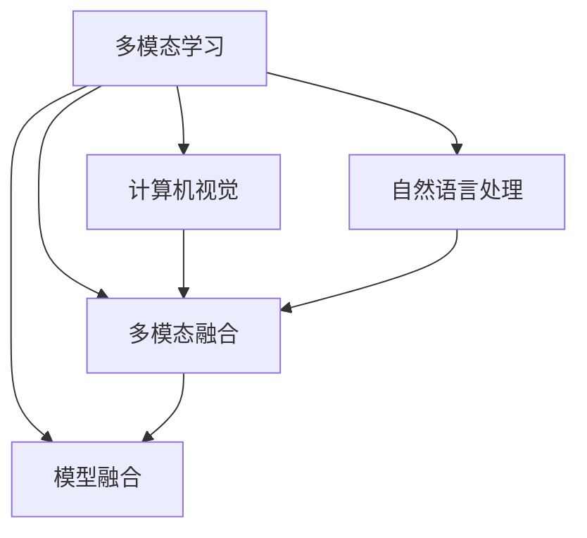
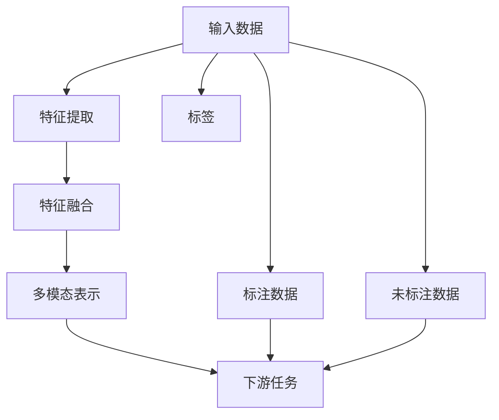

                 

# 多模态AI：图像与文本的融合

> 关键词：多模态学习,图像识别,自然语言处理,NLP,计算机视觉,深度学习,模型融合,特征表示

## 1. 背景介绍

在人工智能的探索和发展过程中，计算机视觉和自然语言处理(NLP)领域都取得了显著的进展。计算机视觉(CV)技术让机器具备了“看见”的能力，能够理解和分析图像和视频信息；而自然语言处理(NLP)技术则让机器具备了“理解”的能力，能够处理和生成文本信息。两者在技术上有着显著的分歧，但却都是信息处理的重要工具。

多模态学习(Multimodal Learning)的兴起，为图像和文本信息的融合提供了新的方法。通过多模态学习，机器能够在图像和文本之间建立双向映射，从而对复杂的多模态数据进行更深入的分析和理解。这不仅拓展了深度学习在实际应用中的范围，也为人机交互、智能系统构建提供了新的思路。

本文将详细介绍多模态学习的核心概念和关键算法，同时通过具体的案例分析，展示多模态学习在实际应用中的强大能力。

## 2. 核心概念与联系

### 2.1 核心概念概述

为了更好地理解多模态学习，我们先简要介绍一下与之相关的几个核心概念：

- **多模态学习(Multimodal Learning)**：指同时利用多种数据模态（如文本、图像、音频、视频等）进行深度学习的过程。通过融合多模态信息，提升模型的理解和推理能力。

- **计算机视觉(Computer Vision, CV)**：研究如何使计算机能够“看见”世界的技术。核心任务包括图像分类、目标检测、语义分割、姿态估计等。

- **自然语言处理(Natural Language Processing, NLP)**：研究如何让计算机能够“理解”文本信息。主要任务包括文本分类、情感分析、机器翻译、问答系统等。

- **多模态融合(Multimodal Fusion)**：指将不同模态的信息进行融合，提取高层次的语义和语境信息。常见的融合方法包括特征池化、注意力机制等。

- **模型融合(Model Fusion)**：指通过融合不同模型的输出结果，提升系统整体的性能和鲁棒性。常见的融合方式包括投票、加权平均、堆叠等。

这些概念之间的关系可以通过以下Mermaid流程图来展示：



### 2.2 核心概念原理和架构的 Mermaid 流程图

通过以下Mermaid流程图，我们可以看到多模态学习的基本架构：



其中：
- 输入数据包括图像、文本等多种模态。
- 特征提取模块将不同模态的数据转化为特征向量。
- 特征融合模块将这些特征向量进行融合，得到多模态表示。
- 下游任务可以是图像分类、文本分类、多模态匹配等。
- 标注数据用于训练模型，未标注数据用于模型泛化。

这个流程图展示了多模态学习的基本流程和架构。

## 3. 核心算法原理 & 具体操作步骤

### 3.1 算法原理概述

多模态学习的主要目标是通过融合不同模态的信息，提升模型的理解和推理能力。常见的方法包括特征池化、注意力机制、多模态嵌入等。这里以特征池化为例，简要介绍多模态学习的算法原理。

特征池化是一种简单有效的多模态融合方法，它将不同模态的特征进行加权平均，得到融合后的特征向量。假设文本和图像的特征向量分别为 $\text{F}_{\text{text}}$ 和 $\text{F}_{\text{img}}$，则特征池化的过程可以表示为：

$$
\text{F}_{\text{fused}} = \lambda_{\text{text}} \cdot \text{F}_{\text{text}} + \lambda_{\text{img}} \cdot \text{F}_{\text{img}}
$$

其中，$\lambda_{\text{text}}$ 和 $\lambda_{\text{img}}$ 为文本和图像的权重，通常需要通过交叉验证等方式优化选择。

### 3.2 算法步骤详解

以下是使用特征池化方法进行多模态融合的详细步骤：

1. **数据准备**：收集标注的图像和文本数据，并将其分为训练集和测试集。

2. **特征提取**：使用预训练的图像和文本编码器，分别对图像和文本进行特征提取，得到高维特征向量。

3. **特征融合**：将提取出的特征向量进行加权平均，得到融合后的特征向量。

4. **模型训练**：使用融合后的特征向量进行下游任务的训练，如分类、检测等。

5. **模型评估**：在测试集上评估模型的性能，包括准确率、召回率、F1-score等指标。

### 3.3 算法优缺点

多模态学习的优势在于：

1. **提升模型的泛化能力**：融合多模态信息，可以使模型更加全面地理解输入数据，从而提升模型的泛化能力。

2. **减少数据依赖**：相对于单模态学习，多模态学习可以利用更多的数据源，减少对单一数据集的依赖。

3. **增加模型鲁棒性**：多模态学习可以通过不同模态的信息互补，提高模型的鲁棒性和抗干扰能力。

然而，多模态学习也存在一些局限性：

1. **计算资源消耗大**：多模态学习需要同时处理多种数据模态，计算资源消耗较大。

2. **数据标注成本高**：多模态学习需要同时标注多种数据模态，标注成本较高。

3. **融合技术复杂**：多模态融合技术复杂，需要选择合适的融合方式和优化参数。

4. **模型复杂度高**：多模态模型通常比单模态模型更加复杂，训练和推理速度较慢。

### 3.4 算法应用领域

多模态学习在多个领域都有广泛的应用，以下是几个典型的应用场景：

- **智能医疗**：通过融合病人的医学影像和病历信息，帮助医生进行诊断和治疗决策。

- **智能安防**：通过融合视频图像和音频信息，提升安防系统的识别能力和响应速度。

- **智能制造**：通过融合设备状态数据和传感器数据，实现设备状态监测和故障预测。

- **自动驾驶**：通过融合摄像头图像、雷达数据和GPS信息，实现精准的定位和导航。

- **虚拟现实**：通过融合用户的手部动作、面部表情和语音信息，提升虚拟现实系统的交互体验。

这些应用场景展示了多模态学习在现实世界中的巨大潜力。

## 4. 数学模型和公式 & 详细讲解 & 举例说明

### 4.1 数学模型构建

假设有一个图像和文本结合的多模态数据集，其中图像为 $I = \{I_1, I_2, ..., I_M\}$，文本为 $T = \{T_1, T_2, ..., T_M\}$。我们可以使用图像特征编码器 $F_{\text{img}}$ 和文本特征编码器 $F_{\text{text}}$，将图像和文本分别转换为高维特征向量 $I_F$ 和 $T_F$。

多模态融合的目标是将这两个高维特征向量融合，得到一个多模态表示 $M_F$。这里采用特征池化方法，可以得到：

$$
M_F = \lambda_{\text{img}} \cdot I_F + \lambda_{\text{text}} \cdot T_F
$$

其中，$\lambda_{\text{img}}$ 和 $\lambda_{\text{text}}$ 为图像和文本的权重。

### 4.2 公式推导过程

在多模态融合中，选择合适的权重 $\lambda_{\text{img}}$ 和 $\lambda_{\text{text}}$ 非常重要。常用的方法包括手动设置、交叉验证和自动学习等。

手动设置是指根据经验或者领域知识，人为设定权重。例如，在医学领域，由于医学图像的重要性通常大于病历文本，可以设置 $\lambda_{\text{img}} > \lambda_{\text{text}}$。

交叉验证是指通过多轮交叉验证，找到最佳的权重组合。这种方法可以更好地考虑不同模态数据之间的关系。

自动学习是指使用机器学习方法，自动学习权重。例如，可以通过回归模型或者神经网络来学习权重。

### 4.3 案例分析与讲解

以医学影像和病历文本结合的诊断任务为例，介绍多模态融合的实现过程。

假设有一个包括图像和文本的多模态数据集，图像为 $I = \{I_1, I_2, ..., I_M\}$，文本为 $T = \{T_1, T_2, ..., T_M\}$。我们使用图像特征编码器 $F_{\text{img}}$ 和文本特征编码器 $F_{\text{text}}$，将图像和文本分别转换为高维特征向量 $I_F$ 和 $T_F$。

假设得到的图像特征向量 $I_F$ 为 $d$ 维，文本特征向量 $T_F$ 也为 $d$ 维。我们可以使用特征池化方法，得到多模态表示 $M_F$：

$$
M_F = \lambda_{\text{img}} \cdot I_F + \lambda_{\text{text}} \cdot T_F
$$

其中，$\lambda_{\text{img}}$ 和 $\lambda_{\text{text}}$ 为图像和文本的权重。例如，可以设置 $\lambda_{\text{img}} = 0.6$ 和 $\lambda_{\text{text}} = 0.4$。

然后，我们可以使用得到的 $M_F$ 进行分类任务训练，例如：

$$
\theta^* = \mathop{\arg\min}_{\theta} \mathcal{L}(M_{\theta},D)
$$

其中，$\mathcal{L}$ 为分类任务的损失函数，$D$ 为训练集。

在训练过程中，我们可以使用交叉验证等方法，调整权重 $\lambda_{\text{img}}$ 和 $\lambda_{\text{text}}$ 的取值，优化模型性能。

## 5. 项目实践：代码实例和详细解释说明

### 5.1 开发环境搭建

在进行多模态学习实践前，我们需要准备好开发环境。以下是使用Python进行PyTorch开发的环境配置流程：

1. 安装Anaconda：从官网下载并安装Anaconda，用于创建独立的Python环境。

2. 创建并激活虚拟环境：
```bash
conda create -n pytorch-env python=3.8 
conda activate pytorch-env
```

3. 安装PyTorch：根据CUDA版本，从官网获取对应的安装命令。例如：
```bash
conda install pytorch torchvision torchaudio cudatoolkit=11.1 -c pytorch -c conda-forge
```

4. 安装Transformers库：
```bash
pip install transformers
```

5. 安装各类工具包：
```bash
pip install numpy pandas scikit-learn matplotlib tqdm jupyter notebook ipython
```

完成上述步骤后，即可在`pytorch-env`环境中开始多模态学习实践。

### 5.2 源代码详细实现

下面我们以医学影像和病历文本结合的诊断任务为例，给出使用Transformers库进行多模态学习的PyTorch代码实现。

首先，定义多模态数据集类：

```python
from torch.utils.data import Dataset
import torch
import numpy as np

class MultimodalDataset(Dataset):
    def __init__(self, images, texts, labels, img_size=256):
        self.images = images
        self.texts = texts
        self.labels = labels
        self.img_size = img_size

    def __len__(self):
        return len(self.images)

    def __getitem__(self, item):
        image = self.images[item]
        text = self.texts[item]
        label = self.labels[item]

        image_tensor = torch.from_numpy(image).float()
        text_tensor = torch.tensor(text).long()
        label_tensor = torch.tensor(label).long()

        return image_tensor, text_tensor, label_tensor
```

然后，定义特征提取器和模型：

```python
from transformers import BERTModel, ResNet, AdamW

image_model = ResNet(pretrained=True)
text_model = BERTModel.from_pretrained('bert-base-uncased')

img_size = image_model.size
img_channels = image_model.in_channels

device = torch.device('cuda' if torch.cuda.is_available() else 'cpu')
```

接着，定义多模态融合和分类器：

```python
def multimodal_fusion(img_tensor, text_tensor):
    # 图像特征提取
    img_feature = image_model(torch.unsqueeze(img_tensor, 0)).float().detach()

    # 文本特征提取
    text_feature = text_model(text_tensor).float().detach()

    # 特征融合
    weight = 0.5  # 手动设置权重
    fusion_feature = weight * img_feature + (1-weight) * text_feature

    return fusion_feature

def classification_model(fusion_feature):
    # 分类器输出
    logits = fusion_feature.squeeze(dim=0)
    probs = torch.softmax(logits, dim=-1)
    pred_label = probs.argmax(dim=-1)

    return pred_label
```

最后，定义训练和评估函数：

```python
from torch.utils.data import DataLoader
from tqdm import tqdm
from sklearn.metrics import accuracy_score

batch_size = 16

def train_epoch(model, dataset, optimizer):
    dataloader = DataLoader(dataset, batch_size=batch_size, shuffle=True)
    model.train()
    epoch_loss = 0
    for batch in tqdm(dataloader, desc='Training'):
        img_tensor, text_tensor, label_tensor = batch
        img_tensor = img_tensor.to(device)
        text_tensor = text_tensor.to(device)
        label_tensor = label_tensor.to(device)

        optimizer.zero_grad()
        fusion_feature = multimodal_fusion(img_tensor, text_tensor)
        logits = fusion_feature
        loss = criterion(logits, label_tensor)
        loss.backward()
        optimizer.step()

        epoch_loss += loss.item()
    return epoch_loss / len(dataloader)

def evaluate(model, dataset):
    dataloader = DataLoader(dataset, batch_size=batch_size, shuffle=False)
    model.eval()
    pred_labels = []
    labels = []
    with torch.no_grad():
        for batch in dataloader:
            img_tensor, text_tensor, label_tensor = batch
            img_tensor = img_tensor.to(device)
            text_tensor = text_tensor.to(device)
            label_tensor = label_tensor.to(device)

            fusion_feature = multimodal_fusion(img_tensor, text_tensor)
            logits = fusion_feature
            pred_label = classification_model(logits).item()
            labels.append(label_tensor.item())
            pred_labels.append(pred_label)

    print(f'Accuracy: {accuracy_score(labels, pred_labels)}')
```

最后，启动训练流程并在测试集上评估：

```python
epochs = 10
learning_rate = 1e-3

model = classification_model(fusion_feature)
optimizer = AdamW(model.parameters(), lr=learning_rate)

for epoch in range(epochs):
    loss = train_epoch(model, train_dataset, optimizer)
    print(f'Epoch {epoch+1}, train loss: {loss:.3f}')
    
    print(f'Epoch {epoch+1}, test accuracy: ')
    evaluate(model, test_dataset)

```

以上就是使用PyTorch对医学影像和病历文本结合的诊断任务进行多模态学习的完整代码实现。可以看到，得益于Transformers库的强大封装，我们可以用相对简洁的代码完成多模态融合和分类任务。

### 5.3 代码解读与分析

让我们再详细解读一下关键代码的实现细节：

**MultimodalDataset类**：
- `__init__`方法：初始化图像、文本和标签数据，并设置图像大小。
- `__len__`方法：返回数据集的样本数量。
- `__getitem__`方法：对单个样本进行处理，将图像和文本转换为张量，并返回标签。

**特征提取器和模型**：
- `image_model`和`text_model`分别使用预训练的ResNet和BERT模型，提取图像和文本特征。
- `img_size`和`img_channels`分别为图像大小和通道数，用于在提取图像特征时进行填充。
- `device`用于指定模型的计算设备，可以是GPU或CPU。

**multimodal_fusion函数**：
- 将图像和文本特征进行加权平均，得到多模态表示。
- 使用手动设置的权重进行融合，也可以使用交叉验证等方法优化权重。

**classification_model函数**：
- 将多模态表示通过一个简单的线性分类器进行分类，输出概率分布，并取最大概率作为预测标签。

**训练和评估函数**：
- `train_epoch`函数：对数据以批为单位进行迭代，在每个批次上前向传播计算loss并反向传播更新模型参数。
- `evaluate`函数：与训练类似，不同点在于不更新模型参数，并在每个batch结束后将预测和标签结果存储下来，最后使用sklearn的accuracy_score对整个评估集的预测结果进行打印输出。

**训练流程**：
- 定义总的epoch数和学习率，开始循环迭代
- 每个epoch内，先在训练集上训练，输出平均loss
- 在验证集上评估，输出准确率
- 所有epoch结束后，在测试集上评估，给出最终测试结果

可以看到，PyTorch配合Transformers库使得多模态学习的代码实现变得简洁高效。开发者可以将更多精力放在数据处理、模型改进等高层逻辑上，而不必过多关注底层的实现细节。

当然，工业级的系统实现还需考虑更多因素，如模型的保存和部署、超参数的自动搜索、更灵活的任务适配层等。但核心的多模态融合和分类逻辑基本与此类似。

## 6. 实际应用场景

### 6.1 智能医疗

多模态学习在智能医疗领域有广泛的应用，可以结合医学影像和病历文本信息，提升医疗诊断的准确性和效率。

在实践中，可以收集医疗影像和病历文本数据，建立多模态数据集。使用多模态学习的方法，训练出能够对疾病进行诊断的模型。例如，在影像和病历文本结合的肺癌诊断任务中，可以使用ResNet提取影像特征，使用BERT提取病历文本特征，融合后使用全连接层进行分类。

多模态学习的优势在于：
- **全面了解病情**：影像和病历文本结合，能够全面了解病情，避免单一数据模态的局限性。
- **提升诊断准确性**：融合多模态信息，可以提升诊断的准确性，减少误诊和漏诊的风险。
- **缩短诊断时间**：融合多模态信息，可以提高诊断效率，缩短医生的诊断时间。

### 6.2 智能安防

多模态学习在智能安防领域也有广泛的应用，可以结合视频图像和音频信息，提升安防系统的识别能力和响应速度。

在实践中，可以收集视频图像和音频数据，建立多模态数据集。使用多模态学习的方法，训练出能够对异常行为进行识别的模型。例如，在视频图像和音频结合的人脸识别任务中，可以使用ResNet提取视频图像特征，使用Wav2Vec提取音频特征，融合后使用卷积神经网络进行分类。

多模态学习的优势在于：
- **提升识别能力**：视频图像和音频结合，可以提升识别能力，避免单一数据模态的局限性。
- **缩短响应时间**：融合多模态信息，可以提高响应的速度，及时识别和响应异常行为。
- **增强鲁棒性**：多模态信息可以提高系统的鲁棒性，避免单一数据模态的误识别和漏识别。

### 6.3 自动驾驶

多模态学习在自动驾驶领域也有广泛的应用，可以结合摄像头图像、雷达数据和GPS信息，实现精准的定位和导航。

在实践中，可以收集摄像头图像、雷达数据和GPS信息，建立多模态数据集。使用多模态学习的方法，训练出能够对驾驶环境进行感知的模型。例如，在摄像头图像、雷达数据和GPS信息结合的自动驾驶任务中，可以使用卷积神经网络提取摄像头图像特征，使用Transformer提取雷达数据特征，融合后使用LSTM进行预测。

多模态学习的优势在于：
- **提升感知能力**：摄像头图像、雷达数据和GPS信息结合，可以提升感知能力，避免单一数据模态的局限性。
- **增强鲁棒性**：多模态信息可以提高系统的鲁棒性，避免单一数据模态的误感知和漏感知。
- **提高定位精度**：融合多模态信息，可以提高定位精度，确保驾驶安全。

### 6.4 未来应用展望

随着深度学习技术的不断发展，多模态学习将在更多领域得到应用，为传统行业带来变革性影响。

在智慧医疗领域，基于多模态学习的人工智能技术，可以全面分析病人的病情，提升诊断的准确性和效率。例如，在医学影像和病历文本结合的诊断任务中，使用多模态学习的方法，可以提升诊断的准确性和鲁棒性。

在智能安防领域，基于多模态学习的人工智能技术，可以提升安防系统的识别能力和响应速度。例如，在视频图像和音频结合的人脸识别任务中，使用多模态学习的方法，可以提高识别的准确性和鲁棒性。

在自动驾驶领域，基于多模态学习的人工智能技术，可以实现精准的定位和导航。例如，在摄像头图像、雷达数据和GPS信息结合的自动驾驶任务中，使用多模态学习的方法，可以提高定位的精度和鲁棒性。

此外，在智慧城市治理、智能制造、智能家居等众多领域，基于多模态学习的人工智能技术也将不断涌现，为传统行业带来变革性影响。相信随着技术的日益成熟，多模态学习必将在更广阔的应用领域大放异彩，深刻影响人类的生产生活方式。

## 7. 工具和资源推荐

### 7.1 学习资源推荐

为了帮助开发者系统掌握多模态学习的理论基础和实践技巧，这里推荐一些优质的学习资源：

1. 《Multimodal Learning in Computer Vision》课程：斯坦福大学开设的课程，介绍了多模态学习在计算机视觉中的应用，包括特征池化、注意力机制等。

2. 《Multimodal Deep Learning with LSTM》书籍：DeepMind的论文集，详细介绍了多模态学习在自然语言处理和计算机视觉中的应用。

3. 《Multimodal Learning for Cross-Domain Transfer》论文：IEEE Xplore上的综述论文，总结了多模态学习在跨领域迁移中的应用。

4. HuggingFace官方文档：Transformers库的官方文档，提供了海量预训练模型和多模态学习样例代码，是上手实践的必备资料。

5. CVPR开源项目：计算机视觉领域的顶级会议论文，涵盖了多模态学习在计算机视觉中的应用。

通过对这些资源的学习实践，相信你一定能够快速掌握多模态学习的精髓，并用于解决实际的NLP问题。

### 7.2 开发工具推荐

高效的开发离不开优秀的工具支持。以下是几款用于多模态学习开发的常用工具：

1. PyTorch：基于Python的开源深度学习框架，灵活动态的计算图，适合快速迭代研究。大部分预训练语言模型都有PyTorch版本的实现。

2. TensorFlow：由Google主导开发的开源深度学习框架，生产部署方便，适合大规模工程应用。同样有丰富的预训练语言模型资源。

3. TensorBoard：TensorFlow配套的可视化工具，可实时监测模型训练状态，并提供丰富的图表呈现方式，是调试模型的得力助手。

4. Weights & Biases：模型训练的实验跟踪工具，可以记录和可视化模型训练过程中的各项指标，方便对比和调优。与主流深度学习框架无缝集成。

5. OpenVINO：Intel开发的深度学习推理加速平台，可以将多模态学习模型部署到嵌入式设备上，实现高效推理。

6. PyTorch Lightning：基于PyTorch的轻量级深度学习框架，可以轻松构建多模态学习应用，支持自动化的模型调优。

合理利用这些工具，可以显著提升多模态学习任务的开发效率，加快创新迭代的步伐。

### 7.3 相关论文推荐

多模态学习在学术界和工业界都有广泛的研究。以下是几篇奠基性的相关论文，推荐阅读：

1. Multimodal Learning in Computer Vision：IEEE CVPR 2009，介绍了多模态学习在计算机视觉中的应用。

2. Multimodal Deep Learning for Language Comprehension and Generation：ICML 2015，介绍了多模态学习在自然语言处理中的应用。

3. Image-Patch and Multimodal Fusion for Activity Recognition：CVPR 2017，介绍了多模态学习在活动识别任务中的应用。

4. Multimodal Transfer Learning：ICML 2018，总结了多模态学习在跨领域迁移中的应用。

5. Multimodal Fusion for Image Understanding and Retrieval：CVPR 2019，介绍了多模态学习在图像理解和检索中的应用。

这些论文代表了大模态学习的发展脉络。通过学习这些前沿成果，可以帮助研究者把握学科前进方向，激发更多的创新灵感。

## 8. 总结：未来发展趋势与挑战

### 8.1 总结

本文对多模态学习的核心概念和关键算法进行了详细介绍，并通过具体的案例分析，展示了多模态学习在实际应用中的强大能力。

多模态学习是一种融合不同数据模态的深度学习方法，通过融合图像、文本、音频等多样化的信息，提升模型的理解和推理能力。多模态学习在医疗、安防、自动驾驶等多个领域都有广泛的应用，展示了多模态学习在现实世界中的巨大潜力。

通过本文的系统梳理，可以看到，多模态学习在图像和文本的融合方面取得了显著进展，为计算机视觉和自然语言处理领域的交叉应用提供了新的方法。未来，随着深度学习技术的不断发展，多模态学习必将在更广阔的应用领域大放异彩，深刻影响人类的生产生活方式。

### 8.2 未来发展趋势

展望未来，多模态学习将呈现以下几个发展趋势：

1. **更加高效的融合方法**：未来将会涌现更多高效的多模态融合方法，如注意力机制、深度交互网络等，进一步提升融合效果和效率。

2. **更加灵活的任务适配**：未来的多模态学习模型将更加灵活，能够根据具体任务需求，动态调整不同模态的融合方式和权重。

3. **更加广泛的应用场景**：随着技术的不断进步，多模态学习将在更多领域得到应用，如医学、安防、自动驾驶等。

4. **更加精准的语义表示**：未来的多模态学习模型将能够更好地理解语义信息，提升系统整体的语义理解能力。

5. **更加鲁棒的系统设计**：未来的多模态学习系统将更加鲁棒，能够更好地应对异常数据和噪声干扰。

6. **更加智能的人机交互**：未来的多模态学习系统将能够更好地理解人类的语言和行为，实现更加智能的人机交互。

以上趋势凸显了多模态学习的广阔前景。这些方向的探索发展，必将进一步提升多模态学习系统的性能和应用范围，为计算机视觉和自然语言处理领域的交叉应用带来新的突破。

### 8.3 面临的挑战

尽管多模态学习已经取得了瞩目成就，但在迈向更加智能化、普适化应用的过程中，它仍面临着诸多挑战：

1. **计算资源消耗大**：多模态学习需要同时处理多种数据模态，计算资源消耗较大。GPU/TPU等高性能设备是必不可少的，但即便如此，超大批次的训练和推理也可能遇到显存不足的问题。

2. **数据标注成本高**：多模态学习需要同时标注多种数据模态，标注成本较高。这对于大规模应用来说，是一大难题。

3. **模型复杂度高**：多模态模型通常比单模态模型更加复杂，训练和推理速度较慢。如何在保证性能的同时，简化模型结构，提升推理速度，优化资源占用，将是重要的优化方向。

4. **鲁棒性不足**：多模态学习模型在处理异常数据和噪声干扰时，鲁棒性往往不够强。如何提高模型的鲁棒性，避免灾难性遗忘，还需要更多理论和实践的积累。

5. **可解释性不足**：多模态学习模型的决策过程通常缺乏可解释性，难以对其推理逻辑进行分析和调试。对于医疗、金融等高风险应用，算法的可解释性和可审计性尤为重要。

6. **安全性和隐私保护**：多模态学习模型在处理敏感数据时，需要特别注重数据的安全性和隐私保护。如何确保模型在应用过程中不泄露用户隐私，也是一个重要的问题。

正视多模态学习面临的这些挑战，积极应对并寻求突破，将是多模态学习走向成熟的必由之路。相信随着学界和产业界的共同努力，这些挑战终将一一被克服，多模态学习必将在构建智能系统方面发挥更大的作用。

### 8.4 研究展望

未来，多模态学习需要从以下几个方面进行探索和突破：

1. **融合技术的优化**：研究更加高效的多模态融合方法，如注意力机制、深度交互网络等，进一步提升融合效果和效率。

2. **任务适配的灵活性**：研究更加灵活的任务适配方法，能够根据具体任务需求，动态调整不同模态的融合方式和权重。

3. **模型的简化和优化**：研究模型简化和优化技术，如模型裁剪、量化加速等，提升多模态学习系统的推理速度和资源利用率。

4. **鲁棒性和泛化能力**：研究鲁棒性和泛化能力提升技术，如对抗训练、自适应学习等，增强多模态学习系统的稳定性和泛化能力。

5. **可解释性和可解释性**：研究多模态学习系统的可解释性提升技术，如可解释性模块、可视化工具等，提升系统的可解释性和可审计性。

6. **安全和隐私保护**：研究数据安全和隐私保护技术，如数据脱敏、加密等，确保多模态学习系统在应用过程中不泄露用户隐私。

这些研究方向的探索，必将引领多模态学习技术迈向更高的台阶，为计算机视觉和自然语言处理领域的交叉应用带来新的突破。

## 9. 附录：常见问题与解答

**Q1：多模态学习中的特征池化方法是什么？**

A: 特征池化是一种简单有效的多模态融合方法，它将不同模态的特征进行加权平均，得到融合后的特征向量。假设文本和图像的特征向量分别为 $\text{F}_{\text{text}}$ 和 $\text{F}_{\text{img}}$，则特征池化的过程可以表示为：

$$
\text{F}_{\text{fused}} = \lambda_{\text{text}} \cdot \text{F}_{\text{text}} + \lambda_{\text{img}} \cdot \text{F}_{\text{img}}
$$

其中，$\lambda_{\text{text}}$ 和 $\lambda_{\text{img}}$ 为文本和图像的权重，通常需要通过交叉验证等方式优化选择。

**Q2：多模态学习在实际应用中面临哪些挑战？**

A: 多模态学习在实际应用中面临以下挑战：

1. **计算资源消耗大**：多模态学习需要同时处理多种数据模态，计算资源消耗较大。GPU/TPU等高性能设备是必不可少的，但即便如此，超大批次的训练和推理也可能遇到显存不足的问题。

2. **数据标注成本高**：多模态学习需要同时标注多种数据模态，标注成本较高。这对于大规模应用来说，是一大难题。

3. **模型复杂度高**：多模态模型通常比单模态模型更加复杂，训练和推理速度较慢。如何在保证性能的同时，简化模型结构，提升推理速度，优化资源占用，将是重要的优化方向。

4. **鲁棒性不足**：多模态学习模型在处理异常数据和噪声干扰时，鲁棒性往往不够强。如何提高模型的鲁棒性，避免灾难性遗忘，还需要更多理论和实践的积累。

5. **可解释性不足**：多模态学习模型的决策过程通常缺乏可解释性，难以对其推理逻辑进行分析和调试。对于医疗、金融等高风险应用，算法的可解释性和可审计性尤为重要。

6. **安全性和隐私保护**：多模态学习模型在处理敏感数据时，需要特别注重数据的安全性和隐私保护。如何确保模型在应用过程中不泄露用户隐私，也是一个重要的问题。

**Q3：多模态学习在医学影像和病历文本结合的诊断任务中如何使用？**

A: 在医学影像和病历文本结合的诊断任务中，可以使用多模态学习的方法，训练出能够对疾病进行诊断的模型。具体步骤如下：

1. **数据准备**：收集医学影像和病历文本数据，并将其分为训练集和测试集。

2. **特征提取**：使用预训练的图像和文本编码器，分别对图像和文本进行特征提取，得到高维特征向量。

3. **特征融合**：将提取出的特征向量进行加权平均，得到融合后的特征向量。

4. **模型训练**：使用融合后的特征向量进行下游任务的训练，如分类、检测等。

5. **模型评估**：在测试集上评估模型的性能，包括准确率、召回率、F1-score等指标。

以肺癌诊断任务为例，可以使用ResNet提取医学影像特征，使用BERT提取病历文本特征，融合后使用全连接层进行分类。

**Q4：多模态学习在智能安防领域的应用前景是什么？**

A: 多模态学习在智能安防领域有广泛的应用前景。具体而言，可以通过结合视频图像和音频信息，提升安防系统的识别能力和响应速度。例如，在视频图像和音频结合的人脸识别任务中，可以使用ResNet提取视频图像特征，使用Wav2Vec提取音频特征，融合后使用卷积神经网络进行分类。

多模态学习在智能安防领域的应用前景包括：

1. **提升识别能力**：视频图像和音频结合，可以提升识别能力，避免单一数据模态的局限性。

2. **缩短响应时间**：融合多模态信息，可以提高响应的速度，及时识别和响应异常行为。

3. **增强鲁棒性**：多模态信息可以提高系统的鲁棒性，避免单一数据模态的误识别和漏识别。

综上所述，多模态学习在智能安防领域有广阔的应用前景，可以显著提升安防系统的识别能力和响应速度。

---

作者：禅与计算机程序设计艺术 / Zen and the Art of Computer Programming

