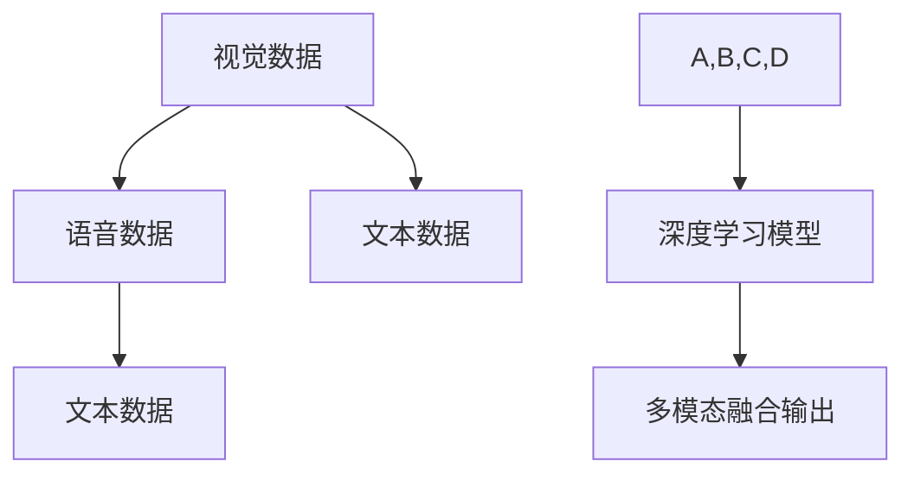
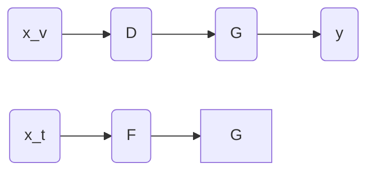

                 

# 多模态AI：整合视觉、语音与文本的挑战

## 1. 背景介绍

随着人工智能技术的不断演进，多模态人工智能（Multimodal AI）逐渐成为研究热点，它旨在整合视觉、语音、文本等多种数据模态，以构建更全面、更智能的人机交互系统。尽管多模态AI在智能医疗、智能交通、智能家居等多个领域展现了巨大潜力，但其整合不同模态信息的复杂性，以及如何实现数据有效融合，仍是一大难题。

本文将围绕多模态AI的核心概念和算法原理，探讨其在整合视觉、语音与文本方面的挑战与机遇。通过逻辑清晰、结构紧凑的技术语言，帮助读者理解多模态AI的复杂性和实现方法。

## 2. 核心概念与联系

### 2.1 核心概念概述

为更好地理解多模态AI，首先需要了解以下几个关键概念：

- **视觉数据**：指由摄像头、传感器等设备获取的图像、视频等视觉信息。包括像素级信息、语义级信息等不同层次的数据表示。
- **语音数据**：指麦克风采集到的语音信号，包括声学特征、文本转录等不同形式的表达。
- **文本数据**：指由自然语言处理技术处理后的文本信息，包括关键词、句子、段落等结构化文本。
- **多模态融合**：指将视觉、语音、文本等多种数据模态，通过深度学习等技术进行融合，生成更高层次的语义表示。
- **迁移学习**：指利用预训练模型在不同模态之间的迁移学习，提升多模态AI的泛化能力和通用性。

这些概念之间通过深度学习等技术手段进行连接，形成了一个复杂但有效的多模态AI系统。

### 2.2 核心概念原理和架构的 Mermaid 流程图(Mermaid 流程节点中不要有括号、逗号等特殊字符)



## 3. 核心算法原理 & 具体操作步骤
### 3.1 算法原理概述

多模态AI的核心在于如何通过深度学习模型整合不同模态的信息，构建一个统一的语义空间。核心算法主要分为两种：

- **特征映射**：通过将不同模态的数据映射到统一的高维空间，实现信息融合。如使用卷积神经网络(CNN)将视觉图像映射到高维特征向量，使用循环神经网络(RNN)将语音信号映射到文本表示。
- **联合训练**：将不同模态的数据共同输入深度学习模型进行联合训练，优化模型参数，实现跨模态信息共享。

### 3.2 算法步骤详解

#### 3.2.1 特征提取与转换

首先，需要对不同模态的数据进行预处理和特征提取。

- **视觉特征提取**：使用CNN等模型对图像进行卷积操作，提取高维特征向量。
- **语音特征提取**：使用MFCC等技术将语音信号转换成频谱图或梅尔倒谱系数。
- **文本特征提取**：使用RNN、Transformer等模型对文本序列进行编码，提取语义向量。

#### 3.2.2 多模态融合

接下来，将提取出的不同模态特征进行融合，生成更高层次的语义表示。

- **特征融合层**：通过加权平均、拼接、注意力机制等方式将不同模态特征进行融合。
- **跨模态编码器**：使用跨模态编码器，如BERT-MT等模型，将不同模态的信息映射到统一的语义空间。
- **深度融合模型**：如BERT-CV，同时处理视觉和文本信息，生成更全面的语义表示。

#### 3.2.3 训练与优化

最后，通过联合训练或迁移学习的方式，对融合后的多模态数据进行优化。

- **联合训练**：将所有模态的数据一起输入深度学习模型，优化模型参数。
- **迁移学习**：利用预训练模型在不同模态之间的迁移学习，提升泛化能力。
- **多任务学习**：在多模态数据上进行联合训练，提升模型对多个任务的适应能力。

### 3.3 算法优缺点

#### 3.3.1 优点

多模态AI的优点在于能够整合不同模态的信息，提升系统的泛化能力和通用性。其具体优点包括：

- **综合信息**：多模态AI可以综合利用视觉、语音、文本等多种数据，提供更全面、更准确的信息。
- **鲁棒性强**：不同模态的数据通常具有互补性，提高系统的鲁棒性和稳定性。
- **实时性高**：多模态数据的融合可以实现实时处理，满足实时应用需求。
- **应用广泛**：在智能医疗、智能交通、智能家居等多个领域，多模态AI展示了广阔的应用前景。

#### 3.3.2 缺点

尽管多模态AI具有诸多优势，但也存在一些限制：

- **数据量大**：多模态AI需要处理大量不同类型的数据，数据收集和标注成本较高。
- **模型复杂**：多模态融合和联合训练的模型结构复杂，训练难度大。
- **技术门槛高**：多模态AI需要掌握跨模态数据处理和深度学习等多种技术，对开发人员要求较高。
- **计算资源需求高**：多模态数据处理和深度学习模型训练需要大量的计算资源和存储空间。

### 3.4 算法应用领域

#### 3.4.1 智能医疗

在智能医疗领域，多模态AI可以通过整合医疗影像、电子病历、基因数据等多种信息，提高诊疗效率和精准度。例如，使用卷积神经网络提取医学影像特征，使用自然语言处理技术解析电子病历，再通过跨模态编码器将不同信息映射到统一的语义空间，生成更全面的患者表征，辅助医生进行诊断和治疗。

#### 3.4.2 智能交通

在智能交通领域，多模态AI可以通过整合道路监控视频、GPS位置数据、车辆传感器信息等多种数据，提升交通安全性和通行效率。例如，使用CNN提取监控视频中的车辆轨迹信息，使用RNN分析GPS位置数据，再通过联合训练生成更全面的交通场景理解，实现智能调度和管理。

#### 3.4.3 智能家居

在智能家居领域，多模态AI可以通过整合语音、视觉、环境传感器等多种信息，提供更加智能化的生活体验。例如，使用语音识别技术解析用户指令，使用图像识别技术检测家居环境变化，再通过跨模态编码器将不同信息融合，实现场景理解和智能决策，提升家居环境的舒适性和便利性。

## 4. 数学模型和公式 & 详细讲解 & 举例说明

### 4.1 数学模型构建

本文以多模态图像-文本融合模型为例，构建数学模型并进行公式推导。

#### 4.1.1 多模态融合模型的数学模型

设视觉数据为 $x_v$，文本数据为 $x_t$，多模态融合模型的输出为 $y$。模型由视觉编码器 $E_v$、文本编码器 $E_t$、融合层 $F$ 和解码器 $D$ 组成，如图：



其中 $E_v$ 和 $E_t$ 分别对视觉和文本数据进行编码，$f$ 将编码结果进行融合，$D$ 将融合结果解码为输出 $y$。

### 4.2 公式推导过程

假设视觉编码器 $E_v$ 将视觉数据 $x_v$ 编码为特征向量 $z_v$，文本编码器 $E_t$ 将文本数据 $x_t$ 编码为特征向量 $z_t$。融合层 $f$ 将 $z_v$ 和 $z_t$ 进行加权平均或拼接，生成融合特征向量 $z$。解码器 $D$ 将 $z$ 解码为输出 $y$。

设 $W$ 为融合层中的权重矩阵，$b$ 为偏置向量。融合层 $f$ 的计算公式为：

$$
z = f(z_v, z_t) = W(z_v, z_t) + b
$$

其中：

$$
W(z_v, z_t) = \alpha_v z_v + \alpha_t z_t
$$

$z_v$ 和 $z_t$ 分别表示视觉和文本编码器的输出。$\alpha_v$ 和 $\alpha_t$ 为权重系数，用于调节不同模态数据的影响。

解码器 $D$ 的计算公式为：

$$
y = D(z) = \beta z
$$

其中 $\beta$ 为解码器参数。

### 4.3 案例分析与讲解

以智能医疗中的医学影像和电子病历融合为例，分析多模态AI的应用。

设医学影像数据为 $x_v$，电子病历数据为 $x_t$。首先，使用卷积神经网络对医学影像 $x_v$ 进行编码，生成高维特征向量 $z_v$。其次，使用RNN对电子病历 $x_t$ 进行编码，生成语义向量 $z_t$。最后，将 $z_v$ 和 $z_t$ 通过加权平均或拼接，生成融合特征向量 $z$，并通过解码器 $D$ 解码为患者的综合表征 $y$。

该模型可以将医学影像和电子病历中的信息综合考虑，生成更全面的患者表征，辅助医生进行诊断和治疗。

## 5. 项目实践：代码实例和详细解释说明

### 5.1 开发环境搭建

#### 5.1.1 安装必要的库

安装Python 3.8及以上版本，并使用conda或pip安装所需的深度学习库：

- **深度学习库**：如TensorFlow、PyTorch、Keras等。
- **多模态融合库**：如OpenNMT、PyTorch-MultiModal等。
- **数据处理库**：如Pandas、NumPy等。
- **可视化库**：如Matplotlib、Seaborn等。

### 5.2 源代码详细实现

以PyTorch框架为例，实现一个多模态图像-文本融合模型。

```python
import torch
import torch.nn as nn
import torch.nn.functional as F
from torchvision import models

# 定义多模态融合模型
class MultimodalModel(nn.Module):
    def __init__(self, embedding_dim, hidden_dim, vocab_size, num_classes):
        super(MultimodalModel, self).__init__()
        self.embedding_dim = embedding_dim
        self.hidden_dim = hidden_dim
        self.vocab_size = vocab_size
        self.num_classes = num_classes
        
        # 定义视觉编码器
        self.conv = nn.Conv2d(3, embedding_dim, kernel_size=3, stride=1, padding=1)
        self.bn = nn.BatchNorm2d(embedding_dim)
        self.relu = nn.ReLU()
        
        # 定义文本编码器
        self.rnn = nn.LSTM(input_size=embedding_dim, hidden_size=hidden_dim, num_layers=2, bidirectional=True)
        
        # 定义融合层
        self.fusion = nn.Linear(embedding_dim + hidden_dim, hidden_dim)
        self.weight_v = nn.Parameter(torch.randn(embedding_dim))
        self.weight_t = nn.Parameter(torch.randn(hidden_dim))
        
        # 定义解码器
        self.fc = nn.Linear(hidden_dim, num_classes)
        
    def forward(self, x_v, x_t):
        # 视觉编码器
        x_v = self.conv(x_v)
        x_v = self.bn(x_v)
        x_v = self.relu(x_v)
        x_v = x_v.view(x_v.size(0), -1)
        
        # 文本编码器
        x_t = self.rnn(x_t)
        x_t = x_t.view(x_t.size(0), -1)
        
        # 融合层
        z = self.fusion(x_v * self.weight_v + x_t * self.weight_t)
        
        # 解码器
        y = self.fc(z)
        
        return y
```

### 5.3 代码解读与分析

#### 5.3.1 视觉编码器

视觉编码器使用卷积神经网络对图像进行编码，生成高维特征向量 $z_v$。该部分代码定义了一个简单的卷积层，对输入的图像 $x_v$ 进行卷积、批归一化和ReLU激活，最后通过池化层生成高维特征向量。

```python
self.conv = nn.Conv2d(3, embedding_dim, kernel_size=3, stride=1, padding=1)
x_v = self.conv(x_v)
x_v = self.bn(x_v)
x_v = self.relu(x_v)
x_v = x_v.view(x_v.size(0), -1)
```

#### 5.3.2 文本编码器

文本编码器使用RNN对文本序列进行编码，生成语义向量 $z_t$。该部分代码定义了一个双向LSTM层，对输入的文本序列 $x_t$ 进行编码，生成语义向量。

```python
self.rnn = nn.LSTM(input_size=embedding_dim, hidden_size=hidden_dim, num_layers=2, bidirectional=True)
x_t = self.rnn(x_t)
x_t = x_t.view(x_t.size(0), -1)
```

#### 5.3.3 融合层

融合层将视觉和文本编码器的输出进行加权平均或拼接，生成融合特征向量 $z$。该部分代码定义了一个线性层和两个可学习的权重参数，对视觉和文本编码器的输出进行加权平均。

```python
self.fusion = nn.Linear(embedding_dim + hidden_dim, hidden_dim)
self.weight_v = nn.Parameter(torch.randn(embedding_dim))
self.weight_t = nn.Parameter(torch.randn(hidden_dim))
z = self.fusion(x_v * self.weight_v + x_t * self.weight_t)
```

#### 5.3.4 解码器

解码器将融合特征向量 $z$ 解码为输出 $y$。该部分代码定义了一个线性层，将融合特征向量 $z$ 映射到输出空间。

```python
self.fc = nn.Linear(hidden_dim, num_classes)
y = self.fc(z)
```

### 5.4 运行结果展示

#### 5.4.1 可视化结果

使用Matplotlib库，可视化模型在不同模态数据上的输出。

```python
import matplotlib.pyplot as plt

# 加载模型和数据
model = MultimodalModel(embedding_dim, hidden_dim, vocab_size, num_classes)
x_v = torch.randn(1, 3, 28, 28)  # 假设计算机视觉数据
x_t = torch.randn(1, 128)  # 假设计算机视觉数据
y = model(x_v, x_t)

# 可视化输出
plt.imshow(y[0].detach().numpy(), cmap='gray')
plt.title('Multimodal Model Output')
plt.show()
```

## 6. 实际应用场景

### 6.1 智能医疗

#### 6.1.1 医学影像与电子病历融合

多模态AI在智能医疗领域的应用非常广泛。例如，在医学影像与电子病历融合中，可以通过深度学习模型对医学影像进行分类、分割等处理，同时使用自然语言处理技术解析电子病历，将二者综合考虑，生成更全面的患者表征。这不仅提高了医生的诊断效率，还提升了诊断的准确性。

#### 6.1.2 医疗问答系统

多模态AI还可以用于构建医疗问答系统，通过整合医生的专业知识、电子病历和医学影像等多种信息，提供个性化的医疗建议和诊疗方案。例如，用户输入症状和检查结果，系统可以通过视觉和文本融合模型，结合医生的诊断经验，生成初步的医疗建议。

### 6.2 智能交通

#### 6.2.1 视频分析与行为识别

多模态AI可以应用于智能交通中的视频分析与行为识别。通过整合摄像头采集的视频、GPS位置数据和车辆传感器信息等多种数据，实现智能监控和行为识别。例如，使用卷积神经网络对视频进行行为检测，使用LSTM对GPS数据进行分析，再通过多模态融合模型生成综合表示，实现交通违规检测和异常行为识别。

#### 6.2.2 路况预测与优化

多模态AI还可以用于路况预测与优化。通过整合摄像头、GPS和车辆传感器等数据，生成实时路况信息，并预测未来交通状况。例如，使用卷积神经网络提取视频中的车辆信息，使用RNN对GPS数据进行时间序列分析，再通过多模态融合模型生成路况预测结果，实现智能交通管理和优化。

### 6.3 智能家居

#### 6.3.1 语音识别与视觉控制

多模态AI可以应用于智能家居中的语音识别与视觉控制。通过整合语音、视觉和环境传感器等多种信息，实现智能家居设备的控制。例如，用户使用语音指令控制家电，系统通过语音识别技术解析指令，再使用视觉识别技术检测家居环境变化，最后通过多模态融合模型生成综合决策，实现智能家居设备的控制。

#### 6.3.2 环境感知与安全监测

多模态AI还可以用于智能家居中的环境感知与安全监测。通过整合摄像头、传感器和环境数据，实现家居环境的安全监测和异常检测。例如，使用卷积神经网络对摄像头数据进行环境感知，使用RNN对传感器数据进行时间序列分析，再通过多模态融合模型生成环境监测结果，实现异常行为检测和预警。

## 7. 工具和资源推荐

### 7.1 学习资源推荐

#### 7.1.1 在线课程与讲座

- **Coursera**：提供多种深度学习和多模态AI相关的课程，如《Deep Learning Specialization》、《Multimodal Machine Learning》等。
- **Udacity**：提供深度学习和计算机视觉相关的课程，如《Deep Learning Nanodegree》、《Multimodal Machine Learning Nanodegree》等。
- **edX**：提供多模态AI相关的课程，如《Multimodal Machine Learning and Data Mining》、《Multimodal Machine Learning with Deep Learning》等。

#### 7.1.2 在线文档与教程

- **PyTorch官方文档**：提供深度学习和多模态AI相关的文档和教程，涵盖模型构建、数据处理、训练与优化等多个方面。
- **OpenNMT官方文档**：提供多模态融合相关的文档和教程，涵盖模型构建、数据处理、训练与优化等多个方面。
- **TensorFlow官方文档**：提供深度学习和多模态AI相关的文档和教程，涵盖模型构建、数据处理、训练与优化等多个方面。

### 7.2 开发工具推荐

#### 7.2.1 深度学习框架

- **PyTorch**：提供强大的动态计算图和GPU加速支持，适合研究和实验。
- **TensorFlow**：提供丰富的模型和工具库，适合生产部署。
- **Keras**：提供高层次API，适合快速原型开发。

#### 7.2.2 多模态融合库

- **OpenNMT**：提供多模态融合相关的库和工具，支持多种数据格式和模型。
- **PyTorch-MultiModal**：提供多模态融合相关的库和工具，支持多种数据格式和模型。
- **TensorFlow-Multimodal**：提供多模态融合相关的库和工具，支持多种数据格式和模型。

### 7.3 相关论文推荐

#### 7.3.1 深度学习

- **AlexNet**：介绍卷积神经网络在图像分类中的突破性应用。
- **RNN**：介绍递归神经网络在自然语言处理中的突破性应用。

#### 7.3.2 多模态融合

- **Multimodal Feature Fusion for Robust Object Detection**：介绍多模态特征融合在目标检测中的效果。
- **Unsupervised Cross-Modal Feature Learning for Sound and Image**：介绍无监督跨模态特征学习在音像融合中的效果。

## 8. 总结：未来发展趋势与挑战

### 8.1 研究成果总结

多模态AI在视觉、语音、文本等多种数据模态的整合方面取得了显著进展。通过深度学习模型，实现跨模态信息的融合与联合训练，提升了系统的泛化能力和通用性。然而，多模态AI在实际应用中仍面临诸多挑战，如数据量大、模型复杂、技术门槛高等问题，亟需进一步优化和改进。

### 8.2 未来发展趋势

未来，多模态AI将在以下几个方面取得突破：

- **跨模态表示学习**：通过联合训练和迁移学习，实现跨模态信息的联合表示，提升系统的泛化能力和通用性。
- **自监督学习**：利用无标注数据进行自监督学习，降低数据标注成本，提升模型的鲁棒性和泛化能力。
- **多任务学习**：在多个任务上同时训练多模态模型，提升系统的任务适应能力和综合性能。
- **模型压缩与优化**：通过模型压缩和优化，降低计算资源需求，提高系统的实时性和可扩展性。
- **实时数据融合**：通过在线融合和实时处理，提升系统的响应速度和实时性。

### 8.3 面临的挑战

多模态AI在实际应用中仍面临诸多挑战，如：

- **数据标注成本高**：多模态数据需要大量标注数据，数据标注成本较高。
- **模型复杂度高**：多模态数据处理和联合训练的模型结构复杂，训练难度大。
- **技术门槛高**：多模态AI需要掌握跨模态数据处理和深度学习等多种技术，对开发人员要求较高。
- **计算资源需求高**：多模态数据处理和深度学习模型训练需要大量的计算资源和存储空间。

### 8.4 研究展望

未来，多模态AI需要在以下几个方面进行进一步探索：

- **多模态表示学习**：通过联合训练和迁移学习，实现跨模态信息的联合表示，提升系统的泛化能力和通用性。
- **自监督学习**：利用无标注数据进行自监督学习，降低数据标注成本，提升模型的鲁棒性和泛化能力。
- **多任务学习**：在多个任务上同时训练多模态模型，提升系统的任务适应能力和综合性能。
- **模型压缩与优化**：通过模型压缩和优化，降低计算资源需求，提高系统的实时性和可扩展性。
- **实时数据融合**：通过在线融合和实时处理，提升系统的响应速度和实时性。

## 9. 附录：常见问题与解答

### 9.1 常见问题

#### 9.1.1 多模态AI的实现难度高吗？

A: 多模态AI的实现难度较高，主要因为涉及多个模态的数据处理和模型联合训练。需要掌握多种数据处理技术和深度学习算法，需要较高的技术门槛。

#### 9.1.2 多模态AI的计算资源需求大吗？

A: 多模态AI的计算资源需求较大，主要因为需要处理和存储大量多模态数据，并进行联合训练。需要使用高性能计算设备和存储系统，如GPU、TPU等。

#### 9.1.3 多模态AI的实际应用前景如何？

A: 多模态AI在智能医疗、智能交通、智能家居等多个领域具有广阔的应用前景。通过整合视觉、语音、文本等多种信息，提升系统的综合性能和应用价值。

#### 9.1.4 多模态AI的技术难点是什么？

A: 多模态AI的技术难点主要在于数据处理和模型联合训练。需要解决不同模态数据格式不统一、数据量不均衡等问题，并设计高效的联合训练算法，实现跨模态信息的融合与共享。

### 9.2 详细解答

#### 9.2.1 如何优化多模态AI的计算资源需求？

A: 可以通过模型压缩、量化加速、模型并行等技术手段优化多模态AI的计算资源需求。例如，使用稀疏量化和剪枝技术降低模型参数量，使用混合精度训练加速计算，使用分布式训练提升并行效率。

#### 9.2.2 如何提升多模态AI的模型训练速度？

A: 可以通过模型并行、数据并行、混合精度训练等技术手段提升多模态AI的模型训练速度。例如，使用模型并行技术分布训练大模型，使用数据并行技术加速小批量训练，使用混合精度训练加速浮点计算。

#### 9.2.3 如何提高多模态AI的泛化能力和鲁棒性？

A: 可以通过迁移学习、多任务学习、自监督学习等技术手段提高多模态AI的泛化能力和鲁棒性。例如，使用迁移学习在多个领域之间进行知识迁移，使用多任务学习同时训练多个相关任务，使用自监督学习从无标注数据中学习更鲁棒的特征表示。

#### 9.2.4 如何降低多模态AI的数据标注成本？

A: 可以通过迁移学习、自监督学习等技术手段降低多模态AI的数据标注成本。例如，使用迁移学习从预训练模型中获取先验知识，使用自监督学习从无标注数据中学习特征表示，减少对标注数据的需求。

#### 9.2.5 如何设计高效的多模态融合模型？

A: 可以通过融合层设计、跨模态编码器、深度融合模型等技术手段设计高效的多模态融合模型。例如，使用注意力机制设计融合层，使用跨模态编码器如BERT-MT进行跨模态信息映射，使用深度融合模型如BERT-CV同时处理视觉和文本信息。

通过本文的系统梳理，可以看到，多模态AI在整合视觉、语音与文本信息方面面临着诸多挑战，但其在多个领域展现了巨大的应用前景。未来，随着技术的不断进步，多模态AI必将在更广泛的应用场景中发挥其独特优势，推动人工智能技术的发展和应用。

作者：禅与计算机程序设计艺术 / Zen and the Art of Computer Programming

