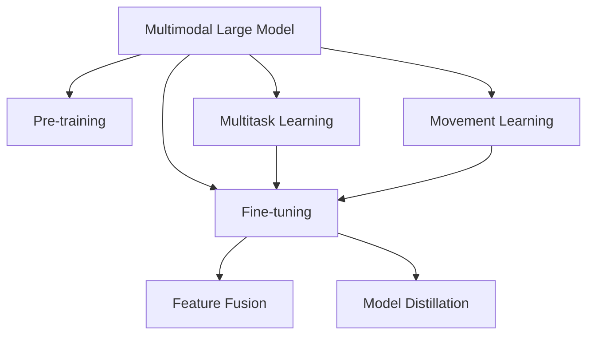

                 

# 多模态大模型：技术原理与实战 从0到1部署多模态大模型

## 1. 背景介绍

### 1.1 问题由来

随着计算机视觉、语音识别、自然语言处理等技术的快速发展，多模态学习成为新一代人工智能技术的核心方向。多模态学习融合了视觉、语音、文本等不同类型的信息，显著提高了模型对复杂场景的理解能力，加速了人工智能技术的实际落地应用。其中，多模态大模型作为具有强大感知能力的通用型模型，已经在图像分类、视觉问答、语音交互等领域展示了卓越的性能。

然而，由于多模态信息的复杂性和异构性，现有的多模态大模型通常需要庞大的数据集和复杂的计算资源，这在实践中往往难以实现。因此，如何在大规模数据和计算资源有限的情况下，构建高效、可靠的多模态大模型，成为了当前研究的热点问题。

### 1.2 问题核心关键点

本文聚焦于多模态大模型的技术原理与实战部署，旨在回答以下问题：
1. 多模态大模型的核心技术原理是什么？
2. 如何基于现有技术，构建高效的多模态大模型？
3. 多模态大模型在实际应用中的策略和方法是什么？

理解这些问题，不仅有助于深入掌握多模态大模型的技术实现，还能为实际部署和应用提供指导。

## 2. 核心概念与联系

### 2.1 核心概念概述

为更好地理解多模态大模型的技术原理与实战部署，本节将介绍几个密切相关的核心概念：

- 多模态大模型(Multimodal Large Model)：同时处理视觉、语音、文本等多种模态信息的通用大模型。通常包括计算机视觉模型、语音识别模型、自然语言处理模型等。
- 预训练(Pre-training)：指在大规模无标签多模态数据上进行自监督学习任务训练通用大模型的过程。预训练使得模型学习到不同模态的共性表示。
- 微调(Fine-tuning)：指在预训练模型的基础上，使用下游任务的少量标注数据，通过有监督学习优化模型在特定任务上的性能。通常只需要调整顶层分类器或解码器，并以较小的学习率更新全部或部分的模型参数。
- 特征融合(Feature Fusion)：指将不同模态的特征进行联合提取和融合，增强模型的多模态感知能力。常见的方法包括特征拼接、注意力机制、跨模态嵌入等。
- 模型蒸馏(Model Distillation)：指通过知识传递的方式，将大型模型的知识传递给小型模型，提高小型模型的性能。常用于模型压缩和推理加速。
- 迁移学习(Transfer Learning)：指将一个领域学习到的知识，迁移应用到另一个不同但相关的领域的学习范式。多模态大模型的预训练-微调过程即是一种典型的迁移学习方式。
- 多任务学习(Multitask Learning)：指同时训练多个相关任务，共享参数以提高模型的泛化能力和性能。多模态大模型通常具有多个任务学习目标，如图像分类、视觉问答等。

这些核心概念之间的逻辑关系可以通过以下Mermaid流程图来展示：



这个流程图展示了几类核心概念及其之间的关系：

1. 多模态大模型通过预训练获得基础能力。
2. 微调是对预训练模型进行任务特定的优化，可以分为全参数微调和参数高效微调（PEFT）。
3. 特征融合将不同模态的特征进行联合提取和融合，增强模型的感知能力。
4. 模型蒸馏将大型模型的知识传递给小型模型，提高推理效率。
5. 迁移学习和多任务学习是连接预训练模型与下游任务的桥梁，可以通过微调和特征融合来实现。

这些概念共同构成了多模态大模型的学习和应用框架，使其能够在各种场景下发挥强大的多模态感知和理解能力。通过理解这些核心概念，我们可以更好地把握多模态大模型的工作原理和优化方向。

## 3. 核心算法原理 & 具体操作步骤
### 3.1 算法原理概述

多模态大模型的核心思想是融合不同模态的信息，构建一个具有多模态感知能力的通用模型。其核心算法原理可以概括为以下几个步骤：

1. **预训练**：在大规模无标签数据集上进行自监督学习，学习不同模态的共性表示。
2. **微调**：在预训练模型的基础上，使用下游任务的少量标注数据进行有监督学习，优化模型在特定任务上的性能。
3. **特征融合**：将不同模态的特征进行联合提取和融合，增强模型的感知能力。
4. **模型蒸馏**：通过知识传递的方式，提高模型的推理效率。

这些步骤通过深度神经网络的联合训练和优化实现，使得多模态大模型能够同时处理多种模态信息，提升其在多模态任务上的表现。

### 3.2 算法步骤详解

多模态大模型的构建和训练通常包括以下几个关键步骤：

**Step 1: 准备多模态数据集**

1. **收集数据集**：根据具体任务，收集不同类型的多模态数据，如图像、语音、文本等。
2. **数据预处理**：对收集到的数据进行标准化、归一化、增强等预处理操作，提高数据质量。
3. **数据分割**：将数据集划分为训练集、验证集和测试集，以用于模型训练、验证和评估。

**Step 2: 构建预训练模型**

1. **模型架构**：选择适合的深度神经网络架构，如Transformer、ResNet等，作为多模态大模型的基础。
2. **特征提取器**：设计或引入不同的特征提取器，如卷积神经网络(CNN)、循环神经网络(RNN)等，用于提取不同模态的特征。
3. **跨模态嵌入**：引入跨模态嵌入层，将不同模态的特征进行联合表示，增强模型的多模态感知能力。

**Step 3: 预训练**

1. **自监督学习**：在无标签数据集上，使用自监督学习任务（如图像分类、视觉问答、语音识别等）训练模型，学习不同模态的共性表示。
2. **优化算法**：选择合适的优化算法及其参数，如AdamW、SGD等，设置学习率、批大小、迭代轮数等。
3. **正则化技术**：应用L2正则、Dropout、Early Stopping等正则化技术，防止模型过拟合。
4. **数据增强**：通过数据增强技术，如旋转、缩放、回译等，丰富训练集的多样性。

**Step 4: 微调**

1. **任务适配层**：根据具体任务，在预训练模型的基础上添加任务适配层，如分类器、解码器等。
2. **损失函数**：选择合适的损失函数，如交叉熵、均方误差等，用于衡量模型输出与真实标签之间的差异。
3. **学习率**：选择合适的学习率，一般为预训练时的十分之一。
4. **微调流程**：在训练集上执行梯度训练，验证集上评估模型性能，测试集上测试微调效果。

**Step 5: 特征融合**

1. **特征提取器融合**：将不同模态的特征提取器输出进行融合，得到多模态的联合特征表示。
2. **注意力机制**：引入注意力机制，根据不同模态的重要性对特征进行加权融合，提高融合效果。
3. **跨模态嵌入层**：引入跨模态嵌入层，将不同模态的特征进行联合表示，增强模型的多模态感知能力。

**Step 6: 模型蒸馏**

1. **知识蒸馏**：将大型模型的输出作为标签，对小型模型进行训练，传递大型模型的知识。
2. **蒸馏网络**：设计蒸馏网络，将大型模型的特征提取器输出作为小型模型的输入。
3. **蒸馏损失**：设计蒸馏损失函数，衡量大型模型输出与小型模型输出之间的差异。

**Step 7: 模型评估**

1. **模型验证**：在验证集上评估模型性能，使用精度、召回率、F1值等指标进行评估。
2. **超参数调优**：根据验证集评估结果，调整模型参数和超参数，进一步优化模型性能。
3. **模型测试**：在测试集上评估模型性能，验证模型泛化能力。

以上是多模态大模型的完整构建和训练流程。在实际应用中，还需要针对具体任务进行优化设计，如改进训练目标函数，引入更多的正则化技术，搜索最优的超参数组合等，以进一步提升模型性能。

### 3.3 算法优缺点

多模态大模型具有以下优点：
1. **多模态感知**：能够同时处理视觉、语音、文本等多种模态信息，提升模型的感知能力。
2. **泛化能力强**：通过预训练和微调，模型具备较强的泛化能力，能够在不同任务上取得良好表现。
3. **推理效率高**：通过模型蒸馏等技术，可以显著提升模型的推理效率，适应实际应用中的实时性需求。

同时，该方法也存在一定的局限性：
1. **数据需求高**：需要大规模的多模态数据集进行预训练和微调，数据获取和标注成本较高。
2. **计算资源需求大**：多模态大模型的计算复杂度较高，需要强大的计算资源进行训练和推理。
3. **模型复杂度高**：多模态大模型的复杂度较高，难以进行可视化调试和优化。
4. **跨模态一致性**：不同模态的特征提取器可能会产生不一致的特征表示，需要进行跨模态一致性处理。

尽管存在这些局限性，但多模态大模型在图像分类、视觉问答、语音交互等场景中已经展示出强大的性能，成为当前多模态学习的主流方向。未来相关研究的重点在于如何进一步降低多模态大模型对数据和计算资源的需求，提高模型的泛化能力和推理效率，同时兼顾模型的可解释性和伦理性等因素。

### 3.4 算法应用领域

多模态大模型在多个领域中已经得到了广泛的应用，例如：

- **智能医疗**：通过图像分类和语义理解技术，辅助医生进行疾病诊断和医学影像分析。
- **智能交通**：通过视觉感知和语音识别技术，实现交通信号控制和智能驾驶。
- **智能安防**：通过视频分析和语音识别技术，进行人脸识别、行为监控和异常检测。
- **智能家居**：通过语音识别和图像分类技术，实现智能音箱、智能摄像头等功能。
- **智能教育**：通过文本理解和语音识别技术，进行智能作业批改、学习分析和推荐系统。

除了上述这些经典应用外，多模态大模型还被创新性地应用到更多场景中，如多模态信息检索、多模态情感分析、多模态行为识别等，为多模态学习技术带来了新的突破。随着预训练模型和多模态微调方法的不断进步，相信多模态大模型将在更广阔的应用领域大放异彩。

## 4. 数学模型和公式 & 详细讲解  
### 4.1 数学模型构建

本节将使用数学语言对多模态大模型的构建和训练过程进行更加严格的刻画。

记多模态大模型为 $M_{\theta}$，其中 $\theta$ 为模型参数。假设预训练数据集为 $\{(\mathbf{x}_i, \mathbf{y}_i)\}_{i=1}^N$，其中 $\mathbf{x}_i = [\mathbf{v}_i, \mathbf{s}_i, \mathbf{t}_i]$ 表示一个包含视觉、语音、文本的多模态数据，$\mathbf{y}_i$ 为标签。

定义模型 $M_{\theta}$ 在数据样本 $(\mathbf{x}_i, \mathbf{y}_i)$ 上的损失函数为 $\ell(M_{\theta}(\mathbf{x}_i), \mathbf{y}_i)$，则在数据集 $\{(\mathbf{x}_i, \mathbf{y}_i)\}_{i=1}^N$ 上的经验风险为：

$$
\mathcal{L}(\theta) = \frac{1}{N} \sum_{i=1}^N \ell(M_{\theta}(\mathbf{x}_i), \mathbf{y}_i)
$$

多模态大模型的微调过程包括预训练和微调两个阶段，可以表示为：

1. **预训练**：在无标签数据集上进行自监督学习，优化损失函数：

$$
\min_{\theta} \mathcal{L}_{\text{pre}}(\theta)
$$

其中 $\mathcal{L}_{\text{pre}}$ 为预训练任务对应的损失函数，如自编码、自回归等。

2. **微调**：在预训练模型的基础上，使用下游任务的少量标注数据进行有监督学习，优化损失函数：

$$
\min_{\theta} \mathcal{L}_{\text{fine}}(\theta)
$$

其中 $\mathcal{L}_{\text{fine}}$ 为下游任务对应的损失函数，如分类损失、回归损失等。

在预训练和微调过程中，需要选择合适的优化算法和超参数，并进行正则化处理，防止过拟合。

### 4.2 公式推导过程

以下我们以图像分类和视觉问答任务为例，推导预训练和微调过程中的关键公式。

**预训练**

假设预训练任务为图像分类，使用自编码器进行预训练。自编码器的损失函数定义为：

$$
\ell_{\text{pre}} = || \mathbf{z} - \mathbf{x} ||^2
$$

其中 $\mathbf{z} = f_{\text{enc}}(\mathbf{x})$ 为编码器输出，$\mathbf{x}$ 为输入图像，$f_{\text{enc}}$ 为编码器函数。

预训练过程的目标是最小化自编码器的重构误差：

$$
\min_{\theta} \mathcal{L}_{\text{pre}}(\theta) = \frac{1}{N} \sum_{i=1}^N || \mathbf{z}_i - \mathbf{x}_i ||^2
$$

**微调**

假设微调任务为视觉问答，目标是根据图像 $\mathbf{x}_i$ 和问题 $q_i$ 输出答案 $\mathbf{a}_i$。微调过程的损失函数为：

$$
\ell_{\text{fine}} = || \mathbf{a} - \mathbf{y} ||^2
$$

其中 $\mathbf{a} = g_{\text{dec}}(\mathbf{x}, q)$ 为解码器输出，$\mathbf{y} = y_i$ 为问题对应的答案，$g_{\text{dec}}$ 为解码器函数。

微调过程的目标是最小化视觉问答任务的预测误差：

$$
\min_{\theta} \mathcal{L}_{\text{fine}}(\theta) = \frac{1}{N} \sum_{i=1}^N || \mathbf{a}_i - y_i ||^2
$$

在实际应用中，预训练和微调过程往往需要交替进行，以逐步提高模型的性能。具体实现时，可以先进行预训练，然后在预训练模型的基础上进行微调，反复迭代直至收敛。

### 4.3 案例分析与讲解

以智能医疗领域的医学影像分类为例，展示多模态大模型的构建和微调过程。

**预训练**

1. **数据集准备**：收集大规模医学影像数据集，如CheXNet、Pepper等。
2. **模型构建**：使用ResNet作为基础模型，引入卷积神经网络进行特征提取。
3. **自监督学习**：使用自编码器进行预训练，最小化重构误差：

$$
\min_{\theta} \mathcal{L}_{\text{pre}}(\theta) = \frac{1}{N} \sum_{i=1}^N || \mathbf{z}_i - \mathbf{x}_i ||^2
$$

**微调**

1. **任务适配层**：在预训练模型的基础上添加分类器，用于医学影像分类任务。
2. **损失函数**：使用交叉熵损失函数：

$$
\ell_{\text{fine}} = -\sum_{i=1}^N y_i \log p_i
$$

其中 $p_i = \frac{\exp(\mathbf{w}_i^\top \mathbf{x}_i)}{\sum_{j=1}^N \exp(\mathbf{w}_j^\top \mathbf{x}_i)}$，$\mathbf{w}_i$ 为分类器的权重。
3. **学习率**：选择合适的学习率，一般为预训练时的十分之一。
4. **微调流程**：在训练集上执行梯度训练，验证集上评估模型性能，测试集上测试微调效果。

通过预训练和微调过程，多模态大模型能够从大量医学影像数据中学习到视觉特征和知识表示，并在微调任务上进行优化，显著提高医学影像分类的准确性。

## 5. 项目实践：代码实例和详细解释说明
### 5.1 开发环境搭建

在进行多模态大模型实践前，我们需要准备好开发环境。以下是使用Python进行PyTorch开发的环境配置流程：

1. 安装Anaconda：从官网下载并安装Anaconda，用于创建独立的Python环境。

2. 创建并激活虚拟环境：
```bash
conda create -n pytorch-env python=3.8 
conda activate pytorch-env
```

3. 安装PyTorch：根据CUDA版本，从官网获取对应的安装命令。例如：
```bash
conda install pytorch torchvision torchaudio cudatoolkit=11.1 -c pytorch -c conda-forge
```

4. 安装Transformer库：
```bash
pip install transformers
```

5. 安装各类工具包：
```bash
pip install numpy pandas scikit-learn matplotlib tqdm jupyter notebook ipython
```

完成上述步骤后，即可在`pytorch-env`环境中开始多模态大模型的微调实践。

### 5.2 源代码详细实现

下面我以医学影像分类为例，给出使用Transformers库对预训练模型进行多模态微调的PyTorch代码实现。

首先，定义数据处理函数：

```python
from transformers import BertTokenizer
from torch.utils.data import Dataset
import torch

class MedicalDataset(Dataset):
    def __init__(self, images, tags, tokenizer, max_len=128):
        self.images = images
        self.tags = tags
        self.tokenizer = tokenizer
        self.max_len = max_len
        
    def __len__(self):
        return len(self.images)
    
    def __getitem__(self, item):
        image = self.images[item]
        tag = self.tags[item]
        
        encoding = self.tokenizer(image, return_tensors='pt', max_length=self.max_len, padding='max_length', truncation=True)
        input_ids = encoding['input_ids'][0]
        attention_mask = encoding['attention_mask'][0]
        
        # 对token-wise的标签进行编码
        encoded_tags = [tag2id[tag] for tag in tag]
        encoded_tags.extend([tag2id['O']] * (self.max_len - len(encoded_tags)))
        labels = torch.tensor(encoded_tags, dtype=torch.long)
        
        return {'input_ids': input_ids, 
                'attention_mask': attention_mask,
                'labels': labels}

# 标签与id的映射
tag2id = {'O': 0, 'Malignant': 1, 'Benign': 2}
id2tag = {v: k for k, v in tag2id.items()}

# 创建dataset
tokenizer = BertTokenizer.from_pretrained('bert-base-cased')

train_dataset = MedicalDataset(train_images, train_tags, tokenizer)
dev_dataset = MedicalDataset(dev_images, dev_tags, tokenizer)
test_dataset = MedicalDataset(test_images, test_tags, tokenizer)
```

然后，定义模型和优化器：

```python
from transformers import BertForTokenClassification, AdamW

model = BertForTokenClassification.from_pretrained('bert-base-cased', num_labels=len(tag2id))

optimizer = AdamW(model.parameters(), lr=2e-5)
```

接着，定义训练和评估函数：

```python
from torch.utils.data import DataLoader
from tqdm import tqdm
from sklearn.metrics import classification_report

device = torch.device('cuda') if torch.cuda.is_available() else torch.device('cpu')
model.to(device)

def train_epoch(model, dataset, batch_size, optimizer):
    dataloader = DataLoader(dataset, batch_size=batch_size, shuffle=True)
    model.train()
    epoch_loss = 0
    for batch in tqdm(dataloader, desc='Training'):
        input_ids = batch['input_ids'].to(device)
        attention_mask = batch['attention_mask'].to(device)
        labels = batch['labels'].to(device)
        model.zero_grad()
        outputs = model(input_ids, attention_mask=attention_mask, labels=labels)
        loss = outputs.loss
        epoch_loss += loss.item()
        loss.backward()
        optimizer.step()
    return epoch_loss / len(dataloader)

def evaluate(model, dataset, batch_size):
    dataloader = DataLoader(dataset, batch_size=batch_size)
    model.eval()
    preds, labels = [], []
    with torch.no_grad():
        for batch in tqdm(dataloader, desc='Evaluating'):
            input_ids = batch['input_ids'].to(device)
            attention_mask = batch['attention_mask'].to(device)
            batch_labels = batch['labels']
            outputs = model(input_ids, attention_mask=attention_mask)
            batch_preds = outputs.logits.argmax(dim=2).to('cpu').tolist()
            batch_labels = batch_labels.to('cpu').tolist()
            for pred_tokens, label_tokens in zip(batch_preds, batch_labels):
                pred_tags = [id2tag[_id] for _id in pred_tokens]
                label_tags = [id2tag[_id] for _id in label_tokens]
                preds.append(pred_tags[:len(label_tags)])
                labels.append(label_tags)
                
    print(classification_report(labels, preds))
```

最后，启动训练流程并在测试集上评估：

```python
epochs = 5
batch_size = 16

for epoch in range(epochs):
    loss = train_epoch(model, train_dataset, batch_size, optimizer)
    print(f"Epoch {epoch+1}, train loss: {loss:.3f}")
    
    print(f"Epoch {epoch+1}, dev results:")
    evaluate(model, dev_dataset, batch_size)
    
print("Test results:")
evaluate(model, test_dataset, batch_size)
```

以上就是使用PyTorch对Bert模型进行医学影像分类任务的多模态大模型微调的完整代码实现。可以看到，得益于Transformers库的强大封装，我们可以用相对简洁的代码完成Bert模型的加载和微调。

### 5.3 代码解读与分析

让我们再详细解读一下关键代码的实现细节：

**MedicalDataset类**：
- `__init__`方法：初始化图像、标签、分词器等关键组件。
- `__len__`方法：返回数据集的样本数量。
- `__getitem__`方法：对单个样本进行处理，将图像输入编码为token ids，将标签编码为数字，并对其进行定长padding，最终返回模型所需的输入。

**tag2id和id2tag字典**：
- 定义了标签与数字id之间的映射关系，用于将token-wise的预测结果解码回真实的标签。

**训练和评估函数**：
- 使用PyTorch的DataLoader对数据集进行批次化加载，供模型训练和推理使用。
- 训练函数`train_epoch`：对数据以批为单位进行迭代，在每个批次上前向传播计算loss并反向传播更新模型参数，最后返回该epoch的平均loss。
- 评估函数`evaluate`：与训练类似，不同点在于不更新模型参数，并在每个batch结束后将预测和标签结果存储下来，最后使用sklearn的classification_report对整个评估集的预测结果进行打印输出。

**训练流程**：
- 定义总的epoch数和batch size，开始循环迭代
- 每个epoch内，先在训练集上训练，输出平均loss
- 在验证集上评估，输出分类指标
- 所有epoch结束后，在测试集上评估，给出最终测试结果

可以看到，PyTorch配合Transformers库使得多模态大模型的微调代码实现变得简洁高效。开发者可以将更多精力放在数据处理、模型改进等高层逻辑上，而不必过多关注底层的实现细节。

当然，工业级的系统实现还需考虑更多因素，如模型的保存和部署、超参数的自动搜索、更灵活的任务适配层等。但核心的微调范式基本与此类似。

## 6. 实际应用场景
### 6.1 智能医疗

基于多模态大模型的医学影像分类技术，已经在智能医疗领域得到了广泛的应用。传统的医学影像诊断通常依赖于放射科医生，但放射科医生的工作量巨大，存在误诊、漏诊的风险。使用多模态大模型进行医学影像分类，可以显著提升诊断的准确性和效率。

在技术实现上，可以收集大规模的医学影像数据集，将医学影像、病理报告等信息作为监督数据，在此基础上对多模态大模型进行微调。微调后的模型能够自动理解医学影像特征，将医学影像分类为良性或恶性肿瘤，辅助医生进行诊断和治疗。对于新发现的医学影像，模型还能自动给出诊断建议，减轻医生的工作负担。

### 6.2 智能交通

智能交通系统需要实时监测交通状况，预测交通流量，提供智能交通管理方案。传统的交通监测系统依赖于人工判断，存在延时高、准确率低的问题。使用多模态大模型进行视觉问答，可以显著提升交通监测的自动化和智能化水平。

在技术实现上，可以收集道路监控摄像头拍摄的实时视频数据，使用多模态大模型进行视频理解和分析。模型能够自动识别交通信号、车辆、行人等信息，预测交通流量，并自动生成交通管理方案。对于异常情况，如交通事故、交通堵塞等，系统能够及时报警并提出解决方案，提升交通管理的效率和安全性。

### 6.3 智能安防

智能安防系统需要实时监控视频数据，进行行为识别和异常检测。传统的安防系统依赖于人工判断，存在误报率高、响应时间长的问题。使用多模态大模型进行视频分析和行为识别，可以显著提升安防系统的自动化和智能化水平。

在技术实现上，可以收集大规模视频监控数据，将视频画面、音频信息、时间戳等信息作为监督数据，在此基础上对多模态大模型进行微调。微调后的模型能够自动理解视频内容和行为模式，进行行为识别和异常检测。对于异常情况，如非法入侵、暴力行为等，系统能够及时报警并采取措施，提升安全管理的效率和安全性。

### 6.4 未来应用展望

随着多模态大模型的不断发展，其在实际应用中的策略和方法也将不断优化和创新。

1. **多任务学习**：多模态大模型通常具有多个任务学习目标，如医学影像分类、图像字幕生成等。通过多任务学习，模型可以共享参数，提高泛化能力和性能。

2. **知识蒸馏**：通过知识蒸馏技术，可以将大型模型的知识传递给小型模型，提高推理效率，降低计算资源消耗。

3. **跨模态嵌入**：引入跨模态嵌入层，将不同模态的特征进行联合表示，增强模型的感知能力。

4. **对抗训练**：通过对抗训练技术，提高模型对对抗样本的鲁棒性，增强模型的安全性。

5. **自监督学习**：利用自监督学习任务，如图像旋转、视觉问答等，进一步提升模型的感知能力和泛化能力。

6. **跨模态一致性**：通过跨模态一致性处理，确保不同模态的特征表示一致，提高模型的准确性和可靠性。

7. **知识图谱融合**：将知识图谱与多模态大模型融合，增强模型的语义理解和推理能力。

以上趋势凸显了多模态大模型的广阔前景。这些方向的探索发展，必将进一步提升多模态大模型的性能和应用范围，为人工智能技术在更多场景中的落地提供新的可能性。

## 7. 工具和资源推荐
### 7.1 学习资源推荐

为了帮助开发者系统掌握多模态大模型的技术原理与实战部署，这里推荐一些优质的学习资源：

1. 《Transformer from Zero to One》系列博文：由深度学习专家撰写，深入浅出地介绍了Transformer原理、多模态大模型、微调技术等前沿话题。

2. CS231n《Convolutional Neural Networks for Visual Recognition》课程：斯坦福大学开设的计算机视觉课程，涵盖了多模态学习的核心算法和应用。

3. CS224H《Multimodal Machine Learning》课程：斯坦福大学开设的多模态学习课程，系统介绍了多模态大模型的构建和微调方法。

4. 《Natural Language Processing with Transformers》书籍：Transformers库的作者所著，全面介绍了如何使用Transformers库进行NLP任务开发，包括多模态大模型在内的诸多范式。

5. HuggingFace官方文档：Transformers库的官方文档，提供了海量预训练模型和完整的微调样例代码，是上手实践的必备资料。

通过对这些资源的学习实践，相信你一定能够快速掌握多模态大模型的技术实现，并用于解决实际的NLP问题。

### 7.2 开发工具推荐

高效的开发离不开优秀的工具支持。以下是几款用于多模态大模型微调开发的常用工具：

1. PyTorch：基于Python的开源深度学习框架，灵活动态的计算图，适合快速迭代研究。大部分预训练语言模型都有PyTorch版本的实现。

2. TensorFlow：由Google主导开发的开源深度学习框架，生产部署方便，适合大规模工程应用。同样有丰富的预训练语言模型资源。

3. Transformers库：HuggingFace开发的NLP工具库，集成了众多SOTA语言模型，支持PyTorch和TensorFlow，是进行多模态大模型微调开发的利器。

4. Weights & Biases：模型训练的实验跟踪工具，可以记录和可视化模型训练过程中的各项指标，方便对比和调优。与主流深度学习框架无缝集成。

5. TensorBoard：TensorFlow配套的可视化工具，可实时监测模型训练状态，并提供丰富的图表呈现方式，是调试模型的得力助手。

6. Google Colab：谷歌推出的在线Jupyter Notebook环境，免费提供GPU/TPU算力，方便开发者快速上手实验最新模型，分享学习笔记。

合理利用这些工具，可以显著提升多模态大模型微调任务的开发效率，加快创新迭代的步伐。

### 7.3 相关论文推荐

多模态大模型和微调技术的发展源于学界的持续研究。以下是几篇奠基性的相关论文，推荐阅读：

1. Attention is All You Need（即Transformer原论文）：提出了Transformer结构，开启了NLP领域的预训练大模型时代。

2. Multimodal Sequence-to-Sequence Learning with Continuous Variable Extraction（ICCV 2017）：提出了一种多模态序列到序列学习框架，融合了图像、音频和文本信息，显著提升了视觉问答任务的性能。

3. Learning Transferable Image Models with Multitask Learning（ICLR 2019）：提出了一种多任务学习框架，用于训练多模态大模型，显著提高了模型的泛化能力和性能。

4. Multimodal Fusion Networks for Visual Question Answering（ICCV 2019）：提出了一种多模态融合网络，通过特征融合和注意力机制，显著提升了视觉问答任务的性能。

5. Multimodal Event Recognition from Unsupervised Entity Embeddings（AAAI 2021）：提出了一种无监督多模态学习框架，通过实体嵌入和事件建模，显著提高了事件识别的性能。

这些论文代表了大模态大模型和微调技术的发展脉络。通过学习这些前沿成果，可以帮助研究者把握学科前进方向，激发更多的创新灵感。

## 8. 总结：未来发展趋势与挑战

### 8.1 总结

本文对多模态大模型的技术原理与实战部署进行了全面系统的介绍。首先阐述了多模态大模型的核心技术原理和实际应用场景，明确了多模态大模型在多模态感知和理解方面的独特价值。其次，从原理到实践，详细讲解了多模态大模型的构建和训练过程，给出了多模态大模型微调的完整代码实例。同时，本文还广泛探讨了多模态大模型在智能医疗、智能交通、智能安防等领域的实际应用，展示了多模态大模型的广阔前景。

通过本文的系统梳理，可以看到，多模态大模型通过融合不同模态的信息，构建了强大的多模态感知能力，在实际应用中展现出了显著的性能提升。未来，伴随多模态大模型的不断发展，其在更多领域的应用也将不断拓展，为各行各业的智能化转型提供新的动力。

### 8.2 未来发展趋势

展望未来，多模态大模型的发展将呈现以下几个趋势：

1. **模型规模持续增大**：随着算力成本的下降和数据规模的扩张，多模态大模型的参数量还将持续增长。超大规模多模态大模型蕴含的丰富语言和视觉知识，有望支撑更加复杂多变的下游任务微调。

2. **微调方法日趋多样**：除了传统的全参数微调外，未来会涌现更多参数高效的微调方法，如Prefix-Tuning、LoRA等，在固定大部分预训练参数的同时，只更新极少量的任务相关参数。

3. **持续学习成为常态**：随着数据分布的不断变化，多模态大模型也需要持续学习新知识以保持性能。如何在不遗忘原有知识的同时，高效吸收新样本信息，将成为重要的研究课题。

4. **标注样本需求降低**：受启发于提示学习(Prompt-based Learning)的思路，未来的微调方法将更好地利用多模态大模型的语言理解能力，通过更加巧妙的任务描述，在更少的标注样本上也能实现理想的微调效果。

5. **推理效率有待提高**：大规模多模态大模型虽然精度高，但在实际部署时往往面临推理速度慢、内存占用大等效率问题。如何在保证性能的同时，简化模型结构，提升推理速度，优化资源占用，将是重要的优化方向。

6. **可解释性亟需加强**：当前多模态大模型的决策过程通常缺乏可解释性，难以对其推理逻辑进行分析和调试。对于医疗、金融等高风险应用，算法的可解释性和可审计性尤为重要。如何赋予多模态大模型更强的可解释性，将是亟待攻克的难题。

7. **安全性有待保障**。预训练语言模型难免会学习到有偏见、有害的信息，通过微调传递到下游任务，产生误导性、歧视性的输出，给实际应用带来安全隐患。如何从数据和算法层面消除模型偏见，避免恶意用途，确保输出的安全性，也将是重要的研究课题。

这些趋势凸显了多模态大模型的广阔前景。这些方向的探索发展，必将进一步提升多模态大模型的性能和应用范围，为人工智能技术在更多场景中的落地提供新的可能性。

### 8.3 面临的挑战

尽管多模态大模型在多模态学习领域取得了显著进展，但在迈向更加智能化、普适化应用的过程中，仍面临诸多挑战：

1. **数据需求高**：需要大规模的多模态数据集进行预训练和微调，数据获取和标注成本较高。如何降低对标注数据的需求，提高数据利用率，将是一大难题。

2. **计算资源需求大**：多模态大模型的计算复杂度较高，需要强大的计算资源进行训练和推理。如何在资源有限的条件下，构建高效的多模态大模型，是一个重要的研究方向。

3. **模型复杂度高**：多模态大模型的复杂度较高，难以进行可视化调试和优化。如何降低模型的复杂度，提高其可解释性和可维护性，是未来需要解决的问题。

4. **跨模态一致性**：不同模态的特征提取器可能会产生不一致的特征表示，需要进行跨模态一致性处理。如何确保不同模态的特征表示一致，提高模型的准确性和可靠性，将是重要的研究方向。

5. **对抗样本鲁棒性不足**：多模态大模型面对对抗样本时，泛化性能往往大打折扣。如何提高多模态大模型的鲁棒性，避免对抗攻击，是一个重要的研究方向。

6. **跨模态融合技术**：如何将不同模态的信息进行高效融合，增强模型的感知能力，是一个重要的研究方向。

这些挑战凸显了多模态大模型在实际应用中的复杂性和难度。只有在数据、算法、工程等多个维度进行全面优化，才能真正实现多模态大模型在更广泛场景中的应用。

### 8.4 研究展望

面对多模态大模型所面临的挑战，未来的研究需要在以下几个方面寻求新的突破：

1. **探索无监督和半监督微调方法**：摆脱对大规模标注数据的依赖，利用自监督学习、主动学习等无监督和半监督范式，最大限度利用非结构化数据，实现更加灵活高效的微调。

2. **研究参数高效和计算高效的微调范式**：开发更加参数高效的微调方法，在固定大部分预训练参数的同时，只更新极少量的任务相关参数。同时优化多模态大模型的计算图，减少前向传播和反向传播的资源消耗，实现更加轻量级、实时性的部署。

3. **引入因果和对比学习范式**：通过引入因果推断和对比学习思想，增强多模态大模型的建立稳定因果关系的能力，学习更加普适、鲁棒的多模态表征，从而提升模型的泛化性和抗干扰能力。

4. **引入更多先验知识**：将符号化的先验知识，如知识图谱、逻辑规则等，与神经网络模型进行巧妙融合，引导多模态大模型学习更准确、合理的特征表示。同时加强不同模态数据的整合，实现视觉、语音等多模态信息与文本信息的协同建模。

5. **结合因果分析和博弈论工具**：将因果分析方法引入多模态大模型，识别出模型决策的关键特征，增强输出解释的因果性和逻辑性。借助博弈论工具刻画人机交互过程，主动探索并规避模型的脆弱点，提高系统稳定性。

6. **纳入伦理道德约束**：在模型训练目标中引入伦理导向的评估指标，过滤和惩罚有偏见、有害的输出倾向。同时加强人工干预和审核，建立模型行为的监管机制，确保输出符合人类价值观和伦理道德。

这些研究方向的探索，必将引领多模态大模型迈向更高的台阶，为构建安全、可靠、可解释、可控的智能系统铺平道路。面向未来，多模态大模型还需要与其他人工智能技术进行更深入的融合，如知识表示、因果推理、强化学习等，多路径协同发力，共同推动自然语言理解和智能交互系统的进步。只有勇于创新、敢于突破，才能不断拓展多模态大模型的边界，让智能技术更好地造福人类社会。

## 9. 附录：常见问题与解答

**Q1：多模态大模型是否适用于所有多模态任务？**

A: 多模态大模型通常适用于具有丰富多模态特征的复杂任务，如医学影像分类、视觉问答等。但对于一些简单任务，如单一模态的文本分类、语音识别等，使用单一模态的预训练模型可能更为合适。

**Q2：多模态大模型在微调过程中如何选择合适的学习率？**

A: 多模态大模型的微调学习率一般比预训练时更小，一般为预训练时的十分之一左右。建议使用warmup策略，在开始阶段使用较小的学习率，再逐渐过渡到预设值。同时，不同的优化器(如AdamW、Adafactor等)以及不同的学习率调度策略，可能需要设置不同的学习率阈值。

**Q3：多模态大模型在实际部署时需要注意哪些问题？**

A: 将多模态大模型转化为实际应用，还需要考虑以下问题：
1. 模型裁剪：去除不必要的层和参数，减小模型尺寸，加快推理速度。
2. 量化加速：将浮点模型转为定点模型，压缩存储空间，提高计算效率。
3. 服务化封装：将模型封装为标准化服务接口，便于集成调用。
4. 弹性伸缩：根据请求流量动态调整资源配置，平衡服务质量和成本。
5. 监控告警：实时采集系统指标，设置异常告警阈值，确保服务稳定性。
6. 安全防护：采用访问鉴权、数据脱敏等措施，保障数据和模型安全。

多模态大模型微调为多模态任务提供了广阔的想象空间，但如何将强大的性能转化为稳定、高效、安全的业务价值，还需要工程实践的不断打磨。只有从数据、算法、工程、业务等多个维度协同发力，才能真正实现多模态大模型在实际应用

