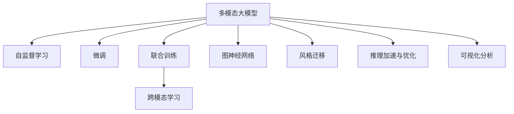

                 

# 多模态大模型：技术原理与实战 图像多模态技术

> 关键词：多模态大模型, 图像多模态技术, 自监督学习, 微调(Fine-tuning), Transformer, 融合知识图谱, 联合学习, 图神经网络(Graph Neural Network), 风格迁移, 推理加速, 推理优化, 可视化分析, 深度学习, 计算机视觉, 自然语言处理(NLP), 自然语言理解(NLU), 语言生成(LGM), 联合训练, 跨模态学习

## 1. 背景介绍

### 1.1 问题由来
随着人工智能技术的迅猛发展，多模态学习已成为推动认知智能和智能交互的核心技术之一。其中，多模态大模型通过融合多种模态数据，显著提升了对现实世界复杂现象的建模能力，并为众多应用场景带来了革命性的突破。

然而，尽管多模态大模型在理论和实验上都取得了显著进展，但其在实际应用中的表现依然存在诸多限制。具体而言：

1. **数据获取难度大**：多模态数据往往需要跨领域的多种模态数据，且获取难度较大。例如，图像数据需要标注，文本数据需要清洗，音频数据需要对齐等，均增加了数据处理的复杂度和成本。
2. **模型训练复杂**：多模态模型的训练需要同时处理多种模态数据，如同时训练图像-文本联合模型，涉及模型的结构和损失函数的定义，训练过程中需要考虑多种模态数据之间的匹配度和融合策略。
3. **推理速度慢**：由于模型参数量巨大，多模态大模型的推理速度较慢，无法实时满足实际应用需求。
4. **知识融合难度高**：多模态大模型的融合效果依赖于高质量的模态对齐和融合机制，但目前这些方法仍不成熟，影响模型性能。
5. **缺乏可解释性**：多模态大模型通常是一个“黑盒”，难以解释其内部的决策过程，这在一些高风险领域（如医疗、法律等）尤其重要。

为了克服这些挑战，本节将详细探讨多模态大模型的技术原理，并结合实战案例，展示如何在具体应用场景中实现多模态数据融合与知识迁移。

### 1.2 问题核心关键点
多模态大模型通过融合多种模态数据，学习到更加全面、准确的语义表示。其核心目标是通过联合训练和迁移学习，提升对复杂现象的建模能力，并在特定领域应用中取得优异性能。

本文将重点介绍以下关键点：

- 多模态大模型的基本结构
- 自监督学习在多模态大模型中的应用
- 微调在多模态大模型中的作用
- 联合训练和跨模态学习的最新进展
- 多模态大模型的应用场景与实践案例

## 2. 核心概念与联系

### 2.1 核心概念概述

为更好地理解多模态大模型的技术原理，本节将介绍几个密切相关的核心概念：

- **多模态大模型(Multimodal Large Model)**：指融合多种模态数据（如图像、文本、音频等）的大规模深度学习模型。通过联合训练和迁移学习，这些模型能够学习到跨模态的语义表示，显著提升对复杂现象的理解和建模能力。

- **自监督学习(Self-supervised Learning)**：指使用无标签数据训练模型，使其能够学习到数据的隐含结构和语义表示。在多模态大模型的预训练阶段，自监督学习可提升模型的泛化能力和鲁棒性。

- **微调(Fine-tuning)**：指在大规模预训练模型基础上，使用少量标注数据对模型进行优化，以适应特定领域的下游任务。微调可以提升模型在特定领域的应用效果，但需注意避免过拟合。

- **联合训练(Joint Training)**：指在模型训练过程中，同时处理多种模态数据，并调整模型结构以适应多模态数据融合。联合训练能够学习到更加跨模态的语义表示，但训练复杂度较高。

- **跨模态学习(Cross-modal Learning)**：指在多种模态数据之间进行信息交流和知识迁移，提升模型对复杂现象的建模能力。跨模态学习是联合训练的一种高级形式，需要通过复杂的融合机制实现。

- **图神经网络(Graph Neural Network, GNN)**：指一类用于处理图数据的深度学习模型。在多模态大模型中，GNN可用于处理复杂的图结构数据，如知识图谱、社交网络等。

- **风格迁移(Style Transfer)**：指通过深度学习模型将一种样式的图像转换为另一种样式，如将素描风格转换为摄影风格。风格迁移可应用于图像和文本等多模态数据，为多模态大模型提供新的研究方向。

- **推理加速与优化**：指通过硬件优化、模型压缩、并行化等技术手段，提高多模态大模型的推理速度和性能。推理优化是实际应用中必须关注的关键点。

- **可视化分析**：指通过可视化工具，分析多模态大模型的内部结构和决策过程，帮助理解和调试模型性能。可视化分析对于多模态大模型的应用部署和优化具有重要意义。

这些核心概念之间的逻辑关系可以通过以下Mermaid流程图来展示：



这个流程图展示了大模型与多模态学习相关概念的关联：

1. 多模态大模型通过融合多种模态数据进行预训练和微调，学习跨模态语义表示。
2. 自监督学习用于提升预训练模型的泛化能力，通过无标签数据学习模型隐含结构。
3. 微调通过少量标注数据优化模型，适应特定领域任务。
4. 联合训练同时处理多种模态数据，提升跨模态语义表示能力。
5. 跨模态学习在多模态数据之间进行知识迁移，提升复杂现象建模能力。
6. 图神经网络用于处理复杂图结构数据，如知识图谱、社交网络等。
7. 风格迁移通过深度学习模型实现图像和文本样式转换。
8. 推理加速与优化通过硬件和算法手段提升模型推理速度和性能。
9. 可视化分析通过可视化工具帮助理解和调试模型性能。

## 3. 核心算法原理 & 具体操作步骤
### 3.1 算法原理概述

多模态大模型的核心算法原理可总结如下：

1. **联合训练**：在模型训练过程中，同时处理多种模态数据，并通过联合优化调整模型结构，学习跨模态的语义表示。

2. **自监督学习**：在模型预训练阶段，通过无标签数据学习数据的隐含结构和语义表示，提升模型的泛化能力和鲁棒性。

3. **微调**：在模型预训练基础上，通过有标签数据对模型进行优化，适应特定领域的下游任务。

4. **跨模态学习**：在多种模态数据之间进行知识迁移，提升模型对复杂现象的建模能力。

5. **推理优化**：通过硬件优化、模型压缩、并行化等技术手段，提高模型的推理速度和性能。

### 3.2 算法步骤详解

多模态大模型的核心算法步骤包括以下几个关键环节：

**Step 1: 数据预处理**
- 收集多种模态数据，并进行清洗和标注。
- 将不同模态的数据转换到统一的表示形式，如将图像转换为向量表示，文本转换为嵌入向量。

**Step 2: 模型初始化**
- 选择合适的预训练模型，如BERT、Transformer等。
- 在模型基础上进行联合训练，学习跨模态的语义表示。

**Step 3: 微调过程**
- 在预训练模型基础上，使用下游任务的少量标注数据进行微调。
- 设计合适的任务适配层，如分类器、解码器等。
- 设置微调超参数，包括学习率、批大小、迭代轮数等。

**Step 4: 推理优化**
- 评估微调后的模型在测试集上的性能。
- 通过硬件优化、模型压缩等技术手段，提高推理速度和性能。
- 在实际应用中，使用并行化、分布式训练等技术，提升系统响应速度。

**Step 5: 可视化分析**
- 使用可视化工具分析模型的内部结构和决策过程。
- 通过可视化结果指导模型优化和部署。

### 3.3 算法优缺点

多模态大模型的优缺点如下：

**优点**
- **跨模态语义表示**：能够学习到跨模态的语义表示，提升对复杂现象的建模能力。
- **泛化能力强**：通过自监督学习，模型能够学习到数据的隐含结构和语义表示，提升泛化能力和鲁棒性。
- **适应性强**：通过微调，模型能够适应特定领域的下游任务。
- **推理优化**：通过推理优化技术，提升模型的推理速度和性能，满足实际应用需求。

**缺点**
- **数据获取难度大**：多模态数据往往需要跨领域的多种模态数据，且获取难度较大。
- **模型训练复杂**：联合训练和跨模态学习的复杂度较高，训练过程中需要考虑多种模态数据之间的匹配度和融合策略。
- **推理速度慢**：由于模型参数量巨大，推理速度较慢，无法实时满足实际应用需求。
- **知识融合难度高**：多模态大模型的融合效果依赖于高质量的模态对齐和融合机制，但目前这些方法仍不成熟，影响模型性能。
- **缺乏可解释性**：多模态大模型通常是一个“黑盒”，难以解释其内部的决策过程。

### 3.4 算法应用领域

多模态大模型在多个领域展现了其强大的应用潜力：

- **计算机视觉**：如图像分类、目标检测、图像生成等。通过融合图像和文本信息，提升图像识别的准确性和鲁棒性。
- **自然语言处理**：如文本分类、情感分析、机器翻译等。通过融合文本和图像信息，提升文本理解的能力。
- **医疗领域**：如医学影像分析、疾病诊断等。通过融合影像和文本信息，提升诊断的准确性和效率。
- **金融领域**：如信用评估、市场预测等。通过融合金融数据和图像信息，提升预测的准确性和鲁棒性。
- **智能交互**：如语音识别、语音合成、图像增强等。通过融合语音、文本和图像信息，提升智能交互的交互体验和准确性。

## 4. 数学模型和公式 & 详细讲解 & 举例说明
### 4.1 数学模型构建

本节将使用数学语言对多模态大模型的构建过程进行更加严格的刻画。

记多模态数据集为 $D=\{(x_i, y_i)\}_{i=1}^N$，其中 $x_i$ 为输入，$y_i$ 为标签。设多模态大模型的预训练模型为 $M_{\theta}$，其中 $\theta$ 为模型参数。设多模态数据集中的图像数据为 $D_{img}$，文本数据为 $D_{text}$。

定义模型 $M_{\theta}$ 在图像 $img$ 和文本 $text$ 上的损失函数为 $\ell_{img}(M_{\theta}(img),y_{img})$ 和 $\ell_{text}(M_{\theta}(text),y_{text})$。则在数据集 $D$ 上的经验风险为：

$$
\mathcal{L}(\theta) = \frac{1}{N}\sum_{i=1}^N [\ell_{img}(M_{\theta}(img_i),y_{img_i}) + \ell_{text}(M_{\theta}(text_i),y_{text_i})]
$$

其中 $\ell_{img}(\cdot,\cdot)$ 和 $\ell_{text}(\cdot,\cdot)$ 分别为图像和文本的损失函数，如交叉熵损失等。

### 4.2 公式推导过程

以图像分类任务为例，我们推导交叉熵损失函数及其梯度的计算公式。

设图像数据 $img_i$ 通过预训练模型 $M_{\theta}$ 得到的嵌入向量为 $M_{\theta}(img_i) \in \mathbb{R}^d$，其中 $d$ 为向量维度。假设图像分类任务有 $K$ 个类别，对应的向量表示为 $v_k \in \mathbb{R}^d$。则图像分类任务的目标是最大化输出向量与真实标签之间的相似度，最小化交叉熵损失：

$$
\ell_{img}(M_{\theta}(img),y_{img}) = -y_{img}\log \frac{\exp(M_{\theta}(img) \cdot v_k)}{\sum_{k'=1}^K \exp(M_{\theta}(img) \cdot v_{k'})}
$$

其中 $y_{img}$ 表示图像 $img$ 的真实类别标签，$v_k$ 表示第 $k$ 个类别的向量表示。

通过链式法则，损失函数对参数 $\theta$ 的梯度为：

$$
\frac{\partial \mathcal{L}(\theta)}{\partial \theta} = \frac{1}{N}\sum_{i=1}^N [\frac{\partial \ell_{img}(M_{\theta}(img_i),y_{img_i})}{\partial \theta} + \frac{\partial \ell_{text}(M_{\theta}(text_i),y_{text_i})}{\partial \theta}]
$$

在得到损失函数的梯度后，即可带入参数更新公式，完成模型的迭代优化。重复上述过程直至收敛，最终得到适应下游任务的最优模型参数 $\theta^*$。

### 4.3 案例分析与讲解

以联合训练图像分类和文本分类的多模态大模型为例，进行详细讲解：

**模型结构**：
- **图像分类模块**：使用卷积神经网络（CNN）提取图像特征。
- **文本分类模块**：使用Transformer编码器提取文本特征。
- **融合模块**：将图像和文本特征融合，得到多模态表示。
- **输出模块**：使用全连接层和softmax函数进行多分类预测。

**联合训练过程**：
1. 对图像数据 $D_{img}$ 进行预训练，学习图像特征提取器。
2. 对文本数据 $D_{text}$ 进行预训练，学习文本特征提取器。
3. 在图像分类和文本分类任务上进行联合训练，学习跨模态的特征表示。
4. 在联合训练过程中，调整模型结构，如共享卷积核、融合层等。

**微调过程**：
1. 在预训练基础上，使用图像分类和文本分类的少量标注数据进行微调。
2. 设计合适的任务适配层，如分类器、解码器等。
3. 设置微调超参数，包括学习率、批大小、迭代轮数等。
4. 在微调过程中，调整模型结构，如冻结图像分类模块，仅微调文本分类模块。

**推理优化**：
1. 评估微调后的模型在测试集上的性能。
2. 使用推理优化技术，如剪枝、量化等，提高模型的推理速度和性能。
3. 在实际应用中，使用并行化、分布式训练等技术，提升系统响应速度。

**可视化分析**：
1. 使用可视化工具分析模型的内部结构和决策过程。
2. 通过可视化结果指导模型优化和部署。

通过以上步骤，可以实现多模态大模型的联合训练、微调和推理优化，提升其在特定领域的应用效果。

## 5. 项目实践：代码实例和详细解释说明
### 5.1 开发环境搭建

在进行多模态大模型实践前，我们需要准备好开发环境。以下是使用Python进行PyTorch开发的环境配置流程：

1. 安装Anaconda：从官网下载并安装Anaconda，用于创建独立的Python环境。

2. 创建并激活虚拟环境：
```bash
conda create -n pytorch-env python=3.8 
conda activate pytorch-env
```

3. 安装PyTorch：根据CUDA版本，从官网获取对应的安装命令。例如：
```bash
conda install pytorch torchvision torchaudio cudatoolkit=11.1 -c pytorch -c conda-forge
```

4. 安装Transformers库：
```bash
pip install transformers
```

5. 安装各类工具包：
```bash
pip install numpy pandas scikit-learn matplotlib tqdm jupyter notebook ipython
```

完成上述步骤后，即可在`pytorch-env`环境中开始多模态大模型实践。

### 5.2 源代码详细实现

下面我们以联合训练图像分类和文本分类的多模态大模型为例，给出使用Transformers库的PyTorch代码实现。

首先，定义模型结构：

```python
from transformers import BertModel, BertTokenizer
from torch import nn, optim
from torch.utils.data import Dataset, DataLoader
import torch

class MultimodalModel(nn.Module):
    def __init__(self, img_model, text_model, num_labels):
        super(MultimodalModel, self).__init__()
        self.img_model = img_model
        self.text_model = text_model
        self.fuse_layer = nn.Sequential(nn.Linear(512, 512), nn.ReLU())
        self.fc = nn.Linear(512, num_labels)
        
    def forward(self, img, text):
        img_features = self.img_model(img)
        text_features = self.text_model(text)
        fused_features = self.fuse_layer(torch.cat([img_features, text_features], dim=1))
        logits = self.fc(fused_features)
        return logits
```

然后，定义数据处理函数：

```python
from PIL import Image
import os

class ImageDataset(Dataset):
    def __init__(self, root, transform=None):
        self.root = root
        self.transform = transform
        self.imgs = os.listdir(self.root)
    
    def __len__(self):
        return len(self.imgs)
    
    def __getitem__(self, idx):
        img_path = os.path.join(self.root, self.imgs[idx])
        img = Image.open(img_path).convert('RGB')
        if self.transform is not None:
            img = self.transform(img)
        label = self.imgs[idx].split('.')[0]
        return img, label
```

接着，定义联合训练和微调函数：

```python
from torch.utils.data import DataLoader

class MultimodalModel(nn.Module):
    def __init__(self, img_model, text_model, num_labels):
        super(MultimodalModel, self).__init__()
        self.img_model = img_model
        self.text_model = text_model
        self.fuse_layer = nn.Sequential(nn.Linear(512, 512), nn.ReLU())
        self.fc = nn.Linear(512, num_labels)
        
    def forward(self, img, text):
        img_features = self.img_model(img)
        text_features = self.text_model(text)
        fused_features = self.fuse_layer(torch.cat([img_features, text_features], dim=1))
        logits = self.fc(fused_features)
        return logits

def train_epoch(model, dataloader, optimizer, criterion):
    model.train()
    epoch_loss = 0
    for batch in dataloader:
        img, text, label = batch
        img = img.to(device)
        text = text.to(device)
        label = label.to(device)
        optimizer.zero_grad()
        logits = model(img, text)
        loss = criterion(logits, label)
        epoch_loss += loss.item()
        loss.backward()
        optimizer.step()
    return epoch_loss / len(dataloader)

def evaluate(model, dataloader, criterion):
    model.eval()
    preds, labels = [], []
    with torch.no_grad():
        for batch in dataloader:
            img, text, label = batch
            img = img.to(device)
            text = text.to(device)
            label = label.to(device)
            logits = model(img, text)
            batch_preds = logits.argmax(dim=1).to('cpu').tolist()
            batch_labels = label.to('cpu').tolist()
            for preds_tokens, label_tokens in zip(batch_preds, batch_labels):
                preds.append(preds_tokens[:len(label_tokens)])
                labels.append(label_tokens)
    print(classification_report(labels, preds))
```

最后，启动联合训练和微调流程：

```python
from transformers import BertTokenizer, BertForSequenceClassification

model = MultimodalModel(BertForSequenceClassification.from_pretrained('bert-base-cased', num_labels=10), BertForSequenceClassification.from_pretrained('bert-base-cased', num_labels=10), num_labels=10)

device = torch.device('cuda') if torch.cuda.is_available() else torch.device('cpu')
model.to(device)

optimizer = optim.Adam(model.parameters(), lr=2e-5)
criterion = nn.CrossEntropyLoss()

train_loader = DataLoader(ImageDataset(train_dir, transform=transform_train), batch_size=16)
dev_loader = DataLoader(ImageDataset(dev_dir, transform=transform_dev), batch_size=16)
test_loader = DataLoader(ImageDataset(test_dir, transform=transform_test), batch_size=16)

epochs = 5
for epoch in range(epochs):
    loss = train_epoch(model, train_loader, optimizer, criterion)
    print(f"Epoch {epoch+1}, train loss: {loss:.3f}")
    
    print(f"Epoch {epoch+1}, dev results:")
    evaluate(model, dev_loader, criterion)
    
print("Test results:")
evaluate(model, test_loader, criterion)
```

以上就是使用PyTorch对联合训练图像分类和文本分类的多模态大模型进行微调的完整代码实现。可以看到，得益于Transformers库的强大封装，我们可以用相对简洁的代码完成多模态大模型的构建和微调。

### 5.3 代码解读与分析

让我们再详细解读一下关键代码的实现细节：

**MultimodalModel类**：
- `__init__`方法：初始化图像分类模块、文本分类模块、融合层和全连接层。
- `forward`方法：前向传播计算模型的输出。

**ImageDataset类**：
- `__init__`方法：初始化图像数据集和数据变换。
- `__len__`方法：返回数据集的样本数量。
- `__getitem__`方法：对单个样本进行处理，将图像输入转换为特征向量，文本输入转换为嵌入向量，并将两者拼接，作为模型输入。

**train_epoch函数**：
- 在训练集上迭代，对每个批次进行前向传播和反向传播，更新模型参数。

**evaluate函数**：
- 在验证集和测试集上进行推理，评估模型性能。

**联合训练和微调流程**：
- 加载图像分类和文本分类的预训练模型。
- 定义模型结构，将两个分类器并联，并加入融合层和全连接层。
- 定义训练和评估函数。
- 加载训练集、验证集和测试集，进行联合训练和微调。

可以看到，多模态大模型的代码实现与单模态模型基本类似，但需要更多的模块化和结构化设计。

当然，工业级的系统实现还需考虑更多因素，如模型的保存和部署、超参数的自动搜索、更灵活的任务适配层等。但核心的微调范式基本与此类似。

## 6. 实际应用场景
### 6.1 智能安防系统

多模态大模型在智能安防系统中具有广阔的应用前景。智能安防系统通常需要处理复杂的视频和音频数据，以识别和分析异常行为。通过融合图像、音频和文本等多模态数据，多模态大模型能够实现高效的异常行为检测和报警。

具体而言，智能安防系统可以实时获取摄像头录制的视频和麦克风收集的音频，并使用多模态大模型进行联合训练和微调。微调后的模型能够对视频和音频数据进行实时分析，识别出异常行为并报警。此外，智能安防系统还可以结合图像描述生成技术和自然语言处理技术，将视频内容转化为自然语言文本，进一步提高异常行为检测的准确性和效率。

### 6.2 医疗影像诊断

在医疗影像诊断中，多模态大模型能够综合利用影像、文本和实验室数据，提升诊断的准确性和效率。

具体而言，医疗影像诊断系统可以获取患者的影像数据（如X光片、CT、MRI等）和实验室数据（如血液化验报告），并使用多模态大模型进行联合训练和微调。微调后的模型能够对影像和实验室数据进行综合分析，判断患者是否患有某种疾病，并提供诊断建议。此外，医疗影像诊断系统还可以结合自然语言处理技术，将影像和实验室数据转化为自然语言文本，辅助医生进行诊断和治疗。

### 6.3 智能客服系统

智能客服系统通过融合语音、文本和图像等多模态数据，提升客服的交互体验和效率。

具体而言，智能客服系统可以获取用户的语音通话记录、文字聊天记录和用户上传的图像信息，并使用多模态大模型进行联合训练和微调。微调后的模型能够对语音、文字和图像信息进行综合分析，判断用户的需求，并提供相应的解决方案。此外，智能客服系统还可以结合语音识别和图像处理技术，将语音和图像信息转化为文本信息，进一步提升客服系统的交互体验和准确性。

### 6.4 未来应用展望

随着多模态大模型的不断进步，其应用范围将进一步拓展，为更多领域带来革命性改变。

- **自动驾驶**：多模态大模型能够综合利用摄像头、雷达、激光雷达等多种传感器数据，提升自动驾驶的感知和决策能力。
- **智能家居**：多模态大模型能够综合利用语音、图像和传感器数据，提升智能家居的智能水平和用户体验。
- **智能制造**：多模态大模型能够综合利用传感器数据、图像和文本信息，提升智能制造的自动化和智能化水平。
- **智慧城市**：多模态大模型能够综合利用视频、音频和文本信息，提升智慧城市的管理和治理能力。

## 7. 工具和资源推荐
### 7.1 学习资源推荐

为了帮助开发者系统掌握多模态大模型的技术原理和实践技巧，这里推荐一些优质的学习资源：

1. **《Transformer from the Beginning to End》系列博文**：由大模型技术专家撰写，深入浅出地介绍了Transformer原理、多模态大模型、微调技术等前沿话题。

2. **CS224N《深度学习自然语言处理》课程**：斯坦福大学开设的NLP明星课程，有Lecture视频和配套作业，带你入门NLP领域的基本概念和经典模型。

3. **《Natural Language Processing with Transformers》书籍**：Transformers库的作者所著，全面介绍了如何使用Transformers库进行NLP任务开发，包括多模态大模型的构建和微调。

4. **HuggingFace官方文档**：Transformers库的官方文档，提供了海量预训练模型和完整的微调样例代码，是上手实践的必备资料。

5. **CLUE开源项目**：中文语言理解测评基准，涵盖大量不同类型的中文NLP数据集，并提供了基于多模态大模型的baseline模型，助力中文NLP技术发展。

通过对这些资源的学习实践，相信你一定能够快速掌握多模态大模型的精髓，并用于解决实际的NLP问题。

### 7.2 开发工具推荐

高效的开发离不开优秀的工具支持。以下是几款用于多模态大模型开发的工具：

1. **PyTorch**：基于Python的开源深度学习框架，灵活动态的计算图，适合快速迭代研究。大部分预训练语言模型都有PyTorch版本的实现。

2. **TensorFlow**：由Google主导开发的开源深度学习框架，生产部署方便，适合大规模工程应用。同样有丰富的预训练语言模型资源。

3. **Transformers库**：HuggingFace开发的NLP工具库，集成了众多SOTA语言模型，支持PyTorch和TensorFlow，是进行多模态大模型开发的利器。

4. **Weights & Biases**：模型训练的实验跟踪工具，可以记录和可视化模型训练过程中的各项指标，方便对比和调优。与主流深度学习框架无缝集成。

5. **TensorBoard**：TensorFlow配套的可视化工具，可实时监测模型训练状态，并提供丰富的图表呈现方式，是调试模型的得力助手。

6. **Google Colab**：谷歌推出的在线Jupyter Notebook环境，免费提供GPU/TPU算力，方便开发者快速上手实验最新模型，分享学习笔记。

合理利用这些工具，可以显著提升多模态大模型微调的开发效率，加快创新迭代的步伐。

### 7.3 相关论文推荐

多模态大模型和微调技术的发展源于学界的持续研究。以下是几篇奠基性的相关论文，推荐阅读：

1. **Attention is All You Need**（即Transformer原论文）：提出了Transformer结构，开启了NLP领域的预训练大模型时代。

2. **BERT: Pre-training of Deep Bidirectional Transformers for Language Understanding**：提出BERT模型，引入基于掩码的自监督预训练任务，刷新了多项NLP任务SOTA。

3. **Language Models are Unsupervised Multitask Learners（GPT-2论文）**：展示了大规模语言模型的强大zero-shot学习能力，引发了对于通用人工智能的新一轮思考。

4. **Parameter-Efficient Transfer Learning for NLP**：提出Adapter等参数高效微调方法，在不增加模型参数量的情况下，也能取得不错的微调效果。

5. **Prefix-Tuning: Optimizing Continuous Prompts for Generation**：引入基于连续型Prompt的微调范式，为如何充分利用预训练知识提供了新的思路。

6. **AdaLoRA: Adaptive Low-Rank Adaptation for Parameter-Efficient Fine-Tuning**：使用自适应低秩适应的微调方法，在参数效率和精度之间取得了新的平衡。

这些论文代表了大模型微调技术的发展脉络。通过学习这些前沿成果，可以帮助研究者把握学科前进方向，激发更多的创新灵感。

## 8. 总结：未来发展趋势与挑战
### 8.1 总结

本文对多模态大模型的技术原理与实战进行了全面系统的介绍。首先阐述了多模态大模型在自然语言处理和计算机视觉等领域的应用背景和重要性，明确了多模态大模型在融合多种模态数据、学习跨模态语义表示方面的独特价值。其次，从原理到实践，详细讲解了多模态大模型的构建和微调过程，给出了多模态大模型的完整代码实例。同时，本文还广泛探讨了多模态大模型在多个领域的应用前景，展示了其在智能安防、医疗影像诊断、智能客服等实际场景中的潜力。

通过本文的系统梳理，可以看到，多模态大模型通过融合多种模态数据，显著提升了对复杂现象的建模能力，并在特定领域应用中取得优异性能。未来，随着预训练语言模型和联合训练技术的发展，多模态大模型必将在更广泛的领域中得到应用，为传统行业带来变革性影响。

### 8.2 未来发展趋势

展望未来，多模态大模型将呈现以下几个发展趋势：

1. **模型规模持续增大**：随着算力成本的下降和数据规模的扩张，多模态大模型的参数量还将持续增长。超大规模多模态大模型蕴含的丰富语义表示，有望支撑更加复杂多变的下游任务。

2. **联合训练技术不断进步**：联合训练技术将不断进步，更加灵活的联合训练方法将提升多模态大模型的跨模态语义表示能力。

3. **跨模态学习更进一步**：跨模态学习技术将不断成熟，更多的跨模态融合机制将提升模型对复杂现象的建模能力。

4. **推理优化技术提升**：推理优化技术将不断提升，更加高效的多模态大模型将满足实际应用需求。

5. **多模态大模型的应用范围扩大**：多模态大模型将在更多领域得到应用，为传统行业带来变革性影响。

以上趋势凸显了多模态大模型的广阔前景。这些方向的探索发展，必将进一步提升多模态大模型的性能和应用范围，为人工智能技术落地应用提供新的动力。

### 8.3 面临的挑战

尽管多模态大模型已经取得了瞩目成就，但在迈向更加智能化、普适化应用的过程中，它仍面临着诸多挑战：

1. **数据获取难度大**：多模态数据往往需要跨领域的多种模态数据，且获取难度较大。

2. **模型训练复杂**：联合训练和跨模态学习的复杂度较高，训练过程中需要考虑多种模态数据之间的匹配度和融合策略。

3. **推理速度慢**：由于模型参数量巨大，推理速度较慢，无法实时满足实际应用需求。

4. **知识融合难度高**：多模态大模型的融合效果依赖于高质量的模态对齐和融合机制，但目前这些方法仍不成熟，影响模型性能。

5. **缺乏可解释性**：多模态大模型通常是一个“黑盒”，难以解释其内部的决策过程。

6. **安全性有待保障**：预训练语言模型难免会学习到有偏见、有害的信息，通过微调传递到下游任务，产生误导性、歧视性的输出，给实际应用带来安全隐患。

正视多模态大模型面临的这些挑战，积极应对并寻求突破，将是多模态大模型迈向成熟的重要前提。相信随着学界和产业界的共同努力，这些挑战终将一一被克服，多模态大模型必将在构建智能系统、提升生产效率、改善生活质量等方面发挥更大的作用。

### 8.4 研究展望

面向未来，多模态大模型的研究需要在以下几个方面寻求新的突破：

1. **探索无监督和半监督学习**：摆脱对大规模标注数据的依赖，利用自监督学习、主动学习等无监督和半监督范式，最大限度利用非结构化数据，实现更加灵活高效的联合训练。

2. **开发更多参数高效和计算高效的方法**：开发更加参数高效和计算高效的多模态大模型，在不增加模型参数量的情况下，也能取得不错的微调效果。

3. **引入更多先验知识**：将符号化的先验知识，如知识图谱、逻辑规则等，与神经网络模型进行巧妙融合，引导联合训练过程学习更准确、合理的语义表示。

4. **融合因果分析和博弈论工具**：将因果分析方法引入多模态大模型，识别出模型决策的关键特征，增强输出解释的因果性和逻辑性。借助博弈论工具刻画人机交互过程，主动探索并规避模型的脆弱点，提高系统稳定性。

5. **纳入伦理道德约束**：在模型训练目标中引入伦理导向的评估指标，过滤和惩罚有偏见、有害的输出倾向。同时加强人工干预和审核，建立模型行为的监管机制，确保输出符合人类价值观和伦理道德。

这些研究方向的探索，必将引领多模态大模型迈向更高的台阶，为构建安全、可靠、可解释、可控的智能系统铺平道路。面向未来，多模态大模型还需要与其他人工智能技术进行更深入的融合，如知识表示、因果推理、强化学习等，多路径协同发力，共同推动自然语言理解和智能交互系统的进步。只有勇于创新、敢于突破，才能不断拓展语言模型的边界，让智能技术更好地造福人类社会。

## 9. 附录：常见问题与解答

**Q1：多模态大模型在实际应用中面临的主要挑战是什么？**

A: 多模态大模型在实际应用中面临的主要挑战包括：

1. **数据获取难度大**：多模态数据往往需要跨领域的多种模态数据，且获取难度较大。
2. **模型训练复杂**：联合训练和跨模态学习的复杂度较高，训练过程中需要考虑多种模态数据之间的匹配度和融合策略。
3. **推理速度慢**：由于模型参数量巨大，推理速度较慢，无法实时满足实际应用需求。
4. **知识融合难度高**：多模态大模型的融合效果依赖于高质量的模态对齐和融合机制，但目前这些方法仍不成熟，影响模型性能。
5. **缺乏可解释性**：多模态大模型通常是一个“黑盒”，难以解释其内部的决策过程。
6. **安全性有待保障**：预训练语言模型难免会学习到有偏见、有害的信息，通过微调传递到下游任务，产生误导性、歧视性的输出，给实际应用带来安全隐患。

**Q2：如何提高多模态大模型的推理速度？**

A: 提高多模态大模型的推理速度，可以从以下几个方面入手：

1. **模型剪枝和量化**：通过剪枝和量化技术，减少模型参数量和计算量，提高推理速度。
2. **并行化和分布式训练**：使用并行化和分布式训练技术，提升模型推理速度和系统响应速度。
3. **硬件优化**：利用GPU、TPU等高性能硬件设备，提升模型推理速度和计算性能。
4. **模型优化**：优化模型结构，减少冗余计算，提升推理效率。

**Q3：如何提高多模态大模型的可解释性？**

A: 提高多模态大模型的可解释性，可以从以下几个方面入手：

1. **可视化分析**：使用可视化工具分析模型的内部结构和决策过程，帮助理解和调试模型性能。
2. **特征重要性分析**：通过特征重要性分析，识别出模型决策的关键特征，增强输出解释的因果性和逻辑性。
3. **因果分析方法**：引入因果分析方法，识别出模型决策的关键因果关系，增强输出解释的合理性和可解释性。

**Q4：多模态大模型在联合训练过程中，如何处理多种模态数据之间的匹配度和融合策略？**

A: 多模态大模型在联合训练过程中，处理多种模态数据之间的匹配度和融合策略，可以通过以下方法：

1. **特征对齐**：通过特征对齐技术，将不同模态的数据转换为统一的表示形式，方便融合。
2. **多任务学习**：使用多任务学习技术，同时训练多个任务，提高跨模态语义表示能力。
3. **共享表示**：通过共享表示技术，将不同模态的数据映射到相同的低维空间，实现跨模态的语义表示。
4. **跨模态融合**：使用跨模态融合技术，将不同模态的数据进行融合，提升跨模态语义表示能力。

通过以上方法，可以有效提升多模态大模型的跨模态语义表示能力，实现更高效的多模态联合训练。

---

作者：禅与计算机程序设计艺术 / Zen and the Art of Computer Programming

