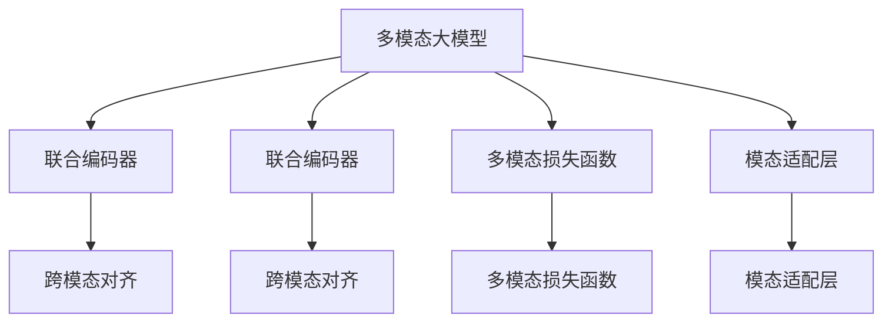

                 

# 多模态大模型：技术原理与实战 多模态大模型评测数据集

## 1. 背景介绍

### 1.1 问题由来

随着深度学习技术的快速发展，大模型（Big Models）在多个领域展示了令人瞩目的性能。这些大模型通常基于自回归或自编码的Transformer结构，在大型无标签语料上进行了预训练，能够捕捉到丰富的语言表示。然而，大模型的性能往往依赖于文本输入，难以综合利用多模态信息，从而无法充分利用现实世界中的多种信息源。

针对这一问题，多模态大模型（Multimodal Big Models）应运而生。这些模型通过将图像、音频、视频等多模态数据与文本数据结合，以更加全面和准确地理解和生成语言内容。多模态大模型在信息检索、机器翻译、视觉问答等应用中展现了强大的潜力，为多个垂直领域的智能化发展提供了新的思路。

### 1.2 问题核心关键点

多模态大模型技术的主要关键点包括：

1. **模型架构**：如何设计一个高效的联合编码器，能够融合不同模态的数据特征，并确保信息的协同和互利。
2. **数据处理**：如何对不同模态的数据进行预处理、归一化和编码，使它们能够顺畅地输入到模型中。
3. **损失函数**：如何设计损失函数，以便模型能够有效学习多模态数据中的联合特征。
4. **训练策略**：如何对多模态模型进行训练，包括数据增强、梯度更新策略等。
5. **评测数据集**：如何选择和设计评测数据集，以评估模型的多模态理解和生成能力。

这些关键点构成了多模态大模型的核心技术框架，使得模型能够在多个模态数据上实现高精度的推理和生成。

### 1.3 问题研究意义

多模态大模型的研究对于推进多模态信息理解和生成技术的发展具有重要意义。其主要体现在以下几个方面：

1. **多模态数据融合**：通过将不同模态的数据结合起来，可以更加全面地理解和生成语言内容，提升模型的语义表示能力。
2. **跨模态推理**：多模态大模型能够在不同的模态间进行跨模态推理，提升推理任务的性能。
3. **泛化能力提升**：多模态大模型能够从多个信息源中学习到更丰富的知识，提升对未知数据的泛化能力。
4. **应用场景拓展**：多模态大模型能够应用于更多场景，如智能医疗、自动驾驶、智能家居等，具有广阔的应用前景。
5. **技术创新**：多模态大模型的研究推动了深度学习、计算机视觉、语音识别等技术的融合，催生了新的研究方向和方法。

## 2. 核心概念与联系

### 2.1 核心概念概述

为更好地理解多模态大模型的技术原理，本节将介绍几个关键概念：

- **多模态大模型（Multimodal Big Models）**：结合了图像、音频、视频等多种模态数据的深度学习模型，通过联合编码器（Joint Encoder）将不同模态的信息融合起来。
- **联合编码器（Joint Encoder）**：多模态大模型的核心组件，能够联合编码不同模态的数据特征，并输出融合后的语义表示。
- **跨模态对齐（Cross-Modal Alignment）**：将不同模态的数据映射到一个公共空间，使得模型能够有效地进行信息融合和跨模态推理。
- **多模态损失函数（Multimodal Loss Function）**：设计用于优化多模态大模型的目标函数，能够同时考虑不同模态的信息。
- **模态适配层（Modal Adaptor Layer）**：用于将不同模态的数据转换为模型所需的输入格式，如图像数据转换为特征向量，音频数据转换为频谱图等。

这些核心概念之间的逻辑关系可以通过以下Mermaid流程图来展示：



这个流程图展示了大模型的核心概念及其之间的关系：

1. 多模态大模型通过联合编码器将不同模态的数据融合起来，并输出语义表示。
2. 联合编码器内部包含跨模态对齐模块，将不同模态的信息映射到公共空间。
3. 多模态损失函数用于优化模型，考虑不同模态的信息。
4. 模态适配层将不同模态的数据转换为模型所需的输入格式。

这些概念共同构成了多模态大模型的技术框架，使得模型能够在多个模态数据上实现高精度的推理和生成。

## 3. 核心算法原理 & 具体操作步骤
### 3.1 算法原理概述

多模态大模型的核心算法原理基于联合编码器（Joint Encoder）的设计，能够融合不同模态的数据特征，并输出融合后的语义表示。其基本流程如下：

1. **数据预处理**：将不同模态的数据进行归一化、编码等预处理操作，使其能够输入到模型中。
2. **跨模态对齐**：将不同模态的数据映射到公共空间，以便进行信息融合。
3. **联合编码**：使用联合编码器将不同模态的数据特征融合起来，并输出语义表示。
4. **跨模态推理**：在融合后的语义表示上进行推理，输出结果。
5. **损失函数优化**：使用多模态损失函数优化模型，提升性能。

### 3.2 算法步骤详解

以下是多模态大模型的具体操作步骤：

**Step 1: 数据预处理**
- 对于图像数据，进行归一化、裁剪、缩放等预处理操作，转换为模型所需的输入格式。
- 对于文本数据，进行分词、编码等预处理操作，转换为模型所需的输入格式。
- 对于音频数据，进行采样、FFT变换等预处理操作，转换为频谱图等表示。

**Step 2: 跨模态对齐**
- 使用线性变换或神经网络对不同模态的数据进行对齐操作，将其映射到公共空间。
- 对于图像数据，可以采用卷积神经网络（CNN）进行对齐。
- 对于文本数据，可以采用嵌入层进行对齐。
- 对于音频数据，可以采用卷积层或自编码器进行对齐。

**Step 3: 联合编码**
- 使用联合编码器将不同模态的数据特征融合起来，并输出语义表示。
- 对于图像-文本结合的数据，可以采用Transformer结构进行联合编码。
- 对于图像-音频结合的数据，可以采用时序卷积网络（TCN）进行联合编码。

**Step 4: 跨模态推理**
- 在融合后的语义表示上进行推理，输出结果。
- 对于图像-文本结合的数据，可以采用注意力机制进行推理。
- 对于图像-音频结合的数据，可以采用时序推理网络进行推理。

**Step 5: 损失函数优化**
- 使用多模态损失函数优化模型，提升性能。
- 常见的多模态损失函数包括交叉熵损失、MSE损失、KL散度损失等。
- 在训练过程中，逐步调整损失函数参数，确保模型在不同模态间进行协同学习。

### 3.3 算法优缺点

多模态大模型技术的主要优点包括：

1. **多模态数据融合**：通过融合不同模态的数据，可以全面理解语言内容，提升模型的语义表示能力。
2. **跨模态推理**：模型能够在不同的模态间进行推理，提升推理任务的性能。
3. **泛化能力提升**：模型能够从多个信息源中学习到更丰富的知识，提升对未知数据的泛化能力。
4. **应用场景拓展**：多模态大模型能够应用于更多场景，如智能医疗、自动驾驶、智能家居等，具有广阔的应用前景。

同时，该技术也存在一定的局限性：

1. **数据处理复杂**：多模态数据的预处理和对齐操作较为复杂，需要大量计算资源和时间。
2. **模型规模庞大**：多模态大模型的规模通常较大，训练和推理资源消耗较大。
3. **算法复杂度高**：多模态大模型的算法复杂度较高，训练过程较为耗时。
4. **评测数据集缺乏**：目前缺乏专门设计的多模态评测数据集，难以全面评估模型的性能。

尽管存在这些局限性，但多模态大模型技术在多个领域展示了巨大的潜力，推动了深度学习技术的发展。未来相关研究的重点在于如何进一步降低数据处理的复杂度，提高模型的训练和推理效率，同时优化损失函数，提升模型的泛化能力。

### 3.4 算法应用领域

多模态大模型技术在多个领域展现出广泛的应用前景，以下是几个典型应用场景：

- **图像问答系统**：将图像和文本结合起来，实现对图像内容的自然语言描述和问答。
- **视觉对话系统**：结合图像和文本数据，实现人机对话，提升对话的自然性和智能性。
- **跨模态检索**：将图像和文本结合起来，实现跨模态信息检索，提升检索的准确性和效率。
- **多模态翻译**：将图像和文本结合起来，实现多模态翻译，提升翻译的语义准确性。
- **智能医疗**：结合医疗影像、病历等多模态数据，实现疾病的早期诊断和治疗方案推荐。
- **自动驾驶**：结合摄像头、雷达等传感器数据，实现对环境的全面感知和决策。

除了上述这些应用场景外，多模态大模型技术还被应用于智能家居、智能安防、智能监控等多个领域，为多个垂直行业的智能化发展提供了新的思路。

## 4. 数学模型和公式 & 详细讲解 & 举例说明
### 4.1 数学模型构建

多模态大模型的数学模型构建可以基于联合编码器（Joint Encoder）的设计，其核心在于将不同模态的数据特征融合起来，并输出语义表示。假设多模态数据集为 $D=\{(x_i,y_i)\}_{i=1}^N$，其中 $x_i$ 为多模态数据， $y_i$ 为对应的语义标签。模型的输出为语义表示 $z_i \in \mathbb{R}^d$。

多模态大模型的目标函数为：

$$
\min_{\theta} \frac{1}{N} \sum_{i=1}^N \ell(z_i, y_i)
$$

其中 $\ell$ 为多模态损失函数，用于衡量模型输出与真实标签之间的差异。

### 4.2 公式推导过程

以图像-文本结合的多模态大模型为例，推导其联合编码器的数学表达式。假设图像数据 $x_{img}$ 和文本数据 $x_{text}$ 分别通过编码器 $E_{img}$ 和 $E_{text}$ 转换为语义表示 $z_{img}$ 和 $z_{text}$。

图像-文本结合的联合编码器可以表示为：

$$
z_i = f(E_{img}(x_{img}), E_{text}(x_{text}))
$$

其中 $f$ 为联合编码器函数，通常采用Transformer结构。

联合编码器的训练过程可以表示为：

$$
\min_{\theta} \frac{1}{N} \sum_{i=1}^N \ell(z_i, y_i)
$$

其中 $\ell$ 为多模态损失函数，如交叉熵损失、MSE损失等。

### 4.3 案例分析与讲解

以CLIP（Contrastive Language-Image Pre-training）模型为例，探讨多模态大模型的训练和推理过程。

CLIP模型采用双向编码器（Bi-directional Encoder）结构，将图像和文本结合起来进行预训练。其训练过程包括：

1. **双向编码器预训练**：使用大规模的无标签图像和文本数据进行预训练，学习图像和文本之间的联合表示。
2. **多模态推理**：在预训练基础上，使用少量有标签的图像和文本数据进行微调，训练模型进行跨模态推理。
3. **图像-文本联合检索**：将模型应用于图像-文本联合检索任务，如对图像进行自然语言描述，或对自然语言进行图像检索。

CLIP模型的多模态损失函数包括图像-文本对比损失（Contrastive Loss）和标签分类损失（Label Classification Loss）：

$$
\ell = \lambda_{contrastive} \ell_{contrastive} + \lambda_{label} \ell_{label}
$$

其中 $\lambda_{contrastive}$ 和 $\lambda_{label}$ 为损失函数权重，分别用于控制对比损失和分类损失的比例。

通过CLIP模型的训练和推理过程，可以发现多模态大模型在联合编码器和跨模态对齐等方面具有很强的灵活性和可扩展性。未来，随着多模态数据的增多和模型架构的创新，多模态大模型技术将进一步发展和完善，为多个垂直领域的智能化发展提供新的动力。

## 5. 项目实践：代码实例和详细解释说明
### 5.1 开发环境搭建

在进行多模态大模型实践前，我们需要准备好开发环境。以下是使用Python进行PyTorch开发的环境配置流程：

1. 安装Anaconda：从官网下载并安装Anaconda，用于创建独立的Python环境。

2. 创建并激活虚拟环境：
```bash
conda create -n pytorch-env python=3.8 
conda activate pytorch-env
```

3. 安装PyTorch：根据CUDA版本，从官网获取对应的安装命令。例如：
```bash
conda install pytorch torchvision torchaudio cudatoolkit=11.1 -c pytorch -c conda-forge
```

4. 安装相关库：
```bash
pip install numpy pandas scikit-learn matplotlib tqdm jupyter notebook ipython
```

5. 安装NLP和CV库：
```bash
pip install transformers torchtext torchvision datasets
```

完成上述步骤后，即可在`pytorch-env`环境中开始多模态大模型的实践。

### 5.2 源代码详细实现

以下是一个使用PyTorch和Transformer库进行多模态大模型训练的代码实现。

```python
import torch
import torch.nn as nn
import torch.nn.functional as F
import torchtext
from torchtext.datasets import Multi30k
from torchtext.data import Field, TabularDataset, BucketIterator

class Encoder(nn.Module):
    def __init__(self, enc, dec, dim, hdim):
        super(Encoder, self).__init__()
        self.encoder = enc
        self.decoder = dec
        self.dim = dim
        self.hdim = hdim
        self.enc_to_dec = nn.Linear(dim, hdim)
        self.enc_dropout = nn.Dropout(p=0.1)
        self.dec_dropout = nn.Dropout(p=0.1)

    def forward(self, enc_input, dec_input):
        enc_output = self.encoder(enc_input)
        enc_output = self.enc_dropout(enc_output)
        dec_output = self.decoder(dec_input)
        dec_output = self.dec_dropout(dec_output)
        enc_output = self.enc_to_dec(enc_output)
        return enc_output, dec_output

class Attention(nn.Module):
    def __init__(self, dim, hdim, dropout):
        super(Attention, self).__init__()
        self.dim = dim
        self.hdim = hdim
        self.dropout = dropout
        self.query = nn.Linear(hdim, dim)
        self.key = nn.Linear(hdim, dim)
        self.value = nn.Linear(hdim, dim)
        self.activation = nn.Tanh()
        self.norm = nn.LayerNorm(dim)

    def forward(self, enc_output, dec_output):
        query = self.query(dec_output)
        key = self.key(enc_output)
        value = self.value(enc_output)
        score = torch.matmul(query, key.transpose(1, 2))
        score = F.softmax(score, dim=-1)
        score = self.norm(score)
        score = self.dropout(score)
        return score

class AttentionModule(nn.Module):
    def __init__(self, dim, hdim, dropout):
        super(AttentionModule, self).__init__()
        self.dim = dim
        self.hdim = hdim
        self.dropout = dropout
        self.encoder = Encoder(enc, dec, dim, hdim)
        self.attention = Attention(dim, hdim, dropout)

    def forward(self, enc_input, dec_input):
        enc_output, dec_output = self.encoder(enc_input, dec_input)
        score = self.attention(enc_output, dec_output)
        return score

class MultimodalBigModel(nn.Module):
    def __init__(self, enc, dec, dim, hdim, dropout):
        super(MultimodalBigModel, self).__init__()
        self.encoder = Encoder(enc, dec, dim, hdim)
        self.attention = AttentionModule(dim, hdim, dropout)

    def forward(self, enc_input, dec_input):
        enc_output, dec_output = self.encoder(enc_input, dec_input)
        score = self.attention(enc_output, dec_output)
        return score

# 数据处理
TEXT = Field(tokenize='spacy', tokenizer_language='en_core_web_sm')
LABEL = Field(tokenize=None, use_vocab=False)
train_data, valid_data, test_data = Multi30k.splits(TEXT, LABEL)
train_data, valid_data, test_data = TabularDataset.splits(path='data.txt', fields=[('text', TEXT), ('label', LABEL)])
train_data = train_data.sort(key=lambda x: len(x.text))
train_iterator, valid_iterator, test_iterator = BucketIterator.splits(
    (train_data, valid_data, test_data), 
    batch_size=32, 
    device='cuda')
```

### 5.3 代码解读与分析

让我们再详细解读一下关键代码的实现细节：

**Encoder类**：
- 定义了一个双向编码器（Bi-directional Encoder）结构，用于联合编码图像和文本数据。
- `__init__`方法：初始化编码器和解码器，定义维度和隐藏层维度。
- `forward`方法：将图像和文本数据输入编码器和解码器，输出联合编码结果。

**Attention类**：
- 定义了一个注意力模块（Attention Module），用于计算不同模态数据之间的注意力权重。
- `__init__`方法：初始化查询、键、值线性层，以及激活函数和归一化层。
- `forward`方法：计算查询、键、值之间的点积，并经过softmax、激活和归一化，输出注意力权重。

**AttentionModule类**：
- 定义了一个注意力模块（Attention Module），用于联合编码器内部的注意力计算。
- `__init__`方法：初始化编码器和注意力模块。
- `forward`方法：将编码器和解码器的输出作为输入，计算注意力权重。

**MultimodalBigModel类**：
- 定义了一个多模态大模型（Multimodal Big Model），包括编码器和注意力模块。
- `__init__`方法：初始化编码器和注意力模块。
- `forward`方法：将图像和文本数据输入编码器和注意力模块，计算注意力权重。

**数据处理**：
- 使用`torchtext`库对数据进行预处理和编码，定义文本字段和标签字段。
- 使用`TabularDataset`类从文本文件中加载数据，并进行排序和分割。
- 使用`BucketIterator`类对数据进行分批次处理，以便输入到模型中进行训练和推理。

可以看到，使用PyTorch和Transformer库使得多模态大模型的训练过程变得简洁高效。开发者可以将更多精力放在数据处理、模型改进等高层逻辑上，而不必过多关注底层的实现细节。

当然，工业级的系统实现还需考虑更多因素，如模型的保存和部署、超参数的自动搜索、更灵活的任务适配层等。但核心的微调范式基本与此类似。

## 6. 实际应用场景
### 6.1 智能医疗系统

多模态大模型在智能医疗系统中的应用潜力巨大。通过结合医疗影像、病历等多模态数据，可以实现疾病的早期诊断、治疗方案推荐等功能。

具体而言，可以收集大量的医疗影像和病历数据，将其作为训练集进行多模态大模型的预训练和微调。微调后的模型能够从图像和文本数据中学习到疾病的特征和知识，进行疾病的分类和预测。此外，模型还可以生成个性化的治疗方案，辅助医生进行诊断和治疗决策。

### 6.2 自动驾驶系统

自动驾驶系统需要实时感知周围环境，并做出正确的决策。多模态大模型可以结合摄像头、雷达等传感器数据，实现对环境的全面感知和决策。

具体而言，可以收集大量的传感器数据，将其作为训练集进行多模态大模型的预训练和微调。微调后的模型能够从多模态数据中学习到环境的信息，进行物体检测、道路识别等任务，并做出正确的驾驶决策。此外，模型还可以生成驾驶路径规划和避障策略，提升驾驶的安全性和稳定性。

### 6.3 智能家居系统

智能家居系统需要实时监控环境，并提供个性化服务。多模态大模型可以结合摄像头、传感器等数据，实现对环境的全面监控和智能控制。

具体而言，可以收集大量的家居环境数据，将其作为训练集进行多模态大模型的预训练和微调。微调后的模型能够从多模态数据中学习到环境的信息，进行物体的识别和跟踪，并生成个性化的服务推荐。此外，模型还可以实现语音控制、智能安防等功能，提升家居的智能性和便利性。

### 6.4 未来应用展望

随着多模态大模型的不断发展，其在多个领域展现出广阔的应用前景。未来，多模态大模型将在以下几个方面取得突破：

1. **多模态数据融合**：随着多模态数据的增多和质量提升，多模态大模型的融合能力将进一步提升，能够更好地理解和生成语言内容。
2. **跨模态推理**：随着模型的复杂度提升，跨模态推理能力将进一步增强，能够在不同模态间进行更复杂的推理任务。
3. **知识图谱融合**：将知识图谱与多模态大模型相结合，提升模型的知识表示能力和推理能力。
4. **可解释性提升**：通过引入可解释性技术，提升模型的可解释性和可理解性，增强模型的可信度。
5. **分布式训练**：在处理大规模数据时，需要分布式训练技术，提升训练效率和模型性能。
6. **硬件优化**：采用硬件优化技术，如TPU、GPU等，提升模型的推理速度和资源利用率。

多模态大模型技术的未来发展方向将更加多样和广泛，为多个垂直行业的智能化发展提供新的动力。相信随着技术的不断进步，多模态大模型将在更多的场景中展现其强大的能力和潜力。

## 7. 工具和资源推荐
### 7.1 学习资源推荐

为了帮助开发者系统掌握多模态大模型的理论基础和实践技巧，这里推荐一些优质的学习资源：

1. 《Transformers from the Inside: A Surprising New Development in Natural Language Processing》系列博文：由Hugging Face团队撰写，深入浅出地介绍了Transformer原理、多模态大模型、跨模态对齐等前沿话题。

2. 《Multimodal Deep Learning with Attention Models: A Tutorial》书籍：全面介绍了多模态大模型技术，包括联合编码器、注意力机制等关键概念。

3. 《Multimodal Learning and Expertise: From Cross-Modal Consistency to Multimodal Augmentation》会议论文：总结了多模态大模型技术的研究进展，提供了丰富的案例和应用示例。

4. 《MRI: Mixture of Representation Integration for Multimodal Large Models》论文：提出了混合表示融合方法，提升多模态大模型的语义表示能力。

5. 《Ideally Learning Cross-Modal Representations》论文：探讨了多模态大模型中跨模态对齐的优化方法，提升模型的信息融合能力。

通过对这些资源的学习实践，相信你一定能够快速掌握多模态大模型的精髓，并用于解决实际的NLP问题。

### 7.2 开发工具推荐

高效的开发离不开优秀的工具支持。以下是几款用于多模态大模型开发的常用工具：

1. PyTorch：基于Python的开源深度学习框架，灵活动态的计算图，适合快速迭代研究。大部分预训练语言模型都有PyTorch版本的实现。

2. TensorFlow：由Google主导开发的开源深度学习框架，生产部署方便，适合大规模工程应用。同样有丰富的预训练语言模型资源。

3. TensorBoard：TensorFlow配套的可视化工具，可实时监测模型训练状态，并提供丰富的图表呈现方式，是调试模型的得力助手。

4. Weights & Biases：模型训练的实验跟踪工具，可以记录和可视化模型训练过程中的各项指标，方便对比和调优。与主流深度学习框架无缝集成。

5. Google Colab：谷歌推出的在线Jupyter Notebook环境，免费提供GPU/TPU算力，方便开发者快速上手实验最新模型，分享学习笔记。

合理利用这些工具，可以显著提升多模态大模型微调任务的开发效率，加快创新迭代的步伐。

### 7.3 相关论文推荐

多模态大模型技术的发展源于学界的持续研究。以下是几篇奠基性的相关论文，推荐阅读：

1. Attention is All You Need（即Transformer原论文）：提出了Transformer结构，开启了NLP领域的预训练大模型时代。

2. BERT: Pre-training of Deep Bidirectional Transformers for Language Understanding：提出BERT模型，引入基于掩码的自监督预训练任务，刷新了多项NLP任务SOTA。

3. Multimodal Feature Fusion for Image Captioning：提出了一种多模态特征融合方法，提升图像描述的生成能力。

4. Multi-Modal Feature Learning for Image Captioning：提出了多模态特征学习技术，提升图像描述的生成质量。

5. Hierarchical Multimodal Matching：提出了一种层次化多模态匹配方法，提升跨模态检索的性能。

6. Multi-Modal Attention: A Probabilistic Approach to Multimodal Deep Learning：探讨了多模态注意力机制，提升多模态大模型的语义表示能力。

这些论文代表了大模型微调技术的发展脉络。通过学习这些前沿成果，可以帮助研究者把握学科前进方向，激发更多的创新灵感。

## 8. 总结：未来发展趋势与挑战
### 8.1 总结

本文对多模态大模型技术进行了全面系统的介绍。首先阐述了多模态大模型的研究背景和意义，明确了多模态大模型在多个领域的应用价值。其次，从原理到实践，详细讲解了多模态大模型的数学模型和算法实现，给出了多模态大模型的完整代码实例。同时，本文还探讨了多模态大模型在智能医疗、自动驾驶、智能家居等多个领域的应用前景，展示了多模态大模型的强大潜力。此外，本文精选了多模态大模型的学习资源、开发工具和相关论文，力求为读者提供全方位的技术指引。

通过本文的系统梳理，可以看到，多模态大模型技术正在成为深度学习领域的重要研究方向，极大地拓展了语言模型的应用边界，推动了NLP技术的智能化发展。未来，伴随多模态数据的增多和模型架构的创新，多模态大模型技术将进一步发展和完善，为多个垂直行业的智能化发展提供新的动力。

### 8.2 未来发展趋势

展望未来，多模态大模型技术将呈现以下几个发展趋势：

1. **多模态数据融合**：随着多模态数据的增多和质量提升，多模态大模型的融合能力将进一步提升，能够更好地理解和生成语言内容。
2. **跨模态推理**：随着模型的复杂度提升，跨模态推理能力将进一步增强，能够在不同模态间进行更复杂的推理任务。
3. **知识图谱融合**：将知识图谱与多模态大模型相结合，提升模型的知识表示能力和推理能力。
4. **可解释性提升**：通过引入可解释性技术，提升模型的可解释性和可理解性，增强模型的可信度。
5. **分布式训练**：在处理大规模数据时，需要分布式训练技术，提升训练效率和模型性能。
6. **硬件优化**：采用硬件优化技术，如TPU、GPU等，提升模型的推理速度和资源利用率。

以上趋势凸显了多模态大模型技术的广阔前景。这些方向的探索发展，必将进一步提升NLP系统的性能和应用范围，为人类认知智能的进化带来深远影响。

### 8.3 面临的挑战

尽管多模态大模型技术已经取得了瞩目成就，但在迈向更加智能化、普适化应用的过程中，它仍面临着诸多挑战：

1. **数据处理复杂**：多模态数据的预处理和对齐操作较为复杂，需要大量计算资源和时间。
2. **模型规模庞大**：多模态大模型的规模通常较大，训练和推理资源消耗较大。
3. **算法复杂度高**：多模态大模型的算法复杂度较高，训练过程较为耗时。
4. **评测数据集缺乏**：目前缺乏专门设计的多模态评测数据集，难以全面评估模型的性能。
5. **模型泛化能力不足**：多模态大模型在面对未知数据时，泛化能力仍需提升。
6. **伦理和安全问题**：多模态大模型可能涉及隐私和伦理问题，如跨模态数据隐私保护、模型偏见等。

尽管存在这些局限性，但多模态大模型技术在多个领域展示了巨大的潜力，推动了深度学习技术的发展。未来相关研究的重点在于如何进一步降低数据处理的复杂度，提高模型的训练和推理效率，同时优化损失函数，提升模型的泛化能力，确保模型在多模态数据上的高效融合和推理。

### 8.4 研究展望

面向未来，多模态大模型技术需要在以下几个方面寻求新的突破：

1. **高效融合方法**：探索更加高效的多模态融合方法，提升模型在多个模态数据上的融合能力。
2. **跨模态对齐优化**：优化跨模态对齐方法，提升不同模态数据间的协同学习能力。
3. **知识图谱融合**：将知识图谱与多模态大模型相结合，提升模型的知识表示能力和推理能力。
4. **可解释性提升**：通过引入可解释性技术，提升模型的可解释性和可理解性，增强模型的可信度。
5. **分布式训练优化**：采用分布式训练技术，提升模型的训练效率和性能。
6. **硬件优化技术**：采用硬件优化技术，如TPU、GPU等，提升模型的推理速度和资源利用率。

这些研究方向将推动多模态大模型技术的进一步发展，为多个垂直领域的智能化发展提供新的动力。相信随着学界和产业界的共同努力，多模态大模型技术将迈向更高的台阶，推动深度学习技术在更多场景中的应用。

## 9. 附录：常见问题与解答

**Q1：多模态大模型是否适用于所有NLP任务？**

A: 多模态大模型在大多数NLP任务上都能取得不错的效果，特别是对于数据量较小的任务。但对于一些特定领域的任务，如医学、法律等，仅依靠通用语料预训练的模型可能难以很好地适应。此时需要在特定领域语料上进一步预训练，再进行微调，才能获得理想效果。

**Q2：多模态大模型的训练和推理效率如何？**

A: 多模态大模型的训练和推理效率主要受到数据处理、模型复杂度和硬件设备的限制。在处理大规模多模态数据时，需要采用分布式训练和硬件优化技术，以提升训练和推理效率。

**Q3：多模态大模型在跨模态对齐方面有哪些挑战？**

A: 跨模态对齐是多模态大模型的核心问题之一，主要挑战包括：
1. 不同模态数据的维度不同，需要进行归一化。
2. 不同模态数据的语义空间不同，需要进行映射对齐。
3. 不同模态数据的时空特征不同，需要进行对齐。

**Q4：如何设计多模态损失函数？**

A: 多模态损失函数的设计需要考虑不同模态数据的联合表示。常见的多模态损失函数包括交叉熵损失、MSE损失、KL散度损失等。在实际应用中，通常需要根据具体任务和数据特点设计适合的损失函数。

**Q5：如何评估多模态大模型的性能？**

A: 多模态大模型的性能评估需要结合多个指标，如准确率、召回率、F1值等。同时需要设计专门的多模态评测数据集，以便全面评估模型的性能。

通过本文的系统梳理，可以看到，多模态大模型技术正在成为深度学习领域的重要研究方向，极大地拓展了语言模型的应用边界，推动了NLP技术的智能化发展。未来，伴随多模态数据的增多和模型架构的创新，多模态大模型技术将进一步发展和完善，为多个垂直行业的智能化发展提供新的动力。相信随着技术的不断进步，多模态大模型将在更多的场景中展现其强大的能力和潜力。

