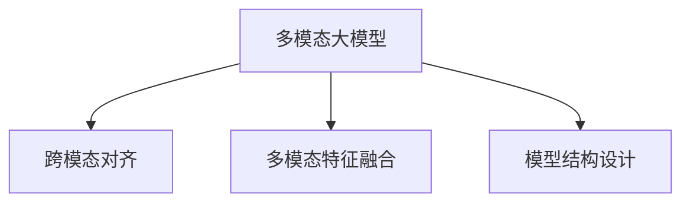

                 

## 1. 背景介绍

### 1.1 问题由来

随着人工智能技术的飞速发展，多模态大模型（Multimodal Large Models, MLMs）逐渐成为热门研究话题。在计算机视觉、自然语言处理和音频处理等领域，多模态学习模型如OpenAI的GPT系列、Google的BERT等，已展现出强大的应用潜力。GPT-3的发布，标志着AI进入多模态智能时代，展示了多模态学习在自然语言处理中的巨大潜力。然而，多模态大模型的设计和实现仍存在诸多挑战，需要通过技术原理与实战来深化理解。

### 1.2 问题核心关键点

多模态大模型融合了文本、图像、音频等多种模态的信息，具有强大的跨模态理解和推理能力。然而，这些模型的设计、训练和优化仍存在许多复杂问题，如跨模态对齐、多模态特征融合、模型结构设计等。本研究将从技术原理与实战两个方面，探讨多模态大模型的构建与应用。

## 2. 核心概念与联系

### 2.1 核心概念概述

为更好地理解多模态大模型的技术原理与实战，本节将介绍几个密切相关的核心概念：

- **多模态大模型（MLMs）**：融合多种模态信息，如文本、图像、音频等的深度学习模型。这些模型通过预训练获得通用表示，并能够在多种模态数据上执行特定的下游任务。
- **跨模态对齐（Cross-Modal Alignment）**：不同模态之间的特征表示对齐，使它们在语义上能够相互理解。跨模态对齐是构建多模态大模型的关键。
- **多模态特征融合（Multimodal Feature Fusion）**：将不同模态的特征表示进行整合，形成统一的特征向量，以便进行跨模态任务。
- **模型结构设计（Model Architecture Design）**：设计符合多模态数据特点的神经网络结构，以提升模型的表现。

这些核心概念之间的逻辑关系可以通过以下Mermaid流程图来展示：



这个流程图展示了大模型构建的核心概念及其之间的关系：

1. 多模态大模型通过跨模态对齐获得不同模态的通用表示。
2. 通过多模态特征融合，模型整合多种模态信息，执行下游任务。
3. 模型结构设计确保跨模态对齐和多模态特征融合的有效实现。

这些概念共同构成了多模态大模型的核心，使得模型能够跨越模态界限，进行多模态学习和推理。

## 3. 核心算法原理 & 具体操作步骤

### 3.1 算法原理概述

多模态大模型的核心算法通常包括预训练和微调两个阶段。在预训练阶段，模型在大量的跨模态数据上进行自监督学习，学习到通用的多模态表示。在微调阶段，模型利用特定任务的数据集进行有监督训练，进一步优化模型的性能。

形式化地，设多模态大模型为 $M_{\theta}$，其中 $\theta$ 为模型参数。假设多模态数据集为 $D=\{(x_i,y_i)\}_{i=1}^N$，其中 $x_i$ 为包含文本、图像、音频等多种模态的样本，$y_i$ 为样本标签。预训练的目标是最小化多模态数据的重构误差，即：

$$
\mathcal{L}(\theta) = \frac{1}{N}\sum_{i=1}^N \ell(x_i,y_i)
$$

其中 $\ell$ 为多模态数据下的损失函数。在微调阶段，模型通过有监督学习进一步优化：

$$
\hat{\theta}=\mathop{\arg\min}_{\theta} \mathcal{L}(M_{\theta},D)
$$

## 3.2 算法步骤详解

多模态大模型的构建和微调通常包括以下关键步骤：

**Step 1: 准备数据集**

- 收集和整理多模态数据集，确保数据集的多样性和丰富性。
- 将数据集划分为训练集、验证集和测试集，并保证数据集的均衡性。
- 进行数据预处理，如数据增强、标准化等，确保输入数据的质量。

**Step 2: 设计模型结构**

- 根据任务需求，设计符合多模态数据特点的神经网络结构。
- 确定模型各层的跨模态对齐策略，如模态注意力机制、交叉熵对齐等。
- 设计多模态特征融合方式，如加权求和、通道混合等。

**Step 3: 预训练和微调**

- 在预训练阶段，使用大量跨模态数据对模型进行训练，最小化多模态数据重构误差。
- 在微调阶段，利用特定任务的数据集进行有监督训练，进一步优化模型的性能。
- 选择适当的优化算法，如AdamW、SGD等，并设置合适的超参数，如学习率、批大小等。

**Step 4: 模型评估和部署**

- 在验证集上评估模型性能，选择最佳模型进行测试。
- 将模型部署到实际应用场景中，并根据反馈不断优化模型。
- 定期更新模型，保持模型性能的稳定性和适应性。

## 3.3 算法优缺点

多模态大模型的设计基于以下几个关键算法：

- **Transformer**：Transformer结构是构建多模态大模型的核心。其自注意力机制和编码-解码结构，使其能够有效地处理长序列和复杂结构。
- **BERT和GPT**：BERT和GPT等预训练模型在多模态数据上的预训练和微调，为多模态大模型的构建提供了良好的基础。
- **跨模态对齐**：跨模态对齐是构建多模态大模型的关键。常用的对齐方法包括模态注意力、通道混合等。

这些算法在多模态大模型的构建中扮演了重要角色，但也存在一些局限性：

- **计算复杂度高**：多模态大模型的计算复杂度较高，对硬件要求较高。
- **数据标注成本高**：多模态大模型的构建需要大量的标注数据，数据标注成本较高。
- **模型泛化性有限**：多模态大模型在不同模态下的泛化性有限，可能存在模态鸿沟。
- **数据不平衡问题**：多模态数据集可能存在不平衡问题，影响模型性能。

## 3.4 算法应用领域

多模态大模型在多个领域中得到了广泛应用，如：

- **医疗影像诊断**：多模态大模型能够结合医学影像、病历和实验室数据，提高疾病诊断的准确性。
- **自动驾驶**：多模态大模型能够融合摄像头、雷达和激光雷达等多模态数据，提高自动驾驶的安全性和准确性。
- **工业制造**：多模态大模型能够结合传感器数据和图像数据，进行故障诊断和预测维护。
- **社交媒体分析**：多模态大模型能够分析用户的文本数据、图像和视频数据，进行情感分析、舆情监测等任务。

## 4. 数学模型和公式 & 详细讲解

### 4.1 数学模型构建

多模态大模型的数学模型通常包括多模态数据表示和损失函数。设多模态数据 $x$ 包括文本 $x_t$、图像 $x_i$ 和音频 $x_a$，其表示为：

$$
x = (x_t, x_i, x_a)
$$

多模态大模型的损失函数通常包括跨模态对齐损失和多模态特征融合损失：

- **跨模态对齐损失**：最小化不同模态之间的表示差异，如交叉熵损失。
- **多模态特征融合损失**：最小化融合后的特征表示与真实标签之间的差距，如均方误差损失。

### 4.2 公式推导过程

以图像和文本数据的跨模态对齐为例，设图像特征表示为 $x_i \in \mathbb{R}^d$，文本特征表示为 $x_t \in \mathbb{R}^d$，跨模态对齐损失为：

$$
\mathcal{L}_{align} = \mathbb{E}_{(x_i, x_t)}[-\log \sigma(s(x_i, x_t))]
$$

其中 $\sigma$ 为sigmoid函数，$s(x_i, x_t)$ 为多模态对齐函数，用于将图像和文本特征对齐。

多模态特征融合通常采用通道混合的方式，即将不同模态的特征表示加权求和：

$$
z = \alpha x_t + (1-\alpha)x_i + \beta x_a
$$

其中 $\alpha$、$\beta$ 为不同模态特征的权重。

### 4.3 案例分析与讲解

以医学影像诊断为例，多模态大模型可以结合医学影像、病历和实验室数据，进行疾病诊断。假设有图像数据 $x_i$、病历文本数据 $x_t$ 和实验室检测数据 $x_a$，可以使用BERT模型进行预训练，并利用多模态特征融合的方法，构建一个多模态大模型。在微调阶段，可以利用标注数据对模型进行训练，最小化诊断误差。

## 5. 项目实践：代码实例和详细解释说明

### 5.1 开发环境搭建

在进行多模态大模型实践前，我们需要准备好开发环境。以下是使用Python进行PyTorch开发的环境配置流程：

1. 安装Anaconda：从官网下载并安装Anaconda，用于创建独立的Python环境。
2. 创建并激活虚拟环境：
```bash
conda create -n pytorch-env python=3.8 
conda activate pytorch-env
```

3. 安装PyTorch：根据CUDA版本，从官网获取对应的安装命令。例如：
```bash
conda install pytorch torchvision torchaudio cudatoolkit=11.1 -c pytorch -c conda-forge
```

4. 安装Transformers库：
```bash
pip install transformers
```

5. 安装各类工具包：
```bash
pip install numpy pandas scikit-learn matplotlib tqdm jupyter notebook ipython
```

完成上述步骤后，即可在`pytorch-env`环境中开始多模态大模型的微调实践。

### 5.2 源代码详细实现

以下是一个基于图像和文本的多模态大模型微调代码实现。

首先，定义多模态数据处理函数：

```python
from transformers import BertTokenizer, BertForMultimodal
from torch.utils.data import Dataset
import torch

class MultimodalDataset(Dataset):
    def __init__(self, images, texts, labels, tokenizer, max_len=128):
        self.images = images
        self.texts = texts
        self.labels = labels
        self.tokenizer = tokenizer
        self.max_len = max_len
        
    def __len__(self):
        return len(self.texts)
    
    def __getitem__(self, item):
        image = self.images[item]
        text = self.texts[item]
        label = self.labels[item]
        
        encoding = self.tokenizer(text, return_tensors='pt', max_length=self.max_len, padding='max_length', truncation=True)
        image = torch.tensor(image, dtype=torch.float32).unsqueeze(0)
        
        return {
            'images': image,
            'text': encoding['input_ids'][0],
            'attention_mask': encoding['attention_mask'][0],
            'labels': torch.tensor(label, dtype=torch.long)
        }
```

然后，定义模型和优化器：

```python
from transformers import BertForMultimodal, AdamW

model = BertForMultimodal.from_pretrained('bert-base-cased', num_labels=2)

optimizer = AdamW(model.parameters(), lr=2e-5)
```

接着，定义训练和评估函数：

```python
from torch.utils.data import DataLoader
from tqdm import tqdm
from sklearn.metrics import classification_report

device = torch.device('cuda') if torch.cuda.is_available() else torch.device('cpu')
model.to(device)

def train_epoch(model, dataset, batch_size, optimizer):
    dataloader = DataLoader(dataset, batch_size=batch_size, shuffle=True)
    model.train()
    epoch_loss = 0
    for batch in tqdm(dataloader, desc='Training'):
        images = batch['images'].to(device)
        text = batch['text'].to(device)
        attention_mask = batch['attention_mask'].to(device)
        labels = batch['labels'].to(device)
        model.zero_grad()
        outputs = model(images, text, attention_mask=attention_mask, labels=labels)
        loss = outputs.loss
        epoch_loss += loss.item()
        loss.backward()
        optimizer.step()
    return epoch_loss / len(dataloader)

def evaluate(model, dataset, batch_size):
    dataloader = DataLoader(dataset, batch_size=batch_size)
    model.eval()
    preds, labels = [], []
    with torch.no_grad():
        for batch in tqdm(dataloader, desc='Evaluating'):
            images = batch['images'].to(device)
            text = batch['text'].to(device)
            attention_mask = batch['attention_mask'].to(device)
            batch_labels = batch['labels']
            outputs = model(images, text, attention_mask=attention_mask)
            batch_preds = outputs.logits.argmax(dim=1).to('cpu').tolist()
            batch_labels = batch_labels.to('cpu').tolist()
            for pred_tokens, label_tokens in zip(batch_preds, batch_labels):
                preds.append(pred_tokens[:len(label_tokens)])
                labels.append(label_tokens)
                
    print(classification_report(labels, preds))
```

最后，启动训练流程并在测试集上评估：

```python
epochs = 5
batch_size = 16

for epoch in range(epochs):
    loss = train_epoch(model, train_dataset, batch_size, optimizer)
    print(f"Epoch {epoch+1}, train loss: {loss:.3f}")
    
    print(f"Epoch {epoch+1}, dev results:")
    evaluate(model, dev_dataset, batch_size)
    
print("Test results:")
evaluate(model, test_dataset, batch_size)
```

以上就是使用PyTorch对BERT进行多模态数据微调的PyTorch代码实现。可以看到，得益于Transformers库的强大封装，我们可以用相对简洁的代码完成多模态大模型的微调。

### 5.3 代码解读与分析

让我们再详细解读一下关键代码的实现细节：

**MultimodalDataset类**：
- `__init__`方法：初始化图像数据、文本数据和标签，分词器等关键组件。
- `__len__`方法：返回数据集的样本数量。
- `__getitem__`方法：对单个样本进行处理，将文本输入编码为token ids，图像数据转换为张量，并进行定长padding，最终返回模型所需的输入。

**训练和评估函数**：
- 使用PyTorch的DataLoader对数据集进行批次化加载，供模型训练和推理使用。
- 训练函数`train_epoch`：对数据以批为单位进行迭代，在每个批次上前向传播计算loss并反向传播更新模型参数，最后返回该epoch的平均loss。
- 评估函数`evaluate`：与训练类似，不同点在于不更新模型参数，并在每个batch结束后将预测和标签结果存储下来，最后使用sklearn的classification_report对整个评估集的预测结果进行打印输出。

**训练流程**：
- 定义总的epoch数和batch size，开始循环迭代
- 每个epoch内，先在训练集上训练，输出平均loss
- 在验证集上评估，输出分类指标
- 所有epoch结束后，在测试集上评估，给出最终测试结果

可以看到，PyTorch配合Transformers库使得多模态大模型的微调代码实现变得简洁高效。开发者可以将更多精力放在数据处理、模型改进等高层逻辑上，而不必过多关注底层的实现细节。

当然，工业级的系统实现还需考虑更多因素，如模型的保存和部署、超参数的自动搜索、更灵活的任务适配层等。但核心的微调范式基本与此类似。

## 6. 实际应用场景

### 6.1 智能医疗影像诊断

多模态大模型在医学影像诊断中的应用非常广泛。传统医学影像诊断依赖放射科医生，耗时长、成本高、准确性受限于医生的水平和经验。多模态大模型能够结合医学影像、病历和实验室数据，提高疾病诊断的准确性。

例如，可以使用多模态大模型对CT影像、MRI影像和病历文本进行联合分析，识别出肿瘤等病变区域，提供疾病诊断和治疗建议。多模态大模型能够从多种数据源中提取特征，整合为统一的表示，进行疾病诊断，减少对医生的依赖。

### 6.2 自动驾驶

自动驾驶技术需要融合摄像头、雷达和激光雷达等多种传感器数据，才能实现高精度的环境感知和决策。多模态大模型能够处理多种传感器数据，进行环境感知和路径规划。

例如，可以使用多模态大模型对摄像头图像、雷达数据和激光雷达数据进行联合分析，识别出道路障碍物、行人和车辆，进行路径规划和驾驶决策。多模态大模型能够从多种传感器数据中提取特征，整合为统一的表示，进行驾驶决策，提高自动驾驶的安全性和准确性。

### 6.3 工业制造

工业制造中的机器设备和传感器会产生大量数据，需要综合分析这些数据，进行故障诊断和预测维护。多模态大模型能够结合传感器数据和图像数据，进行故障诊断和预测维护。

例如，可以使用多模态大模型对机器设备的传感器数据和运行状态进行联合分析，识别出设备故障，进行预测维护。多模态大模型能够从多种数据源中提取特征，整合为统一的表示，进行故障诊断，减少设备停机时间，提高生产效率。

### 6.4 社交媒体分析

社交媒体数据包含文本、图片和视频等多种模态，需要进行综合分析，进行情感分析、舆情监测等任务。多模态大模型能够处理多种数据模态，进行情感分析和舆情监测。

例如，可以使用多模态大模型对社交媒体上的文本数据、图片和视频数据进行联合分析，识别出用户的情感倾向，进行舆情监测。多模态大模型能够从多种数据模态中提取特征，整合为统一的表示，进行情感分析和舆情监测，提高社交媒体分析的准确性。

## 7. 工具和资源推荐

### 7.1 学习资源推荐

为了帮助开发者系统掌握多模态大模型的技术原理和实践技巧，这里推荐一些优质的学习资源：

1. 《Transformer from Principles to Practice》系列博文：由大模型技术专家撰写，深入浅出地介绍了Transformer原理、BERT模型、多模态学习等前沿话题。

2. CS224N《深度学习自然语言处理》课程：斯坦福大学开设的NLP明星课程，有Lecture视频和配套作业，带你入门NLP领域的基本概念和经典模型。

3. 《Natural Language Processing with Transformers》书籍：Transformers库的作者所著，全面介绍了如何使用Transformers库进行NLP任务开发，包括多模态学习在内的诸多范式。

4. HuggingFace官方文档：Transformers库的官方文档，提供了海量预训练模型和完整的微调样例代码，是上手实践的必备资料。

5. CLUE开源项目：中文语言理解测评基准，涵盖大量不同类型的中文NLP数据集，并提供了基于多模态学习任务的baseline模型，助力中文NLP技术发展。

通过对这些资源的学习实践，相信你一定能够快速掌握多模态大模型的精髓，并用于解决实际的NLP问题。

### 7.2 开发工具推荐

高效的开发离不开优秀的工具支持。以下是几款用于多模态大模型微调开发的常用工具：

1. PyTorch：基于Python的开源深度学习框架，灵活动态的计算图，适合快速迭代研究。大部分预训练语言模型都有PyTorch版本的实现。

2. TensorFlow：由Google主导开发的开源深度学习框架，生产部署方便，适合大规模工程应用。同样有丰富的预训练语言模型资源。

3. Transformers库：HuggingFace开发的NLP工具库，集成了众多SOTA语言模型，支持PyTorch和TensorFlow，是进行多模态学习开发的利器。

4. Weights & Biases：模型训练的实验跟踪工具，可以记录和可视化模型训练过程中的各项指标，方便对比和调优。与主流深度学习框架无缝集成。

5. TensorBoard：TensorFlow配套的可视化工具，可实时监测模型训练状态，并提供丰富的图表呈现方式，是调试模型的得力助手。

6. Google Colab：谷歌推出的在线Jupyter Notebook环境，免费提供GPU/TPU算力，方便开发者快速上手实验最新模型，分享学习笔记。

合理利用这些工具，可以显著提升多模态大模型微调任务的开发效率，加快创新迭代的步伐。

### 7.3 相关论文推荐

多模态大模型的研究源于学界的持续研究。以下是几篇奠基性的相关论文，推荐阅读：

1. Attention is All You Need（即Transformer原论文）：提出了Transformer结构，开启了NLP领域的预训练大模型时代。

2. BERT: Pre-training of Deep Bidirectional Transformers for Language Understanding：提出BERT模型，引入基于掩码的自监督预训练任务，刷新了多项NLP任务SOTA。

3. Multimodal Feature Fusion in a Transformer Architecture：提出Transformer架构中的多模态特征融合方法，为多模态学习提供了新的思路。

4. Multimodal Scene Understanding with Attention and Fusion：提出多模态场景理解方法，利用跨模态注意力机制和通道混合方法，提升了多模态学习的效果。

5. Multimodal Deep Learning: A New Scientific Frontier: Opportunities, Challenges, and Applications：综述了多模态深度学习的最新进展，提出了多模态深度学习的方向和挑战。

这些论文代表了大模型多模态学习的方向，通过学习这些前沿成果，可以帮助研究者把握学科前进方向，激发更多的创新灵感。

## 8. 总结：未来发展趋势与挑战

### 8.1 总结

本文对基于多模态大模型的技术原理与实战进行了全面系统的介绍。首先阐述了多模态大模型的研究背景和意义，明确了多模态大模型在跨模态理解和推理中的重要价值。其次，从原理到实践，详细讲解了多模态大模型的数学模型构建和关键步骤，给出了多模态大模型微调的完整代码实例。同时，本文还广泛探讨了多模态大模型在医疗影像诊断、自动驾驶、工业制造、社交媒体分析等多个领域的应用前景，展示了多模态大模型的巨大潜力。此外，本文精选了多模态大模型的各类学习资源，力求为读者提供全方位的技术指引。

通过本文的系统梳理，可以看到，多模态大模型在多模态学习和推理中具有强大的应用潜力，极大地拓展了深度学习模型的应用范围。未来，伴随多模态学习技术的不断发展，多模态大模型必将在更多领域得到应用，为人类认知智能的进化带来深远影响。

### 8.2 未来发展趋势

展望未来，多模态大模型将呈现以下几个发展趋势：

1. **模型规模持续增大**：随着算力成本的下降和数据规模的扩张，多模态大模型的参数量还将持续增长。超大规模语言模型蕴含的丰富语言知识，有望支撑更加复杂多变的下游任务。

2. **多模态对齐技术提升**：未来将涌现更多高效的多模态对齐方法，如深度跨模态注意力机制、通道混合等，提升不同模态之间的对齐效果。

3. **多模态特征融合技术改进**：新的多模态特征融合方法将不断涌现，如深度残差网络、通道加权等，提升多模态特征的整合效果。

4. **多模态学习范式丰富**：除了传统的监督学习和自监督学习，未来将涌现更多多模态学习范式，如对抗训练、自适应学习等，提升模型的泛化能力和鲁棒性。

5. **多模态模型应用拓展**：多模态大模型将在更多领域得到应用，如智能医疗、自动驾驶、工业制造、社交媒体分析等，推动各行各业的数字化转型。

6. **跨模态推理能力增强**：未来的多模态大模型将具备更强的跨模态推理能力，能够在不同模态之间进行语义对齐和推理，实现更加复杂多变的任务。

以上趋势凸显了多模态大模型的广阔前景。这些方向的探索发展，必将进一步提升多模态大模型的性能和应用范围，为构建人机协同的智能系统铺平道路。

### 8.3 面临的挑战

尽管多模态大模型在多模态学习和推理中展示了强大的潜力，但在迈向更加智能化、普适化应用的过程中，仍面临诸多挑战：

1. **数据标注成本高**：多模态大模型的构建需要大量的标注数据，数据标注成本较高。如何降低数据标注成本，提高数据质量，是亟待解决的问题。

2. **模型泛化能力有限**：多模态大模型在不同模态下的泛化能力有限，可能存在模态鸿沟。如何提升模型泛化能力，避免模态鸿沟，是未来研究的重点。

3. **计算复杂度高**：多模态大模型的计算复杂度较高，对硬件要求较高。如何优化计算复杂度，提高模型的推理速度，是亟需解决的问题。

4. **跨模态对齐困难**：跨模态对齐是构建多模态大模型的关键，但不同模态之间的特征表示差异较大，难以进行对齐。如何提升跨模态对齐效果，是未来的研究方向。

5. **模型解释性不足**：多模态大模型往往是一个"黑盒"系统，难以解释其内部工作机制和决策逻辑。如何增强模型的可解释性，是亟需解决的问题。

6. **安全性有待保障**：多模态大模型可能学习到有偏见、有害的信息，通过微调传递到下游任务，产生误导性、歧视性的输出。如何从数据和算法层面消除模型偏见，避免恶意用途，确保输出的安全性，是未来的研究方向。

### 8.4 研究展望

面对多模态大模型所面临的挑战，未来的研究需要在以下几个方面寻求新的突破：

1. **探索无监督和半监督多模态学习方法**：摆脱对大规模标注数据的依赖，利用自监督学习、主动学习等无监督和半监督范式，最大限度利用非结构化数据，实现更加灵活高效的多模态学习。

2. **开发更加参数高效的多模态学习算法**：开发更加参数高效的多模态学习算法，在固定大部分预训练参数的同时，只更新极少量的任务相关参数。

3. **引入因果推断和博弈论工具**：将因果推断和博弈论思想引入多模态学习，增强模型的因果关系建立能力，学习更加普适、鲁棒的多模态表征。

4. **融合跨模态数据源**：将符号化的先验知识，如知识图谱、逻辑规则等，与神经网络模型进行巧妙融合，引导多模态学习过程，学习更加准确、合理的表征。

5. **结合因果分析和博弈论工具**：将因果分析方法引入多模态学习，识别出模型决策的关键特征，增强输出解释的因果性和逻辑性。借助博弈论工具刻画人机交互过程，主动探索并规避模型的脆弱点，提高系统稳定性。

6. **纳入伦理道德约束**：在模型训练目标中引入伦理导向的评估指标，过滤和惩罚有偏见、有害的输出倾向。同时加强人工干预和审核，建立模型行为的监管机制，确保输出符合人类价值观和伦理道德。

这些研究方向的探索，必将引领多模态大模型迈向更高的台阶，为构建安全、可靠、可解释、可控的智能系统铺平道路。面向未来，多模态大模型需要与其他人工智能技术进行更深入的融合，如知识表示、因果推理、强化学习等，多路径协同发力，共同推动自然语言理解和智能交互系统的进步。只有勇于创新、敢于突破，才能不断拓展语言模型的边界，让智能技术更好地造福人类社会。

## 9. 附录：常见问题与解答

**Q1：多模态大模型是否适用于所有NLP任务？**

A: 多模态大模型在大多数NLP任务上都能取得不错的效果，特别是对于数据量较小的任务。但对于一些特定领域的任务，如医学、法律等，仅仅依靠通用语料预训练的模型可能难以很好地适应。此时需要在特定领域语料上进一步预训练，再进行微调，才能获得理想效果。此外，对于一些需要时效性、个性化很强的任务，如对话、推荐等，多模态大模型也需要针对性的改进优化。

**Q2：如何选择多模态大模型的跨模态对齐方法？**

A: 选择合适的跨模态对齐方法需要考虑不同模态的特性和任务需求。常用的对齐方法包括模态注意力、通道混合等。模态注意力适用于不同模态之间特征表示的对齐，通道混合适用于多种模态特征的整合。具体选择哪种方法，需要根据任务特性和数据特点进行选择。

**Q3：多模态大模型的训练数据标注成本高，如何解决？**

A: 数据标注成本高是多模态大模型面临的一个主要问题。解决这一问题的方法包括：利用无监督学习、半监督学习等方法，尽量减少对标注数据的需求；采用数据增强、数据合成等方法，提高数据的多样性和数量；利用预训练模型，减少对标注数据的需求。

**Q4：多模态大模型的跨模态对齐效果不佳，如何解决？**

A: 跨模态对齐效果不佳是多模态大模型面临的一个主要问题。解决这一问题的方法包括：改进模型架构，引入跨模态注意力机制、深度残差网络等；优化对齐方法，引入深度跨模态注意力机制、通道混合等；采用数据增强、数据合成等方法，提高数据的多样性和数量。

**Q5：多模态大模型的训练效率低，如何解决？**

A: 多模态大模型的训练效率低是多模态大模型面临的一个主要问题。解决这一问题的方法包括：优化模型架构，减少不必要的参数；采用分布式训练、混合精度训练等方法，提高训练效率；优化计算图，减少前向传播和反向传播的资源消耗。

通过本文的系统梳理，可以看到，多模态大模型在多模态学习和推理中具有强大的应用潜力，极大地拓展了深度学习模型的应用范围。未来，伴随多模态学习技术的不断发展，多模态大模型必将在更多领域得到应用，为人类认知智能的进化带来深远影响。

---

作者：禅与计算机程序设计艺术 / Zen and the Art of Computer Programming

