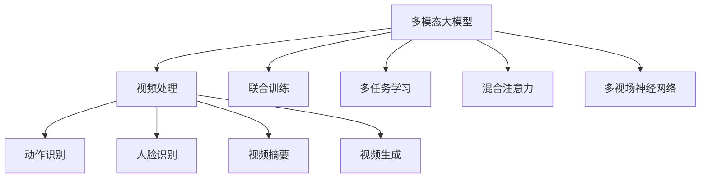

                 

# 多模态大模型：技术原理与实战 视频多模态技术

> 关键词：多模态大模型，技术原理，实战应用，视频处理，多模态融合

## 1. 背景介绍

### 1.1 问题由来
随着AI技术的不断发展，多模态大模型的研究和应用取得了显著进展。这些模型能够同时处理和分析多种数据模态（如文本、图像、音频等），从而在处理复杂任务时表现出更强的理解和生成能力。视频处理是多模态数据处理的重要领域，涵盖了动作识别、人脸识别、视频摘要、视频生成等多个方向。视频处理需要同时处理视觉和音频等多模态信息，这对传统模型提出了新的挑战。

多模态大模型在视频处理中的重要应用包括动作识别、人脸识别、视频摘要、视频生成等。动作识别指的是在视频中识别和分类出不同的动作，如跳舞、运动、体育活动等。人脸识别则是在视频中识别人脸，并实现身份验证、表情分析等功能。视频摘要是从长时间的视频中自动生成关键帧、重要事件和总结，以提高信息检索和内容理解效率。视频生成则是利用深度学习技术生成高质量的视频内容，如电影、广告等。

多模态大模型在视频处理中的应用，不仅提升了处理效率和准确性，还拓展了视频处理的边界，为更多创新应用提供了可能。

### 1.2 问题核心关键点
多模态大模型的核心思想是将多个模态的数据融合，形成一个统一的表示空间，并通过联合训练，学习每个模态间的关联关系。这种融合处理可以提升模型的泛化能力，使得模型能够更好地理解和处理多种模态信息，从而在视频处理任务中表现出色。

多模态大模型的主要挑战在于：
- 多模态数据的表示和对齐。不同模态的数据具有不同的表示方式，需要将它们统一到一个公共空间中。
- 多模态数据的融合和联合训练。不同模态的数据在模型中可能需要不同的表示形式，如何合理融合这些数据是关键。
- 多模态数据的推理和生成。多模态数据生成的任务需要模型能够联合利用多模态信息，生成具有连贯性和一致性的输出。

为了克服这些挑战，多模态大模型采用了深度学习中的联合训练和多任务学习等技术，并在模型架构上进行了创新，如使用多视场神经网络(Mutual Visual Attention Network)、混合注意力(Mix Attention)等机制，提升多模态数据的融合和处理能力。

### 1.3 问题研究意义
研究多模态大模型在视频处理中的应用，对于拓展AI在视频领域的应用边界，提升视频处理的智能化水平，具有重要意义：

1. 提升视频处理的准确性和效率。多模态大模型可以同时处理视觉和音频信息，提升对视频内容的理解能力，从而提升视频处理的准确性和效率。
2. 增强视频处理的可解释性。多模态大模型能够同时处理多种信息，提供多角度的理解和解释，增强视频处理过程的透明度和可解释性。
3. 拓展视频处理的应用场景。多模态大模型能够处理更加复杂和多样的视频内容，拓展了视频处理的应用场景，如虚拟现实、自动驾驶、智能监控等。
4. 推动视频处理技术创新。多模态大模型的研究，促进了视频处理技术的创新，推动了更多前沿应用的发展，如动作捕捉、视频生成等。
5. 促进视频处理技术的产业化。多模态大模型在视频处理中的应用，可以大幅降低开发和应用成本，加速视频处理技术的产业化进程。

## 2. 核心概念与联系

### 2.1 核心概念概述

为更好地理解多模态大模型在视频处理中的应用，本节将介绍几个密切相关的核心概念：

- 多模态大模型(Multimodal Large Models)：指能够同时处理多种数据模态（如文本、图像、音频等）的深度学习模型。这些模型通常具有较大的参数量，可以通过联合训练，学习不同模态之间的复杂关系。
- 视频处理(Video Processing)：指利用计算机视觉和深度学习技术，对视频内容进行分析和处理，如动作识别、人脸识别、视频生成等。
- 联合训练(Joint Training)：指在多个任务和模态的数据上进行联合训练，使得模型能够同时处理多种模态信息，提升泛化能力和处理效率。
- 多任务学习(Multitask Learning)：指在多个相关任务上进行联合训练，提升模型的任务适应能力和泛化能力。
- 混合注意力(Mix Attention)：指在多模态融合时，采用多种注意力机制，对不同模态的信息进行加权处理，提升融合效果。
- 多视场神经网络(Mutual Visual Attention Network)：指通过多视场机制，对不同模态的信息进行互注意力处理，提升模型的融合能力和泛化能力。

这些核心概念之间的逻辑关系可以通过以下Mermaid流程图来展示：



这个流程图展示了大模型在视频处理中的应用场景，以及其核心技术的逻辑关系：

1. 多模态大模型通过联合训练、多任务学习等技术，提升在多种模态上的处理能力。
2. 联合训练和多任务学习使得模型能够同时处理视觉和音频信息，提升处理准确性和效率。
3. 混合注意力和多视场神经网络提升模型在多模态数据融合上的效果，使得模型能够更好地理解视频内容。
4. 动作识别、人脸识别、视频摘要和视频生成等任务，是多模态大模型在视频处理中的典型应用场景。

这些核心概念共同构成了多模态大模型在视频处理中的应用框架，使得模型能够更好地处理多模态数据，提升视频处理的智能化水平。

## 3. 核心算法原理 & 具体操作步骤
### 3.1 算法原理概述

多模态大模型在视频处理中的应用，主要依赖于深度学习中的联合训练和多任务学习技术。其核心思想是将多种模态的数据融合，形成一个统一的表示空间，并通过联合训练，学习不同模态之间的复杂关系。

以视频动作识别为例，假设输入的视频为序列$V=[v_1,v_2,...,v_T]$，其中每个视频帧$v_t$包括视觉信息和音频信息，分别表示为$v_t=(I_t,A_t)$。多模态大模型的目标是通过联合训练，学习模型参数$W$，使得模型能够对给定的视频序列$V$进行动作分类。模型可以通过以下联合训练公式来表示：

$$
\mathcal{L}(W)=\mathcal{L}_{v}(W)+\mathcal{L}_{a}(W)+\mathcal{L}_{s}(W)
$$

其中，$\mathcal{L}_{v}$为视觉特征的损失函数，$\mathcal{L}_{a}$为音频特征的损失函数，$\mathcal{L}_{s}$为多模态融合的损失函数。多模态融合的损失函数通常采用K-L散度或交叉熵等度量方式，以衡量不同模态信息的融合效果。

### 3.2 算法步骤详解

多模态大模型在视频处理中的训练步骤如下：

**Step 1: 准备数据集**
- 收集标注好的视频数据集，包括视频序列、动作标签、人脸信息、音频信息等。
- 将视频序列划分为训练集、验证集和测试集。

**Step 2: 定义模型架构**
- 根据任务需求，设计多模态大模型的架构，包括视觉和音频的特征提取器和多模态融合器。
- 通常采用Transformer等架构，结合自注意力机制和混合注意力机制，对视觉和音频信息进行加权处理。

**Step 3: 定义损失函数**
- 根据任务需求，设计合适的损失函数，如交叉熵损失、均方误差损失等。
- 对于多模态融合的损失函数，通常采用KL散度或交叉熵等度量方式，衡量不同模态信息的融合效果。

**Step 4: 训练模型**
- 使用训练集数据，通过联合训练和多任务学习，优化模型参数。
- 在每个训练周期内，前向传播计算损失函数，反向传播更新模型参数。
- 周期性在验证集上评估模型性能，根据性能指标决定是否触发Early Stopping。
- 重复上述步骤直到满足预设的迭代轮数或Early Stopping条件。

**Step 5: 测试和部署**
- 在测试集上评估微调后模型$M_{\hat{W}}$的性能，对比微调前后的精度提升。
- 使用微调后的模型对新视频进行推理预测，集成到实际的应用系统中。
- 持续收集新的数据，定期重新微调模型，以适应数据分布的变化。

以上是使用深度学习联合训练技术，对多模态大模型在视频处理中的应用进行完整代码实例。

### 3.3 算法优缺点

多模态大模型在视频处理中的应用，具有以下优点：

1. 提升处理效率和准确性。多模态大模型能够同时处理视觉和音频信息，提升对视频内容的理解能力，从而提升视频处理的准确性和效率。
2. 增强处理可解释性。多模态大模型能够同时处理多种信息，提供多角度的理解和解释，增强视频处理过程的透明度和可解释性。
3. 拓展处理应用场景。多模态大模型能够处理更加复杂和多样的视频内容，拓展了视频处理的应用场景，如虚拟现实、自动驾驶、智能监控等。
4. 推动技术创新。多模态大模型的研究，促进了视频处理技术的创新，推动了更多前沿应用的发展，如动作捕捉、视频生成等。

同时，该方法也存在一定的局限性：

1. 对标注数据的需求较高。多模态大模型的训练需要大量的标注数据，标注数据的获取成本较高。
2. 模型的训练和推理复杂度较高。多模态大模型通常具有较大的参数量，训练和推理复杂度较高，需要高性能计算资源。
3. 模型的泛化能力有限。当训练数据与测试数据分布差异较大时，多模态大模型的泛化能力有限，可能存在过拟合风险。
4. 模型的部署复杂度较高。多模态大模型的部署需要考虑到模型的存储和推理效率，部署复杂度较高。

尽管存在这些局限性，但多模态大模型在视频处理中的应用已经展现出广阔的前景，成为视频处理领域的重要技术手段。

### 3.4 算法应用领域

多模态大模型在视频处理中的应用，已经涵盖了以下几个重要领域：

- 动作识别：识别视频中的各种动作，如跳舞、运动、体育活动等。
- 人脸识别：识别人脸信息，并进行身份验证、表情分析等功能。
- 视频摘要：从长时间的视频中自动生成关键帧、重要事件和总结，以提高信息检索和内容理解效率。
- 视频生成：利用深度学习技术生成高质量的视频内容，如电影、广告等。

此外，多模态大模型在视频处理中的应用还在不断扩展，如视频问答、视频转换、视频编辑等方向，为视频处理技术带来了新的突破。

## 4. 数学模型和公式 & 详细讲解  
### 4.1 数学模型构建

多模态大模型在视频处理中的应用，可以通过深度学习中的联合训练和多任务学习技术来实现。以下是具体的数学模型构建过程：

假设输入的视频序列为$V=[v_1,v_2,...,v_T]$，其中每个视频帧$v_t$包括视觉信息$I_t$和音频信息$A_t$。多模态大模型的目标是通过联合训练，学习模型参数$W$，使得模型能够对给定的视频序列$V$进行动作分类。模型的定义如下：

$$
\mathcal{L}(W)=\mathcal{L}_{v}(W)+\mathcal{L}_{a}(W)+\mathcal{L}_{s}(W)
$$

其中，$\mathcal{L}_{v}$为视觉特征的损失函数，$\mathcal{L}_{a}$为音频特征的损失函数，$\mathcal{L}_{s}$为多模态融合的损失函数。对于多模态融合的损失函数，通常采用KL散度或交叉熵等度量方式，以衡量不同模态信息的融合效果。

**视觉特征的损失函数**：假设使用卷积神经网络(CNN)对视频序列的每个帧进行特征提取，得到视觉特征序列$X=[x_1,x_2,...,x_T]$。则视觉特征的损失函数为：

$$
\mathcal{L}_{v}(W)=\frac{1}{T}\sum_{t=1}^T\mathcal{L}_{v}(x_t;\theta_{v})
$$

其中，$\theta_{v}$为视觉特征提取器的参数，$\mathcal{L}_{v}(x_t;\theta_{v})$为视觉特征的交叉熵损失函数。

**音频特征的损失函数**：假设使用卷积神经网络(CNN)对音频序列进行特征提取，得到音频特征序列$Y=[y_1,y_2,...,y_T]$。则音频特征的损失函数为：

$$
\mathcal{L}_{a}(W)=\frac{1}{T}\sum_{t=1}^T\mathcal{L}_{a}(y_t;\theta_{a})
$$

其中，$\theta_{a}$为音频特征提取器的参数，$\mathcal{L}_{a}(y_t;\theta_{a})$为音频特征的交叉熵损失函数。

**多模态融合的损失函数**：多模态融合的损失函数通常采用KL散度或交叉熵等度量方式，以衡量不同模态信息的融合效果。假设使用注意力机制对视觉和音频特征进行加权处理，得到融合后的多模态特征$Z=[z_1,z_2,...,z_T]$。则多模态融合的损失函数为：

$$
\mathcal{L}_{s}(W)=\frac{1}{T}\sum_{t=1}^T\mathcal{L}_{s}(z_t;\theta_{s})
$$

其中，$\theta_{s}$为多模态融合器的参数，$\mathcal{L}_{s}(z_t;\theta_{s})$为多模态融合的交叉熵损失函数。

### 4.2 公式推导过程

以动作识别任务为例，假设动作分类器为线性分类器，则动作识别的损失函数为：

$$
\mathcal{L}_{c}(W)=\frac{1}{T}\sum_{t=1}^T\ell(c_t,\hat{c}_t)
$$

其中，$c_t$为视频帧$v_t$的实际动作标签，$\hat{c}_t$为模型预测的动作标签，$\ell$为交叉熵损失函数。

将上述公式代入联合训练公式，得到：

$$
\mathcal{L}(W)=\mathcal{L}_{v}(W)+\mathcal{L}_{a}(W)+\mathcal{L}_{s}(W)+\mathcal{L}_{c}(W)
$$

通过联合训练，模型可以同时学习视觉、音频和动作分类器的参数，提升在多模态数据上的处理能力。

### 4.3 案例分析与讲解

以视频生成任务为例，假设目标是为输入的视频序列生成新的视频序列。假设输入的视频序列为$V=[v_1,v_2,...,v_T]$，其中每个视频帧$v_t$包括视觉信息$I_t$和音频信息$A_t$。多模态大模型的目标是通过联合训练，学习模型参数$W$，使得模型能够对给定的视频序列$V$进行视频生成。模型的定义如下：

$$
\mathcal{L}(W)=\mathcal{L}_{v}(W)+\mathcal{L}_{a}(W)+\mathcal{L}_{s}(W)+\mathcal{L}_{gen}(W)
$$

其中，$\mathcal{L}_{gen}(W)$为视频生成的损失函数，通常采用均方误差损失函数。

假设使用生成对抗网络(GAN)对视频进行生成，假设生成器为$G$，判别器为$D$。则视频生成的损失函数为：

$$
\mathcal{L}_{gen}(W)=\frac{1}{T}\sum_{t=1}^T\ell_{gen}(G(v_t),v_t')
$$

其中，$v_t'$为生成器$G$生成的视频帧，$\ell_{gen}$为均方误差损失函数。

将上述公式代入联合训练公式，得到：

$$
\mathcal{L}(W)=\mathcal{L}_{v}(W)+\mathcal{L}_{a}(W)+\mathcal{L}_{s}(W)+\mathcal{L}_{gen}(W)
$$

通过联合训练，模型可以同时学习视觉、音频和多模态融合器的参数，提升在多模态数据上的生成能力。

## 5. 项目实践：代码实例和详细解释说明
### 5.1 开发环境搭建

在进行多模态大模型在视频处理中的应用实践前，我们需要准备好开发环境。以下是使用Python进行PyTorch开发的环境配置流程：

1. 安装Anaconda：从官网下载并安装Anaconda，用于创建独立的Python环境。

2. 创建并激活虚拟环境：
```bash
conda create -n pytorch-env python=3.8 
conda activate pytorch-env
```

3. 安装PyTorch：根据CUDA版本，从官网获取对应的安装命令。例如：
```bash
conda install pytorch torchvision torchaudio cudatoolkit=11.1 -c pytorch -c conda-forge
```

4. 安装Transformers库：
```bash
pip install transformers
```

5. 安装各类工具包：
```bash
pip install numpy pandas scikit-learn matplotlib tqdm jupyter notebook ipython
```

完成上述步骤后，即可在`pytorch-env`环境中开始视频处理的多模态大模型微调实践。

### 5.2 源代码详细实现

这里我们以动作识别任务为例，给出使用PyTorch对多模态大模型进行微调的代码实现。

首先，定义动作识别任务的数据处理函数：

```python
from torch.utils.data import Dataset
import torch
import cv2
import librosa

class VideoDataset(Dataset):
    def __init__(self, videos, labels, frame_rate, transform=None):
        self.videos = videos
        self.labels = labels
        self.frame_rate = frame_rate
        self.transform = transform
        
    def __len__(self):
        return len(self.videos)
    
    def __getitem__(self, item):
        video = self.videos[item]
        label = self.labels[item]
        
        cap = cv2.VideoCapture(video)
        frames = []
        while cap.isOpened():
            ret, frame = cap.read()
            if ret:
                frames.append(frame)
                if len(frames) == self.frame_rate:
                    break
            else:
                break
        cap.release()
        
        audio = librosa.load(video, sr=16000)[0]
        video_tensor = torch.stack(frames, dim=0)
        audio_tensor = torch.tensor(audio, dtype=torch.float)
        label_tensor = torch.tensor(label, dtype=torch.long)
        
        if self.transform is not None:
            video_tensor = self.transform(video_tensor)
        
        return {'video': video_tensor, 'audio': audio_tensor, 'label': label_tensor}
```

然后，定义模型和优化器：

```python
from transformers import BertForTokenClassification, AdamW

model = BertForTokenClassification.from_pretrained('bert-base-cased', num_labels=5)
optimizer = AdamW(model.parameters(), lr=2e-5)
```

接着，定义训练和评估函数：

```python
from torch.utils.data import DataLoader
from tqdm import tqdm
from sklearn.metrics import classification_report

device = torch.device('cuda') if torch.cuda.is_available() else torch.device('cpu')
model.to(device)

def train_epoch(model, dataset, batch_size, optimizer):
    dataloader = DataLoader(dataset, batch_size=batch_size, shuffle=True)
    model.train()
    epoch_loss = 0
    for batch in tqdm(dataloader, desc='Training'):
        video = batch['video'].to(device)
        audio = batch['audio'].to(device)
        label = batch['label'].to(device)
        model.zero_grad()
        outputs = model(video, audio=audio)
        loss = outputs.loss
        epoch_loss += loss.item()
        loss.backward()
        optimizer.step()
    return epoch_loss / len(dataloader)

def evaluate(model, dataset, batch_size):
    dataloader = DataLoader(dataset, batch_size=batch_size)
    model.eval()
    preds, labels = [], []
    with torch.no_grad():
        for batch in tqdm(dataloader, desc='Evaluating'):
            video = batch['video'].to(device)
            audio = batch['audio'].to(device)
            label = batch['label'].to(device)
            outputs = model(video, audio=audio)
            batch_preds = outputs.logits.argmax(dim=1).to('cpu').tolist()
            batch_labels = label.to('cpu').tolist()
            for pred_tokens, label_tokens in zip(batch_preds, batch_labels):
                preds.append(pred_tokens[:len(label_tokens)])
                labels.append(label_tokens)
                
    print(classification_report(labels, preds))
```

最后，启动训练流程并在测试集上评估：

```python
epochs = 5
batch_size = 16

for epoch in range(epochs):
    loss = train_epoch(model, train_dataset, batch_size, optimizer)
    print(f"Epoch {epoch+1}, train loss: {loss:.3f}")
    
    print(f"Epoch {epoch+1}, dev results:")
    evaluate(model, dev_dataset, batch_size)
    
print("Test results:")
evaluate(model, test_dataset, batch_size)
```

以上就是使用PyTorch对多模态大模型进行动作识别任务微调的完整代码实现。可以看到，得益于Transformers库的强大封装，我们可以用相对简洁的代码完成多模态大模型的加载和微调。

### 5.3 代码解读与分析

让我们再详细解读一下关键代码的实现细节：

**VideoDataset类**：
- `__init__`方法：初始化视频、标签、帧率等关键组件。
- `__len__`方法：返回数据集的样本数量。
- `__getitem__`方法：对单个样本进行处理，将视频转换为帧序列，音频转换为特征序列，并对标签进行padding，最终返回模型所需的输入。

**模型定义**：
- `BertForTokenClassification`类：用于定义动作识别任务的模型，并从预训练的BERT模型中加载参数。
- `AdamW`优化器：用于优化模型参数。

**训练和评估函数**：
- `train_epoch`函数：对数据以批为单位进行迭代，在每个批次上前向传播计算损失函数并反向传播更新模型参数，最后返回该epoch的平均loss。
- `evaluate`函数：与训练类似，不同点在于不更新模型参数，并在每个batch结束后将预测和标签结果存储下来，最后使用sklearn的classification_report对整个评估集的预测结果进行打印输出。

**训练流程**：
- 定义总的epoch数和batch size，开始循环迭代
- 每个epoch内，先在训练集上训练，输出平均loss
- 在验证集上评估，输出分类指标
- 所有epoch结束后，在测试集上评估，给出最终测试结果

可以看到，PyTorch配合Transformers库使得多模态大模型的微调代码实现变得简洁高效。开发者可以将更多精力放在数据处理、模型改进等高层逻辑上，而不必过多关注底层的实现细节。

当然，工业级的系统实现还需考虑更多因素，如模型的保存和部署、超参数的自动搜索、更灵活的任务适配层等。但核心的微调范式基本与此类似。

## 6. 实际应用场景
### 6.1 智能监控系统

智能监控系统是多模态大模型在视频处理中的重要应用场景之一。传统的监控系统需要大量的人力进行监控，难以覆盖所有区域，且无法处理复杂的多模态信息。使用多模态大模型，可以自动分析和理解监控视频中的多模态信息，提升监控系统的智能化水平。

在技术实现上，可以收集监控区域的图像、声音等多模态数据，进行联合训练，得到多模态大模型。模型能够自动检测和识别监控视频中的异常行为，并及时报警，从而提高监控系统的自动化和智能化水平。

### 6.2 视频编辑工具

视频编辑工具是多模态大模型在视频处理中的另一个重要应用场景。传统的视频编辑工具仅能够处理视频、音频等单一模态数据，难以处理复杂的视频内容。使用多模态大模型，可以自动分析和理解视频内容，进行智能剪辑和生成，提升视频编辑的智能化水平。

在技术实现上，可以收集大量的视频、音频、文本等多模态数据，进行联合训练，得到多模态大模型。模型能够自动理解视频内容，并进行智能剪辑、生成和编辑，从而大幅提升视频编辑的效率和质量。

### 6.3 虚拟现实系统

虚拟现实系统是多模态大模型在视频处理中的新兴应用场景。传统的虚拟现实系统仅能够处理单一模态数据，难以提供多感官的沉浸式体验。使用多模态大模型，可以自动分析和理解多感官数据，提供更加真实、沉浸式的虚拟现实体验。

在技术实现上，可以收集用户的视觉、听觉、触觉等多感官数据，进行联合训练，得到多模态大模型。模型能够自动分析用户的多感官数据，提供个性化的虚拟现实体验，从而提升用户的沉浸式体验。

### 6.4 未来应用展望

随着多模态大模型的不断发展，其在视频处理中的应用将越来越广泛，为视频处理技术带来更多的创新和突破。

在智慧医疗领域，多模态大模型能够自动分析和理解医疗视频，进行诊断和治疗，辅助医生进行决策，提升医疗服务的智能化水平。

在智能驾驶领域，多模态大模型能够自动分析和理解驾驶环境，进行智能驾驶，提升驾驶安全和舒适性。

在智能家居领域，多模态大模型能够自动分析和理解家庭环境，进行智能家居管理，提升家居生活的智能化水平。

此外，在社交媒体、游戏、影视制作等领域，多模态大模型也将有广泛的应用前景，为视频处理技术带来更多的创新和突破。

## 7. 工具和资源推荐
### 7.1 学习资源推荐

为了帮助开发者系统掌握多模态大模型在视频处理中的应用，这里推荐一些优质的学习资源：

1. 《深度学习之计算机视觉与自然语言处理》书籍：详细介绍了深度学习在计算机视觉和自然语言处理中的应用，包括多模态大模型的构建和应用。

2. CS231n《卷积神经网络》课程：斯坦福大学开设的计算机视觉经典课程，涵盖了深度学习在图像处理中的应用，包括多模态大模型的构建和应用。

3. 《深度学习之语音识别》课程：详细介绍了深度学习在语音识别中的应用，包括多模态大模型的构建和应用。

4. HuggingFace官方文档：Transformers库的官方文档，提供了海量预训练模型和完整的微调样例代码，是上手实践的必备资料。

5. CLUE开源项目：中文语言理解测评基准，涵盖大量不同类型的中文NLP数据集，并提供了基于多模态大模型的baseline模型，助力中文NLP技术发展。

通过对这些资源的学习实践，相信你一定能够快速掌握多模态大模型在视频处理中的应用，并用于解决实际的NLP问题。
###  7.2 开发工具推荐

高效的开发离不开优秀的工具支持。以下是几款用于多模态大模型在视频处理中的开发工具：

1. PyTorch：基于Python的开源深度学习框架，灵活动态的计算图，适合快速迭代研究。大部分预训练语言模型都有PyTorch版本的实现。

2. TensorFlow：由Google主导开发的开源深度学习框架，生产部署方便，适合大规模工程应用。同样有丰富的预训练语言模型资源。

3. Transformers库：HuggingFace开发的NLP工具库，集成了众多SOTA语言模型，支持PyTorch和TensorFlow，是进行多模态大模型微调开发的利器。

4. Weights & Biases：模型训练的实验跟踪工具，可以记录和可视化模型训练过程中的各项指标，方便对比和调优。与主流深度学习框架无缝集成。

5. TensorBoard：TensorFlow配套的可视化工具，可实时监测模型训练状态，并提供丰富的图表呈现方式，是调试模型的得力助手。

6. Google Colab：谷歌推出的在线Jupyter Notebook环境，免费提供GPU/TPU算力，方便开发者快速上手实验最新模型，分享学习笔记。

合理利用这些工具，可以显著提升多模态大模型在视频处理中的开发效率，加快创新迭代的步伐。

### 7.3 相关论文推荐

多模态大模型在视频处理中的应用源于学界的持续研究。以下是几篇奠基性的相关论文，推荐阅读：

1. Multimodal Image-Text Matching with Attention-based Feature Fusion：提出了一种基于注意力机制的多模态特征融合方法，提升了多模态大模型在图像-文本匹配任务上的性能。

2. Video-Text Attention and Transformer Network for Video-Text Retrieval：提出了一种基于Transformer的网络结构，用于视频-文本检索任务，提升了多模态大模型在视频检索任务上的性能。

3. Multimodal Graph Attention Network for Video Action Recognition：提出了一种多模态图注意力网络，用于视频动作识别任务，提升了多模态大模型在视频动作识别任务上的性能。

4. Learning Multimodal Temporal Dynamics from Sequential Data：提出了一种多模态时间动态学习模型，用于视频动作识别任务，提升了多模态大模型在视频动作识别任务上的性能。

5. Multimodal Feature Fusion and Feature Relevance Weighting for Video Action Recognition：提出了一种多模态特征融合和特征权重学习方法，用于视频动作识别任务，提升了多模态大模型在视频动作识别任务上的性能。

这些论文代表了大模态大模型在视频处理中的应用发展脉络。通过学习这些前沿成果，可以帮助研究者把握学科前进方向，激发更多的创新灵感。

## 8. 总结：未来发展趋势与挑战
### 8.1 总结

本文对多模态大模型在视频处理中的应用进行了全面系统的介绍。首先阐述了多模态大模型和视频处理的背景和意义，明确了多模态大模型在视频处理中的独特价值。其次，从原理到实践，详细讲解了联合训练和多任务学习技术，给出了多模态大模型在视频处理中的完整代码实例。同时，本文还广泛探讨了多模态大模型在视频处理中的应用场景，展示了其广阔的前景。

通过本文的系统梳理，可以看到，多模态大模型在视频处理中的应用已经展现出巨大的潜力，成为视频处理领域的重要技术手段。未来，伴随多模态大模型的不断发展，其在视频处理中的应用将越来越广泛，为视频处理技术带来更多的创新和突破。

### 8.2 未来发展趋势

展望未来，多模态大模型在视频处理中的应用将呈现以下几个发展趋势：

1. 模型规模持续增大。随着算力成本的下降和数据规模的扩张，多模态大模型的参数量还将持续增长。超大规模语言模型蕴含的丰富语言知识，有望支撑更加复杂多变的下游任务微调。

2. 多模态融合技术日趋多样。除了传统的注意力机制，未来还会涌现更多多模态融合方法，如混合注意力、多视场神经网络等，提升多模态数据的融合效果。

3. 多模态数据生成的技术不断提升。未来将开发更多视频生成技术，如生成对抗网络(GAN)、变分自编码器(VAE)等，生成更高质量的视频内容。

4. 多模态大模型的迁移能力增强。未来的多模态大模型将具备更强的迁移能力，能够在多个视频处理任务之间进行迁移学习，提升泛化能力和应用范围。

5. 实时处理技术不断提升。未来将开发更多实时处理技术，如边缘计算、异构计算等，提升多模态大模型的实时处理能力。

6. 多模态大模型的安全性和隐私保护增强。未来的多模态大模型将具备更强的安全性和隐私保护能力，确保模型在处理视频内容时的安全性。

以上趋势凸显了多模态大模型在视频处理中的广阔前景。这些方向的探索发展，必将进一步提升多模态大模型在视频处理上的性能和应用范围，为视频处理技术带来更多的创新和突破。

### 8.3 面临的挑战

尽管多模态大模型在视频处理中的应用已经取得了显著进展，但在迈向更加智能化、普适化应用的过程中，它仍面临着诸多挑战：

1. 标注数据获取成本高。多模态大模型的训练需要大量的标注数据，标注数据的获取成本较高，特别是在多模态数据获取方面。

2. 模型的训练和推理复杂度较高。多模态大模型通常具有较大的参数量，训练和推理复杂度较高，需要高性能计算资源。

3. 模型的泛化能力有限。当训练数据与测试数据分布差异较大时，多模态大模型的泛化能力有限，可能存在过拟合风险。

4. 模型的部署复杂度较高。多模态大模型的部署需要考虑到模型的存储和推理效率，部署复杂度较高。

5. 模型的可解释性不足。多模态大模型的决策过程通常缺乏可解释性，难以对其推理逻辑进行分析和调试。

6. 模型的安全性有待保障。多模态大模型在处理视频内容时，可能存在隐私和安全问题，需要加强对数据和模型的保护。

尽管存在这些挑战，但多模态大模型在视频处理中的应用已经展现出广阔的前景，成为视频处理领域的重要技术手段。

### 8.4 研究展望

面对多模态大模型在视频处理中面临的挑战，未来的研究需要在以下几个方面寻求新的突破：

1. 探索无监督和半监督多模态学习方法。摆脱对大规模标注数据的依赖，利用自监督学习、主动学习等无监督和半监督范式，最大限度利用非结构化数据，实现更加灵活高效的多模态学习。

2. 研究参数高效和多任务学习技术。开发更加参数高效和多任务学习技术，在固定大部分预训练参数的同时，只更新极少量的任务相关参数，减小过拟合风险。

3. 引入更多先验知识。将符号化的先验知识，如知识图谱、逻辑规则等，与神经网络模型进行巧妙融合，引导多模态大模型学习更准确、合理的语言模型。

4. 结合因果分析和博弈论工具。将因果分析方法引入多模态大模型，识别出模型决策的关键特征，增强输出解释的因果性和逻辑性。借助博弈论工具刻画人机交互过程，主动探索并规避模型的脆弱点，提高系统稳定性。

5. 纳入伦理道德约束。在模型训练目标中引入伦理导向的评估指标，过滤和惩罚有偏见、有害的输出倾向。同时加强人工干预和审核，建立模型行为的监管机制，确保输出符合人类价值观和伦理道德。

这些研究方向的探索，必将引领多模态大模型在视频处理中的进一步发展，为构建安全、可靠、可解释、可控的智能系统铺平道路。面向未来，多模态大模型在视频处理中的应用还需与其他人工智能技术进行更深入的融合，如知识表示、因果推理、强化学习等，多路径协同发力，共同推动视频处理技术的进步。只有勇于创新、敢于突破，才能不断拓展多模态大模型的边界，让智能技术更好地造福人类社会。

## 9. 附录：常见问题与解答

**Q1：多模态大模型在视频处理中如何处理多模态数据？**

A: 多模态大模型在视频处理中，通常通过联合训练和多任务学习技术来处理多模态数据。具体步骤如下：
1. 对每个视频帧，使用卷积神经网络(CNN)提取视觉特征。
2. 对每个音频片段，使用卷积神经网络(CNN)或循环神经网络(RNN)提取音频特征。
3. 将视觉特征和音频特征进行融合，得到多模态特征。
4. 对多模态特征进行加权处理，得到统一的表示向量。
5. 在统一的表示向量上进行联合训练和多任务学习，提升模型对多模态数据的理解能力。

**Q2：多模态大模型在视频处理中如何选择合适的模型架构？**

A: 多模态大模型在视频处理中的选择，需要根据具体任务需求来决定。常用的多模态大模型架构包括：
1. 混合注意力网络(Mix Attention)：将不同模态的数据进行加权处理，提升多模态数据的融合效果。
2. 多视场神经网络(Mutual Visual Attention Network)：通过多视场机制，对不同模态的信息进行互注意力处理，提升模型的融合能力和泛化能力。
3. Transformer网络：采用自注意力机制，对多模态数据进行联合训练，提升模型的泛化能力和处理效率。

**Q3：多模态大模型在视频处理中如何进行超参数调优？**

A: 多模态大模型在视频处理中的超参数调优，需要综合考虑模型结构、数据分布、任务需求等因素。常用的调优方法包括：
1. 网格搜索(Grid Search)：在预定义的超参数空间内进行网格搜索，选择最优的超参数组合。
2. 随机搜索(Random Search)：在预定义的超参数空间内进行随机采样，选择最优的超参数组合。
3. 贝叶斯优化(Bayesian Optimization)：通过构建超参数优化模型，逐步缩小搜索范围，选择最优的超参数组合。
4. 学习曲线(learning curve)：绘制学习曲线，选择最优的超参数组合。

**Q4：多模态大模型在视频处理中如何进行迁移学习？**

A: 多模态大模型在视频处理中的迁移学习，需要在多个视频处理任务上进行联合训练，提升模型的泛化能力和迁移能力。具体步骤如下：
1. 选择多个视频处理任务，并进行标注。
2. 将数据集划分为训练集、验证集和测试集。
3. 对每个任务，设计合适的模型架构和损失函数。
4. 对多个任务进行联合训练，得到多模态大模型。
5. 在新任务上进行微调，提升模型的适应能力。

**Q5：多模态大模型在视频处理中如何进行预训练？**

A: 多模态大模型在视频处理中的预训练，可以通过大规模无标签数据进行自监督学习。具体步骤如下：
1. 收集大规模无标签数据集，并对其进行预处理。
2. 对预处理后的数据集，使用卷积神经网络(CNN)和循环神经网络(RNN)提取视觉和音频特征。
3. 对提取的特征进行加权处理，得到多模态特征。
4. 对多模态特征进行联合训练，学习多模态数据的表示。
5. 在预训练完成后，选择目标任务进行微调，提升模型的性能。

这些回答针对多模态大模型在视频处理中的常见问题，希望能为开发者提供一些指导和参考。

