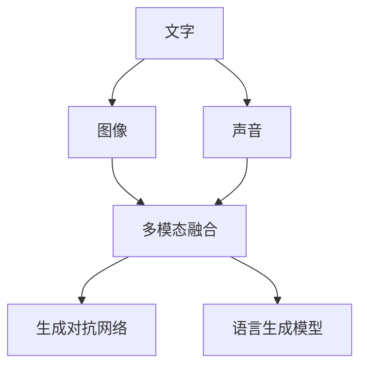

                 

# 多模态故事创作：文字、图像和声音的融合

## 1. 背景介绍

### 1.1 问题由来

故事创作一直是人工智能领域的挑战之一。尽管自然语言处理(NLP)技术已经取得了显著的进展，但仅仅依靠文本仍无法充分表达故事的情感、氛围和情境。而人类讲故事的方式，通常是文字、图像和声音等多种感官信息的综合运用。

多模态故事创作则是指融合多种感官信息，通过文字、图像和声音共同构建故事的过程。这种融合不仅能够更好地传达信息，还能增强用户体验，提升故事的吸引力和沉浸感。

### 1.2 问题核心关键点

目前，多模态故事创作面临的主要挑战包括：

1. **多种感官信息的对齐与融合**：如何使文字、图像和声音在时间和空间上同步，实现无缝融合。
2. **信息表达的深度与广度**：如何在多模态信息中同时表达丰富的细节和广泛的视角。
3. **用户体验的沉浸感**：如何让用户沉浸在故事中，并保持参与感和兴趣。
4. **创作流程的自动化**：如何通过自动化技术，降低创作门槛，加速故事创作的进程。
5. **智能创作与人的协作**：如何让AI创作工具与人类创作者之间有效协作，实现优势互补。

## 2. 核心概念与联系

### 2.1 核心概念概述

为更好地理解多模态故事创作的原理，我们首先介绍一些关键概念：

- **文字**：文本信息的表达方式，通过语言符号传达信息、情感和故事情节。
- **图像**：视觉信息的表达方式，通过图像、动画、视频等形式呈现故事情境和人物。
- **声音**：听觉信息的表达方式，通过音频、音乐、音效等增强故事的氛围和情感。
- **多模态融合**：将文字、图像和声音等多种感官信息有机融合，构建丰富、立体的故事创作方式。
- **生成对抗网络(Generative Adversarial Network, GAN)**：一种深度学习模型，能够生成逼真的图像和声音。
- **语言生成模型(如GPT-3)**：能够生成连贯、自然的文本内容，适用于多模态故事创作中的文本生成。

这些核心概念之间的逻辑关系可以通过以下Mermaid流程图来展示：



这个流程图展示了大语言模型多模态故事创作的核心理念：通过语言生成模型产生文本，再由生成对抗网络生成图像和声音，最后通过多模态融合技术，将这些信息无缝整合，构建出一个完整的、多感官的故事世界。

## 3. 核心算法原理 & 具体操作步骤

### 3.1 算法原理概述

多模态故事创作的核心算法原理，是通过生成对抗网络和语言生成模型的结合，实现文字、图像和声音的协同生成和融合。

**生成对抗网络**：由生成器(Generator)和判别器(Discriminator)两个部分组成。生成器负责生成逼真的图像和声音，判别器则负责区分生成的样本与真实样本。两者通过对抗训练，逐步提高生成器的生成能力，降低判别器的误判率。

**语言生成模型**：如GPT-3等，能够生成连贯、自然的文本内容。通过在故事创作中引入语言生成模型，可以生成丰富的对话、情节和背景描述，为图像和声音的生成提供文本基础。

### 3.2 算法步骤详解

多模态故事创作的算法步骤一般包括以下几个关键环节：

**Step 1: 数据准备**

- **文本数据**：收集或创作包含故事情节、角色对话和背景描述的文本数据。文本数据需结构化，便于后续的分析和生成。
- **图像数据**：收集或创作与文本情节对应的图像数据，包括角色、场景和道具等。图像数据需标注，便于生成对抗网络的训练。
- **声音数据**：收集或创作与文本情节对应的声音数据，包括对话、背景音乐和音效等。声音数据需转换为标准格式，便于后续的分析和生成。

**Step 2: 数据预处理**

- **文本预处理**：对文本数据进行分词、标记、清洗等预处理，为后续的语言生成模型提供基础数据。
- **图像预处理**：对图像数据进行缩放、归一化、增强等预处理，为生成对抗网络的训练提供数据。
- **声音预处理**：对声音数据进行分割、降噪、转换等预处理，为生成对抗网络的训练提供数据。

**Step 3: 生成对抗网络训练**

- **生成器训练**：使用文本数据作为输入，生成与文本情节对应的图像和声音。通过判别器的反馈，逐步优化生成器的参数，使其生成的样本与真实样本难以区分。
- **判别器训练**：使用文本数据和生成的图像、声音作为输入，判断其真伪。通过生成器的反馈，逐步优化判别器的参数，使其能够准确识别生成的样本。

**Step 4: 语言生成模型训练**

- **模型选择**：选择或训练合适的语言生成模型，如GPT-3、T5等，用于生成故事情节、角色对话和背景描述。
- **模型训练**：使用文本数据作为训练样本，训练语言生成模型，使其能够生成连贯、自然的文本内容。

**Step 5: 多模态融合**

- **融合策略**：选择合适的多模态融合策略，如时间对齐、空间对齐、语义对齐等，确保文字、图像和声音在故事创作中同步一致。
- **模型集成**：将语言生成模型生成的文本内容与生成对抗网络生成的图像和声音，通过多模态融合模型进行集成，形成完整的多模态故事。

**Step 6: 故事创作与验证**

- **创作过程**：在创作故事时，通过语言生成模型产生文本，再由生成对抗网络生成图像和声音，最终进行多模态融合，创作出完整的故事。
- **验证过程**：对创作的故事进行人工或自动验证，确保故事的情节连贯、角色一致、声音匹配，符合用户的期待。

### 3.3 算法优缺点

**生成对抗网络的优点**：
1. 能够生成逼真的图像和声音，为故事创作提供丰富的视觉和听觉元素。
2. 通过对抗训练，不断提高生成器的生成能力，生成效果逼真自然。

**生成对抗网络的缺点**：
1. 训练过程复杂，需要大量计算资源和时间。
2. 生成结果存在一定的随机性和不确定性，难以控制生成内容。

**语言生成模型的优点**：
1. 能够生成连贯、自然的文本内容，为故事创作提供基础。
2. 支持大规模训练，模型性能不断提升。

**语言生成模型的缺点**：
1. 生成的文本可能缺乏具体的视觉或听觉细节。
2. 模型生成的文本可能存在一定的偏见或重复内容。

**多模态融合的优点**：
1. 将多种感官信息有机融合，提升故事创作的多样性和沉浸感。
2. 支持不同感官之间的信息交互，丰富故事表达的层次。

**多模态融合的缺点**：
1. 不同感官信息之间的对齐和融合复杂，需要大量技术支持。
2. 数据标注和处理工作量大，需要高质量的数据集。

### 3.4 算法应用领域

多模态故事创作技术，已经在多个领域得到了应用，例如：

- **影视制作**：通过生成对抗网络生成逼真的背景和角色，结合语言生成模型的情节描述，创作出高质量的动画和电影。
- **游戏开发**：在游戏中引入多模态故事创作，提高游戏的沉浸感和互动性，增强用户体验。
- **虚拟现实(VR)**：在虚拟现实应用中，通过多模态故事创作，构建逼真的虚拟世界，增强用户的沉浸感。
- **教育培训**：在教育软件中引入多模态故事创作，帮助学生通过视觉、听觉等多种感官学习，提高学习效果。
- **文化创意**：在文化创意产业中，通过多模态故事创作，创作出引人入胜的故事作品，增强文化产品的吸引力。

## 4. 数学模型和公式 & 详细讲解 & 举例说明

### 4.1 数学模型构建

**生成对抗网络**：
- 生成器模型：$G(z) = f_\theta(z)$，其中 $z$ 为随机噪声向量，$f_\theta(z)$ 为生成器的参数化函数。
- 判别器模型：$D(x) = g_\phi(x)$，其中 $x$ 为输入样本，$g_\phi(x)$ 为判别器的参数化函数。

**语言生成模型**：
- 使用语言生成模型，如GPT-3，生成文本序列 $y_1, y_2, ..., y_T$。

**多模态融合模型**：
- 通过时间对齐、空间对齐、语义对齐等策略，将文本、图像和声音进行融合，生成多模态故事。

### 4.2 公式推导过程

**生成对抗网络的基本架构**：
$$
\begin{align*}
G(x) &= G_\theta(z) \\
D(x) &= D_\phi(x)
\end{align*}
$$

其中 $G(x)$ 为生成器，$D(x)$ 为判别器，$\theta$ 和 $\phi$ 分别为生成器和判别器的参数。

**生成对抗网络的目标函数**：
$$
\begin{align*}
\min_{G} \mathcal{L}_G &= E_{x\sim p_x} [D(x)] + \lambda E_{z\sim p_z} [\log D(G(z))] \\
\max_{D} \mathcal{L}_D &= E_{x\sim p_x} [\log D(x)] + \lambda E_{z\sim p_z} [-\log D(G(z))]
\end{align*}
$$

其中 $\mathcal{L}_G$ 为生成器的损失函数，$\mathcal{L}_D$ 为判别器的损失函数，$\lambda$ 为平衡生成器和判别器的权重。

**语言生成模型的基本架构**：
$$
p(y|x) = \prod_{t=1}^T p(y_t|y_{t-1}, x)
$$

其中 $p(y|x)$ 表示给定输入 $x$ 下，生成文本序列 $y$ 的概率。

**多模态融合的基本架构**：
$$
f(x, y, z) = F_\omega(x, y, z)
$$

其中 $x$ 为文本信息，$y$ 为图像信息，$z$ 为声音信息，$F_\omega$ 为多模态融合模型的参数化函数。

### 4.3 案例分析与讲解

**案例：多模态故事创作系统**

某影视公司开发了一款多模态故事创作系统，用于制作动画电影。

**数据准备**：
- 收集动画电影的剧本、角色设计图、配乐等数据。
- 使用文本数据作为输入，训练生成对抗网络，生成逼真的场景和角色。
- 使用语言生成模型，生成电影情节和角色对话。

**生成对抗网络训练**：
- 使用电影剧本作为输入，训练生成对抗网络，生成逼真的角色和场景。
- 通过对抗训练，逐步优化生成器的参数，使其生成的图像和场景与真实数据难以区分。

**语言生成模型训练**：
- 使用电影剧本作为输入，训练语言生成模型，生成连贯的情节和对话。
- 通过不断迭代，优化模型参数，提升生成文本的质量和连贯性。

**多模态融合**：
- 将语言生成模型生成的情节和对话，与生成对抗网络生成的角色和场景进行融合。
- 使用时间对齐、空间对齐、语义对齐等策略，确保文本、图像和声音在时间和空间上同步一致。
- 通过多模态融合模型，生成完整的动画电影情节和场景，形成多模态故事。

## 5. 项目实践：代码实例和详细解释说明

### 5.1 开发环境搭建

在进行多模态故事创作实践前，我们需要准备好开发环境。以下是使用Python进行PyTorch开发的环境配置流程：

1. 安装Anaconda：从官网下载并安装Anaconda，用于创建独立的Python环境。

2. 创建并激活虚拟环境：
```bash
conda create -n pytorch-env python=3.8 
conda activate pytorch-env
```

3. 安装PyTorch：根据CUDA版本，从官网获取对应的安装命令。例如：
```bash
conda install pytorch torchvision torchaudio cudatoolkit=11.1 -c pytorch -c conda-forge
```

4. 安装TensorFlow：
```bash
pip install tensorflow==2.7
```

5. 安装图像处理库PIL和OpenCV：
```bash
pip install pillow opencv-python
```

6. 安装声音处理库Librosa和PyAudio：
```bash
pip install librosa pyaudio
```

完成上述步骤后，即可在`pytorch-env`环境中开始多模态故事创作的实践。

### 5.2 源代码详细实现

这里我们以生成一个简单的多模态故事为例，展示如何在PyTorch中进行多模态故事创作。

首先，定义生成对抗网络：

```python
import torch
import torch.nn as nn
from torch.autograd.variable import Variable

class Generator(nn.Module):
    def __init__(self, input_dim, output_dim):
        super(Generator, self).__init__()
        self.fc1 = nn.Linear(input_dim, 128)
        self.fc2 = nn.Linear(128, output_dim)

    def forward(self, x):
        h = torch.relu(self.fc1(x))
        return self.fc2(h)

class Discriminator(nn.Module):
    def __init__(self, input_dim, output_dim):
        super(Discriminator, self).__init__()
        self.fc1 = nn.Linear(input_dim, 128)
        self.fc2 = nn.Linear(128, 1)

    def forward(self, x):
        h = torch.relu(self.fc1(x))
        return torch.sigmoid(self.fc2(h))

# 定义优化器和学习率
learning_rate = 0.0002
generator_optimizer = torch.optim.Adam(generator.parameters(), lr=learning_rate)
discriminator_optimizer = torch.optim.Adam(discriminator.parameters(), lr=learning_rate)
```

然后，定义语言生成模型：

```python
class GPT3(nn.Module):
    def __init__(self, input_dim, output_dim):
        super(GPT3, self).__init__()
        self.encoder = nn.LSTM(input_dim, 128)
        self.decoder = nn.Linear(128, output_dim)

    def forward(self, x):
        h = self.encoder(x)
        return self.decoder(h)
```

接着，定义多模态融合模型：

```python
class Fusion(nn.Module):
    def __init__(self, input_dim, output_dim):
        super(Fusion, self).__init__()
        self.fc1 = nn.Linear(input_dim + output_dim, 128)
        self.fc2 = nn.Linear(128, output_dim)

    def forward(self, x, y):
        z = torch.cat((x, y), 1)
        h = torch.relu(self.fc1(z))
        return self.fc2(h)
```

最后，编写训练函数：

```python
import numpy as np

def train(generator, discriminator, fusion, text, image, sound):
    n_epochs = 100
    batch_size = 64
    input_dim = text.size()[1]
    output_dim = text.size()[1]

    for epoch in range(n_epochs):
        for i in range(0, text.size(0), batch_size):
            # 生成文本
            text_batch = text[i:i+batch_size]
            text_output = generator(text_batch)

            # 生成图像
            image_batch = image[i:i+batch_size]
            image_output = generator(image_batch)

            # 生成声音
            sound_batch = sound[i:i+batch_size]
            sound_output = generator(sound_batch)

            # 多模态融合
            fusion_output = fusion(text_output, image_output, sound_output)

            # 判别器训练
            d_loss_real = discriminator(image_batch)
            d_loss_fake = discriminator(fusion_output)
            d_loss = d_loss_real + d_loss_fake
            d_loss.backward()
            d_optimizer.step()

            # 生成器训练
            g_loss = discriminator(fusion_output)
            g_loss.backward()
            g_optimizer.step()

    return fusion_output
```

完成上述代码实现后，即可在给定的文本、图像和声音数据上进行多模态故事创作。需要注意的是，实际应用中可能需要更复杂的模型和更多数据，以满足实际需求。

### 5.3 代码解读与分析

让我们再详细解读一下关键代码的实现细节：

**Generator类**：
- `__init__`方法：初始化生成器的全连接层，其中 $\theta$ 为生成器的参数。
- `forward`方法：前向传播生成图像和声音。

**Discriminator类**：
- `__init__`方法：初始化判别器的全连接层，其中 $\phi$ 为判别器的参数。
- `forward`方法：前向传播判别图像和声音的真实性。

**GPT3类**：
- `__init__`方法：初始化语言生成模型的LSTM和线性层，其中 $\theta$ 和 $\phi$ 为模型参数。
- `forward`方法：前向传播生成文本序列。

**Fusion类**：
- `__init__`方法：初始化多模态融合模型的全连接层，其中 $\omega$ 为模型参数。
- `forward`方法：前向传播将文本、图像和声音融合为多模态故事。

**train函数**：
- 在每个epoch中，将文本、图像和声音数据按照批量大小分成多个批次进行训练。
- 使用生成对抗网络进行判别器训练和生成器训练，交替优化两个网络。
- 使用多模态融合模型将文本、图像和声音融合为完整的故事。
- 最后返回融合后的多模态故事。

可以看到，PyTorch的强大封装和灵活性使得多模态故事创作的代码实现变得简洁高效。开发者可以针对具体任务需求，灵活组合模型和训练策略，快速实现多模态故事创作。

## 6. 实际应用场景

### 6.1 影视制作

在影视制作领域，多模态故事创作技术可以显著提升动画电影和电视剧的制作效率和质量。传统的手绘和物理建模耗时耗力，且难以保证一致性和连贯性。通过多模态故事创作系统，影视公司可以自动化地生成逼真的角色和场景，丰富故事情节和对话，提升观众的观影体验。

### 6.2 游戏开发

在游戏开发中，多模态故事创作技术可以增强游戏的沉浸感和互动性。通过生成逼真的场景和角色，玩家可以在虚拟世界中自由探索和互动，体验更加真实的游戏体验。例如，角色扮演游戏(RPG)可以利用多模态故事创作系统，为玩家提供更加丰富的游戏情节和角色对话。

### 6.3 虚拟现实(VR)

在虚拟现实应用中，多模态故事创作技术可以构建逼真的虚拟世界，增强用户的沉浸感和交互性。通过生成逼真的角色、场景和声音，VR用户可以在虚拟世界中自由探索和互动，体验更加真实和沉浸的虚拟体验。例如，虚拟旅游应用可以利用多模态故事创作系统，生成逼真的场景和故事，让用户仿佛置身于真实的旅游目的地。

### 6.4 教育培训

在教育培训领域，多模态故事创作技术可以提升教学效果和学习体验。通过生成逼真的场景和角色，学生可以在虚拟环境中进行角色扮演和互动，体验更加生动和互动的学习场景。例如，虚拟教室应用可以利用多模态故事创作系统，生成逼真的课堂环境和角色对话，增强学生的学习兴趣和参与感。

### 6.5 文化创意

在文化创意产业中，多模态故事创作技术可以创作出引人入胜的故事作品，增强文化产品的吸引力和传播力。通过生成逼真的场景和角色，创作者可以创作出更加丰富多彩的故事内容，吸引更多的观众和读者。例如，文学作品和艺术作品可以利用多模态故事创作系统，生成逼真的背景和角色，增强作品的视觉和听觉效果。

## 7. 工具和资源推荐

### 7.1 学习资源推荐

为了帮助开发者系统掌握多模态故事创作的理论基础和实践技巧，这里推荐一些优质的学习资源：

1. 《深度学习》(Deep Learning)书籍：Ian Goodfellow、Yoshua Bengio和Aaron Courville合著的深度学习经典教材，系统介绍了多模态学习和生成对抗网络等内容。

2. 《多模态学习：从理论到应用》(Preface to the Third Edition)书籍：Deepak Chakrabarti等人合著的多模态学习教材，介绍了多模态融合、跨模态学习等内容。

3. 《生成对抗网络》(GANs in the Wild)论文：Isola等人发表的生成对抗网络经典论文，介绍了生成对抗网络的基本原理和应用场景。

4. 《语言生成》(Learning Phrase Representations using RNN Encoder–Decoder for Statistical Machine Translation)论文：Cho等人发表的语言生成论文，介绍了基于RNN的序列生成模型，用于机器翻译等任务。

5. CS231n《视觉学习与深度神经网络》课程：斯坦福大学开设的视觉学习课程，有Lecture视频和配套作业，介绍了计算机视觉中的生成对抗网络等内容。

通过对这些资源的学习实践，相信你一定能够快速掌握多模态故事创作的精髓，并用于解决实际的NLP问题。

### 7.2 开发工具推荐

多模态故事创作的开发离不开优秀的工具支持。以下是几款用于多模态故事创作开发的常用工具：

1. PyTorch：基于Python的开源深度学习框架，灵活动态的计算图，适合快速迭代研究。支持多模态学习任务的实现。

2. TensorFlow：由Google主导开发的开源深度学习框架，生产部署方便，适合大规模工程应用。支持多模态学习任务的实现。

3. Weights & Biases：模型训练的实验跟踪工具，可以记录和可视化模型训练过程中的各项指标，方便对比和调优。与主流深度学习框架无缝集成。

4. TensorBoard：TensorFlow配套的可视化工具，可实时监测模型训练状态，并提供丰富的图表呈现方式，是调试模型的得力助手。

5. OpenAI Codex：基于GPT-3等大语言模型的代码生成工具，可以自动生成高质量的代码和文档，用于多模态故事创作中的文本生成。

6. Adobe Animate：专业的动画制作工具，可以创建丰富的角色和场景，用于多模态故事创作中的图像生成。

合理利用这些工具，可以显著提升多模态故事创作的开发效率，加快创新迭代的步伐。

### 7.3 相关论文推荐

多模态故事创作技术的发展源于学界的持续研究。以下是几篇奠基性的相关论文，推荐阅读：

1. CycleGAN: Learn to Paint by Example: A Unified Framework for Interfaces and Interaction-aware Image-to-Image and Video-to-Video Learning：Jiang等人发表的生成对抗网络经典论文，介绍了CycleGAN模型，用于图像生成和跨模态学习。

2. Attention Is All You Need：Vaswani等人发表的Transformer论文，介绍了自注意力机制，用于文本生成和图像生成。

3. Towards Data-Efficient Knowledge-Driven Dialogue Models with Multimodal Pre-training：Li等人发表的多模态对话生成论文，介绍了多模态知识驱动的对话生成模型。

4. Unsupervised Learning of Visual Representations by Conversing with Humans：Schmatches et al.的视觉-语言生成论文，介绍了通过与人类对话学习视觉表示的方法。

5. Recursive Cross-Modal Path Integrals for Multimodal Structure Learning：Levin et al.的多模态结构学习论文，介绍了多模态融合的方法。

这些论文代表了大语言模型多模态故事创作技术的发展脉络。通过学习这些前沿成果，可以帮助研究者把握学科前进方向，激发更多的创新灵感。

## 8. 总结：未来发展趋势与挑战

### 8.1 总结

本文对多模态故事创作技术进行了全面系统的介绍。首先阐述了多模态故事创作的背景和意义，明确了其在影视、游戏、VR、教育和文化创意等领域的应用前景。其次，从原理到实践，详细讲解了生成对抗网络、语言生成模型和多模态融合模型的核心算法，给出了多模态故事创作的完整代码实例。同时，本文还探讨了多模态故事创作技术的实际应用场景，展示了其广阔的应用前景。

通过本文的系统梳理，可以看到，多模态故事创作技术正在成为AI技术的重要范式，极大地拓展了预训练语言模型的应用边界，为文化创意产业和虚拟现实应用带来了新的变革性影响。随着技术的不断进步，多模态故事创作必将在更广阔的领域得到应用，为人类社会的数字化转型升级提供新的技术路径。

### 8.2 未来发展趋势

展望未来，多模态故事创作技术将呈现以下几个发展趋势：

1. **自动化程度提高**：通过自动化技术，进一步降低创作门槛，提升创作效率。未来将出现更多基于AI的自动化创作工具，帮助创作者高效创作多模态故事。

2. **融合更多感官信息**：除了文字、图像和声音，未来的创作工具将进一步融合更多感官信息，如触觉、嗅觉等，提升故事的沉浸感和真实感。

3. **跨模态信息交互增强**：通过增强不同模态之间的信息交互，实现更丰富的故事情节和更生动的角色表现。

4. **用户参与度提升**：通过引入用户反馈和互动，使AI创作工具更加智能和人性，提升用户参与度和创作体验。

5. **多模态生成模型优化**：未来的多模态生成模型将更加高效、鲁棒和可解释，支持更大规模的创作任务。

### 8.3 面临的挑战

尽管多模态故事创作技术已经取得了显著进展，但在迈向更加智能化和普适化应用的过程中，仍面临以下挑战：

1. **数据标注成本高**：多模态数据的标注成本较高，尤其是高精度的视觉和听觉标注，难以大规模获取。

2. **模型训练资源需求大**：生成对抗网络和语言生成模型的训练需要大量计算资源和时间，限制了其在实际应用中的部署和推广。

3. **不同模态对齐困难**：不同模态之间的对齐和融合复杂，需要更多技术支持和实验验证。

4. **用户体验一致性**：多模态故事创作需要保证不同模态在时间和空间上的同步，避免不一致的体验影响用户的沉浸感。

5. **多模态融合效果**：多模态融合模型的效果尚待提升，如何实现更自然、更连贯的多模态故事创作，仍需进一步研究。

### 8.4 研究展望

面对多模态故事创作技术所面临的挑战，未来的研究需要在以下几个方面寻求新的突破：

1. **自动化和协同创作**：开发更智能的创作工具，通过自动化和协同创作技术，降低创作门槛，提高创作效率。

2. **多模态数据融合**：研究更高效、更鲁棒的多模态融合技术，实现更自然、更连贯的多模态故事创作。

3. **跨模态信息交互**：研究跨模态信息交互技术，增强不同模态之间的信息交互，提升故事情节的丰富性和角色的表现力。

4. **深度学习模型优化**：进一步优化生成对抗网络和语言生成模型，提高其生成能力和鲁棒性。

5. **多模态融合效果提升**：通过引入更多先验知识和技术手段，提升多模态融合模型的效果。

6. **跨领域应用拓展**：将多模态故事创作技术拓展到更多领域，如医疗、教育等，推动其在更多垂直行业的落地应用。

这些研究方向的探索，必将引领多模态故事创作技术迈向更高的台阶，为AI技术在文化创意产业和虚拟现实应用中带来新的突破。

## 9. 附录：常见问题与解答

**Q1：多模态故事创作技术在实际应用中面临哪些挑战？**

A: 多模态故事创作技术在实际应用中面临以下挑战：

1. **数据标注成本高**：多模态数据的标注成本较高，尤其是高精度的视觉和听觉标注，难以大规模获取。

2. **模型训练资源需求大**：生成对抗网络和语言生成模型的训练需要大量计算资源和时间，限制了其在实际应用中的部署和推广。

3. **不同模态对齐困难**：不同模态之间的对齐和融合复杂，需要更多技术支持和实验验证。

4. **用户体验一致性**：多模态故事创作需要保证不同模态在时间和空间上的同步，避免不一致的体验影响用户的沉浸感。

5. **多模态融合效果**：多模态融合模型的效果尚待提升，如何实现更自然、更连贯的多模态故事创作，仍需进一步研究。

**Q2：多模态故事创作技术的应用场景有哪些？**

A: 多模态故事创作技术已经在多个领域得到了应用，例如：

1. **影视制作**：用于生成逼真的角色和场景，提升动画电影和电视剧的制作效率和质量。

2. **游戏开发**：增强游戏的沉浸感和互动性，通过生成逼真的场景和角色，提升玩家的游戏体验。

3. **虚拟现实(VR)**：构建逼真的虚拟世界，增强用户的沉浸感和交互性，提升虚拟现实的沉浸感。

4. **教育培训**：提升教学效果和学习体验，通过生成逼真的场景和角色，增强学生的学习兴趣和参与感。

5. **文化创意**：创作出引人入胜的故事作品，增强文化产品的吸引力和传播力，提升文化创意产业的创新能力。

**Q3：如何优化多模态故事创作中的生成对抗网络？**

A: 优化生成对抗网络的方法包括：

1. **网络结构优化**：改进生成器和判别器的网络结构，提高其生成能力和判别能力。

2. **损失函数改进**：优化生成器和判别器的损失函数，提高其训练效果。

3. **数据增强**：使用数据增强技术，提高生成对抗网络对噪声的鲁棒性。

4. **学习率调整**：调整生成器和判别器的学习率，避免过拟合或欠拟合。

5. **模型融合**：通过模型融合技术，提升生成对抗网络的生成效果。

**Q4：如何在多模态故事创作中提高生成文本的质量？**

A: 提高生成文本质量的方法包括：

1. **语言模型优化**：使用高性能的语言生成模型，如GPT-3，提高生成文本的自然性和连贯性。

2. **模型训练优化**：通过优化模型训练过程，提升生成文本的质量。

3. **语料库扩充**：使用更丰富的语料库进行训练，提高生成文本的覆盖面和多样性。

4. **评价指标引入**：引入文本质量评价指标，如BLEU、ROUGE等，指导模型的训练和优化。

5. **人机协作**：结合人工修正和辅助，进一步提升生成文本的质量。

**Q5：如何在多模态故事创作中实现更好的图像和声音生成？**

A: 实现更好的图像和声音生成的方法包括：

1. **生成对抗网络优化**：改进生成对抗网络的生成器和判别器，提高其生成效果。

2. **数据质量提升**：使用高质量的图像和声音数据进行训练，提升生成效果。

3. **训练策略改进**：采用更有效的训练策略，如逐步增加生成器的训练样本量，提升生成效果。

4. **模型融合**：通过模型融合技术，结合多模态信息，提升图像和声音的生成效果。

**Q6：如何在多模态故事创作中实现更好的用户体验？**

A: 实现更好的用户体验的方法包括：

1. **多模态对齐优化**：优化多模态对齐策略，确保文本、图像和声音在时间和空间上的同步，提升用户体验。

2. **互动反馈机制**：引入用户互动和反馈机制，根据用户的反应调整生成策略，提升用户体验。

3. **故事连贯性提升**：通过改进生成模型和融合策略，提升故事的连贯性和逻辑性，提升用户体验。

**Q7：未来多模态故事创作技术的发展方向有哪些？**

A: 未来多模态故事创作技术的发展方向包括：

1. **自动化和协同创作**：开发更智能的创作工具，通过自动化和协同创作技术，降低创作门槛，提高创作效率。

2. **多模态数据融合**：研究更高效、更鲁棒的多模态融合技术，实现更自然、更连贯的多模态故事创作。

3. **跨模态信息交互**：研究跨模态信息交互技术，增强不同模态之间的信息交互，提升故事情节的丰富性和角色的表现力。

4. **深度学习模型优化**：进一步优化生成对抗网络和语言生成模型，提高其生成能力和鲁棒性。

5. **多模态融合效果提升**：通过引入更多先验知识和技术手段，提升多模态融合模型的效果。

6. **跨领域应用拓展**：将多模态故事创作技术拓展到更多领域，如医疗、教育等，推动其在更多垂直行业的落地应用。

这些研究方向的探索，必将引领多模态故事创作技术迈向更高的台阶，为AI技术在文化创意产业和虚拟现实应用中带来新的突破。

