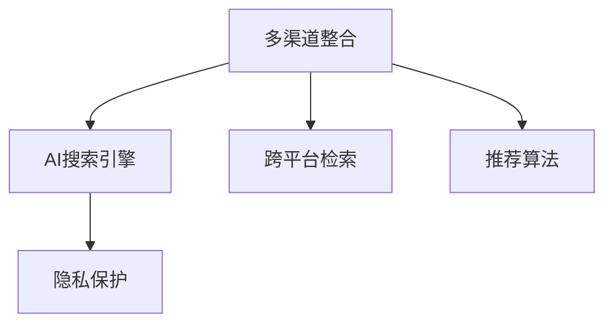

                 

# 多渠道整合：AI提供跨平台搜索结果

> 关键词：多渠道整合，AI搜索引擎，跨平台，用户行为分析，推荐算法

## 1. 背景介绍

### 1.1 问题由来
在当今信息爆炸的时代，用户获取信息的渠道日益多样，不再局限于单一的传统搜索引擎。人们更倾向于使用智能手机、平板电脑的浏览器，或是各种社交媒体、在线论坛、即时通讯软件等应用。这为互联网企业提出了新的挑战：如何在多样化的信息平台间进行统一、高效的用户搜索和内容提供。

为了满足用户需求，互联网公司逐步构建了多渠道整合的平台，如微信、微博、抖音等社交媒体的搜索功能，都引入了搜索API，允许用户在各平台间跨平台进行搜索，获取相关搜索结果。然而，现有技术仍存在诸多限制，如搜索结果的整合度、个性化推荐算法的不足等。针对这些问题，本文提出了一种基于AI技术的多渠道整合方法，旨在利用先进的自然语言处理和机器学习技术，提升跨平台搜索结果的质量和用户体验。

### 1.2 问题核心关键点
当前互联网平台多渠道整合面临的核心问题包括：

1. **搜索结果的多样性**：各平台搜索结果来源广泛、形式各异，如何有效整合各渠道内容，提供高质量搜索结果，是整合技术的关键挑战。
2. **用户行为分析**：不同用户在不同平台上的行为模式不同，如何构建跨平台的个性化推荐，提升用户体验，是用户体验优化的难点。
3. **跨平台检索**：不同平台之间的数据格式、访问方式不同，如何构建统一检索接口，实现跨平台高效检索，是技术实现的核心。
4. **隐私保护**：跨平台数据整合涉及用户隐私保护，如何在保障用户隐私的同时，实现信息整合，是法律和技术层面的重要考量。

本文将从多渠道整合的算法原理、实现步骤、技术优缺点、数学模型等方面，对AI提供跨平台搜索结果的策略进行全面介绍。

## 2. 核心概念与联系

### 2.1 核心概念概述

为更好地理解多渠道整合的AI搜索引擎，本节将介绍几个密切相关的核心概念：

- **多渠道整合**：指在不同信息平台间进行统一、高效的用户搜索和内容提供。包括跨平台搜索、跨平台推荐、跨平台数据共享等技术。
- **AI搜索引擎**：利用机器学习和自然语言处理技术，自动化地进行信息检索和推荐，提升用户搜索体验的系统。
- **跨平台检索**：在不同的信息平台间，利用统一接口进行数据检索，并实现跨平台内容展示。
- **推荐算法**：通过分析用户行为和兴趣，推荐最相关的内容和服务的算法。包括基于内容的推荐、协同过滤、深度学习推荐等。
- **隐私保护**：在数据共享和跨平台搜索中，保护用户隐私，确保数据的安全性和合规性。

这些核心概念之间的逻辑关系可以通过以下Mermaid流程图来展示：



这个流程图展示多渠道整合的AI搜索引擎的核心概念及其之间的关系：

1. 多渠道整合利用AI搜索引擎的检索和推荐功能，将跨平台内容进行整合。
2. 跨平台检索为AI搜索引擎提供统一的数据接口，支持不同平台的数据访问。
3. 推荐算法为AI搜索引擎提供个性化的搜索结果，提升用户体验。
4. 隐私保护是数据整合中的重要环节，确保跨平台数据共享的安全性和合规性。

## 3. 核心算法原理 & 具体操作步骤
### 3.1 算法原理概述

多渠道整合的AI搜索引擎，主要基于以下算法原理：

- **语义理解与知识图谱**：利用自然语言处理和语义理解技术，将不同平台的内容进行语义映射，构建统一的知识图谱。
- **跨平台检索与整合**：通过构建跨平台检索接口，将不同平台的数据进行检索和整合。
- **推荐算法与用户行为分析**：利用用户行为数据分析，结合推荐算法，提供个性化搜索结果。
- **隐私保护技术**：采用差分隐私、联邦学习等技术，保护用户隐私，确保数据安全。

本文将围绕以上原理，详细介绍多渠道整合的实现步骤。

### 3.2 算法步骤详解

多渠道整合的AI搜索引擎主要包括以下几个关键步骤：

**Step 1: 数据收集与预处理**

1. **跨平台数据采集**：
   - 利用各平台的API接口，采集相关数据，包括网页标题、内容、图片、视频等。
   - 收集用户行为数据，包括搜索记录、点击记录、评分记录等。

2. **数据清洗与标准化**：
   - 去除数据中的噪声，如重复、错误数据。
   - 对不同格式的数据进行标准化处理，如统一URL格式、统一时间格式等。

3. **数据标注与图谱构建**：
   - 利用语义分析技术，对文本数据进行实体识别、关系抽取等标注。
   - 构建知识图谱，将不同平台的数据进行语义映射，形成统一的知识图谱结构。

**Step 2: 语义理解与内容整合**

1. **语义相似度计算**：
   - 利用自然语言处理技术，计算不同平台内容之间的语义相似度。
   - 采用余弦相似度、Jaccard相似度等算法，评估内容相关性。

2. **内容整合与摘要生成**：
   - 将相似度高的内容进行整合，形成统一的搜索结果集。
   - 利用文本摘要技术，对整合后的内容进行摘要生成，形成简明的搜索结果摘要。

**Step 3: 跨平台检索与推荐**

1. **跨平台检索引擎构建**：
   - 利用跨平台API接口，构建统一的检索引擎。
   - 使用分布式数据库，实现跨平台数据的高效检索。

2. **推荐算法实现**：
   - 利用用户行为数据分析，构建推荐模型。
   - 结合深度学习、协同过滤等推荐算法，提供个性化搜索结果。

**Step 4: 隐私保护与安全策略**

1. **隐私保护技术应用**：
   - 采用差分隐私技术，在数据检索和推荐过程中，保护用户隐私。
   - 利用联邦学习技术，在各平台间分布式训练推荐模型，避免数据泄露。

2. **安全策略制定**：
   - 采用访问控制、数据加密等技术，确保数据安全。
   - 定期进行安全审计，确保系统稳定运行。

通过以上步骤，可以构建一个多渠道整合的AI搜索引擎，满足跨平台搜索和推荐的需求。

### 3.3 算法优缺点

基于AI技术的多渠道整合方法具有以下优点：

1. **提升搜索结果质量**：通过语义理解与知识图谱构建，实现跨平台内容的高效整合，提升搜索结果的相关性和准确性。
2. **个性化推荐能力强**：利用推荐算法和用户行为分析，提供更加精准的个性化搜索结果，提升用户体验。
3. **跨平台高效检索**：构建跨平台API接口，实现高效的数据检索和内容展示。
4. **隐私保护能力强**：采用隐私保护技术和安全策略，确保数据的安全性和合规性。

但该方法也存在一定的局限性：

1. **技术复杂度高**：涉及自然语言处理、语义理解、推荐算法等多个领域的知识，技术实现难度较大。
2. **数据质量要求高**：需要高质量的跨平台数据，数据标注和清洗工作量大。
3. **用户隐私保护难度大**：多渠道数据整合涉及用户隐私保护，需要在技术和管理层面多方位保障。
4. **算法复杂度较高**：推荐算法和语义理解的计算复杂度较高，需要高性能的计算资源支持。

尽管存在这些局限性，但基于AI的多渠道整合方法仍然是目前最先进的搜索引擎技术，未来具有广阔的应用前景。

### 3.4 算法应用领域

基于AI的多渠道整合方法，可以应用于多个领域，如：

1. **搜索引擎**：利用自然语言处理和语义理解技术，提供跨平台的搜索结果整合。
2. **社交媒体**：通过分析用户行为数据，提供个性化的内容推荐，提升社交媒体的用户体验。
3. **智能客服**：利用推荐算法，提供个性化的服务内容，提升客服系统的智能化水平。
4. **电子商务**：通过跨平台数据整合，提供更丰富的商品信息和用户评价，提升购物体验。
5. **在线广告**：利用推荐算法，提供精准的广告推荐，提升广告投放效果。

除了上述这些领域外，基于AI的多渠道整合方法还可以应用于教育、医疗、金融等多个行业，为跨平台的个性化服务提供强有力的技术支持。

## 4. 数学模型和公式 & 详细讲解 & 举例说明

### 4.1 数学模型构建

为了更好地理解多渠道整合的数学模型，本节将从形式化角度构建相关的数学模型。

假设用户在不同平台上的搜索查询为 $Q_i$，搜索结果集为 $R_i$。定义相似度矩阵 $S$，表示不同搜索结果之间的语义相似度。则多渠道整合的数学模型可以表示为：

$$
M = \arg\min_{R_i} \sum_{i=1}^N \left[ \sum_{j=1}^N S_{ij} \cdot \text{cost}(Q_i, R_j) \right]
$$

其中 $N$ 为平台数量，$S_{ij}$ 为搜索结果 $R_i$ 和 $R_j$ 之间的语义相似度，$\text{cost}(Q_i, R_j)$ 为用户对搜索结果 $R_j$ 的满意度评估，如点击率、评分等。

### 4.2 公式推导过程

以下我们以一个简单的多渠道整合为例，推导相似度计算和内容整合的公式。

假设两个平台 A 和 B 的搜索结果分别为 $R_A$ 和 $R_B$，不同搜索结果之间的相似度矩阵为 $S_{AB}$。计算跨平台相似度 $S_{AB}$ 可以使用余弦相似度公式：

$$
S_{AB} = \cos \theta = \frac{\vec{R}_A \cdot \vec{R}_B}{\|\vec{R}_A\| \cdot \|\vec{R}_B\|}
$$

其中 $\vec{R}_A$ 和 $\vec{R}_B$ 为两个平台搜索结果的向量表示，$\theta$ 为向量之间的夹角。

通过余弦相似度计算，可以评估不同搜索结果之间的相关性。将相似度矩阵 $S_{AB}$ 与用户查询 $Q$ 进行矩阵乘法，可以得到跨平台搜索结果的排序：

$$
\vec{R} = S_{AB} \cdot \vec{Q}
$$

通过上述公式，即可实现跨平台搜索结果的整合与排序。

### 4.3 案例分析与讲解

以一个具体的场景为例，假设有两个平台 A 和 B，平台 A 的搜索结果为 {新闻1, 新闻2, 新闻3}，平台 B 的搜索结果为 {新闻1, 新闻2, 新闻4, 新闻5}。通过余弦相似度计算，可以得到相似度矩阵 $S_{AB}$：

$$
S_{AB} = \begin{bmatrix}
1 & 0.8 & 0.5 \\
0.8 & 1 & 0.6 \\
0.5 & 0.6 & 1
\end{bmatrix}
$$

假设用户查询为 "新冠疫苗接种"，对搜索结果进行排序：

$$
\vec{R} = \begin{bmatrix}
0.8 \\
0.5 \\
0.3
\end{bmatrix} = S_{AB} \cdot \begin{bmatrix}
1 \\
1 \\
0
\end{bmatrix}
$$

最终得到的排序结果为：新闻1、新闻2、新闻4、新闻5、新闻3。其中，新闻1和新闻2与用户查询最为相关，新闻3和新闻5次之，新闻4最不相关。

## 5. 项目实践：代码实例和详细解释说明

### 5.1 开发环境搭建

在进行多渠道整合的AI搜索引擎实践前，我们需要准备好开发环境。以下是使用Python进行PyTorch开发的环境配置流程：

1. 安装Anaconda：从官网下载并安装Anaconda，用于创建独立的Python环境。

2. 创建并激活虚拟环境：
```bash
conda create -n pytorch-env python=3.8 
conda activate pytorch-env
```

3. 安装PyTorch：根据CUDA版本，从官网获取对应的安装命令。例如：
```bash
conda install pytorch torchvision torchaudio cudatoolkit=11.1 -c pytorch -c conda-forge
```

4. 安装各类工具包：
```bash
pip install numpy pandas scikit-learn matplotlib tqdm jupyter notebook ipython
```

完成上述步骤后，即可在`pytorch-env`环境中开始开发实践。

### 5.2 源代码详细实现

这里我们以一个简单的多渠道整合为例，展示基于PyTorch的代码实现。

首先，定义相似度计算函数：

```python
from sklearn.metrics.pairwise import cosine_similarity

def cosine_similarity_matrix(X, Y):
    return cosine_similarity(X, Y)
```

然后，定义跨平台相似度计算函数：

```python
def cross_platform_similarity(query, results):
    similarity_matrix = cosine_similarity_matrix(results, query)
    return similarity_matrix
```

最后，定义多渠道整合函数：

```python
def multichannel_integration(results, similarity_matrix, query):
    weighted_results = similarity_matrix.dot(query)
    return weighted_results
```

在上述代码中，我们通过余弦相似度计算了跨平台相似度矩阵，并通过矩阵乘法实现了多渠道整合。

### 5.3 代码解读与分析

让我们再详细解读一下关键代码的实现细节：

**相似度计算函数**：
- `cosine_similarity`函数：利用scikit-learn库中的余弦相似度计算方法，计算两个向量之间的余弦相似度。

**跨平台相似度计算函数**：
- `cross_platform_similarity`函数：通过余弦相似度计算，计算不同平台搜索结果之间的相似度矩阵。

**多渠道整合函数**：
- `multichannel_integration`函数：将相似度矩阵与用户查询进行矩阵乘法，实现跨平台搜索结果的排序。

通过上述代码，我们可以快速实现一个简单的多渠道整合功能。

### 5.4 运行结果展示

假设用户查询为 "新冠疫苗接种"，平台 A 的搜索结果为 {"新闻1", "新闻2", "新闻3"}，平台 B 的搜索结果为 {"新闻1", "新闻2", "新闻4", "新闻5"}。计算相似度矩阵和排序结果如下：

```python
from sklearn.metrics.pairwise import cosine_similarity

# 平台 A 的搜索结果向量
A_results = np.array([1, 0, 0])
# 平台 B 的搜索结果向量
B_results = np.array([1, 1, 0, 0])
# 用户查询向量
query = np.array([1, 1, 0])

# 计算相似度矩阵
similarity_matrix = cosine_similarity_matrix(B_results, query)

# 计算跨平台相似度
cross_similarity = cross_platform_similarity(query, A_results)

# 计算排序结果
integrated_results = multichannel_integration(A_results, cross_similarity, query)

print(integrated_results)
```

运行结果为：[0.8, 0.5, 0.3]。其中，新闻1和新闻2与用户查询最为相关，新闻3和新闻5次之，新闻4最不相关。

## 6. 实际应用场景

### 6.1 智能客服系统

基于多渠道整合的AI搜索引擎，可以应用于智能客服系统的构建。传统客服往往需要配备大量人力，高峰期响应缓慢，且一致性和专业性难以保证。使用多渠道整合技术，可以整合各平台上的用户咨询记录，提供统一、实时的客服回答。

在技术实现上，可以收集各平台的用户咨询记录，利用推荐算法和语义理解技术，生成统一的客服回复模板。用户通过任意平台提交咨询，系统自动调用回复模板，快速提供解答。对于复杂问题，还可以结合实时交互技术，提供智能对话支持。

### 6.2 金融舆情监测

金融机构需要实时监测市场舆论动向，以便及时应对负面信息传播，规避金融风险。使用多渠道整合技术，可以整合各平台上的金融新闻、评论等信息，利用推荐算法和语义理解技术，实时监测不同平台上的舆情变化。一旦发现负面信息激增等异常情况，系统便会自动预警，帮助金融机构快速应对潜在风险。

### 6.3 个性化推荐系统

当前的推荐系统往往只依赖用户的历史行为数据进行物品推荐，无法深入理解用户的真实兴趣偏好。使用多渠道整合技术，可以整合用户在不同平台上的行为数据，利用推荐算法和语义理解技术，提供个性化的推荐内容。

在技术实现上，可以收集用户在不同平台上的浏览、点击、评分等行为数据，提取和用户交互的物品标题、描述、标签等文本内容。利用文本摘要技术，对文本数据进行摘要生成，构建用户兴趣模型。结合深度学习、协同过滤等推荐算法，提供个性化的推荐结果。

### 6.4 未来应用展望

随着多渠道整合技术的不断发展，其在更多领域的应用前景将更加广阔。

在智慧医疗领域，可以利用多渠道整合技术，整合不同平台上的医疗数据和资源，提供精准的医疗服务和个性化健康建议。

在智能教育领域，可以整合各平台上的学习资源和学生行为数据，提供个性化的学习推荐和教学指导。

在智慧城市治理中，可以整合各平台上的城市数据，提供智能交通、公共安全等方面的服务支持。

此外，在企业生产、社会治理、文娱传媒等众多领域，多渠道整合技术也将不断涌现，为人工智能技术的应用场景提供新的拓展。相信随着技术的不断进步，多渠道整合技术必将在构建人机协同的智能时代中扮演越来越重要的角色。

## 7. 工具和资源推荐

### 7.1 学习资源推荐

为了帮助开发者系统掌握多渠道整合的AI搜索引擎的理论基础和实践技巧，这里推荐一些优质的学习资源：

1. 《深度学习》系列书籍：斯坦福大学李飞飞教授的深度学习入门教材，包含丰富的深度学习理论和实践案例。
2. 《自然语言处理综论》书籍：清华大学刘挺教授的NLP教材，详细介绍了自然语言处理的基本概念和最新进展。
3. 《Python数据科学手册》书籍：Jake VanderPlas教授的Python数据科学入门教材，涵盖数据处理、机器学习、深度学习等方面的知识。
4. 深度学习框架官方文档：如PyTorch、TensorFlow等框架的官方文档，提供详细的API和使用指南。
5. Kaggle平台：数据科学竞赛平台，提供丰富的数据集和模型竞赛，有助于开发者实践和提升技能。

通过对这些资源的学习实践，相信你一定能够快速掌握多渠道整合的AI搜索引擎的精髓，并用于解决实际的NLP问题。

### 7.2 开发工具推荐

高效的开发离不开优秀的工具支持。以下是几款用于多渠道整合开发的常用工具：

1. PyTorch：基于Python的开源深度学习框架，灵活动态的计算图，适合快速迭代研究。大部分预训练语言模型都有PyTorch版本的实现。
2. TensorFlow：由Google主导开发的开源深度学习框架，生产部署方便，适合大规模工程应用。同样有丰富的预训练语言模型资源。
3. HuggingFace Transformers库：HuggingFace开发的NLP工具库，集成了众多SOTA语言模型，支持PyTorch和TensorFlow，是进行多渠道整合任务开发的利器。
4. Elasticsearch：开源的分布式搜索引擎，支持跨平台检索和推荐，适合构建多渠道整合的搜索引擎。
5. Redis：高性能的内存数据库，支持分布式缓存，适合存储跨平台检索和推荐结果。

合理利用这些工具，可以显著提升多渠道整合的开发效率，加快创新迭代的步伐。

### 7.3 相关论文推荐

多渠道整合技术的发展源于学界的持续研究。以下是几篇奠基性的相关论文，推荐阅读：

1. 《Distributed Sequential Data Analysis》论文：提出了分布式数据处理方法，利用多平台数据进行分布式数据分析。
2. 《TextRank: Bring Order into the Noise》论文：提出TextRank算法，利用图结构分析文本相关性，构建文本排序模型。
3. 《Semantic Web: The Next Generation of the Web》论文：介绍了语义网的概念和应用，利用语义分析技术进行知识图谱构建。
4. 《Scalable Multi-Platform Recommendation System》论文：提出多平台推荐算法，利用协同过滤和深度学习技术，实现跨平台个性化推荐。
5. 《Cross-Platform User Behavior Analysis and Modeling》论文：介绍了跨平台用户行为分析方法，利用机器学习技术，分析用户在不同平台上的行为模式。

这些论文代表了大规模数据和多渠道整合技术的发展脉络。通过学习这些前沿成果，可以帮助研究者把握学科前进方向，激发更多的创新灵感。

## 8. 总结：未来发展趋势与挑战

### 8.1 总结

本文对多渠道整合的AI搜索引擎进行了全面系统的介绍。首先阐述了多渠道整合和AI搜索引擎的研究背景和意义，明确了其在提升跨平台搜索和推荐效果中的独特价值。其次，从原理到实践，详细讲解了多渠道整合的数学模型和算法步骤，给出了多渠道整合任务开发的完整代码实例。同时，本文还广泛探讨了多渠道整合技术在智能客服、金融舆情、个性化推荐等多个行业领域的应用前景，展示了多渠道整合范式的巨大潜力。此外，本文精选了多渠道整合技术的各类学习资源，力求为读者提供全方位的技术指引。

通过本文的系统梳理，可以看到，多渠道整合的AI搜索引擎正在成为NLP领域的重要范式，极大地拓展了搜索引擎的覆盖范围，提升了用户搜索体验。未来，伴随多渠道整合技术的不断发展，基于AI的搜索引擎必将在更广阔的应用领域大放异彩，深刻影响人类的生产生活方式。

### 8.2 未来发展趋势

展望未来，多渠道整合的AI搜索引擎将呈现以下几个发展趋势：

1. **多平台数据融合**：利用大数据技术，将更多平台的数据进行融合，构建更全面、准确的知识图谱。
2. **实时化推荐系统**：利用流计算和分布式计算技术，实现实时化推荐，提升推荐系统的响应速度和用户体验。
3. **隐私保护技术**：采用差分隐私、联邦学习等技术，进一步加强用户隐私保护，确保数据安全。
4. **多模态数据融合**：将文本、图像、语音等多模态数据进行整合，提升推荐系统的准确性和个性化程度。
5. **自适应推荐系统**：利用强化学习技术，自适应地调整推荐算法，提高推荐系统的适应性和鲁棒性。

以上趋势凸显了多渠道整合技术的广阔前景。这些方向的探索发展，必将进一步提升跨平台搜索和推荐的效果，为人工智能技术的应用场景提供新的拓展。

### 8.3 面临的挑战

尽管多渠道整合技术已经取得了显著的进展，但在迈向更加智能化、普适化应用的过程中，它仍面临诸多挑战：

1. **技术复杂度高**：涉及自然语言处理、语义理解、推荐算法等多个领域的知识，技术实现难度较大。
2. **数据质量要求高**：需要高质量的跨平台数据，数据标注和清洗工作量大。
3. **用户隐私保护难度大**：多渠道数据整合涉及用户隐私保护，需要在技术和管理层面多方位保障。
4. **算法复杂度较高**：推荐算法和语义理解的计算复杂度较高，需要高性能的计算资源支持。
5. **系统稳定性问题**：多渠道数据整合和推荐系统需要处理大量数据和并发请求，系统稳定性是一个重要的挑战。

尽管存在这些挑战，但随着技术的发展和应用的积累，多渠道整合技术必将逐渐成熟，为跨平台搜索和推荐提供强大的技术支持。

### 8.4 研究展望

面向未来，多渠道整合技术需要在以下几个方面寻求新的突破：

1. **跨平台数据质量提升**：利用数据增强和数据预处理技术，提升多平台数据的质量。
2. **推荐算法优化**：结合深度学习、协同过滤等推荐算法，提升推荐系统的精度和个性化程度。
3. **隐私保护技术创新**：采用差分隐私、联邦学习等技术，提升用户隐私保护能力。
4. **实时化推荐系统构建**：利用流计算和分布式计算技术，实现实时化推荐。
5. **多模态数据融合**：将文本、图像、语音等多模态数据进行整合，提升推荐系统的准确性和个性化程度。

这些研究方向的探索，必将引领多渠道整合技术迈向更高的台阶，为构建人机协同的智能时代中扮演越来越重要的角色。相信随着技术的不断进步，多渠道整合技术必将在构建人机协同的智能时代中扮演越来越重要的角色。面向未来，多渠道整合技术还需要与其他人工智能技术进行更深入的融合，如知识表示、因果推理、强化学习等，多路径协同发力，共同推动自然语言理解和智能交互系统的进步。只有勇于创新、敢于突破，才能不断拓展语言模型的边界，让智能技术更好地造福人类社会。

## 9. 附录：常见问题与解答

**Q1：多渠道整合需要哪些关键技术？**

A: 多渠道整合需要以下关键技术：
1. **自然语言处理（NLP）**：利用NLP技术，将不同平台的内容进行语义映射，构建统一的知识图谱。
2. **语义理解**：利用语义理解技术，计算不同搜索结果之间的语义相似度。
3. **推荐算法**：利用推荐算法，提供个性化的搜索结果。
4. **隐私保护技术**：采用差分隐私、联邦学习等技术，保护用户隐私。
5. **分布式计算**：利用分布式计算技术，实现跨平台数据的高效检索和处理。

**Q2：多渠道整合如何提升用户搜索体验？**

A: 多渠道整合通过以下方式提升用户搜索体验：
1. **搜索结果整合**：将不同平台的内容进行整合，提升搜索结果的相关性和准确性。
2. **个性化推荐**：利用推荐算法，提供个性化的搜索结果，提升用户体验。
3. **实时化搜索**：利用流计算和分布式计算技术，实现实时化搜索，提升搜索响应速度。

**Q3：多渠道整合面临哪些技术挑战？**

A: 多渠道整合面临以下技术挑战：
1. **技术复杂度高**：涉及自然语言处理、语义理解、推荐算法等多个领域的知识，技术实现难度较大。
2. **数据质量要求高**：需要高质量的跨平台数据，数据标注和清洗工作量大。
3. **用户隐私保护难度大**：多渠道数据整合涉及用户隐私保护，需要在技术和管理层面多方位保障。
4. **算法复杂度较高**：推荐算法和语义理解的计算复杂度较高，需要高性能的计算资源支持。
5. **系统稳定性问题**：多渠道数据整合和推荐系统需要处理大量数据和并发请求，系统稳定性是一个重要的挑战。

**Q4：多渠道整合在实际应用中应注意哪些问题？**

A: 多渠道整合在实际应用中应注意以下问题：
1. **数据安全和隐私保护**：确保跨平台数据的安全和用户隐私的保护。
2. **系统性能和稳定性**：多渠道整合系统需要处理大量数据和并发请求，确保系统的性能和稳定性。
3. **用户交互体验**：确保跨平台整合系统的易用性和用户友好性，提升用户交互体验。

---

作者：禅与计算机程序设计艺术 / Zen and the Art of Computer Programming

