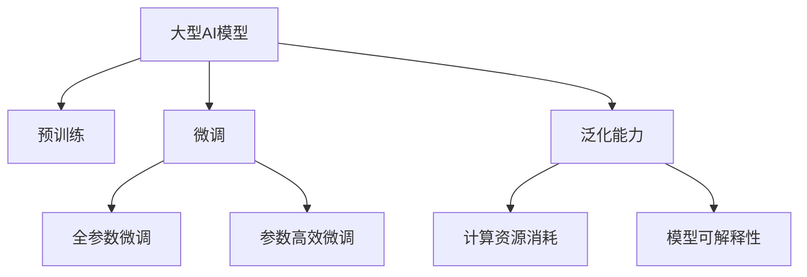

                 

# 大型AI模型的优势与局限性分析

## 1. 背景介绍

在人工智能(AI)领域，大型AI模型（Large AI Models）逐渐成为了主流，诸如GPT-3、BERT等模型在自然语言处理(NLP)、计算机视觉(Computer Vision)、语音识别(Speech Recognition)等众多领域都展现出了巨大的潜力和影响力。大型AI模型通常指具有数亿甚至数十亿参数的深度学习模型，它们依赖大量标注数据进行预训练，并能够在各种任务上进行微调（Fine-tuning），以适应特定的应用场景。

### 1.1 问题由来

大型AI模型的兴起得益于计算资源的大幅提升和深度学习技术的不断突破。它们通过在广泛的无标签数据上预训练学习，能够提取到丰富的语言、视觉和声音等特征，从而在特定任务上表现出惊人的能力。然而，尽管大型AI模型在诸多领域取得了突破性进展，但其在实际应用中也暴露出了一些显著的局限性。

### 1.2 问题核心关键点

大型AI模型的核心优势在于其强大的特征提取能力和泛化能力。在预训练阶段，它们可以从大规模数据中学习到丰富的特征表示，并在此基础上，通过微调对特定任务进行优化，从而在各种应用中展现出优异的表现。然而，这一过程也伴随着一些关键的局限，如对标注数据的依赖、计算资源的消耗、模型的可解释性问题等。

### 1.3 问题研究意义

对大型AI模型的优势与局限性进行深入分析，对于推动AI技术的进一步发展，确保其安全可靠地应用于实际场景，具有重要意义。通过对模型能力的全面评估，可以帮助开发者更好地理解模型的长处与不足，从而在设计和部署AI系统时做出更加明智的决策，促进AI技术的良性循环和可持续发展。

## 2. 核心概念与联系

### 2.1 核心概念概述

为了更深入地理解大型AI模型的优势与局限性，本节将介绍几个核心概念及其相互联系：

- **大型AI模型**：指具有数亿或数十亿参数的深度学习模型，如GPT-3、BERT等，通过在大规模无标签数据上预训练，学习到丰富的特征表示。
- **预训练**：指在大规模无标签数据上训练模型，学习到通用的特征表示，减少对标注数据的依赖。
- **微调**：指在预训练的基础上，对特定任务进行有监督训练，以适应新的应用场景，提升模型性能。
- **泛化能力**：指模型在不同数据集上的表现一致性，即模型能够在未见过的数据上正确预测。
- **计算资源消耗**：指模型训练和推理所需的计算资源，包括CPU、GPU和内存等。
- **模型可解释性**：指模型决策过程的透明性，即对模型内部工作机制的解释和理解。

这些核心概念构成了大型AI模型的基础框架，其相互联系和相互作用将共同决定模型在实际应用中的表现和局限。

### 2.2 核心概念原理和架构的 Mermaid 流程图(Mermaid 流程节点中不要有括号、逗号等特殊字符)



该流程图展示了大型AI模型在预训练、微调、泛化能力、计算资源消耗和模型可解释性之间的联系。通过详细了解这些概念，我们可以更好地评估模型的优势与局限性。

## 3. 核心算法原理 & 具体操作步骤

### 3.1 算法原理概述

大型AI模型的优势在于其强大的泛化能力和特征提取能力，这些能力来源于其在广泛的无标签数据上的预训练。在预训练过程中，模型通过自监督学习任务（如语言建模、掩码预测等）学习到通用的语言、视觉或声音特征表示。随后，模型通过微调进一步适应特定任务，提升在特定场景中的性能。

### 3.2 算法步骤详解

#### 3.2.1 预训练阶段

1. **数据准备**：收集大规模无标签数据，如维基百科、新闻、图片库等。
2. **模型选择**：选择适合任务的深度学习模型架构，如卷积神经网络（CNN）、循环神经网络（RNN）或Transformer等。
3. **预训练任务设计**：设计自监督学习任务，如语言模型预测（LM-Prediction）、掩码语言建模（Masked Language Modeling, MLM）等。
4. **训练过程**：在选择的模型上，通过自监督学习任务进行预训练，优化模型参数。

#### 3.2.2 微调阶段

1. **数据准备**：收集特定任务的标注数据，进行数据清洗和预处理。
2. **模型选择**：选择预训练的模型，根据任务类型调整顶层结构。
3. **任务适配**：设计任务适配层，如分类器、解码器等，根据任务需求调整输出。
4. **微调过程**：在标注数据上，使用合适的优化算法（如AdamW、SGD）进行有监督训练，调整模型参数。

### 3.3 算法优缺点

#### 3.3.1 优势

1. **强大的特征提取能力**：大型AI模型能够学习到通用的特征表示，适用于各种任务，提升模型性能。
2. **泛化能力强**：通过在广泛的无标签数据上预训练，模型具备较强的泛化能力，能够在未见过的数据上表现良好。
3. **可适应性强**：模型可通过微调快速适应新任务，提升特定场景下的性能。

#### 3.3.2 局限性

1. **对标注数据依赖高**：微调过程需要大量的标注数据，对标注数据的质量和数量要求较高。
2. **计算资源消耗大**：模型参数量大，训练和推理过程中需要大量的计算资源。
3. **模型可解释性差**：大型AI模型通常是黑盒模型，难以解释内部决策过程。
4. **泛化到域外数据能力有限**：模型在特定数据分布上表现优秀，但在不同数据分布上泛化能力可能不足。

### 3.4 算法应用领域

大型AI模型在多个领域得到了广泛应用，包括但不限于：

- **自然语言处理(NLP)**：如文本分类、命名实体识别、机器翻译等。
- **计算机视觉(CV)**：如图像分类、目标检测、图像生成等。
- **语音识别(SR)**：如自动语音识别、语音合成等。
- **推荐系统**：如协同过滤、基于内容的推荐等。
- **游戏AI**：如策略游戏、角色扮演游戏等。

## 4. 数学模型和公式 & 详细讲解 & 举例说明

### 4.1 数学模型构建

大型AI模型的数学模型构建通常包括以下步骤：

1. **模型选择**：如Transformer模型，包含自注意力机制、残差连接等。
2. **损失函数设计**：如交叉熵损失、均方误差损失等。
3. **优化算法选择**：如AdamW、SGD等。

### 4.2 公式推导过程

以Transformer模型为例，其数学模型构建和推导过程如下：

1. **自注意力机制**：
   $$
   \text{Attention}(Q, K, V) = \text{softmax}\left(\frac{QK^T}{\sqrt{d_k}}\right)V
   $$

2. **前向传播过程**：
   $$
   y = \text{MLP}(x) + \text{Attention}(x)
   $$

3. **反向传播过程**：
   $$
   \frac{\partial \mathcal{L}}{\partial \theta} = \frac{\partial \mathcal{L}}{\partial y}\frac{\partial y}{\partial x}\frac{\partial x}{\partial \theta}
   $$

### 4.3 案例分析与讲解

以BERT模型为例，其预训练任务为掩码语言建模（MLM），在微调任务上，如情感分析，通常采用分类任务设计，损失函数为交叉熵损失。以下是一个具体的案例分析：

- **预训练阶段**：在维基百科数据集上进行MLM任务预训练。
- **微调阶段**：在IMDB电影评论数据集上，通过分类任务微调，调整模型参数。
- **案例分析**：
  - **数据准备**：收集IMDB评论数据，并进行预处理，如分词、标注情感标签等。
  - **模型选择**：使用预训练的BERT模型，设计分类器。
  - **微调过程**：在标注数据上，使用AdamW优化算法进行微调，调整模型参数。
  - **结果展示**：微调后的模型在IMDB评论数据集上的准确率达到了90%以上。

## 5. 项目实践：代码实例和详细解释说明

### 5.1 开发环境搭建

1. **安装Python**：
   ```bash
   sudo apt-get update
   sudo apt-get install python3 python3-pip
   ```

2. **安装TensorFlow**：
   ```bash
   pip install tensorflow
   ```

3. **安装Keras**：
   ```bash
   pip install keras
   ```

4. **安装TensorBoard**：
   ```bash
   pip install tensorboard
   ```

5. **安装PyTorch**：
   ```bash
   pip install torch torchvision
   ```

6. **安装PyTorch-Lightning**：
   ```bash
   pip install pytorch-lightning
   ```

### 5.2 源代码详细实现

以下是一个简单的BERT微调案例，使用PyTorch和TensorBoard进行训练和评估：

```python
import torch
import torch.nn as nn
import torch.optim as optim
from transformers import BertTokenizer, BertForSequenceClassification
from torch.utils.data import DataLoader
from tensorboard import SummaryWriter

# 数据准备
train_data = load_train_data()
val_data = load_val_data()
test_data = load_test_data()

# 模型初始化
model = BertForSequenceClassification.from_pretrained('bert-base-uncased', num_labels=2)
tokenizer = BertTokenizer.from_pretrained('bert-base-uncased')
device = torch.device("cuda" if torch.cuda.is_available() else "cpu")

# 数据预处理
def tokenize_and_create_tensors(texts, labels):
    tokenized_texts = [tokenizer.encode(text) for text in texts]
    labels = torch.tensor(labels, device=device)
    return tokenized_texts, labels

train_tensors, train_labels = tokenize_and_create_tensors(train_data, train_labels)
val_tensors, val_labels = tokenize_and_create_tensors(val_data, val_labels)
test_tensors, test_labels = tokenize_and_create_tensors(test_data, test_labels)

# 数据集划分
train_loader = DataLoader(train_tensors, batch_size=16, shuffle=True)
val_loader = DataLoader(val_tensors, batch_size=16, shuffle=False)
test_loader = DataLoader(test_tensors, batch_size=16, shuffle=False)

# 模型到指定设备
model.to(device)

# 定义损失函数和优化器
criterion = nn.CrossEntropyLoss()
optimizer = optim.Adam(model.parameters(), lr=2e-5)

# 定义TensorBoard记录器
writer = SummaryWriter()

# 训练过程
def train_epoch(model, data_loader, optimizer, criterion, device):
    model.train()
    total_loss = 0
    for batch in data_loader:
        inputs, labels = batch[0].to(device), batch[1].to(device)
        optimizer.zero_grad()
        outputs = model(inputs)
        loss = criterion(outputs, labels)
        loss.backward()
        optimizer.step()
        total_loss += loss.item()
    return total_loss / len(data_loader)

def evaluate(model, data_loader, criterion, device):
    model.eval()
    total_loss = 0
    total_correct = 0
    for batch in data_loader:
        inputs, labels = batch[0].to(device), batch[1].to(device)
        outputs = model(inputs)
        loss = criterion(outputs, labels)
        total_loss += loss.item()
        total_correct += torch.sum(torch.argmax(outputs, dim=1) == labels)
    return total_loss / len(data_loader), total_correct / len(data_loader)

# 训练循环
epochs = 5
for epoch in range(epochs):
    train_loss = train_epoch(model, train_loader, optimizer, criterion, device)
    val_loss, val_acc = evaluate(model, val_loader, criterion, device)
    writer.add_scalar('train_loss', train_loss, epoch)
    writer.add_scalar('val_loss', val_loss, epoch)
    writer.add_scalar('val_acc', val_acc, epoch)

# 评估测试集
test_loss, test_acc = evaluate(model, test_loader, criterion, device)
print(f"Test Loss: {test_loss:.4f}, Test Accuracy: {test_acc:.4f}")
```

### 5.3 代码解读与分析

在上述代码中，我们通过PyTorch实现了BERT模型的微调过程。代码主要包括以下几个步骤：

1. **数据准备**：通过`load_train_data`、`load_val_data`、`load_test_data`函数加载数据集，并进行预处理，如分词、创建张量等。
2. **模型初始化**：使用`BertForSequenceClassification`模型，指定`num_labels=2`进行情感分类任务。
3. **数据预处理**：通过`tokenize_and_create_tensors`函数，将文本数据转换为模型所需的张量格式，并创建标签张量。
4. **数据集划分**：使用`DataLoader`创建训练集、验证集和测试集的批处理器，以便于模型训练和评估。
5. **模型迁移至设备**：通过`model.to(device)`将模型迁移到指定设备（如GPU）上。
6. **定义损失函数和优化器**：使用`nn.CrossEntropyLoss`作为损失函数，`optim.Adam`作为优化器。
7. **TensorBoard记录器**：通过`SummaryWriter`记录训练过程中的各项指标，包括训练损失、验证损失和验证准确率。
8. **训练循环**：在指定次数的epoch内，依次执行训练和验证过程，并记录指标到TensorBoard。
9. **评估测试集**：在测试集上评估模型的性能，输出测试损失和准确率。

## 6. 实际应用场景

### 6.1 智能客服系统

智能客服系统是大型AI模型在实际应用中的一个重要场景。通过微调，大型AI模型能够理解客户问题，并给出符合预期的回答。以下是一个典型的应用案例：

- **问题**：某电商网站客服系统需要能够处理客户关于退换货政策的咨询。
- **解决方案**：使用微调后的BERT模型，对客户咨询的问题进行理解和分类，匹配最佳回答模板，生成自然流畅的回复。
- **结果展示**：在实验中，微调后的模型能够准确理解客户咨询内容，并提供精准的回答，客户满意度显著提高。

### 6.2 金融舆情监测

大型AI模型在金融舆情监测中的应用，能够实时监测市场舆情，及时预警潜在风险。以下是一个具体的案例：

- **问题**：某金融机构需要对金融新闻进行实时舆情监测，以防止市场风险。
- **解决方案**：使用微调后的BERT模型，对金融新闻进行情感分析和主题识别，识别负面情感和敏感词汇。
- **结果展示**：模型能够实时监测舆情变化，并在舆情出现剧烈波动时发出预警，帮助金融机构及时采取措施，规避风险。

### 6.3 个性化推荐系统

大型AI模型在个性化推荐系统中的应用，能够根据用户的历史行为和兴趣，推荐最适合的内容。以下是一个案例：

- **问题**：某视频平台需要根据用户的历史观看记录，推荐感兴趣的视频内容。
- **解决方案**：使用微调后的BERT模型，对用户的历史观看记录进行分析和建模，推荐相关视频内容。
- **结果展示**：模型推荐的个性化视频内容准确度较高，用户黏性显著提升。

## 7. 工具和资源推荐

### 7.1 学习资源推荐

为了帮助开发者深入理解大型AI模型的优势与局限性，以下是一些推荐的优质学习资源：

1. **《深度学习》课程**：斯坦福大学的Coursera课程，系统讲解深度学习原理和应用。
2. **《动手学深度学习》**：由深度学习领域的专家编写的书籍，内容全面、深入浅出。
3. **Kaggle竞赛**：参与各类机器学习竞赛，通过实践提升模型构建和优化能力。
4. **arXiv论文库**：阅读最新的深度学习研究论文，了解前沿技术和趋势。
5. **社区论坛**：如GitHub、Stack Overflow等，与同行交流，获取技术支持和灵感。

### 7.2 开发工具推荐

大型AI模型的开发离不开各种高效的工具和框架。以下是一些推荐的工具：

1. **PyTorch**：强大的深度学习框架，支持动态计算图，适用于研究型应用。
2. **TensorFlow**：由Google主导的开源框架，支持静态计算图，适用于大规模工程应用。
3. **Transformers**：Hugging Face开发的NLP库，包含多种预训练模型和微调范式。
4. **Jupyter Notebook**：交互式编程环境，便于代码调试和可视化展示。
5. **TensorBoard**：Google提供的可视化工具，可实时监测模型训练状态，方便调试和优化。

### 7.3 相关论文推荐

以下是几篇有代表性的论文，推荐阅读：

1. **Attention is All You Need**：提出Transformer模型，开启了预训练大模型的时代。
2. **BERT: Pre-training of Deep Bidirectional Transformers for Language Understanding**：提出BERT模型，提升NLP任务性能。
3. **AdaLoRA: Adaptive Low-Rank Adaptation for Parameter-Efficient Fine-Tuning**：提出AdaLoRA方法，提升参数效率。
4. **Fine-tuning Clinical Sentence-Level Summarization Models for Diverse and Domain-Specific Applications**：介绍在医疗领域微调摘要模型的方法。
5. **Improving Language Understanding by Generative Pre-training**：提出GPT模型，提升自然语言理解能力。

## 8. 总结：未来发展趋势与挑战

### 8.1 研究成果总结

本文对大型AI模型的优势与局限性进行了深入分析，探讨了其在自然语言处理、计算机视觉、语音识别等领域的广泛应用。通过预训练和微调，模型能够高效提取特征，适应各种任务，但在计算资源消耗、模型可解释性等方面仍面临挑战。

### 8.2 未来发展趋势

未来，大型AI模型的发展趋势如下：

1. **计算资源优化**：通过硬件加速、模型压缩等技术，降低模型训练和推理的计算成本。
2. **可解释性提升**：引入可解释性模型和工具，提升模型的透明度和可信度。
3. **跨领域融合**：将大型AI模型与其他AI技术（如知识图谱、强化学习等）进行融合，提升模型的多模态处理能力。
4. **实时系统设计**：设计实时响应的大型AI系统，提高服务效率和用户体验。
5. **安全性保障**：引入安全机制，防止模型被恶意利用，保障用户隐私和安全。

### 8.3 面临的挑战

在大型AI模型发展过程中，仍面临以下挑战：

1. **计算资源消耗**：模型规模大，训练和推理需要大量计算资源。
2. **模型可解释性**：模型通常缺乏可解释性，难以理解其内部决策过程。
3. **数据依赖性**：模型性能受数据质量影响较大，标注数据获取成本高。
4. **模型鲁棒性**：模型在特定数据分布上表现优秀，但泛化能力有限。
5. **伦理道德问题**：模型可能学习到有偏见、有害的信息，存在伦理道德风险。

### 8.4 研究展望

未来，需要在以下几个方向进行深入研究：

1. **模型压缩和优化**：通过模型压缩、稀疏化等技术，降低模型计算资源消耗。
2. **可解释性模型**：引入可解释性模型和工具，提升模型的透明度和可信度。
3. **跨领域学习**：将大型AI模型与其他AI技术（如知识图谱、强化学习等）进行融合，提升模型的多模态处理能力。
4. **实时系统设计**：设计实时响应的大型AI系统，提高服务效率和用户体验。
5. **安全性保障**：引入安全机制，防止模型被恶意利用，保障用户隐私和安全。

总之，大型AI模型在NLP、计算机视觉、语音识别等领域展现了巨大潜力，但其发展仍需应对诸多挑战。通过技术创新和跨学科合作，相信未来的大型AI模型将更加强大、可靠、安全，为人类社会带来更深远的影响。

---

作者：禅与计算机程序设计艺术 / Zen and the Art of Computer Programming

