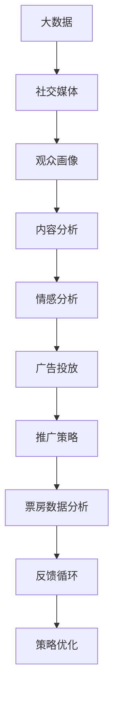

                 

# 大数据背景下的国产电影推广策略研究

> 关键词：大数据, 国产电影, 推广策略, 社交媒体, 精准营销, 内容分析, 观众画像, 情感分析, 广告投放

## 1. 背景介绍

### 1.1 问题由来
随着互联网和数字技术的发展，电影产业逐渐进入数字化时代。大数据技术的应用为国产电影的推广提供了新的可能性。然而，当前国产电影在推广过程中依然面临诸多挑战，包括市场竞争激烈、观众需求多样、营销效果评估困难等。基于此，本文旨在探讨大数据背景下国产电影的推广策略，通过数据驱动的方式，实现更精准、更高效的营销推广。

### 1.2 问题核心关键点
国产电影推广的核心在于利用大数据技术，深入挖掘观众需求，优化广告投放，提升品牌曝光度，最终达到票房收益的最大化。为此，需要收集和分析各种数据源，包括社交媒体、票房数据、用户行为数据等，以数据为基础，制定科学合理的推广策略。

## 2. 核心概念与联系

### 2.1 核心概念概述

在探讨国产电影推广策略时，我们需要了解以下核心概念：

- **大数据**：指规模庞大、复杂多样、快速增长的数据集，涵盖线上线下的各类数据，如社交媒体数据、在线行为数据、票房数据等。
- **国产电影**：指由中国电影制作公司生产的电影，包括剧情片、动作片、喜剧片、动画等多种类型。
- **推广策略**：指通过一系列营销手段，提升国产电影在市场中的知名度和观众接受度，以增加票房收入和品牌影响力。
- **社交媒体**：包括微博、微信、抖音等社交平台，是观众互动和反馈的重要渠道。
- **精准营销**：利用数据分析技术，对目标观众进行精准定位，实现营销资源的有效分配。
- **内容分析**：通过自然语言处理技术，对社交媒体、电影评论等文本数据进行分析，了解观众喜好和市场趋势。
- **观众画像**：指基于数据构建的观众群体特征，如年龄、性别、兴趣爱好等，用于指导推广策略的制定。
- **情感分析**：通过分析文本中的情感倾向，了解观众对国产电影的正面或负面情绪。
- **广告投放**：指通过多种渠道（如线上广告、线下海报）将电影信息推送给目标观众。

这些概念通过数据的收集、分析和应用，相互联系，共同支撑着国产电影推广策略的制定和实施。

### 2.2 核心概念原理和架构的 Mermaid 流程图



这个流程图展示了大数据背景下国产电影推广策略的整个流程：

1. 大数据收集：从社交媒体、票房等渠道获取观众数据。
2. 社交媒体分析：提取与电影相关的用户互动信息。
3. 观众画像构建：基于用户数据，构建详细的观众群体特征。
4. 内容分析：通过情感分析和文本挖掘，了解观众对电影的看法和喜好。
5. 广告投放：根据观众画像和情感分析结果，选择最合适的渠道和内容进行广告投放。
6. 推广策略制定：综合各项数据分析结果，制定科学的推广策略。
7. 票房数据分析：评估推广策略的效果，并进行后续调整。
8. 反馈循环：根据票房数据分析，不断优化推广策略。

## 3. 核心算法原理 & 具体操作步骤
### 3.1 算法原理概述

国产电影推广的核心在于通过数据驱动，实现对目标观众的精准定位和有效的营销资源分配。其主要原理包括：

1. **数据采集**：从社交媒体、票房数据、在线行为数据等多个渠道，采集全面的观众数据。
2. **数据预处理**：清洗和转换数据，使其适合后续分析使用。
3. **数据分析**：利用机器学习、自然语言处理等技术，对收集的数据进行分析。
4. **策略制定**：根据分析结果，制定针对性的推广策略。
5. **效果评估**：通过票房数据等指标，评估推广策略的效果，进行迭代优化。

### 3.2 算法步骤详解

国产电影推广的具体操作步骤如下：

**Step 1: 数据采集与预处理**
- 从社交媒体平台（如微博、微信、抖音）收集用户互动数据，包括评论、点赞、分享等。
- 从在线票务平台（如猫眼、淘票票）获取票房数据，包括观众分布、观影时间、票房收入等。
- 利用爬虫技术从各大电商平台（如京东、亚马逊）获取与电影相关的用户购买和评价数据。
- 对收集到的数据进行清洗和格式转换，去除噪声和重复项，转换为机器学习模型可处理的格式。

**Step 2: 社交媒体分析**
- 使用自然语言处理技术，对社交媒体评论进行情感分析，判断观众对电影的正面或负面情绪。
- 使用文本挖掘技术，提取热门标签和话题，了解观众关注点和讨论焦点。
- 通过社交网络分析（Social Network Analysis, SNA），分析用户之间的关系和互动模式。

**Step 3: 观众画像构建**
- 利用聚类算法（如K-means）对用户数据进行分类，构建不同的观众群体。
- 提取每个群体的主要特征，如年龄、性别、职业、兴趣爱好等。
- 通过多维数据可视化（如散点图、柱状图）展示观众画像。

**Step 4: 内容分析**
- 使用情感分析模型（如LSTM、BERT）对社交媒体评论和用户反馈进行情感分析，了解观众对电影的情感倾向。
- 通过主题模型（如LDA）对评论进行主题分析，提取核心讨论主题。
- 利用文本分类技术，对评论进行情感分类，如正向、中性、负面等。

**Step 5: 广告投放**
- 根据观众画像和情感分析结果，选择合适的广告渠道和内容。
- 设计针对性的广告文案和视觉素材，满足不同观众群体的偏好。
- 使用广告投放平台（如Facebook Ads、Google Ads）进行广告投放，监控投放效果。

**Step 6: 推广策略优化**
- 通过A/B测试（A/B testing）评估不同广告策略的效果，选择最优策略。
- 根据票房数据分析推广效果，进行策略调整。
- 利用机器学习算法（如随机森林、XGBoost）对推广策略进行优化。

### 3.3 算法优缺点

**优点**：
1. 数据驱动：基于大数据分析，可以制定更加精准和有效的推广策略。
2. 受众分析：通过数据挖掘和分析，能够深入了解观众需求和偏好，提升广告的吸引力和转化率。
3. 实时调整：能够实时监控推广效果，及时调整策略，优化营销资源分配。

**缺点**：
1. 数据隐私：大规模数据收集和分析可能涉及用户隐私问题，需严格遵守法律法规。
2. 技术复杂：需要具备较强的数据处理和分析能力，对技术要求较高。
3. 成本高昂：大数据分析和处理需要大量算力，初期投入成本较高。

### 3.4 算法应用领域

国产电影推广策略的大数据分析方法，已在多个领域得到广泛应用，具体包括：

- **社交媒体分析**：通过社交媒体数据，了解观众对国产电影的看法和趋势。
- **观众画像构建**：分析观众行为和特征，为个性化推荐和精准营销提供基础。
- **内容分析**：通过文本分析，挖掘观众对国产电影的情感倾向和偏好。
- **广告投放优化**：根据观众画像和情感分析结果，优化广告策略和内容。
- **票房数据分析**：评估推广策略效果，进行后续优化调整。

## 4. 数学模型和公式 & 详细讲解 & 举例说明

### 4.1 数学模型构建

在进行大数据分析时，我们可以构建以下数学模型：

- **社交媒体情感分析模型**：
  $$
  \hat{y} = f(x; \theta) = \text{Softmax}(Wx + b)
  $$
  其中 $x$ 表示社交媒体评论文本的特征向量，$y$ 表示情感分类结果，$\theta$ 为模型参数。

- **观众画像聚类模型**：
  $$
  k = K-means(X, k)
  $$
  其中 $X$ 表示用户数据矩阵，$k$ 表示聚类数。

- **内容主题模型**：
  $$
  \theta = LDA(X, K)
  $$
  其中 $X$ 表示评论文本矩阵，$K$ 表示主题数，$\theta$ 表示主题分布。

### 4.2 公式推导过程

以社交媒体情感分析为例，详细推导情感分析模型的公式：

1. **特征提取**：将社交媒体评论转换为向量表示，可以使用词袋模型（Bag of Words, BoW）或词嵌入（Word Embedding）。
2. **模型训练**：使用监督学习算法（如逻辑回归、SVM）训练情感分类模型。
3. **情感预测**：将新的评论输入模型，得到情感预测结果。

### 4.3 案例分析与讲解

假设有一部国产电影《长城》，通过以下数据进行分析：

- **社交媒体评论**：“特效震撼，剧情一般”
- **用户互动数据**：点赞数、分享数
- **票房数据**：地区分布、观影时长

**情感分析**：利用情感分析模型，判断评论情感为中性，表示部分观众对特效表示赞赏，但对剧情有所不满。

**观众画像**：通过聚类算法，将观众分为两类：“特效粉”和“剧情迷”。其中“特效粉”对特效有较高期待，“剧情迷”对剧情质量要求较高。

**内容分析**：通过主题模型，提取评论中的主要讨论主题为“特效”和“剧情”。

**广告投放**：针对“特效粉”投放关于特效技术的广告，针对“剧情迷”投放关于剧情改编的预告片。

**推广策略优化**：根据票房数据分析，发现“特效粉”地区的票房收入较高，进一步加大该地区的广告投放。

## 5. 项目实践：代码实例和详细解释说明

### 5.1 开发环境搭建

要实现上述推广策略，我们需要搭建一个数据处理和分析平台，具体步骤如下：

1. 选择数据处理框架（如Pandas、Scikit-learn）和机器学习框架（如TensorFlow、PyTorch）。
2. 搭建分布式计算平台（如Hadoop、Spark），处理大规模数据集。
3. 部署可视化平台（如Tableau、Power BI），展示数据分析结果。
4. 部署Web服务器（如Nginx、Tomcat），提供数据接口和服务。

### 5.2 源代码详细实现

以下是一个基于Python的示例代码，展示如何使用Scikit-learn进行情感分析：

```python
from sklearn.feature_extraction.text import TfidfVectorizer
from sklearn.linear_model import LogisticRegression
from sklearn.model_selection import train_test_split
from sklearn.metrics import accuracy_score

# 读取评论数据
data = pd.read_csv('movie_reviews.csv')

# 特征提取
vectorizer = TfidfVectorizer()
X = vectorizer.fit_transform(data['review'])
y = data['sentiment']

# 模型训练
clf = LogisticRegression()
X_train, X_test, y_train, y_test = train_test_split(X, y, test_size=0.2)
clf.fit(X_train, y_train)

# 情感预测
predictions = clf.predict(X_test)
accuracy = accuracy_score(y_test, predictions)
print('Accuracy:', accuracy)
```

### 5.3 代码解读与分析

- **数据读取**：使用Pandas库读取评论数据。
- **特征提取**：使用TF-IDF模型将评论文本转换为向量。
- **模型训练**：使用逻辑回归算法训练情感分类模型。
- **模型评估**：通过准确率评估模型性能。

## 6. 实际应用场景

### 6.1 智能推荐系统

智能推荐系统可以通过大数据分析，为用户推荐符合其兴趣的国产电影。例如，在豆瓣网、猫眼电影等平台上，基于用户行为数据和评分，推荐相似类型的电影。

### 6.2 营销活动策划

营销活动策划可以借助大数据分析，制定更加精准的营销策略。例如，通过分析社交媒体数据，了解观众对某部电影的期望，从而设计针对性的营销活动。

### 6.3 内容制作与传播

内容制作与传播可以通过大数据分析，了解观众的需求和喜好，优化内容创作和传播策略。例如，根据观众反馈调整电影的宣传角度和宣传形式。

### 6.4 未来应用展望

未来，大数据技术将进一步渗透到国产电影推广的各个环节，提升推广效率和效果。具体展望如下：

1. **全渠道营销**：通过整合线上线下的数据，实现跨平台的精准营销。
2. **个性化推荐**：利用大数据分析，实现个性化推荐，提升用户粘性和转化率。
3. **实时数据分析**：通过实时数据流处理技术，实时调整推广策略，提升推广效果。
4. **情感分析优化**：通过情感分析，动态调整营销内容，提升观众接受度。
5. **多模态融合**：结合文本、图像、视频等多模态数据，提供更加丰富、真实的观众画像。

## 7. 工具和资源推荐

### 7.1 学习资源推荐

为了帮助开发者系统掌握大数据分析技术，这里推荐一些优质的学习资源：

1. **《Python数据科学手册》**：一本系统介绍Python数据科学库（如Pandas、Scikit-learn）的书籍，适合初学者入门。
2. **《数据科学实战》**：基于实际项目，介绍大数据分析、机器学习等技术的实战案例。
3. **《大数据技术与应用》**：介绍大数据技术的理论基础和实际应用，适合进阶学习。
4. **Kaggle平台**：提供大量数据集和竞赛，帮助开发者实践数据科学技能。
5. **Coursera平台**：提供大数据、机器学习等课程，来自全球顶尖大学。

### 7.2 开发工具推荐

高效的开发离不开优秀的工具支持。以下是几款用于大数据分析开发的常用工具：

1. **Pandas**：基于NumPy的数据分析库，支持数据清洗、转换和分析。
2. **Scikit-learn**：基于NumPy和SciPy的机器学习库，支持各类经典算法的实现。
3. **TensorFlow**：由Google主导的深度学习框架，支持分布式计算和模型优化。
4. **Keras**：基于TensorFlow的高级API，简化深度学习模型的搭建和训练。
5. **PyTorch**：由Facebook开发的深度学习框架，支持动态计算图和GPU加速。
6. **Hadoop**：Apache基金会开源的分布式计算平台，支持大规模数据处理。
7. **Spark**：由Apache基金会开源的分布式计算框架，支持内存计算和实时处理。
8. **Tableau**：数据可视化工具，支持复杂的数据分析和报表展示。
9. **Power BI**：微软推出的商业智能工具，支持数据集成和报表展示。

### 7.3 相关论文推荐

大数据分析技术的演进离不开学界的持续研究。以下是几篇奠基性的相关论文，推荐阅读：

1. **《大数据时代：一场正在发生的社会变革》**：McKinsey Global Institute 发布的研究报告，探讨大数据对社会的影响。
2. **《大数据与商业智能：战略与创新》**：CB Insights 发表的商业智能报告，分析大数据在商业应用中的潜力。
3. **《机器学习：实战》**：周志华教授编写的机器学习教材，详细介绍了各类机器学习算法及其应用。
4. **《深度学习》**：Ian Goodfellow等人编写的深度学习教材，介绍了深度学习的基本概念和前沿技术。
5. **《大数据分析与统计学习》**：李军等人撰写的数据分析和统计学习书籍，涵盖数据处理和机器学习的理论基础。

## 8. 总结：未来发展趋势与挑战

### 8.1 研究成果总结

大数据背景下国产电影推广策略的研究，为我们提供了基于数据驱动的营销新思路。通过数据分析，可以实现更加精准的推广，提升电影的票房收益和品牌影响力。然而，数据分析仍面临数据隐私、技术复杂、成本高昂等挑战，需要不断优化和改进。

### 8.2 未来发展趋势

展望未来，大数据技术将更加广泛地应用于国产电影的推广中，具体趋势如下：

1. **数据质量提升**：通过数据清洗和处理，提升数据质量，增强分析结果的可靠性。
2. **多源数据融合**：整合线上线下数据，实现全渠道精准营销。
3. **实时数据分析**：通过实时数据处理技术，实现实时调整策略，提升推广效果。
4. **情感分析优化**：利用情感分析技术，优化营销内容，提升观众接受度。
5. **个性化推荐**：通过深度学习算法，实现个性化推荐，提高用户粘性和转化率。
6. **跨领域应用**：将大数据技术应用于更多领域，如金融、医疗、教育等，实现跨领域的推广策略。

### 8.3 面临的挑战

尽管大数据分析在国产电影推广中取得了显著效果，但仍面临以下挑战：

1. **数据隐私保护**：大规模数据收集和分析可能涉及用户隐私问题，需严格遵守法律法规。
2. **技术复杂度**：大数据分析需要具备较强的技术能力，对开发者要求较高。
3. **成本控制**：大数据分析和处理需要大量算力，初期投入成本较高。
4. **数据质量问题**：数据采集和处理可能存在噪音和偏差，影响分析结果的可靠性。
5. **跨平台整合**：不同平台的数据格式和标准不一致，需进行数据整合和转换。

### 8.4 研究展望

未来的研究可以从以下几个方面进行探索：

1. **数据隐私保护**：研究如何在大数据分析中保护用户隐私，制定合规的数据处理方案。
2. **算法优化**：开发更高效、更准确的数据分析算法，提升数据分析的效率和精度。
3. **跨平台整合**：研究如何整合不同平台的数据，实现跨平台的精准营销。
4. **实时分析**：开发实时数据处理和分析技术，实现快速响应和调整。
5. **情感分析**：研究更加准确、鲁棒的情感分析算法，提升观众情感分析的可靠性。

综上所述，大数据技术在国产电影推广中的应用前景广阔，但其面临的挑战也不容忽视。未来需要在数据隐私、技术复杂度、成本控制等方面进行深入研究，实现国产电影推广的数字化、智能化转型。

## 9. 附录：常见问题与解答

**Q1: 如何处理数据隐私问题？**

A: 数据隐私是大数据分析中需重点关注的问题。为保护用户隐私，可以采取以下措施：
1. 数据脱敏：在数据分析前，对敏感信息进行脱敏处理，如匿名化、模糊化等。
2. 数据匿名化：将数据与用户身份信息分离，避免数据直接关联到个人。
3. 合规法律：严格遵守《个人信息保护法》等法律法规，确保数据处理的合规性。

**Q2: 如何提高数据分析的效率？**

A: 提高数据分析效率可以从以下几个方面入手：
1. 数据预处理：优化数据清洗和转换流程，去除噪音和冗余数据。
2. 算法优化：选择合适的算法，避免复杂度高的计算。
3. 分布式计算：利用分布式计算框架（如Hadoop、Spark），并行处理大规模数据。
4. 内存优化：通过内存管理优化，减少数据读写次数，提升计算效率。

**Q3: 如何降低数据分析的成本？**

A: 降低数据分析成本可以从以下几个方面入手：
1. 开源工具：利用开源工具（如Pandas、Scikit-learn），降低开发和部署成本。
2. 云平台：利用云平台（如AWS、Google Cloud），降低硬件投入和维护成本。
3. 数据压缩：利用数据压缩技术，减少存储空间，降低存储成本。

**Q4: 如何整合不同平台的数据？**

A: 整合不同平台的数据需要考虑数据格式和标准的一致性问题，可以采取以下措施：
1. 数据标准化：将不同平台的数据格式转换为统一的标准。
2. 数据清洗：对整合后的数据进行清洗，去除冗余和重复数据。
3. 数据融合：利用数据融合技术，将不同平台的数据进行有机结合。

**Q5: 如何优化推广策略？**

A: 优化推广策略需要从多个方面入手：
1. 数据监控：实时监控推广效果，及时调整策略。
2. 效果评估：使用A/B测试等方法，评估不同策略的效果。
3. 用户反馈：通过用户反馈，了解观众的接受度和满意度。
4. 持续改进：根据数据分析结果，不断优化推广策略。

通过以上分析，我们可以清晰地看到大数据在国产电影推广中的应用前景和挑战，并提出相应的优化建议。未来，随着技术的进步和应用场景的扩展，大数据在国产电影推广中的应用将更加广泛和深入。

