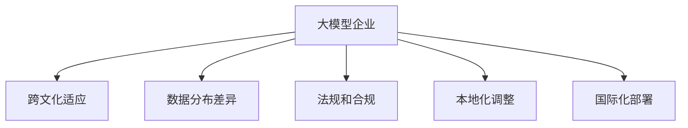

                 

## 1. 背景介绍

### 1.1 问题由来
全球化是当今企业发展的必然趋势。然而，如何实现国际化扩张，使企业在跨文化、跨地域的市场环境中保持竞争力，是一个复杂而富有挑战性的问题。大模型企业面临的主要问题是如何在全球范围内保持技术领先，同时维护和提升用户体验。本文将围绕大模型企业的国际化扩张策略进行详细探讨。

### 1.2 问题核心关键点
- **跨文化适应**：如何在大模型应用中兼顾不同文化背景的用户需求？
- **数据分布差异**：如何处理各地区数据分布的差异，提升模型在全球范围内的泛化能力？
- **语言和文化差异**：如何在不同语言和文化环境中，保持模型的稳定性和一致性？
- **法规和合规**：如何在不同国家或地区遵守本地化法规和标准？

## 2. 核心概念与联系

### 2.1 核心概念概述

为更好地理解大模型企业的国际化扩张策略，本节将介绍几个密切相关的核心概念：

- **大模型企业**：利用大模型技术进行产品开发和服务提供的企业。大模型通常指使用Transformer架构训练得到的深度学习模型，具备强大的自然语言处理能力。
- **跨文化适应**：大模型应用需要适应不同文化背景的用户需求，如中文、英文、阿拉伯文等。
- **数据分布差异**：不同地区的数据分布可能存在显著差异，如样本规模、语料种类、领域偏置等。
- **法规和合规**：不同国家或地区的法律法规、数据保护要求、隐私政策等可能差异很大。
- **本地化调整**：为了在本地市场推广，需要针对本地用户习惯和需求进行模型参数的微调或功能扩展。
- **国际化部署**：将大模型应用部署到全球各地的服务器或云平台，以支持本地化服务。

这些核心概念之间的逻辑关系可以通过以下Mermaid流程图来展示：



这个流程图展示了大模型企业的核心概念及其之间的关系：

1. 大模型企业通过大模型技术进行产品开发。
2. 在全球化的过程中，需考虑如何适应不同文化需求。
3. 需要处理各地区数据分布的差异，提升模型的泛化能力。
4. 需要遵守本地法规和标准，保证数据合规。
5. 需进行本地化调整，优化用户体验。
6. 需实现国际化部署，支持全球服务。

## 3. 核心算法原理 & 具体操作步骤

### 3.1 算法原理概述

大模型企业的国际化扩张策略，从根本上讲，是一种多模态（如多语言、多文化）的迁移学习过程。其核心思想是：在大模型应用中，通过将模型在不同地区进行本地化微调，以适应用户的多样化需求，提升模型的跨文化适应能力。

形式化地，假设大模型企业有模型 $M_{\theta}$，其中 $\theta$ 为模型参数。假设在A地区有标注数据集 $D_A$，在B地区有标注数据集 $D_B$，且A与B地区文化背景、数据分布存在差异。微调的目标是找到新的模型参数 $\hat{\theta}$，使得模型在A和B地区上的预测性能最大化：

$$
\hat{\theta}=\mathop{\arg\min}_{\theta} \left[ \mathcal{L}_A(M_{\theta},D_A) + \mathcal{L}_B(M_{\theta},D_B) \right]
$$

其中 $\mathcal{L}_A$ 和 $\mathcal{L}_B$ 分别为模型在A和B地区的损失函数，用于衡量模型在各自地区的预测性能。

### 3.2 算法步骤详解

大模型企业的国际化扩张策略通常包括以下几个关键步骤：

**Step 1: 数据收集与处理**
- 收集不同地区的用户数据，确保数据集的多样性和代表性。
- 进行数据清洗、去重、标注等预处理操作，去除噪音和异常值，确保数据质量。
- 针对不同地区的数据特点，采用相应的数据增强技术，如回译、近义词替换等，扩充训练数据集。

**Step 2: 本地化微调**
- 选择合适的微调模型，如Bert、GPT等，将其作为初始化参数。
- 在本地化数据集上进行微调，以适应用户需求和文化背景。
- 选择合适的本地化损失函数，如交叉熵损失、KL散度等，优化模型在本地市场的性能。

**Step 3: 模型集成与优化**
- 在不同地区训练的模型之间进行集成，构建本地化的模型版本。
- 引入迁移学习、多任务学习等策略，以提升模型的泛化能力和鲁棒性。
- 采用正则化、Dropout、Early Stopping等技术，防止模型过拟合，提升模型泛化能力。

**Step 4: 用户反馈与迭代**
- 通过用户反馈，收集模型的实际应用效果，进行A/B测试等评估。
- 根据反馈结果，不断优化模型参数，调整本地化策略。
- 建立用户画像和行为分析模型，提升模型的个性化推荐和用户体验。

### 3.3 算法优缺点

大模型企业的国际化扩张策略具有以下优点：
1. 能够快速适应不同文化背景的用户需求，提升全球市场竞争力。
2. 在本地数据上进行微调，提升了模型在本地市场的泛化能力和鲁棒性。
3. 通过模型集成，提高了模型在不同地区的一致性和稳定性。
4. 用户反馈与迭代机制，提升了模型的用户体验和满意度。

同时，该方法也存在一定的局限性：
1. 本地化微调需要大量本地化数据，获取高质量标注数据的成本较高。
2. 数据分布差异可能导致模型性能在部分地区表现不佳。
3. 本地化调整可能带来模型的一致性和稳定性问题。
4. 不同地区的法规和标准可能不同，需要进行额外的合规处理。

尽管存在这些局限性，但就目前而言，大模型企业的国际化扩张策略仍是企业全球化过程中不可或缺的重要手段。未来相关研究的重点在于如何进一步降低本地化微调对标注数据的依赖，提高模型的跨文化迁移能力，同时兼顾可解释性和伦理安全性等因素。

### 3.4 算法应用领域

大模型企业的国际化扩张策略，在多个领域得到了广泛的应用，例如：

- **电商推荐**：根据不同地区用户的购买历史和浏览行为，提供本地化个性化的商品推荐。
- **金融服务**：根据不同地区客户的金融行为和偏好，提供本地化的金融产品和服务。
- **社交媒体**：根据不同地区用户的语言习惯和兴趣偏好，提供本地化的社交服务。
- **旅游服务**：根据不同地区用户的需求和文化背景，提供本地化的旅游信息和服务。

此外，大模型企业还将国际化扩张策略应用于更多场景中，如医疗健康、物流运输、教育培训等，为不同地区提供更精准、高效的服务。随着大模型技术和本地化策略的不断发展，相信大模型企业在更多领域将取得新的突破。

## 4. 数学模型和公式 & 详细讲解 & 举例说明

### 4.1 数学模型构建

本节将使用数学语言对大模型企业的国际化扩张策略进行更加严格的刻画。

记大模型企业有模型 $M_{\theta}$，其中 $\theta$ 为模型参数。假设在A地区有标注数据集 $D_A=\{(x_i,y_i)\}_{i=1}^N, x_i \in \mathcal{X}, y_i \in \mathcal{Y}$。在B地区有标注数据集 $D_B=\{(x_i,y_i)\}_{i=1}^M, x_i \in \mathcal{X}, y_i \in \mathcal{Y}$。定义模型 $M_{\theta}$ 在数据样本 $(x,y)$ 上的损失函数为 $\ell(M_{\theta}(x),y)$，则在A和B地区的经验风险分别为：

$$
\mathcal{L}_A(\theta) = \frac{1}{N}\sum_{i=1}^N \ell(M_{\theta}(x_i),y_i)
$$
$$
\mathcal{L}_B(\theta) = \frac{1}{M}\sum_{i=1}^M \ell(M_{\theta}(x_i),y_i)
$$

微调的目标是最小化两地区的综合损失：

$$
\hat{\theta}=\mathop{\arg\min}_{\theta} \left[ \mathcal{L}_A(M_{\theta},D_A) + \mathcal{L}_B(M_{\theta},D_B) \right]
$$

在实践中，我们通常使用基于梯度的优化算法（如SGD、Adam等）来近似求解上述最优化问题。设 $\eta$ 为学习率，$\lambda$ 为正则化系数，则参数的更新公式为：

$$
\theta \leftarrow \theta - \eta \nabla_{\theta}\mathcal{L}_A(\theta) - \eta\lambda\theta - \eta \nabla_{\theta}\mathcal{L}_B(\theta) - \eta\lambda\theta
$$

其中 $\nabla_{\theta}\mathcal{L}_A(\theta)$ 和 $\nabla_{\theta}\mathcal{L}_B(\theta)$ 分别为模型在A和B地区上的梯度，可通过反向传播算法高效计算。

### 4.2 公式推导过程

以下我们以电商推荐任务为例，推导本地化微调的数学模型和梯度计算公式。

假设电商推荐任务有A和B两个地区的数据集 $D_A$ 和 $D_B$。记模型在输入 $x$ 上的输出为 $\hat{y}=M_{\theta}(x) \in [0,1]$，表示样本属于商品A的概率。真实标签 $y \in \{0,1\}$。

定义模型 $M_{\theta}$ 在A和B地区上的损失函数为：

$$
\ell_A(M_{\theta}(x),y) = -[y\log \hat{y} + (1-y)\log (1-\hat{y})]
$$
$$
\ell_B(M_{\theta}(x),y) = -[y\log \hat{y} + (1-y)\log (1-\hat{y})]
$$

两地区的经验风险分别为：

$$
\mathcal{L}_A(\theta) = -\frac{1}{N}\sum_{i=1}^N [y_i\log M_{\theta}(x_i)+(1-y_i)\log(1-M_{\theta}(x_i))]
$$
$$
\mathcal{L}_B(\theta) = -\frac{1}{M}\sum_{i=1}^M [y_i\log M_{\theta}(x_i)+(1-y_i)\log(1-M_{\theta}(x_i))]
$$

两地区的综合损失为：

$$
\mathcal{L}(\theta) = \frac{1}{N+M} \left[ N\mathcal{L}_A(\theta) + M\mathcal{L}_B(\theta) \right]
$$

根据链式法则，损失函数对参数 $\theta_k$ 的梯度为：

$$
\frac{\partial \mathcal{L}(\theta)}{\partial \theta_k} = \frac{1}{N+M} \left[ \frac{\partial N\mathcal{L}_A(\theta)}{\partial \theta_k} + \frac{\partial M\mathcal{L}_B(\theta)}{\partial \theta_k} \right]
$$

其中：

$$
\frac{\partial N\mathcal{L}_A(\theta)}{\partial \theta_k} = -\frac{1}{N}\sum_{i=1}^N (\frac{y_i}{M_{\theta}(x_i)}-\frac{1-y_i}{1-M_{\theta}(x_i)}) \frac{\partial M_{\theta}(x_i)}{\partial \theta_k}
$$
$$
\frac{\partial M\mathcal{L}_B(\theta)}{\partial \theta_k} = -\frac{1}{M}\sum_{i=1}^M (\frac{y_i}{M_{\theta}(x_i)}-\frac{1-y_i}{1-M_{\theta}(x_i)}) \frac{\partial M_{\theta}(x_i)}{\partial \theta_k}
$$

在得到损失函数的梯度后，即可带入参数更新公式，完成模型的迭代优化。重复上述过程直至收敛，最终得到适应本地市场的模型参数 $\theta^*$。

## 5. 项目实践：代码实例和详细解释说明

### 5.1 开发环境搭建

在进行本地化微调实践前，我们需要准备好开发环境。以下是使用Python进行PyTorch开发的环境配置流程：

1. 安装Anaconda：从官网下载并安装Anaconda，用于创建独立的Python环境。

2. 创建并激活虚拟环境：
```bash
conda create -n pytorch-env python=3.8 
conda activate pytorch-env
```

3. 安装PyTorch：根据CUDA版本，从官网获取对应的安装命令。例如：
```bash
conda install pytorch torchvision torchaudio cudatoolkit=11.1 -c pytorch -c conda-forge
```

4. 安装各类工具包：
```bash
pip install numpy pandas scikit-learn matplotlib tqdm jupyter notebook ipython
```

完成上述步骤后，即可在`pytorch-env`环境中开始本地化微调实践。

### 5.2 源代码详细实现

下面我们以电商推荐任务为例，给出使用Transformers库对模型进行本地化微调的PyTorch代码实现。

首先，定义电商推荐任务的数据处理函数：

```python
from transformers import BertTokenizer
from torch.utils.data import Dataset
import torch

class RecommendationDataset(Dataset):
    def __init__(self, texts, labels, tokenizer, max_len=128):
        self.texts = texts
        self.labels = labels
        self.tokenizer = tokenizer
        self.max_len = max_len
        
    def __len__(self):
        return len(self.texts)
    
    def __getitem__(self, item):
        text = self.texts[item]
        label = self.labels[item]
        
        encoding = self.tokenizer(text, return_tensors='pt', max_length=self.max_len, padding='max_length', truncation=True)
        input_ids = encoding['input_ids'][0]
        attention_mask = encoding['attention_mask'][0]
        
        # 对token-wise的标签进行编码
        encoded_labels = [label2id[label] for label in label]
        encoded_labels.extend([label2id['O']] * (self.max_len - len(encoded_labels)))
        labels = torch.tensor(encoded_labels, dtype=torch.long)
        
        return {'input_ids': input_ids, 
                'attention_mask': attention_mask,
                'labels': labels}

# 标签与id的映射
label2id = {'O': 0, 'A': 1}
id2label = {v: k for k, v in label2id.items()}

# 创建dataset
tokenizer = BertTokenizer.from_pretrained('bert-base-cased')

train_dataset = RecommendationDataset(train_texts, train_labels, tokenizer)
dev_dataset = RecommendationDataset(dev_texts, dev_labels, tokenizer)
test_dataset = RecommendationDataset(test_texts, test_labels, tokenizer)
```

然后，定义模型和优化器：

```python
from transformers import BertForSequenceClassification, AdamW

model = BertForSequenceClassification.from_pretrained('bert-base-cased', num_labels=len(label2id))

optimizer = AdamW(model.parameters(), lr=2e-5)
```

接着，定义训练和评估函数：

```python
from torch.utils.data import DataLoader
from tqdm import tqdm
from sklearn.metrics import classification_report

device = torch.device('cuda') if torch.cuda.is_available() else torch.device('cpu')
model.to(device)

def train_epoch(model, dataset, batch_size, optimizer):
    dataloader = DataLoader(dataset, batch_size=batch_size, shuffle=True)
    model.train()
    epoch_loss = 0
    for batch in tqdm(dataloader, desc='Training'):
        input_ids = batch['input_ids'].to(device)
        attention_mask = batch['attention_mask'].to(device)
        labels = batch['labels'].to(device)
        model.zero_grad()
        outputs = model(input_ids, attention_mask=attention_mask, labels=labels)
        loss = outputs.loss
        epoch_loss += loss.item()
        loss.backward()
        optimizer.step()
    return epoch_loss / len(dataloader)

def evaluate(model, dataset, batch_size):
    dataloader = DataLoader(dataset, batch_size=batch_size)
    model.eval()
    preds, labels = [], []
    with torch.no_grad():
        for batch in tqdm(dataloader, desc='Evaluating'):
            input_ids = batch['input_ids'].to(device)
            attention_mask = batch['attention_mask'].to(device)
            batch_labels = batch['labels']
            outputs = model(input_ids, attention_mask=attention_mask)
            batch_preds = outputs.logits.argmax(dim=2).to('cpu').tolist()
            batch_labels = batch_labels.to('cpu').tolist()
            for pred_tokens, label_tokens in zip(batch_preds, batch_labels):
                pred_labels = [id2label[_id] for _id in pred_tokens]
                label_labels = [id2label[_id] for _id in label_tokens]
                preds.append(pred_labels[:len(label_labels)])
                labels.append(label_labels)
                
    print(classification_report(labels, preds))
```

最后，启动训练流程并在测试集上评估：

```python
epochs = 5
batch_size = 16

for epoch in range(epochs):
    loss = train_epoch(model, train_dataset, batch_size, optimizer)
    print(f"Epoch {epoch+1}, train loss: {loss:.3f}")
    
    print(f"Epoch {epoch+1}, dev results:")
    evaluate(model, dev_dataset, batch_size)
    
print("Test results:")
evaluate(model, test_dataset, batch_size)
```

以上就是使用PyTorch对模型进行本地化微调的完整代码实现。可以看到，得益于Transformers库的强大封装，我们可以用相对简洁的代码完成本地化微调的实践。

### 5.3 代码解读与分析

让我们再详细解读一下关键代码的实现细节：

**RecommendationDataset类**：
- `__init__`方法：初始化文本、标签、分词器等关键组件。
- `__len__`方法：返回数据集的样本数量。
- `__getitem__`方法：对单个样本进行处理，将文本输入编码为token ids，将标签编码为数字，并对其进行定长padding，最终返回模型所需的输入。

**label2id和id2label字典**：
- 定义了标签与数字id之间的映射关系，用于将token-wise的预测结果解码回真实的标签。

**训练和评估函数**：
- 使用PyTorch的DataLoader对数据集进行批次化加载，供模型训练和推理使用。
- 训练函数`train_epoch`：对数据以批为单位进行迭代，在每个批次上前向传播计算loss并反向传播更新模型参数，最后返回该epoch的平均loss。
- 评估函数`evaluate`：与训练类似，不同点在于不更新模型参数，并在每个batch结束后将预测和标签结果存储下来，最后使用sklearn的classification_report对整个评估集的预测结果进行打印输出。

**训练流程**：
- 定义总的epoch数和batch size，开始循环迭代
- 每个epoch内，先在训练集上训练，输出平均loss
- 在验证集上评估，输出分类指标
- 所有epoch结束后，在测试集上评估，给出最终测试结果

可以看到，PyTorch配合Transformers库使得本地化微调的代码实现变得简洁高效。开发者可以将更多精力放在数据处理、模型改进等高层逻辑上，而不必过多关注底层的实现细节。

当然，工业级的系统实现还需考虑更多因素，如模型的保存和部署、超参数的自动搜索、更灵活的任务适配层等。但核心的本地化微调范式基本与此类似。

## 6. 实际应用场景
### 6.1 智能客服系统

基于大模型企业的国际化扩张策略，智能客服系统的构建可以更好地服务于全球市场。传统客服往往需要配备大量人力，高峰期响应缓慢，且一致性和专业性难以保证。而使用本地化微调后的对话模型，可以7x24小时不间断服务，快速响应客户咨询，用自然流畅的语言解答各类常见问题。

在技术实现上，可以收集企业内部的历史客服对话记录，将问题和最佳答复构建成监督数据，在此基础上对预训练对话模型进行本地化微调。微调后的对话模型能够自动理解用户意图，匹配最合适的答案模板进行回复。对于客户提出的新问题，还可以接入检索系统实时搜索相关内容，动态组织生成回答。如此构建的智能客服系统，能大幅提升客户咨询体验和问题解决效率。

### 6.2 金融舆情监测

金融机构需要实时监测市场舆论动向，以便及时应对负面信息传播，规避金融风险。传统的人工监测方式成本高、效率低，难以应对网络时代海量信息爆发的挑战。基于大模型企业的本地化微调技术，金融舆情监测系统可以自动判断文本的情感倾向，预测市场变化，提供风险预警。

具体而言，可以收集金融领域相关的新闻、报道、评论等文本数据，并对其进行情感标注。在此基础上对预训练语言模型进行本地化微调，使其能够自动判断文本的情感倾向。将微调后的模型应用到实时抓取的网络文本数据，就能够自动监测不同情感的文本变化趋势，一旦发现负面信息激增等异常情况，系统便会自动预警，帮助金融机构快速应对潜在风险。

### 6.3 个性化推荐系统

当前的推荐系统往往只依赖用户的历史行为数据进行物品推荐，无法深入理解用户的真实兴趣偏好。基于大模型企业的本地化微调技术，个性化推荐系统可以更好地挖掘用户行为背后的语义信息，从而提供更精准、多样的推荐内容。

在实践中，可以收集用户浏览、点击、评论、分享等行为数据，提取和用户交互的物品标题、描述、标签等文本内容。将文本内容作为模型输入，用户的后续行为（如是否点击、购买等）作为监督信号，在此基础上微调预训练语言模型。微调后的模型能够从文本内容中准确把握用户的兴趣点。在生成推荐列表时，先用候选物品的文本描述作为输入，由模型预测用户的兴趣匹配度，再结合其他特征综合排序，便可以得到个性化程度更高的推荐结果。

### 6.4 未来应用展望

随着大模型企业和本地化微调技术的不断发展，其应用前景广阔，未来将涉及更多领域，如智慧医疗、智能教育、智慧城市等，带来深刻变革。

在智慧医疗领域，基于本地化微调的医疗问答、病历分析、药物研发等应用将提升医疗服务的智能化水平，辅助医生诊疗，加速新药开发进程。

在智能教育领域，本地化微调技术可应用于作业批改、学情分析、知识推荐等方面，因材施教，促进教育公平，提高教学质量。

在智慧城市治理中，本地化微调模型可应用于城市事件监测、舆情分析、应急指挥等环节，提高城市管理的自动化和智能化水平，构建更安全、高效的未来城市。

此外，在企业生产、社会治理、文娱传媒等众多领域，本地化微调技术也将不断涌现，为传统行业数字化转型升级提供新的技术路径。相信随着技术的日益成熟，大模型企业在更多领域将取得新的突破。

## 7. 工具和资源推荐
### 7.1 学习资源推荐

为了帮助开发者系统掌握大模型企业的国际化扩张策略，这里推荐一些优质的学习资源：

1. 《Transformer from Basics to Advanced》系列博文：由大模型技术专家撰写，深入浅出地介绍了Transformer原理、本地化微调技术等前沿话题。

2. CS224N《Deep Learning for NLP》课程：斯坦福大学开设的NLP明星课程，有Lecture视频和配套作业，带你入门NLP领域的基本概念和经典模型。

3. 《Natural Language Processing with Transformers》书籍：Transformers库的作者所著，全面介绍了如何使用Transformers库进行NLP任务开发，包括本地化微调在内的诸多范式。

4. HuggingFace官方文档：Transformers库的官方文档，提供了海量预训练模型和完整的本地化微调样例代码，是上手实践的必备资料。

5. CLUE开源项目：中文语言理解测评基准，涵盖大量不同类型的中文NLP数据集，并提供了基于本地化微调的baseline模型，助力中文NLP技术发展。

通过对这些资源的学习实践，相信你一定能够快速掌握大模型企业的国际化扩张策略，并用于解决实际的NLP问题。
###  7.2 开发工具推荐

高效的开发离不开优秀的工具支持。以下是几款用于大模型企业本地化微调开发的常用工具：

1. PyTorch：基于Python的开源深度学习框架，灵活动态的计算图，适合快速迭代研究。大部分预训练语言模型都有PyTorch版本的实现。

2. TensorFlow：由Google主导开发的开源深度学习框架，生产部署方便，适合大规模工程应用。同样有丰富的预训练语言模型资源。

3. Transformers库：HuggingFace开发的NLP工具库，集成了众多SOTA语言模型，支持PyTorch和TensorFlow，是进行本地化微调任务开发的利器。

4. Weights & Biases：模型训练的实验跟踪工具，可以记录和可视化模型训练过程中的各项指标，方便对比和调优。与主流深度学习框架无缝集成。

5. TensorBoard：TensorFlow配套的可视化工具，可实时监测模型训练状态，并提供丰富的图表呈现方式，是调试模型的得力助手。

6. Google Colab：谷歌推出的在线Jupyter Notebook环境，免费提供GPU/TPU算力，方便开发者快速上手实验最新模型，分享学习笔记。

合理利用这些工具，可以显著提升大模型企业本地化微调的开发效率，加快创新迭代的步伐。

### 7.3 相关论文推荐

大模型企业本地化微调技术的发展源于学界的持续研究。以下是几篇奠基性的相关论文，推荐阅读：

1. Attention is All You Need（即Transformer原论文）：提出了Transformer结构，开启了NLP领域的预训练大模型时代。

2. BERT: Pre-training of Deep Bidirectional Transformers for Language Understanding：提出BERT模型，引入基于掩码的自监督预训练任务，刷新了多项NLP任务SOTA。

3. Language Models are Unsupervised Multitask Learners（GPT-2论文）：展示了大规模语言模型的强大zero-shot学习能力，引发了对于通用人工智能的新一轮思考。

4. Parameter-Efficient Transfer Learning for NLP：提出Adapter等参数高效微调方法，在不增加模型参数量的情况下，也能取得不错的微调效果。

5. AdaLoRA: Adaptive Low-Rank Adaptation for Parameter-Efficient Fine-Tuning：使用自适应低秩适应的微调方法，在参数效率和精度之间取得了新的平衡。

6. Attentive Fusion for Cross-Lingual Transfer Learning：提出多语言跨领域迁移学习方法，解决了不同语言数据分布的差异问题，提升了模型的泛化能力。

这些论文代表了大模型企业本地化微调技术的发展脉络。通过学习这些前沿成果，可以帮助研究者把握学科前进方向，激发更多的创新灵感。

## 8. 总结：未来发展趋势与挑战

### 8.1 总结

本文对大模型企业的国际化扩张策略进行了全面系统的介绍。首先阐述了全球化背景下，大模型企业面临的国际化扩展挑战，明确了本地化微调在提升全球市场竞争力中的重要价值。其次，从原理到实践，详细讲解了本地化微调的数学原理和关键步骤，给出了本地化微调任务开发的完整代码实例。同时，本文还广泛探讨了本地化微调技术在智能客服、金融舆情、个性化推荐等多个行业领域的应用前景，展示了本地化微调技术的巨大潜力。此外，本文精选了本地化微调技术的各类学习资源，力求为读者提供全方位的技术指引。

通过本文的系统梳理，可以看到，大模型企业的本地化微调策略正在成为全球化过程中的重要手段，极大地拓展了大模型应用的边界，提高了模型的泛化能力和用户体验。未来，伴随本地化微调技术的持续演进，相信大模型企业在更多领域将取得新的突破。

### 8.2 未来发展趋势

展望未来，大模型企业本地化微调技术将呈现以下几个发展趋势：

1. 本地化微调策略的泛化。随着本地化微调技术的发展，企业可以采用更加通用的本地化策略，降低本地化微调成本和复杂度。

2. 多模态本地化技术的兴起。随着多模态技术的进步，本地化微调可以结合视觉、语音、文本等多模态数据，提升模型的综合处理能力。

3. 跨文化语义理解能力的提升。未来本地化微调将更多地关注不同语言和文化间的语义映射，提升模型的跨文化理解能力。

4. 用户行为模型和个性化推荐。本地化微调结合用户行为数据分析，可以构建更加精准、个性化的推荐系统，提升用户满意度。

5. 持续学习和迁移学习。本地化微调模型将支持持续学习和迁移学习，实现动态更新和跨任务迁移。

6. 模型解释性和透明性。未来本地化微调将更加注重模型解释性和透明性，提升用户信任和接受度。

这些趋势凸显了大模型企业本地化微调技术的广阔前景。这些方向的探索发展，必将进一步提升大模型企业的全球竞争力，为NLP技术带来新的突破。

### 8.3 面临的挑战

尽管大模型企业本地化微调技术已经取得了瞩目成就，但在迈向更加智能化、普适化应用的过程中，它仍面临诸多挑战：

1. 本地化数据获取成本高。尽管本地化微调可以提升模型性能，但高质量本地化数据获取难度大，成本高。如何在数据稀缺的情况下，仍能高效地进行本地化微调，将是重要挑战。

2. 本地化微调模型复杂度高。本地化微调需要构建多个模型版本，维护成本高，模型间的一致性难以保证。

3. 本地化模型一致性问题。不同地区本地化微调模型间的一致性可能存在差异，影响全局性能。

4. 本地化模型鲁棒性问题。本地化微调模型在不同地区的数据分布和应用场景中，可能表现不一致，鲁棒性有待提升。

5. 本地化模型可解释性问题。本地化微调模型缺乏解释性，难以进行调试和优化，用户对其信任度较低。

6. 本地化模型部署和维护成本高。本地化微调模型的部署和维护涉及大量资源投入，如计算资源、存储资源等。

尽管存在这些挑战，但大模型企业本地化微调技术的不断发展和完善，将使其在全球化进程中发挥更大的作用。相信随着技术的进步和应用的深入，这些挑战将逐一被克服，本地化微调技术将为全球NLP技术的发展带来新的契机。

### 8.4 研究展望

未来，大模型企业本地化微调技术需要在以下几个方面寻求新的突破：

1. 无监督和半监督本地化微调。摆脱对大量本地化数据的依赖，利用自监督学习、主动学习等无监督和半监督范式，最大限度利用非结构化数据，实现更加灵活高效的本地化微调。

2. 轻量级本地化微调。开发更加轻量级的本地化微调方法，提升模型部署效率和实时性，优化资源占用。

3. 融合跨领域知识。将跨领域的先验知识（如知识图谱、逻辑规则等）与本地化微调模型结合，提升模型泛化能力和推理能力。

4. 结合多模态数据。本地化微调技术结合多模态数据，提升模型的跨文化理解能力和综合处理能力。

5. 引入因果推理和博弈论。通过引入因果推理和博弈论方法，增强模型的因果关系建模能力，提升模型决策的透明性和稳定性。

6. 加入伦理和安全约束。在本地化微调模型中加入伦理和安全约束，确保模型行为的合规性和安全性。

这些研究方向的探索，必将引领大模型企业本地化微调技术迈向更高的台阶，为全球NLP技术的发展提供新的动力。

## 9. 附录：常见问题与解答

**Q1：本地化微调是否适用于所有NLP任务？**

A: 本地化微调在大多数NLP任务上都能取得不错的效果，特别是对于数据量较小的任务。但对于一些特定领域的任务，如医学、法律等，仅仅依靠通用语料预训练的模型可能难以很好地适应。此时需要在特定领域语料上进一步预训练，再进行本地化微调，才能获得理想效果。此外，对于一些需要时效性、个性化很强的任务，如对话、推荐等，本地化微调方法也需要针对性的改进优化。

**Q2：本地化微调过程中如何选择合适的学习率？**

A: 本地化微调的学习率一般要比预训练时小1-2个数量级，如果使用过大的学习率，容易破坏预训练权重，导致过拟合。一般建议从1e-5开始调参，逐步减小学习率，直至收敛。也可以使用warmup策略，在开始阶段使用较小的学习率，再逐渐过渡到预设值。需要注意的是，不同的优化器(如AdamW、Adafactor等)以及不同的学习率调度策略，可能需要设置不同的学习率阈值。

**Q3：本地化微调模型在多语言环境中的鲁棒性问题如何解决？**

A: 本地化微调模型在多语言环境中的鲁棒性问题可以通过以下方法解决：
1. 引入多语言数据集。构建涵盖多语言的数据集，提升模型在多语言环境中的泛化能力。
2. 使用多语言数据增强。引入回译、近义词替换等数据增强方法，扩充训练数据集。
3. 引入多语言迁移学习。利用多语言迁移学习技术，提升模型在不同语言环境中的迁移能力。

**Q4：本地化微调模型在本地化调整过程中如何进行参数复用？**

A: 本地化微调模型在本地化调整过程中可以进行参数复用，以减少调整参数量和计算成本。具体步骤如下：
1. 保留通用的预训练参数，仅对任务特定的参数进行本地化调整。
2. 对本地化调整后的模型进行参数复用，避免重复计算。
3. 采用模型参数共享策略，减少本地化调整对预训练参数的影响。

**Q5：本地化微调模型在不同语言和文化环境中的可解释性问题如何解决？**

A: 本地化微调模型在不同语言和文化环境中的可解释性问题可以通过以下方法解决：
1. 引入多语言语义表示学习。通过多语言语义表示学习技术，提升模型在不同语言环境中的语义理解能力。
2. 使用多语言预训练模型。利用多语言预训练模型，提升模型在不同语言环境中的可解释性。
3. 引入多语言交互式学习。通过多语言交互式学习技术，提升模型在不同语言环境中的可解释性和透明性。

这些方法可以结合使用，进一步提升本地化微调模型的可解释性和透明性。

---

作者：禅与计算机程序设计艺术 / Zen and the Art of Computer Programming

