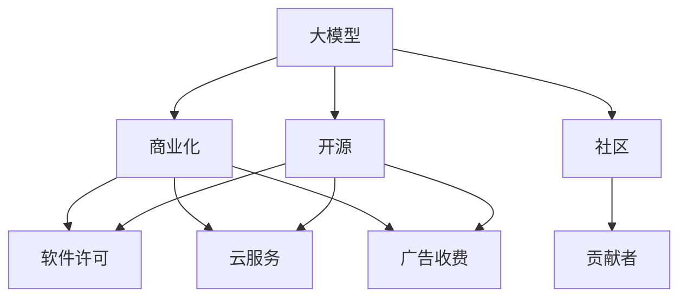

                 

# 大模型企业的开源策略与商业化平衡

## 1. 背景介绍

### 1.1 问题由来

近年来，随着深度学习技术的快速发展，开源人工智能库和模型不断涌现，大模型企业纷纷推出自己的开源版本。一方面，开源策略有助于吸引开发者，增强社区活跃度；另一方面，商业化是企业的核心目标，需要通过商业模式平衡开源与商业利益。本文将探讨大模型企业如何通过开源策略促进商业化发展，并平衡开源与商业利益。

### 1.2 问题核心关键点

开源策略与商业化平衡是当前大模型企业的核心问题，具体关键点包括：

- 开源策略的实质与目的。
- 开源与商业化的互动机制。
- 商业模式的选择与实施。
- 开源与商业化的法律与伦理问题。

理解这些关键点，有助于我们全面把握开源策略与商业化平衡的复杂性，以及如何在大模型企业中实现二者良性互动。

## 2. 核心概念与联系

### 2.1 核心概念概述

为更好地理解大模型企业的开源策略与商业化平衡，本节将介绍几个密切相关的核心概念：

- 大模型：以自回归(如GPT)或自编码(如BERT)模型为代表的大规模预训练语言模型。通过在大规模无标签文本语料上进行预训练，学习通用的语言表示，具备强大的语言理解和生成能力。

- 开源：指软件或模型的源代码公开，允许任何人自由使用、修改和分发。开源模型通常以MIT、Apache等宽松的许可协议发布，有助于开发者基于该模型进行二次开发和应用。

- 商业化：指将技术或产品转化为可销售商品的过程。商业化策略可以包括售卖软件许可证、提供云服务、广告收费等。

- 社区：由开发者、研究者、企业等构成的生态系统。开源项目通常依靠社区力量维护和更新，有助于扩大影响力。

- 贡献者：开源社区中的积极参与者，通过提交代码、修复Bug等方式贡献力量。

- 商业模式：企业实现商业化的策略和方法，如SaaS、PaaS、按需付费等。

这些核心概念之间的逻辑关系可以通过以下Mermaid流程图来展示：



这个流程图展示了大模型企业的核心概念及其之间的关系：

1. 大模型通过预训练获得基础能力。
2. 开源策略使模型广泛传播，吸引贡献者。
3. 商业化策略通过软件许可、云服务等方式获取收益。
4. 社区构建起开发者和研究者生态，促进模型改进和应用。
5. 商业化与开源的良性互动，有助于大模型企业的可持续发展。

## 3. 核心算法原理 & 具体操作步骤
### 3.1 算法原理概述

开源策略与商业化平衡的实质是大模型企业如何在开源与商业化之间找到最佳平衡点。核心思想是通过开源策略吸引开发者，利用其社区力量改进模型，同时通过商业化策略获取收益，保持企业的可持续发展。

形式化地，假设企业开发的大语言模型为 $M_{\theta}$，其中 $\theta$ 为模型参数。给定开源策略 $S$ 和商业化策略 $B$，在模型发布后，目标是最小化商业损失 $L_B$，同时最大化开源效益 $L_S$。具体来说：

$$
\min_{\theta} L_B = \min_{\theta} \sum_{i=1}^{I_B} p_i \cdot \ell_i(M_{\theta})
$$

$$
\max_{\theta} L_S = \max_{\theta} \sum_{i=1}^{I_S} q_i \cdot \ell_i(M_{\theta})
$$

其中 $I_B$ 和 $I_S$ 分别代表商业化和开源任务的数量，$p_i$ 和 $q_i$ 为任务 $i$ 的权重，$\ell_i$ 为损失函数。

通过梯度下降等优化算法，找到最小化 $L_B$ 同时最大化 $L_S$ 的模型参数 $\theta$。实际操作中，企业可以根据不同的开源与商业任务，设计不同的权重 $p_i$ 和 $q_i$，以适应不同的目标需求。

### 3.2 算法步骤详解

大模型企业实现开源策略与商业化平衡的一般步骤如下：

**Step 1: 设计开源策略**

- 选择合适的开源许可协议，如MIT、Apache等，明确开源模型的使用、修改和分发的规则。
- 提供清晰的文档和API接口，帮助开发者快速上手。
- 设立代码审查流程，确保开源社区贡献的代码质量。
- 定期发布模型更新和改进，吸引更多开发者关注和贡献。

**Step 2: 引入商业化手段**

- 提供软件许可证，如开源版与付费版区分，提供高级功能。
- 推出云服务，提供模型推理和微调等高级服务，按需付费。
- 开发商业广告插件，在开源模型上叠加广告功能。
- 设计商业化方案，如按使用量收费、订阅服务等。

**Step 3: 制定社区与贡献者政策**

- 设立社区管理员，协调社区内外的交流与合作。
- 制定贡献者奖励机制，如发放开源证书、提供开发资源等。
- 设立开源基金会，资助社区内的重要项目和贡献者。
- 设立贡献者委员会，讨论社区中的重大决策。

**Step 4: 持续优化开源与商业化模型**

- 根据社区反馈，不断优化开源模型的性能和功能。
- 根据商业客户需求，优化商业化服务，提供更优质的解决方案。
- 定期发布开源和商业化的数据和评估报告，展示成果。

**Step 5: 定期评估与调整**

- 定期评估开源和商业化的效果，调整开源与商业化的策略。
- 分析开源和商业化的收益和成本，优化商业化方案。
- 建立预警机制，及时应对开源与商业化的风险。

### 3.3 算法优缺点

开源策略与商业化平衡具有以下优点：

1. 吸引开发者：开源策略能吸引大量开发者加入，促进模型的改进和应用。
2. 扩大影响：开源社区的力量有助于模型在学术界和工业界的广泛应用。
3. 提高灵活性：开源模型可以根据社区需求灵活调整，满足多样化需求。
4. 成本控制：开源模型可以吸引开源贡献者，减少企业研发成本。

但同时也存在一些缺点：

1. 收益不确定：开源策略难以直接产生收益，商业化策略可能面临市场竞争。
2. 资源分散：开源与商业化策略需要平衡资源分配，可能导致资源浪费。
3. 法律风险：开源许可协议可能限制商业化应用，需提前明确约定。
4. 客户冲突：开源与商业化模型的差异可能影响客户选择，需协调管理。

综上所述，开源策略与商业化平衡是大模型企业的重要挑战，需要在实践中不断探索和调整，才能实现二者的良性互动。

### 3.4 算法应用领域

基于开源策略与商业化平衡的模型，已经在多个行业和应用中得到了广泛的应用，例如：

- 自然语言处理(NLP)：如文本分类、命名实体识别、机器翻译等。开源社区贡献了大量NLP模型和算法，企业可以基于这些模型开发商业化应用。
- 计算机视觉(CV)：如图像分类、目标检测、图像生成等。开源模型有助于CV技术的普及和应用，企业可以提供商业化服务或软件。
- 语音处理：如语音识别、语音合成等。开源社区在语音处理方面有丰富贡献，企业可以结合商业化需求开发高精度语音产品。
- 推荐系统：如个性化推荐、广告推荐等。开源模型有助于推荐算法的优化和应用，企业可以提供商业化的推荐服务。

除了上述这些经典应用外，开源模型在智能制造、智慧医疗、智能交通等众多领域也有广泛应用，推动了行业数字化转型升级。

## 4. 数学模型和公式 & 详细讲解 & 举例说明

### 4.1 数学模型构建

为了更好地理解开源策略与商业化平衡的数学模型，本节将使用数学语言进行更加严格的刻画。

记开源策略与商业化平衡的模型为 $M_{\theta}$，其中 $\theta$ 为模型参数。定义开源任务和商业任务的数量分别为 $I_S$ 和 $I_B$，开源和商业任务的权重分别为 $p_i$ 和 $q_i$，定义开源任务损失函数为 $\ell_i$，商业任务损失函数为 $\ell_i$。

开源策略与商业化平衡的优化目标为：

$$
\max_{\theta} L_S = \max_{\theta} \sum_{i=1}^{I_S} q_i \cdot \ell_i(M_{\theta})
$$

$$
\min_{\theta} L_B = \min_{\theta} \sum_{i=1}^{I_B} p_i \cdot \ell_i(M_{\theta})
$$

模型参数 $\theta$ 的更新公式为：

$$
\theta \leftarrow \theta - \eta \nabla_{\theta}L(\theta)
$$

其中 $\eta$ 为学习率，$L(\theta) = L_S(\theta) + L_B(\theta)$ 为总损失函数。

### 4.2 公式推导过程

以下我们以推荐系统为例，推导开源策略与商业化平衡的数学模型及其梯度的计算公式。

假设推荐系统包含 $K$ 个推荐任务，每个任务的权重为 $q_i$，任务 $i$ 的损失函数为 $\ell_i$。在开源策略下，用户访问开源版推荐系统，权重 $q_i=1$；在商业化策略下，用户访问商业版推荐系统，权重 $q_i=0$。

定义开源版和商业版推荐系统分别作为 $M_{\theta_S}$ 和 $M_{\theta_B}$，分别进行优化：

$$
\max_{\theta_S} L_S = \max_{\theta_S} \sum_{i=1}^{K} \ell_i(M_{\theta_S})
$$

$$
\min_{\theta_B} L_B = \min_{\theta_B} \sum_{i=1}^{K} p_i \cdot \ell_i(M_{\theta_B})
$$

在实际计算中，可以合并两个模型参数，并使用加权平均的方式平衡开源与商业化：

$$
\theta = \alpha \theta_S + (1-\alpha) \theta_B
$$

其中 $\alpha$ 为开源与商业化的平衡系数，可以由企业根据实际需求调整。

将 $\theta$ 代入开源版和商业版推荐系统的总损失函数中：

$$
L_S(\theta) = \sum_{i=1}^{K} \ell_i(\alpha \theta_S + (1-\alpha) \theta_B)
$$

$$
L_B(\theta) = \sum_{i=1}^{K} p_i \cdot \ell_i((1-\alpha) \theta_S + \alpha \theta_B)
$$

将两个损失函数相加，得到总损失函数：

$$
L(\theta) = L_S(\theta) + L_B(\theta)
$$

对总损失函数求梯度：

$$
\nabla_{\theta}L(\theta) = \nabla_{\theta}L_S(\theta) + \nabla_{\theta}L_B(\theta)
$$

将梯度代入参数更新公式，完成模型的迭代优化。

## 5. 项目实践：代码实例和详细解释说明

### 5.1 开发环境搭建

在进行开源策略与商业化平衡实践前，我们需要准备好开发环境。以下是使用Python进行PyTorch开发的环境配置流程：

1. 安装Anaconda：从官网下载并安装Anaconda，用于创建独立的Python环境。

2. 创建并激活虚拟环境：
```bash
conda create -n pytorch-env python=3.8 
conda activate pytorch-env
```

3. 安装PyTorch：根据CUDA版本，从官网获取对应的安装命令。例如：
```bash
conda install pytorch torchvision torchaudio cudatoolkit=11.1 -c pytorch -c conda-forge
```

4. 安装TensorFlow：如果需要在开源项目中使用TensorFlow，则安装TensorFlow及其兼容的预训练模型。

5. 安装各类工具包：
```bash
pip install numpy pandas scikit-learn matplotlib tqdm jupyter notebook ipython
```

完成上述步骤后，即可在`pytorch-env`环境中开始开源策略与商业化平衡实践。

### 5.2 源代码详细实现

这里我们以开源推荐系统为例，给出使用PyTorch和TensorFlow进行开源策略与商业化平衡的代码实现。

首先，定义开源推荐系统的损失函数：

```python
import torch
import torch.nn as nn
import torch.nn.functional as F
import tensorflow as tf

class RecommendationModel(nn.Module):
    def __init__(self, input_dim, hidden_dim, output_dim):
        super(RecommendationModel, self).__init__()
        self.fc1 = nn.Linear(input_dim, hidden_dim)
        self.fc2 = nn.Linear(hidden_dim, output_dim)
    
    def forward(self, x):
        x = F.relu(self.fc1(x))
        x = self.fc2(x)
        return x

# 定义损失函数
def binary_cross_entropy_with_logits(logits, labels):
    return F.binary_cross_entropy_with_logits(logits, labels)

# 定义混合损失函数
def mixed_loss(logits, labels):
    return binary_cross_entropy_with_logits(logits, labels)

# 定义混合模型
class MixedModel(nn.Module):
    def __init__(self, input_dim, hidden_dim, output_dim, alpha=0.5):
        super(MixedModel, self).__init__()
        self.open_source_model = RecommendationModel(input_dim, hidden_dim, output_dim)
        self.commercial_model = RecommendationModel(input_dim, hidden_dim, output_dim)
        self.alpha = alpha
    
    def forward(self, x):
        open_source_logits = self.open_source_model(x)
        commercial_logits = self.commercial_model(x)
        open_source_loss = binary_cross_entropy_with_logits(open_source_logits, labels)
        commercial_loss = binary_cross_entropy_with_logits(commercial_logits, labels)
        loss = self.alpha * open_source_loss + (1 - self.alpha) * commercial_loss
        return loss
```

接着，定义优化器：

```python
from torch.optim import Adam

# 定义优化器
def optimize_mixed_model(model, optimizer, learning_rate):
    optimizer.zero_grad()
    loss = model(mixed_x)
    loss.backward()
    optimizer.step()
```

最后，启动训练流程：

```python
# 定义混合模型
model = MixedModel(input_dim, hidden_dim, output_dim, alpha=0.5)

# 定义优化器
optimizer = Adam(model.parameters(), lr=learning_rate)

# 训练混合模型
for epoch in range(num_epochs):
    optimize_mixed_model(model, optimizer, learning_rate)
```

以上就是使用PyTorch和TensorFlow对开源推荐系统进行混合训练的完整代码实现。可以看到，通过定义混合损失函数，可以灵活调整开源与商业化的权重，实现二者的平衡。

### 5.3 代码解读与分析

让我们再详细解读一下关键代码的实现细节：

**MixedModel类**：
- `__init__`方法：初始化开源和商业化模型，并设定开源与商业化的平衡系数。
- `forward`方法：前向传播计算混合模型的输出。

**混合损失函数mixed_loss**：
- 通过定义混合损失函数，可以灵活调整开源与商业化的权重，实现二者的平衡。

**optimize_mixed_model函数**：
- 定义混合模型的优化器，并完成前向传播和反向传播。

**训练流程**：
- 定义混合模型，选择适当的优化器和学习率，并完成训练流程。

可以看出，开源策略与商业化平衡的代码实现并不复杂，但需要在开源与商业化之间灵活调整，实现二者的平衡。这需要企业在实践中不断优化和调整，才能找到最佳策略。

## 6. 实际应用场景
### 6.1 推荐系统

开源策略与商业化平衡在推荐系统中的应用最为典型。传统推荐系统基于用户的点击记录进行推荐，难以理解用户的深层次兴趣。而基于开源策略的推荐系统，可以引入开源社区的智慧，通过公开推荐算法和模型，吸引开发者贡献，提升推荐精度。

在商业化方面，可以通过订阅制、按使用量收费等方式获取收益，并提供高精度的推荐服务。用户可以根据自身需求选择开源版或商业版，实现开源与商业化的双重收益。

### 6.2 智能客服

智能客服系统是大模型企业的重要应用场景。基于开源策略的智能客服，可以通过开源社区的力量，不断改进和优化模型，提升用户体验。

在商业化方面，可以提供高级的智能客服解决方案，如多语言支持、情感分析、用户画像等，按需付费。同时，开放接口，允许企业自由集成和定制，实现商业化应用。

### 6.3 开源社区

开源社区是大模型企业的核心竞争力之一。通过开源策略，可以吸引全球的开发者和研究者，形成一个庞大的生态系统。

在商业化方面，可以设立开源基金会，资助社区内的重要项目和贡献者，提升社区的活跃度和影响力。同时，通过商业化的服务和工具，帮助社区成员解决问题，实现社区与商业化的互动。

### 6.4 未来应用展望

随着开源策略与商业化平衡的不断探索，未来大模型企业将在更多领域实现开源与商业化的良性互动。

在智慧医疗领域，基于开源策略的智能诊断系统，可以引入开源社区的医学知识和算法，提升诊断精度。同时，提供商业化的诊断报告和解决方案，帮助医疗机构降低成本，提升服务水平。

在智能教育领域，基于开源策略的智能教育平台，可以引入开源社区的教育资源和算法，提升教学效果。同时，提供商业化的教育服务和产品，满足不同用户的需求。

在智慧城市治理中，基于开源策略的智能交通、智能安防等系统，可以引入开源社区的技术和算法，提升城市管理水平。同时，提供商业化的城市管理解决方案，助力智慧城市建设。

总之，开源策略与商业化平衡是大模型企业的重要发展方向，通过二者的良性互动，可以提升企业的竞争力，推动技术的普及和应用。

## 7. 工具和资源推荐
### 7.1 学习资源推荐

为了帮助开发者系统掌握开源策略与商业化平衡的理论基础和实践技巧，这里推荐一些优质的学习资源：

1. 《开源社区运营指南》系列博文：由社区管理专家撰写，深入浅出地介绍了开源社区的运营策略和最佳实践。

2. 《商业化策略与实践》课程：谷歌开发者学院开设的商业化策略课程，有Lecture视频和配套作业，带你入门商业化策略的基础知识和实战经验。

3. 《开源与商业化的案例分析》书籍：介绍开源社区与商业化策略的成功案例，分析其中的关键点，助力企业在开源与商业化中取得成功。

4. GitHub官方文档：GitHub开源社区的官方文档，提供了丰富的开源项目和社区资源，是企业进行开源项目管理的参考。

5. OpenAI的HuggingFace开源项目：提供了丰富的预训练语言模型和开源项目，是企业进行开源策略与商业化平衡的参考。

通过对这些资源的学习实践，相信你一定能够快速掌握开源策略与商业化平衡的精髓，并用于解决实际的NLP问题。

### 7.2 开发工具推荐

高效的开发离不开优秀的工具支持。以下是几款用于开源策略与商业化平衡开发的常用工具：

1. PyTorch：基于Python的开源深度学习框架，灵活动态的计算图，适合快速迭代研究。大部分预训练语言模型都有PyTorch版本的实现。

2. TensorFlow：由Google主导开发的开源深度学习框架，生产部署方便，适合大规模工程应用。同样有丰富的预训练语言模型资源。

3. HuggingFace库：提供丰富的预训练语言模型和工具库，支持PyTorch和TensorFlow，是进行开源策略与商业化平衡开发的利器。

4. Jupyter Notebook：交互式的代码编辑器，适合进行实验和数据分析，帮助开发者快速迭代和测试。

5. GitHub：全球最大的代码托管平台，适合进行开源项目的版本控制和协作开发。

合理利用这些工具，可以显著提升开源策略与商业化平衡任务的开发效率，加快创新迭代的步伐。

### 7.3 相关论文推荐

开源策略与商业化平衡的发展源于学界的持续研究。以下是几篇奠基性的相关论文，推荐阅读：

1. "Open Source vs. Proprietary Software" by Paul J. Jarvenpaa and Thomas W. C. Fu: 分析开源与商业化软件的优缺点，探讨二者的平衡策略。

2. "The Economics of Open Source" by Richard Stallman: 介绍开源运动的经济和伦理问题，探讨开源与商业化的未来。

3. "Open Source: The Untapped Potential" by Jan Gerhardson: 探讨开源社区的潜力和商业化策略，分析开源与商业化的互动机制。

4. "Open Source and Software As a Service (SaaS)" by Ben Kepshire: 分析开源与SaaS的结合模式，探讨二者的未来发展。

5. "The Case for Open Source in Business" by Mark H. Allen: 探讨开源在企业中的应用，分析开源与商业化的案例。

这些论文代表了大模型企业开源策略与商业化平衡的发展脉络。通过学习这些前沿成果，可以帮助研究者把握学科前进方向，激发更多的创新灵感。

## 8. 总结：未来发展趋势与挑战

### 8.1 总结

本文对开源策略与商业化平衡的方法进行了全面系统的介绍。首先阐述了开源策略与商业化平衡的研究背景和意义，明确了开源与商业化在大模型企业中的重要地位。其次，从原理到实践，详细讲解了开源策略与商业化平衡的数学模型和关键步骤，给出了开源策略与商业化平衡的完整代码实例。同时，本文还广泛探讨了开源策略与商业化平衡在推荐系统、智能客服、开源社区等多个行业领域的应用前景，展示了开源策略与商业化平衡的巨大潜力。此外，本文精选了开源策略与商业化平衡的学习资源，力求为读者提供全方位的技术指引。

通过本文的系统梳理，可以看到，开源策略与商业化平衡是大模型企业的重要发展方向，通过二者的良性互动，可以提升企业的竞争力，推动技术的普及和应用。未来，伴随开源策略与商业化平衡的不断探索，大模型企业将在更多领域实现开源与商业化的良性互动，为社会带来更多的价值。

### 8.2 未来发展趋势

展望未来，开源策略与商业化平衡将呈现以下几个发展趋势：

1. 开源生态的不断发展：开源社区的力量将进一步壮大，开源项目和开源工具将更加丰富多样，为企业的开源策略提供更多选择。

2. 商业化模式的创新：未来将出现更多创新的商业化模式，如按需付费、按使用量收费等，满足不同企业的需求。

3. 开源与商业化的深度融合：开源与商业化将在更多领域实现深度融合，通过开源社区的力量，提升商业化产品的质量和性能。

4. 技术创新与商业化的协同：开源与商业化将协同推动技术创新，通过开源社区的智慧，提升商业化产品的竞争力。

5. 法律与伦理的完善：开源策略与商业化平衡的发展将带动相关法律和伦理问题的探讨，推动社区与企业的良性互动。

以上趋势凸显了开源策略与商业化平衡的发展潜力，这些方向的探索发展，必将进一步提升大模型企业的竞争力，推动技术的普及和应用。

### 8.3 面临的挑战

尽管开源策略与商业化平衡已经取得了不小的进展，但在迈向更加智能化、普适化应用的过程中，它仍面临着诸多挑战：

1. 开源社区的管理：开源社区的规模和复杂性增加，如何有效地管理社区，确保社区健康发展，是一大难题。

2. 开源与商业化的冲突：开源与商业化的目标和需求不同，如何平衡二者，避免冲突，需要更多研究和实践。

3. 商业化的成本控制：开源策略虽然可以降低研发成本，但商业化过程中可能面临成本控制和收益预测的挑战。

4. 商业化的技术难度：商业化的技术需求往往比开源更为复杂，如何提升商业化产品的技术水平，需要更多的资源投入。

5. 法律与伦理问题：开源策略与商业化平衡的发展需要考虑法律和伦理问题，如何规避风险，确保社区与企业的良性互动，需要更多探索。

6. 社区与企业的信任：开源与商业化的良性互动需要社区与企业的相互信任，如何建立信任机制，需要更多时间和努力。

正视开源策略与商业化平衡面临的这些挑战，积极应对并寻求突破，将是大模型企业开源策略与商业化平衡走向成熟的必由之路。相信随着学界和产业界的共同努力，这些挑战终将一一被克服，大模型企业开源策略与商业化平衡必将在构建人机协同的智能时代中扮演越来越重要的角色。

### 8.4 研究展望

面向未来，开源策略与商业化平衡的研究需要在以下几个方面寻求新的突破：

1. 探索更高效的开源策略：开发更高效的开源项目和工具，降低社区维护成本，提高社区活跃度。

2. 研究更灵活的商业化模式：研究更多灵活的商业化模式，满足不同企业的需求，提升商业化产品的竞争力。

3. 融合因果和对比学习范式：通过引入因果推断和对比学习思想，增强开源策略与商业化平衡的稳定性和鲁棒性。

4. 引入更多先验知识：将符号化的先验知识，如知识图谱、逻辑规则等，与神经网络模型进行巧妙融合，引导开源策略与商业化平衡过程学习更准确、合理的语言模型。

5. 结合因果分析和博弈论工具：将因果分析方法引入开源策略与商业化平衡模型，识别出模型决策的关键特征，增强输出解释的因果性和逻辑性。

6. 纳入伦理道德约束：在开源策略与商业化目标中引入伦理导向的评估指标，过滤和惩罚有偏见、有害的输出倾向，确保输出符合人类价值观和伦理道德。

这些研究方向的探索，必将引领开源策略与商业化平衡技术迈向更高的台阶，为构建安全、可靠、可解释、可控的智能系统铺平道路。面向未来，开源策略与商业化平衡技术还需要与其他人工智能技术进行更深入的融合，如知识表示、因果推理、强化学习等，多路径协同发力，共同推动自然语言理解和智能交互系统的进步。只有勇于创新、敢于突破，才能不断拓展语言模型的边界，让智能技术更好地造福人类社会。

## 9. 附录：常见问题与解答

**Q1：大模型企业如何选择合适的开源许可协议？**

A: 大模型企业应根据自身需求和社区特点，选择合适的开源许可协议。如MIT许可协议相对宽松，适合开源社区的广泛使用；Apache许可协议较为严格，适合商业化应用。选择时需权衡开源与商业化的需求，避免不必要的法律风险。

**Q2：大模型企业如何平衡开源与商业化的资源分配？**

A: 大模型企业应在开源与商业化之间灵活调整资源分配。例如，在开源社区较为活跃的领域，可以适当增加开源资源的投入；在商业化需求较多的领域，可以适当增加商业化资源的投入。同时，设立开源基金会，资助社区内的重要项目和贡献者，提升社区的活跃度和影响力。

**Q3：大模型企业如何应对开源与商业化的冲突？**

A: 大模型企业需设立社区管理员和贡献者委员会，协调社区内外的交流与合作。同时，在开源与商业化的平衡过程中，需充分听取社区和客户的意见，避免冲突。建立预警机制，及时应对开源与商业化的风险，确保二者良性互动。

**Q4：大模型企业如何评估开源与商业化的效果？**

A: 大模型企业需定期评估开源与商业化的效果，调整开源与商业化的策略。分析开源与商业化的收益和成本，优化商业化方案。同时，建立社区与客户的反馈机制，及时调整开源与商业化的策略。

**Q5：大模型企业如何建立社区与企业的信任机制？**

A: 大模型企业需建立透明的开源与商业化策略，充分听取社区和客户的意见，确保公开公平。设立社区管理员和贡献者委员会，协调社区内外的交流与合作。同时，定期举办社区活动，加强社区与企业的互动，提升社区与企业的信任度。

---

作者：禅与计算机程序设计艺术 / Zen and the Art of Computer Programming

