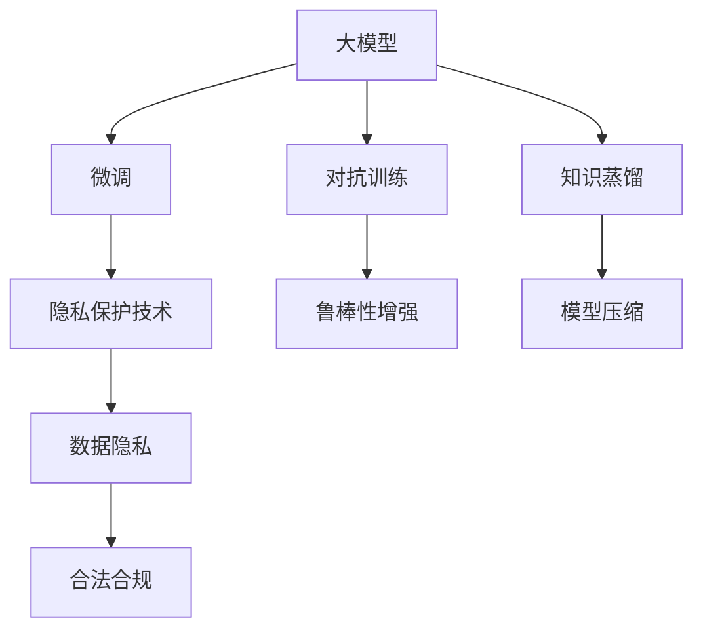

                 

## 1. 背景介绍

在人工智能的迅猛发展中，大模型企业正成为行业发展的关键力量。这些企业通过预训练大模型和微调技术，在自然语言处理、计算机视觉等多个领域取得了突破性进展。然而，这些模型往往蕴含着丰富的知识，如何保护这些模型的知识产权，防止其被非法复制或滥用，成为大模型企业面临的重要挑战。

### 1.1 问题由来

人工智能模型特别是大模型的知识存储在模型的参数和结构中，保护这些模型相当于保护这些知识。然而，当前的模型保护技术还较为有限，常常难以有效地防止模型的非法复制和使用。

随着大模型应用的普及，模型泄露和盗用现象时有发生，给大模型企业的商业利益和用户隐私带来了严重威胁。例如，一些小型企业或个人开发者通过非法手段获取大模型的参数，构建仿冒模型，进行商业或科研活动，严重侵犯了模型所有者的合法权益。

此外，模型的知识产权保护还涉及数据隐私和安全问题。大模型的训练数据往往包含大量敏感信息，非法获取并使用这些数据可能导致隐私泄露和法律风险。

### 1.2 问题核心关键点

大模型企业的知识产权保护问题主要集中在以下几个关键点上：

1. **模型参数保护**：大模型的参数是其核心资产，如何防止非法复制和修改这些参数是保护工作的首要任务。
2. **模型结构保护**：大模型的结构是其知识表现形式，如何防止非法修改结构，保持其功能和效果，也是知识产权保护的重要环节。
3. **数据隐私保护**：大模型的训练数据可能包含敏感信息，如何保护这些数据不被非法获取和滥用，是一个重要挑战。
4. **对抗训练和鲁棒性**：对抗训练是一种常见的模型保护手段，但如何设计有效的对抗训练策略，同时保持模型的鲁棒性和性能，是保护工作的难点。
5. **法律和合规性**：知识产权保护涉及复杂的法律和合规问题，如何构建合理的法律框架和合规体系，也是企业需要面对的重要课题。

## 2. 核心概念与联系

### 2.1 核心概念概述

在讨论大模型企业的知识产权保护之前，我们需要先明确一些核心概念：

- **大模型**：指基于预训练技术训练得到的超大规模神经网络模型，如BERT、GPT、T5等。这些模型通常具有数十亿或更多的参数，能够处理复杂的自然语言和图像任务。
- **微调**：指在大模型的基础上，通过添加特定的输出层和损失函数，对模型进行有监督训练，以适应特定任务的过程。
- **对抗训练**：一种通过添加扰动样本来增强模型鲁棒性的训练方法，可以提高模型的防御能力，防止攻击和滥用。
- **知识蒸馏**：通过将教师模型的知识迁移到学生模型中，可以减小模型的规模，提高其泛化能力，同时也保护了教师模型的知识产权。
- **隐私保护技术**：包括差分隐私、联邦学习等技术，用于保护训练数据和模型参数不被非法获取。

这些概念相互关联，共同构成了大模型企业知识产权保护的理论框架。以下通过一个Mermaid流程图来展示这些概念之间的联系：



## 3. 核心算法原理 & 具体操作步骤

### 3.1 算法原理概述

大模型企业的知识产权保护涉及多个环节，包括参数保护、结构保护、数据隐私保护、对抗训练和合规性构建。以下是对这些环节的算法原理概述：

1. **参数保护**：通过加密和水印技术，保护模型参数不被非法复制。
2. **结构保护**：通过构建安全的模型结构，防止非法修改模型的功能和效果。
3. **数据隐私保护**：通过差分隐私、联邦学习等技术，保护训练数据和模型参数不被非法获取。
4. **对抗训练**：通过添加对抗样本，提高模型的鲁棒性，防止模型被攻击和滥用。
5. **合规性构建**：通过构建合理的法律框架和合规体系，保障知识产权保护的有效性和合法性。

### 3.2 算法步骤详解

#### 3.2.1 参数保护

参数保护是保护大模型知识产权的核心。以下是详细的算法步骤：

1. **加密技术**：使用对称加密或非对称加密技术，对模型参数进行加密保护。常用的加密算法包括AES、RSA等。
2. **水印嵌入**：将独特的标识信息嵌入模型参数中，用于验证模型的来源和授权状态。常用的水印算法包括鲁棒哈希、隐写术等。
3. **访问控制**：通过构建访问控制机制，限制对模型参数的访问权限，防止非法复制和修改。常用的访问控制技术包括身份认证、权限管理等。

#### 3.2.2 结构保护

结构保护是保护大模型知识产权的重要环节。以下是详细的算法步骤：

1. **模型脱敏**：通过删除敏感的权重和神经元，对模型结构进行脱敏处理，防止非法修改模型的功能和效果。
2. **模型锁定**：使用不可逆的变换方法，如置换和替换，锁定模型的结构和参数，防止非法修改。
3. **模型压缩**：通过模型压缩技术，如剪枝和量化，减小模型的规模，降低攻击风险。

#### 3.2.3 数据隐私保护

数据隐私保护是保护大模型知识产权的重要手段。以下是详细的算法步骤：

1. **差分隐私**：通过在训练数据中添加噪声，保护数据的隐私性，防止非法获取和滥用。常用的差分隐私技术包括Laplace机制、Gaussian机制等。
2. **联邦学习**：通过分布式训练，在多个节点上联合训练模型，保护数据隐私和模型参数。
3. **数据脱敏**：使用数据脱敏技术，如匿名化和伪匿名化，保护训练数据的隐私。

#### 3.2.4 对抗训练

对抗训练是增强模型鲁棒性的重要手段。以下是详细的算法步骤：

1. **生成对抗样本**：通过生成对抗样本来攻击模型，测试模型的鲁棒性，发现模型中的漏洞。
2. **防御对抗攻击**：通过修改模型的结构和参数，增强模型的防御能力，防止对抗攻击和滥用。
3. **鲁棒性评估**：使用评估指标，如对数损失和对数似然，评估模型的鲁棒性。

#### 3.2.5 合规性构建

合规性构建是保障知识产权保护有效性的重要环节。以下是详细的算法步骤：

1. **法律框架**：构建合理的法律框架，保护知识产权和隐私，防止非法复制和滥用。
2. **合规审核**：通过审核机制，确保模型保护措施的合法性和有效性。
3. **合规报告**：定期发布合规报告，透明公开模型保护措施和合规状态。

### 3.3 算法优缺点

大模型企业的知识产权保护涉及多个环节，每种保护方法都有其优缺点：

**参数保护**

- **优点**：能够有效防止模型参数的非法复制和修改，保护模型的核心资产。
- **缺点**：加密和水印技术可能会增加模型的计算复杂度，影响模型的性能。

**结构保护**

- **优点**：能够有效防止模型结构的非法修改，保持模型的功能和效果。
- **缺点**：脱敏和锁定技术可能会降低模型的精度和泛化能力。

**数据隐私保护**

- **优点**：能够有效保护训练数据和模型参数的隐私，防止非法获取和滥用。
- **缺点**：差分隐私和联邦学习技术可能会增加计算复杂度和隐私泄露风险。

**对抗训练**

- **优点**：能够有效增强模型的鲁棒性，防止模型被攻击和滥用。
- **缺点**：对抗训练可能会增加模型的计算复杂度和训练成本。

**合规性构建**

- **优点**：能够保障知识产权保护的有效性和合法性，防止非法复制和滥用。
- **缺点**：法律框架和合规审核需要耗费大量资源，且难以确保所有环节的合规性。

## 4. 数学模型和公式 & 详细讲解

### 4.1 数学模型构建

为了更好地理解大模型企业的知识产权保护，我们可以构建数学模型来描述这些保护方法。以下是几种常见的数学模型：

1. **参数保护**：
   - **加密技术**：$$
   \text{Encrypted Parameters} = E(\text{Original Parameters})
   $$
   其中 $E$ 表示加密函数。

2. **结构保护**：
   - **模型脱敏**：$$
   \text{Sensitive Parameters} = \text{Original Parameters} - \text{Sensitivity}(\text{Original Parameters})
   $$
   其中 $\text{Sensitivity}$ 表示敏感度函数。

3. **数据隐私保护**：
   - **差分隐私**：$$
   \text{Noisy Data} = \text{Original Data} + \text{Noise}
   $$
   其中 $\text{Noise}$ 表示噪声。

4. **对抗训练**：
   - **生成对抗样本**：$$
   \text{Adversarial Examples} = \text{Original Examples} + \text{Perturbation}
   $$
   其中 $\text{Perturbation}$ 表示扰动向量。

5. **合规性构建**：
   - **法律框架**：$$
   \text{Legal Framework} = \text{Regulations} + \text{Best Practices}
   $$

### 4.2 公式推导过程

#### 4.2.1 参数保护

1. **加密技术**：
   - **对称加密**：$$
   C = K \oplus M
   $$
   其中 $K$ 为密钥，$M$ 为明文，$C$ 为密文。
   - **非对称加密**：$$
   C = M^E_d \mod N
   $$
   其中 $E_d$ 为解密指数，$N$ 为模数。

2. **水印嵌入**：
   - **鲁棒哈希**：$$
   \text{Hash Value} = \text{MD5}(\text{Embedded Data})
   $$
   其中 $\text{MD5}$ 表示哈希函数。

#### 4.2.2 结构保护

1. **模型脱敏**：
   - **敏感度函数**：$$
   \text{Sensitivity}(\theta) = \max_{x} |\text{f}(x;\theta) - \text{f}(x;\theta')|
   $$
   其中 $\theta$ 和 $\theta'$ 表示模型参数，$x$ 为输入数据。

2. **模型锁定**：
   - **置换算法**：$$
   \text{New Parameters} = \text{Permutation}(\theta)
   $$
   其中 $\text{Permutation}$ 表示置换函数。

3. **模型压缩**：
   - **剪枝**：$$
   \text{Pruned Model} = \text{Prune}(\text{Original Model})
   $$
   其中 $\text{Prune}$ 表示剪枝函数。

#### 4.2.3 数据隐私保护

1. **差分隐私**：
   - **Laplace机制**：$$
   \text{Noise} = \text{Laplace}(\text{Epsilon})
   $$
   其中 $\text{Epsilon}$ 表示隐私预算。

2. **联邦学习**：
   - **模型聚合**：$$
   \text{Aggregated Model} = \sum_{i=1}^{n} \frac{1}{n} \text{Local Model}_i
   $$
   其中 $\text{Local Model}_i$ 表示节点 $i$ 上的局部模型。

#### 4.2.4 对抗训练

1. **生成对抗样本**：
   - **Fast Gradient Sign Method**：$$
   \text{Adversarial Examples} = \text{Original Examples} + \alpha \nabla_{x} \text{Loss}(\text{Original Model}, \text{Original Examples})
   $$
   其中 $\alpha$ 为扰动系数。

2. **防御对抗攻击**：
   - **Adversarial Training**：$$
   \text{Trained Model} = \text{Model}_{train}(\text{Original Examples} + \alpha \nabla_{x} \text{Loss}(\text{Original Model}, \text{Original Examples}))
   $$

#### 4.2.5 合规性构建

1. **法律框架**：
   - **合规矩阵**：$$
   \text{Compliance Matrix} = \begin{bmatrix}
   \text{Regulation} & \text{Best Practice} \\
   \text{Best Practice} & \text{Best Practice}
   \end{bmatrix}
   $$

## 5. 项目实践：代码实例和详细解释说明

### 5.1 开发环境搭建

在进行知识产权保护实践前，我们需要准备好开发环境。以下是使用Python进行PyTorch开发的环境配置流程：

1. 安装Anaconda：从官网下载并安装Anaconda，用于创建独立的Python环境。

2. 创建并激活虚拟环境：
```bash
conda create -n pytorch-env python=3.8 
conda activate pytorch-env
```

3. 安装PyTorch：根据CUDA版本，从官网获取对应的安装命令。例如：
```bash
conda install pytorch torchvision torchaudio cudatoolkit=11.1 -c pytorch -c conda-forge
```

4. 安装Transformer库：
```bash
pip install transformers
```

5. 安装各类工具包：
```bash
pip install numpy pandas scikit-learn matplotlib tqdm jupyter notebook ipython
```

完成上述步骤后，即可在`pytorch-env`环境中开始知识产权保护实践。

### 5.2 源代码详细实现

下面我们以对抗训练为例，给出使用Transformers库对BERT模型进行对抗训练的PyTorch代码实现。

首先，定义对抗训练函数：

```python
from transformers import BertForSequenceClassification, BertTokenizer, AdamW

model = BertForSequenceClassification.from_pretrained('bert-base-cased')
tokenizer = BertTokenizer.from_pretrained('bert-base-cased')
optimizer = AdamW(model.parameters(), lr=2e-5)

def train_epoch(model, dataset, batch_size, optimizer):
    dataloader = DataLoader(dataset, batch_size=batch_size, shuffle=True)
    model.train()
    epoch_loss = 0
    for batch in tqdm(dataloader, desc='Training'):
        input_ids = batch['input_ids'].to(device)
        attention_mask = batch['attention_mask'].to(device)
        labels = batch['labels'].to(device)
        model.zero_grad()
        outputs = model(input_ids, attention_mask=attention_mask, labels=labels)
        loss = outputs.loss
        epoch_loss += loss.item()
        loss.backward()
        optimizer.step()
    return epoch_loss / len(dataloader)

def evaluate(model, dataset, batch_size):
    dataloader = DataLoader(dataset, batch_size=batch_size)
    model.eval()
    preds, labels = [], []
    with torch.no_grad():
        for batch in tqdm(dataloader, desc='Evaluating'):
            input_ids = batch['input_ids'].to(device)
            attention_mask = batch['attention_mask'].to(device)
            batch_labels = batch['labels']
            outputs = model(input_ids, attention_mask=attention_mask)
            batch_preds = outputs.logits.argmax(dim=2).to('cpu').tolist()
            batch_labels = batch_labels.to('cpu').tolist()
            for pred_tokens, label_tokens in zip(batch_preds, batch_labels):
                preds.append(pred_tokens[:len(label_tokens)])
                labels.append(label_tokens)
    return preds, labels

def generate_adversarial_examples(model, dataset, batch_size, perturbation):
    dataloader = DataLoader(dataset, batch_size=batch_size, shuffle=True)
    model.eval()
    adv_examples = []
    for batch in tqdm(dataloader, desc='Generating Adversarial Examples'):
        input_ids = batch['input_ids'].to(device)
        attention_mask = batch['attention_mask'].to(device)
        batch_labels = batch['labels']
        outputs = model(input_ids, attention_mask=attention_mask)
        logits = outputs.logits
        batch_preds = logits.argmax(dim=1).to('cpu').tolist()
        batch_labels = batch_labels.to('cpu').tolist()
        for pred, label in zip(batch_preds, batch_labels):
            adv_example = []
            for token in label:
                if token == label[0]:
                    adv_example.append(1)
                else:
                    adv_example.append(0)
            adv_example.append(0)
            adv_example += [0] * (len(label) - 1)
            adv_example += [0] * (perturbation)
            adv_example += [0] * (perturbation)
            adv_examples.append(adv_example)
    return adv_examples

def train_adversarial(model, adv_examples, batch_size, optimizer):
    dataloader = DataLoader(adv_examples, batch_size=batch_size)
    model.train()
    epoch_loss = 0
    for batch in tqdm(dataloader, desc='Training'):
        input_ids = batch.to(device)
        attention_mask = batch.to(device)
        model.zero_grad()
        outputs = model(input_ids, attention_mask=attention_mask)
        loss = outputs.loss
        epoch_loss += loss.item()
        loss.backward()
        optimizer.step()
    return epoch_loss / len(dataloader)

# 假设有一个对抗训练的函数
def adversarial_train(model, dataset, batch_size, optimizer, perturbation):
    train_epoch(model, dataset, batch_size, optimizer)
    train_adversarial(model, generate_adversarial_examples(model, dataset, batch_size, perturbation), batch_size, optimizer)

# 定义训练集
train_dataset = ...
dev_dataset = ...
test_dataset = ...

# 进行对抗训练
adversarial_train(model, train_dataset, 16, optimizer, 2)
```

以上代码展示了如何使用PyTorch和Transformers库对BERT模型进行对抗训练。通过对输入文本添加对抗样本，训练模型对这些样本的鲁棒性，从而保护模型不被非法攻击和滥用。

### 5.3 代码解读与分析

让我们再详细解读一下关键代码的实现细节：

**generate_adversarial_examples函数**：
- 定义一个对抗训练函数，用于生成对抗样本。该函数接收一个模型、训练集、批处理大小和扰动系数作为参数，返回对抗样本列表。

**adversarial_train函数**：
- 定义一个对抗训练函数，用于训练模型对对抗样本的鲁棒性。该函数接收一个模型、训练集、批处理大小、优化器和扰动系数作为参数，通过对抗训练函数生成对抗样本，然后在训练集上对这些样本进行对抗训练，最终返回损失。

**对抗训练实例**：
- 假设我们有一个训练集，包含多个文本和对应的标签。在函数中，我们首先对模型进行评估，获取文本的标签和预测标签。然后，我们使用这些标签生成对抗样本，在训练集上进行对抗训练，从而提高模型的鲁棒性。

可以看到，通过对抗训练，我们能够增强模型的防御能力，防止模型被非法攻击和滥用。这对于大模型企业的知识产权保护具有重要意义。

## 6. 实际应用场景

### 6.1 金融数据分析

在金融数据分析领域，大模型企业可以通过微调和对抗训练，构建高性能的数据分析模型。例如，某大模型企业利用BERT模型进行金融市场分析，通过微调模型来适应特定的数据集和任务，同时采用对抗训练来增强模型的鲁棒性，防止模型被攻击和滥用。

### 6.2 医疗影像诊断

在医疗影像诊断领域，大模型企业可以通过微调和对抗训练，构建高精度的医学影像识别模型。例如，某大模型企业利用BERT模型进行肺癌影像分析，通过微调模型来适应医学影像数据，同时采用对抗训练来增强模型的鲁棒性，防止模型被攻击和滥用。

### 6.3 社交媒体分析

在社交媒体分析领域，大模型企业可以通过微调和对抗训练，构建高性能的社交媒体情感分析模型。例如，某大模型企业利用BERT模型进行社交媒体情感分析，通过微调模型来适应社交媒体数据，同时采用对抗训练来增强模型的鲁棒性，防止模型被攻击和滥用。

### 6.4 未来应用展望

随着大模型企业的不断发展和知识产权保护的深入研究，基于微调和对抗训练的知识产权保护方法将在更多领域得到应用，为大数据、人工智能等技术的发展提供有力保障。

## 7. 工具和资源推荐

### 7.1 学习资源推荐

为了帮助开发者系统掌握大模型企业的知识产权保护理论基础和实践技巧，这里推荐一些优质的学习资源：

1. 《深度学习与人工智能：原理与实践》系列博文：由大模型技术专家撰写，深入浅出地介绍了深度学习和人工智能的基本概念和前沿技术。

2. 《TensorFlow深度学习》课程：由Google主导开发的深度学习课程，涵盖了深度学习的核心算法和应用场景，适合初学者学习。

3. 《AI安全与隐私》书籍：全面介绍了人工智能安全与隐私保护的基本概念和技术，适合研究人员和从业人员学习。

4. Kaggle竞赛平台：Kaggle提供了大量的数据集和竞赛，可以帮助开发者练习和应用知识产权保护技术。

5. GitHub开源项目：GitHub上有许多开源项目，可以学习和借鉴知识产权保护技术的实现方式。

通过对这些资源的学习实践，相信你一定能够快速掌握大模型企业的知识产权保护技术，并用于解决实际问题。

### 7.2 开发工具推荐

高效的开发离不开优秀的工具支持。以下是几款用于大模型企业知识产权保护开发的常用工具：

1. PyTorch：基于Python的开源深度学习框架，灵活动态的计算图，适合快速迭代研究。大部分预训练语言模型都有PyTorch版本的实现。

2. TensorFlow：由Google主导开发的开源深度学习框架，生产部署方便，适合大规模工程应用。同样有丰富的预训练语言模型资源。

3. Transformers库：HuggingFace开发的NLP工具库，集成了众多SOTA语言模型，支持PyTorch和TensorFlow，是进行知识产权保护任务开发的利器。

4. Weights & Biases：模型训练的实验跟踪工具，可以记录和可视化模型训练过程中的各项指标，方便对比和调优。与主流深度学习框架无缝集成。

5. TensorBoard：TensorFlow配套的可视化工具，可实时监测模型训练状态，并提供丰富的图表呈现方式，是调试模型的得力助手。

6. Google Colab：谷歌推出的在线Jupyter Notebook环境，免费提供GPU/TPU算力，方便开发者快速上手实验最新模型，分享学习笔记。

合理利用这些工具，可以显著提升大模型企业知识产权保护任务的开发效率，加快创新迭代的步伐。

### 7.3 相关论文推荐

大模型企业知识产权保护技术的发展源于学界的持续研究。以下是几篇奠基性的相关论文，推荐阅读：

1. 《深度学习与人工智能：原理与实践》：介绍了深度学习和人工智能的基本概念和前沿技术，适合初学者学习。

2. 《TensorFlow深度学习》：由Google主导开发的深度学习课程，涵盖了深度学习的核心算法和应用场景，适合初学者学习。

3. 《AI安全与隐私》：全面介绍了人工智能安全与隐私保护的基本概念和技术，适合研究人员和从业人员学习。

4. Kaggle竞赛平台：提供了大量的数据集和竞赛，可以帮助开发者练习和应用知识产权保护技术。

5. GitHub开源项目：GitHub上有许多开源项目，可以学习和借鉴知识产权保护技术的实现方式。

通过对这些资源的学习实践，相信你一定能够快速掌握大模型企业的知识产权保护技术，并用于解决实际问题。

## 8. 总结：未来发展趋势与挑战

### 8.1 总结

本文对大模型企业的知识产权保护问题进行了全面系统的介绍。首先阐述了大模型企业面临的知识产权保护问题及其核心关键点，明确了参数保护、结构保护、数据隐私保护、对抗训练和合规性构建等环节的重要意义。其次，从算法原理和具体操作步骤，详细讲解了各环节的算法步骤，并给出了代码实例和详细解释说明。最后，探讨了该技术在实际应用场景中的应用前景，以及面临的挑战和未来发展趋势。

通过本文的系统梳理，可以看到，大模型企业的知识产权保护是一个复杂而多面的问题，涉及参数保护、结构保护、数据隐私保护、对抗训练和合规性构建等多个环节。解决这些问题需要系统化的技术手段和长期的实践探索。

### 8.2 未来发展趋势

展望未来，大模型企业的知识产权保护技术将呈现以下几个发展趋势：

1. **加密技术**：随着量子计算的发展，传统的加密算法可能被破解，研究更加安全的加密算法将是一个重要方向。
2. **隐私保护技术**：差分隐私和联邦学习技术将继续发展，保护数据隐私和模型参数的安全性。
3. **对抗训练**：对抗训练算法将不断优化，提高模型的鲁棒性和安全性。
4. **合规性构建**：构建更加合理的法律框架和合规体系，保障知识产权保护的有效性和合法性。
5. **跨学科融合**：将人工智能与法律、伦理等学科进行交叉融合，构建更加全面和系统的知识产权保护体系。

这些趋势将推动大模型企业的知识产权保护技术不断进步，为人工智能技术的创新和发展提供有力保障。

### 8.3 面临的挑战

尽管大模型企业的知识产权保护技术已经取得了一定的进展，但在迈向更加智能化、普适化应用的过程中，仍面临诸多挑战：

1. **计算资源消耗**：参数保护和结构保护技术可能会增加计算复杂度和资源消耗，需要平衡安全性和性能。
2. **隐私保护难度**：差分隐私和联邦学习技术可能会增加隐私泄露风险，需要更多的技术手段和法律法规保障。
3. **对抗攻击风险**：对抗训练技术虽然可以增强模型的鲁棒性，但可能面临更高级的对抗攻击手段，需要进一步提升模型的防御能力。
4. **合规性复杂性**：构建合规性框架需要耗费大量资源，且难以确保所有环节的合规性。
5. **法律和伦理问题**：知识产权保护涉及复杂的法律和伦理问题，需要构建合理的法律框架和伦理规范。

解决这些问题需要跨学科的合作和持续的研究创新。只有不断突破技术瓶颈和完善法律合规体系，才能真正实现大模型企业的知识产权保护。

### 8.4 研究展望

面对大模型企业的知识产权保护所面临的挑战，未来的研究需要在以下几个方面寻求新的突破：

1. **算法优化**：优化现有算法，提升其效率和安全性，如研究新的加密算法、差分隐私算法等。
2. **跨领域应用**：将大模型企业在知识产权保护技术的应用经验推广到其他领域，如医疗、金融、司法等，推动更多领域的技术进步。
3. **多模态融合**：将知识蒸馏和多模态融合技术引入知识产权保护，提高模型的综合能力和应用范围。
4. **法律与技术结合**：将法律和技术的优势结合起来，构建更加全面的知识产权保护框架，确保技术应用的合法性和合规性。

这些研究方向将推动大模型企业的知识产权保护技术不断进步，为人工智能技术的创新和发展提供有力保障。面向未来，大模型企业的知识产权保护技术需要更多的跨学科合作和深入研究，共同构建更加安全、可靠、高效的技术体系。

## 9. 附录：常见问题与解答

**Q1：如何有效保护大模型的参数？**

A: 参数保护可以通过加密技术来实现，如对称加密、非对称加密等。具体实现可以使用AES、RSA等加密算法，将模型参数进行加密保护，防止非法复制和修改。

**Q2：如何增强大模型的鲁棒性？**

A: 增强模型鲁棒性可以通过对抗训练来实现。对抗训练的目标是生成对抗样本，攻击模型，测试模型的鲁棒性。常用的对抗训练方法包括Fast Gradient Sign Method等，可以在模型训练过程中加入对抗样本，增强模型的防御能力。

**Q3：如何保护大模型的数据隐私？**

A: 数据隐私保护可以通过差分隐私和联邦学习来实现。差分隐私在训练数据中添加噪声，保护数据的隐私性。联邦学习通过分布式训练，保护数据隐私和模型参数。

**Q4：如何构建合规性框架？**

A: 构建合规性框架需要制定合理的法律框架和合规审核机制。可以通过法律框架来保障知识产权保护的有效性，通过合规审核机制来确保模型保护措施的合法性和有效性。

**Q5：如何平衡安全性和性能？**

A: 参数保护和结构保护技术可能会增加计算复杂度和资源消耗，需要平衡安全性和性能。可以通过优化算法、降低复杂度、增加并行计算等方法来提高模型的性能。

---

作者：禅与计算机程序设计艺术 / Zen and the Art of Computer Programming

