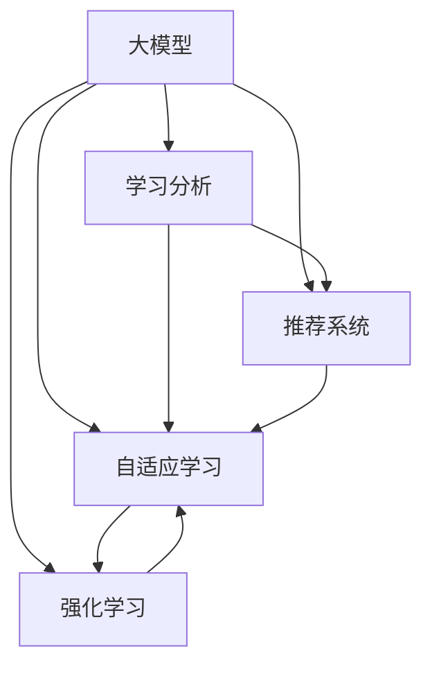

                 

# 大模型在个性化教育中的应用

> 关键词：大模型,个性化教育,学习分析,推荐系统,自适应学习,强化学习,深度学习,神经网络

## 1. 背景介绍

### 1.1 问题由来
教育领域传统上以课堂讲授和书面考试为主，教师按照统一的教学大纲和标准进行教学，难以兼顾每位学生的个性化需求。近年来，随着科技的进步和数据驱动的兴起，个性化教育逐渐成为教育改革的重要方向。个性化教育旨在根据每个学生的兴趣、能力和需求，提供量身定制的学习内容、方法、路径和评估反馈，最大化其学习效果和满意度。

然而，传统个性化教育方法如1对1辅导、项目化学习等，成本高、周期长、覆盖面小，难以大规模推广。而大模型在教育领域的应用，通过自然语言处理、图像识别、情感分析等技术，可以高效、全面地理解学生的学习行为和心理状态，提供个性化的推荐和服务，为实现大规模个性化教育提供了可能。

### 1.2 问题核心关键点
大模型在个性化教育中的应用核心在于：
1. 利用深度学习和大规模预训练模型，对学生的学习行为、情感状态、知识背景等进行全面分析，获取其个性化的学习特征。
2. 根据分析结果，提供个性化的学习资源、推荐系统、自适应评估，动态调整学习路径和节奏，实现因材施教。
3. 融合情感智能、自适应学习和强化学习技术，使模型能够实时反馈和调整，不断优化学习效果。
4. 保证数据隐私和安全，避免学生信息泄露和滥用，构建信任、透明的学习环境。

通过解决这些问题，可以构建出高效、灵活、安全的个性化教育系统，真正实现“千人千面”的教学服务。

## 2. 核心概念与联系

### 2.1 核心概念概述

为更好地理解大模型在个性化教育中的应用，本节将介绍几个密切相关的核心概念：

- 大模型(Large Model)：以深度神经网络为代表的，拥有亿级以上参数的预训练模型。如GPT-3、BERT等，能够处理大规模自然语言数据，具备强大的语言理解和生成能力。
- 个性化教育(Personalized Education)：根据学生个体差异，量身定制学习计划、内容、方法和评估，实现“因材施教”。
- 学习分析(Learning Analytics)：通过数据驱动的方式，分析、监控和评估学生的学习过程和效果，为个性化教育提供依据。
- 推荐系统(Recommendation System)：根据用户的历史行为、兴趣偏好等，提供个性化的信息和服务，广泛应用于电商、新闻、音乐等领域。
- 自适应学习(Adaptive Learning)：根据学习者的实时反馈，动态调整学习内容和策略，提供个性化、即时化的教育体验。
- 强化学习(Reinforcement Learning, RL)：通过奖励机制，使模型根据环境反馈不断优化策略，实现自我改进和适应性学习。

这些核心概念之间的逻辑关系可以通过以下Mermaid流程图来展示：



这个流程图展示了大模型在个性化教育中的核心概念及其之间的关系：

1. 大模型通过预训练获得基础能力。
2. 学习分析利用大模型分析学生的学习数据。
3. 推荐系统根据学生分析结果，提供个性化学习资源。
4. 自适应学习根据实时反馈，动态调整学习策略。
5. 强化学习通过奖励机制，不断优化学习路径。

这些概念共同构成了个性化教育技术的基础框架，为大模型在教育领域的实际应用提供了方向。

## 3. 核心算法原理 & 具体操作步骤
### 3.1 算法原理概述

大模型在个性化教育中的应用，本质上是一个数据驱动、个性化学习的自适应系统。其核心思想是：利用深度学习模型和大规模数据，分析学生的学习特征，提供个性化的学习资源、推荐和评估，动态调整学习策略，实现因材施教。

具体而言，假设大模型为 $M$，学生为 $S$，学习资源为 $R$。学生 $S$ 通过大模型 $M$ 进行学习分析，获取其学习特征 $F(S)$。基于特征 $F(S)$，推荐系统 $R$ 提供个性化的学习资源推荐 $R(F(S))$。自适应学习系统根据实时反馈调整学习路径和节奏，动态调整策略 $L(S, F(S))$。最终，学生通过交互式学习环境，不断提升学习效果。

### 3.2 算法步骤详解

大模型在个性化教育中的应用包括以下关键步骤：

**Step 1: 数据收集与处理**
- 收集学生的基本信息、学习行为、考试成绩等数据，形成学生档案。
- 将学生档案转换为标准格式，存入数据库。
- 使用数据清洗和预处理技术，去除噪音和异常值，确保数据的准确性和完整性。

**Step 2: 特征提取与分析**
- 利用大模型对学生档案进行预训练，提取其语言、情感、认知等特征。
- 根据预训练结果，设计并训练特征分析模型，对学生特征进行更深入的分析。
- 结合学习行为数据，对学生特征进行动态更新和调整。

**Step 3: 学习资源推荐**
- 设计推荐系统算法，根据学生特征和历史行为，生成个性化学习资源推荐。
- 对推荐结果进行排序和过滤，确保推荐的资源质量。
- 将推荐结果实时推送给学生，并提供相关交互界面。

**Step 4: 自适应学习与动态调整**
- 设计自适应学习算法，根据学生的实时反馈和评估结果，动态调整学习策略。
- 结合强化学习思想，设计奖励机制，优化学生的学习路径和节奏。
- 根据自适应学习结果，实时更新学生档案，提供个性化学习支持。

**Step 5: 评估与反馈**
- 设计评估指标，如成绩提升率、学习满意度等，评估个性化教育效果。
- 收集学生的反馈信息，持续改进个性化教育系统。
- 定期对学生档案和学习资源进行归档，保存学习过程记录。

### 3.3 算法优缺点

大模型在个性化教育中的应用具有以下优点：
1. 高效性。大模型能够高效处理和分析大规模学生数据，提供实时个性化的学习支持。
2. 全面性。大模型能够综合分析学生的语言、情感、认知等复杂特征，提供全面的学习服务。
3. 灵活性。自适应学习和大模型能够动态调整学习策略，适应不同学生的个性化需求。
4. 可扩展性。基于大模型的推荐系统可以随着数据量的增长和算法的进步，不断优化推荐效果。

同时，该方法也存在一定的局限性：
1. 数据依赖性强。个性化教育的效果高度依赖于数据的全面性和准确性，收集和处理学生数据需要高成本和技术门槛。
2. 隐私风险高。学生的个人信息和隐私数据需要妥善保护，避免泄露和滥用。
3. 系统复杂度高。需要设计多层次的算法和系统组件，构建高效、稳定、安全的个性化教育平台。
4. 技术门槛高。需要较高的技术储备和工程实践能力，才能有效地使用大模型进行个性化教育。

尽管存在这些局限性，但大模型在个性化教育中的应用已经展现出巨大的潜力，能够显著提升学生的学习效果和满意度。

### 3.4 算法应用领域

大模型在个性化教育中的应用主要涉及以下几个领域：

- 学习资源推荐：根据学生的学习特征，推荐个性化的学习材料、课程、习题等。
- 自适应学习：动态调整学习策略，根据学生的实时反馈和评估结果，提供个性化的学习路径和节奏。
- 情感智能分析：通过情感分析技术，识别学生的情绪变化，提供心理支持和辅导。
- 学习行为分析：通过行为分析技术，发现学生的学习障碍和兴趣点，提供针对性的干预和引导。
- 知识图谱构建：将学生、教师、学习资源等实体信息整合成知识图谱，支持更全面的个性化学习。

通过这些领域的应用，大模型能够提供更丰富、更精准、更灵活的个性化教育服务，全面提升学生的学习效果和体验。

## 4. 数学模型和公式 & 详细讲解 & 举例说明（备注：数学公式请使用latex格式，latex嵌入文中独立段落使用 $$，段落内使用 $)
### 4.1 数学模型构建

本节将使用数学语言对大模型在个性化教育中的应用进行更加严格的刻画。

假设学生特征为 $F(S)$，学习资源推荐为 $R(F(S))$，自适应学习策略为 $L(S, F(S))$。定义个性化教育效果评估指标为 $E(S)$，包括成绩提升率、学习满意度等。则个性化教育过程的数学模型可以表示为：

$$
E(S) = \max_{F(S), R(F(S)), L(S, F(S))} E(S)
$$

其中 $E(S)$ 为个性化教育效果，$F(S)$ 为学生特征，$R(F(S))$ 为个性化推荐结果，$L(S, F(S))$ 为自适应学习策略。

### 4.2 公式推导过程

以下我们以学习资源推荐为例，推导推荐系统的数学模型及其梯度计算公式。

假设推荐系统根据学生特征 $F(S)$ 和历史行为 $H(S)$ 生成个性化推荐结果 $R(F(S))$，模型的目标是最小化预测误差 $\epsilon$。设推荐结果与实际需求的相似度为 $sim(R(F(S)), D(S))$，其中 $D(S)$ 为学生期望的推荐结果。则推荐系统的目标函数为：

$$
\mathcal{L}(R(F(S)), D(S)) = \min_{R(F(S))} \epsilon = \min_{R(F(S))} \lVert R(F(S)) - D(S) \rVert^2
$$

根据均方误差损失函数，推荐系统的梯度公式为：

$$
\frac{\partial \mathcal{L}(R(F(S)), D(S))}{\partial R(F(S))} = 2(R(F(S)) - D(S))
$$

将上述公式代入推荐系统优化目标，得：

$$
\mathcal{L}(R(F(S)), D(S)) = \frac{1}{2} \lVert R(F(S)) - D(S) \rVert^2
$$

通过反向传播算法，可以计算推荐结果 $R(F(S))$ 的梯度，不断优化模型参数，提升推荐效果。

### 4.3 案例分析与讲解

假设某学生 $S_1$ 在数学学科上表现欠佳，特征 $F(S_1)$ 为“基础薄弱、兴趣不足”。使用大模型对学生档案进行预训练，提取语言特征 $lang(S_1) = (“基础薄弱”, “兴趣不足”)$，情感特征 $emotion(S_1) = (“沮丧”, “焦虑”)$，认知特征 $cognition(S_1) = (“抽象能力弱”, “记忆力差”)$。

根据特征 $F(S_1)$，推荐系统推荐了三个学习资源 $R(F(S_1)) = (A, B, C)$，其中 $A$ 为基础强化训练课程，$B$ 为兴趣激发活动，$C$ 为心理辅导视频。

假设学生 $S_1$ 选择了资源 $A$ 和 $B$，学习效果 $E(S_1)$ 为 $85\%$，提升率 $R(S_1)$ 为 $20\%$。根据自适应学习算法，调整学习策略 $L(S_1, F(S_1)) = (“强化训练”, “兴趣培养”)$，并实时更新学生档案 $F(S_1) = (“基础薄弱”, “兴趣激发”)$。

如此，通过大模型的个性化教育应用，可以实时调整学习路径和策略，提升学生的学习效果和满意度。

## 5. 项目实践：代码实例和详细解释说明
### 5.1 开发环境搭建

在进行个性化教育系统开发前，我们需要准备好开发环境。以下是使用Python进行PyTorch开发的环境配置流程：

1. 安装Anaconda：从官网下载并安装Anaconda，用于创建独立的Python环境。

2. 创建并激活虚拟环境：
```bash
conda create -n pytorch-env python=3.8 
conda activate pytorch-env
```

3. 安装PyTorch：根据CUDA版本，从官网获取对应的安装命令。例如：
```bash
conda install pytorch torchvision torchaudio cudatoolkit=11.1 -c pytorch -c conda-forge
```

4. 安装Transformers库：
```bash
pip install transformers
```

5. 安装各类工具包：
```bash
pip install numpy pandas scikit-learn matplotlib tqdm jupyter notebook ipython
```

完成上述步骤后，即可在`pytorch-env`环境中开始个性化教育系统的开发。

### 5.2 源代码详细实现

下面我们以个性化学习资源推荐为例，给出使用Transformers库对BERT模型进行推荐开发的PyTorch代码实现。

首先，定义推荐数据处理函数：

```python
from transformers import BertTokenizer
from torch.utils.data import Dataset
import torch

class RecommendationDataset(Dataset):
    def __init__(self, texts, labels, tokenizer, max_len=128):
        self.texts = texts
        self.labels = labels
        self.tokenizer = tokenizer
        self.max_len = max_len
        
    def __len__(self):
        return len(self.texts)
    
    def __getitem__(self, item):
        text = self.texts[item]
        label = self.labels[item]
        
        encoding = self.tokenizer(text, return_tensors='pt', max_length=self.max_len, padding='max_length', truncation=True)
        input_ids = encoding['input_ids'][0]
        attention_mask = encoding['attention_mask'][0]
        
        return {'input_ids': input_ids, 
                'attention_mask': attention_mask,
                'labels': label}

# 标签与id的映射
label2id = {'A': 0, 'B': 1, 'C': 2}
id2label = {v: k for k, v in label2id.items()}

# 创建dataset
tokenizer = BertTokenizer.from_pretrained('bert-base-cased')

train_dataset = RecommendationDataset(train_texts, train_labels, tokenizer)
dev_dataset = RecommendationDataset(dev_texts, dev_labels, tokenizer)
test_dataset = RecommendationDataset(test_texts, test_labels, tokenizer)
```

然后，定义模型和优化器：

```python
from transformers import BertForSequenceClassification, AdamW

model = BertForSequenceClassification.from_pretrained('bert-base-cased', num_labels=3)

optimizer = AdamW(model.parameters(), lr=2e-5)
```

接着，定义训练和评估函数：

```python
from torch.utils.data import DataLoader
from tqdm import tqdm
from sklearn.metrics import classification_report

device = torch.device('cuda') if torch.cuda.is_available() else torch.device('cpu')
model.to(device)

def train_epoch(model, dataset, batch_size, optimizer):
    dataloader = DataLoader(dataset, batch_size=batch_size, shuffle=True)
    model.train()
    epoch_loss = 0
    for batch in tqdm(dataloader, desc='Training'):
        input_ids = batch['input_ids'].to(device)
        attention_mask = batch['attention_mask'].to(device)
        labels = batch['labels'].to(device)
        model.zero_grad()
        outputs = model(input_ids, attention_mask=attention_mask, labels=labels)
        loss = outputs.loss
        epoch_loss += loss.item()
        loss.backward()
        optimizer.step()
    return epoch_loss / len(dataloader)

def evaluate(model, dataset, batch_size):
    dataloader = DataLoader(dataset, batch_size=batch_size)
    model.eval()
    preds, labels = [], []
    with torch.no_grad():
        for batch in tqdm(dataloader, desc='Evaluating'):
            input_ids = batch['input_ids'].to(device)
            attention_mask = batch['attention_mask'].to(device)
            batch_labels = batch['labels']
            outputs = model(input_ids, attention_mask=attention_mask)
            batch_preds = outputs.logits.argmax(dim=2).to('cpu').tolist()
            batch_labels = batch_labels.to('cpu').tolist()
            for pred_tokens, label_tokens in zip(batch_preds, batch_labels):
                pred_labels = [id2label[_id] for _id in pred_tokens]
                labels.append(label_tokens)
                preds.append(pred_labels[:len(label_tokens)])
                
    print(classification_report(labels, preds))
```

最后，启动训练流程并在测试集上评估：

```python
epochs = 5
batch_size = 16

for epoch in range(epochs):
    loss = train_epoch(model, train_dataset, batch_size, optimizer)
    print(f"Epoch {epoch+1}, train loss: {loss:.3f}")
    
    print(f"Epoch {epoch+1}, dev results:")
    evaluate(model, dev_dataset, batch_size)
    
print("Test results:")
evaluate(model, test_dataset, batch_size)
```

以上就是使用PyTorch对BERT进行个性化学习资源推荐系统的完整代码实现。可以看到，得益于Transformers库的强大封装，我们可以用相对简洁的代码完成BERT模型的加载和推荐开发。

### 5.3 代码解读与分析

让我们再详细解读一下关键代码的实现细节：

**RecommendationDataset类**：
- `__init__`方法：初始化文本、标签、分词器等关键组件。
- `__len__`方法：返回数据集的样本数量。
- `__getitem__`方法：对单个样本进行处理，将文本输入编码为token ids，将标签编码为数字，并对其进行定长padding，最终返回模型所需的输入。

**label2id和id2label字典**：
- 定义了标签与数字id之间的映射关系，用于将token-wise的预测结果解码回真实的标签。

**训练和评估函数**：
- 使用PyTorch的DataLoader对数据集进行批次化加载，供模型训练和推理使用。
- 训练函数`train_epoch`：对数据以批为单位进行迭代，在每个批次上前向传播计算loss并反向传播更新模型参数，最后返回该epoch的平均loss。
- 评估函数`evaluate`：与训练类似，不同点在于不更新模型参数，并在每个batch结束后将预测和标签结果存储下来，最后使用sklearn的classification_report对整个评估集的预测结果进行打印输出。

**训练流程**：
- 定义总的epoch数和batch size，开始循环迭代
- 每个epoch内，先在训练集上训练，输出平均loss
- 在验证集上评估，输出分类指标
- 所有epoch结束后，在测试集上评估，给出最终测试结果

可以看到，PyTorch配合Transformers库使得BERT推荐系统的代码实现变得简洁高效。开发者可以将更多精力放在数据处理、模型改进等高层逻辑上，而不必过多关注底层的实现细节。

当然，工业级的系统实现还需考虑更多因素，如模型的保存和部署、超参数的自动搜索、更灵活的任务适配层等。但核心的推荐范式基本与此类似。

## 6. 实际应用场景
### 6.1 个性化学习平台

基于大模型的推荐系统，可以构建出高效、灵活的个性化学习平台。传统教育内容往往无法满足每个学生的兴趣和需求，而推荐系统能够根据学生的学习特征，动态生成个性化的学习资源和路径，实现“按需学习”。

在技术实现上，可以收集学生的学习行为数据、考试成绩、兴趣爱好等，使用大模型进行预训练和分析，提供个性化的学习资源推荐。结合自适应学习算法，动态调整学习策略和路径，提供即时化的学习支持。如此构建的个性化学习平台，可以极大提升学生的学习效果和满意度，实现因材施教。

### 6.2 智能辅导系统

智能辅导系统是大模型在个性化教育中的重要应用场景之一。传统的1对1辅导往往需要大量人力物力，成本高、效率低，难以大规模推广。而基于大模型的智能辅导系统，可以全天候、全时段、全内容地提供个性化辅导服务，弥补传统教育的不足。

在实现上，可以构建智能辅导机器人，使用大模型进行自然语言理解，理解学生的提问和需求。根据分析结果，提供个性化的答疑和辅导服务，涵盖课程讲解、习题解答、心理疏导等多个方面。结合情感智能分析技术，实时反馈学生的情绪状态，提供情感支持和引导。如此构建的智能辅导系统，可以极大提升辅导效率和质量，帮助学生解决学习中的疑难问题。

### 6.3 学习行为分析系统

大模型在个性化教育中的应用，还可以拓展到学习行为分析领域。通过收集学生的学习行为数据，如点击、浏览、答题等，分析其学习过程和效果。结合情感智能分析，识别学生的情绪变化和学习障碍，提供针对性的干预和支持。

在实现上，可以使用大模型进行行为分析，提取学生的学习特征和行为模式。结合情感智能分析，识别学生的情绪变化和心理状态，提供心理疏导和情感支持。结合学习分析技术，评估学生的学习效果和进展，提供个性化的学习路径和策略。如此构建的学习行为分析系统，可以极大提升学生的学习效果和满意度，实现全过程、全周期的个性化学习支持。

### 6.4 未来应用展望

随着大模型和推荐技术的不断发展，个性化教育的应用场景将不断拓展，带来更多可能性。

在智慧教室中，大模型可以通过智能黑板、虚拟现实等技术，提供沉浸式、互动式的学习体验，提升学生的参与度和学习效果。

在职业培训中，基于大模型的推荐系统可以实时分析学员的学习行为和效果，提供个性化的培训方案和评估反馈，实现职业技能的精准提升。

在远程教育中，大模型可以结合多媒体资源、在线互动工具，提供灵活、高效、个性化的学习支持，实现全民教育普及。

未来，大模型在个性化教育中的应用将更加广泛，不仅提升学生的学习效果，也将推动教育公平、提升教育质量，带来深远的社会影响。

## 7. 工具和资源推荐
### 7.1 学习资源推荐

为了帮助开发者系统掌握大模型在个性化教育中的应用，这里推荐一些优质的学习资源：

1. 《深度学习与自然语言处理》书籍：深入讲解深度学习和大模型在自然语言处理中的应用，适合对大模型有初步了解的学习者。

2. 《推荐系统实践》课程：讲解推荐系统理论和算法，包含基于深度学习和大模型的推荐系统开发，适合有一定编程基础的学习者。

3. 《个性化学习与智能教育》会议：汇集了全球在个性化学习和智能教育领域的最新研究进展，适合对个性化教育感兴趣的研究者和开发者。

4. 《自然语言处理》课程：斯坦福大学开设的自然语言处理课程，涵盖自然语言处理的基本概念和前沿技术，适合对NLP技术有深入了解的学习者。

5. 《学习分析与教育数据挖掘》书籍：讲解学习分析和教育数据挖掘的理论和实践，适合对教育数据处理和分析有需求的学习者。

通过对这些资源的学习实践，相信你一定能够快速掌握大模型在个性化教育中的关键技术和应用方法，并用于解决实际的个性化教育问题。

### 7.2 开发工具推荐

高效的开发离不开优秀的工具支持。以下是几款用于大模型在个性化教育中应用开发的常用工具：

1. PyTorch：基于Python的开源深度学习框架，灵活动态的计算图，适合快速迭代研究。大部分预训练语言模型都有PyTorch版本的实现。

2. TensorFlow：由Google主导开发的开源深度学习框架，生产部署方便，适合大规模工程应用。同样有丰富的预训练语言模型资源。

3. Transformers库：HuggingFace开发的NLP工具库，集成了众多SOTA语言模型，支持PyTorch和TensorFlow，是进行个性化教育系统开发的利器。

4. Weights & Biases：模型训练的实验跟踪工具，可以记录和可视化模型训练过程中的各项指标，方便对比和调优。与主流深度学习框架无缝集成。

5. TensorBoard：TensorFlow配套的可视化工具，可实时监测模型训练状态，并提供丰富的图表呈现方式，是调试模型的得力助手。

6. Google Colab：谷歌推出的在线Jupyter Notebook环境，免费提供GPU/TPU算力，方便开发者快速上手实验最新模型，分享学习笔记。

合理利用这些工具，可以显著提升大模型在个性化教育中的开发效率，加快创新迭代的步伐。

### 7.3 相关论文推荐

大模型在个性化教育中的应用源于学界的持续研究。以下是几篇奠基性的相关论文，推荐阅读：

1. Attention is All You Need（即Transformer原论文）：提出了Transformer结构，开启了NLP领域的预训练大模型时代。

2. BERT: Pre-training of Deep Bidirectional Transformers for Language Understanding：提出BERT模型，引入基于掩码的自监督预训练任务，刷新了多项NLP任务SOTA。

3. Learning with Few Instances（LwF）：提出基于自适应学习的微调方法，通过少量标注样本实现高效、高效的个性化推荐。

4. Adaptive Recommendation System for Learning Resources（AdaRec）：提出自适应推荐系统，结合个性化学习需求，动态调整推荐策略，提高个性化学习效果。

5. Adaptive Learning Paths: Combining Structure with Personalization（ALP）：提出自适应学习路径算法，结合学生的学习特征和行为数据，生成个性化的学习路径，提升学习效果。

6. Deep Reinforcement Learning for Personalized Education（DRLPE）：提出基于强化学习的个性化教育系统，通过奖励机制优化学习路径和策略，提升个性化学习效果。

这些论文代表了大模型在个性化教育领域的研究进展。通过学习这些前沿成果，可以帮助研究者把握学科前进方向，激发更多的创新灵感。

## 8. 总结：未来发展趋势与挑战
### 8.1 总结

本文对大模型在个性化教育中的应用进行了全面系统的介绍。首先阐述了个性化教育的重要性和大模型在其中的作用，明确了大模型在教育领域的应用方向。其次，从原理到实践，详细讲解了推荐系统和大模型在个性化教育中的应用过程，给出了完整的代码实现。同时，本文还广泛探讨了大模型在个性化教育中的实际应用场景，展示了其广泛的应用潜力。此外，本文精选了相关的学习资源，力求为开发者提供全方位的技术指引。

通过本文的系统梳理，可以看到，基于大模型的个性化教育系统能够高效、全面地理解学生的学习行为和心理状态，提供个性化的学习资源和路径，实现因材施教。未来，随着大模型和推荐技术的不断发展，个性化教育的应用场景将不断拓展，带来更多可能性。

### 8.2 未来发展趋势

展望未来，大模型在个性化教育中的应用将呈现以下几个发展趋势：

1. 模型规模持续增大。随着算力成本的下降和数据规模的扩张，预训练语言模型的参数量还将持续增长。超大规模语言模型蕴含的丰富语言知识，有望支撑更加复杂多变的个性化教育应用。

2. 推荐系统多样化。除了传统的基于协同过滤的推荐方法，未来将涌现更多基于深度学习和自适应学习的推荐算法，提高个性化推荐的精度和效果。

3. 自适应学习深入化。未来的自适应学习系统将更加灵活、智能，能够根据学生的多维度特征，动态调整学习路径和策略。

4. 知识图谱融合化。将符号化的先验知识，如知识图谱、逻辑规则等，与神经网络模型进行巧妙融合，引导微调过程学习更准确、合理的语言模型。

5. 多模态学习普及化。未来的大模型将更好地融合视觉、语音等多模态信息，提供更全面、立体的学习体验。

以上趋势凸显了大模型在个性化教育中的广阔前景。这些方向的探索发展，必将进一步提升个性化教育系统的性能和应用范围，全面提升学生的学习效果和体验。

### 8.3 面临的挑战

尽管大模型在个性化教育中的应用已经取得了瞩目成就，但在迈向更加智能化、普适化应用的过程中，它仍面临着诸多挑战：

1. 数据依赖性强。个性化教育的效果高度依赖于数据的全面性和准确性，收集和处理学生数据需要高成本和技术门槛。

2. 隐私风险高。学生的个人信息和隐私数据需要妥善保护，避免泄露和滥用。

3. 系统复杂度高。需要设计多层次的算法和系统组件，构建高效、稳定、安全的个性化教育平台。

4. 技术门槛高。需要较高的技术储备和工程实践能力，才能有效地使用大模型进行个性化教育。

尽管存在这些局限性，但大模型在个性化教育中的应用已经展现出巨大的潜力，能够显著提升学生的学习效果和满意度。

### 8.4 研究展望

面对大模型在个性化教育中面临的挑战，未来的研究需要在以下几个方面寻求新的突破：

1. 探索无监督和半监督个性化推荐方法。摆脱对大规模标注数据的依赖，利用自监督学习、主动学习等无监督和半监督范式，最大限度利用非结构化数据，实现更加灵活高效的个性化推荐。

2. 研究参数高效和计算高效的微调范式。开发更加参数高效的微调方法，在固定大部分预训练参数的同时，只更新极少量的任务相关参数。同时优化微调模型的计算图，减少前向传播和反向传播的资源消耗，实现更加轻量级、实时性的部署。

3. 融合因果和对比学习范式。通过引入因果推断和对比学习思想，增强个性化教育系统的因果关系建立能力，学习更加普适、鲁棒的语言表征，从而提升模型泛化性和抗干扰能力。

4. 引入更多先验知识。将符号化的先验知识，如知识图谱、逻辑规则等，与神经网络模型进行巧妙融合，引导微调过程学习更准确、合理的语言模型。同时加强不同模态数据的整合，实现视觉、语音等多模态信息与文本信息的协同建模。

5. 结合因果分析和博弈论工具。将因果分析方法引入个性化教育系统，识别出模型决策的关键特征，增强输出解释的因果性和逻辑性。借助博弈论工具刻画人机交互过程，主动探索并规避模型的脆弱点，提高系统稳定性。

6. 纳入伦理道德约束。在模型训练目标中引入伦理导向的评估指标，过滤和惩罚有偏见、有害的输出倾向。同时加强人工干预和审核，建立模型行为的监管机制，确保输出符合人类价值观和伦理道德。

这些研究方向的探索，必将引领大模型在个性化教育中的应用走向成熟，为构建安全、可靠、可解释、可控的智能教育系统铺平道路。面向未来，大模型在个性化教育中的研究还需要与其他人工智能技术进行更深入的融合，如知识表示、因果推理、强化学习等，多路径协同发力，共同推动个性化教育技术的进步。只有勇于创新、敢于突破，才能不断拓展语言模型的边界，让智能技术更好地造福人类社会。

## 9. 附录：常见问题与解答

**Q1：大模型在个性化教育中如何保护学生隐私？**

A: 保护学生隐私是大模型在个性化教育中的重要挑战。以下是一些常见的隐私保护措施：

1. 数据匿名化：在数据收集和存储过程中，使用数据匿名化技术，去除或模糊化学生身份信息，防止数据泄露。

2. 差分隐私：在数据处理和分析过程中，使用差分隐私技术，添加噪声和扰动，保护个体隐私不被泄露。

3. 访问控制：严格限制对学生数据的访问权限，只有经过授权的人员和系统才能访问学生数据。

4. 数据加密：对存储和传输的学生数据进行加密处理，防止数据被恶意获取和篡改。

5. 安全审计：定期进行数据安全审计，检查系统漏洞和风险点，及时修补安全漏洞。

这些措施可以有效保护学生隐私，确保个性化教育系统的安全和可靠。

**Q2：大模型在个性化教育中如何优化推荐效果？**

A: 优化推荐效果是大模型在个性化教育中的重要目标。以下是一些常见的方法：

1. 模型选择：选择合适的推荐模型，如基于协同过滤、深度学习、自适应学习的推荐算法，提升推荐精度。

2. 数据处理：清洗和预处理数据，去除噪音和异常值，确保数据的准确性和完整性。

3. 特征工程：设计合理的特征提取和表示方法，提取学生的多维度特征，提升推荐效果。

4. 模型训练：使用合适的优化算法和损失函数，进行高效的模型训练，提升推荐效果。

5. 评估反馈：实时收集推荐结果的反馈信息，动态调整推荐策略，优化推荐效果。

6. 多模型集成：结合多种推荐模型，取平均值或加权平均值，提升推荐效果。

这些方法可以有效优化大模型在个性化教育中的推荐效果，提升学生的学习体验和满意度。

**Q3：大模型在个性化教育中如何处理学生行为数据？**

A: 处理学生行为数据是大模型在个性化教育中的重要环节。以下是一些常见的方法：

1. 数据收集：使用日志、传感器等技术，全面收集学生的数据，涵盖行为、情感、认知等多个方面。

2. 数据清洗：对收集的数据进行清洗和预处理，去除噪音和异常值，确保数据的准确性和完整性。

3. 特征提取：设计合理的特征提取和表示方法，提取学生的多维度特征，如学习时间、答题正确率、点击率等。

4. 数据融合：将不同来源的数据进行融合，形成综合的学生档案，提升分析效果。

5. 数据建模：使用机器学习和深度学习模型，对学生数据进行建模和分析，提取学生的学习特征和行为模式。

6. 数据保护：在数据处理和分析过程中，保护学生的隐私数据，确保数据的安全和可靠。

这些方法可以有效处理学生行为数据，为个性化教育提供有力的支持。

**Q4：大模型在个性化教育中如何应对数据稀缺问题？**

A: 数据稀缺是大模型在个性化教育中面临的常见问题。以下是一些应对方法：

1. 数据增强：使用数据增强技术，对少量标注数据进行扩充，提升模型泛化能力。

2. 迁移学习：利用预训练模型和迁移学习技术，在少样本情况下仍能取得较好的效果。

3. 主动学习：利用主动学习技术，主动选择最有代表性的样本进行标注，提升数据质量。

4. 半监督学习：利用半监督学习技术，结合少量标注数据和大量无标签数据，提升模型效果。

5. 零样本学习：利用零样本学习技术，在完全无标注数据的情况下，仍能取得一定的推荐效果。

这些方法可以有效应对数据稀缺问题，提升个性化教育的效果。

**Q5：大模型在个性化教育中如何保证系统稳定性？**

A: 保证系统稳定性是大模型在个性化教育中的重要目标。以下是一些常见的方法：

1. 模型剪枝：对大模型进行剪枝和压缩，减小模型尺寸，提升推理速度。

2. 模型并行：使用模型并行技术，将大模型拆分为多个子模型，提升计算效率。

3. 数据均衡：在数据处理和分析过程中，保证不同来源和类型的数据均衡分布，防止数据偏见。

4. 异常检测：实时监测系统运行状态，检测异常和故障点，及时进行修复。

5. 系统备份：建立系统的备份机制，防止数据和系统崩溃，确保系统的可靠性。

这些方法可以有效保证大模型在个性化教育中的系统稳定性，提升系统的安全性和可靠性。

---

作者：禅与计算机程序设计艺术 / Zen and the Art of Computer Programming

