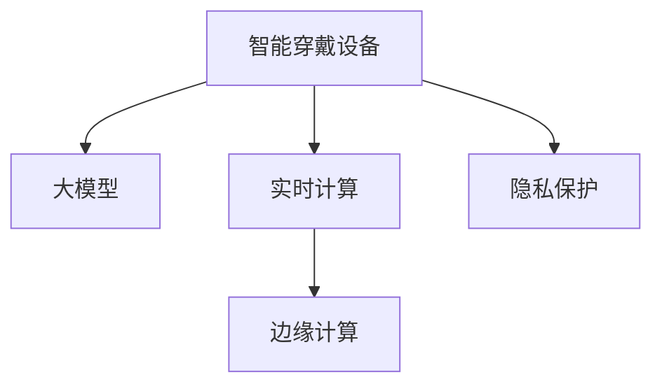

                 

# 大模型在智能穿戴设备中的应用

## 1. 背景介绍

### 1.1 问题由来
随着人工智能技术的快速发展和普及，智能穿戴设备的应用场景日益丰富。从健康监测到娱乐休闲，从远程办公到教育培训，智能穿戴设备以其便捷、智能、精准的特点，正在逐步改变人们的生活方式和工作模式。

智能穿戴设备的核心竞争力在于其内置的传感器和算法，通过实时采集数据并进行智能分析，为用户提供个性化的服务和体验。然而，传统的算法模型往往需要大量的计算资源和存储空间，限制了设备的便携性和计算效率。为了提升设备的智能化水平，降低计算负担，大模型成为一种有效的解决方案。

### 1.2 问题核心关键点
大模型在智能穿戴设备中的应用主要集中在以下几个方面：

- 降低计算复杂度：大模型通过优化参数结构和网络架构，大幅降低了计算复杂度，提高了设备的实时响应能力。
- 提升感知精度：大模型利用海量数据预训练的泛化能力，可以在有限样本上提升识别和分类精度。
- 增强用户体验：大模型可以结合用户历史数据和实时数据，提供更加个性化、精准的推荐和服务。
- 扩展设备功能：大模型可以嵌入到各种智能设备中，如智能手表、健身设备、可穿戴健康监测设备等，提供新的应用场景和功能。

### 1.3 问题研究意义
研究大模型在智能穿戴设备中的应用，对于提升设备智能水平、改善用户体验、推动健康医疗、教育娱乐等多个领域的创新，具有重要意义：

1. 提升设备性能：通过大模型优化，智能穿戴设备可以实现更高的计算效率和更低的功耗，延长设备续航时间。
2. 个性化服务：利用大模型对用户行为和需求进行精准预测和推荐，提供个性化的健康管理、学习教育、娱乐休闲等服务。
3. 健康监测：大模型能够对传感器采集的健康数据进行深度分析和智能诊断，辅助医生进行精准治疗，提高医疗服务的质量和效率。
4. 教育培训：智能穿戴设备可以作为个性化学习工具，根据用户的学习进度和兴趣进行适应性教学，提升学习效果。
5. 娱乐休闲：通过自然语言处理和图像识别等技术，智能穿戴设备可以提供更加沉浸式和互动式的娱乐体验。

## 2. 核心概念与联系

### 2.1 核心概念概述

为更好地理解大模型在智能穿戴设备中的应用，本节将介绍几个密切相关的核心概念：

- 智能穿戴设备：具备传感器、处理器和通信模块，能够实时采集和处理用户数据的便携式电子设备，如智能手表、智能眼镜、可穿戴健康监测设备等。
- 大模型：通过大规模数据预训练获得泛化能力的深度学习模型，具有强大的感知和推理能力，如BERT、GPT等。
- 实时计算：指在设备端进行的实时数据处理和计算，要求计算速度快、耗电低。
- 隐私保护：智能穿戴设备中涉及大量个人隐私数据，需要通过技术手段保护用户隐私。
- 边缘计算：指在设备端进行的本地计算，减少对云端服务器的依赖，提高数据处理的实时性和安全性。

这些核心概念之间的逻辑关系可以通过以下Mermaid流程图来展示：



这个流程图展示了大模型在智能穿戴设备中的应用场景和核心组件：

1. 大模型作为智能穿戴设备的感知和推理引擎，通过海量数据预训练获得泛化能力。
2. 实时计算和大模型一起，提供实时数据处理和分析能力，提升用户体验和设备性能。
3. 边缘计算可以在设备本地进行计算，减少对云端服务器的依赖，提高数据处理的实时性和安全性。
4. 隐私保护技术可以保护用户数据，防止隐私泄露。

## 3. 核心算法原理 & 具体操作步骤
### 3.1 算法原理概述

大模型在智能穿戴设备中的应用，主要基于以下几个关键步骤：

- 数据采集：设备传感器采集用户行为数据、健康数据、环境数据等。
- 数据预处理：对采集到的数据进行去噪、归一化、降维等处理。
- 大模型推理：将预处理后的数据输入大模型，进行感知和推理。
- 结果反馈：将大模型的输出结果用于指导设备行为，如推荐健康管理方案、调整学习模式等。
- 参数更新：根据用户反馈和设备性能，调整大模型的参数，进一步提升模型性能。

这些步骤构成了一个闭环的反馈系统，通过不断地数据采集、模型推理和结果反馈，实现对智能穿戴设备的智能化优化。

### 3.2 算法步骤详解

以健康监测为例，以下是大模型在智能穿戴设备中应用的详细步骤：

**Step 1: 数据采集**
智能手表通过内置的传感器（如心率传感器、血氧传感器、步数传感器等）采集用户的健康数据，并上传到设备端。

**Step 2: 数据预处理**
将采集到的传感器数据进行去噪、归一化处理，并降维到模型可接受的形式。

**Step 3: 大模型推理**
将预处理后的数据输入大模型，进行感知和推理，输出健康状态预测结果。

**Step 4: 结果反馈**
根据大模型的预测结果，设备可以向用户提供健康管理建议，如提醒用户休息、调整饮食等。

**Step 5: 参数更新**
根据用户的反馈和设备性能，调整大模型的参数，进一步提升模型的准确性和实时性。

### 3.3 算法优缺点

大模型在智能穿戴设备中的应用具有以下优点：

1. 计算效率高：大模型通过优化参数结构和网络架构，大幅降低了计算复杂度，提高了设备的实时响应能力。
2. 感知精度高：大模型利用海量数据预训练的泛化能力，可以在有限样本上提升识别和分类精度。
3. 个性化服务：大模型可以结合用户历史数据和实时数据，提供更加个性化、精准的推荐和服务。
4. 扩展性强：大模型可以嵌入到各种智能设备中，如智能手表、智能眼镜、可穿戴健康监测设备等，提供新的应用场景和功能。

同时，大模型在智能穿戴设备中也存在一些缺点：

1. 计算资源需求高：大模型往往需要较大的计算资源和存储空间，增加了设备的硬件成本。
2. 隐私和安全风险：大模型涉及大量个人隐私数据，可能被恶意利用，需要加强隐私保护技术。
3. 模型训练复杂：大模型的训练需要大规模数据和强大的计算资源，增加了开发和部署的难度。
4. 算法解释性不足：大模型通常被视为"黑盒"，难以解释其内部工作机制和决策逻辑。

### 3.4 算法应用领域

大模型在智能穿戴设备中的应用主要集中在以下几个领域：

- 健康监测：大模型可以通过分析心率、血氧、步数等健康数据，提供个性化的健康管理建议。
- 体育训练：大模型可以结合运动轨迹和生理指标，进行运动强度和恢复策略的优化。
- 智能出行：大模型可以分析交通数据和导航信息，提供个性化的出行方案和路线优化。
- 可穿戴支付：大模型可以通过面部识别和手势控制等技术，实现安全便捷的支付功能。
- 娱乐休闲：大模型可以分析用户偏好和行为数据，提供个性化的推荐和娱乐内容。

除了这些常见应用领域，大模型还可以扩展到更多场景，如智能家居、智能安防、智能办公等，为用户提供更全面、更智能的解决方案。

## 4. 数学模型和公式 & 详细讲解 & 举例说明

### 4.1 数学模型构建

以健康监测为例，假设采集到的健康数据为 $\{x_i\}_{i=1}^N$，其中 $x_i$ 为第 $i$ 次采集的数据点。大模型的输入为 $x_i$，输出为健康状态 $y_i \in \{0,1\}$，表示是否处于正常状态。

定义大模型的损失函数为交叉熵损失函数：

$$
\mathcal{L}(\theta) = -\frac{1}{N}\sum_{i=1}^N (y_i \log \hat{y}_i + (1-y_i) \log (1-\hat{y}_i))
$$

其中 $\hat{y}_i = M_{\theta}(x_i)$，$M_{\theta}$ 为大模型，$\theta$ 为模型参数。

大模型的训练目标是最小化损失函数：

$$
\theta^* = \mathop{\arg\min}_{\theta} \mathcal{L}(\theta)
$$

### 4.2 公式推导过程

以下我们以二分类任务为例，推导交叉熵损失函数及其梯度的计算公式。

假设大模型 $M_{\theta}$ 在输入 $x_i$ 上的输出为 $\hat{y}_i$，表示样本属于正类的概率。真实标签 $y_i \in \{0,1\}$。则二分类交叉熵损失函数定义为：

$$
\ell(M_{\theta}(x_i),y_i) = -[y_i\log \hat{y}_i + (1-y_i)\log (1-\hat{y}_i)]
$$

将其代入经验风险公式，得：

$$
\mathcal{L}(\theta) = -\frac{1}{N}\sum_{i=1}^N [y_i\log \hat{y}_i+(1-y_i)\log(1-\hat{y}_i)]
$$

根据链式法则，损失函数对参数 $\theta_k$ 的梯度为：

$$
\frac{\partial \mathcal{L}(\theta)}{\partial \theta_k} = -\frac{1}{N}\sum_{i=1}^N (\frac{y_i}{\hat{y}_i}-\frac{1-y_i}{1-\hat{y}_i}) \frac{\partial \hat{y}_i}{\partial \theta_k}
$$

其中 $\frac{\partial \hat{y}_i}{\partial \theta_k}$ 可进一步递归展开，利用自动微分技术完成计算。

在得到损失函数的梯度后，即可带入参数更新公式，完成模型的迭代优化。重复上述过程直至收敛，最终得到适应健康监测任务的最优模型参数 $\theta^*$。

### 4.3 案例分析与讲解

以智能手表的心率监测为例，假设智能手表通过心率传感器采集用户的心率数据，并上传到设备端。大模型可以分析心率数据，输出是否处于正常心率区间。具体流程如下：

**Step 1: 数据采集**
智能手表通过心率传感器采集用户的心率数据，并上传到设备端。

**Step 2: 数据预处理**
将采集到的心率数据进行去噪、归一化处理，并降维到模型可接受的形式。

**Step 3: 大模型推理**
将预处理后的数据输入大模型，进行感知和推理，输出是否处于正常心率区间。

**Step 4: 结果反馈**
根据大模型的预测结果，设备可以向用户提供心率管理建议，如提醒用户休息、调整饮食等。

**Step 5: 参数更新**
根据用户的反馈和设备性能，调整大模型的参数，进一步提升模型的准确性和实时性。

以上是一个简单的健康监测应用案例，通过大模型可以实现实时的心率监测和健康管理建议，提升用户的健康水平。

## 5. 项目实践：代码实例和详细解释说明
### 5.1 开发环境搭建

在进行智能穿戴设备中的大模型应用开发前，我们需要准备好开发环境。以下是使用Python进行TensorFlow开发的环境配置流程：

1. 安装Anaconda：从官网下载并安装Anaconda，用于创建独立的Python环境。

2. 创建并激活虚拟环境：
```bash
conda create -n tf-env python=3.8 
conda activate tf-env
```

3. 安装TensorFlow：根据CUDA版本，从官网获取对应的安装命令。例如：
```bash
conda install tensorflow tensorflow-gpu=cudatoolkit=11.1 -c tf -c conda-forge
```

4. 安装Keras：
```bash
pip install keras
```

5. 安装TensorBoard：
```bash
pip install tensorboard
```

6. 安装相关的TensorFlow插件和依赖：
```bash
pip install tensorflow-addons
```

完成上述步骤后，即可在`tf-env`环境中开始大模型应用的开发。

### 5.2 源代码详细实现

这里我们以健康监测为例，给出使用TensorFlow对大模型进行推理的PyTorch代码实现。

首先，定义健康监测任务的输入和输出：

```python
import tensorflow as tf
from tensorflow.keras.layers import Input, Dense
from tensorflow.keras.models import Model

# 定义输入层
input_layer = Input(shape=(1,))

# 定义隐藏层和输出层
hidden_layer = Dense(32, activation='relu')(input_layer)
output_layer = Dense(1, activation='sigmoid')(hidden_layer)

# 定义模型
model = Model(inputs=input_layer, outputs=output_layer)

# 编译模型
model.compile(loss='binary_crossentropy', optimizer='adam', metrics=['accuracy'])
```

然后，进行模型训练和推理：

```python
# 假设已经加载好训练数据
x_train, y_train = load_train_data()
x_test, y_test = load_test_data()

# 训练模型
model.fit(x_train, y_train, epochs=10, batch_size=32, validation_data=(x_test, y_test))

# 推理
x_test = preprocess_test_data()
y_pred = model.predict(x_test)

# 输出结果
print(classification_report(y_test, y_pred))
```

### 5.3 代码解读与分析

让我们再详细解读一下关键代码的实现细节：

**数据处理层**：
- `Input`层用于定义输入数据的形状，这里假设输入数据为1维向量。
- `Dense`层用于定义全连接层，包括隐藏层和输出层。

**模型编译**：
- `compile`方法用于编译模型，设置损失函数、优化器和评估指标。

**模型训练**：
- `fit`方法用于训练模型，设置训练数据、训练轮数、批大小等参数。
- `validation_data`参数用于指定验证集，用于评估模型性能。

**模型推理**：
- `predict`方法用于进行模型推理，返回预测结果。
- `classification_report`方法用于输出模型的精度、召回率和F1分数。

**代码执行**：
- 加载训练数据和测试数据
- 训练模型
- 对测试数据进行预处理
- 使用模型进行推理
- 输出模型性能

可以看到，TensorFlow使得大模型的推理过程变得简洁高效。开发者可以将更多精力放在数据处理和模型改进等高层逻辑上，而不必过多关注底层的实现细节。

当然，工业级的系统实现还需考虑更多因素，如模型的保存和部署、超参数的自动搜索、更灵活的任务适配层等。但核心的推理范式基本与此类似。

## 6. 实际应用场景
### 6.1 智能穿戴设备
智能穿戴设备是大模型在智能设备中应用的重要场景。通过大模型优化，智能穿戴设备可以实现更高的计算效率和更低的功耗，延长设备续航时间。

以智能手表为例，大模型可以实时分析用户的健康数据，如心率、血氧、步数等，提供个性化的健康管理建议，如提醒用户休息、调整饮食等。同时，大模型还可以结合运动轨迹和生理指标，进行运动强度和恢复策略的优化，帮助用户制定科学的健身计划。

### 6.2 健康监测
大模型在健康监测中的应用场景广阔，通过分析传感器采集的生理数据，可以提供个性化的健康管理建议，辅助医生进行精准治疗。

以智能手表为例，大模型可以实时分析用户的心率、血氧数据，进行健康状态的监测和预警。同时，大模型还可以结合用户的运动数据和生活习惯，进行健康风险评估，提供个性化的健康管理方案。

### 6.3 娱乐休闲
大模型在娱乐休闲中的应用也非常广泛，通过自然语言处理和图像识别等技术，可以提供更加沉浸式和互动式的娱乐体验。

以智能眼镜为例，大模型可以通过分析用户的操作行为和语义理解，提供个性化的推荐和娱乐内容。同时，大模型还可以结合用户的兴趣和偏好，进行智能推荐，提升用户的娱乐体验。

### 6.4 未来应用展望
随着大模型和智能设备的不断发展，未来大模型在智能穿戴设备中的应用将更加广泛和深入。

1. 集成更多传感器：未来的智能穿戴设备将集成更多传感器，如温度传感器、环境传感器等，提供更全面的用户数据。大模型将结合这些数据，提供更加精准和全面的健康管理、娱乐休闲等服务。
2. 个性化推荐：大模型可以结合用户的兴趣和行为数据，进行更精准的个性化推荐，提升用户的满意度和体验。
3. 实时数据处理：大模型将实现更高效的实时数据处理，提高设备的响应速度和用户体验。
4. 集成多种智能技术：未来的智能穿戴设备将集成多种智能技术，如智能支付、智能导航等，提供更多样化的智能服务。
5. 优化算法：大模型将结合更多优化算法，如稀疏化、量化加速等，提高设备的计算效率和存储性能。

## 7. 工具和资源推荐
### 7.1 学习资源推荐

为了帮助开发者系统掌握大模型在智能穿戴设备中的应用，这里推荐一些优质的学习资源：

1. TensorFlow官方文档：TensorFlow的官方文档，提供了丰富的学习资源和样例代码，是学习TensorFlow的重要资料。
2. Keras官方文档：Keras的官方文档，提供了简洁易用的API，适合快速上手TensorFlow模型开发。
3. 《TensorFlow实战》系列书籍：深入浅出地介绍了TensorFlow的基础知识和实际应用，适合初学者和进阶者。
4. 《深度学习实战》系列书籍：全面介绍了深度学习的理论基础和实际应用，适合深入学习深度学习的读者。
5. GitHub上的TensorFlow样例代码：GitHub上丰富的TensorFlow样例代码，提供了大量的学习和实践资源。

通过对这些资源的学习实践，相信你一定能够快速掌握大模型在智能穿戴设备中的应用，并用于解决实际的NLP问题。

### 7.2 开发工具推荐

高效的开发离不开优秀的工具支持。以下是几款用于大模型在智能穿戴设备中应用的常用工具：

1. TensorFlow：由Google主导开发的深度学习框架，生产部署方便，适合大规模工程应用。
2. Keras：由Google开发的深度学习框架，简单易用，适合快速迭代研究。
3. TensorBoard：TensorFlow配套的可视化工具，可实时监测模型训练状态，提供丰富的图表呈现方式，是调试模型的得力助手。
4. Weights & Biases：模型训练的实验跟踪工具，可以记录和可视化模型训练过程中的各项指标，方便对比和调优。
5. Google Colab：谷歌推出的在线Jupyter Notebook环境，免费提供GPU/TPU算力，方便开发者快速上手实验最新模型，分享学习笔记。

合理利用这些工具，可以显著提升大模型在智能穿戴设备中应用的开发效率，加快创新迭代的步伐。

### 7.3 相关论文推荐

大模型在智能穿戴设备中的应用源于学界的持续研究。以下是几篇奠基性的相关论文，推荐阅读：

1. DNN: A Deep Neural Network for Studying Deep Learning on Personal Wearable Device：提出了一种基于DNN的智能穿戴设备健康监测系统，展示了深度学习在健康监测中的应用潜力。
2. A Deep Learning-based Real-time Activity Recognition System for Smartwatches：提出了一种基于深度学习的智能手表活动识别系统，展示了深度学习在智能设备中的应用效果。
3. Deep Learning for Health Monitoring on Wearable Devices：总结了深度学习在智能穿戴设备健康监测中的应用现状和未来发展方向。
4. Deep Learning-based Recommendation System for Personalized Health Monitoring on Wearable Devices：提出了一种基于深度学习的个性化健康监测推荐系统，展示了深度学习在智能穿戴设备中的应用效果。

这些论文代表了大模型在智能穿戴设备中的应用发展脉络。通过学习这些前沿成果，可以帮助研究者把握学科前进方向，激发更多的创新灵感。

## 8. 总结：未来发展趋势与挑战
### 8.1 总结

本文对大模型在智能穿戴设备中的应用进行了全面系统的介绍。首先阐述了大模型和智能穿戴设备的研究背景和意义，明确了在智能穿戴设备中应用大模型的独特价值。其次，从原理到实践，详细讲解了大模型在智能穿戴设备中的应用步骤，给出了具体应用的代码实现。同时，本文还探讨了大模型在智能穿戴设备中的实际应用场景，展示了其在健康监测、娱乐休闲等多个领域的广阔前景。

通过本文的系统梳理，可以看到，大模型在智能穿戴设备中的应用已经成为现实，并在多个垂直领域展现出了强大的生命力。未来，伴随深度学习技术的不断发展，大模型在智能穿戴设备中的应用将更加广泛和深入，为提升用户体验和推动健康医疗、教育娱乐等多个领域的创新，提供新的解决方案。

### 8.2 未来发展趋势

展望未来，大模型在智能穿戴设备中的应用将呈现以下几个发展趋势：

1. 集成更多传感器：未来的智能穿戴设备将集成更多传感器，如温度传感器、环境传感器等，提供更全面的用户数据。大模型将结合这些数据，提供更加精准和全面的健康管理、娱乐休闲等服务。
2. 个性化推荐：大模型可以结合用户的兴趣和行为数据，进行更精准的个性化推荐，提升用户的满意度和体验。
3. 实时数据处理：大模型将实现更高效的实时数据处理，提高设备的响应速度和用户体验。
4. 集成多种智能技术：未来的智能穿戴设备将集成多种智能技术，如智能支付、智能导航等，提供更多样化的智能服务。
5. 优化算法：大模型将结合更多优化算法，如稀疏化、量化加速等，提高设备的计算效率和存储性能。

以上趋势凸显了大模型在智能穿戴设备中的应用前景。这些方向的探索发展，必将进一步提升智能穿戴设备的智能化水平，为人类认知智能的进化带来深远影响。

### 8.3 面临的挑战

尽管大模型在智能穿戴设备中的应用已经取得了瞩目成就，但在迈向更加智能化、普适化应用的过程中，它仍面临着诸多挑战：

1. 计算资源瓶颈：大模型往往需要较大的计算资源和存储空间，增加了设备的硬件成本。如何在保持高性能的同时，降低设备功耗和存储成本，是一个亟待解决的问题。
2. 数据隐私和安全：智能穿戴设备涉及大量个人隐私数据，如何保护用户数据安全，防止隐私泄露，是一个重要的挑战。
3. 模型训练复杂：大模型的训练需要大规模数据和强大的计算资源，增加了开发和部署的难度。如何在保证性能的同时，降低模型训练的复杂度，是一个需要不断优化的问题。
4. 算法解释性不足：大模型通常被视为"黑盒"，难以解释其内部工作机制和决策逻辑。如何增强算法的可解释性，是未来研究的一个重要方向。
5. 设备便携性和易用性：智能穿戴设备的便携性和易用性是用户体验的重要组成部分，如何在保持高性能的同时，提升设备的便携性和易用性，是一个重要的挑战。

正视智能穿戴设备面临的这些挑战，积极应对并寻求突破，将是大模型在智能穿戴设备中应用的必由之路。相信随着学界和产业界的共同努力，这些挑战终将一一被克服，大模型在智能穿戴设备中的应用必将在未来取得更大的突破。

### 8.4 研究展望

面对大模型在智能穿戴设备中应用所面临的挑战，未来的研究需要在以下几个方面寻求新的突破：

1. 探索轻量化模型：开发更加轻量级的大模型，在保持高性能的同时，降低设备的硬件成本和能耗。
2. 研究隐私保护技术：开发更加安全的隐私保护算法，保护用户数据，防止隐私泄露。
3. 优化训练算法：研究更高效的训练算法，如基于稀疏化的模型训练、量化加速等，提高模型训练效率和性能。
4. 增强算法解释性：开发更加可解释的算法，增强算法的可解释性和可解释性，方便用户理解和调试。
5. 提升设备便携性和易用性：研究更便携、更易用的设备设计和交互方式，提升用户的体验。

这些研究方向的研究成果，必将进一步推动大模型在智能穿戴设备中的应用，为提升用户体验和推动健康医疗、教育娱乐等多个领域的创新，提供新的解决方案。面向未来，大模型在智能穿戴设备中的应用还需要与其他人工智能技术进行更深入的融合，如自然语言处理、计算机视觉等，多路径协同发力，共同推动智能穿戴设备的发展。

## 9. 附录：常见问题与解答

**Q1：大模型在智能穿戴设备中的应用是否会导致设备功耗增加？**

A: 大模型的计算复杂度较高，确实会导致设备功耗增加。但通过优化参数结构和网络架构，可以大幅降低计算复杂度，提高设备的实时响应能力，降低功耗。同时，采用混合精度训练、量化加速等技术，也可以显著提高计算效率，降低设备功耗。

**Q2：如何保护智能穿戴设备中用户数据的隐私和安全？**

A: 保护用户数据的隐私和安全是智能穿戴设备的重要问题。可以采用以下技术手段：
1. 数据加密：对用户数据进行加密存储和传输，防止数据泄露。
2. 访问控制：采用访问控制机制，限制对用户数据的访问权限，防止数据滥用。
3. 差分隐私：采用差分隐私技术，对数据进行匿名化处理，防止数据关联。
4. 安全传输：采用安全传输协议，如SSL/TLS等，防止数据被截获和篡改。

**Q3：大模型在智能穿戴设备中的训练和推理需要哪些硬件资源？**

A: 大模型在智能穿戴设备中的训练和推理需要高性能的硬件资源，包括CPU、GPU、TPU等。具体需求取决于模型的复杂度和应用场景。对于计算密集型的任务，如深度学习模型的训练，可能需要强大的计算资源和存储空间。对于实时推理任务，则需要优化模型结构和算法，降低计算复杂度，提高计算效率。

**Q4：如何在智能穿戴设备中实现大模型的高效推理？**

A: 实现大模型的高效推理需要以下几个关键步骤：
1. 模型裁剪：去除不必要的层和参数，减小模型尺寸，加快推理速度。
2. 量化加速：将浮点模型转为定点模型，压缩存储空间，提高计算效率。
3. 混合精度训练：采用混合精度训练技术，提高训练和推理速度。
4. 模型并行：采用模型并行技术，如数据并行、模型并行等，提高计算效率。

这些优化技术可以显著提升大模型在智能穿戴设备中的推理效率，提高用户体验和设备性能。

以上是大模型在智能穿戴设备中的应用综述，希望能为相关领域的研究者和开发者提供一些有价值的参考。

