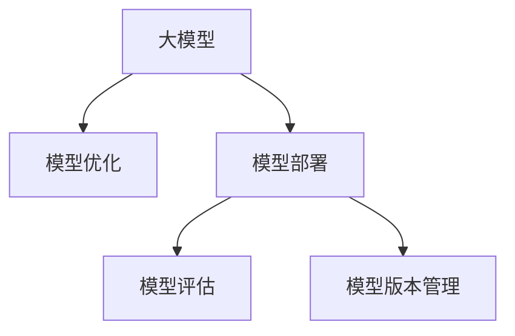

                 

# 大模型应用开发的技术细节

> 关键词：大模型开发,模型部署,模型优化,模型评估,模型版本管理

## 1. 背景介绍

### 1.1 问题由来
随着深度学习技术的不断进步，大模型（Large Models）在各个领域的应用越来越广泛。这些模型通过在海量数据上进行预训练，具备强大的表达能力，能够在各种任务中取得优异表现。然而，将大模型应用于实际应用场景时，仍面临诸多技术难题。本文将从大模型应用开发的技术细节出发，探讨模型开发、部署、优化和评估等关键问题，为读者提供全面的技术指导。

### 1.2 问题核心关键点
大模型应用开发的关键点包括：

- **模型架构设计**：选择合适的模型结构和组件，确保模型高效、可扩展。
- **模型参数优化**：通过正则化、初始化等方法，避免模型过拟合，提高模型泛化能力。
- **模型部署与优化**：在硬件资源受限的情况下，通过量化、剪枝等技术，提高模型部署效率。
- **模型评估与调优**：通过多种评估指标，监控模型性能，优化模型参数和架构。
- **模型版本管理**：通过有效的版本控制和回滚机制，保证模型版本的一致性和稳定性。

这些关键问题在大模型应用开发中扮演着至关重要的角色，需要在实际开发中予以充分考虑和解决。

## 2. 核心概念与联系

### 2.1 核心概念概述

为更好地理解大模型应用开发的技术细节，本节将介绍几个密切相关的核心概念：

- **大模型（Large Model）**：指通过大规模预训练获得的深度学习模型，如BERT、GPT等。这些模型通常具有数十亿个参数，能够处理复杂的数据结构和任务。
- **模型优化（Model Optimization）**：指在大模型基础上，通过正则化、初始化等方法，调整模型参数，提高模型性能。
- **模型部署（Model Deployment）**：指将训练好的模型集成到实际应用中，进行推理和预测。
- **模型评估（Model Evaluation）**：指通过各种评估指标，量化模型的性能，监控模型的运行状态。
- **模型版本管理（Model Version Control）**：指通过版本控制工具，记录和管理模型变更，确保模型版本的稳定性和可追溯性。

这些概念之间的逻辑关系可以通过以下Mermaid流程图来展示：



这个流程图展示了大模型应用开发的关键流程，从模型构建到部署、评估、版本管理，每个环节都相互依赖，共同构成完整的大模型应用开发链。

## 3. 核心算法原理 & 具体操作步骤

### 3.1 算法原理概述

大模型应用开发的核心算法原理主要围绕以下几个方面展开：

- **模型架构设计**：选择合适的模型结构和组件，如卷积神经网络（CNN）、循环神经网络（RNN）、Transformer等，确保模型高效、可扩展。
- **模型参数优化**：通过正则化、初始化等方法，调整模型参数，避免过拟合，提高模型泛化能力。
- **模型部署与优化**：在硬件资源受限的情况下，通过量化、剪枝等技术，提高模型部署效率。
- **模型评估与调优**：通过多种评估指标，量化模型的性能，优化模型参数和架构。
- **模型版本管理**：通过版本控制工具，记录和管理模型变更，确保模型版本的稳定性和可追溯性。

这些原理共同构成了大模型应用开发的基础框架，使大模型能够在各种应用场景中发挥其强大的能力。

### 3.2 算法步骤详解

大模型应用开发的步骤主要包括：

**Step 1: 选择合适的模型结构**
- 根据任务需求，选择合适的模型结构，如卷积神经网络（CNN）、循环神经网络（RNN）、Transformer等。
- 对于图像任务，可以选择ResNet、Inception等经典的CNN结构。
- 对于文本任务，可以选择LSTM、GRU等RNN结构。
- 对于序列生成任务，可以选择Transformer及其变种，如BERT、GPT等。

**Step 2: 初始化模型参数**
- 使用随机初始化或预训练模型初始化，初始化方法应兼顾参数的分布和变异性，避免初始化过程对模型性能的影响。

**Step 3: 模型优化**
- 通过正则化、初始化等方法，调整模型参数，避免过拟合，提高模型泛化能力。
- 常用的正则化方法包括L2正则、Dropout等。
- 常用的初始化方法包括Xavier、He等。

**Step 4: 模型训练与评估**
- 使用训练数据集，对模型进行多次迭代训练，更新模型参数，减小损失函数。
- 使用验证数据集，评估模型性能，调整超参数。
- 常用的评估指标包括准确率、召回率、F1分数等。

**Step 5: 模型部署与优化**
- 将训练好的模型集成到实际应用中，进行推理和预测。
- 使用量化、剪枝等技术，提高模型部署效率。
- 常用的量化方法包括权重剪枝、通道剪枝等。

**Step 6: 模型版本管理**
- 使用版本控制工具，记录和管理模型变更，确保模型版本的稳定性和可追溯性。
- 常用的版本控制工具包括Git、SVN等。

以上是基于监督学习的大模型应用开发的一般流程。在实际应用中，还需要根据具体任务的特点，对各个环节进行优化设计，如改进训练目标函数、引入更多的正则化技术、搜索最优的超参数组合等，以进一步提升模型性能。

### 3.3 算法优缺点

大模型应用开发的方法具有以下优点：

1. **高泛化能力**：通过大规模预训练，大模型能够学习到丰富的语言或视觉知识，适用于多种下游任务。
2. **高效性**：使用预训练模型作为初始化参数，减少了从头训练模型的时间和成本。
3. **可扩展性**：模型结构灵活，可以根据任务需求进行调整和扩展。
4. **鲁棒性**：预训练模型经过大量数据训练，具备较强的鲁棒性，能够抵抗数据分布的偏移。

同时，该方法也存在一定的局限性：

1. **资源消耗大**：大模型通常具有庞大的参数量和计算需求，需要高性能的硬件设备支持。
2. **训练时间长**：大模型训练通常需要长时间的高性能计算资源。
3. **模型复杂性**：大模型结构复杂，调试和维护成本较高。
4. **可解释性不足**：黑盒模型难以解释其内部工作机制，难以理解和调试模型。

尽管存在这些局限性，但就目前而言，基于大模型的应用开发方法仍是大规模深度学习应用的主流范式。未来相关研究的重点在于如何进一步降低资源消耗，提高模型训练和部署效率，同时兼顾可解释性和伦理安全性等因素。

### 3.4 算法应用领域

基于大模型应用开发的方法在各个领域都有广泛应用，如：

- **计算机视觉**：图像分类、目标检测、图像生成等任务。
- **自然语言处理**：文本分类、情感分析、机器翻译、对话系统等任务。
- **语音识别**：语音识别、语音合成、语音情感分析等任务。
- **推荐系统**：商品推荐、用户画像、广告推荐等任务。
- **金融分析**：股票预测、信用评分、欺诈检测等任务。
- **医疗诊断**：疾病诊断、病理分析、基因分析等任务。

除了这些经典应用外，大模型还被创新性地应用到更多场景中，如可控文本生成、常识推理、代码生成、数据增强等，为各行各业带来了新的技术突破。随着大模型的不断发展和微调方法的进步，相信其在更多领域的应用前景将更加广阔。

## 4. 数学模型和公式 & 详细讲解  
### 4.1 数学模型构建

本节将使用数学语言对大模型应用开发的过程进行更加严格的刻画。

记大模型为 $M_{\theta}$，其中 $\theta$ 为模型参数。假设训练数据集为 $D=\{(x_i,y_i)\}_{i=1}^N$，其中 $x_i \in \mathcal{X}$，$y_i \in \mathcal{Y}$。定义模型 $M_{\theta}$ 在数据样本 $(x,y)$ 上的损失函数为 $\ell(M_{\theta}(x),y)$，则在数据集 $D$ 上的经验风险为：

$$
\mathcal{L}(\theta) = \frac{1}{N} \sum_{i=1}^N \ell(M_{\theta}(x_i),y_i)
$$

优化目标是最小化经验风险，即找到最优参数：

$$
\theta^* = \mathop{\arg\min}_{\theta} \mathcal{L}(\theta)
$$

在实践中，我们通常使用基于梯度的优化算法（如SGD、Adam等）来近似求解上述最优化问题。设 $\eta$ 为学习率，则参数的更新公式为：

$$
\theta \leftarrow \theta - \eta \nabla_{\theta}\mathcal{L}(\theta)
$$

其中 $\nabla_{\theta}\mathcal{L}(\theta)$ 为损失函数对参数 $\theta$ 的梯度，可通过反向传播算法高效计算。

### 4.2 公式推导过程

以下我们以二分类任务为例，推导交叉熵损失函数及其梯度的计算公式。

假设模型 $M_{\theta}$ 在输入 $x$ 上的输出为 $\hat{y}=M_{\theta}(x) \in [0,1]$，表示样本属于正类的概率。真实标签 $y \in \{0,1\}$。则二分类交叉熵损失函数定义为：

$$
\ell(M_{\theta}(x),y) = -[y\log \hat{y} + (1-y)\log (1-\hat{y})]
$$

将其代入经验风险公式，得：

$$
\mathcal{L}(\theta) = -\frac{1}{N}\sum_{i=1}^N [y_i\log M_{\theta}(x_i)+(1-y_i)\log(1-M_{\theta}(x_i))]
$$

根据链式法则，损失函数对参数 $\theta_k$ 的梯度为：

$$
\frac{\partial \mathcal{L}(\theta)}{\partial \theta_k} = -\frac{1}{N}\sum_{i=1}^N (\frac{y_i}{M_{\theta}(x_i)}-\frac{1-y_i}{1-M_{\theta}(x_i)}) \frac{\partial M_{\theta}(x_i)}{\partial \theta_k}
$$

其中 $\frac{\partial M_{\theta}(x_i)}{\partial \theta_k}$ 可进一步递归展开，利用自动微分技术完成计算。

在得到损失函数的梯度后，即可带入参数更新公式，完成模型的迭代优化。重复上述过程直至收敛，最终得到适应下游任务的最优模型参数 $\theta^*$。

## 5. 项目实践：代码实例和详细解释说明
### 5.1 开发环境搭建

在进行模型开发前，我们需要准备好开发环境。以下是使用Python进行TensorFlow开发的环境配置流程：

1. 安装Anaconda：从官网下载并安装Anaconda，用于创建独立的Python环境。

2. 创建并激活虚拟环境：
```bash
conda create -n tf-env python=3.8 
conda activate tf-env
```

3. 安装TensorFlow：根据CUDA版本，从官网获取对应的安装命令。例如：
```bash
conda install tensorflow==2.6 -c tf -c conda-forge
```

4. 安装各类工具包：
```bash
pip install numpy pandas scikit-learn matplotlib tqdm jupyter notebook ipython
```

完成上述步骤后，即可在`tf-env`环境中开始模型开发。

### 5.2 源代码详细实现

下面我们以图像分类任务为例，给出使用TensorFlow实现卷积神经网络（CNN）的代码实现。

首先，定义CNN的模型架构：

```python
import tensorflow as tf
from tensorflow.keras.layers import Conv2D, MaxPooling2D, Flatten, Dense

model = tf.keras.Sequential([
    Conv2D(32, 3, activation='relu', input_shape=(224, 224, 3)),
    MaxPooling2D(),
    Flatten(),
    Dense(64, activation='relu'),
    Dense(10, activation='softmax')
])
```

然后，定义优化器和损失函数：

```python
optimizer = tf.keras.optimizers.Adam(learning_rate=0.001)
loss_fn = tf.keras.losses.SparseCategoricalCrossentropy(from_logits=True)
```

接着，定义训练和评估函数：

```python
def train_epoch(model, dataset, batch_size, optimizer):
    model.train()
    for batch in dataset:
        input_images = batch[0]
        target_labels = batch[1]
        with tf.GradientTape() as tape:
            predictions = model(input_images)
            loss = loss_fn(target_labels, predictions)
        gradients = tape.gradient(loss, model.trainable_variables)
        optimizer.apply_gradients(zip(gradients, model.trainable_variables))
    return loss

def evaluate(model, dataset, batch_size):
    model.eval()
    losses = []
    correct_predictions = []
    for batch in dataset:
        input_images = batch[0]
        target_labels = batch[1]
        predictions = model(input_images)
        loss = loss_fn(target_labels, predictions)
        losses.append(loss.numpy())
        predictions = tf.argmax(predictions, axis=1)
        correct_predictions.append(tf.reduce_sum(tf.cast(target_labels == predictions, dtype=tf.float32)))
    return tf.reduce_mean(losses), tf.reduce_mean(correct_predictions) / len(dataset)
```

最后，启动训练流程并在测试集上评估：

```python
epochs = 10
batch_size = 32

for epoch in range(epochs):
    train_loss, train_acc = train_epoch(model, train_dataset, batch_size, optimizer)
    test_loss, test_acc = evaluate(model, test_dataset, batch_size)
    print(f'Epoch {epoch+1}, train loss: {train_loss:.3f}, train accuracy: {train_acc:.3f}, test loss: {test_loss:.3f}, test accuracy: {test_acc:.3f}')
    
print('Final test accuracy:', test_acc.numpy())
```

以上就是使用TensorFlow对CNN模型进行图像分类任务开发的完整代码实现。可以看到，TensorFlow提供了丰富的API和组件，使得模型开发变得更加简洁高效。

### 5.3 代码解读与分析

让我们再详细解读一下关键代码的实现细节：

**Sequential类**：
- `Sequential`类：用于构建序列模型，逐层堆叠模型组件。

**卷积层（Conv2D）**：
- `Conv2D`类：用于定义卷积层，指定卷积核大小、数量、激活函数等参数。

**池化层（MaxPooling2D）**：
- `MaxPooling2D`类：用于定义池化层，减少特征图的空间尺寸，提高模型的计算效率。

**全连接层（Dense）**：
- `Dense`类：用于定义全连接层，将卷积层的特征图展平，送入全连接层进行分类。

**优化器（Adam）**：
- `Adam`类：定义了Adam优化器，自适应调整学习率。

**损失函数（SparseCategoricalCrossentropy）**：
- `SparseCategoricalCrossentropy`类：定义了稀疏分类的交叉熵损失函数，用于衡量模型预测结果与真实标签的差异。

**训练函数**：
- 使用`GradientTape`记录梯度，调用`apply_gradients`更新模型参数。

**评估函数**：
- 在测试集上计算损失和准确率，返回平均值。

在训练过程中，通过计算损失和准确率来监控模型的性能。在测试集上，通过计算损失和准确率来评估模型的泛化能力。

**训练流程**：
- 设置总epoch数和batch size，开始循环迭代。
- 每个epoch内，先训练，后评估。
- 打印epoch的训练损失和准确率、测试损失和准确率。
- 在所有epoch结束后，打印最终测试准确率。

可以看到，TensorFlow提供的丰富API和组件，使得模型开发变得更加便捷高效。开发者可以专注于模型的设计和优化，而不需要过多关注底层的实现细节。

当然，工业级的系统实现还需考虑更多因素，如模型的保存和部署、超参数的自动搜索、更灵活的任务适配层等。但核心的模型开发流程基本与此类似。

## 6. 实际应用场景
### 6.1 智能推荐系统

智能推荐系统是当前互联网应用中最为常见的场景之一，能够极大地提升用户体验和平台价值。基于深度学习模型的推荐系统，通过分析用户的历史行为数据，预测用户可能感兴趣的商品或内容，实现个性化推荐。

在实际应用中，可以收集用户的浏览、点击、评价等行为数据，提取和商品或内容相关的文本信息。将文本信息作为模型输入，用户的后续行为（如是否点击、购买等）作为监督信号，在此基础上微调预训练语言模型。微调后的模型能够从文本内容中准确把握用户的兴趣点。在生成推荐列表时，先用候选商品或内容的文本描述作为输入，由模型预测用户的兴趣匹配度，再结合其他特征综合排序，便可以得到个性化程度更高的推荐结果。

### 6.2 医疗影像诊断

医疗影像诊断是深度学习在医疗领域的重要应用之一。传统的医疗影像诊断依赖于放射科医生的经验和判断，而基于深度学习的影像诊断系统，通过分析医学影像数据，能够提供准确的疾病诊断结果。

在实际应用中，可以收集大量的医学影像数据，通过标注数据对预训练模型进行微调，使其能够识别出病变区域并给出诊断结果。例如，使用卷积神经网络对医学影像进行分类，通过微调模型，使其能够准确识别出不同类型的疾病。

### 6.3 金融风险预测

金融风险预测是深度学习在金融领域的重要应用之一。通过分析大量的金融数据，构建风险预测模型，能够有效防范金融风险。

在实际应用中，可以收集金融市场的历史数据、新闻、社交媒体等文本数据，通过标注数据对预训练模型进行微调，使其能够预测市场的走势和风险。例如，使用RNN对金融数据进行序列建模，通过微调模型，使其能够准确预测股票的价格波动和市场风险。

### 6.4 未来应用展望

随着深度学习技术的不断发展，大模型应用开发的技术也将不断演进，展现出更加广阔的应用前景：

1. **跨模态学习**：将文本、图像、语音等多模态数据进行融合，构建跨模态模型，提升模型的泛化能力和表达能力。
2. **无监督学习**：通过无监督学习，利用未标注数据进行模型预训练，提高模型的泛化能力和鲁棒性。
3. **强化学习**：结合强化学习技术，训练模型在复杂环境下进行决策和控制，提升模型的智能水平。
4. **小样本学习**：通过小样本学习方法，在有限的标注数据下进行模型训练和优化，提高模型的泛化能力和鲁棒性。
5. **可解释性**：通过模型解释技术，使模型输出具备可解释性，增强模型的可信度和可靠性。

以上趋势凸显了大模型应用开发的广阔前景。这些方向的探索发展，必将进一步提升模型的性能和应用范围，为各行业带来新的技术突破。

## 7. 工具和资源推荐
### 7.1 学习资源推荐

为了帮助开发者系统掌握大模型应用开发的技术细节，这里推荐一些优质的学习资源：

1. **《深度学习》课程**：斯坦福大学开设的深度学习课程，涵盖深度学习的基础理论、算法和应用。

2. **《TensorFlow实战》书籍**：TensorFlow官方文档，提供了丰富的API和组件，是TensorFlow应用的必备资源。

3. **《深度学习框架实战》书籍**：介绍常用深度学习框架如PyTorch、TensorFlow、Keras等的使用方法和技巧。

4. **《深度学习理论与实践》书籍**：介绍深度学习的理论和实践，适合初学者和进阶者阅读。

5. **Kaggle竞赛平台**：Kaggle是全球最大的数据科学竞赛平台，提供了大量的数据集和模型竞赛，可以用于实战练习。

通过对这些资源的学习实践，相信你一定能够快速掌握大模型应用开发的技术细节，并用于解决实际的深度学习问题。

### 7.2 开发工具推荐

高效的开发离不开优秀的工具支持。以下是几款用于大模型应用开发的常用工具：

1. **TensorFlow**：由Google主导开发的深度学习框架，提供丰富的API和组件，支持分布式计算和模型部署。

2. **PyTorch**：由Facebook主导开发的深度学习框架，灵活性高，易于使用。

3. **Keras**：高层次的深度学习API，提供简单易用的接口，适合初学者入门。

4. **TensorBoard**：TensorFlow配套的可视化工具，可以实时监测模型训练状态，提供丰富的图表呈现方式。

5. **Weights & Biases**：模型训练的实验跟踪工具，可以记录和可视化模型训练过程中的各项指标，方便对比和调优。

6. **Jupyter Notebook**：交互式的Python开发环境，支持代码执行和结果展示，方便模型开发和调试。

合理利用这些工具，可以显著提升大模型应用开发的效率，加快创新迭代的步伐。

### 7.3 相关论文推荐

大模型应用开发的技术细节涉及多个学科领域，需要借鉴各个学科的研究成果。以下是几篇奠基性的相关论文，推荐阅读：

1. **《ImageNet Classification with Deep Convolutional Neural Networks》**：提出卷积神经网络用于图像分类任务，开启了计算机视觉领域的深度学习热潮。

2. **《Visualizing and Understanding Convolutional Networks》**：介绍卷积神经网络的可视化方法，帮助理解模型的特征表示。

3. **《Attention is All You Need》**：提出Transformer结构，引入自注意力机制，使得大模型在自然语言处理任务中取得显著进展。

4. **《Towards More Reliable Image Recognition with Attention》**：提出注意力机制的应用，提高图像识别的准确性和鲁棒性。

5. **《BERT: Pre-training of Deep Bidirectional Transformers for Language Understanding》**：提出BERT模型，利用掩码自监督任务进行预训练，取得多项NLP任务的最先进性能。

6. **《Regularizing Deep Neural Networks with Adversarial Examples》**：介绍对抗训练方法，提高模型的鲁棒性和泛化能力。

这些论文代表了大模型应用开发技术的发展脉络，通过学习这些前沿成果，可以帮助研究者把握学科前进方向，激发更多的创新灵感。

## 8. 总结：未来发展趋势与挑战

### 8.1 总结

本文对大模型应用开发的技术细节进行了全面系统的介绍。首先，从大模型架构设计、模型优化、模型部署、模型评估和模型版本管理等方面，详细阐述了模型开发的全流程。其次，通过数学模型构建和公式推导，进一步剖析了模型训练和评估的原理。最后，结合实际应用场景，讨论了模型的未来发展趋势和面临的挑战。

通过本文的系统梳理，可以看到，大模型应用开发技术正逐渐成熟，广泛应用于各个领域，推动了深度学习技术的普及和应用。未来，随着技术的不断发展，大模型将在大数据、高维度、复杂场景中发挥更大的作用，成为人工智能技术的重要基石。

### 8.2 未来发展趋势

展望未来，大模型应用开发技术将呈现以下几个发展趋势：

1. **跨模态学习**：将文本、图像、语音等多模态数据进行融合，构建跨模态模型，提升模型的泛化能力和表达能力。
2. **无监督学习**：通过无监督学习，利用未标注数据进行模型预训练，提高模型的泛化能力和鲁棒性。
3. **强化学习**：结合强化学习技术，训练模型在复杂环境下进行决策和控制，提升模型的智能水平。
4. **小样本学习**：通过小样本学习方法，在有限的标注数据下进行模型训练和优化，提高模型的泛化能力和鲁棒性。
5. **可解释性**：通过模型解释技术，使模型输出具备可解释性，增强模型的可信度和可靠性。

以上趋势凸显了大模型应用开发的广阔前景。这些方向的探索发展，必将进一步提升模型的性能和应用范围，为各行业带来新的技术突破。

### 8.3 面临的挑战

尽管大模型应用开发技术已经取得了显著进展，但在实际应用中，仍面临诸多挑战：

1. **数据隐私和安全**：深度学习模型需要大量的标注数据进行训练，如何保护用户隐私和数据安全，是一个亟待解决的问题。
2. **计算资源限制**：大模型通常具有庞大的参数量和计算需求，需要高性能的硬件设备支持，这在一定程度上限制了模型的应用场景。
3. **模型可解释性不足**：深度学习模型通常被视为"黑盒"系统，难以解释其内部工作机制，难以理解和调试模型。
4. **模型鲁棒性不足**：深度学习模型面对输入数据的微小扰动，往往容易发生泛化性能下降的问题。

尽管存在这些挑战，但随着技术的不断发展，这些挑战终将一一被克服，大模型应用开发技术必将在未来的智能化浪潮中发挥重要作用。

### 8.4 研究展望

面对大模型应用开发技术所面临的挑战，未来的研究需要在以下几个方面寻求新的突破：

1. **数据隐私保护**：研究如何在保证模型性能的前提下，保护用户隐私和数据安全。
2. **模型压缩和量化**：通过模型压缩和量化技术，减小模型的参数量和计算需求，提高模型的部署效率。
3. **模型解释和可视化**：研究如何通过模型解释和可视化技术，使模型输出具备可解释性，增强模型的可信度和可靠性。
4. **鲁棒性增强**：研究如何通过对抗训练、鲁棒优化等技术，提高模型的鲁棒性和泛化能力。
5. **跨模态学习**：研究如何通过跨模态学习，提升模型在不同模态数据下的表现能力。

这些研究方向的探索，必将引领大模型应用开发技术迈向更高的台阶，为构建安全、可靠、可解释、可控的智能系统铺平道路。面向未来，大模型应用开发技术还需要与其他人工智能技术进行更深入的融合，如知识表示、因果推理、强化学习等，多路径协同发力，共同推动自然语言理解和智能交互系统的进步。只有勇于创新、敢于突破，才能不断拓展大模型的边界，让智能技术更好地造福人类社会。

## 9. 附录：常见问题与解答

**Q1：大模型应用开发的主要难点是什么？**

A: 大模型应用开发的主要难点包括：

1. **数据获取和标注**：深度学习模型需要大量的标注数据进行训练，如何获取高质量的标注数据是一个难题。
2. **模型训练和优化**：大模型通常具有庞大的参数量和计算需求，训练过程耗时且易过拟合。
3. **模型部署和优化**：如何将训练好的模型高效部署到实际应用中，并进行优化，是一个挑战。
4. **模型解释和可视化**：大模型的决策过程难以解释，难以理解和调试。

这些难点需要开发者在模型设计、训练、部署等多个环节进行全面优化，才能充分发挥大模型的潜力。

**Q2：如何在有限的标注数据下进行模型训练？**

A: 在有限的标注数据下，可以使用以下方法进行模型训练：

1. **数据增强**：通过数据增强技术，扩充训练集样本数量，提高模型的泛化能力。
2. **迁移学习**：利用预训练模型的知识，在小规模数据上进行微调，提高模型的泛化能力。
3. **对抗训练**：通过对抗样本训练，提高模型的鲁棒性和泛化能力。
4. **半监督学习**：利用未标注数据进行模型训练，提高模型的泛化能力。

这些方法可以结合使用，在有限的标注数据下进行高效的模型训练。

**Q3：如何评估大模型的性能？**

A: 大模型的性能评估可以从以下几个方面进行：

1. **准确率（Accuracy）**：衡量模型预测结果与真实标签的差异。
2. **召回率（Recall）**：衡量模型预测的正例中，实际为正例的比例。
3. **F1分数（F1 Score）**：综合考虑准确率和召回率，衡量模型的整体性能。
4. **ROC曲线（ROC Curve）**：通过绘制ROC曲线，评估模型的分类性能。
5. **混淆矩阵（Confusion Matrix）**：通过混淆矩阵，直观展示模型预测结果与真实标签的分布情况。

这些评估指标可以帮助开发者全面监控模型的性能，及时发现和解决模型问题。

**Q4：大模型应用开发的技术难点如何应对？**

A: 大模型应用开发的技术难点可以通过以下方法应对：

1. **数据增强**：通过数据增强技术，扩充训练集样本数量，提高模型的泛化能力。
2. **迁移学习**：利用预训练模型的知识，在小规模数据上进行微调，提高模型的泛化能力。
3. **对抗训练**：通过对抗样本训练，提高模型的鲁棒性和泛化能力。
4. **模型压缩和量化**：通过模型压缩和量化技术，减小模型的参数量和计算需求，提高模型的部署效率。
5. **模型解释和可视化**：通过模型解释和可视化技术，使模型输出具备可解释性，增强模型的可信度和可靠性。

这些方法可以结合使用，在实际应用中应对大模型应用开发的诸多技术难点。

**Q5：如何在工业级系统中部署大模型？**

A: 在工业级系统中部署大模型，可以采用以下方法：

1. **模型裁剪和量化**：通过模型裁剪和量化技术，减小模型的参数量和计算需求，提高模型的部署效率。
2. **分布式计算**：利用分布式计算框架，将模型并行化，提高计算效率。
3. **GPU加速**：使用GPU等高性能设备，提高计算速度。
4. **模型压缩和存储优化**：通过模型压缩和存储优化技术，减小模型的大小，提高存储效率。
5. **版本控制和回滚机制**：通过版本控制工具，记录和管理模型变更，确保模型版本的稳定性和可追溯性。

合理利用这些方法，可以显著提高大模型在工业级系统中的部署效率和性能。

---

作者：禅与计算机程序设计艺术 / Zen and the Art of Computer Programming

