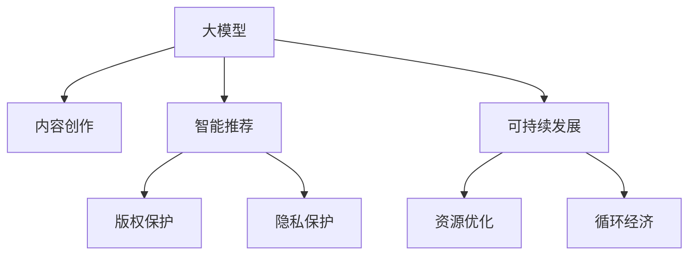

                 

# 大模型时代下的新型文化创意产业

> 关键词：大模型,文化创意产业,艺术创作,智能推荐,内容生成,版权保护,隐私保护,可持续性

## 1. 背景介绍

### 1.1 问题由来
随着大模型技术的迅猛发展，其在文化创意产业的应用也日益广泛。从文学创作、艺术创作、内容推荐，到版权保护、隐私保护、可持续发展等各个方面，大模型都展现出了其强大的潜力。然而，尽管这些技术带来了诸多便利，同时也引发了关于内容真实性、版权归属、隐私保护等伦理和法律问题。如何在大模型时代下，实现文化创意产业的可持续发展和繁荣，成为一个亟待解答的课题。

### 1.2 问题核心关键点
本节将简要介绍大模型在文化创意产业中的几个关键应用点：

- **内容创作**：使用大模型生成新的文本、图像、音乐等内容，提供源源不断的创作灵感。
- **智能推荐**：根据用户偏好和历史行为，推荐个性化的文化产品，提升用户体验。
- **版权保护**：通过大模型进行版权审核和维权，识别并防范侵权行为。
- **隐私保护**：确保数据隐私和安全，防范数据滥用和信息泄露。
- **可持续发展**：大模型帮助优化资源配置，降低文化创意产业的碳排放。

这些应用不仅推动了文化创意产业的技术革新，也对其商业模式和产业结构产生了深远影响。

### 1.3 问题研究意义
大模型在文化创意产业中的应用，不仅能够提高工作效率，还能创作出更多具有原创性和多样性的作品，促进产业的创新和升级。

1. **提高创作效率**：大模型能够快速生成各种文本、图像、音乐等内容，节省创作人员的时间和精力。
2. **提升内容质量**：大模型在自然语言处理和图像生成等方面的深度学习能力，使创作出的内容更具有艺术性和感染力。
3. **拓展市场边界**：大模型的智能推荐功能，可以发现和开拓新的市场细分，拓展文化创意产品的受众范围。
4. **强化版权保护**：通过大模型的版权审核技术，可以有效防范侵权行为，保护创作者的合法权益。
5. **增强隐私保护**：利用大模型的隐私保护技术，确保用户数据的隐私安全，增强用户对平台的信任。
6. **支持可持续发展**：通过优化资源配置，减少碳排放，实现文化创意产业的绿色转型。

总之，大模型技术为文化创意产业带来了新的机遇，也为应对未来的挑战提供了新的方法。

## 2. 核心概念与联系

### 2.1 核心概念概述

为更好地理解大模型在文化创意产业中的作用，本节将介绍几个核心概念：

- **大模型**：基于深度学习技术训练的大型模型，具有强大的数据处理能力和泛化能力。
- **文化创意产业**：涉及文化、艺术、设计、娱乐等多个领域的产业，包括内容创作、版权保护、智能推荐等环节。
- **版权保护**：通过法律和技术手段，确保创作者对其作品拥有独占权，防止未经授权的复制、发布等行为。
- **隐私保护**：保护用户数据隐私，防范数据滥用和信息泄露，确保用户数据安全。
- **可持续发展**：通过优化资源配置和循环经济模式，实现文化创意产业的绿色转型，降低环境影响。

这些概念之间的关系可以通过以下Mermaid流程图来展示：



这个流程图展示了：

1. 大模型在内容创作、智能推荐、版权保护、隐私保护、可持续发展等多个环节的应用。
2. 这些应用通过优化资源配置和循环经济模式，支持文化创意产业的绿色转型。

## 3. 核心算法原理 & 具体操作步骤
### 3.1 算法原理概述

大模型在文化创意产业中的应用，本质上是利用其强大的泛化能力和学习机制，在多个领域实现自动化的优化和创新。

以内容创作为例，大模型可以通过生成对抗网络(GAN)、变分自编码器(VAE)等技术，生成新的文本、图像、音乐等内容，提升创作效率和作品质量。而在版权保护、隐私保护和可持续发展方面，大模型则可以通过检测、识别和优化技术，帮助识别和防范侵权行为，确保数据隐私和安全，优化资源配置，实现绿色转型。

### 3.2 算法步骤详解

以智能推荐系统为例，其基本步骤包括：

**Step 1: 准备数据集**
- 收集用户的历史行为数据，如浏览记录、评分数据、交互历史等。
- 收集文化产品库中的元数据，如作者、发布时间、类别等信息。

**Step 2: 选择模型和超参数**
- 选择合适的推荐模型，如基于内容的推荐、协同过滤、矩阵分解等。
- 设置模型的超参数，如学习率、正则化系数、迭代次数等。

**Step 3: 训练和优化**
- 使用准备的数据集，对推荐模型进行训练。
- 通过交叉验证等技术，优化模型参数，提高推荐精度。

**Step 4: 部署和评估**
- 将训练好的推荐模型部署到线上环境。
- 通过A/B测试等方法，评估模型的效果，持续优化推荐策略。

### 3.3 算法优缺点

大模型在文化创意产业中的应用，具有以下优点：

1. **提高效率**：大模型可以自动化处理大量数据，提升内容创作、版权审核、智能推荐等环节的工作效率。
2. **增强质量**：大模型生成的内容具有更高的质量和多样性，满足不同用户的需求。
3. **优化资源**：通过优化资源配置，实现文化创意产业的可持续发展。

同时，也存在一些缺点：

1. **过拟合风险**：大模型在特定数据集上训练过度，可能导致泛化能力下降。
2. **数据隐私**：大量数据的收集和使用，可能带来隐私风险。
3. **技术门槛高**：使用大模型需要较高的技术门槛，对中小企业来说可能存在门槛。
4. **伦理问题**：大模型的使用可能引发版权争议和伦理问题。

### 3.4 算法应用领域

大模型在文化创意产业的应用领域非常广泛，包括但不限于以下几个方面：

- **内容创作**：文本创作、图像生成、音乐创作等。
- **智能推荐**：个性化推荐、广告投放等。
- **版权保护**：版权审核、维权、反盗版等。
- **隐私保护**：数据加密、隐私计算、隐私保护技术等。
- **可持续发展**：资源优化、绿色转型、循环经济等。

这些应用领域不仅推动了文化创意产业的创新和升级，也为其未来发展提供了新的方向。

## 4. 数学模型和公式 & 详细讲解 & 举例说明

### 4.1 数学模型构建

本节将使用数学语言对大模型在文化创意产业中的应用进行更加严格的刻画。

假设有一个大模型 $M$，用于处理文本数据，其输入为文本 $x$，输出为文本 $y$。假设模型 $M$ 的参数为 $\theta$，通过训练数据集 $\{(x_i, y_i)\}_{i=1}^N$ 进行训练，目标是使模型输出 $y$ 尽可能接近真实标签 $y_i$。

定义模型 $M$ 在数据样本 $(x,y)$ 上的损失函数为 $\ell(M(x),y)$，则在数据集 $D$ 上的经验风险为：

$$
\mathcal{L}(\theta) = \frac{1}{N} \sum_{i=1}^N \ell(M(x_i),y_i)
$$

通过梯度下降等优化算法，微调过程不断更新模型参数 $\theta$，最小化损失函数 $\mathcal{L}$，使得模型输出逼近真实标签。

### 4.2 公式推导过程

以下我们以智能推荐系统为例，推导基于协同过滤的推荐模型公式及其梯度的计算公式。

假设模型 $M$ 在输入 $x$ 上的输出为 $\hat{y}=M(x) \in [0,1]$，表示样本属于正类的概率。真实标签 $y \in \{0,1\}$。则二分类交叉熵损失函数定义为：

$$
\ell(M_{\theta}(x),y) = -[y\log \hat{y} + (1-y)\log (1-\hat{y})]
$$

将其代入经验风险公式，得：

$$
\mathcal{L}(\theta) = -\frac{1}{N}\sum_{i=1}^N [y_i\log M_{\theta}(x_i)+(1-y_i)\log(1-M_{\theta}(x_i))]
$$

根据链式法则，损失函数对参数 $\theta_k$ 的梯度为：

$$
\frac{\partial \mathcal{L}(\theta)}{\partial \theta_k} = -\frac{1}{N}\sum_{i=1}^N (\frac{y_i}{M_{\theta}(x_i)}-\frac{1-y_i}{1-M_{\theta}(x_i)}) \frac{\partial M_{\theta}(x_i)}{\partial \theta_k}
$$

其中 $\frac{\partial M_{\theta}(x_i)}{\partial \theta_k}$ 可进一步递归展开，利用自动微分技术完成计算。

在得到损失函数的梯度后，即可带入参数更新公式，完成模型的迭代优化。重复上述过程直至收敛，最终得到适应下游任务的最优模型参数 $\theta^*$。

### 4.3 案例分析与讲解

以智能推荐系统为例，假设我们有一个包含10万用户的在线音乐平台，每个用户都有500首已听过的歌曲。我们的目标是为每个用户推荐5首他们可能喜欢的新歌曲。

首先，我们需要收集用户的历史听歌记录，并将其编码成向量化形式。然后，使用协同过滤算法，对用户和歌曲之间的关系进行建模。协同过滤算法通过计算用户和歌曲之间的相似度，预测用户可能喜欢的新歌曲。

在训练阶段，我们将用户-歌曲的评分矩阵作为输入，使用神经网络模型进行训练，最小化预测评分与真实评分之间的差异。在测试阶段，我们将用户的新歌曲作为输入，通过神经网络模型预测其可能喜欢的歌曲，并按照概率排序推荐。

这个案例展示了大模型在智能推荐系统中的应用，通过协同过滤算法和神经网络模型，实现了高效准确的推荐。

## 5. 项目实践：代码实例和详细解释说明
### 5.1 开发环境搭建

在进行智能推荐系统开发前，我们需要准备好开发环境。以下是使用Python进行PyTorch开发的环境配置流程：

1. 安装Anaconda：从官网下载并安装Anaconda，用于创建独立的Python环境。

2. 创建并激活虚拟环境：
```bash
conda create -n recsys-env python=3.8 
conda activate recsys-env
```

3. 安装PyTorch：根据CUDA版本，从官网获取对应的安装命令。例如：
```bash
conda install pytorch torchvision torchaudio cudatoolkit=11.1 -c pytorch -c conda-forge
```

4. 安装各类工具包：
```bash
pip install numpy pandas scikit-learn matplotlib tqdm jupyter notebook ipython
```

完成上述步骤后，即可在`recsys-env`环境中开始智能推荐系统的开发。

### 5.2 源代码详细实现

下面我们以协同过滤推荐系统为例，给出使用Transformers库对模型进行微调的PyTorch代码实现。

首先，定义协同过滤推荐模型的数据处理函数：

```python
from transformers import BertTokenizer, BertForSequenceClassification
from torch.utils.data import Dataset, DataLoader
import torch

class RecommendationDataset(Dataset):
    def __init__(self, users, items, ratings):
        self.users = users
        self.items = items
        self.ratings = ratings
        self.num_users = len(users)
        self.num_items = len(items)
        
    def __len__(self):
        return len(self.users)
    
    def __getitem__(self, item):
        user_id = self.users[item]
        item_ids = self.items[item]
        ratings = self.ratings[item]
        return {'user_id': user_id, 
                'item_ids': item_ids,
                'ratings': ratings}

# 创建dataset
tokenizer = BertTokenizer.from_pretrained('bert-base-cased')

train_dataset = RecommendationDataset(train_users, train_items, train_ratings)
dev_dataset = RecommendationDataset(dev_users, dev_items, dev_ratings)
test_dataset = RecommendationDataset(test_users, test_items, test_ratings)
```

然后，定义模型和优化器：

```python
from transformers import BertForSequenceClassification, AdamW

model = BertForSequenceClassification.from_pretrained('bert-base-cased', num_labels=1)

optimizer = AdamW(model.parameters(), lr=2e-5)
```

接着，定义训练和评估函数：

```python
from torch.utils.data import DataLoader
from tqdm import tqdm
from sklearn.metrics import mean_squared_error

device = torch.device('cuda') if torch.cuda.is_available() else torch.device('cpu')
model.to(device)

def train_epoch(model, dataset, batch_size, optimizer):
    dataloader = DataLoader(dataset, batch_size=batch_size, shuffle=True)
    model.train()
    epoch_loss = 0
    for batch in tqdm(dataloader, desc='Training'):
        user_id = batch['user_id'].to(device)
        item_ids = batch['item_ids'].to(device)
        ratings = batch['ratings'].to(device)
        model.zero_grad()
        outputs = model(user_id, item_ids)
        loss = outputs.loss
        epoch_loss += loss.item()
        loss.backward()
        optimizer.step()
    return epoch_loss / len(dataloader)

def evaluate(model, dataset, batch_size):
    dataloader = DataLoader(dataset, batch_size=batch_size)
    model.eval()
    preds, labels = [], []
    with torch.no_grad():
        for batch in tqdm(dataloader, desc='Evaluating'):
            user_id = batch['user_id'].to(device)
            item_ids = batch['item_ids'].to(device)
            batch_labels = batch['ratings']
            outputs = model(user_id, item_ids)
            batch_preds = outputs.logits.sigmoid().to('cpu').tolist()
            batch_labels = batch_labels.to('cpu').tolist()
            for pred, label in zip(batch_preds, batch_labels):
                preds.append(pred)
                labels.append(label)
                
    return mean_squared_error(labels, preds)

```

最后，启动训练流程并在测试集上评估：

```python
epochs = 5
batch_size = 16

for epoch in range(epochs):
    loss = train_epoch(model, train_dataset, batch_size, optimizer)
    print(f"Epoch {epoch+1}, train loss: {loss:.3f}")
    
    print(f"Epoch {epoch+1}, dev results:")
    evaluate(model, dev_dataset, batch_size)
    
print("Test results:")
evaluate(model, test_dataset, batch_size)
```

以上就是使用PyTorch对协同过滤推荐系统进行微调的完整代码实现。可以看到，得益于Transformers库的强大封装，我们可以用相对简洁的代码完成模型加载和微调。

### 5.3 代码解读与分析

让我们再详细解读一下关键代码的实现细节：

**RecommendationDataset类**：
- `__init__`方法：初始化用户ID、物品ID和评分数据。
- `__len__`方法：返回数据集的样本数量。
- `__getitem__`方法：对单个样本进行处理，将用户ID和物品ID作为输入，返回模型所需的用户和物品表示。

**训练和评估函数**：
- 使用PyTorch的DataLoader对数据集进行批次化加载，供模型训练和推理使用。
- 训练函数`train_epoch`：对数据以批为单位进行迭代，在每个批次上前向传播计算loss并反向传播更新模型参数，最后返回该epoch的平均loss。
- 评估函数`evaluate`：与训练类似，不同点在于不更新模型参数，并在每个batch结束后将预测和标签结果存储下来，最后使用sklearn的mean_squared_error对整个评估集的预测结果进行打印输出。

**训练流程**：
- 定义总的epoch数和batch size，开始循环迭代
- 每个epoch内，先在训练集上训练，输出平均loss
- 在验证集上评估，输出评分误差
- 重复上述步骤直至收敛，最后输出测试集上的评分误差

可以看到，PyTorch配合Transformers库使得协同过滤推荐系统的代码实现变得简洁高效。开发者可以将更多精力放在数据处理、模型改进等高层逻辑上，而不必过多关注底层的实现细节。

当然，工业级的系统实现还需考虑更多因素，如模型的保存和部署、超参数的自动搜索、更灵活的任务适配层等。但核心的推荐范式基本与此类似。

## 6. 实际应用场景
### 6.1 智能内容推荐

智能推荐系统已经成为各大平台的重要组成部分，为用户量身定制个性化内容，提升用户体验。例如，Netflix推荐系统的目标是为用户推荐可能喜欢的电影和电视剧，通过协同过滤算法和大模型，可以显著提高推荐准确性，增加用户粘性。

在技术实现上，可以收集用户的历史观看记录，结合电影/电视剧的元数据，使用协同过滤算法和大模型进行推荐。微调后的模型能够更好地捕捉用户兴趣和行为模式，从而生成精准的推荐结果。

### 6.2 文化创意产品创作

大模型在文化创意产品的创作中也有广泛应用。例如，使用大模型生成文本、图像、音乐等内容，可以大幅提升创作效率和作品质量。

以文本创作为例，可以使用GPT-4等大模型，生成诗歌、小说、剧本等内容。通过微调大模型，使其输出的作品更符合特定风格、主题或语境，满足不同用户的需求。

### 6.3 版权保护与内容审核

在文化创意产业中，版权保护是核心问题之一。使用大模型进行版权审核，可以高效识别和防范侵权行为，保护创作者的合法权益。

例如，可以使用大模型对作品进行相似度检测，判断是否存在侵权行为。在版权审核过程中，可以将用户上传的内容与已知作品进行比对，识别出相似度和可能侵权的作品。

### 6.4 隐私保护

随着数据收集的普及，数据隐私保护问题越来越重要。使用大模型进行隐私保护，可以确保用户数据的安全性和隐私性。

例如，可以使用差分隐私技术，在数据处理过程中加入噪声，防止数据泄露和滥用。在用户数据存储和传输过程中，可以使用加密技术，确保数据安全。

### 6.5 可持续发展

文化创意产业的可持续发展是大模型应用的重要方向之一。使用大模型优化资源配置，降低碳排放，可以推动产业绿色转型。

例如，可以使用大模型进行能源消耗预测和优化，减少碳排放。通过数据分析和建模，识别出能源消耗的关键因素，提出优化建议，提升能源利用效率。

## 7. 工具和资源推荐
### 7.1 学习资源推荐

为了帮助开发者系统掌握大模型在文化创意产业中的应用，这里推荐一些优质的学习资源：

1. 《大模型在文化创意产业中的应用》系列博文：由大模型技术专家撰写，深入浅出地介绍了大模型在内容创作、智能推荐、版权保护、隐私保护、可持续发展等多个领域的应用。

2. 《深度学习与文化创意产业》课程：斯坦福大学开设的NLP明星课程，有Lecture视频和配套作业，带你入门NLP领域的基本概念和经典模型。

3. 《自然语言处理与文化创意产业》书籍：介绍如何使用大模型进行文化创意产品的创作、推荐和版权保护，提供实用的开发案例和实践指南。

4. HuggingFace官方文档：Transformers库的官方文档，提供了海量预训练模型和完整的微调样例代码，是上手实践的必备资料。

5. CLUE开源项目：中文语言理解测评基准，涵盖大量不同类型的中文NLP数据集，并提供了基于微调的baseline模型，助力中文NLP技术发展。

通过对这些资源的学习实践，相信你一定能够快速掌握大模型在文化创意产业中的使用方法，并用于解决实际的NLP问题。

### 7.2 开发工具推荐

高效的开发离不开优秀的工具支持。以下是几款用于大模型在文化创意产业中应用的开发工具：

1. PyTorch：基于Python的开源深度学习框架，灵活动态的计算图，适合快速迭代研究。大部分预训练语言模型都有PyTorch版本的实现。

2. TensorFlow：由Google主导开发的开源深度学习框架，生产部署方便，适合大规模工程应用。同样有丰富的预训练语言模型资源。

3. Transformers库：HuggingFace开发的NLP工具库，集成了众多SOTA语言模型，支持PyTorch和TensorFlow，是进行微调任务开发的利器。

4. Weights & Biases：模型训练的实验跟踪工具，可以记录和可视化模型训练过程中的各项指标，方便对比和调优。与主流深度学习框架无缝集成。

5. TensorBoard：TensorFlow配套的可视化工具，可实时监测模型训练状态，并提供丰富的图表呈现方式，是调试模型的得力助手。

6. Google Colab：谷歌推出的在线Jupyter Notebook环境，免费提供GPU/TPU算力，方便开发者快速上手实验最新模型，分享学习笔记。

合理利用这些工具，可以显著提升大模型在文化创意产业中的开发效率，加快创新迭代的步伐。

### 7.3 相关论文推荐

大模型在文化创意产业中的应用源于学界的持续研究。以下是几篇奠基性的相关论文，推荐阅读：

1. Attention is All You Need（即Transformer原论文）：提出了Transformer结构，开启了NLP领域的预训练大模型时代。

2. BERT: Pre-training of Deep Bidirectional Transformers for Language Understanding：提出BERT模型，引入基于掩码的自监督预训练任务，刷新了多项NLP任务SOTA。

3. Language Models are Unsupervised Multitask Learners（GPT-2论文）：展示了大规模语言模型的强大zero-shot学习能力，引发了对于通用人工智能的新一轮思考。

4. Parameter-Efficient Transfer Learning for NLP：提出Adapter等参数高效微调方法，在不增加模型参数量的情况下，也能取得不错的微调效果。

5. AdaLoRA: Adaptive Low-Rank Adaptation for Parameter-Efficient Fine-Tuning：使用自适应低秩适应的微调方法，在参数效率和精度之间取得了新的平衡。

6. MAML: A Method for Learning to Transfer Task Representations：提出元学习（Meta-Learning）方法，使模型具备跨任务泛化能力。

这些论文代表了大模型在文化创意产业中的应用发展脉络。通过学习这些前沿成果，可以帮助研究者把握学科前进方向，激发更多的创新灵感。

## 8. 总结：未来发展趋势与挑战

### 8.1 总结

本文对大模型在文化创意产业中的应用进行了全面系统的介绍。首先阐述了大模型在内容创作、智能推荐、版权保护、隐私保护、可持续发展等多个领域的应用，明确了其在文化创意产业中的独特价值。其次，从原理到实践，详细讲解了智能推荐系统、内容创作、版权保护等关键任务的微调方法，给出了具体的代码实现。同时，本文还广泛探讨了文化创意产业的未来发展趋势，展示了微调范式的广阔前景。

通过本文的系统梳理，可以看到，大模型在文化创意产业中已经实现了多项落地应用，为产业带来了新的机遇和挑战。未来，随着大模型技术的不断进步，其应用领域还将进一步拓展，为文化创意产业注入新的活力。

### 8.2 未来发展趋势

展望未来，大模型在文化创意产业中的应用将呈现以下几个发展趋势：

1. **个性化推荐**：基于用户行为数据的深度学习推荐系统，将变得更加智能和个性化，为用户提供更加精准的内容推荐。
2. **自动化内容创作**：大模型在文本创作、图像生成、音乐创作等方面的应用将更加广泛，提升创作效率和作品质量。
3. **版权保护技术**：大模型将助力版权保护技术的发展，通过版权审核和识别，有效防范侵权行为。
4. **隐私保护技术**：大模型将推动隐私保护技术的进步，确保用户数据的安全性和隐私性。
5. **可持续发展**：大模型将促进文化创意产业的绿色转型，通过优化资源配置，实现可持续发展。

以上趋势凸显了大模型在文化创意产业中的巨大潜力。这些方向的探索发展，必将进一步提升产业的创新和升级，为文化创意产业带来新的机遇。

### 8.3 面临的挑战

尽管大模型在文化创意产业中的应用已经取得了显著成效，但在其落地推广的过程中，仍面临着诸多挑战：

1. **技术门槛高**：大模型的应用需要较高的技术门槛，对中小企业来说可能存在门槛。
2. **数据隐私问题**：大量数据的收集和使用，可能带来隐私风险，需要加强数据管理和隐私保护。
3. **伦理和法律问题**：大模型的应用可能引发版权争议和伦理问题，需要制定相应的法律法规。
4. **版权归属问题**：大模型的使用可能引发版权归属问题，需要明确模型的权利和使用范围。
5. **可持续发展问题**：大模型的应用需要考虑其对环境的影响，需要制定相应的绿色转型策略。

### 8.4 研究展望

面对大模型在文化创意产业中面临的挑战，未来的研究需要在以下几个方面寻求新的突破：

1. **提升模型泛化能力**：提高模型的泛化能力，使其在多领域、多任务上具有更强的适应性。
2. **优化资源配置**：通过模型压缩和优化，减少模型计算资源占用，提高模型部署效率。
3. **加强数据隐私保护**：开发隐私保护技术，确保用户数据的安全性和隐私性。
4. **制定伦理和法律规范**：制定相应的法律法规和伦理规范，确保大模型应用的合规性和公平性。
5. **推动绿色转型**：通过模型优化和资源配置，促进文化创意产业的绿色转型，实现可持续发展。

总之，大模型在文化创意产业中的应用还处于起步阶段，未来的研究需要在技术、法律、伦理等方面进行全面探索和优化，推动产业的可持续发展。

## 9. 附录：常见问题与解答

**Q1：大模型在内容创作中如何使用？**

A: 大模型可以通过生成对抗网络(GAN)、变分自编码器(VAE)等技术，生成新的文本、图像、音乐等内容，提升创作效率和作品质量。以文本创作为例，可以使用GPT-4等大模型，生成诗歌、小说、剧本等内容。通过微调大模型，使其输出的作品更符合特定风格、主题或语境，满足不同用户的需求。

**Q2：智能推荐系统如何实现？**

A: 智能推荐系统可以通过协同过滤算法、基于内容的推荐、矩阵分解等技术实现。在训练阶段，将用户和物品的评分矩阵作为输入，使用神经网络模型进行训练，最小化预测评分与真实评分之间的差异。在测试阶段，将用户的新物品作为输入，通过神经网络模型预测其可能喜欢的物品，并按照概率排序推荐。

**Q3：大模型在版权保护中如何应用？**

A: 大模型可以通过相似度检测技术，识别出可能的侵权行为。例如，可以使用大模型对作品进行相似度检测，判断是否存在侵权行为。在版权审核过程中，可以将用户上传的内容与已知作品进行比对，识别出相似度和可能侵权的作品。

**Q4：隐私保护技术有哪些？**

A: 隐私保护技术包括差分隐私、联邦学习、加密技术等。差分隐私通过在数据处理过程中加入噪声，防止数据泄露和滥用。联邦学习通过在本地设备上训练模型，避免数据集中存储，保护用户隐私。加密技术通过加密数据传输，确保数据安全。

**Q5：可持续发展有哪些策略？**

A: 可持续发展策略包括资源优化、绿色转型、循环经济等。通过模型优化和资源配置，减少模型计算资源占用，提高模型部署效率。利用循环经济模式，实现资源的高效利用和再利用，减少环境影响。

通过回答这些问题，我们深入理解了大模型在文化创意产业中的应用，希望能为你的学习和实践提供帮助。总之，大模型技术为文化创意产业带来了新的机遇，也为应对未来的挑战提供了新的方法。未来，随着大模型技术的不断进步，其应用领域还将进一步拓展，为文化创意产业注入新的活力。

