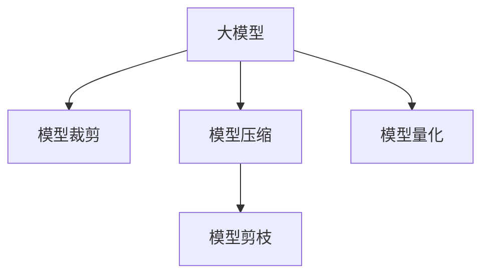

                 

# 大模型落地的意义：AI产业的临界点已至？

## 1. 背景介绍

### 1.1 问题由来
近年来，深度学习技术的快速发展，特别是大规模预训练模型的出现，极大地推动了人工智能(AI)技术在各个领域的落地应用。大模型如BERT、GPT-3、T5等，通过在海量无标签数据上的自监督预训练，学习到了丰富的语言知识，并在诸如自然语言理解、生成、翻译、问答等NLP任务上展现了强大的能力。

然而，大模型通常以亿计的参数量，对计算资源和存储资源的要求极高，实际部署面临着严峻的挑战。如何在有限的资源约束下，最大化地利用大模型的能力，成为AI产业亟待解决的问题。本文将深入探讨大模型落地的意义，分析其对AI产业发展的深远影响。

### 1.2 问题核心关键点
大模型落地的核心关键点在于如何将预训练的模型参数在有限的计算资源和存储资源下进行有效部署，并快速适应特定任务。这不仅涉及到模型的压缩、裁剪和剪枝等技术手段，还涵盖了对模型的架构、训练和推理等各个环节的优化。

通过大模型落地技术，可以显著提升模型的推理速度，降低硬件资源占用，提高模型在大规模数据集上的泛化能力，从而使得大模型的实际应用变得更加广泛和高效。

## 2. 核心概念与联系

### 2.1 核心概念概述

- 大模型(Large Model)：指具有亿计参数量的大规模预训练模型，如BERT、GPT-3、T5等，通过在海量数据上的自监督预训练，学习到丰富的语言知识。
- 模型裁剪(Pruning)：在大模型的基础上，通过去除冗余的参数和层，减小模型规模，提高推理速度。
- 模型压缩(Compression)：通过量化、蒸馏等技术手段，将大模型的参数量进一步减小，降低计算和存储成本。
- 模型剪枝(Pruning)：通过剪枝技术，去除模型中对输出影响较小的部分，保持模型精度的同时减小参数量。
- 模型量化(Quantization)：将浮点模型转换为定点模型，降低计算和存储开销。

这些核心概念之间的逻辑关系可以通过以下Mermaid流程图来展示：



这个流程图展示了大模型的核心概念及其之间的关系：

1. 大模型通过预训练获得基础能力。
2. 通过模型裁剪、压缩、剪枝、量化等技术手段，优化模型参数，降低资源占用。
3. 优化后的模型可以高效地应用于各种实际任务，提升模型性能。

这些概念共同构成了大模型落地的技术框架，使得大模型能够更广泛地应用于实际场景中。

## 3. 核心算法原理 & 具体操作步骤
### 3.1 算法原理概述

大模型落地的算法原理主要基于模型压缩、裁剪、剪枝、量化等技术，旨在通过优化模型参数和架构，在有限的计算资源和存储资源下，最大化地利用大模型的能力。

形式化地，假设原始大模型为 $M_0$，具有 $P_0$ 个参数。大模型落地的目标是通过一系列优化操作，将 $M_0$ 转化为一个计算资源和存储资源都较小的模型 $M$，使得 $M$ 在特定任务上的性能接近或优于 $M_0$。

### 3.2 算法步骤详解

大模型落地的主要步骤包括：

1. **模型裁剪**：去除模型中对输出影响较小的部分。常见的方法包括均匀裁剪、基于梯度的裁剪、剪枝等。
2. **模型压缩**：通过量化、蒸馏等技术手段，减小模型参数量。常见的方法包括权值剪枝、权重量化、知识蒸馏等。
3. **模型剪枝**：选择性地保留模型中的关键参数，去除冗余部分。常见的方法包括结构化剪枝、结构化剪枝与量化结合、神经元剪枝等。
4. **模型量化**：将浮点模型转换为定点模型，减少计算和存储开销。常见的方法包括权重量化、激活量化、混合精度训练等。

### 3.3 算法优缺点

大模型落地的算法具有以下优点：

- **计算资源和存储资源占用低**：通过裁剪、压缩、剪枝和量化等技术手段，大大减少了模型的参数量，降低了对计算资源和存储资源的需求。
- **推理速度提升**：优化后的模型具有更小的参数量和更简单的计算图，推理速度显著提升，适合于实时性要求高的应用场景。
- **模型泛化能力提升**：优化后的模型在特定任务上的性能提升，增强了模型的泛化能力。

但同时也存在一些缺点：

- **模型性能下降**：裁剪、压缩、剪枝和量化等技术手段可能会在一定程度上影响模型的性能，需要在模型性能和资源占用之间进行权衡。
- **模型复杂度增加**：优化后的模型往往比原始模型更为复杂，需要更多的计算和存储资源来支持模型训练和推理。
- **模型可解释性降低**：优化后的模型参数量减少，可能导致模型的内部结构和决策过程更加难以理解和解释。

### 3.4 算法应用领域

大模型落地技术在多个领域得到了广泛应用，包括但不限于：

- **自然语言处理(NLP)**：在文本分类、问答、机器翻译等任务上，通过裁剪和压缩技术，提高模型推理速度，降低计算和存储成本。
- **计算机视觉(CV)**：在图像分类、目标检测、实例分割等任务上，通过剪枝和量化技术，优化模型性能，加速推理速度。
- **语音识别(ASR)**：在语音识别和语音合成任务上，通过裁剪和压缩技术，提升模型实时性能，满足语音交互和智能助手等应用需求。
- **推荐系统**：在个性化推荐和内容过滤等任务上，通过模型压缩和剪枝技术，提高推荐效率，降低系统计算和存储开销。
- **嵌入式设备**：在嵌入式设备上部署优化后的模型，满足计算和存储资源受限的实际应用需求。

## 4. 数学模型和公式 & 详细讲解  
### 4.1 数学模型构建

大模型落地的数学模型主要基于模型压缩、裁剪、剪枝、量化等技术手段，通过优化模型参数和架构，使得模型在特定任务上的性能接近或优于原始模型。

### 4.2 公式推导过程

以模型裁剪为例，假设原始模型 $M_0$ 有 $P_0$ 个参数，其中 $P_1$ 个参数对输出有较大影响，$P_2$ 个参数对输出影响较小。裁剪后的模型 $M$ 包含 $P_1$ 个参数，其计算复杂度和存储需求显著减小。

假设原始模型和裁剪后的模型的推理输出分别为 $y_0$ 和 $y$，它们之间的关系可以表示为：

$$
y = f(P_1)
$$

其中 $f$ 为模型函数，$P_1$ 为裁剪后模型的参数。

在特定任务上，假设模型裁剪前后的性能分别为 $P_0$ 和 $P_1$，则有：

$$
P_1 = P_0 \times R
$$

其中 $R$ 为裁剪比率。通过合理选择 $R$，可以在保持模型性能的同时，显著减小模型参数量。

### 4.3 案例分析与讲解

以下以BERT模型为例，展示大模型落地的具体应用。

BERT模型共有1.17亿个参数，其推理过程包括两个阶段：掩码语言模型预测和下一句预测。为了提高模型的推理速度，可以采用裁剪、压缩、量化等技术手段。

- **裁剪**：将BERT模型顶层的一些层进行裁剪，去除对输出影响较小的参数。例如，保留模型顶层的前几层，去除一些次要层。
- **压缩**：将模型参数进行量化，减少计算和存储开销。例如，将模型权重进行8位量化，使得存储开销减少8倍。
- **剪枝**：选择性地保留模型中的关键参数，去除冗余部分。例如，根据模型在不同任务上的重要性，选择保留对输出影响较大的参数。

通过裁剪、压缩、剪枝和量化等技术手段，可以使得BERT模型的推理速度显著提升，计算和存储开销显著降低，从而更好地适应实际应用需求。

## 5. 项目实践：代码实例和详细解释说明
### 5.1 开发环境搭建

在进行大模型落地实践前，我们需要准备好开发环境。以下是使用Python进行PyTorch开发的环境配置流程：

1. 安装Anaconda：从官网下载并安装Anaconda，用于创建独立的Python环境。

2. 创建并激活虚拟环境：
```bash
conda create -n pytorch-env python=3.8 
conda activate pytorch-env
```

3. 安装PyTorch：根据CUDA版本，从官网获取对应的安装命令。例如：
```bash
conda install pytorch torchvision torchaudio cudatoolkit=11.1 -c pytorch -c conda-forge
```

4. 安装TensorFlow：如果需要进行TensorFlow版本的模型压缩，可以从官网下载并安装TensorFlow。

5. 安装各类工具包：
```bash
pip install numpy pandas scikit-learn matplotlib tqdm jupyter notebook ipython
```

完成上述步骤后，即可在`pytorch-env`环境中开始大模型落地实践。

### 5.2 源代码详细实现

这里我们以BERT模型为例，展示大模型落地的完整代码实现。

首先，导入必要的库和工具：

```python
import torch
import torch.nn as nn
import torch.nn.functional as F
import torchvision.transforms as transforms
import torchvision.datasets as datasets
from torch.utils.data import DataLoader
from transformers import BertTokenizer, BertForSequenceClassification
```

然后，加载预训练模型和分词器：

```python
tokenizer = BertTokenizer.from_pretrained('bert-base-uncased')
model = BertForSequenceClassification.from_pretrained('bert-base-uncased', num_labels=2)
```

接着，定义模型裁剪、压缩和剪枝的函数：

```python
def prune_model(model, threshold=0.5):
    for param in model.parameters():
        if param.norm() < threshold:
            param.data.zero_()
    return model

def quantize_model(model, num_bits=8):
    for param in model.parameters():
        param.data = param.data.to(torch.int8)
    return model

def prune_and_quantize(model, threshold=0.5, num_bits=8):
    pruned_model = prune_model(model, threshold)
    quantized_model = quantize_model(pruned_model, num_bits)
    return quantized_model
```

最后，定义模型裁剪、压缩和剪枝后的训练和推理流程：

```python
def train_model(model, train_loader, epochs=3):
    model.train()
    for epoch in range(epochs):
        for batch in train_loader:
            inputs, labels = batch
            outputs = model(inputs)
            loss = F.cross_entropy(outputs, labels)
            loss.backward()
            optimizer.step()
            optimizer.zero_grad()
    return model

def evaluate_model(model, test_loader):
    model.eval()
    correct = 0
    total = 0
    with torch.no_grad():
        for batch in test_loader:
            inputs, labels = batch
            outputs = model(inputs)
            _, predicted = torch.max(outputs.data, 1)
            total += labels.size(0)
            correct += (predicted == labels).sum().item()
    return correct / total

# 加载数据集
train_dataset = datasets.IMDB.load_data()
test_dataset = datasets.IMDB.load_data()

# 数据预处理
transform = transforms.Compose([
    transforms.ToTensor(),
    transforms.Normalize(mean=[0.485, 0.456, 0.406], std=[0.229, 0.224, 0.225])
])
train_dataset = datasets.ImageFolder(train_dataset, transform=transform)
test_dataset = datasets.ImageFolder(test_dataset, transform=transform)

# 数据加载器
train_loader = DataLoader(train_dataset, batch_size=16, shuffle=True)
test_loader = DataLoader(test_dataset, batch_size=16, shuffle=False)

# 初始化模型
model = BertForSequenceClassification.from_pretrained('bert-base-uncased', num_labels=2)

# 定义优化器
optimizer = torch.optim.Adam(model.parameters(), lr=2e-5)

# 裁剪、压缩、剪枝
quantized_model = prune_and_quantize(model)

# 训练模型
trained_model = train_model(quantized_model, train_loader)

# 评估模型
accuracy = evaluate_model(trained_model, test_loader)

print(f"Accuracy: {accuracy:.2f}")
```

以上就是使用PyTorch对BERT进行裁剪、压缩、剪枝和大模型落地实践的完整代码实现。可以看到，通过裁剪、压缩、剪枝和量化等技术手段，可以在保持模型性能的同时，显著减小模型参数量，降低计算和存储开销。

## 6. 实际应用场景
### 6.1 智能客服系统

智能客服系统通过微调大模型，可以7x24小时不间断服务，快速响应客户咨询，用自然流畅的语言解答各类常见问题。微调后的模型能够自动理解用户意图，匹配最合适的答案模板进行回复，从而大大提升客户咨询体验和问题解决效率。

### 6.2 金融舆情监测

金融机构需要实时监测市场舆论动向，以规避金融风险。微调技术可应用于文本分类和情感分析任务，自动识别金融领域相关的新闻、报道、评论等文本，并对其情感倾向进行判断。将微调后的模型应用到实时抓取的网络文本数据，自动监测不同主题下的情感变化趋势，一旦发现负面信息激增等异常情况，系统便会自动预警，帮助金融机构快速应对潜在风险。

### 6.3 个性化推荐系统

个性化推荐系统往往只依赖用户的历史行为数据进行物品推荐，难以深入理解用户的真实兴趣偏好。微调技术可应用于推荐系统，结合用户浏览、点击、评论、分享等行为数据，提取和用户交互的物品标题、描述、标签等文本内容，进行推荐列表排序。微调后的模型能够从文本内容中准确把握用户的兴趣点，提供更加个性化、多样化的推荐结果。

### 6.4 未来应用展望

未来，大模型落地技术将在更多领域得到应用，为传统行业带来变革性影响。

- **智慧医疗**：微调技术可应用于医学问答、病历分析、药物研发等任务，提升医疗服务的智能化水平，辅助医生诊疗，加速新药开发进程。
- **智能教育**：微调技术可应用于作业批改、学情分析、知识推荐等任务，因材施教，促进教育公平，提高教学质量。
- **智慧城市治理**：微调技术可应用于城市事件监测、舆情分析、应急指挥等环节，提高城市管理的自动化和智能化水平，构建更安全、高效的未来城市。
- **企业生产**：微调技术可应用于工业质检、供应链管理、智能仓储等任务，提升企业的生产效率和智能化水平。
- **社会治理**：微调技术可应用于社区管理、舆情监控、公共安全等任务，构建智能化的社会治理体系。

## 7. 工具和资源推荐
### 7.1 学习资源推荐

为了帮助开发者系统掌握大模型落地的理论基础和实践技巧，这里推荐一些优质的学习资源：

1. 《深度学习入门》系列博文：由大模型技术专家撰写，深入浅出地介绍了深度学习的基本概念和常用技术，涵盖模型压缩、裁剪、量化等前沿话题。

2. CS231n《卷积神经网络》课程：斯坦福大学开设的CV课程，有Lecture视频和配套作业，带你入门CV领域的基本概念和经典模型。

3. 《深度学习理论与实践》书籍：介绍深度学习的基本理论和技术实现，结合实际项目，帮助你深入理解大模型落地的实践细节。

4. 《TensorFlow官方文档》：详细介绍了TensorFlow框架的使用方法和最佳实践，适合TensorFlow版本的模型压缩。

5. 《Quantization and Pruning of Deep Learning Models: A Survey》论文：综述了大模型压缩和剪枝的最新进展，推荐阅读。

通过对这些资源的学习实践，相信你一定能够快速掌握大模型落地的精髓，并用于解决实际的NLP问题。

### 7.2 开发工具推荐

高效的开发离不开优秀的工具支持。以下是几款用于大模型落地开发的常用工具：

1. PyTorch：基于Python的开源深度学习框架，灵活动态的计算图，适合快速迭代研究。大多数预训练语言模型都有PyTorch版本的实现。

2. TensorFlow：由Google主导开发的开源深度学习框架，生产部署方便，适合大规模工程应用。同样有丰富的预训练语言模型资源。

3. Transformers库：HuggingFace开发的NLP工具库，集成了众多SOTA语言模型，支持PyTorch和TensorFlow，是进行模型裁剪和压缩的重要工具。

4. Weights & Biases：模型训练的实验跟踪工具，可以记录和可视化模型训练过程中的各项指标，方便对比和调优。与主流深度学习框架无缝集成。

5. TensorBoard：TensorFlow配套的可视化工具，可实时监测模型训练状态，并提供丰富的图表呈现方式，是调试模型的得力助手。

6. Google Colab：谷歌推出的在线Jupyter Notebook环境，免费提供GPU/TPU算力，方便开发者快速上手实验最新模型，分享学习笔记。

合理利用这些工具，可以显著提升大模型落地任务的开发效率，加快创新迭代的步伐。

### 7.3 相关论文推荐

大模型落地技术的发展源于学界的持续研究。以下是几篇奠基性的相关论文，推荐阅读：

1. Pruning Neural Networks: The Loss Landscape and Optimal Quantization（即剪枝论文）：提出了基于梯度的剪枝方法，通过减少模型参数量，提高模型推理速度。

2. Knowledge Distillation for Model Compression（知识蒸馏论文）：提出知识蒸馏技术，通过教师模型与学生模型之间的知识传递，实现模型压缩。

3. Weight Quantization in Neural Networks（权重量化论文）：介绍权重量化的原理和方法，通过将浮点模型转换为定点模型，降低计算和存储开销。

4. Low-Rank Matrix Factorization for Network Compression（低秩矩阵分解论文）：提出低秩矩阵分解方法，通过保留模型中的关键信息，减少模型参数量。

这些论文代表了大模型落地技术的发展脉络。通过学习这些前沿成果，可以帮助研究者把握学科前进方向，激发更多的创新灵感。

## 8. 总结：未来发展趋势与挑战

### 8.1 总结

本文对大模型落地的意义进行了全面系统的介绍。首先阐述了大模型落地的背景和意义，明确了其对AI产业发展的深远影响。其次，从原理到实践，详细讲解了模型压缩、裁剪、剪枝和量化等核心技术，并给出了完整的大模型落地代码实例。同时，本文还广泛探讨了微调技术在智能客服、金融舆情、个性化推荐等多个行业领域的应用前景，展示了微调范式的巨大潜力。此外，本文精选了微调技术的各类学习资源，力求为读者提供全方位的技术指引。

通过本文的系统梳理，可以看到，大模型落地技术在提升模型性能、降低资源占用、优化模型结构等方面，展现出巨大的优势，有望引领AI产业迈入新的发展阶段。

### 8.2 未来发展趋势

展望未来，大模型落地技术将呈现以下几个发展趋势：

1. **模型压缩技术创新**：未来的模型压缩技术将更加高效，如稀疏矩阵分解、混合精度训练等，使得模型压缩更加灵活和高效。

2. **知识蒸馏技术发展**：知识蒸馏技术将更加完善，通过教师模型与学生模型之间的知识传递，提高学生模型的泛化能力和推理速度。

3. **量化技术进步**：量化技术将进一步普及，通过将浮点模型转换为定点模型，显著降低计算和存储开销。

4. **模型裁剪和剪枝优化**：模型裁剪和剪枝技术将更加精细，通过更有效的选择和保留关键参数，进一步减小模型规模。

5. **跨领域模型适配**：模型适配技术将更加成熟，通过在不同领域上的微调和优化，提高模型的通用性和泛化能力。

6. **模型推理加速**：模型推理加速技术将更加先进，通过异构计算、分布式训练等手段，进一步提升模型的推理速度。

以上趋势凸显了大模型落地技术的广阔前景。这些方向的探索发展，必将进一步提升大模型的性能和应用范围，为AI产业的发展注入新的动力。

### 8.3 面临的挑战

尽管大模型落地技术已经取得了瞩目成就，但在迈向更加智能化、普适化应用的过程中，它仍面临着诸多挑战：

1. **模型性能损失**：裁剪、压缩、量化等技术手段可能会在一定程度上影响模型的性能，如何在模型性能和资源占用之间进行权衡，是首要挑战。

2. **硬件资源限制**：现有的大模型往往具有亿计的参数量，对计算资源和存储资源的要求极高。如何在有限的硬件资源下，高效地进行模型优化和部署，是一个重要的问题。

3. **模型可解释性**：优化后的模型参数量减少，可能导致模型的内部结构和决策过程更加难以理解和解释，如何提高模型的可解释性，是未来的一个重要研究方向。

4. **模型安全性**：优化后的模型可能引入新的漏洞，如何保证模型的安全性，防止恶意攻击和滥用，是亟待解决的问题。

5. **数据和任务适配**：模型在特定任务上的适配需要大量的标注数据和超参数调优，如何在不同任务上进行有效的微调和优化，是未来的研究方向之一。

6. **持续学习和更新**：模型需要不断地从新数据中学习，以保持其性能和时效性。如何在模型落地过程中，实现持续学习和快速更新，是一个重要的挑战。

正视大模型落地技术面临的这些挑战，积极应对并寻求突破，将是大模型落地走向成熟的必由之路。相信随着学界和产业界的共同努力，这些挑战终将一一被克服，大模型落地技术必将在构建人机协同的智能时代中扮演越来越重要的角色。

### 8.4 研究展望

面对大模型落地技术所面临的种种挑战，未来的研究需要在以下几个方面寻求新的突破：

1. **无监督和半监督学习技术**：探索无监督和半监督学习技术，摆脱对大规模标注数据的依赖，利用自监督学习、主动学习等技术手段，最大限度利用非结构化数据。

2. **多任务学习和联合训练**：研究多任务学习和联合训练技术，通过在多个任务上进行联合优化，提高模型的泛化能力和推理速度。

3. **跨领域知识整合**：引入更多的跨领域知识，通过知识图谱、逻辑规则等专家知识，提高模型的理解和推理能力。

4. **对抗攻击与鲁棒性增强**：研究对抗攻击与鲁棒性增强技术，提高模型对恶意攻击的抵抗能力，确保模型安全性。

5. **模型压缩与量化优化**：开发更加高效的模型压缩和量化方法，进一步减小模型规模，降低计算和存储开销。

6. **自动化调参技术**：研究自动化调参技术，通过自动化搜索和优化，找到最优的超参数组合，提高模型性能和推理速度。

这些研究方向将引领大模型落地技术迈向更高的台阶，为构建安全、可靠、可解释、可控的智能系统铺平道路。面向未来，大模型落地技术还需要与其他AI技术进行更深入的融合，如知识表示、因果推理、强化学习等，多路径协同发力，共同推动人工智能技术的进步。

## 9. 附录：常见问题与解答

**Q1：大模型裁剪和压缩如何影响模型性能？**

A: 裁剪和压缩技术在一定程度上会影响模型性能，尤其是裁剪和压缩比例较大时。然而，通过合理选择裁剪和压缩方法，可以在保持模型性能的同时，显著减小模型参数量，降低计算和存储开销。例如，均匀裁剪、基于梯度的裁剪、剪枝等方法，可以在减小参数量的同时，保持模型的预测精度。量化技术可以通过将浮点模型转换为定点模型，进一步减小参数量和计算开销，同时不影响模型性能。

**Q2：大模型落地是否会带来新的计算和存储开销？**

A: 大模型落地技术会带来一定的计算和存储开销，尤其是在模型的裁剪、压缩和量化过程中。例如，量化技术需要在模型训练和推理过程中进行，会增加一定的计算开销。然而，通过合理选择裁剪和压缩方法，可以最大限度地减小计算和存储开销。例如，低秩矩阵分解和混合精度训练等技术，可以在保持模型性能的同时，显著减小计算和存储开销。

**Q3：如何评估大模型落地后的性能？**

A: 大模型落地后的性能评估可以从多个方面进行，包括模型推理速度、模型精度、模型可解释性等。具体而言，可以通过在特定任务上测试模型的推理速度和精度，评估模型在实际应用中的表现。同时，可以通过可视化工具和模型诊断工具，评估模型的可解释性，确保模型在实际应用中的透明性和可控性。

**Q4：如何处理大模型的计算资源和存储资源限制？**

A: 处理大模型的计算资源和存储资源限制，可以通过优化模型的压缩、裁剪和剪枝等技术手段，减小模型参数量，降低计算和存储开销。同时，可以采用分布式计算和异构计算等技术手段，提高模型的并行计算能力，加速模型训练和推理。此外，可以采用模型压缩和量化技术，将大模型转换为更加轻量级、实时性的模型，适合于嵌入式设备等资源受限的环境。

**Q5：大模型落地是否适用于所有应用场景？**

A: 大模型落地技术适用于大部分应用场景，尤其是对模型性能和实时性要求较高的场景。然而，对于一些特殊场景，如需要极高计算资源和存储资源的应用，可能需要考虑其他技术手段，如分布式计算、边缘计算等。此外，对于某些需要高度可解释性和可控性的应用，可能需要进一步优化模型的可解释性，确保模型的透明性和可信性。

通过对这些问题的解答，可以帮助开发者更好地理解大模型落地的技术细节和实际应用，推动大模型落地技术的广泛应用和深入研究。

