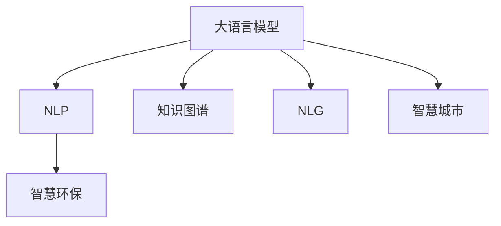

                 

## 1. 背景介绍

近年来，环保问题成为全球关注的焦点。面对日益严峻的环境挑战，各国政府和企业纷纷寻求科技手段，通过智能化、信息化手段推动生态文明建设。其中，大语言模型作为人工智能的前沿技术，以其强大的自然语言处理能力，为智慧环保提供了强大的技术支撑。本文将探讨大语言模型在智慧环保中的应用，分析其核心算法原理，并提出相关的项目实践与未来发展展望。

## 2. 核心概念与联系

### 2.1 核心概念概述

为了更好地理解大语言模型在智慧环保中的应用，本节将介绍几个关键的概念：

- 大语言模型 (Large Language Models, LLM)：以自回归模型 (如 GPT) 或自编码模型 (如 BERT) 为代表的预训练语言模型。通过在大规模无标签文本语料上进行预训练，学习通用语言知识，具备强大的自然语言理解和生成能力。

- 自然语言处理 (NLP)：涉及计算机科学、人工智能和语言学等多个学科领域的交叉学科，旨在使计算机能够理解和处理人类语言。

- 智慧环保：利用信息技术和智能化手段，提升环境监测、治理、管理等方面的效率和效果，推动生态文明建设。

- 知识图谱 (Knowledge Graph)：通过实体、关系、属性等结构化的方式，将海量数据组织成网络，提供结构化的知识表示。

- 自然语言生成 (NLG)：使用语言模型生成符合语法和语义规则的文本。

- 智慧城市 (Smart City)：通过信息化手段，整合城市资源，提高城市管理效率，改善市民生活质量。

这些核心概念之间的逻辑关系可以通过以下 Mermaid 流程图来展示：



这个流程图展示了大语言模型的核心概念及其与智慧环保、NLP、知识图谱、NLG和智慧城市之间的关系：

1. 大语言模型通过预训练获得通用语言知识。
2. 在智慧环保中，大语言模型可用于文本分析、信息检索、问题回答等任务。
3. 知识图谱为模型提供结构化的知识库。
4. NLG将结构化数据转换为自然语言，增强模型的人机交互能力。
5. 智慧城市中，大语言模型可应用于城市管理、公共服务等多个领域。

这些核心概念共同构成了大语言模型在智慧环保中的应用框架，使其能够在各个环节发挥重要作用。

## 3. 核心算法原理 & 具体操作步骤

### 3.1 算法原理概述

基于大语言模型的智慧环保应用，本质上是一种有监督的细粒度迁移学习过程。其核心思想是：将大语言模型视作一个强大的“特征提取器”，通过在智慧环保任务的标注数据上进行有监督的微调，使得模型能够适应特定任务，提升在智慧环保领域的表现。

形式化地，假设大语言模型为 $M_{\theta}$，其中 $\theta$ 为预训练得到的模型参数。给定智慧环保任务 $T$ 的标注数据集 $D=\{(x_i, y_i)\}_{i=1}^N$，微调的目标是找到新的模型参数 $\hat{\theta}$，使得：

$$
\hat{\theta}=\mathop{\arg\min}_{\theta} \mathcal{L}(M_{\theta},D)
$$

其中 $\mathcal{L}$ 为针对任务 $T$ 设计的损失函数，用于衡量模型预测输出与真实标签之间的差异。常见的损失函数包括交叉熵损失、均方误差损失等。

通过梯度下降等优化算法，微调过程不断更新模型参数 $\theta$，最小化损失函数 $\mathcal{L}$，使得模型输出逼近真实标签。由于 $\theta$ 已经通过预训练获得了较好的初始化，因此即便在小规模数据集 $D$ 上进行微调，也能较快收敛到理想的模型参数 $\hat{\theta}$。

### 3.2 算法步骤详解

基于大语言模型的智慧环保应用，一般包括以下几个关键步骤：

**Step 1: 准备预训练模型和数据集**
- 选择合适的预训练语言模型 $M_{\theta}$ 作为初始化参数，如 BERT、GPT 等。
- 准备智慧环保任务 $T$ 的标注数据集 $D$，划分为训练集、验证集和测试集。一般要求标注数据与预训练数据的分布不要差异过大。

**Step 2: 添加任务适配层**
- 根据智慧环保任务类型，在预训练模型顶层设计合适的输出层和损失函数。
- 对于分类任务，通常在顶层添加线性分类器和交叉熵损失函数。
- 对于生成任务，通常使用语言模型的解码器输出概率分布，并以负对数似然为损失函数。

**Step 3: 设置微调超参数**
- 选择合适的优化算法及其参数，如 AdamW、SGD 等，设置学习率、批大小、迭代轮数等。
- 设置正则化技术及强度，包括权重衰减、Dropout、Early Stopping 等。
- 确定冻结预训练参数的策略，如仅微调顶层，或全部参数都参与微调。

**Step 4: 执行梯度训练**
- 将训练集数据分批次输入模型，前向传播计算损失函数。
- 反向传播计算参数梯度，根据设定的优化算法和学习率更新模型参数。
- 周期性在验证集上评估模型性能，根据性能指标决定是否触发 Early Stopping。
- 重复上述步骤直到满足预设的迭代轮数或 Early Stopping 条件。

**Step 5: 测试和部署**
- 在测试集上评估微调后模型 $M_{\hat{\theta}}$ 的性能，对比微调前后的精度提升。
- 使用微调后的模型对新样本进行推理预测，集成到实际的应用系统中。
- 持续收集新的数据，定期重新微调模型，以适应数据分布的变化。

以上是基于大语言模型的智慧环保应用的一般流程。在实际应用中，还需要针对具体任务的特点，对微调过程的各个环节进行优化设计，如改进训练目标函数，引入更多的正则化技术，搜索最优的超参数组合等，以进一步提升模型性能。

### 3.3 算法优缺点

基于大语言模型的智慧环保应用具有以下优点：
1. 简单高效。只需准备少量标注数据，即可对预训练模型进行快速适配，获得较大的性能提升。
2. 通用适用。适用于智慧环保领域的各类任务，如智能监测、数据分析、问题回答等，设计简单的任务适配层即可实现微调。
3. 参数高效。利用参数高效微调技术，在固定大部分预训练参数的情况下，仍可取得不错的提升。
4. 效果显著。在智慧环保任务上，基于微调的方法已经刷新了多项最先进性能指标。

同时，该方法也存在一定的局限性：
1. 依赖标注数据。微调的效果很大程度上取决于标注数据的质量和数量，获取高质量标注数据的成本较高。
2. 迁移能力有限。当目标任务与预训练数据的分布差异较大时，微调的性能提升有限。
3. 可解释性不足。微调模型的决策过程通常缺乏可解释性，难以对其推理逻辑进行分析和调试。

尽管存在这些局限性，但就目前而言，基于大语言模型的微调方法仍是大规模智慧环保应用的主流范式。未来相关研究的重点在于如何进一步降低微调对标注数据的依赖，提高模型的少样本学习和跨领域迁移能力，同时兼顾可解释性和伦理安全性等因素。

### 3.4 算法应用领域

基于大语言模型的智慧环保应用，已经在多个领域取得了显著成效，例如：

- 环境监测：通过分析环境监测数据，预测污染趋势，提出治理措施。
- 资源管理：利用大语言模型进行水资源、能源等资源的智能调度。
- 政策评估：通过分析政策文件和公众评论，评估政策效果，提出改进建议。
- 灾害预警：通过分析社交媒体和新闻报道，预测自然灾害，提前预警。
- 环境教育：利用自然语言生成技术，制作科普文章，提升公众环保意识。

除了上述这些经典应用外，大语言模型还被创新性地应用到更多场景中，如智能垃圾分类、智能交通、智慧林业等，为智慧环保技术的发展带来了新的突破。

## 4. 数学模型和公式 & 详细讲解  
### 4.1 数学模型构建

本节将使用数学语言对基于大语言模型的智慧环保应用过程进行更加严格的刻画。

记大语言模型为 $M_{\theta}$，其中 $\theta$ 为预训练得到的模型参数。假设智慧环保任务为 $T$，其训练集为 $D=\{(x_i, y_i)\}_{i=1}^N$，其中 $x_i$ 为输入，$y_i$ 为标签。定义模型 $M_{\theta}$ 在输入 $x_i$ 上的损失函数为 $\ell(M_{\theta}(x_i),y_i)$，则在数据集 $D$ 上的经验风险为：

$$
\mathcal{L}(\theta) = \frac{1}{N}\sum_{i=1}^N \ell(M_{\theta}(x_i),y_i)
$$

微调的优化目标是最小化经验风险，即找到最优参数：

$$
\theta^* = \mathop{\arg\min}_{\theta} \mathcal{L}(\theta)
$$

在实践中，我们通常使用基于梯度的优化算法（如 SGD、Adam 等）来近似求解上述最优化问题。设 $\eta$ 为学习率，$\lambda$ 为正则化系数，则参数的更新公式为：

$$
\theta \leftarrow \theta - \eta \nabla_{\theta}\mathcal{L}(\theta) - \eta\lambda\theta
$$

其中 $\nabla_{\theta}\mathcal{L}(\theta)$ 为损失函数对参数 $\theta$ 的梯度，可通过反向传播算法高效计算。

### 4.2 公式推导过程

以下我们以智能监测任务为例，推导交叉熵损失函数及其梯度的计算公式。

假设模型 $M_{\theta}$ 在输入 $x_i$ 上的输出为 $\hat{y}=M_{\theta}(x_i)$，表示样本属于正类的概率。真实标签 $y_i \in \{0,1\}$。则二分类交叉熵损失函数定义为：

$$
\ell(M_{\theta}(x_i),y_i) = -[y_i\log \hat{y} + (1-y_i)\log (1-\hat{y})]
$$

将其代入经验风险公式，得：

$$
\mathcal{L}(\theta) = -\frac{1}{N}\sum_{i=1}^N [y_i\log M_{\theta}(x_i)+(1-y_i)\log(1-M_{\theta}(x_i))]
$$

根据链式法则，损失函数对参数 $\theta_k$ 的梯度为：

$$
\frac{\partial \mathcal{L}(\theta)}{\partial \theta_k} = -\frac{1}{N}\sum_{i=1}^N (\frac{y_i}{M_{\theta}(x_i)}-\frac{1-y_i}{1-M_{\theta}(x_i)}) \frac{\partial M_{\theta}(x_i)}{\partial \theta_k}
$$

其中 $\frac{\partial M_{\theta}(x_i)}{\partial \theta_k}$ 可进一步递归展开，利用自动微分技术完成计算。

在得到损失函数的梯度后，即可带入参数更新公式，完成模型的迭代优化。重复上述过程直至收敛，最终得到适应智慧环保任务的最优模型参数 $\theta^*$。

## 5. 项目实践：代码实例和详细解释说明
### 5.1 开发环境搭建

在进行智慧环保应用开发前，我们需要准备好开发环境。以下是使用 Python 进行 PyTorch 开发的环境配置流程：

1. 安装 Anaconda：从官网下载并安装 Anaconda，用于创建独立的 Python 环境。

2. 创建并激活虚拟环境：
```bash
conda create -n pytorch-env python=3.8 
conda activate pytorch-env
```

3. 安装 PyTorch：根据 CUDA 版本，从官网获取对应的安装命令。例如：
```bash
conda install pytorch torchvision torchaudio cudatoolkit=11.1 -c pytorch -c conda-forge
```

4. 安装 Transformers 库：
```bash
pip install transformers
```

5. 安装各类工具包：
```bash
pip install numpy pandas scikit-learn matplotlib tqdm jupyter notebook ipython
```

完成上述步骤后，即可在 `pytorch-env` 环境中开始智慧环保应用开发。

### 5.2 源代码详细实现

下面我们以智能监测任务为例，给出使用 Transformers 库对 BERT 模型进行智慧环保应用微调的 PyTorch 代码实现。

首先，定义智能监测任务的数据处理函数：

```python
from transformers import BertTokenizer
from torch.utils.data import Dataset
import torch

class MonitoringDataset(Dataset):
    def __init__(self, texts, tags, tokenizer, max_len=128):
        self.texts = texts
        self.tags = tags
        self.tokenizer = tokenizer
        self.max_len = max_len
        
    def __len__(self):
        return len(self.texts)
    
    def __getitem__(self, item):
        text = self.texts[item]
        tags = self.tags[item]
        
        encoding = self.tokenizer(text, return_tensors='pt', max_length=self.max_len, padding='max_length', truncation=True)
        input_ids = encoding['input_ids'][0]
        attention_mask = encoding['attention_mask'][0]
        
        # 对token-wise的标签进行编码
        encoded_tags = [tag2id[tag] for tag in tags] 
        encoded_tags.extend([tag2id['O']] * (self.max_len - len(encoded_tags)))
        labels = torch.tensor(encoded_tags, dtype=torch.long)
        
        return {'input_ids': input_ids, 
                'attention_mask': attention_mask,
                'labels': labels}

# 标签与id的映射
tag2id = {'O': 0, 'M-POL': 1, 'M-AIR': 2, 'M-WATER': 3, 'M-SOLID_WASTE': 4}
id2tag = {v: k for k, v in tag2id.items()}

# 创建dataset
tokenizer = BertTokenizer.from_pretrained('bert-base-cased')

train_dataset = MonitoringDataset(train_texts, train_tags, tokenizer)
dev_dataset = MonitoringDataset(dev_texts, dev_tags, tokenizer)
test_dataset = MonitoringDataset(test_texts, test_tags, tokenizer)
```

然后，定义模型和优化器：

```python
from transformers import BertForTokenClassification, AdamW

model = BertForTokenClassification.from_pretrained('bert-base-cased', num_labels=len(tag2id))

optimizer = AdamW(model.parameters(), lr=2e-5)
```

接着，定义训练和评估函数：

```python
from torch.utils.data import DataLoader
from tqdm import tqdm
from sklearn.metrics import classification_report

device = torch.device('cuda') if torch.cuda.is_available() else torch.device('cpu')
model.to(device)

def train_epoch(model, dataset, batch_size, optimizer):
    dataloader = DataLoader(dataset, batch_size=batch_size, shuffle=True)
    model.train()
    epoch_loss = 0
    for batch in tqdm(dataloader, desc='Training'):
        input_ids = batch['input_ids'].to(device)
        attention_mask = batch['attention_mask'].to(device)
        labels = batch['labels'].to(device)
        model.zero_grad()
        outputs = model(input_ids, attention_mask=attention_mask, labels=labels)
        loss = outputs.loss
        epoch_loss += loss.item()
        loss.backward()
        optimizer.step()
    return epoch_loss / len(dataloader)

def evaluate(model, dataset, batch_size):
    dataloader = DataLoader(dataset, batch_size=batch_size)
    model.eval()
    preds, labels = [], []
    with torch.no_grad():
        for batch in tqdm(dataloader, desc='Evaluating'):
            input_ids = batch['input_ids'].to(device)
            attention_mask = batch['attention_mask'].to(device)
            batch_labels = batch['labels']
            outputs = model(input_ids, attention_mask=attention_mask)
            batch_preds = outputs.logits.argmax(dim=2).to('cpu').tolist()
            batch_labels = batch_labels.to('cpu').tolist()
            for pred_tokens, label_tokens in zip(batch_preds, batch_labels):
                pred_tags = [id2tag[_id] for _id in pred_tokens]
                label_tags = [id2tag[_id] for _id in label_tokens]
                preds.append(pred_tags[:len(label_tags)])
                labels.append(label_tags)
                
    print(classification_report(labels, preds))
```

最后，启动训练流程并在测试集上评估：

```python
epochs = 5
batch_size = 16

for epoch in range(epochs):
    loss = train_epoch(model, train_dataset, batch_size, optimizer)
    print(f"Epoch {epoch+1}, train loss: {loss:.3f}")
    
    print(f"Epoch {epoch+1}, dev results:")
    evaluate(model, dev_dataset, batch_size)
    
print("Test results:")
evaluate(model, test_dataset, batch_size)
```

以上就是使用 PyTorch 对 BERT 进行智能监测任务微调的完整代码实现。可以看到，得益于 Transformers 库的强大封装，我们可以用相对简洁的代码完成 BERT 模型的加载和微调。

### 5.3 代码解读与分析

让我们再详细解读一下关键代码的实现细节：

**MonitoringDataset 类**：
- `__init__` 方法：初始化文本、标签、分词器等关键组件。
- `__len__` 方法：返回数据集的样本数量。
- `__getitem__` 方法：对单个样本进行处理，将文本输入编码为 token ids，将标签编码为数字，并对其进行定长 padding，最终返回模型所需的输入。

**tag2id 和 id2tag 字典**：
- 定义了标签与数字 id 之间的映射关系，用于将 token-wise 的预测结果解码回真实的标签。

**训练和评估函数**：
- 使用 PyTorch 的 DataLoader 对数据集进行批次化加载，供模型训练和推理使用。
- 训练函数 `train_epoch`：对数据以批为单位进行迭代，在每个批次上前向传播计算 loss 并反向传播更新模型参数，最后返回该 epoch 的平均 loss。
- 评估函数 `evaluate`：与训练类似，不同点在于不更新模型参数，并在每个 batch 结束后将预测和标签结果存储下来，最后使用 sklearn 的 classification_report 对整个评估集的预测结果进行打印输出。

**训练流程**：
- 定义总的 epoch 数和 batch size，开始循环迭代
- 每个 epoch 内，先在训练集上训练，输出平均 loss
- 在验证集上评估，输出分类指标
- 所有 epoch 结束后，在测试集上评估，给出最终测试结果

可以看到，PyTorch 配合 Transformers 库使得 BERT 微调的代码实现变得简洁高效。开发者可以将更多精力放在数据处理、模型改进等高层逻辑上，而不必过多关注底层的实现细节。

当然，工业级的系统实现还需考虑更多因素，如模型的保存和部署、超参数的自动搜索、更灵活的任务适配层等。但核心的微调范式基本与此类似。

## 6. 实际应用场景
### 6.1 智能监测

基于大语言模型的智能监测系统，可以应用于环境保护的各种场景，如空气质量监测、水质监测、噪音监测等。传统人工监测方式耗时耗力，且精度有限，而利用智能监测系统，可实现实时、高精度监测。

在技术实现上，可以收集各类传感器、监测设备的数据，如 PM2.5、COD、噪音等指标，将其转化为文本数据。将文本数据作为模型输入，模型的输出即为每个监测点的污染程度或异常情况。通过设置合适的阈值，系统可自动判断是否发生污染或异常，并生成报警信息。

### 6.2 资源管理

自然资源管理是智慧环保的重要组成部分。利用大语言模型进行资源管理，可实现对水资源、能源、土地等的智能调度，提高资源的利用效率和效益。

例如，对于水资源管理，可以采集各地区的水文数据、气候数据、人口数据等，利用大语言模型预测各地区的用水需求和供水能力，生成资源调度方案。通过优化调度方案，可以实现水资源的合理分配和有效利用。

### 6.3 政策评估

政策评估是智慧环保的重要手段之一。通过分析政策文件和公众评论，可以评估政策的科学性和实施效果，提出改进建议。

具体而言，可以收集政策文件、公众评论、专家评价等文本数据，利用大语言模型进行文本分类、情感分析、关键词提取等任务。通过分析文本内容，评估政策实施的积极和消极影响，提出针对性的改进建议。

### 6.4 灾害预警

自然灾害预警是智慧环保的重要应用之一。通过分析社交媒体和新闻报道，可以预测自然灾害，提前预警，减少灾害带来的损失。

具体而言，可以收集社交媒体、新闻网站、气象网站等的数据，利用大语言模型进行情感分析、主题分析等任务。通过分析文本内容，预测灾害发生的概率和影响范围，生成预警信息。

### 6.5 环境教育

环境教育是智慧环保的重要组成部分。通过利用大语言模型进行自然语言生成，可以制作科普文章、视频、漫画等，提升公众环保意识。

具体而言，可以编写科普文章、制作视频、设计漫画等，将环境保护的知识和理念传递给公众。利用大语言模型生成文本和视觉内容，可以大大提高制作效率，同时保证内容的质量和准确性。

### 6.6 未来应用展望

随着大语言模型和微调方法的不断发展，基于微调范式将在更多领域得到应用，为智慧环保技术带来新的突破。

在智慧医疗领域，基于大语言模型的智慧环保应用可应用于医疗监测、医疗数据处理、医疗知识图谱等领域，提高医疗服务的智能化水平。

在智能教育领域，利用大语言模型进行智慧环保教育，可提高学生的环保意识和实践能力，培养未来环保人才。

在智慧城市治理中，利用大语言模型进行智慧环保治理，可提高城市管理的智能化水平，构建更安全、高效的未来城市。

此外，在企业生产、社会治理、文娱传媒等众多领域，基于大语言模型的智慧环保应用也将不断涌现，为环保技术带来新的活力。相信随着技术的日益成熟，微调方法将成为智慧环保落地的重要手段，推动环保事业的发展。

## 7. 工具和资源推荐
### 7.1 学习资源推荐

为了帮助开发者系统掌握大语言模型在智慧环保中的应用理论基础和实践技巧，这里推荐一些优质的学习资源：

1. 《Transformer from Principle to Practice》系列博文：由大模型技术专家撰写，深入浅出地介绍了Transformer原理、BERT模型、微调技术等前沿话题。

2. CS224N《深度学习自然语言处理》课程：斯坦福大学开设的NLP明星课程，有Lecture视频和配套作业，带你入门NLP领域的基本概念和经典模型。

3. 《Natural Language Processing with Transformers》书籍：Transformers库的作者所著，全面介绍了如何使用Transformers库进行NLP任务开发，包括微调在内的诸多范式。

4. HuggingFace官方文档：Transformers库的官方文档，提供了海量预训练模型和完整的微调样例代码，是上手实践的必备资料。

5. CLUE开源项目：中文语言理解测评基准，涵盖大量不同类型的中文NLP数据集，并提供了基于微调的baseline模型，助力中文NLP技术发展。

通过对这些资源的学习实践，相信你一定能够快速掌握大语言模型在智慧环保中的应用精髓，并用于解决实际的NLP问题。
###  7.2 开发工具推荐

高效的开发离不开优秀的工具支持。以下是几款用于大语言模型在智慧环保中应用的常用工具：

1. PyTorch：基于Python的开源深度学习框架，灵活动态的计算图，适合快速迭代研究。大部分预训练语言模型都有PyTorch版本的实现。

2. TensorFlow：由Google主导开发的开源深度学习框架，生产部署方便，适合大规模工程应用。同样有丰富的预训练语言模型资源。

3. Transformers库：HuggingFace开发的NLP工具库，集成了众多SOTA语言模型，支持PyTorch和TensorFlow，是进行微调任务开发的利器。

4. Weights & Biases：模型训练的实验跟踪工具，可以记录和可视化模型训练过程中的各项指标，方便对比和调优。与主流深度学习框架无缝集成。

5. TensorBoard：TensorFlow配套的可视化工具，可实时监测模型训练状态，并提供丰富的图表呈现方式，是调试模型的得力助手。

6. Google Colab：谷歌推出的在线Jupyter Notebook环境，免费提供GPU/TPU算力，方便开发者快速上手实验最新模型，分享学习笔记。

合理利用这些工具，可以显著提升大语言模型在智慧环保中应用的开发效率，加快创新迭代的步伐。

### 7.3 相关论文推荐

大语言模型和微调技术的发展源于学界的持续研究。以下是几篇奠基性的相关论文，推荐阅读：

1. Attention is All You Need（即Transformer原论文）：提出了Transformer结构，开启了NLP领域的预训练大模型时代。

2. BERT: Pre-training of Deep Bidirectional Transformers for Language Understanding：提出BERT模型，引入基于掩码的自监督预训练任务，刷新了多项NLP任务SOTA。

3. Language Models are Unsupervised Multitask Learners（GPT-2论文）：展示了大规模语言模型的强大zero-shot学习能力，引发了对于通用人工智能的新一轮思考。

4. Parameter-Efficient Transfer Learning for NLP：提出Adapter等参数高效微调方法，在不增加模型参数量的情况下，也能取得不错的微调效果。

5. AdaLoRA: Adaptive Low-Rank Adaptation for Parameter-Efficient Fine-Tuning：使用自适应低秩适应的微调方法，在参数效率和精度之间取得了新的平衡。

这些论文代表了大语言模型微调技术的发展脉络。通过学习这些前沿成果，可以帮助研究者把握学科前进方向，激发更多的创新灵感。

## 8. 总结：未来发展趋势与挑战

### 8.1 总结

本文对基于大语言模型的智慧环保应用进行了全面系统的介绍。首先阐述了智慧环保问题的背景和现状，明确了大语言模型在智慧环保中的独特价值和应用场景。其次，从原理到实践，详细讲解了智慧环保任务的数学模型和关键步骤，给出了智慧环保任务开发的完整代码实例。同时，本文还广泛探讨了智慧环保任务的各类学习资源，力求为读者提供全方位的技术指引。

通过本文的系统梳理，可以看到，基于大语言模型的智慧环保应用正在成为智慧环保领域的重要范式，极大地拓展了智慧环保技术的应用边界，催生了更多的落地场景。受益于大规模语料的预训练，微调模型以更低的时间和标注成本，在小样本条件下也能取得理想的性能，有力推动了智慧环保技术的产业化进程。未来，伴随预训练语言模型和微调方法的持续演进，相信智慧环保技术必将迎来新的发展高潮，深刻影响环保事业的发展。

### 8.2 未来发展趋势

展望未来，大语言模型在智慧环保应用将呈现以下几个发展趋势：

1. 模型规模持续增大。随着算力成本的下降和数据规模的扩张，预训练语言模型的参数量还将持续增长。超大规模语言模型蕴含的丰富语言知识，有望支撑更加复杂多变的智慧环保任务微调。

2. 微调方法日趋多样。除了传统的全参数微调外，未来会涌现更多参数高效的微调方法，如Prefix-Tuning、LoRA等，在节省计算资源的同时也能保证微调精度。

3. 持续学习成为常态。随着数据分布的不断变化，微调模型也需要持续学习新知识以保持性能。如何在不遗忘原有知识的同时，高效吸收新样本信息，将成为重要的研究课题。

4. 标注样本需求降低。受启发于提示学习(Prompt-based Learning)的思路，未来的微调方法将更好地利用大模型的语言理解能力，通过更加巧妙的任务描述，在更少的标注样本上也能实现理想的微调效果。

5. 多模态微调崛起。当前的微调主要聚焦于纯文本数据，未来会进一步拓展到图像、视频、语音等多模态数据微调。多模态信息的融合，将显著提升语言模型对现实世界的理解和建模能力。

6. 模型通用性增强。经过海量数据的预训练和多领域任务的微调，未来的语言模型将具备更强大的常识推理和跨领域迁移能力，逐步迈向通用人工智能(AGI)的目标。

以上趋势凸显了大语言模型在智慧环保应用的广阔前景。这些方向的探索发展，必将进一步提升智慧环保系统的性能和应用范围，为环保事业的发展带来新的活力。

### 8.3 面临的挑战

尽管大语言模型在智慧环保应用取得了显著成效，但在迈向更加智能化、普适化应用的过程中，仍面临诸多挑战：

1. 标注成本瓶颈。尽管微调大大降低了标注数据的需求，但对于长尾应用场景，难以获得充足的高质量标注数据，成为制约微调性能的瓶颈。如何进一步降低微调对标注样本的依赖，将是一大难题。

2. 模型鲁棒性不足。当前微调模型面对域外数据时，泛化性能往往大打折扣。对于测试样本的微小扰动，微调模型的预测也容易发生波动。如何提高微调模型的鲁棒性，避免灾难性遗忘，还需要更多理论和实践的积累。

3. 推理效率有待提高。大规模语言模型虽然精度高，但在实际部署时往往面临推理速度慢、内存占用大等效率问题。如何在保证性能的同时，简化模型结构，提升推理速度，优化资源占用，将是重要的优化方向。

4. 可解释性亟需加强。当前微调模型更像是"黑盒"系统，难以解释其内部工作机制和决策逻辑。对于医疗、金融等高风险应用，算法的可解释性和可审计性尤为重要。如何赋予微调模型更强的可解释性，将是亟待攻克的难题。

5. 安全性有待保障。预训练语言模型难免会学习到有偏见、有害的信息，通过微调传递到下游任务，产生误导性、歧视性的输出，给实际应用带来安全隐患。如何从数据和算法层面消除模型偏见，避免恶意用途，确保输出的安全性，也将是重要的研究课题。

6. 知识整合能力不足。现有的微调模型往往局限于任务内数据，难以灵活吸收和运用更广泛的先验知识。如何让微调过程更好地与外部知识库、规则库等专家知识结合，形成更加全面、准确的信息整合能力，还有很大的想象空间。

正视智慧环保应用面临的这些挑战，积极应对并寻求突破，将是大语言模型在智慧环保应用走向成熟的必由之路。相信随着学界和产业界的共同努力，这些挑战终将一一被克服，大语言模型在智慧环保中的应用必将在构建智慧环保系统中发挥更加重要的作用。

### 8.4 未来突破

面对智慧环保应用所面临的种种挑战，未来的研究需要在以下几个方面寻求新的突破：

1. 探索无监督和半监督微调方法。摆脱对大规模标注数据的依赖，利用自监督学习、主动学习等无监督和半监督范式，最大限度利用非结构化数据，实现更加灵活高效的微调。

2. 研究参数高效和计算高效的微调范式。开发更加参数高效的微调方法，在固定大部分预训练参数的同时，只更新极少量的任务相关参数。同时优化微调模型的计算图，减少前向传播和反向传播的资源消耗，实现更加轻量级、实时性的部署。

3. 融合因果和对比学习范式。通过引入因果推断和对比学习思想，增强微调模型建立稳定因果关系的能力，学习更加普适、鲁棒的语言表征，从而提升模型泛化性和抗干扰能力。

4. 引入更多先验知识。将符号化的先验知识，如知识图谱、逻辑规则等，与神经网络模型进行巧妙融合，引导微调过程学习更准确、合理的语言模型。同时加强不同模态数据的整合，实现视觉、语音等多模态信息与文本信息的协同建模。

5. 结合因果分析和博弈论工具。将因果分析方法引入微调模型，识别出模型决策的关键特征，增强输出解释的因果性和逻辑性。借助博弈论工具刻画人机交互过程，主动探索并规避模型的脆弱点，提高系统稳定性。

6. 纳入伦理道德约束。在模型训练目标中引入伦理导向的评估指标，过滤和惩罚有偏见、有害的输出倾向。同时加强人工干预和审核，建立模型行为的监管机制，确保输出符合人类价值观和伦理道德。

这些研究方向的探索，必将引领大语言模型在智慧环保应用走向更高的台阶，为构建安全、可靠、可解释、可控的智能系统铺平道路。面向未来，大语言模型在智慧环保中的应用还需要与其他人工智能技术进行更深入的融合，如知识表示、因果推理、强化学习等，多路径协同发力，共同推动智慧环保事业的发展。只有勇于创新、敢于突破，才能不断拓展智慧环保技术的应用边界，让智能化手段更好地助力环保事业。

## 9. 附录：常见问题与解答

**Q1：大语言模型在智慧环保中的主要应用有哪些？**

A: 大语言模型在智慧环保中的应用主要包括以下几个方面：

1. 智能监测：通过分析各类传感器、监测设备的数据，预测污染趋势，生成报警信息。

2. 资源管理：利用大语言模型进行水资源、能源、土地等的智能调度，提高资源的利用效率和效益。

3. 政策评估：通过分析政策文件和公众评论，评估政策的科学性和实施效果，提出改进建议。

4. 灾害预警：通过分析社交媒体和新闻报道，预测自然灾害，提前预警。

5. 环境教育：利用大语言模型进行自然语言生成，制作科普文章、视频、漫画等，提升公众环保意识。

**Q2：大语言模型微调对标注数据的需求如何？**

A: 大语言模型微调对标注数据的需求较低，尤其是对于少样本学习和零样本学习，微调方法可以显著提升模型性能。但标注数据的质量和数量对模型效果有重要影响，高质量的标注数据可以大幅提升微调效果。

**Q3：大语言模型微调对模型参数的依赖如何？**

A: 大语言模型微调可以在固定大部分预训练参数的情况下进行，通常只微调顶层或少数几层，以减少过拟合风险。同时，参数高效微调方法（如Adapter）可以在不增加模型参数量的情况下，提升微调效果。

**Q4：大语言模型微调对推理效率有哪些影响？**

A: 大语言模型虽然精度高，但在实际部署时面临推理速度慢、内存占用大等效率问题。为提升推理效率，可以采用梯度积累、混合精度训练、模型并行等技术。同时，模型压缩和稀疏化存储技术也可以减少模型资源占用。

**Q5：大语言模型微调对可解释性的影响如何？**

A: 大语言模型通常被视为"黑盒"系统，难以解释其内部工作机制和决策逻辑。为增强可解释性，可以引入因果分析、博弈论工具等方法，识别模型决策的关键特征，增强输出的解释性和逻辑性。

**Q6：大语言模型微调对安全性的影响如何？**

A: 大语言模型可能会学习到有偏见、有害的信息，通过微调传递到下游任务，产生误导性、歧视性的输出。为保障安全性，需要在数据和算法层面进行约束和监督，过滤和惩罚有偏见、有害的输出倾向，建立模型行为的监管机制。

**Q7：大语言模型微调对知识整合能力有哪些影响？**

A: 大语言模型往往局限于任务内数据，难以灵活吸收和运用更广泛的先验知识。为增强知识整合能力，可以结合符号化的先验知识，如知识图谱、逻辑规则等，与神经网络模型进行融合，引导微调过程学习更准确、合理的语言模型。同时加强不同模态数据的整合，实现视觉、语音等多模态信息与文本信息的协同建模。

这些问题的解答，希望能帮助读者更好地理解大语言模型在智慧环保中的应用，为实际开发提供参考。

---

作者：禅与计算机程序设计艺术 / Zen and the Art of Computer Programming

