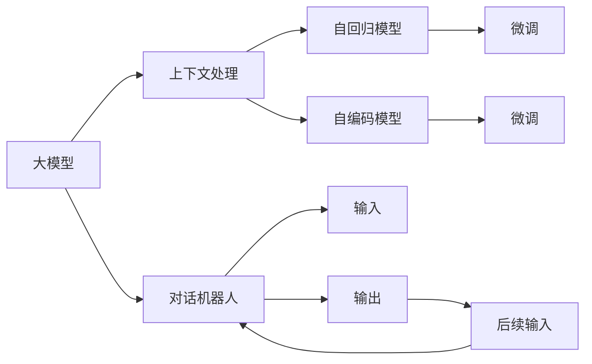

                 

# 大模型问答机器人如何处理上下文

## 1. 背景介绍

随着人工智能技术的飞速发展，大模型问答机器人正日益成为智能客服、知识管理、信息检索等应用场景中的关键工具。然而，对于问答机器人来说，处理上下文信息是其区别于传统搜索和推荐系统的核心优势。本文将从大模型的架构原理、核心算法、以及实际应用场景三个层面，详细探讨大模型问答机器人如何高效处理上下文信息。

## 2. 核心概念与联系

### 2.1 核心概念概述

本节将介绍几个与大模型问答机器人紧密相关的核心概念及其之间的联系。

- **大模型**：通常指的是由深度学习模型构建的大规模、高性能的模型，其参数数量往往以亿计。这些模型基于大量数据进行预训练，能够在不同领域的应用中展现强大的泛化能力。

- **上下文处理**：指的是模型在处理输入信息时，能够理解并记住之前的信息，并以此来生成更准确、相关的输出。这种能力对于问答机器人来说尤为重要，因为问答机器人通常需要根据用户的历史查询记录、对话历史来生成回应。

- **自回归模型**：指模型在生成下一个词时，依赖于之前所有已经生成的词。比如GPT系列模型就是典型的自回归模型。

- **自编码模型**：指模型在生成下一个词时，只依赖于之前生成的几个词。比如BERT模型就是典型的自编码模型。

- **Transformer**：一种基于注意力机制的深度学习模型，能够处理长序列信息，同时保持高效的计算性能。Transformer是当前大模型中的主流架构。

- **微调**：指在大模型上针对特定任务进行有监督学习，使得模型能够适应新任务。微调可以显著提升模型在特定任务上的性能。

这些概念通过以下Mermaid流程图联系起来，展示了大模型问答机器人的核心架构和处理流程：



在这个流程图中，大模型接收输入（`H`），通过上下文处理模块（`B`）理解并记住之前的输入（`I`和`J`），并结合自回归模型（`C`）或自编码模型（`D`）生成输出（`I`），然后返回给用户，并接受新的输入（`J`），继续下一轮的对话。

## 3. 核心算法原理 & 具体操作步骤

### 3.1 算法原理概述

大模型问答机器人通过上下文处理机制，能够在多轮对话中理解和记忆用户的历史查询记录。这使得问答机器人能够提供更加个性化和连贯的回复。其核心算法原理包括以下几个方面：

- **自回归模型**：在生成下一个词时，模型只依赖于之前生成的几个词。这意味着模型可以很容易地处理长序列信息，并且能够记住之前的信息。

- **自编码模型**：在生成下一个词时，模型依赖于之前生成的所有词。这意味着模型可以学习到更丰富的语义信息，但同时也会增加计算复杂度。

- **Transformer架构**：Transformer是一种基于注意力机制的模型，能够高效地处理长序列信息，同时保持较低的计算复杂度。Transformer在生成每个词时，会通过注意力机制计算与所有其他词的关联，从而生成更加准确的输出。

- **微调**：微调指的是在大模型上针对特定任务进行有监督学习，使得模型能够适应新任务。微调可以显著提升模型在特定任务上的性能，包括问答、文本分类、情感分析等。

### 3.2 算法步骤详解

大模型问答机器人的核心算法步骤包括：

1. **输入预处理**：将用户输入的文本转换成模型可以理解的格式，包括分词、标准化等。

2. **上下文处理**：利用自回归或自编码模型，将用户的历史查询记录与当前查询结合起来，形成一个连续的上下文向量。

3. **模型生成**：通过Transformer模型生成与上下文向量最相关的回复。生成过程包括前向传播和后向传播，利用注意力机制计算每个词的相关性。

4. **输出后处理**：将生成的回复进行后处理，如去重、格式化、分句等，以便用户能够更好地理解。

5. **反馈循环**：将用户的反馈（如满意度、进一步的问题等）重新输入模型，进行下一轮对话。

### 3.3 算法优缺点

大模型问答机器人具有以下优点：

- **高效性**：利用Transformer模型的高效计算性能，能够处理长序列信息，并且能够快速生成回复。

- **连贯性**：通过上下文处理机制，模型能够记住之前的信息，生成连贯、一致的回复。

- **个性化**：通过微调机制，模型可以适应不同的任务和场景，提供更加个性化的服务。

同时，也存在一些缺点：

- **计算资源需求高**：由于模型的规模较大，计算资源需求较高，需要高性能的GPU或TPU。

- **数据需求大**：模型的训练和微调需要大量的标注数据，对于数据量小的场景，可能难以获得足够的标注数据。

- **推理成本高**：由于模型的复杂性，推理过程的计算成本较高，对于实时应用，需要优化推理速度。

- **上下文长度限制**：由于计算资源的限制，模型可能无法处理过长的上下文信息。

### 3.4 算法应用领域

大模型问答机器人广泛应用于以下领域：

- **智能客服**：通过上下文处理机制，智能客服机器人能够理解用户的历史查询记录，提供更加个性化的服务。

- **知识管理**：利用微调机制，知识管理机器人能够从大量文本中提取知识，并提供精准的问答服务。

- **信息检索**：通过上下文处理机制，信息检索系统能够理解用户的查询意图，并提供更相关的搜索结果。

- **对话系统**：大模型问答机器人能够构建连贯、一致的对话系统，提高用户的交互体验。

- **自然语言处理**：问答机器人是自然语言处理的重要应用之一，通过上下文处理和生成，提升模型的自然语言处理能力。

## 4. 数学模型和公式 & 详细讲解 & 举例说明

### 4.1 数学模型构建

大模型问答机器人通常基于Transformer模型构建。Transformer模型由编码器和解码器两部分组成，编码器用于编码输入序列，解码器用于生成输出序列。

编码器由多层自注意力机制和前馈神经网络组成，每个编码器层包含两个子层：自注意力层和前馈层。解码器也由类似的结构组成，但解码器会在生成输出时，利用注意力机制考虑之前的输入信息。

### 4.2 公式推导过程

Transformer模型的核心公式为自注意力机制：

$$
Attention(Q, K, V) = softmax(\frac{QK^T}{\sqrt{d_k}})V
$$

其中，$Q$、$K$、$V$分别为查询向量、键向量和值向量，$d_k$为向量维度。注意力机制用于计算每个词与其他词的相关性，从而生成更准确的回复。

### 4.3 案例分析与讲解

假设有一个用户询问“今天天气怎么样？”，大模型问答机器人首先需要进行输入预处理，将问题转换为模型可以理解的格式。然后，利用上下文处理机制，将用户之前的问题和历史记录结合，形成一个连续的上下文向量。接着，使用Transformer模型生成与上下文向量最相关的回复，并经过后处理后返回给用户。

## 5. 项目实践：代码实例和详细解释说明

### 5.1 开发环境搭建

开发大模型问答机器人需要高性能的计算资源，通常需要使用GPU或TPU。以下是搭建开发环境的详细步骤：

1. 安装Anaconda：从官网下载并安装Anaconda，用于创建独立的Python环境。

2. 创建并激活虚拟环境：
```bash
conda create -n myenv python=3.8 
conda activate myenv
```

3. 安装PyTorch：根据CUDA版本，从官网获取对应的安装命令。例如：
```bash
conda install pytorch torchvision torchaudio cudatoolkit=11.1 -c pytorch -c conda-forge
```

4. 安装Transformers库：
```bash
pip install transformers
```

5. 安装各类工具包：
```bash
pip install numpy pandas scikit-learn matplotlib tqdm jupyter notebook ipython
```

完成上述步骤后，即可在`myenv`环境中开始开发。

### 5.2 源代码详细实现

以下是一个使用Transformers库实现大模型问答机器人的PyTorch代码示例：

```python
import torch
from transformers import BertTokenizer, BertForQuestionAnswering

# 加载模型和tokenizer
model = BertForQuestionAnswering.from_pretrained('bert-base-uncased')
tokenizer = BertTokenizer.from_pretrained('bert-base-uncased')

# 定义问题-答案对
question = "今天天气怎么样？"
context = "今天是晴天，气温28摄氏度。"

# 对问题进行编码
encoded_question = tokenizer(question, return_tensors='pt')
encoded_question = encoded_question.to(device)

# 对上下文进行编码
encoded_context = tokenizer(context, return_tensors='pt')
encoded_context = encoded_context.to(device)

# 对上下文进行处理，生成与上下文向量最相关的答案
outputs = model(question=encoded_question['input_ids'], context=encoded_context['input_ids'], return_dict=True)
answer_start = outputs.start_logits.argmax().item()
answer_end = outputs.end_logits.argmax().item()

# 将答案转换为文本形式
answer = tokenizer.decode(encoded_context['input_ids'][0][answer_start:answer_end+1])

# 打印答案
print(f"模型预测的答案为：{answer}")
```

### 5.3 代码解读与分析

这个代码示例展示了如何使用Transformers库构建大模型问答机器人。首先，加载预训练的Bert模型和tokenizer。然后，定义问题-答案对，并使用tokenizer将问题编码为模型可以理解的格式。接着，使用模型生成与上下文向量最相关的答案，并将答案转换为文本形式。

## 6. 实际应用场景

### 6.1 智能客服系统

智能客服系统是大模型问答机器人的典型应用场景之一。通过上下文处理机制，智能客服机器人能够理解用户的历史查询记录，提供更加个性化的服务。例如，当用户咨询“退货流程是什么？”时，机器人可以回忆起之前的退货咨询记录，并提供更准确的解答。

### 6.2 知识管理

知识管理是大模型问答机器人的另一个重要应用场景。利用微调机制，知识管理机器人能够从大量文本中提取知识，并提供精准的问答服务。例如，当用户询问“机器学习有哪些主要算法？”时，知识管理机器人可以从知识库中提取相关信息，并生成详细的回答。

### 6.3 信息检索

信息检索系统利用上下文处理机制，能够理解用户的查询意图，并提供更相关的搜索结果。例如，当用户搜索“如何使用机器学习进行图像识别？”时，信息检索系统可以根据之前的查询记录，推荐相关的机器学习资源和教程。

### 6.4 未来应用展望

随着大模型问答机器人的不断发展，未来的应用前景将更加广阔。以下是几个可能的发展方向：

1. **多模态信息处理**：将文本、图像、音频等多种模态的信息结合起来，提升系统的理解和生成能力。

2. **实时交互**：利用高性能的GPU或TPU，实现实时交互功能，提升用户体验。

3. **跨语言处理**：构建跨语言的问答系统，解决语言障碍问题，拓展国际市场。

4. **知识图谱融合**：将知识图谱与大模型结合，提升系统的知识整合能力。

5. **伦理和隐私保护**：在模型训练和应用中引入伦理和隐私保护机制，确保数据和模型的安全。

## 7. 工具和资源推荐

### 7.1 学习资源推荐

为了帮助开发者系统掌握大模型问答机器人的理论和实践，这里推荐一些优质的学习资源：

1. 《Transformers in Natural Language Processing》系列博文：由大模型技术专家撰写，深入浅出地介绍了Transformer原理和应用。

2. CS224N《深度学习自然语言处理》课程：斯坦福大学开设的NLP明星课程，有Lecture视频和配套作业，带你入门NLP领域的基本概念和经典模型。

3. 《Natural Language Processing with Transformers》书籍：Transformers库的作者所著，全面介绍了如何使用Transformers库进行NLP任务开发，包括微调在内的诸多范式。

4. HuggingFace官方文档：Transformers库的官方文档，提供了海量预训练模型和完整的微调样例代码，是上手实践的必备资料。

5. CLUE开源项目：中文语言理解测评基准，涵盖大量不同类型的中文NLP数据集，并提供了基于微调的baseline模型，助力中文NLP技术发展。

通过对这些资源的学习实践，相信你一定能够快速掌握大模型问答机器人的精髓，并用于解决实际的NLP问题。

### 7.2 开发工具推荐

高效的开发离不开优秀的工具支持。以下是几款用于大模型问答机器人开发的常用工具：

1. PyTorch：基于Python的开源深度学习框架，灵活动态的计算图，适合快速迭代研究。大部分预训练语言模型都有PyTorch版本的实现。

2. TensorFlow：由Google主导开发的开源深度学习框架，生产部署方便，适合大规模工程应用。同样有丰富的预训练语言模型资源。

3. Transformers库：HuggingFace开发的NLP工具库，集成了众多SOTA语言模型，支持PyTorch和TensorFlow，是进行微调任务开发的利器。

4. Weights & Biases：模型训练的实验跟踪工具，可以记录和可视化模型训练过程中的各项指标，方便对比和调优。与主流深度学习框架无缝集成。

5. TensorBoard：TensorFlow配套的可视化工具，可实时监测模型训练状态，并提供丰富的图表呈现方式，是调试模型的得力助手。

6. Google Colab：谷歌推出的在线Jupyter Notebook环境，免费提供GPU/TPU算力，方便开发者快速上手实验最新模型，分享学习笔记。

合理利用这些工具，可以显著提升大模型问答机器人的开发效率，加快创新迭代的步伐。

### 7.3 相关论文推荐

大模型问答机器人领域的研究始于学界对语言模型的持续探索。以下是几篇奠基性的相关论文，推荐阅读：

1. Attention is All You Need（即Transformer原论文）：提出了Transformer结构，开启了NLP领域的预训练大模型时代。

2. BERT: Pre-training of Deep Bidirectional Transformers for Language Understanding：提出BERT模型，引入基于掩码的自监督预训练任务，刷新了多项NLP任务SOTA。

3. Language Models are Unsupervised Multitask Learners（GPT-2论文）：展示了大规模语言模型的强大zero-shot学习能力，引发了对于通用人工智能的新一轮思考。

4. Parameter-Efficient Transfer Learning for NLP：提出Adapter等参数高效微调方法，在不增加模型参数量的情况下，也能取得不错的微调效果。

5. Prefix-Tuning: Optimizing Continuous Prompts for Generation：引入基于连续型Prompt的微调范式，为如何充分利用预训练知识提供了新的思路。

6. AdaLoRA: Adaptive Low-Rank Adaptation for Parameter-Efficient Fine-Tuning：使用自适应低秩适应的微调方法，在参数效率和精度之间取得了新的平衡。

这些论文代表了大模型问答机器人领域的发展脉络。通过学习这些前沿成果，可以帮助研究者把握学科前进方向，激发更多的创新灵感。

## 8. 总结：未来发展趋势与挑战

### 8.1 总结

本文对大模型问答机器人的核心算法原理和操作步骤进行了全面系统的介绍。首先阐述了大模型问答机器人在处理上下文方面的优势和挑战，明确了微调和上下文处理机制在模型中的重要性。其次，从原理到实践，详细讲解了微调的数学模型和详细步骤，给出了微调任务开发的完整代码实例。同时，本文还广泛探讨了微调方法在智能客服、知识管理、信息检索等多个领域的应用前景，展示了微调范式的巨大潜力。此外，本文精选了微调技术的各类学习资源，力求为读者提供全方位的技术指引。

通过本文的系统梳理，可以看到，大模型问答机器人通过上下文处理机制，能够在多轮对话中理解和记忆用户的历史查询记录，提供更加个性化和连贯的回复。微调机制使得模型能够适应不同的任务和场景，提供更加精准的问答服务。未来，随着技术的不断发展，大模型问答机器人将在更多领域得到应用，为人工智能技术落地应用提供新的突破口。

### 8.2 未来发展趋势

展望未来，大模型问答机器人将呈现以下几个发展趋势：

1. **模型规模持续增大**：随着算力成本的下降和数据规模的扩张，预训练语言模型的参数量还将持续增长。超大规模语言模型蕴含的丰富语言知识，将使问答机器人能够更好地理解复杂的查询。

2. **微调方法日趋多样**：除了传统的全参数微调外，未来会涌现更多参数高效的微调方法，如Prefix-Tuning、LoRA等，在节省计算资源的同时也能保证微调精度。

3. **持续学习成为常态**：随着数据分布的不断变化，微调模型也需要持续学习新知识以保持性能。如何在不遗忘原有知识的同时，高效吸收新样本信息，将成为重要的研究课题。

4. **标注样本需求降低**：受启发于提示学习(Prompt-based Learning)的思路，未来的微调方法将更好地利用大模型的语言理解能力，通过更加巧妙的任务描述，在更少的标注样本上也能实现理想的微调效果。

5. **多模态微调崛起**：当前微调主要聚焦于纯文本数据，未来会进一步拓展到图像、视频、语音等多模态数据微调。多模态信息的融合，将显著提升问答机器人对现实世界的理解和建模能力。

6. **模型通用性增强**：经过海量数据的预训练和多领域任务的微调，未来的问答机器人将具备更强大的常识推理和跨领域迁移能力，逐步迈向通用人工智能(AGI)的目标。

以上趋势凸显了大模型问答机器人的广阔前景。这些方向的探索发展，必将进一步提升问答系统的性能和应用范围，为人工智能技术在垂直行业的规模化落地提供新的可能性。

### 8.3 面临的挑战

尽管大模型问答机器人已经取得了瞩目成就，但在迈向更加智能化、普适化应用的过程中，它仍面临着诸多挑战：

1. **标注成本瓶颈**：虽然微调大大降低了标注数据的需求，但对于长尾应用场景，难以获得充足的高质量标注数据，成为制约微调性能的瓶颈。如何进一步降低微调对标注样本的依赖，将是一大难题。

2. **模型鲁棒性不足**：当前微调模型面对域外数据时，泛化性能往往大打折扣。对于测试样本的微小扰动，微调模型的预测也容易发生波动。如何提高微调模型的鲁棒性，避免灾难性遗忘，还需要更多理论和实践的积累。

3. **推理效率有待提高**：大规模语言模型虽然精度高，但在实际部署时往往面临推理速度慢、内存占用大等效率问题。如何在保证性能的同时，简化模型结构，提升推理速度，优化资源占用，将是重要的优化方向。

4. **可解释性亟需加强**：当前微调模型更像是"黑盒"系统，难以解释其内部工作机制和决策逻辑。对于医疗、金融等高风险应用，算法的可解释性和可审计性尤为重要。如何赋予微调模型更强的可解释性，将是亟待攻克的难题。

5. **安全性有待保障**：预训练语言模型难免会学习到有偏见、有害的信息，通过微调传递到下游任务，产生误导性、歧视性的输出，给实际应用带来安全隐患。如何从数据和算法层面消除模型偏见，避免恶意用途，确保输出的安全性，也将是重要的研究课题。

6. **知识整合能力不足**：现有的微调模型往往局限于任务内数据，难以灵活吸收和运用更广泛的先验知识。如何让微调过程更好地与外部知识库、规则库等专家知识结合，形成更加全面、准确的信息整合能力，还有很大的想象空间。

正视微调面临的这些挑战，积极应对并寻求突破，将是大模型问答机器人走向成熟的必由之路。相信随着学界和产业界的共同努力，这些挑战终将一一被克服，大模型问答机器人必将在构建人机协同的智能时代中扮演越来越重要的角色。

### 8.4 研究展望

面对大模型问答机器人所面临的种种挑战，未来的研究需要在以下几个方面寻求新的突破：

1. **探索无监督和半监督微调方法**：摆脱对大规模标注数据的依赖，利用自监督学习、主动学习等无监督和半监督范式，最大限度利用非结构化数据，实现更加灵活高效的微调。

2. **研究参数高效和计算高效的微调范式**：开发更加参数高效的微调方法，在固定大部分预训练参数的同时，只更新极少量的任务相关参数。同时优化微调模型的计算图，减少前向传播和反向传播的资源消耗，实现更加轻量级、实时性的部署。

3. **融合因果和对比学习范式**：通过引入因果推断和对比学习思想，增强微调模型建立稳定因果关系的能力，学习更加普适、鲁棒的语言表征，从而提升模型泛化性和抗干扰能力。

4. **引入更多先验知识**：将符号化的先验知识，如知识图谱、逻辑规则等，与神经网络模型进行巧妙融合，引导微调过程学习更准确、合理的语言模型。同时加强不同模态数据的整合，实现视觉、语音等多模态信息与文本信息的协同建模。

5. **结合因果分析和博弈论工具**：将因果分析方法引入微调模型，识别出模型决策的关键特征，增强输出解释的因果性和逻辑性。借助博弈论工具刻画人机交互过程，主动探索并规避模型的脆弱点，提高系统稳定性。

6. **纳入伦理道德约束**：在模型训练目标中引入伦理导向的评估指标，过滤和惩罚有偏见、有害的输出倾向。同时加强人工干预和审核，建立模型行为的监管机制，确保输出符合人类价值观和伦理道德。

这些研究方向的探索，必将引领大模型问答机器人技术迈向更高的台阶，为构建安全、可靠、可解释、可控的智能系统铺平道路。面向未来，大模型问答机器人还需要与其他人工智能技术进行更深入的融合，如知识表示、因果推理、强化学习等，多路径协同发力，共同推动自然语言理解和智能交互系统的进步。只有勇于创新、敢于突破，才能不断拓展语言模型的边界，让智能技术更好地造福人类社会。

---

作者：禅与计算机程序设计艺术 / Zen and the Art of Computer Programming

