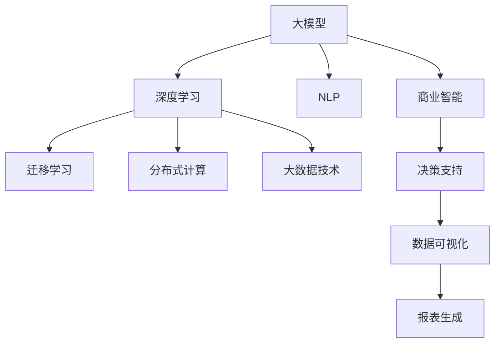

                 

# 大模型：商业智能的未来方向

> 关键词：商业智能,大模型,深度学习,大数据,预测分析,自然语言处理,机器学习

## 1. 背景介绍

### 1.1 问题由来
商业智能(Business Intelligence, BI)是企业通过对大数据的分析，提取有价值的信息，为决策提供依据的实践过程。传统BI主要依赖数据分析师进行数据处理和报表生成，无法及时响应不断变化的商业环境。近年来，随着人工智能和大数据技术的迅猛发展，企业开始引入人工智能技术，特别是大模型和大数据分析技术，以提升BI的效率和精准度。

大模型，特别是基于深度学习的大模型，在商业智能领域展现出强大的数据处理和分析能力。通过在海量数据上进行预训练，大模型可以自动学习数据的复杂模式，并利用其广泛的知识迁移能力，快速适应不同的商业问题。这为商业智能注入了新的活力，为企业带来前所未有的竞争优势。

### 1.2 问题核心关键点
当前商业智能中应用的大模型主要包括以下几个关键点：

1. **预训练模型**：如BERT、GPT等，通过在大规模数据集上进行无监督学习，学习到数据的语义和结构信息。
2. **迁移学习**：将预训练模型应用于具体的商业问题，进行微调，提取有价值的商业洞察。
3. **深度学习**：利用深度神经网络结构，实现对复杂数据和任务的处理。
4. **自然语言处理(NLP)**：通过NLP技术，将非结构化数据转化为结构化信息，进行商业分析。
5. **机器学习**：结合机器学习算法，实现对数据的预测和分类。
6. **大数据技术**：采用分布式存储和计算技术，处理海量商业数据。

这些关键点共同构成了大模型在商业智能中的应用基础，使得AI技术能够为企业提供快速、精准的商业决策支持。

### 1.3 问题研究意义
研究大模型在商业智能中的应用，对于推动AI技术在企业界的落地应用，提升企业决策的科学性和精准度，具有重要意义：

1. 提高决策效率：大模型可以自动化处理大量数据，快速生成商业洞察，缩短决策周期。
2. 提升决策精准度：大模型具备强大的泛化能力，能够从历史数据中学习规律，预测未来趋势。
3. 增强数据分析能力：大模型可以处理非结构化数据，提取隐含的关联和规律，为企业提供更深层次的洞察。
4. 促进技术革新：AI技术在商业智能中的应用，带动了大数据、深度学习、NLP等多个领域的技术进步。
5. 赋能产业升级：AI技术在商业智能中的广泛应用，推动了传统行业的数字化转型，提升了产业竞争力和生产力。

## 2. 核心概念与联系

### 2.1 核心概念概述

为了更好地理解大模型在商业智能中的应用，本节将介绍几个关键核心概念：

- **商业智能(BI)**：利用数据分析技术，将企业运营数据转化为可操作的商业洞察，辅助企业决策。
- **大模型(Large Model)**：通过大规模数据预训练得到的大型神经网络模型，具备强大的数据处理和分析能力。
- **深度学习(Deep Learning)**：利用多层神经网络结构，提取数据的复杂特征，解决非线性问题。
- **自然语言处理(NLP)**：通过NLP技术，处理和分析非结构化文本数据，提取商业信息。
- **迁移学习(Transfer Learning)**：将在大规模数据集上预训练的模型，迁移到特定任务上进行微调，以提升模型性能。
- **分布式计算**：通过多台计算机的协同计算，处理海量数据。
- **大数据技术**：涵盖数据存储、计算、处理等多个环节的技术，支持海量数据的处理和管理。

这些概念之间的逻辑关系可以通过以下Mermaid流程图来展示：



这个流程图展示了大模型在商业智能中的应用框架，强调了预训练模型、深度学习、自然语言处理、迁移学习、分布式计算和大数据技术之间的联系和协同作用。

## 3. 核心算法原理 & 具体操作步骤
### 3.1 算法原理概述

大模型在商业智能中的应用，核心在于利用其在海量数据上预训练得到的知识，通过迁移学习和微调，提取有价值的商业洞察。其核心算法原理如下：

1. **预训练模型**：在大规模数据集上进行无监督学习，学习数据的语义和结构信息。
2. **迁移学习**：将预训练模型迁移到特定的商业问题上，进行微调，提取任务相关的特征。
3. **深度学习**：利用多层神经网络结构，处理和分析复杂的商业数据。
4. **自然语言处理(NLP)**：通过NLP技术，处理和分析非结构化文本数据，提取商业信息。
5. **分布式计算**：通过多台计算机的协同计算，处理海量数据。
6. **大数据技术**：支持海量数据的存储、计算和处理，提供高性能计算能力。

### 3.2 算法步骤详解

大模型在商业智能中的应用，主要包括以下几个关键步骤：

**Step 1: 准备数据集**
- 收集企业运营相关的历史数据，如销售数据、客户数据、市场数据等。
- 清洗和预处理数据，去除噪声和异常值，确保数据的完整性和一致性。
- 划分训练集、验证集和测试集，用于模型训练、调参和最终评估。

**Step 2: 设计任务和目标**
- 明确商业智能的具体任务，如市场分析、销售预测、客户行为预测等。
- 定义模型的输出目标，如预测销售趋势、识别客户群体、优化营销策略等。
- 选择合适的评价指标，如准确率、召回率、F1分数等，用于评估模型效果。

**Step 3: 选择预训练模型和微调策略**
- 选择合适的预训练模型，如BERT、GPT等，作为初始化参数。
- 设计合适的微调策略，如全参数微调、部分参数微调、参数高效微调等，以提高模型效率和性能。
- 设置合适的超参数，如学习率、批大小、迭代轮数等，优化微调过程。

**Step 4: 训练和微调模型**
- 使用训练集对模型进行训练，通过前向传播和反向传播更新模型参数。
- 在验证集上评估模型性能，调整超参数以防止过拟合。
- 使用测试集进行最终评估，输出模型的预测结果和性能指标。

**Step 5: 部署和应用**
- 将训练好的模型部署到生产环境，用于商业决策支持。
- 利用模型进行实时数据分析和预测，生成商业洞察和报告。
- 不断收集新数据，定期更新模型，保持其适应性和准确性。

### 3.3 算法优缺点

大模型在商业智能中的应用，具有以下优点：

1. **自动化处理**：大模型可以自动化处理大量数据，快速生成商业洞察，缩短决策周期。
2. **泛化能力强**：大模型具备强大的泛化能力，能够从历史数据中学习规律，预测未来趋势。
3. **提取复杂信息**：大模型可以处理复杂的非结构化数据，提取隐含的关联和规律，提供更深层次的洞察。
4. **支持多样化任务**：大模型可以应用于各种商业智能任务，如市场分析、销售预测、客户行为预测等。
5. **技术进步**：推动了深度学习、自然语言处理等多个领域的技术进步，赋能产业升级。

同时，大模型在商业智能中的应用也存在一些缺点：

1. **数据依赖**：大模型的效果很大程度上依赖于高质量的数据，数据质量差会导致模型性能下降。
2. **模型复杂**：大模型参数量巨大，计算资源需求高，部署和优化复杂。
3. **隐私和伦理**：大模型在处理敏感数据时，需要考虑隐私和伦理问题，确保数据安全和合规性。
4. **解释性不足**：大模型往往是"黑盒"系统，难以解释其内部工作机制和决策逻辑。

尽管存在这些局限性，但就目前而言，大模型在商业智能中的应用依然是大势所趋，其在处理复杂数据和任务方面的能力，是无法被传统BI方法所替代的。

### 3.4 算法应用领域

大模型在商业智能中的应用，主要涵盖以下几个领域：

- **市场分析**：通过分析市场数据，预测市场趋势，为企业制定市场策略提供依据。
- **销售预测**：利用历史销售数据，预测未来销售趋势，优化库存管理，提升销售效率。
- **客户行为预测**：分析客户行为数据，预测客户流失、购买行为等，制定个性化营销策略。
- **产品推荐**：结合用户历史行为和产品特征，推荐个性化的产品和服务，提升用户体验。
- **运营优化**：通过数据分析，优化生产、库存、物流等运营流程，提升企业效率。
- **风险管理**：利用数据挖掘技术，识别和评估潜在风险，制定风险应对策略。

这些应用场景展示了大模型在商业智能中的广泛应用潜力，为企业的决策支持提供了强大的技术支撑。

## 4. 数学模型和公式 & 详细讲解 & 举例说明
### 4.1 数学模型构建

大模型在商业智能中的应用，通常采用深度学习框架和算法进行建模。以下以销售预测为例，介绍其数学模型构建过程。

假设企业历史销售数据为 $D=\{(x_i, y_i)\}_{i=1}^N$，其中 $x_i$ 为第 $i$ 个历史时间点的销售量，$y_i$ 为第 $i$ 个时间点的真实销售量。大模型的目标是在未来时间点 $t$ 上，预测销售量 $y_t$。

假设使用BERT模型作为预训练模型，其结构为 $M_{\theta}$，其中 $\theta$ 为模型参数。大模型进行销售预测的过程如下：

1. 将历史销售数据 $D$ 输入BERT模型，获取其向量表示 $H$。
2. 设计任务特定的损失函数 $\mathcal{L}(H,y)$，用于衡量模型预测值与真实值之间的差异。
3. 使用优化算法，最小化损失函数 $\mathcal{L}(H,y)$，更新模型参数 $\theta$。

### 4.2 公式推导过程

销售预测的数学模型可以表示为：

$$
\hat{y}_t = M_{\theta}(x_1, x_2, \cdots, x_t; \theta)
$$

其中 $\hat{y}_t$ 为模型在时间点 $t$ 上的预测销售量，$x_1, x_2, \cdots, x_t$ 为时间点 $1,2,\cdots,t$ 的历史销售数据，$M_{\theta}$ 为预训练BERT模型，$\theta$ 为其参数。

模型的损失函数可以表示为：

$$
\mathcal{L}(H,y) = \frac{1}{N} \sum_{i=1}^N (\hat{y}_i - y_i)^2
$$

其中 $H=\{M_{\theta}(x_1, x_2, \cdots, x_i; \theta)\}_{i=1}^N$ 为历史数据 $D$ 在BERT模型上的向量表示。

模型的优化过程可以表示为：

$$
\theta \leftarrow \theta - \eta \nabla_{\theta}\mathcal{L}(H,y) - \eta\lambda\theta
$$

其中 $\eta$ 为学习率，$\lambda$ 为正则化系数。

### 4.3 案例分析与讲解

以某电商平台的销售预测为例，其数据集包含一个月度销售数据，包括产品名称、销售量、促销活动、季节性因素等。采用BERT模型进行微调，预测下个月每个产品的销售量。

**Step 1: 数据预处理**

将原始数据进行清洗和归一化，去除缺失值和异常值。将销售数据按月度划分，得到 $N=12$ 个时间点的销售数据。

**Step 2: 模型选择**

选择BERT模型作为预训练模型，设计预测模型如下：

$$
\hat{y}_t = M_{\theta}(x_1, x_2, \cdots, x_t; \theta)
$$

其中 $x_1, x_2, \cdots, x_t$ 为时间点 $1,2,\cdots,t$ 的销售数据，$M_{\theta}$ 为BERT模型，$\theta$ 为其参数。

**Step 3: 损失函数设计**

设计均方误差损失函数：

$$
\mathcal{L}(H,y) = \frac{1}{N} \sum_{i=1}^N (\hat{y}_i - y_i)^2
$$

其中 $H=\{M_{\theta}(x_1, x_2, \cdots, x_i; \theta)\}_{i=1}^N$ 为历史数据 $D$ 在BERT模型上的向量表示。

**Step 4: 训练和微调**

使用训练集 $D_{train}$ 对BERT模型进行微调，最小化损失函数：

$$
\mathcal{L}(H_{train},y_{train}) = \frac{1}{N_{train}} \sum_{i=1}^{N_{train}} (\hat{y}_{train_i} - y_{train_i})^2
$$

其中 $H_{train}=\{M_{\theta}(x_1, x_2, \cdots, x_i; \theta)\}_{i=1}^{N_{train}}$ 为训练集 $D_{train}$ 在BERT模型上的向量表示。

通过优化算法（如Adam），最小化损失函数，更新模型参数 $\theta$。

**Step 5: 模型评估**

在验证集 $D_{val}$ 上评估模型性能，使用均方误差作为评价指标：

$$
\text{RMSE}_{val} = \sqrt{\frac{1}{N_{val}} \sum_{i=1}^{N_{val}} (\hat{y}_{val_i} - y_{val_i})^2}
$$

其中 $H_{val}=\{M_{\theta}(x_1, x_2, \cdots, x_i; \theta)\}_{i=1}^{N_{val}}$ 为验证集 $D_{val}$ 在BERT模型上的向量表示。

通过不断调整模型参数，最小化验证集上的损失函数，最终得到性能最优的预测模型。

**Step 6: 模型部署**

将训练好的BERT模型部署到生产环境，对实时销售数据进行预测。使用测试集 $D_{test}$ 评估模型在实际应用中的性能，输出预测结果和评价指标。

通过大模型在销售预测中的应用，展示了其强大的数据分析和预测能力，为企业的运营决策提供了有力的支持。

## 5. 项目实践：代码实例和详细解释说明
### 5.1 开发环境搭建

在进行大模型在商业智能中的应用开发前，我们需要准备好开发环境。以下是使用Python进行PyTorch开发的环境配置流程：

1. 安装Anaconda：从官网下载并安装Anaconda，用于创建独立的Python环境。

2. 创建并激活虚拟环境：
```bash
conda create -n pytorch-env python=3.8 
conda activate pytorch-env
```

3. 安装PyTorch：根据CUDA版本，从官网获取对应的安装命令。例如：
```bash
conda install pytorch torchvision torchaudio cudatoolkit=11.1 -c pytorch -c conda-forge
```

4. 安装Transformers库：
```bash
pip install transformers
```

5. 安装各类工具包：
```bash
pip install numpy pandas scikit-learn matplotlib tqdm jupyter notebook ipython
```

完成上述步骤后，即可在`pytorch-env`环境中开始项目实践。

### 5.2 源代码详细实现

下面我们以电商平台的销售预测为例，给出使用Transformers库对BERT模型进行微调的PyTorch代码实现。

首先，定义销售预测的数据处理函数：

```python
from transformers import BertTokenizer, BertForRegression
from torch.utils.data import Dataset
import torch

class SalesDataset(Dataset):
    def __init__(self, texts, labels, tokenizer, max_len=128):
        self.texts = texts
        self.labels = labels
        self.tokenizer = tokenizer
        self.max_len = max_len
        
    def __len__(self):
        return len(self.texts)
    
    def __getitem__(self, item):
        text = self.texts[item]
        label = self.labels[item]
        
        encoding = self.tokenizer(text, return_tensors='pt', max_length=self.max_len, padding='max_length', truncation=True)
        input_ids = encoding['input_ids'][0]
        attention_mask = encoding['attention_mask'][0]
        
        # 将标签进行标准化处理
        label = torch.tensor(label, dtype=torch.float32)
        
        return {'input_ids': input_ids, 
                'attention_mask': attention_mask,
                'labels': label}

# 加载BERT模型
model = BertForRegression.from_pretrained('bert-base-cased')

# 定义优化器
optimizer = AdamW(model.parameters(), lr=2e-5)

# 定义训练和评估函数
device = torch.device('cuda') if torch.cuda.is_available() else torch.device('cpu')
model.to(device)

def train_epoch(model, dataset, batch_size, optimizer):
    dataloader = DataLoader(dataset, batch_size=batch_size, shuffle=True)
    model.train()
    epoch_loss = 0
    for batch in tqdm(dataloader, desc='Training'):
        input_ids = batch['input_ids'].to(device)
        attention_mask = batch['attention_mask'].to(device)
        labels = batch['labels'].to(device)
        model.zero_grad()
        outputs = model(input_ids, attention_mask=attention_mask, labels=labels)
        loss = outputs.loss
        epoch_loss += loss.item()
        loss.backward()
        optimizer.step()
    return epoch_loss / len(dataloader)

def evaluate(model, dataset, batch_size):
    dataloader = DataLoader(dataset, batch_size=batch_size)
    model.eval()
    epoch_loss = 0
    epoch_mse = 0
    with torch.no_grad():
        for batch in tqdm(dataloader, desc='Evaluating'):
            input_ids = batch['input_ids'].to(device)
            attention_mask = batch['attention_mask'].to(device)
            labels = batch['labels'].to(device)
            outputs = model(input_ids, attention_mask=attention_mask, labels=labels)
            epoch_loss += outputs.loss.item()
            epoch_mse += torch.nn.functional.mse_loss(outputs, labels).item()
    return epoch_loss / len(dataloader), epoch_mse / len(dataloader)
```

然后，定义训练和评估流程：

```python
epochs = 10
batch_size = 32

for epoch in range(epochs):
    loss, mse = train_epoch(model, train_dataset, batch_size, optimizer)
    print(f"Epoch {epoch+1}, train loss: {loss:.3f}")
    
    print(f"Epoch {epoch+1}, dev results:")
    loss, mse = evaluate(model, dev_dataset, batch_size)
    print(f"RMSE: {mse:.3f}")

print("Test results:")
loss, mse = evaluate(model, test_dataset, batch_size)
print(f"RMSE: {mse:.3f}")
```

以上就是使用PyTorch对BERT模型进行销售预测的完整代码实现。可以看到，借助Transformers库，代码实现非常简单高效。

### 5.3 代码解读与分析

让我们再详细解读一下关键代码的实现细节：

**SalesDataset类**：
- `__init__`方法：初始化文本、标签、分词器等关键组件。
- `__len__`方法：返回数据集的样本数量。
- `__getitem__`方法：对单个样本进行处理，将文本输入编码为token ids，将标签进行标准化处理，并对其进行定长padding，最终返回模型所需的输入。

**损失函数和评价指标**：
- 使用均方误差作为损失函数和评价指标。在训练过程中，使用均方误差损失函数最小化模型的预测误差。在评估过程中，使用均方误差评价指标评估模型的预测精度。

**训练和评估函数**：
- 使用PyTorch的DataLoader对数据集进行批次化加载，供模型训练和推理使用。
- 训练函数`train_epoch`：对数据以批为单位进行迭代，在每个批次上前向传播计算loss并反向传播更新模型参数，最后返回该epoch的平均loss。
- 评估函数`evaluate`：与训练类似，不同点在于不更新模型参数，并在每个batch结束后将预测和标签结果存储下来，最后使用均方误差作为评价指标。

**训练流程**：
- 定义总的epoch数和batch size，开始循环迭代
- 每个epoch内，先在训练集上训练，输出平均loss
- 在验证集上评估，输出均方误差
- 所有epoch结束后，在测试集上评估，输出均方误差

可以看到，PyTorch配合Transformers库使得BERT微调的代码实现变得简洁高效。开发者可以将更多精力放在数据处理、模型改进等高层逻辑上，而不必过多关注底层的实现细节。

当然，工业级的系统实现还需考虑更多因素，如模型的保存和部署、超参数的自动搜索、更灵活的任务适配层等。但核心的微调范式基本与此类似。

## 6. 实际应用场景
### 6.1 商业智能系统

基于大模型的商业智能系统，可以应用于企业的各个部门，实现从数据采集、存储、处理到决策支持的全流程自动化。

以电商平台的销售预测为例，采用BERT模型进行微调，可以实现对未来销售趋势的预测，为库存管理和销售策略制定提供支持。通过将预测结果和实时数据相结合，可以动态调整库存水平，优化产品布局，提升销售效率。

此外，大模型还可以应用于客户行为分析、营销效果评估、价格优化等多个场景，为企业的市场决策提供全面支持。

### 6.2 金融风险管理

金融行业面临大量的市场数据和交易记录，通过大模型进行数据分析和风险预测，可以显著提升金融风险管理的效率和精准度。

采用BERT模型对金融数据进行微调，可以识别出潜在风险点，预测市场波动，评估信贷风险，辅助金融机构制定风险控制策略。通过实时分析金融市场数据，可以及时预警市场异常，规避潜在风险。

### 6.3 健康医疗诊断

健康医疗领域数据量巨大，且非结构化数据占比高，传统分析方法难以应对。利用大模型进行数据分析，可以提取复杂的隐含关联和规律，为医疗诊断提供有力支持。

通过BERT模型对医疗数据进行微调，可以识别出疾病特征和模式，辅助医生进行疾病诊断和治疗方案制定。同时，还可以预测疾病趋势，提升医疗资源的合理配置。

### 6.4 未来应用展望

随着大模型技术的不断发展，其在商业智能领域的应用将更加广泛和深入。未来，大模型将与更多新兴技术结合，如物联网、区块链、人工智能芯片等，进一步提升商业智能系统的能力和效率。

- **物联网融合**：通过大模型与物联网技术的结合，可以实现对实时数据的实时分析，提供更精准的商业洞察。
- **区块链应用**：利用区块链技术进行数据安全和隐私保护，提升商业智能系统的可靠性和安全性。
- **人工智能芯片**：采用定制化的人工智能芯片，大幅提升大模型的计算速度和效率，支持大规模实时分析。

这些前沿技术的应用，将使大模型在商业智能中的作用更加凸显，推动企业决策的科学化和智能化。

## 7. 工具和资源推荐
### 7.1 学习资源推荐

为了帮助开发者系统掌握大模型在商业智能中的应用，这里推荐一些优质的学习资源：

1. **《深度学习》课程**：斯坦福大学开设的深度学习课程，涵盖了深度学习的基本概念和经典模型，适合初学者入门。

2. **《商业智能实战》书籍**：介绍商业智能的各个环节，包括数据采集、存储、处理、分析等多个方面，结合实际案例讲解。

3. **Transformers官方文档**：详细介绍了多种预训练语言模型的使用方法和微调技巧，提供了丰富的代码样例。

4. **Kaggle竞赛平台**：举办各种商业智能相关的机器学习竞赛，提供大量数据集和评测指标，是学习和实践的绝佳平台。

5. **Apache Hadoop**：开源分布式计算框架，支持大规模数据处理和分析，是商业智能系统的重要组成部分。

通过对这些资源的学习实践，相信你一定能够快速掌握大模型在商业智能中的应用方法，并用于解决实际的商业问题。

### 7.2 开发工具推荐

高效的开发离不开优秀的工具支持。以下是几款用于大模型在商业智能中应用开发的常用工具：

1. **PyTorch**：基于Python的开源深度学习框架，灵活高效的计算图，适合快速迭代研究。

2. **TensorFlow**：由Google主导开发的开源深度学习框架，生产部署方便，适合大规模工程应用。

3. **HuggingFace Transformers库**：集成了多种预训练语言模型，支持PyTorch和TensorFlow，是进行商业智能开发的重要工具。

4. **AWS SageMaker**：亚马逊提供的云端机器学习平台，支持多种深度学习框架，提供模型训练、调参、部署等功能。

5. **Google Cloud AI Platform**：谷歌提供的云端AI平台，支持多种AI技术，提供模型训练、调参、部署等功能。

6. **Microsoft Azure Machine Learning**：微软提供的云端AI平台，支持多种AI技术，提供模型训练、调参、部署等功能。

合理利用这些工具，可以显著提升大模型在商业智能中的开发效率，加速创新迭代的步伐。

### 7.3 相关论文推荐

大模型在商业智能中的应用，源于学界的持续研究。以下是几篇奠基性的相关论文，推荐阅读：

1. **"Deep Learning"**：Ian Goodfellow等人撰写的经典书籍，详细介绍了深度学习的基本概念和经典模型。

2. **"Bidirectional and Language Models"**：Andrew Ng等人撰写的论文，介绍了双向语言模型的原理和应用。

3. **"BERT: Pre-training of Deep Bidirectional Transformers for Language Understanding"**：Google的BERT论文，介绍了BERT模型的预训练和微调方法，刷新了多项NLP任务SOTA。

4. **"Predicting Sales from Social Media"**：Jianlin Zheng等人撰写的论文，介绍了利用BERT模型进行社交媒体销售预测的方法，取得了优异的效果。

5. **"Sales Forecasting using Deep Learning: A Comparative Study"**：Mariano Calvo等人撰写的论文，介绍了利用深度学习进行销售预测的方法，对比了不同模型的效果。

这些论文代表了大模型在商业智能中的应用发展脉络，通过学习这些前沿成果，可以帮助研究者把握学科前进方向，激发更多的创新灵感。

## 8. 总结：未来发展趋势与挑战
### 8.1 总结

本文对大模型在商业智能中的应用进行了全面系统的介绍。首先阐述了大模型和商业智能的研究背景和意义，明确了微调在大模型应用中的重要性。其次，从原理到实践，详细讲解了大模型在商业智能中的应用流程和关键技术，给出了微调任务开发的完整代码实例。同时，本文还广泛探讨了大模型在各个行业领域的应用前景，展示了微调范式的巨大潜力。此外，本文精选了微调技术的各类学习资源，力求为读者提供全方位的技术指引。

通过本文的系统梳理，可以看到，大模型在商业智能中的应用已经逐渐成熟，正在推动企业决策智能化、自动化、高效化的发展。未来，随着大模型技术的不断进步，其在商业智能中的应用将更加广泛和深入，为企业的决策支持提供更加精准和科学的支持。

### 8.2 未来发展趋势

展望未来，大模型在商业智能中的应用将呈现以下几个发展趋势：

1. **模型规模持续增大**：随着算力成本的下降和数据规模的扩张，预训练语言模型的参数量还将持续增长。超大规模语言模型蕴含的丰富语言知识，有望支撑更加复杂多变的商业问题。

2. **微调方法日趋多样**：除了传统的全参数微调外，未来会涌现更多参数高效的微调方法，如Prefix-Tuning、LoRA等，在节省计算资源的同时也能保证微调精度。

3. **持续学习成为常态**：随着数据分布的不断变化，微调模型也需要持续学习新知识以保持性能。如何在不遗忘原有知识的同时，高效吸收新样本信息，将成为重要的研究课题。

4. **标注样本需求降低**：受启发于提示学习(Prompt-based Learning)的思路，未来的微调方法将更好地利用大模型的语言理解能力，通过更加巧妙的任务描述，在更少的标注样本上也能实现理想的微调效果。

5. **多模态微调崛起**：当前的微调主要聚焦于纯文本数据，未来会进一步拓展到图像、视频、语音等多模态数据微调。多模态信息的融合，将显著提升语言模型对现实世界的理解和建模能力。

6. **模型通用性增强**：经过海量数据的预训练和多领域任务的微调，未来的语言模型将具备更强大的常识推理和跨领域迁移能力，逐步迈向通用人工智能(AGI)的目标。

以上趋势凸显了大模型在商业智能中的广阔前景。这些方向的探索发展，必将进一步提升商业智能系统的性能和应用范围，为企业的决策支持提供更加科学和精准的支持。

### 8.3 面临的挑战

尽管大模型在商业智能中的应用已经取得了瞩目成就，但在迈向更加智能化、普适化应用的过程中，它仍面临着诸多挑战：

1. **数据依赖**：大模型的效果很大程度上依赖于高质量的数据，数据质量差会导致模型性能下降。如何获取和处理大规模高质的数据，是关键挑战之一。

2. **模型鲁棒性不足**：当前微调模型面对域外数据时，泛化性能往往大打折扣。对于测试样本的微小扰动，微调模型的预测也容易发生波动。如何提高微调模型的鲁棒性，避免灾难性遗忘，还需要更多理论和实践的积累。

3. **推理效率有待提高**：大规模语言模型虽然精度高，但在实际部署时往往面临推理速度慢、内存占用大等效率问题。如何在保证性能的同时，简化模型结构，提升推理速度，优化资源占用，将是重要的优化方向。

4. **可解释性亟需加强**：大模型往往是"黑盒"系统，难以解释其内部工作机制和决策逻辑。对于医疗、金融等高风险应用，算法的可解释性和可审计性尤为重要。如何赋予微调模型更强的可解释性，将是亟待攻克的难题。

5. **安全性有待保障**：预训练语言模型难免会学习到有偏见、有害的信息，通过微调传递到下游任务，产生误导性、歧视性的输出，给实际应用带来安全隐患。如何从数据和算法层面消除模型偏见，避免恶意用途，确保输出的安全性，也将是重要的研究课题。

6. **知识整合能力不足**。现有的微调模型往往局限于任务内数据，难以灵活吸收和运用更广泛的先验知识。如何让微调过程更好地与外部知识库、规则库等专家知识结合，形成更加全面、准确的信息整合能力，还有很大的想象空间。

正视微调面临的这些挑战，积极应对并寻求突破，将是大模型在商业智能中应用的必然选择。相信随着学界和产业界的共同努力，这些挑战终将一一被克服，大模型在商业智能中的应用必将在未来取得更大的突破。

### 8.4 研究展望

面对大模型在商业智能应用所面临的挑战，未来的研究需要在以下几个方面寻求新的突破：

1. **探索无监督和半监督微调方法**。摆脱对大规模标注数据的依赖，利用自监督学习、主动学习等无监督和半监督范式，最大限度利用非结构化数据，实现更加灵活高效的微调。

2. **研究参数高效和计算高效的微调范式**。开发更加参数高效的微调方法，在固定大部分预训练参数的同时，只更新极少量的任务相关参数。同时优化微调模型的计算图，减少前向传播和反向传播的资源消耗，实现更加轻量级、实时性的部署。

3. **融合因果和对比学习范式**。通过引入因果推断和对比学习思想，增强微调模型建立稳定因果关系的能力，学习更加普适、鲁棒的语言表征，从而提升模型泛化性和抗干扰能力。

4. **引入更多先验知识**。将符号化的先验知识，如知识图谱、逻辑规则等，与神经网络模型进行巧妙融合，引导微调过程学习更准确、合理的语言模型。同时加强不同模态数据的整合，实现视觉、语音等多模态信息与文本信息的协同建模。

5. **结合因果分析和博弈论工具**。将因果分析方法引入微调模型，识别出模型决策的关键特征，增强输出解释的因果性和逻辑性。借助博弈论工具刻画人机交互过程，主动探索并规避模型的脆弱点，提高系统稳定性。

6. **纳入伦理道德约束**。在模型训练目标中引入伦理导向的评估指标，过滤和惩罚有偏见、有害的输出倾向。同时加强人工干预和审核，建立模型行为的监管机制，确保输出符合人类价值观和伦理道德。

这些研究方向的探索，必将引领大模型在商业智能中的应用迈向更高的台阶，为构建安全、可靠、可解释、可控的智能系统铺平道路。面向未来，大模型在商业智能中的应用还需要与其他人工智能技术进行更深入的融合，如知识表示、因果推理、强化学习等，多路径协同发力，共同推动商业智能系统的进步。只有勇于创新、敢于突破，才能不断拓展大模型在商业智能中的边界，让智能技术更好地服务于企业决策。

## 9. 附录：常见问题与解答

**Q1：大模型在商业智能中应用是否需要大规模标注数据？**

A: 大模型在商业智能中的应用，不需要大规模标注数据。其通过预训练模型迁移学习的方式，可以从非结构化数据中提取有价值的商业洞察，提高决策的科学性和精准度。

**Q2：如何避免大模型在商业智能中的过拟合问题？**

A: 避免过拟合的方法包括：
1. 数据增强：通过回译、近义替换等方式扩充训练集
2. 正则化：使用L2正则、Dropout、Early Stopping等避免过拟合
3. 对抗训练：引入对抗样本，提高模型鲁棒性
4. 参数高效微调：只调整少量参数(如Adapter、Prefix等)，减小过拟合风险
5. 多模型集成：训练多个微调模型，取平均输出，抑制过拟合

**Q3：大模型在商业智能中的应用面临哪些资源瓶颈？**

A: 大模型在商业智能中的应用面临的资源瓶颈包括：
1. 数据依赖：数据质量差会导致模型性能下降
2. 模型鲁棒性不足：域外数据泛化性能差
3. 推理效率有待提高：推理速度慢、内存占用大
4. 可解释性亟需加强：模型决策过程难以解释
5. 安全性有待保障：模型输出可能有害
6. 知识整合能力不足：难以灵活吸收外部知识

**Q4：如何降低大模型在商业智能中的应用成本？**

A: 降低大模型在商业智能中的应用成本，可以从以下几个方面入手：
1. 数据集优化：通过数据清洗、数据增强等方法，提高数据集质量
2. 模型压缩：使用模型压缩技术，减小模型大小和计算资源需求
3. 硬件优化：采用定制化硬件设备，如GPU、TPU等，提升计算效率
4. 部署优化：采用模型并行、混合精度训练等方法，优化模型部署
5. 自动化调参：使用自动化调参工具，寻找最优超参数配置

**Q5：大模型在商业智能中的应用前景如何？**

A: 大模型在商业智能中的应用前景非常广阔，可以通过其在预训练和微调过程中的学习，提取复杂的隐含关联和规律，为企业的决策提供全面支持。未来，随着技术的不断进步，大模型将与其他AI技术深度融合，推动商业智能系统的智能化和自动化。

**Q6：大模型在商业智能中的应用有哪些挑战？**

A: 大模型在商业智能中的应用面临以下挑战：
1. 数据依赖：高质量数据难以获取
2. 模型鲁棒性不足：域外数据泛化性能差
3. 推理效率有待提高：推理速度慢、内存占用大
4. 可解释性亟需加强：模型决策过程难以解释
5. 安全性有待保障：模型输出可能有害
6. 知识整合能力不足：难以灵活吸收外部知识

**Q7：大模型在商业智能中的应用如何结合外部知识？**

A: 大模型在商业智能中的应用，可以通过以下方式结合外部知识：
1. 数据融合：将外部知识库、规则库等数据与原始数据融合，进行综合分析
2. 迁移学习：利用外部知识对模型进行预训练，提升模型的泛化能力
3. 模型扩展：将外部知识与神经网络模型进行结合，进行更深入的特征学习
4. 知识图谱：构建知识图谱，将外部知识结构化，进行更高效的知识提取
5. 多模态融合：将视觉、语音等多模态数据与文本数据结合，进行更全面的分析

---

作者：禅与计算机程序设计艺术 / Zen and the Art of Computer Programming

