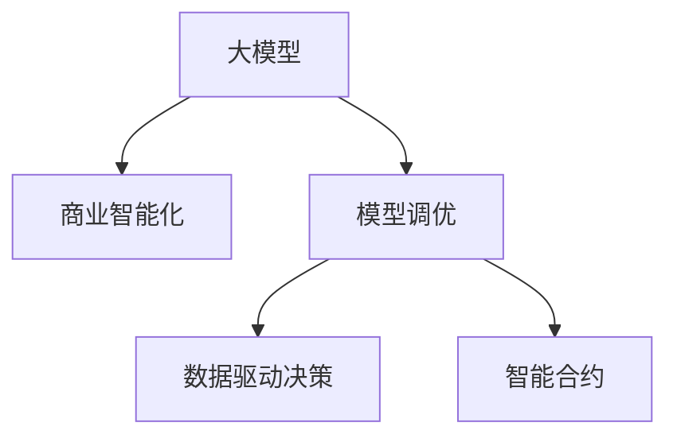

                 

# 大模型：智能时代的商业新模式

## 1. 背景介绍

### 1.1 问题由来

在智能时代，数据和计算能力的爆炸性增长，为AI技术的创新提供了前所未有的机遇。越来越多的企业和组织开始探索如何利用AI驱动业务增长、优化运营、提升用户体验。其中，大模型成为新时代的商业引擎，它集成了强大的语言模型和跨领域知识，可以在不同的商业场景中快速部署并实现业务智能化。

然而，大模型技术的发展也带来了诸多挑战。如何从海量数据中提取出有用的知识，并将其应用于具体业务场景，如何优化模型的性能和效率，如何确保模型的安全性和可解释性，都是当前需要解决的重要问题。大模型的商业应用需要理论研究的支撑和实践经验的积累。

### 1.2 问题核心关键点

- **数据和算力的双重驱动**：大模型训练和应用的瓶颈在于数据量和计算资源，这对传统企业的数据和算力基础设施提出了挑战。
- **商业价值的提升**：如何将大模型的智能转化为具体的商业应用，如何衡量模型在业务上的价值，是当前研究的热点。
- **模型的可解释性和安全性**：商业应用需要模型具备良好的可解释性和安全性，以确保模型的输出和决策过程透明可靠。
- **模型的优化和调优**：如何在大模型框架下进行有效的模型调优，如何优化模型性能和效率，是大模型商业应用的关键环节。

## 2. 核心概念与联系

### 2.1 核心概念概述

- **大模型（Large Model）**：指经过大量数据预训练的深度学习模型，如GPT-3、BERT等。这些模型通常具有数十亿甚至数百亿的参数，具备强大的语言理解和生成能力，能够处理复杂的自然语言任务。
- **商业智能化（Business Intelligence）**：指利用AI技术对商业数据进行分析，提取有用信息，辅助决策支持。商业智能化是大模型应用的典型场景之一。
- **模型调优（Model Tuning）**：在大模型的基础上，根据具体的业务需求进行参数调整和优化，以提升模型的性能和应用效果。模型调优是大模型商业化的重要步骤。
- **数据驱动决策（Data-Driven Decision）**：指利用数据和模型分析，辅助企业进行商业决策，优化运营效率，提升客户体验。
- **智能合约（Smart Contracts）**：指利用区块链技术，将业务规则和算法嵌入智能合约中，实现自动化执行和透明监督。智能合约是大模型在区块链领域的典型应用。

这些核心概念之间的逻辑关系可以通过以下Mermaid流程图来展示：



这个流程图展示了大模型在大模型商业应用中的核心概念及其关系：

1. 大模型通过预训练获得基础能力。
2. 商业智能化应用将大模型应用于具体的商业场景。
3. 模型调优对大模型进行参数调整，优化其在商业场景中的表现。
4. 数据驱动决策利用大模型和商业智能化的输出，辅助企业进行决策。
5. 智能合约利用大模型在区块链领域实现自动化执行和透明监督。

## 3. 核心算法原理 & 具体操作步骤
### 3.1 算法原理概述

大模型应用于商业智能化，其核心算法原理可以概括为以下几个步骤：

1. **数据预处理**：从商业数据中提取有用信息，进行数据清洗和标注，生成训练数据集。
2. **模型训练**：在预训练大模型的基础上，根据商业需求设计任务适配层，使用标注数据对模型进行微调或重训练。
3. **模型调优**：根据业务反馈和效果评估，调整模型参数，优化模型性能。
4. **商业部署**：将优化后的模型部署到业务系统中，实现智能决策和自动化执行。

### 3.2 算法步骤详解

1. **数据预处理**
   - 收集商业数据，包括客户交易记录、用户反馈、市场数据等。
   - 对数据进行清洗、去噪、标准化处理，去除噪声和异常数据。
   - 进行数据标注，生成训练和验证数据集。数据标注通常需要专业领域知识，确保标注数据的质量。

2. **模型训练**
   - 选择合适的预训练大模型，如BERT、GPT-3等。
   - 在预训练模型的基础上，根据商业需求设计任务适配层，如分类层、回归层等。
   - 使用标注数据对模型进行微调或重训练，优化模型参数，使其适应具体的商业场景。

3. **模型调优**
   - 根据业务反馈和效果评估，调整模型参数，优化模型性能。
   - 使用A/B测试、交叉验证等方法，评估模型在不同业务场景下的表现，进行参数调优。
   - 采用正则化技术、对抗训练等方法，提高模型的鲁棒性和泛化能力。

4. **商业部署**
   - 将优化后的模型部署到业务系统中，如客户关系管理系统、营销自动化平台等。
   - 实现智能决策，如客户分群、推荐系统、智能客服等。
   - 利用模型和算法自动化执行业务流程，提高运营效率。

### 3.3 算法优缺点

大模型应用于商业智能化的优点包括：

- **高效性**：大模型能够快速处理大量的自然语言数据，提供实时分析结果。
- **通用性**：大模型具备跨领域知识，可以应用于多种商业场景。
- **透明性**：大模型的内部工作机制透明，便于解释和监督。

缺点包括：

- **数据依赖**：大模型需要高质量的数据进行预训练和微调，数据获取成本较高。
- **计算资源要求**：大模型参数量庞大，需要高性能的计算资源。
- **模型偏见**：大模型可能学习到数据中的偏见，需要特别关注。

### 3.4 算法应用领域

大模型应用于商业智能化的典型场景包括：

- **客户关系管理（CRM）**：利用大模型进行客户分群、需求分析、智能客服等。
- **市场营销（Marketing）**：利用大模型进行市场分析、推荐系统、广告投放优化等。
- **金融风控（Finance Risk Control）**：利用大模型进行风险评估、欺诈检测、信用评分等。
- **人力资源管理（HR）**：利用大模型进行人才评估、招聘推荐、员工满意度分析等。
- **医疗健康（Healthcare）**：利用大模型进行疾病诊断、治疗方案推荐、患者管理等。

## 4. 数学模型和公式 & 详细讲解  
### 4.1 数学模型构建

大模型应用于商业智能化，其数学模型可以概括为以下几个部分：

- **数据表示**：将商业数据表示为向量形式，方便模型处理。
- **模型训练**：在预训练大模型的基础上，使用标注数据进行微调，优化模型参数。
- **效果评估**：使用预设的评估指标（如准确率、F1值、ROC曲线等）评估模型性能。

以分类任务为例，大模型应用于商业智能化的数学模型如下：

$$
\begin{aligned}
\mathcal{L}(\theta) &= \frac{1}{N}\sum_{i=1}^N [\ell(M_{\theta}(x_i),y_i)] \\
\ell(M_{\theta}(x_i),y_i) &= -y_i \log M_{\theta}(x_i) - (1-y_i) \log (1-M_{\theta}(x_i))
\end{aligned}
$$

其中，$M_{\theta}(x_i)$ 表示模型在输入 $x_i$ 上的预测结果，$\ell$ 表示交叉熵损失函数。

### 4.2 公式推导过程

以上公式中，交叉熵损失函数 $\ell$ 用于衡量模型预测与真实标签之间的差异。模型训练的目标是最小化经验风险 $\mathcal{L}$，使得模型输出的概率分布与真实标签的分布尽可能一致。

### 4.3 案例分析与讲解

以推荐系统为例，使用大模型进行推荐任务的数学模型如下：

$$
\begin{aligned}
\mathcal{L}(\theta) &= \frac{1}{N}\sum_{i=1}^N [\ell(M_{\theta}(x_i),y_i)] \\
\ell(M_{\theta}(x_i),y_i) &= \log (M_{\theta}(x_i)^{y_i} (1-M_{\theta}(x_i))^{1-y_i})
\end{aligned}
$$

其中，$M_{\theta}(x_i)$ 表示模型对用户 $x_i$ 的推荐列表的概率分布，$y_i$ 表示用户 $x_i$ 的真实标签（已选择的物品）。推荐系统通过最大化模型输出与用户真实选择的物品之间的KL散度来训练模型。

## 5. 项目实践：代码实例和详细解释说明
### 5.1 开发环境搭建

在进行商业智能化的大模型应用开发时，需要一个合适的开发环境。以下是使用Python进行TensorFlow开发的环境配置流程：

1. 安装Anaconda：从官网下载并安装Anaconda，用于创建独立的Python环境。

2. 创建并激活虚拟环境：
```bash
conda create -n tf-env python=3.8 
conda activate tf-env
```

3. 安装TensorFlow：根据CUDA版本，从官网获取对应的安装命令。例如：
```bash
conda install tensorflow==2.8
```

4. 安装各类工具包：
```bash
pip install numpy pandas scikit-learn matplotlib tqdm jupyter notebook ipython
```

完成上述步骤后，即可在`tf-env`环境中开始商业智能化的应用开发。

### 5.2 源代码详细实现

以下是一个使用TensorFlow进行推荐系统开发的PyTorch代码实现：

```python
import tensorflow as tf
from tensorflow.keras.layers import Input, Dense, Embedding, Flatten, Concatenate, Dropout, Model
from tensorflow.keras.optimizers import Adam

# 定义输入层
user_input = Input(shape=(128,))
item_input = Input(shape=(128,))

# 定义嵌入层
user_embedding = Embedding(100000, 128, input_length=128)(user_input)
item_embedding = Embedding(100000, 128, input_length=128)(item_input)

# 定义拼接层和dropout层
concat = Concatenate()([user_embedding, item_embedding])
dropout = Dropout(0.2)(concat)

# 定义多层感知器（MLP）
mlp = Dense(128, activation='relu')(dropout)
mlp = Dense(64, activation='relu')(mlp)
output = Dense(1, activation='sigmoid')(mlp)

# 定义模型
model = Model(inputs=[user_input, item_input], outputs=output)

# 定义优化器
optimizer = Adam(lr=0.001)

# 定义损失函数
loss = 'binary_crossentropy'

# 编译模型
model.compile(optimizer=optimizer, loss=loss, metrics=['accuracy'])
```

### 5.3 代码解读与分析

让我们再详细解读一下关键代码的实现细节：

**模型定义**：
- `Input` 层用于定义输入层的形状。
- `Embedding` 层用于将用户和物品的ID嵌入到128维向量空间中。
- `Concatenate` 层用于拼接用户和物品的嵌入向量。
- `Dropout` 层用于防止过拟合。
- `Dense` 层用于定义多层感知器，其中每一层都有激活函数。
- `Model` 层用于将输入和输出层组合成一个完整的模型。

**优化器和损失函数**：
- `Adam` 优化器用于更新模型参数。
- `binary_crossentropy` 损失函数用于二分类任务。

**模型编译**：
- `compile` 方法用于编译模型，指定优化器、损失函数和评估指标。

### 5.4 运行结果展示

运行以上代码，模型即可开始训练。训练过程中，可以使用以下代码进行日志记录和可视化：

```python
import tensorflow as tf
from tensorflow.keras.callbacks import EarlyStopping, ModelCheckpoint

# 设置EarlyStopping回调
early_stopping = EarlyStopping(monitor='val_loss', patience=5)

# 设置ModelCheckpoint回调
model_checkpoint = ModelCheckpoint('best_model.h5', save_best_only=True)

# 训练模型
model.fit(x_train, y_train, validation_data=(x_val, y_val), epochs=10, callbacks=[early_stopping, model_checkpoint])
```

训练完成后，可以使用以下代码进行模型评估：

```python
# 加载最佳模型
model.load_weights('best_model.h5')

# 评估模型
loss, accuracy = model.evaluate(x_test, y_test)

print(f'Test loss: {loss:.4f}')
print(f'Test accuracy: {accuracy:.4f}')
```

通过以上代码，可以完整实现一个基于大模型的推荐系统。

## 6. 实际应用场景
### 6.1 智能客服系统

智能客服系统利用大模型进行自然语言处理和理解，实现自动化的客户服务。以下是一个基于大模型的智能客服系统的实现：

```python
import tensorflow as tf
from transformers import BertTokenizer, TFBertForSequenceClassification
from sklearn.model_selection import train_test_split

# 数据预处理
tokenizer = BertTokenizer.from_pretrained('bert-base-cased')
train_texts, train_labels, dev_texts, dev_labels = train_test_split(train_data, train_labels, test_size=0.2, random_state=42)

# 模型训练
model = TFBertForSequenceClassification.from_pretrained('bert-base-cased', num_labels=len(label2id))
model.compile(optimizer=tf.keras.optimizers.Adam(learning_rate=2e-5), loss=tf.keras.losses.SparseCategoricalCrossentropy(), metrics=['accuracy'])

# 模型训练
model.fit(train_texts, train_labels, validation_data=(dev_texts, dev_labels), epochs=5, batch_size=16)

# 模型评估
model.evaluate(dev_texts, dev_labels)
```

在训练完成后，可以将模型部署到实际的客服系统中，实现自动化的客户服务。

### 6.2 金融风控系统

金融风控系统利用大模型进行风险评估和欺诈检测。以下是一个基于大模型的金融风控系统的实现：

```python
import tensorflow as tf
from transformers import TFBertForSequenceClassification
from sklearn.model_selection import train_test_split

# 数据预处理
tokenizer = BertTokenizer.from_pretrained('bert-base-cased')
train_texts, train_labels, dev_texts, dev_labels = train_test_split(train_data, train_labels, test_size=0.2, random_state=42)

# 模型训练
model = TFBertForSequenceClassification.from_pretrained('bert-base-cased', num_labels=len(label2id))
model.compile(optimizer=tf.keras.optimizers.Adam(learning_rate=2e-5), loss=tf.keras.losses.SparseCategoricalCrossentropy(), metrics=['accuracy'])

# 模型训练
model.fit(train_texts, train_labels, validation_data=(dev_texts, dev_labels), epochs=5, batch_size=16)

# 模型评估
model.evaluate(dev_texts, dev_labels)
```

在训练完成后，可以将模型部署到金融风控系统中，实现自动化的风险评估和欺诈检测。

### 6.3 推荐系统

推荐系统利用大模型进行用户兴趣分析和物品推荐。以下是一个基于大模型的推荐系统的实现：

```python
import tensorflow as tf
from transformers import TFBertForSequenceClassification
from sklearn.model_selection import train_test_split

# 数据预处理
tokenizer = BertTokenizer.from_pretrained('bert-base-cased')
train_texts, train_labels, dev_texts, dev_labels = train_test_split(train_data, train_labels, test_size=0.2, random_state=42)

# 模型训练
model = TFBertForSequenceClassification.from_pretrained('bert-base-cased', num_labels=len(label2id))
model.compile(optimizer=tf.keras.optimizers.Adam(learning_rate=2e-5), loss=tf.keras.losses.SparseCategoricalCrossentropy(), metrics=['accuracy'])

# 模型训练
model.fit(train_texts, train_labels, validation_data=(dev_texts, dev_labels), epochs=5, batch_size=16)

# 模型评估
model.evaluate(dev_texts, dev_labels)
```

在训练完成后，可以将模型部署到推荐系统中，实现智能化的用户推荐。

### 6.4 未来应用展望

未来，大模型将在更多领域得到应用，为传统行业带来变革性影响。以下是几个典型领域的应用展望：

- **智慧医疗**：利用大模型进行疾病诊断、治疗方案推荐、患者管理等。
- **智能教育**：利用大模型进行作业批改、学情分析、知识推荐等。
- **智慧城市**：利用大模型进行城市事件监测、舆情分析、应急指挥等。
- **文娱传媒**：利用大模型进行内容推荐、情感分析、用户画像等。
- **人力资源**：利用大模型进行人才评估、招聘推荐、员工满意度分析等。
- **金融科技**：利用大模型进行风险评估、欺诈检测、信用评分等。

## 7. 工具和资源推荐
### 7.1 学习资源推荐

为了帮助开发者系统掌握大模型的商业智能化应用，这里推荐一些优质的学习资源：

1. **《深度学习》课程**：由斯坦福大学开设，涵盖了深度学习的基本概念和应用，是学习大模型的基础。
2. **《TensorFlow实战》书籍**：由Google官方编写，介绍了TensorFlow的基本用法和高级技巧，适合实际应用开发。
3. **《自然语言处理》课程**：由斯坦福大学开设，介绍了自然语言处理的基本方法和前沿技术，是学习大模型的重要参考。
4. **《Transformers》书籍**：由HuggingFace官方编写，介绍了Transformer架构和预训练语言模型的应用，是学习大模型的必读书籍。
5. **《大规模预训练模型》博客**：由大模型技术专家撰写，深入浅出地介绍了大模型的原理、训练方法和应用案例。

通过对这些资源的学习实践，相信你一定能够快速掌握大模型的商业智能化应用技巧，并用于解决实际的业务问题。

### 7.2 开发工具推荐

高效的开发离不开优秀的工具支持。以下是几款用于大模型商业智能化开发的工具：

1. **PyTorch**：基于Python的开源深度学习框架，灵活动态的计算图，适合快速迭代研究。大部分预训练语言模型都有PyTorch版本的实现。
2. **TensorFlow**：由Google主导开发的开源深度学习框架，生产部署方便，适合大规模工程应用。同样有丰富的预训练语言模型资源。
3. **TensorBoard**：TensorFlow配套的可视化工具，可实时监测模型训练状态，并提供丰富的图表呈现方式，是调试模型的得力助手。
4. **Weights & Biases**：模型训练的实验跟踪工具，可以记录和可视化模型训练过程中的各项指标，方便对比和调优。
5. **Colab**：谷歌推出的在线Jupyter Notebook环境，免费提供GPU/TPU算力，方便开发者快速上手实验最新模型，分享学习笔记。

合理利用这些工具，可以显著提升大模型商业智能化的开发效率，加快创新迭代的步伐。

### 7.3 相关论文推荐

大模型和商业智能化的研究源于学界的持续研究。以下是几篇奠基性的相关论文，推荐阅读：

1. **Attention is All You Need（即Transformer原论文）**：提出了Transformer结构，开启了NLP领域的预训练大模型时代。
2. **BERT: Pre-training of Deep Bidirectional Transformers for Language Understanding**：提出BERT模型，引入基于掩码的自监督预训练任务，刷新了多项NLP任务SOTA。
3. **Large-Scale Language Model Fine-Tuning for Natural Language Understanding**：研究了在大规模语言模型上进行微调的方法，提出了参数高效微调（PEFT）等技术。
4. **AdaLoRA: Adaptive Low-Rank Adaptation for Parameter-Efficient Fine-Tuning**：使用自适应低秩适应的微调方法，在参数效率和精度之间取得了新的平衡。
5. **Prompt-based Learning**：引入基于连续型Prompt的微调范式，为如何充分利用预训练知识提供了新的思路。

这些论文代表了大模型商业智能化的发展脉络。通过学习这些前沿成果，可以帮助研究者把握学科前进方向，激发更多的创新灵感。

## 8. 总结：未来发展趋势与挑战
### 8.1 研究成果总结

本文对大模型应用于商业智能化的理论和实践进行了全面系统的介绍。首先阐述了大模型的发展背景和商业智能化的研究意义，明确了商业智能化在大模型应用中的重要价值。其次，从原理到实践，详细讲解了大模型应用于商业智能化的数学模型和关键步骤，给出了具体的代码实现。同时，本文还探讨了大模型在多个行业领域的应用前景，展示了其巨大的商业潜力。最后，本文精选了学习资源、开发工具和相关论文，力求为开发者提供全方位的技术指引。

通过本文的系统梳理，可以看到，大模型在商业智能化中发挥着越来越重要的作用。它能够高效处理自然语言数据，提供实时分析和智能决策支持，推动企业数字化转型。未来，伴随大模型和微调技术的不断演进，相信NLP技术必将在更多领域大放异彩，深刻影响人类社会的各个方面。

### 8.2 未来发展趋势

展望未来，大模型在商业智能化中的发展趋势包括：

1. **模型规模持续增大**：随着算力成本的下降和数据规模的扩张，大模型的参数量还将持续增长。超大规模语言模型蕴含的丰富语言知识，有望支撑更加复杂多变的商业场景。
2. **数据驱动决策**：大模型能够高效处理海量数据，提供准确的商业洞察，辅助决策支持。数据驱动决策将成为企业数字化转型的重要方向。
3. **跨领域知识融合**：大模型能够学习跨领域的知识，整合多模态数据，提升决策的全面性和准确性。
4. **实时化处理**：大模型的实时处理能力，能够实现快速响应，提升用户体验。
5. **自适应优化**：大模型能够根据用户反馈和业务需求，实时调整参数，优化性能。
6. **透明性和可解释性**：大模型的透明性和可解释性，能够增强用户的信任感和接受度。

### 8.3 面临的挑战

尽管大模型在商业智能化中取得了显著进展，但仍面临诸多挑战：

1. **数据获取和标注**：高质量数据的获取和标注成本高昂，需要大量人力和时间。
2. **计算资源要求**：大模型需要高性能的计算资源，对算力基础设施提出了挑战。
3. **模型偏见和公平性**：大模型可能学习到数据中的偏见，需要特别关注公平性和透明性。
4. **鲁棒性和泛化能力**：大模型面对复杂和未知数据时，泛化能力较弱，需要加强鲁棒性训练。
5. **隐私和安全**：商业智能化的应用涉及用户隐私，需要保护用户数据和模型的安全。

### 8.4 研究展望

面对大模型在商业智能化中的挑战，未来的研究需要在以下几个方面寻求新的突破：

1. **数据高效获取和标注**：探索数据高效获取和标注的方法，降低成本，提高数据质量。
2. **模型鲁棒性增强**：加强鲁棒性训练，提升大模型的泛化能力和抗干扰能力。
3. **跨模态融合**：融合视觉、语音、文本等多模态数据，提升决策的全面性和准确性。
4. **透明性和可解释性**：加强大模型的透明性和可解释性，增强用户的信任感和接受度。
5. **隐私和安全保护**：加强用户数据和模型的隐私和安全保护，确保商业智能化的可信性。

总之，大模型在商业智能化中的应用前景广阔，但也面临着诸多挑战。未来的研究需要在大模型技术和商业智能化的深度融合中，不断探索和突破，才能实现大模型在商业领域的广泛应用和深入发展。

## 9. 附录：常见问题与解答

**Q1：大模型在商业智能化中是否需要依赖标注数据？**

A: 大模型在商业智能化中通常需要依赖标注数据进行微调，以提升其在特定任务上的性能。标注数据的数量和质量直接影响大模型的效果。但在某些情况下，可以使用无监督学习和半监督学习等方法，减少对标注数据的依赖。

**Q2：大模型的训练和微调需要多少计算资源？**

A: 大模型的训练和微调需要高性能的计算资源，包括GPU/TPU等。训练一个具有数十亿参数的大模型，需要大量的计算资源和时间。建议根据任务需求选择合适的硬件设备和算力资源。

**Q3：大模型在商业智能化中如何保证数据隐私？**

A: 在商业智能化的应用中，需要保护用户数据的隐私。可以采用数据匿名化、差分隐私等技术，确保数据在处理和传输过程中的安全性。同时，可以建立严格的数据访问和权限管理机制，防止数据泄露。

**Q4：大模型在商业智能化中如何保证模型的透明性和可解释性？**

A: 大模型在商业智能化中的应用需要保证模型的透明性和可解释性。可以使用可解释性技术，如LIME、SHAP等，对模型进行解释和可视化。同时，建立模型训练和使用的透明流程，确保用户对模型的理解和信任。

**Q5：大模型在商业智能化中如何处理异常数据和噪声数据？**

A: 大模型在商业智能化中需要处理异常数据和噪声数据。可以使用异常检测和数据清洗技术，去除噪声和异常数据，确保模型训练和应用的效果。同时，建立数据质量监控机制，及时发现和处理数据异常。

**Q6：大模型在商业智能化中如何实现自适应优化？**

A: 大模型在商业智能化中可以通过在线学习（Online Learning）、增量学习（Incremental Learning）等方法，实现自适应优化。在实际应用中，可以不断收集新的数据，重新训练模型，提升模型的适应性。

通过以上问题与解答，相信读者对大模型在商业智能化中的应用有了更深入的理解。大模型作为智能时代的商业新模式，具备强大的处理能力和泛化能力，能够为商业智能化提供强大的技术支持。未来，伴随大模型技术的不断演进和应用实践的积累，相信NLP技术必将在更多领域实现商业价值的最大化。

