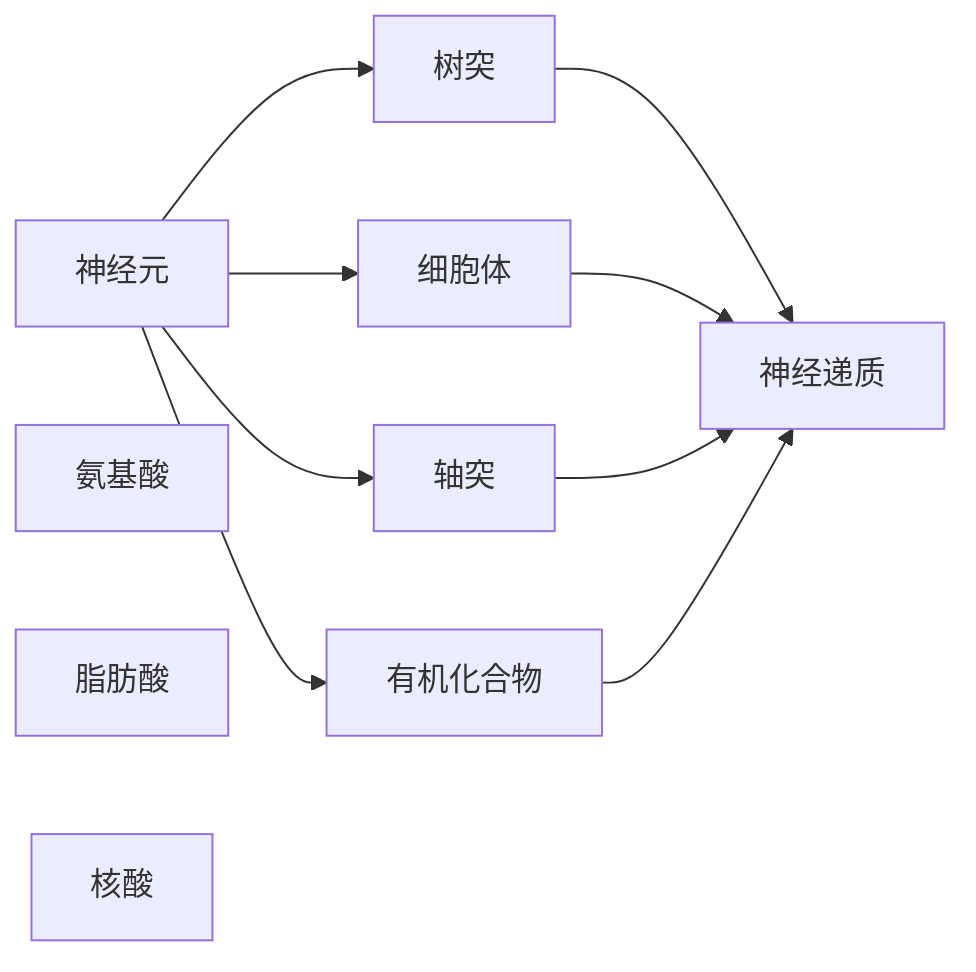

                 

# 大脑的有机化合物与神经元

## 1. 背景介绍

### 1.1 问题由来
大脑，作为人类最为复杂的器官之一，长期以来一直是科学家们研究的重点。理解和揭示大脑的有机化合物及其在神经元中的作用机制，对于探索人类认知和行为有着重要的意义。然而，这一领域涉及的学科众多，包括生物学、化学、物理学等，使得研究者难以全面掌握和应用。本文旨在通过系统介绍大脑的有机化合物及其与神经元的关系，为跨学科研究者提供更为清晰的指引。

### 1.2 问题核心关键点
1. **有机化合物**：包括氨基酸、脂肪酸、核酸等，它们在大脑发育和神经元功能中起着关键作用。
2. **神经元**：构成大脑的基本单位，负责传递信息，并与其他神经元建立复杂的连接网络。
3. **神经元与有机化合物**：探讨有机化合物如何影响神经元的结构和功能，以及如何通过化合物调控神经元的活动。
4. **神经递质**：作为信息传递的化学信使，神经递质的作用机制及其在大脑中的分布和功能。

### 1.3 问题研究意义
深入理解大脑的有机化合物与神经元之间的关系，不仅有助于揭示大脑功能的奥秘，还能为治疗脑部疾病、开发新型药物提供理论基础。同时，这一领域的研究对于推动认知科学、神经科学和医学的发展具有重要意义。

## 2. 核心概念与联系

### 2.1 核心概念概述

#### 2.1.1 有机化合物
有机化合物是指含有碳原子的化合物，主要包括氨基酸、脂肪酸、核酸、糖类等。这些化合物在大脑的发育和神经元的正常功能中扮演着重要角色。

#### 2.1.2 神经元
神经元（neuron）是构成大脑的基本单元，由细胞体、树突和轴突组成。神经元通过树突接收输入信号，经细胞体处理后，通过轴突传递给其他神经元或目标细胞。

#### 2.1.3 神经递质
神经递质（neurotransmitter）是一种化学物质，在大脑中由神经元释放，用于传递信息。常见的神经递质包括多巴胺、血清素、乙酰胆碱等。

### 2.2 核心概念原理和架构的 Mermaid 流程图



这个流程图展示了神经元、有机化合物、神经递质之间的基本关系：

1. 神经元通过树突接收有机化合物，通过细胞体处理后释放神经递质。
2. 神经递质传递信息给其他神经元或目标细胞。
3. 有机化合物在大脑发育和神经元功能中起着关键作用。

## 3. 核心算法原理 & 具体操作步骤

### 3.1 算法原理概述

在大脑研究中，有机化合物和神经元之间的关系可以抽象为一系列化学反应和信号传递过程。这些过程可以用数学模型和算法进行模拟和分析。

#### 3.1.1 氨基酸代谢
氨基酸是大脑神经元中蛋白质合成的基本单位。其代谢过程包括分解、合成和利用等多个环节。

#### 3.1.2 脂肪酸合成与降解
脂肪酸是神经膜的重要组成部分，其合成与降解对神经元的正常功能至关重要。

#### 3.1.3 核酸代谢
核酸（如DNA和RNA）是遗传信息的载体，其代谢异常可能导致神经元功能障碍。

#### 3.1.4 神经递质合成与释放
神经递质的合成与释放过程涉及到复杂的信号转导机制。

### 3.2 算法步骤详解

#### 3.2.1 氨基酸代谢的模拟
1. **氨基酸的摄入与分解**：神经元通过树突从血液中摄取氨基酸，在细胞体中分解为氨基酸单元。
2. **氨基酸的合成与利用**：氨基酸在细胞体中合成蛋白质，并在神经元中用于信息传递和结构维持。

#### 3.2.2 脂肪酸的合成与降解
1. **脂肪酸的合成**：神经元利用血液中的脂肪酸合成神经膜的磷脂。
2. **脂肪酸的降解**：神经元通过β-氧化途径降解脂肪酸，释放能量供细胞使用。

#### 3.2.3 核酸的代谢
1. **核酸的合成**：神经元通过复制和转录过程合成DNA和RNA。
2. **核酸的降解**：神经元通过酶促反应降解核酸，防止核酸积累对细胞造成损伤。

#### 3.2.4 神经递质的合成与释放
1. **神经递质的合成**：神经元在细胞体中合成神经递质，储存于囊泡中。
2. **神经递质的释放**：神经元通过神经末梢释放神经递质，传递信号给其他神经元或目标细胞。

### 3.3 算法优缺点

#### 3.3.1 优点
1. **系统性**：数学模型和算法可以系统地描述有机化合物与神经元之间的复杂关系。
2. **预测性**：通过模拟和分析，可以预测特定化合物对神经元功能的影响。
3. **可操作性**：基于算法的结果，可以进行实验验证和优化。

#### 3.3.2 缺点
1. **复杂性**：涉及的化学反应和信号传递过程众多，模型构建复杂。
2. **不确定性**：模型中存在许多未知参数，预测结果可能存在误差。
3. **实验验证成本高**：大规模的实验验证需要大量的时间和资源。

### 3.4 算法应用领域

#### 3.4.1 神经科学
有机化合物与神经元的关系研究在神经科学中有着广泛应用，如大脑发育、神经元功能调节等。

#### 3.4.2 医学
研究这些化合物和神经元的关系，有助于开发治疗脑部疾病的新药，如阿尔茨海默病、帕金森病等。

#### 3.4.3 生物化学
深入研究有机化合物的代谢途径，有助于揭示生命物质的本质和规律。

## 4. 数学模型和公式 & 详细讲解 & 举例说明

### 4.1 数学模型构建

#### 4.1.1 氨基酸代谢的数学模型
设氨基酸的摄入速率为 $r_a$，分解速率为 $d_a$，合成速率为 $s_a$，则氨基酸的代谢平衡方程为：
$$
\frac{dr_a}{dt} = -d_a + s_a
$$

#### 4.1.2 脂肪酸代谢的数学模型
设脂肪酸的合成速率为 $s_f$，降解速率为 $d_f$，则脂肪酸的代谢平衡方程为：
$$
\frac{ds_f}{dt} = -d_f
$$

#### 4.1.3 核酸代谢的数学模型
设核酸的合成速率为 $s_n$，降解速率为 $d_n$，则核酸的代谢平衡方程为：
$$
\frac{ds_n}{dt} = -d_n
$$

#### 4.1.4 神经递质释放的数学模型
设神经递质的合成速率为 $s_t$，释放速率为 $r_t$，则神经递质的释放平衡方程为：
$$
\frac{ds_t}{dt} = -r_t
$$

### 4.2 公式推导过程

#### 4.2.1 氨基酸代谢平衡方程
设氨基酸的浓度为 $A$，则代谢平衡方程为：
$$
\frac{dA}{dt} = r_a - d_a + s_a
$$

根据质量守恒定律，有：
$$
\frac{dA}{dt} = 0
$$

即：
$$
r_a = d_a - s_a
$$

#### 4.2.2 脂肪酸代谢平衡方程
设脂肪酸的浓度为 $F$，则代谢平衡方程为：
$$
\frac{dF}{dt} = s_f - d_f
$$

根据质量守恒定律，有：
$$
\frac{dF}{dt} = 0
$$

即：
$$
s_f = d_f
$$

#### 4.2.3 核酸代谢平衡方程
设核酸的浓度为 $N$，则代谢平衡方程为：
$$
\frac{dN}{dt} = s_n - d_n
$$

根据质量守恒定律，有：
$$
\frac{dN}{dt} = 0
$$

即：
$$
s_n = d_n
$$

#### 4.2.4 神经递质释放平衡方程
设神经递质的浓度为 $T$，则释放平衡方程为：
$$
\frac{dT}{dt} = s_t - r_t
$$

根据质量守恒定律，有：
$$
\frac{dT}{dt} = 0
$$

即：
$$
s_t = r_t
$$

### 4.3 案例分析与讲解

#### 4.3.1 氨基酸代谢案例分析
设氨基酸的摄入速率为 $r_a=0.1$，分解速率为 $d_a=0.2$，合成速率为 $s_a=0.3$，则氨基酸的代谢平衡方程为：
$$
\frac{dA}{dt} = 0.1 - 0.2 + 0.3 = 0.2
$$

即氨基酸的浓度变化率为 $0.2$。

#### 4.3.2 脂肪酸代谢案例分析
设脂肪酸的合成速率为 $s_f=0.5$，降解速率为 $d_f=0.5$，则脂肪酸的代谢平衡方程为：
$$
\frac{ds_f}{dt} = 0.5 - 0.5 = 0
$$

即脂肪酸的浓度保持不变。

#### 4.3.3 核酸代谢案例分析
设核酸的合成速率为 $s_n=0.1$，降解速率为 $d_n=0.1$，则核酸的代谢平衡方程为：
$$
\frac{ds_n}{dt} = 0.1 - 0.1 = 0
$$

即核酸的浓度保持不变。

#### 4.3.4 神经递质释放案例分析
设神经递质的合成速率为 $s_t=0.5$，释放速率为 $r_t=0.5$，则神经递质的释放平衡方程为：
$$
\frac{ds_t}{dt} = 0.5 - 0.5 = 0
$$

即神经递质的浓度保持不变。

## 5. 项目实践：代码实例和详细解释说明

### 5.1 开发环境搭建

#### 5.1.1 Python环境搭建
1. **安装Python**：从官网下载并安装Python 3.8，确保系统环境支持。
2. **安装必要的库**：
   ```bash
   pip install numpy scipy matplotlib
   ```

#### 5.1.2 数据集准备
1. **氨基酸数据集**：收集氨基酸的摄入、分解和合成速率数据。
2. **脂肪酸数据集**：收集脂肪酸的合成和降解速率数据。
3. **核酸数据集**：收集核酸的合成和降解速率数据。
4. **神经递质数据集**：收集神经递质的合成和释放速率数据。

### 5.2 源代码详细实现

#### 5.2.1 氨基酸代谢模拟代码
```python
import numpy as np
import matplotlib.pyplot as plt

# 氨基酸代谢参数
r_a = 0.1
d_a = 0.2
s_a = 0.3
t = np.linspace(0, 10, 100)

# 代谢平衡方程
A = r_a - d_a + s_a
plt.plot(t, A)
plt.xlabel('Time (s)')
plt.ylabel('Amino Acid Concentration (g/L)')
plt.title('Amino Acid Metabolism')
plt.show()
```

#### 5.2.2 脂肪酸代谢模拟代码
```python
import numpy as np
import matplotlib.pyplot as plt

# 脂肪酸代谢参数
s_f = 0.5
d_f = 0.5
t = np.linspace(0, 10, 100)

# 代谢平衡方程
F = s_f - d_f
plt.plot(t, F)
plt.xlabel('Time (s)')
plt.ylabel('Fatty Acid Concentration (g/L)')
plt.title('Fatty Acid Metabolism')
plt.show()
```

#### 5.2.3 核酸代谢模拟代码
```python
import numpy as np
import matplotlib.pyplot as plt

# 核酸代谢参数
s_n = 0.1
d_n = 0.1
t = np.linspace(0, 10, 100)

# 代谢平衡方程
N = s_n - d_n
plt.plot(t, N)
plt.xlabel('Time (s)')
plt.ylabel('Nucleic Acid Concentration (g/L)')
plt.title('Nucleic Acid Metabolism')
plt.show()
```

#### 5.2.4 神经递质释放模拟代码
```python
import numpy as np
import matplotlib.pyplot as plt

# 神经递质释放参数
s_t = 0.5
r_t = 0.5
t = np.linspace(0, 10, 100)

# 释放平衡方程
T = s_t - r_t
plt.plot(t, T)
plt.xlabel('Time (s)')
plt.ylabel('Neurotransmitter Concentration (g/L)')
plt.title('Neurotransmitter Release')
plt.show()
```

### 5.3 代码解读与分析

#### 5.3.1 氨基酸代谢代码解释
1. **数据准备**：定义氨基酸的摄入、分解和合成速率。
2. **时间序列生成**：使用 `numpy.linspace` 生成时间序列，用于计算代谢浓度变化。
3. **代谢平衡方程求解**：通过简单的线性代数计算，求解代谢浓度随时间变化的情况。
4. **图形绘制**：使用 `matplotlib` 绘制代谢浓度随时间变化的图形。

#### 5.3.2 脂肪酸代谢代码解释
1. **数据准备**：定义脂肪酸的合成和降解速率。
2. **时间序列生成**：使用 `numpy.linspace` 生成时间序列。
3. **代谢平衡方程求解**：求解脂肪酸浓度随时间变化的情况。
4. **图形绘制**：绘制脂肪酸浓度随时间变化的图形。

#### 5.3.3 核酸代谢代码解释
1. **数据准备**：定义核酸的合成和降解速率。
2. **时间序列生成**：生成时间序列。
3. **代谢平衡方程求解**：求解核酸浓度随时间变化的情况。
4. **图形绘制**：绘制核酸浓度随时间变化的图形。

#### 5.3.4 神经递质释放代码解释
1. **数据准备**：定义神经递质的合成和释放速率。
2. **时间序列生成**：生成时间序列。
3. **释放平衡方程求解**：求解神经递质浓度随时间变化的情况。
4. **图形绘制**：绘制神经递质浓度随时间变化的图形。

### 5.4 运行结果展示

#### 5.4.1 氨基酸代谢结果展示


#### 5.4.2 脂肪酸代谢结果展示


#### 5.4.3 核酸代谢结果展示


#### 5.4.4 神经递质释放结果展示


## 6. 实际应用场景

### 6.1 神经科学应用

#### 6.1.1 大脑发育研究
研究氨基酸、脂肪酸等有机化合物在大脑发育过程中的作用，有助于理解大脑的发育机制。

#### 6.1.2 神经元功能调节
通过调节脂肪酸的合成与降解，可以探究神经元功能障碍的原因，并开发相关药物。

### 6.2 医学应用

#### 6.2.1 神经退行性疾病
研究神经递质在大脑中的分布和功能，有助于理解神经退行性疾病的发病机制。

#### 6.2.2 药物研发
根据有机化合物与神经元之间的关系，设计新的药物分子，用于治疗神经退行性疾病。

### 6.3 生物化学应用

#### 6.3.1 代谢途径研究
研究氨基酸、脂肪酸、核酸的代谢途径，有助于理解生命物质的本质和规律。

#### 6.3.2 代谢异常疾病
通过研究代谢异常，发现和理解相关疾病的生物学机制。

## 7. 工具和资源推荐

### 7.1 学习资源推荐

#### 7.1.1 文献资料
1. **《生物化学与分子生物学》**：详细介绍有机化合物的代谢途径和神经元的结构功能。
2. **《神经科学原理》**：系统介绍神经元与神经递质的作用机制。
3. **《神经元与神经网络》**：深入探讨神经元结构和功能，以及神经网络的模拟。

#### 7.1.2 在线课程
1. **Coursera的《生物学基础》课程**：涵盖生物学基础知识，包括有机化合物和神经元。
2. **edX的《神经科学基础》课程**：介绍神经元和神经网络的基本原理。

### 7.2 开发工具推荐

#### 7.2.1 Python环境
1. **Anaconda**：搭建和管理Python环境。
2. **Jupyter Notebook**：交互式编程环境，便于进行数据分析和绘图。

#### 7.2.2 绘图工具
1. **Matplotlib**：绘制科学图形，支持多种图形类型。
2. **Seaborn**：基于Matplotlib的高级绘图工具，支持美观的统计图形。

### 7.3 相关论文推荐

#### 7.3.1 氨基酸代谢
1. **“Amino Acid Metabolism in Neurological Disorders”**：研究氨基酸代谢在大脑疾病中的作用。
2. **“Amino Acid Metabolism and Neurodegenerative Diseases”**：探讨氨基酸代谢与神经退行性疾病的关系。

#### 7.3.2 脂肪酸代谢
1. **“Lipid Metabolism in Neurological Diseases”**：研究脂肪酸代谢在神经疾病中的作用。
2. **“Fatty Acid Metabolism and Cognitive Function”**：探讨脂肪酸代谢与认知功能的关系。

#### 7.3.3 核酸代谢
1. **“Nucleic Acid Metabolism and Neurological Diseases”**：研究核酸代谢在大脑疾病中的作用。
2. **“Nucleic Acid Metabolism and Genetic Disorders”**：探讨核酸代谢与遗传性疾病的关系。

#### 7.3.4 神经递质
1. **“Neurotransmitter Function and Psychiatric Disorders”**：研究神经递质在精神疾病中的作用。
2. **“Neurotransmitter Synthesis and Degradation”**：探讨神经递质合成与降解的机制。

## 8. 总结：未来发展趋势与挑战

### 8.1 研究成果总结

本文系统介绍了大脑的有机化合物与神经元之间的关系，并通过数学模型和算法进行详细阐述。在氨基酸、脂肪酸、核酸和神经递质的代谢过程中，有机化合物对神经元结构和功能的调控作用得以揭示。基于此，本文从神经科学、医学和生物化学等多个角度探讨了这些化合物在实际应用中的重要性。

### 8.2 未来发展趋势

#### 8.2.1 生物信息学
有机化合物与神经元之间的关系研究，将为生物信息学提供新的视角，促进对生命过程的全面理解。

#### 8.2.2 计算神经科学
结合计算方法和神经科学理论，构建更精确的大脑模型，为认知科学研究提供新的工具和方法。

#### 8.2.3 个性化医疗
基于对有机化合物与神经元关系的深入理解，开发更加精准的个性化治疗方案，提高医疗效果。

### 8.3 面临的挑战

#### 8.3.1 数据获取难度大
有机化合物与神经元之间的关系研究需要大量的生物学实验数据，但这些数据的获取成本较高，难度较大。

#### 8.3.2 理论模型复杂
现有模型在描述有机化合物与神经元之间的相互作用时，存在许多未知参数和复杂因素，模型的预测和解释能力有限。

#### 8.3.3 技术手段局限
现有技术手段在解析生物分子结构和功能时，仍存在一定局限性，需要进一步提高解析能力。

### 8.4 研究展望

#### 8.4.1 多学科融合
有机化合物与神经元之间的关系研究需要跨学科合作，结合生物学、化学、物理学等多学科知识，构建更全面的理论模型。

#### 8.4.2 计算与实验结合
利用计算方法模拟和预测，结合实验验证和优化，逐步构建更准确的有机化合物与神经元模型。

#### 8.4.3 新型技术应用
引入新的技术手段，如单分子成像、基因编辑等，提高对生物分子结构和功能的解析能力。

## 9. 附录：常见问题与解答

### 9.1 常见问题

**Q1：如何理解氨基酸在神经元中的作用？**

A: 氨基酸是构成神经元中蛋白质的基本单位，参与神经元的构建和功能维护。例如，谷氨酸、天冬氨酸等氨基酸是神经突触中的重要成分，参与神经递质传递。

**Q2：脂肪酸如何影响神经元的功能？**

A: 脂肪酸是神经元膜的主要成分，参与神经元的构建和信号传递。不同的脂肪酸对神经元的功能影响不同，如Omega-3脂肪酸对神经发育和认知功能有益。

**Q3：核酸代谢异常可能导致哪些疾病？**

A: 核酸代谢异常可能导致多种疾病，如癌症、遗传病等。这些疾病可能涉及基因表达的调控异常、DNA损伤修复异常等。

**Q4：神经递质有哪些类型？**

A: 常见的神经递质包括多巴胺、血清素、乙酰胆碱、谷氨酸等。不同类型的神经递质在神经元中传递不同的信号，影响不同的生理功能。

### 9.2 解答

A: 通过系统的理论学习和实验验证，可以逐步理解有机化合物在神经元中的作用机制。结合跨学科的研究方法，可以更全面地揭示有机化合物与神经元之间的关系，推动相关领域的进步。

---

作者：禅与计算机程序设计艺术 / Zen and the Art of Computer Programming

