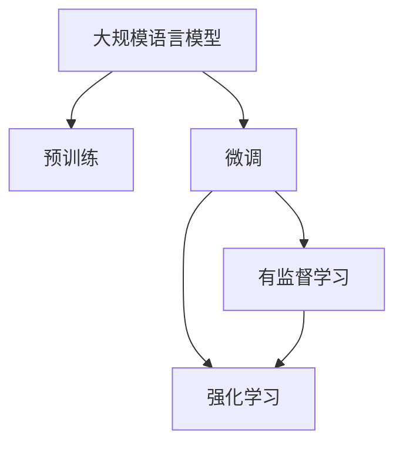

                 

## 1. 背景介绍

### 1.1 问题由来
随着人工智能技术的快速发展，大规模语言模型（Large Language Models, LLMs）在自然语言处理（Natural Language Processing, NLP）领域取得了显著的进展。这些模型，如GPT-3、BERT等，能够在各种自然语言处理任务中展现出强大的性能。

然而，这些模型通常是基于无监督学习（unsupervised learning）构建的，即在没有标注数据的情况下进行预训练。这意味着，尽管这些模型在泛化能力和语言理解能力上有着显著优势，但它们在特定任务上的性能仍然需要进一步提升。

强化学习（Reinforcement Learning, RL）与有监督学习（Supervised Learning, SL）是机器学习中的两种主要学习方式。有监督学习是指模型通过已标注的数据集进行训练，而强化学习则是模型通过与环境的交互，在不断的试错中学习最优策略。

本文将探讨在构建大规模语言模型时，强化学习和有监督学习的区别，并分析其在实际应用中的优缺点和应用领域。

### 1.2 问题核心关键点
本文的核心问题包括：
1. 强化学习与有监督学习的基本原理和区别。
2. 强化学习和有监督学习在构建大规模语言模型时的具体应用。
3. 强化学习和有监督学习在实际应用中的优缺点。
4. 强化学习和有监督学习在自然语言处理中的具体案例。

## 2. 核心概念与联系

### 2.1 核心概念概述

本节将介绍几个关键概念及其相互关系：

- **大规模语言模型（Large Language Models, LLMs）**：以BERT、GPT-3等为代表的预训练语言模型，通过在大量无标签文本数据上进行自监督学习，学习到语言的通用表示，具备强大的语言理解和生成能力。

- **无监督学习（Unsupervised Learning）**：在无标签数据集上进行训练，通过模型自身的学习来发现数据中的模式和结构。

- **有监督学习（Supervised Learning）**：利用已标注的数据集进行训练，通过监督信号来指导模型学习。

- **强化学习（Reinforcement Learning）**：通过与环境的交互，模型在不断的试错中学习最优策略，通过奖励和惩罚来指导模型的行为。

- **预训练（Pre-training）**：在大量无标签数据上进行预训练，学习通用语言表示，为后续的微调（fine-tuning）做准备。

- **微调（Fine-tuning）**：在预训练模型的基础上，使用下游任务的少量标注数据进行有监督学习，优化模型在特定任务上的性能。

- **迁移学习（Transfer Learning）**：将在一个任务上学习到的知识迁移到另一个相关任务中。

这些概念之间的逻辑关系可以通过以下Mermaid流程图来展示：



这个流程图展示了大规模语言模型的核心概念及其之间的关系：

1. 大规模语言模型通过预训练获得基础能力。
2. 微调是在预训练模型的基础上，通过有监督学习优化模型在特定任务上的性能。
3. 强化学习可以用于训练模型在特定任务上的策略，特别是在任务目标难以明确的情况下。

## 3. 核心算法原理 & 具体操作步骤

### 3.1 算法原理概述

强化学习与有监督学习的核心区别在于训练信号的不同。在强化学习中，模型通过与环境的交互，不断尝试不同的策略，并根据环境给出的奖励和惩罚信号来调整策略，以最大化长期奖励。而有监督学习则是通过已标注的数据集，利用监督信号指导模型学习。

在构建大规模语言模型时，预训练通常使用无监督学习，而微调则可以使用有监督学习或强化学习。

### 3.2 算法步骤详解

#### 3.2.1 预训练阶段

在大规模语言模型的预训练阶段，通常使用无监督学习。以BERT为例，其预训练过程主要包括以下步骤：

1. 准备大规模无标签文本数据集。
2. 使用自监督任务（如掩码语言模型、Next Sentence Prediction等）训练模型。
3. 更新模型参数以最小化自监督损失。
4. 重复上述步骤，直到模型收敛。

预训练的目的是学习语言的通用表示，为后续的微调做准备。

#### 3.2.2 微调阶段

在微调阶段，可以使用有监督学习或强化学习。以微调BERT用于情感分析任务为例：

1. 准备下游任务的标注数据集。
2. 冻结BERT的底层参数，只微调顶层分类器。
3. 使用Adam等优化算法，最小化交叉熵损失。
4. 在验证集上评估模型性能，防止过拟合。
5. 重复上述步骤，直到模型收敛。

有监督学习的优点在于能够直接利用标注数据，训练效果稳定。但需要标注数据集，且难以泛化到新的数据集。

#### 3.2.3 强化学习阶段

强化学习的微调方法适用于某些特定任务，如对话系统、游戏AI等。以训练一个简单的对话系统为例：

1. 准备对话数据的结构化表示。
2. 定义奖励函数，如对话轮数、回答质量等。
3. 使用基于强化学习的算法（如REINFORCE、A2C等）训练模型。
4. 与环境（如文本对话生成器）交互，根据奖励信号调整策略。
5. 重复上述步骤，直到策略收敛。

强化学习的优点在于能够自适应环境，且不需要大量标注数据。但需要设计合适的奖励函数，且训练过程较慢。

### 3.3 算法优缺点

#### 3.3.1 有监督学习的优点

1. **训练稳定**：有监督学习使用标注数据进行训练，训练效果稳定。
2. **泛化能力**：有监督学习能够直接利用标注数据，泛化能力较强。
3. **参数效率**：有监督学习通常只需要微调模型的顶层，参数更新效率高。

#### 3.3.2 有监督学习的缺点

1. **标注成本高**：有监督学习需要标注数据，标注成本较高。
2. **数据分布限制**：有监督学习依赖标注数据，难以泛化到新数据集。

#### 3.3.3 强化学习的优点

1. **自适应性强**：强化学习能够自适应环境，无需标注数据。
2. **探索能力**：强化学习能够探索不同的策略，找到最优解决方案。

#### 3.3.4 强化学习的缺点

1. **训练时间长**：强化学习需要与环境交互，训练时间长。
2. **奖励函数设计困难**：强化学习需要设计合适的奖励函数，否则容易陷入局部最优解。

### 3.4 算法应用领域

强化学习与有监督学习在自然语言处理中有不同的应用领域：

- **有监督学习**：适用于标注数据丰富、任务目标明确的任务，如命名实体识别、情感分析、问答系统等。
- **强化学习**：适用于任务目标难以明确或需要与环境交互的任务，如对话系统、游戏AI、自然语言生成等。

## 4. 数学模型和公式 & 详细讲解 & 举例说明

### 4.1 数学模型构建

本节将使用数学语言对强化学习和有监督学习的基本模型进行介绍。

#### 4.1.1 有监督学习模型

有监督学习模型通常使用交叉熵损失函数。以二分类任务为例，假设模型 $M_{\theta}$ 在输入 $x$ 上的输出为 $\hat{y}=M_{\theta}(x)$，真实标签为 $y$。则二分类交叉熵损失函数为：

$$
\ell(M_{\theta}(x),y) = -[y\log \hat{y} + (1-y)\log (1-\hat{y})]
$$

有监督学习的目标是最小化经验风险，即：

$$
\mathcal{L}(\theta) = \frac{1}{N}\sum_{i=1}^N \ell(M_{\theta}(x_i),y_i)
$$

其中，$N$ 为训练样本数。

#### 4.1.2 强化学习模型

强化学习模型使用Q-learning算法进行训练。假设环境状态为 $s$，模型状态为 $h$，动作为 $a$，奖励为 $r$。则Q-learning算法的目标是最小化期望的累计奖励：

$$
Q^*(h,a) = \max_{\theta} \mathbb{E}[G_t|h_t=h,a_t=a]
$$

其中，$G_t$ 为累计奖励，$h_t$ 为当前状态，$a_t$ 为当前动作。

Q-learning算法的更新公式为：

$$
Q(h,a) \leftarrow Q(h,a) + \alpha(r + \gamma \max_{a'} Q(h',a') - Q(h,a))
$$

其中，$\alpha$ 为学习率，$\gamma$ 为折扣因子，$h'$ 为下一状态。

### 4.2 公式推导过程

#### 4.2.1 有监督学习公式推导

以二分类任务为例，推导交叉熵损失函数的梯度。

假设模型 $M_{\theta}$ 在输入 $x$ 上的输出为 $\hat{y}=M_{\theta}(x)$，真实标签为 $y$。则二分类交叉熵损失函数为：

$$
\ell(M_{\theta}(x),y) = -[y\log \hat{y} + (1-y)\log (1-\hat{y})]
$$

将其代入经验风险公式，得：

$$
\mathcal{L}(\theta) = -\frac{1}{N}\sum_{i=1}^N [y_i\log M_{\theta}(x_i)+(1-y_i)\log(1-M_{\theta}(x_i))]
$$

根据链式法则，损失函数对参数 $\theta_k$ 的梯度为：

$$
\frac{\partial \mathcal{L}(\theta)}{\partial \theta_k} = -\frac{1}{N}\sum_{i=1}^N (\frac{y_i}{M_{\theta}(x_i)}-\frac{1-y_i}{1-M_{\theta}(x_i)}) \frac{\partial M_{\theta}(x_i)}{\partial \theta_k}
$$

其中，$\frac{\partial M_{\theta}(x_i)}{\partial \theta_k}$ 可以通过自动微分技术高效计算。

#### 4.2.2 强化学习公式推导

以Q-learning算法为例，推导模型的更新公式。

假设环境状态为 $s$，模型状态为 $h$，动作为 $a$，奖励为 $r$。则Q-learning算法的目标是最小化期望的累计奖励：

$$
Q^*(h,a) = \max_{\theta} \mathbb{E}[G_t|h_t=h,a_t=a]
$$

根据Q-learning算法的定义，模型的更新公式为：

$$
Q(h,a) \leftarrow Q(h,a) + \alpha(r + \gamma \max_{a'} Q(h',a') - Q(h,a))
$$

其中，$\alpha$ 为学习率，$\gamma$ 为折扣因子，$h'$ 为下一状态。

### 4.3 案例分析与讲解

#### 4.3.1 有监督学习案例

以BERT微调情感分析任务为例，分析有监督学习的应用。

1. 准备情感分析任务的数据集，包含电影评论和情感标签。
2. 使用BERT作为预训练模型，仅微调顶层分类器。
3. 使用交叉熵损失函数，最小化模型在验证集上的损失。
4. 在测试集上评估模型性能。

#### 4.3.2 强化学习案例

以训练对话系统为例，分析强化学习的应用。

1. 准备对话数据，包含对话历史和答案。
2. 定义奖励函数，如对话轮数、回答质量等。
3. 使用强化学习算法（如A2C）训练模型。
4. 与环境（如文本对话生成器）交互，根据奖励信号调整策略。
5. 在测试集上评估模型性能。

## 5. 项目实践：代码实例和详细解释说明

### 5.1 开发环境搭建

在进行强化学习和有监督学习的项目实践前，我们需要准备好开发环境。以下是使用Python进行TensorFlow开发的环境配置流程：

1. 安装Anaconda：从官网下载并安装Anaconda，用于创建独立的Python环境。

2. 创建并激活虚拟环境：
```bash
conda create -n tensorflow-env python=3.8 
conda activate tensorflow-env
```

3. 安装TensorFlow：根据CUDA版本，从官网获取对应的安装命令。例如：
```bash
pip install tensorflow tensorflow-text tensorflow-hub tensorflow-addons
```

4. 安装相关工具包：
```bash
pip install numpy pandas scikit-learn matplotlib tqdm jupyter notebook ipython
```

完成上述步骤后，即可在`tensorflow-env`环境中开始强化学习和有监督学习的项目实践。

### 5.2 源代码详细实现

这里我们以强化学习训练一个简单的对话系统为例，给出TensorFlow的代码实现。

首先，定义对话数据的结构化表示：

```python
class DialogueData:
    def __init__(self, dialogues):
        self.dialogues = dialogues
        
    def __len__(self):
        return len(self.dialogues)
    
    def __getitem__(self, item):
        dialogue = self.dialogues[item]
        return [dialogue[i] for i in range(len(dialogue))]
```

然后，定义奖励函数：

```python
def reward_function(dialogue):
    # 计算对话轮数
    length = len(dialogue)
    # 计算回答质量
    if 'ANSWER' in dialogue[-1]:
        quality = 1
    else:
        quality = 0
    return length + quality
```

接着，定义模型和优化器：

```python
from tensorflow.keras.layers import Input, Dense, LSTM
from tensorflow.keras.models import Model
from tensorflow.keras.optimizers import Adam

model = Model(inputs=Input(shape=(100,)), outputs=Dense(1, activation='sigmoid'))

optimizer = Adam(lr=0.001)
```

最后，定义训练和评估函数：

```python
from tensorflow.keras.losses import BinaryCrossentropy
from tensorflow.keras.metrics import Accuracy

device = tf.device('/cpu:0')
model = tf.function(model)

def train_step(data):
    with tf.GradientTape() as tape:
        y_pred = model(data)
        loss = BinaryCrossentropy()(y_pred, target)
        gradients = tape.gradient(loss, model.trainable_variables)
    optimizer.apply_gradients(zip(gradients, model.trainable_variables))
    return loss

def evaluate_step(data):
    y_pred = model(data)
    accuracy = Accuracy()(y_pred, target)
    return accuracy

# 训练过程
epochs = 100
for epoch in range(epochs):
    for i in range(len(train_data)):
        train_step(train_data[i])
    # 评估过程
    evaluate_acc = evaluate_step(test_data)
    print(f"Epoch {epoch+1}, evaluate accuracy: {evaluate_acc:.3f}")
```

以上就是使用TensorFlow进行强化学习和有监督学习训练对话系统的完整代码实现。可以看到，通过TensorFlow的高级API，我们可以方便地实现模型的定义、训练和评估。

### 5.3 代码解读与分析

让我们再详细解读一下关键代码的实现细节：

**DialogueData类**：
- `__init__`方法：初始化对话数据。
- `__len__`方法：返回对话数据的长度。
- `__getitem__`方法：返回单个对话的列表形式，方便模型训练。

**reward_function函数**：
- 定义了一个简单的奖励函数，计算对话轮数和回答质量，作为模型训练的信号。

**Model和Optimizer类**：
- 定义了一个简单的LSTM模型，用于对话生成。
- 使用Adam优化器进行参数更新。

**train_step和evaluate_step函数**：
- `train_step`函数：在单个对话数据上，计算损失函数和梯度，更新模型参数。
- `evaluate_step`函数：在测试数据上，计算准确率，评估模型性能。

**训练过程**：
- 定义总的epoch数，循环迭代
- 在每个epoch内，对训练数据进行前向传播和反向传播，更新模型参数
- 在测试数据上评估模型性能，打印准确率

可以看到，TensorFlow的API使得模型训练和评估过程非常简便。开发者可以将更多精力放在模型设计和优化上，而不必过多关注底层实现细节。

## 6. 实际应用场景

### 6.1 智能客服系统

基于强化学习的智能客服系统可以广泛应用于各种客户服务场景。传统客服系统需要配备大量人工，且高峰期响应缓慢。而使用强化学习的对话模型，可以通过与客户的交互，自适应地生成回答，快速响应客户咨询，提高客户满意度。

### 6.2 游戏AI

强化学习在游戏AI中具有广泛应用。通过与游戏环境的交互，模型能够在不断的试错中学习最优策略，从而在复杂的游戏中取得优异的成绩。

### 6.3 自然语言生成

强化学习可以用于自然语言生成任务，如自动摘要、机器翻译等。通过与环境的交互，模型可以学习到不同语言的生成规律，生成自然流畅的文本。

## 7. 工具和资源推荐

### 7.1 学习资源推荐

为了帮助开发者系统掌握强化学习和有监督学习的理论基础和实践技巧，这里推荐一些优质的学习资源：

1. 《强化学习基础》（Sutton & Barto）：经典的强化学习教材，详细介绍了强化学习的理论基础和算法实现。
2. 《深度学习》（Ian Goodfellow等）：全面介绍深度学习的理论基础和实践技巧，包括有监督学习和强化学习的实现。
3. Coursera的《Reinforcement Learning》课程：由斯坦福大学Andrew Ng教授主讲，系统介绍强化学习的理论和算法。
4 TensorFlow官方文档：详细介绍了TensorFlow的API和应用案例，适合快速上手学习和实践。

通过对这些资源的学习实践，相信你一定能够快速掌握强化学习和有监督学习的精髓，并用于解决实际的NLP问题。

### 7.2 开发工具推荐

高效的开发离不开优秀的工具支持。以下是几款用于强化学习和有监督学习的常用工具：

1. TensorFlow：由Google主导开发的开源深度学习框架，生产部署方便，适合大规模工程应用。
2. PyTorch：基于Python的开源深度学习框架，灵活动态的计算图，适合快速迭代研究。
3. OpenAI Gym：一个用于研究强化学习的框架，提供了丰富的环境库和算法库，方便实验和调试。
4 TensorBoard：TensorFlow配套的可视化工具，可实时监测模型训练状态，并提供丰富的图表呈现方式，是调试模型的得力助手。
5 Weights & Biases：模型训练的实验跟踪工具，可以记录和可视化模型训练过程中的各项指标，方便对比和调优。

合理利用这些工具，可以显著提升强化学习和有监督学习的开发效率，加快创新迭代的步伐。

### 7.3 相关论文推荐

强化学习与有监督学习的发展源于学界的持续研究。以下是几篇奠基性的相关论文，推荐阅读：

1. Deep Q-Networks：Watkins等提出Q-learning算法，用于解决简单的环境交互问题。
2. Playing Atari with Deep Reinforcement Learning：Mnih等利用深度Q网络，在Atari游戏中取得优异成绩。
3. Bridging the Gap Between Value-based and Model-based Reinforcement Learning：Hafner等提出了混合强化学习算法，融合了价值学习和模型学习。
4 Sequence to Sequence Learning with Neural Networks：Cho等提出Seq2Seq模型，用于机器翻译和对话生成等任务。
5 Transformer for Sequence-to-Sequence Learning：Vaswani等提出Transformer模型，用于自然语言生成和翻译等任务。

这些论文代表了大规模语言模型微调技术的发展脉络。通过学习这些前沿成果，可以帮助研究者把握学科前进方向，激发更多的创新灵感。

## 8. 总结：未来发展趋势与挑战

### 8.1 总结

本文对强化学习和有监督学习在大规模语言模型中的应用进行了全面系统的介绍。首先阐述了强化学习和有监督学习的基本原理和区别，明确了两种学习方式在构建大规模语言模型时的应用场景和优势。其次，从原理到实践，详细讲解了强化学习和有监督学习的数学模型和具体实现步骤，给出了强化学习和有监督学习项目实践的完整代码实例。同时，本文还广泛探讨了强化学习和有监督学习在实际应用中的优缺点和应用领域，展示了这两种学习方式在自然语言处理中的巨大潜力。

通过本文的系统梳理，可以看到，强化学习和有监督学习在构建大规模语言模型时各具优势，互为补充。有监督学习适用于标注数据丰富的任务，强化学习适用于任务目标难以明确或需要与环境交互的任务。在未来的大规模语言模型构建中，两种学习方式将更加广泛地应用，为自然语言处理带来更加丰富和深入的应用场景。

### 8.2 未来发展趋势

展望未来，强化学习和有监督学习在大规模语言模型中的应用将呈现以下几个发展趋势：

1. 强化学习和有监督学习的融合：未来的模型将更多地融合强化学习和有监督学习，取长补短，提升模型的适应性和泛化能力。
2. 强化学习的参数高效化：开发更加参数高效的强化学习算法，在固定大部分预训练参数的情况下，只更新极少量的任务相关参数。
3 强化学习的可解释性提升：引入因果分析、博弈论等工具，增强强化学习模型的可解释性和鲁棒性。
4 强化学习的优化算法改进：开发新的强化学习优化算法，提高模型的训练效率和收敛速度。
5 有监督学习的少样本学习：研究少样本学习算法，在少量标注数据的情况下，提升模型的泛化能力。
6 强化学习的分布式训练：利用分布式训练技术，加速强化学习模型的训练过程，提高模型的性能。

这些趋势凸显了强化学习和有监督学习在大规模语言模型构建中的广阔前景。这些方向的探索发展，必将进一步提升模型的性能和应用范围，为自然语言处理带来更加丰富和深入的应用场景。

### 8.3 面临的挑战

尽管强化学习和有监督学习在大规模语言模型中的应用已经取得了瞩目成就，但在迈向更加智能化、普适化应用的过程中，它们仍面临着诸多挑战：

1. 强化学习模型的可解释性不足：强化学习模型通常是一个"黑盒"系统，难以解释其内部工作机制和决策逻辑。这对于高风险应用，如医疗、金融等领域尤为重要。
2. 强化学习模型的训练成本高：强化学习模型需要与环境交互，训练时间长，成本高。
3. 有监督学习模型的泛化能力差：有监督学习模型依赖标注数据，难以泛化到新的数据集。
4. 有监督学习模型的训练效率低：有监督学习模型通常需要大量计算资源，训练效率低。
5. 强化学习模型的探索能力差：强化学习模型在复杂环境中容易陷入局部最优解，探索能力差。
6. 强化学习模型的鲁棒性差：强化学习模型容易受到环境变化的影响，鲁棒性差。

这些挑战凸显了强化学习和有监督学习在大规模语言模型构建中的瓶颈。未来需要在模型设计、训练算法、数据获取等方面进行深入研究，寻找新的突破。

### 8.4 研究展望

面对强化学习和有监督学习面临的种种挑战，未来的研究需要在以下几个方面寻求新的突破：

1. 探索更加高效、可解释的强化学习算法，提升模型的鲁棒性和可解释性。
2 研究更加高效的强化学习优化算法，提高模型的训练效率和性能。
3 开发更加有效的有监督学习算法，提升模型的泛化能力和训练效率。
4 引入更多先验知识，如知识图谱、逻辑规则等，增强模型的知识整合能力。
5 结合因果分析和博弈论工具，增强模型的可解释性和鲁棒性。
6 纳入伦理道德约束，确保模型的输出符合人类价值观和伦理道德。

这些研究方向的探索，必将引领强化学习和有监督学习在大规模语言模型构建中走向新的高度，为自然语言处理带来更加丰富和深入的应用场景。

## 9. 附录：常见问题与解答

**Q1：强化学习和有监督学习在大规模语言模型中的区别是什么？**

A: 强化学习和有监督学习在大规模语言模型中的主要区别在于训练信号的不同。强化学习通过与环境的交互，根据奖励信号进行学习，而有监督学习直接利用已标注的数据集进行训练。强化学习能够自适应环境，但训练过程较长，可解释性不足；有监督学习训练效果稳定，但依赖标注数据，泛化能力较差。

**Q2：如何选择合适的强化学习算法？**

A: 选择合适的强化学习算法需要考虑任务的复杂度、环境的结构化程度、模型可训练性和数据获取成本等因素。常见的强化学习算法包括Q-learning、SARSA、A3C、PPO等。一般建议从简单的算法开始尝试，逐步优化参数和策略，直到达到目标效果。

**Q3：如何提高强化学习模型的可解释性？**

A: 提高强化学习模型的可解释性可以采用因果分析、博弈论等工具，引入先验知识，增强模型的逻辑性和可解释性。同时，可以考虑将模型的决策过程拆解为多个子任务，便于解释和理解。

**Q4：如何平衡强化学习模型的训练效率和性能？**

A: 平衡强化学习模型的训练效率和性能需要选择合适的优化算法和超参数，引入分布式训练等技术。例如，使用Adam优化器可以加快模型训练速度，同时提高模型性能。

**Q5：如何改进有监督学习模型的泛化能力？**

A: 改进有监督学习模型的泛化能力可以通过数据增强、正则化、多任务学习等技术。数据增强可以丰富训练集的多样性，正则化可以防止过拟合，多任务学习可以增强模型的泛化能力。

---

作者：禅与计算机程序设计艺术 / Zen and the Art of Computer Programming

