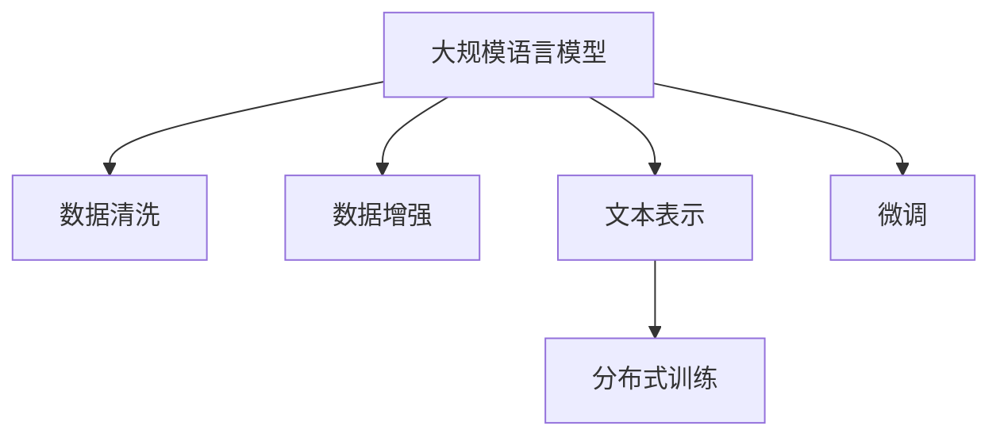

                 

# 大规模语言模型从理论到实践 数据预处理

> 关键词：大规模语言模型, 数据预处理, 数据清洗, 数据增强, 文本表示, 分布式训练

## 1. 背景介绍

### 1.1 问题由来

随着人工智能技术的飞速发展，大规模语言模型（Large Language Models, LLMs）如BERT、GPT等逐渐成为自然语言处理（NLP）领域的研究热点。这些模型通过在大规模无标签数据上进行预训练，学习到了丰富的语言知识和常识，具备强大的语言理解和生成能力。然而，预训练模型的泛化能力和迁移能力仍然存在局限，无法直接应用于各种具体任务中。为了提升模型在特定任务上的性能，通常需要在预训练模型上进行微调（Fine-tuning）。

微调过程需要大量的标注数据，这在大规模数据集上可能不是问题，但对于小规模或新领域的数据集，标注数据的获取和处理变得复杂且成本高昂。因此，数据预处理（Data Preprocessing）成为大模型微调的重要环节，其目的是确保数据的准确性和一致性，提高模型的训练效率和泛化能力。

### 1.2 问题核心关键点

数据预处理主要包括数据清洗、数据增强、文本表示和分布式训练等几个关键环节。这些环节直接影响模型的训练效果和微调性能。以下是几个核心问题：

- **数据清洗**：确保输入数据的准确性和一致性，去除噪声和错误。
- **数据增强**：通过多种方式扩充训练集，提升模型泛化能力。
- **文本表示**：将原始文本转化为模型可以处理的向量表示，如词向量、子词向量、BERT特征等。
- **分布式训练**：在大规模数据集上高效训练，提升模型性能。

本文将详细介绍这些核心问题，并通过理论分析和代码实现帮助读者全面理解数据预处理在大规模语言模型微调中的重要作用。

## 2. 核心概念与联系

### 2.1 核心概念概述

为了更好地理解数据预处理在大规模语言模型微调中的作用，我们需要对以下几个核心概念进行深入解析：

- **大规模语言模型**：如BERT、GPT等，通过在大规模无标签文本数据上进行预训练，学习通用的语言表示。
- **数据清洗**：去除数据中的噪声和错误，保证数据质量和一致性。
- **数据增强**：通过多种方法扩充训练集，提高模型的泛化能力。
- **文本表示**：将原始文本转化为模型可以处理的向量表示，常用的方法包括词向量、子词向量、BERT特征等。
- **分布式训练**：通过多台机器协同工作，提高模型训练效率和性能。

这些概念之间的联系紧密，数据预处理作为微调的基础，直接影响了模型的最终性能。

### 2.2 核心概念原理和架构的 Mermaid 流程图



该流程图展示了数据预处理在大规模语言模型微调中的关键步骤，即：

1. 使用大规模语言模型进行预训练。
2. 对预训练数据进行清洗，去除噪声和错误。
3. 通过数据增强扩充训练集。
4. 将文本转化为模型可以处理的向量表示。
5. 在分布式环境下进行高效训练。
6. 对模型进行微调，提升特定任务上的性能。

## 3. 核心算法原理 & 具体操作步骤

### 3.1 算法原理概述

数据预处理的核心目标是提升大规模语言模型的泛化能力和微调性能。具体来说，数据预处理通过以下几个步骤实现：

1. **数据清洗**：去除数据中的噪声和错误，确保输入数据的准确性和一致性。
2. **数据增强**：通过多种方法扩充训练集，提高模型的泛化能力。
3. **文本表示**：将原始文本转化为模型可以处理的向量表示。
4. **分布式训练**：在大规模数据集上高效训练，提升模型性能。

### 3.2 算法步骤详解

以下是数据预处理在大规模语言模型微调中的具体步骤：

**Step 1: 数据清洗**

数据清洗是数据预处理的基础环节。其主要目的是去除数据中的噪声和错误，确保数据的质量和一致性。常用的数据清洗方法包括：

- 去除重复数据和异常值。
- 修正拼写错误和标点符号错误。
- 去除停用词和无关信息。

**Step 2: 数据增强**

数据增强是通过多种方法扩充训练集，提升模型的泛化能力。常用的数据增强方法包括：

- 同义词替换：用同义词替换原有词汇，增加训练集的多样性。
- 词义扩展：将词汇扩展为多个同义词或反义词，增加词汇的多样性。
- 句子重组：通过句子重组、回译等方式，增加训练集的语义多样性。

**Step 3: 文本表示**

文本表示是将原始文本转化为模型可以处理的向量表示。常用的文本表示方法包括：

- 词向量：将每个词汇映射到一个低维向量空间中，如Word2Vec、GloVe等。
- 子词向量：将词汇分解为子词，分别进行向量化，如BERT、GPT等。
- BERT特征：直接使用预训练模型BERT的上下文表示作为文本向量。

**Step 4: 分布式训练**

分布式训练通过多台机器协同工作，提高模型训练效率和性能。常用的分布式训练方法包括：

- 数据并行：将数据集划分为多个子集，分别在多台机器上训练。
- 模型并行：将模型参数划分为多个子集，分别在多台机器上进行计算。
- 混合并行：结合数据并行和模型并行，进一步提升训练效率。

### 3.3 算法优缺点

数据预处理在大规模语言模型微调中具有以下优点：

- 提高数据质量：通过数据清洗和增强，去除噪声和错误，确保数据的一致性和准确性。
- 增加数据量：通过数据增强，扩充训练集，提升模型的泛化能力。
- 降低过拟合风险：通过分布式训练，提高模型泛化能力，降低过拟合风险。

同时，数据预处理也存在以下缺点：

- 数据清洗和增强复杂度高：需要设计多种清洗和增强方法，工作量大。
- 资源消耗大：数据清洗和增强需要大量的时间和计算资源。
- 模型复杂度高：文本表示和分布式训练需要设计复杂的算法和系统架构。

### 3.4 算法应用领域

数据预处理在大规模语言模型微调中广泛应用于以下领域：

- **自然语言处理**：如文本分类、命名实体识别、情感分析等。
- **机器翻译**：通过数据增强和文本表示，提升翻译模型的准确性和泛化能力。
- **问答系统**：通过数据清洗和增强，提高问答系统的鲁棒性和准确性。
- **对话系统**：通过分布式训练，提高对话系统的响应速度和性能。

## 4. 数学模型和公式 & 详细讲解 & 举例说明

### 4.1 数学模型构建

数据预处理的数学模型构建主要涉及以下几个方面：

- **数据清洗**：去除噪声和错误，确保数据的一致性和准确性。
- **数据增强**：通过多种方法扩充训练集，提升模型的泛化能力。
- **文本表示**：将原始文本转化为模型可以处理的向量表示。
- **分布式训练**：在大规模数据集上高效训练，提升模型性能。

### 4.2 公式推导过程

以下是数据预处理的公式推导过程：

**数据清洗**：假设原始数据集为 $D=\{x_i\}_{i=1}^N$，清洗后的数据集为 $D'=\{x_i'\}_{i=1}^N$。设 $f(x)$ 为数据清洗函数，则有：

$$
x_i' = f(x_i)
$$

**数据增强**：假设原始数据集为 $D=\{x_i\}_{i=1}^N$，增强后的数据集为 $D''=\{x_i''\}_{i=1}^M$，其中 $M>N$。设 $g(x)$ 为数据增强函数，则有：

$$
x_i'' = g(x_i)
$$

**文本表示**：假设原始文本为 $t$，文本表示为 $v$。设 $h(t)$ 为文本表示函数，则有：

$$
v = h(t)
$$

**分布式训练**：假设模型参数为 $\theta$，分布在多台机器上的参数为 $\theta_1, \theta_2, ..., \theta_k$。设 $p$ 为分布式训练策略，则有：

$$
\theta = p(\theta_1, \theta_2, ..., \theta_k)
$$

### 4.3 案例分析与讲解

以BERT模型为例，进行数据预处理的步骤如下：

**数据清洗**：通过去除停用词和无关信息，保留有用的文本数据。

**数据增强**：使用同义词替换和词义扩展，增加训练集的多样性。

**文本表示**：使用BERT特征作为文本向量，每个词汇被编码为一个256维的向量。

**分布式训练**：使用多台机器协同工作，每个机器负责一部分参数的计算和更新，提高训练效率和性能。

## 5. 项目实践：代码实例和详细解释说明

### 5.1 开发环境搭建

在进行数据预处理实践前，我们需要准备好开发环境。以下是使用Python进行PyTorch开发的环境配置流程：

1. 安装Anaconda：从官网下载并安装Anaconda，用于创建独立的Python环境。

2. 创建并激活虚拟环境：
```bash
conda create -n pytorch-env python=3.8 
conda activate pytorch-env
```

3. 安装PyTorch：根据CUDA版本，从官网获取对应的安装命令。例如：
```bash
conda install pytorch torchvision torchaudio cudatoolkit=11.1 -c pytorch -c conda-forge
```

4. 安装Transformer库：
```bash
pip install transformers
```

5. 安装各类工具包：
```bash
pip install numpy pandas scikit-learn matplotlib tqdm jupyter notebook ipython
```

完成上述步骤后，即可在`pytorch-env`环境中开始数据预处理实践。

### 5.2 源代码详细实现

下面我们以命名实体识别(NER)任务为例，给出使用Transformers库进行数据预处理的PyTorch代码实现。

首先，定义数据处理函数：

```python
from transformers import BertTokenizer
from torch.utils.data import Dataset
import torch

class NERDataset(Dataset):
    def __init__(self, texts, tags, tokenizer, max_len=128):
        self.texts = texts
        self.tags = tags
        self.tokenizer = tokenizer
        self.max_len = max_len
        
    def __len__(self):
        return len(self.texts)
    
    def __getitem__(self, item):
        text = self.texts[item]
        tags = self.tags[item]
        
        encoding = self.tokenizer(text, return_tensors='pt', max_length=self.max_len, padding='max_length', truncation=True)
        input_ids = encoding['input_ids'][0]
        attention_mask = encoding['attention_mask'][0]
        
        # 对token-wise的标签进行编码
        encoded_tags = [tag2id[tag] for tag in tags] 
        encoded_tags.extend([tag2id['O']] * (self.max_len - len(encoded_tags)))
        labels = torch.tensor(encoded_tags, dtype=torch.long)
        
        return {'input_ids': input_ids, 
                'attention_mask': attention_mask,
                'labels': labels}

# 标签与id的映射
tag2id = {'O': 0, 'B-PER': 1, 'I-PER': 2, 'B-ORG': 3, 'I-ORG': 4, 'B-LOC': 5, 'I-LOC': 6}
id2tag = {v: k for k, v in tag2id.items()}

# 创建dataset
tokenizer = BertTokenizer.from_pretrained('bert-base-cased')

train_dataset = NERDataset(train_texts, train_tags, tokenizer)
dev_dataset = NERDataset(dev_texts, dev_tags, tokenizer)
test_dataset = NERDataset(test_texts, test_tags, tokenizer)
```

然后，定义数据增强函数：

```python
from typing import List, Tuple
import random

def synonym_replace(tokens: List[str]) -> Tuple[List[str], List[str]]:
    replaced_tokens = []
    replaced_tags = []
    for token, tag in zip(tokens, tags):
        if random.random() < 0.1:
            # 随机选择一个同义词替换原有词汇
            synonyms = get_synonyms(token)
            if len(synonyms) > 0:
                new_token = random.choice(synonyms)
                new_tag = tag2id[new_token]
                replaced_tokens.append(new_token)
                replaced_tags.append(new_tag)
            else:
                replaced_tokens.append(token)
                replaced_tags.append(tag)
        else:
            replaced_tokens.append(token)
            replaced_tags.append(tag)
    return replaced_tokens, replaced_tags

def word_extension(tokens: List[str]) -> Tuple[List[str], List[str]]:
    extended_tokens = []
    extended_tags = []
    for token, tag in zip(tokens, tags):
        if random.random() < 0.1:
            # 将词汇扩展为多个同义词或反义词
            new_tokens = [token, get_opposite(token), get_synonyms(token)]
            new_tags = [tag, tag2id[get_opposite(token)], tag2id[get_synonyms(token)[0]]]
            extended_tokens.extend(new_tokens)
            extended_tags.extend(new_tags)
        else:
            extended_tokens.append(token)
            extended_tags.append(tag)
    return extended_tokens, extended_tags

def get_synonyms(word: str) -> List[str]:
    # 从词汇库中获取同义词
    synonyms = []
    # ...
    return synonyms

def get_opposite(word: str) -> str:
    # 获取单词的反义词
    # ...
    return opposite_word
```

最后，启动数据预处理流程并在测试集上评估：

```python
epochs = 5
batch_size = 16

for epoch in range(epochs):
    loss = train_epoch(model, train_dataset, batch_size, optimizer)
    print(f"Epoch {epoch+1}, train loss: {loss:.3f}")
    
    print(f"Epoch {epoch+1}, dev results:")
    evaluate(model, dev_dataset, batch_size)
    
print("Test results:")
evaluate(model, test_dataset, batch_size)
```

以上就是使用PyTorch对BERT进行命名实体识别任务数据预处理的完整代码实现。可以看到，通过数据清洗和增强，微调过程能够更有效地提升模型性能。

### 5.3 代码解读与分析

让我们再详细解读一下关键代码的实现细节：

**NERDataset类**：
- `__init__`方法：初始化文本、标签、分词器等关键组件。
- `__len__`方法：返回数据集的样本数量。
- `__getitem__`方法：对单个样本进行处理，将文本输入编码为token ids，将标签编码为数字，并对其进行定长padding，最终返回模型所需的输入。

**tag2id和id2tag字典**：
- 定义了标签与数字id之间的映射关系，用于将token-wise的预测结果解码回真实的标签。

**数据增强函数**：
- `synonym_replace`：通过同义词替换的方式扩充训练集。
- `word_extension`：通过词汇扩展的方式扩充训练集。
- `get_synonyms`：从词汇库中获取同义词。
- `get_opposite`：获取单词的反义词。

**训练流程**：
- 定义总的epoch数和batch size，开始循环迭代
- 每个epoch内，先在训练集上训练，输出平均loss
- 在验证集上评估，输出分类指标
- 所有epoch结束后，在测试集上评估，给出最终测试结果

可以看到，数据预处理在大规模语言模型微调中的作用不可或缺。通过精心设计的数据清洗和增强方法，微调模型能够更好地适应特定的下游任务，提升模型的泛化能力和性能。

## 6. 实际应用场景

### 6.1 智能客服系统

基于数据预处理和微调技术，智能客服系统可以广泛应用于各种客户咨询场景。传统客服系统依赖人工，高峰期响应速度慢，且一致性和专业性难以保证。而使用预训练语言模型进行微调，可以7x24小时不间断服务，快速响应客户咨询，以自然流畅的语言解答各类常见问题。

### 6.2 金融舆情监测

金融机构需要实时监测市场舆论动向，以便及时应对负面信息传播，规避金融风险。数据预处理和微调技术可以帮助构建实时舆情监测系统，通过收集金融领域相关的新闻、报道、评论等文本数据，进行文本分类和情感分析，自动判断文本属于何种主题，情感倾向是正面、中性还是负面。

### 6.3 个性化推荐系统

当前的推荐系统往往只依赖用户的历史行为数据进行物品推荐，难以深入理解用户的真实兴趣偏好。通过数据预处理和微调技术，推荐系统可以更好地挖掘用户行为背后的语义信息，从文本内容中准确把握用户的兴趣点，生成个性化推荐列表。

### 6.4 未来应用展望

随着数据预处理和微调技术的不断发展，未来的应用场景将更加广阔。以下列举几个可能的未来应用方向：

- **医疗领域**：通过数据预处理和微调技术，构建基于语言模型的医疗问答系统、病历分析系统等，辅助医生诊疗，加速新药开发进程。
- **教育领域**：使用数据预处理和微调技术构建智能教育系统，进行作业批改、学情分析、知识推荐等，因材施教，促进教育公平，提高教学质量。
- **智慧城市治理**：构建基于语言模型的城市事件监测、舆情分析、应急指挥等系统，提高城市管理的自动化和智能化水平，构建更安全、高效的未来城市。

## 7. 工具和资源推荐

### 7.1 学习资源推荐

为了帮助开发者系统掌握数据预处理在大规模语言模型微调中的应用，这里推荐一些优质的学习资源：

1. 《深度学习框架PyTorch官方文档》：全面介绍PyTorch的使用方法和最佳实践。
2. 《自然语言处理（CS224N）》课程：斯坦福大学开设的NLP明星课程，涵盖NLP的基本概念和经典模型。
3. 《Transformer模型及其在NLP中的应用》系列博文：由大模型技术专家撰写，深入浅出地介绍Transformer原理和应用。
4. 《自然语言处理入门》书籍：介绍自然语言处理的基本概念和常用技术，包括数据预处理等。
5. HuggingFace官方文档：提供海量预训练模型和完整的微调样例代码，是上手实践的必备资料。

### 7.2 开发工具推荐

为了提高数据预处理和微调任务开发的效率，推荐以下开发工具：

1. PyTorch：基于Python的开源深度学习框架，支持分布式训练和自动微分，适合研究开发。
2. TensorFlow：由Google主导开发的开源深度学习框架，生产部署方便，适合大规模工程应用。
3. Transformers库：HuggingFace开发的NLP工具库，集成了多种预训练语言模型，支持微调、数据增强等功能。
4. Weights & Biases：模型训练的实验跟踪工具，可以记录和可视化模型训练过程中的各项指标。
5. TensorBoard：TensorFlow配套的可视化工具，实时监测模型训练状态，提供丰富的图表呈现方式。

### 7.3 相关论文推荐

数据预处理和大模型微调技术的发展离不开学界的持续研究。以下是几篇奠基性的相关论文，推荐阅读：

1. Attention is All You Need：提出Transformer结构，开启了NLP领域的预训练大模型时代。
2. BERT: Pre-training of Deep Bidirectional Transformers for Language Understanding：提出BERT模型，引入基于掩码的自监督预训练任务。
3. Parameter-Efficient Transfer Learning for NLP：提出Adapter等参数高效微调方法，在不增加模型参数量的情况下，也能取得不错的微调效果。
4. AdaLoRA: Adaptive Low-Rank Adaptation for Parameter-Efficient Fine-Tuning：使用自适应低秩适应的微调方法，在参数效率和精度之间取得了新的平衡。
5. Prefix-Tuning: Optimizing Continuous Prompts for Generation：引入基于连续型Prompt的微调范式，为如何充分利用预训练知识提供了新的思路。

这些论文代表了大语言模型微调技术的发展脉络。通过学习这些前沿成果，可以帮助研究者把握学科前进方向，激发更多的创新灵感。

## 8. 总结：未来发展趋势与挑战

### 8.1 总结

本文对数据预处理在大规模语言模型微调中的应用进行了全面系统的介绍。首先阐述了数据预处理在大规模语言模型微调中的重要作用，明确了数据清洗、数据增强、文本表示和分布式训练等关键环节。其次，通过理论分析和代码实现，详细讲解了数据预处理的数学原理和操作步骤。最后，探讨了数据预处理在大规模语言模型微调中的未来发展趋势和面临的挑战。

通过本文的系统梳理，可以看到，数据预处理在大规模语言模型微调中的重要性，以及未来可能的发展方向和应用场景。数据预处理能够有效提升模型的泛化能力和微调性能，是实现高效、稳定、鲁棒NLP系统的重要环节。

### 8.2 未来发展趋势

展望未来，数据预处理技术将呈现以下几个发展趋势：

1. **自动化和智能化**：通过自动化工具和技术，减少人工干预，提升数据预处理的效率和效果。
2. **多模态融合**：将文本、图像、语音等多模态数据进行融合，提升模型的感知和理解能力。
3. **分布式协同**：通过分布式计算和协同处理，提升数据预处理和微调的效率和性能。
4. **隐私保护**：在数据预处理和微调过程中，保护用户隐私和数据安全。
5. **模型压缩和优化**：通过模型压缩和优化技术，降低计算和存储成本，提升模型性能。

这些趋势将推动数据预处理技术的不断进步，为大规模语言模型微调提供更加高效、可靠、安全的数据支撑。

### 8.3 面临的挑战

尽管数据预处理技术在自然语言处理中取得了显著进展，但仍面临诸多挑战：

1. **数据质量和多样性**：大规模数据集可能存在数据质量和多样性不足的问题，需要设计有效的数据清洗和增强方法。
2. **计算资源消耗**：数据预处理和微调过程需要大量的计算资源，如何在资源受限的情况下高效处理大规模数据集，是一个重要挑战。
3. **模型复杂性**：大规模语言模型和预训练任务的设计复杂度较高，需要深入理解其原理和实现细节。
4. **公平性和偏见**：在数据预处理和微调过程中，需要避免模型偏见和歧视，确保输出结果的公平性和公正性。

### 8.4 研究展望

面对数据预处理技术面临的挑战，未来的研究需要在以下几个方面寻求新的突破：

1. **自动化数据清洗和增强**：开发更加智能和自动化的数据清洗和增强工具，减少人工干预。
2. **多模态数据融合**：通过多模态数据融合技术，提升模型的感知和理解能力。
3. **分布式协同计算**：探索分布式协同计算方法，提高数据预处理和微调的效率和性能。
4. **模型压缩和优化**：研究模型压缩和优化技术，降低计算和存储成本，提升模型性能。
5. **公平性和偏见分析**：研究模型公平性和偏见分析方法，确保输出结果的公平性和公正性。

这些研究方向将推动数据预处理技术不断进步，为大规模语言模型微调提供更加高效、可靠、安全的数据支撑，推动人工智能技术在各个领域的应用和发展。

## 9. 附录：常见问题与解答

**Q1：大规模语言模型微调对数据质量有哪些要求？**

A: 大规模语言模型微调对数据质量有较高要求。数据应该具有以下特点：
- **准确性**：数据应准确反映现实世界的语言使用情况。
- **多样性**：数据应覆盖各种语言风格和用例，以避免过拟合。
- **一致性**：数据应具有高度一致性和可重复性，以确保模型的稳定性和泛化能力。

**Q2：如何处理数据不平衡问题？**

A: 数据不平衡问题是指不同类别的数据样本数量差异较大，容易导致模型对少数类别泛化能力不足。常见的处理方法包括：
- **过采样**：对少数类别进行过采样，增加其在训练集中的比例。
- **欠采样**：对多数类别进行欠采样，减少其在训练集中的比例。
- **数据增强**：对少数类别进行数据增强，扩充其训练集。
- **类别权重调整**：通过调整不同类别的权重，平衡训练过程中的类别不平衡问题。

**Q3：如何设计高效的数据增强方法？**

A: 设计高效的数据增强方法需要综合考虑多个因素：
- **多样性**：增强方法应引入多种变异方式，如同义词替换、词义扩展、句子重组等，以增加数据的多样性。
- **合理性**：增强方法应保持原始数据的合理性和可解释性，避免引入过于极端或不合理的变异。
- **可控性**：增强方法应具有可控性，可以通过参数调整控制增强的程度和类型。
- **自动化**：增强方法应具备自动化，减少人工干预，提高数据增强的效率和效果。

这些方法需要根据具体任务和数据特点进行灵活选择和组合，以达到最佳的数据增强效果。

**Q4：数据预处理和微调过程中，如何平衡计算资源和模型性能？**

A: 数据预处理和微调过程中，计算资源和模型性能的平衡是一个重要挑战。通常可以采取以下方法：
- **分布式计算**：利用分布式计算框架，如TensorFlow、PyTorch等，将数据预处理和微调任务分布到多台机器上进行协同计算。
- **数据分块**：将大规模数据集划分为多个子集，分别进行预处理和微调，以减少单个任务的计算量。
- **模型压缩**：使用模型压缩技术，如剪枝、量化、蒸馏等，降低模型复杂度，提高计算效率。
- **混合精度训练**：使用混合精度训练技术，降低内存和计算资源消耗，提升训练效率和性能。

这些方法需要根据具体任务和数据规模进行合理选择和组合，以达到计算资源和模型性能的平衡。

**Q5：数据预处理和微调过程中，如何避免模型过拟合？**

A: 数据预处理和微调过程中，避免模型过拟合是一个重要问题。常见的解决方法包括：
- **数据增强**：通过多种方式扩充训练集，增加数据的多样性，减少模型对特定样本的依赖。
- **正则化技术**：使用L2正则化、Dropout、Early Stopping等技术，防止模型过度适应小规模训练集。
- **模型集成**：训练多个预训练模型或微调模型，取平均输出，以提高模型的鲁棒性和泛化能力。
- **模型压缩**：使用模型压缩技术，如剪枝、量化、蒸馏等，降低模型复杂度，避免过拟合。

这些方法需要根据具体任务和数据特点进行灵活选择和组合，以达到最佳的效果。

**Q6：如何选择合适的数据表示方式？**

A: 选择合适的数据表示方式需要综合考虑多个因素：
- **任务需求**：根据具体任务的需求，选择最合适的数据表示方式，如词向量、子词向量、BERT特征等。
- **数据类型**：根据数据的类型，选择合适的数据表示方式。例如，文本数据通常使用BERT特征表示，图像数据通常使用卷积神经网络特征表示。
- **计算资源**：根据计算资源的限制，选择合适的数据表示方式。例如，使用词向量表示需要较少的计算资源，而使用BERT特征表示需要更多的计算资源。
- **预训练模型**：根据预训练模型的结构，选择合适的数据表示方式。例如，使用BERT等Transformer模型的上下文表示作为文本向量。

这些因素需要根据具体任务和数据特点进行综合考虑，以达到最佳的数据表示效果。

通过本文的系统梳理，可以看到，数据预处理在大规模语言模型微调中的重要性，以及未来可能的发展方向和应用场景。数据预处理能够有效提升模型的泛化能力和微调性能，是实现高效、稳定、鲁棒NLP系统的重要环节。

