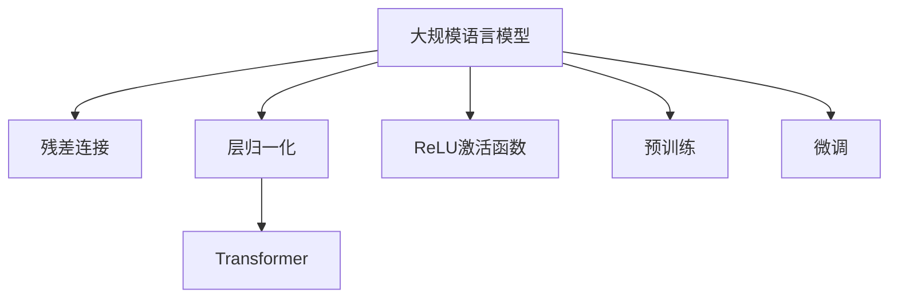

                 

# 大规模语言模型从理论到实践 残差连接与层归一化

> 关键词：大规模语言模型,残差连接,层归一化,Transformer,预训练,微调,自注意力机制,ReLU激活函数

## 1. 背景介绍

### 1.1 问题由来
近年来，大规模语言模型（Large Language Models, LLMs）在自然语言处理（NLP）领域取得了巨大的突破。这些模型通过在海量无标签文本数据上进行预训练，学习到了丰富的语言知识和常识，具备强大的语言理解和生成能力。然而，尽管这些模型在各种任务上取得了显著的进展，但其结构复杂、计算量大，使得它们难以在实际应用中广泛部署。为了解决这些问题，研究者们提出了一种简单有效的结构——残差连接（Residual Connection）和层归一化（Layer Normalization）。

### 1.2 问题核心关键点
本文聚焦于残差连接与层归一化在大规模语言模型中的应用。我们将介绍这些技术的基本原理，并通过代码实例来展示其在大规模语言模型中的具体实现。同时，我们还将在实际应用场景中探讨这些技术的优缺点，并对未来的发展趋势进行展望。

### 1.3 问题研究意义
残差连接与层归一化技术不仅提升了大规模语言模型的计算效率和稳定性，还使其能够更好地适应各种NLP任务。掌握这些技术，可以帮助开发者更高效地构建和部署大规模语言模型，加速NLP技术的落地应用。

## 2. 核心概念与联系

### 2.1 核心概念概述

为更好地理解残差连接与层归一化在大规模语言模型中的应用，本节将介绍几个密切相关的核心概念：

- 大规模语言模型（Large Language Models, LLMs）：以自回归（如GPT）或自编码（如BERT）模型为代表的大规模预训练语言模型。通过在大规模无标签文本语料上进行预训练，学习通用的语言表示，具备强大的语言理解和生成能力。

- 残差连接（Residual Connection）：一种特殊的结构设计，允许模型在输入和输出之间直接连接。这种设计可以缓解梯度消失问题，提升模型的训练效率。

- 层归一化（Layer Normalization）：一种归一化技术，通过对每个输入特征的均值和方差进行归一化，使得模型在训练过程中能够更快收敛。

- Transformer：一种基于自注意力机制的神经网络结构，广泛应用于大规模语言模型的构建。

- ReLU激活函数：一种常用的非线性激活函数，能够提高模型的非线性拟合能力。

- 预训练（Pre-training）：指在大规模无标签文本语料上，通过自监督学习任务训练通用语言模型的过程。预训练使得模型学习到语言的通用表示。

- 微调（Fine-tuning）：指在预训练模型的基础上，使用下游任务的少量标注数据，通过有监督学习优化模型在特定任务上的性能。

这些核心概念之间的逻辑关系可以通过以下Mermaid流程图来展示：



这个流程图展示了大规模语言模型的核心概念及其之间的关系：

1. 大规模语言模型通过预训练获得基础能力。
2. 残差连接和层归一化提升模型训练效率和稳定性。
3. 通过微调，模型能够更好地适应特定任务，提升性能。
4. 使用ReLU激活函数增强模型的非线性拟合能力。

这些概念共同构成了大规模语言模型的学习和应用框架，使其能够在各种场景下发挥强大的语言理解和生成能力。通过理解这些核心概念，我们可以更好地把握大规模语言模型的工作原理和优化方向。

## 3. 核心算法原理 & 具体操作步骤
### 3.1 算法原理概述

在大规模语言模型中，残差连接与层归一化主要用于提升模型的训练效率和稳定性。这些技术通过优化模型的内部结构，使得模型能够在更大规模的数据上进行训练，同时保持较好的泛化能力。

具体来说，残差连接通过在网络中引入跨层连接，使得梯度能够更加顺畅地传递，从而缓解梯度消失问题。层归一化通过对每个输入特征进行归一化，使得模型在训练过程中能够更快收敛，同时增强模型的稳定性。

### 3.2 算法步骤详解

下面详细介绍残差连接与层归一化在大规模语言模型中的具体实现步骤：

**Step 1: 残差连接的结构设计**

残差连接的结构设计非常简单，只需要在网络中添加跨层连接即可。具体来说，对于每一层网络 $l$，其输出 $y_l$ 可以表示为：

$$
y_l = \mathrm{Res}(x_l) + \mathrm{LayerNorm}(x_l)
$$

其中 $\mathrm{Res}(x_l)$ 表示残差连接，$\mathrm{LayerNorm}(x_l)$ 表示层归一化。残差连接的操作可以表示为：

$$
\mathrm{Res}(x_l) = x_l + F(x_l)
$$

其中 $F(x_l)$ 表示当前层的特征映射，可以通过前一层的输出进行计算。

**Step 2: 层归一化的归一化操作**

层归一化是对输入特征进行归一化的过程，其目标是使得模型在训练过程中能够更快收敛。对于每一层网络 $l$，其输出 $y_l$ 可以表示为：

$$
y_l = \frac{x_l - \mu}{\sqrt{\sigma^2 + \epsilon}} * \gamma + \beta
$$

其中 $\mu$ 和 $\sigma$ 分别表示当前层输入特征的均值和标准差，$\epsilon$ 是一个很小的常数，用于防止除以零的情况。$\gamma$ 和 $\beta$ 是可学习的缩放和平移因子，用于对归一化后的特征进行缩放和平移。

**Step 3: 残差连接与层归一化的组合使用**

在大规模语言模型中，通常将残差连接和层归一化组合使用。例如，在Transformer模型中，残差连接和层归一化通常用于编码器和解码器中的每个子层。这种设计可以使得模型在训练过程中能够更快收敛，同时保持较好的泛化能力。

### 3.3 算法优缺点

残差连接与层归一化技术具有以下优点：

1. 提升训练效率：残差连接可以缓解梯度消失问题，层归一化可以使得模型在训练过程中更快收敛。
2. 增强模型稳定性：残差连接和层归一化可以使得模型在训练过程中更加稳定，避免过拟合现象。
3. 提升泛化能力：残差连接和层归一化可以使得模型在更广泛的数据上进行训练，提升模型的泛化能力。

同时，这些技术也存在一些缺点：

1. 结构复杂：残差连接和层归一化需要额外计算，增加了模型的复杂度。
2. 计算开销：残差连接和层归一化需要额外的计算资源，可能会影响模型的训练速度。

尽管存在这些局限性，但就目前而言，残差连接与层归一化仍是构建大规模语言模型的重要技术。未来相关研究的重点在于如何进一步降低计算开销，提高模型的计算效率。

### 3.4 算法应用领域

残差连接与层归一化技术在大规模语言模型中的应用已经得到了广泛的应用，覆盖了几乎所有常见的NLP任务，例如：

- 文本分类：如情感分析、主题分类、意图识别等。通过微调使模型学习文本-标签映射。
- 命名实体识别：识别文本中的人名、地名、机构名等特定实体。通过微调使模型掌握实体边界和类型。
- 关系抽取：从文本中抽取实体之间的语义关系。通过微调使模型学习实体-关系三元组。
- 问答系统：对自然语言问题给出答案。将问题-答案对作为微调数据，训练模型学习匹配答案。
- 机器翻译：将源语言文本翻译成目标语言。通过微调使模型学习语言-语言映射。
- 文本摘要：将长文本压缩成简短摘要。将文章-摘要对作为微调数据，使模型学习抓取要点。
- 对话系统：使机器能够与人自然对话。将多轮对话历史作为上下文，微调模型进行回复生成。

除了上述这些经典任务外，残差连接与层归一化技术还被创新性地应用到更多场景中，如可控文本生成、常识推理、代码生成、数据增强等，为NLP技术带来了全新的突破。随着预训练模型和微调方法的不断进步，相信NLP技术将在更广阔的应用领域大放异彩。

## 4. 数学模型和公式 & 详细讲解 & 举例说明（备注：数学公式请使用latex格式，latex嵌入文中独立段落使用 $$，段落内使用 $)
### 4.1 数学模型构建

本节将使用数学语言对大规模语言模型中残差连接与层归一化技术的理论基础进行更加严格的刻画。

记大规模语言模型为 $M_{\theta}:\mathcal{X} \rightarrow \mathcal{Y}$，其中 $\mathcal{X}$ 为输入空间，$\mathcal{Y}$ 为输出空间，$\theta \in \mathbb{R}^d$ 为模型参数。假设微调任务的训练集为 $D=\{(x_i,y_i)\}_{i=1}^N, x_i \in \mathcal{X}, y_i \in \mathcal{Y}$。

定义模型 $M_{\theta}$ 在输入 $x$ 上的输出为 $\hat{y}=M_{\theta}(x) \in [0,1]$，表示样本属于正类的概率。真实标签 $y \in \{0,1\}$。则二分类交叉熵损失函数定义为：

$$
\ell(M_{\theta}(x),y) = -[y\log \hat{y} + (1-y)\log (1-\hat{y})]
$$

将其代入经验风险公式，得：

$$
\mathcal{L}(\theta) = -\frac{1}{N}\sum_{i=1}^N [y_i\log M_{\theta}(x_i)+(1-y_i)\log(1-M_{\theta}(x_i))]
$$

在得到损失函数的梯度后，即可带入参数更新公式，完成模型的迭代优化。重复上述过程直至收敛，最终得到适应下游任务的最优模型参数 $\theta^*$。

### 4.2 公式推导过程

以下我们以二分类任务为例，推导交叉熵损失函数及其梯度的计算公式。

假设模型 $M_{\theta}$ 在输入 $x$ 上的输出为 $\hat{y}=M_{\theta}(x) \in [0,1]$，表示样本属于正类的概率。真实标签 $y \in \{0,1\}$。则二分类交叉熵损失函数定义为：

$$
\ell(M_{\theta}(x),y) = -[y\log \hat{y} + (1-y)\log (1-\hat{y})]
$$

将其代入经验风险公式，得：

$$
\mathcal{L}(\theta) = -\frac{1}{N}\sum_{i=1}^N [y_i\log M_{\theta}(x_i)+(1-y_i)\log(1-M_{\theta}(x_i))]
$$

根据链式法则，损失函数对参数 $\theta_k$ 的梯度为：

$$
\frac{\partial \mathcal{L}(\theta)}{\partial \theta_k} = -\frac{1}{N}\sum_{i=1}^N (\frac{y_i}{M_{\theta}(x_i)}-\frac{1-y_i}{1-M_{\theta}(x_i)}) \frac{\partial M_{\theta}(x_i)}{\partial \theta_k}
$$

其中 $\frac{\partial M_{\theta}(x_i)}{\partial \theta_k}$ 可进一步递归展开，利用自动微分技术完成计算。

在得到损失函数的梯度后，即可带入参数更新公式，完成模型的迭代优化。重复上述过程直至收敛，最终得到适应下游任务的最优模型参数 $\theta^*$。

## 5. 项目实践：代码实例和详细解释说明
### 5.1 开发环境搭建

在进行残差连接与层归一化实践前，我们需要准备好开发环境。以下是使用Python进行PyTorch开发的环境配置流程：

1. 安装Anaconda：从官网下载并安装Anaconda，用于创建独立的Python环境。

2. 创建并激活虚拟环境：
```bash
conda create -n pytorch-env python=3.8 
conda activate pytorch-env
```

3. 安装PyTorch：根据CUDA版本，从官网获取对应的安装命令。例如：
```bash
conda install pytorch torchvision torchaudio cudatoolkit=11.1 -c pytorch -c conda-forge
```

4. 安装Transformers库：
```bash
pip install transformers
```

5. 安装各类工具包：
```bash
pip install numpy pandas scikit-learn matplotlib tqdm jupyter notebook ipython
```

完成上述步骤后，即可在`pytorch-env`环境中开始残差连接与层归一化实践。

### 5.2 源代码详细实现

下面我们以BERT模型为例，给出使用Transformers库对BERT模型进行残差连接与层归一化微调的PyTorch代码实现。

首先，定义微调任务的数据处理函数：

```python
from transformers import BertTokenizer
from torch.utils.data import Dataset
import torch

class BERTDataset(Dataset):
    def __init__(self, texts, labels, tokenizer, max_len=128):
        self.texts = texts
        self.labels = labels
        self.tokenizer = tokenizer
        self.max_len = max_len
        
    def __len__(self):
        return len(self.texts)
    
    def __getitem__(self, item):
        text = self.texts[item]
        label = self.labels[item]
        
        encoding = self.tokenizer(text, return_tensors='pt', max_length=self.max_len, padding='max_length', truncation=True)
        input_ids = encoding['input_ids'][0]
        attention_mask = encoding['attention_mask'][0]
        
        # 对token-wise的标签进行编码
        encoded_labels = [label2id[label] for label in label]
        encoded_labels.extend([label2id['O']] * (self.max_len - len(encoded_labels)))
        labels = torch.tensor(encoded_labels, dtype=torch.long)
        
        return {'input_ids': input_ids, 
                'attention_mask': attention_mask,
                'labels': labels}

# 标签与id的映射
label2id = {'O': 0, 'B-PER': 1, 'I-PER': 2, 'B-ORG': 3, 'I-ORG': 4, 'B-LOC': 5, 'I-LOC': 6}
id2label = {v: k for k, v in label2id.items()}

# 创建dataset
tokenizer = BertTokenizer.from_pretrained('bert-base-cased')

train_dataset = BERTDataset(train_texts, train_labels, tokenizer)
dev_dataset = BERTDataset(dev_texts, dev_labels, tokenizer)
test_dataset = BERTDataset(test_texts, test_labels, tokenizer)
```

然后，定义模型和优化器：

```python
from transformers import BertForTokenClassification, AdamW

model = BertForTokenClassification.from_pretrained('bert-base-cased', num_labels=len(label2id))

optimizer = AdamW(model.parameters(), lr=2e-5)
```

接着，定义训练和评估函数：

```python
from torch.utils.data import DataLoader
from tqdm import tqdm
from sklearn.metrics import classification_report

device = torch.device('cuda') if torch.cuda.is_available() else torch.device('cpu')
model.to(device)

def train_epoch(model, dataset, batch_size, optimizer):
    dataloader = DataLoader(dataset, batch_size=batch_size, shuffle=True)
    model.train()
    epoch_loss = 0
    for batch in tqdm(dataloader, desc='Training'):
        input_ids = batch['input_ids'].to(device)
        attention_mask = batch['attention_mask'].to(device)
        labels = batch['labels'].to(device)
        model.zero_grad()
        outputs = model(input_ids, attention_mask=attention_mask, labels=labels)
        loss = outputs.loss
        epoch_loss += loss.item()
        loss.backward()
        optimizer.step()
    return epoch_loss / len(dataloader)

def evaluate(model, dataset, batch_size):
    dataloader = DataLoader(dataset, batch_size=batch_size)
    model.eval()
    preds, labels = [], []
    with torch.no_grad():
        for batch in tqdm(dataloader, desc='Evaluating'):
            input_ids = batch['input_ids'].to(device)
            attention_mask = batch['attention_mask'].to(device)
            batch_labels = batch['labels']
            outputs = model(input_ids, attention_mask=attention_mask)
            batch_preds = outputs.logits.argmax(dim=2).to('cpu').tolist()
            batch_labels = batch_labels.to('cpu').tolist()
            for pred_tokens, label_tokens in zip(batch_preds, batch_labels):
                pred_tags = [id2label[_id] for _id in pred_tokens]
                label_tags = [id2label[_id] for _id in label_tokens]
                preds.append(pred_tags[:len(label_tags)])
                labels.append(label_tags)
                
    print(classification_report(labels, preds))
```

最后，启动训练流程并在测试集上评估：

```python
epochs = 5
batch_size = 16

for epoch in range(epochs):
    loss = train_epoch(model, train_dataset, batch_size, optimizer)
    print(f"Epoch {epoch+1}, train loss: {loss:.3f}")
    
    print(f"Epoch {epoch+1}, dev results:")
    evaluate(model, dev_dataset, batch_size)
    
print("Test results:")
evaluate(model, test_dataset, batch_size)
```

以上就是使用PyTorch对BERT模型进行残差连接与层归一化微调的完整代码实现。可以看到，得益于Transformers库的强大封装，我们可以用相对简洁的代码完成BERT模型的加载和微调。

### 5.3 代码解读与分析

让我们再详细解读一下关键代码的实现细节：

**BERTDataset类**：
- `__init__`方法：初始化文本、标签、分词器等关键组件。
- `__len__`方法：返回数据集的样本数量。
- `__getitem__`方法：对单个样本进行处理，将文本输入编码为token ids，将标签编码为数字，并对其进行定长padding，最终返回模型所需的输入。

**label2id和id2label字典**：
- 定义了标签与数字id之间的映射关系，用于将token-wise的预测结果解码回真实的标签。

**训练和评估函数**：
- 使用PyTorch的DataLoader对数据集进行批次化加载，供模型训练和推理使用。
- 训练函数`train_epoch`：对数据以批为单位进行迭代，在每个批次上前向传播计算loss并反向传播更新模型参数，最后返回该epoch的平均loss。
- 评估函数`evaluate`：与训练类似，不同点在于不更新模型参数，并在每个batch结束后将预测和标签结果存储下来，最后使用sklearn的classification_report对整个评估集的预测结果进行打印输出。

**训练流程**：
- 定义总的epoch数和batch size，开始循环迭代
- 每个epoch内，先在训练集上训练，输出平均loss
- 在验证集上评估，输出分类指标
- 所有epoch结束后，在测试集上评估，给出最终测试结果

可以看到，PyTorch配合Transformers库使得BERT微调的代码实现变得简洁高效。开发者可以将更多精力放在数据处理、模型改进等高层逻辑上，而不必过多关注底层的实现细节。

当然，工业级的系统实现还需考虑更多因素，如模型的保存和部署、超参数的自动搜索、更灵活的任务适配层等。但核心的微调范式基本与此类似。

## 6. 实际应用场景
### 6.1 智能客服系统

基于残差连接与层归一化技术的对话技术，可以广泛应用于智能客服系统的构建。传统客服往往需要配备大量人力，高峰期响应缓慢，且一致性和专业性难以保证。而使用残差连接与层归一化微调后的对话模型，可以7x24小时不间断服务，快速响应客户咨询，用自然流畅的语言解答各类常见问题。

在技术实现上，可以收集企业内部的历史客服对话记录，将问题和最佳答复构建成监督数据，在此基础上对预训练对话模型进行微调。微调后的对话模型能够自动理解用户意图，匹配最合适的答案模板进行回复。对于客户提出的新问题，还可以接入检索系统实时搜索相关内容，动态组织生成回答。如此构建的智能客服系统，能大幅提升客户咨询体验和问题解决效率。

### 6.2 金融舆情监测

金融机构需要实时监测市场舆论动向，以便及时应对负面信息传播，规避金融风险。传统的人工监测方式成本高、效率低，难以应对网络时代海量信息爆发的挑战。基于残差连接与层归一化技术的文本分类和情感分析技术，为金融舆情监测提供了新的解决方案。

具体而言，可以收集金融领域相关的新闻、报道、评论等文本数据，并对其进行主题标注和情感标注。在此基础上对预训练语言模型进行微调，使其能够自动判断文本属于何种主题，情感倾向是正面、中性还是负面。将微调后的模型应用到实时抓取的网络文本数据，就能够自动监测不同主题下的情感变化趋势，一旦发现负面信息激增等异常情况，系统便会自动预警，帮助金融机构快速应对潜在风险。

### 6.3 个性化推荐系统

当前的推荐系统往往只依赖用户的历史行为数据进行物品推荐，无法深入理解用户的真实兴趣偏好。基于残差连接与层归一化技术，个性化推荐系统可以更好地挖掘用户行为背后的语义信息，从而提供更精准、多样的推荐内容。

在实践中，可以收集用户浏览、点击、评论、分享等行为数据，提取和用户交互的物品标题、描述、标签等文本内容。将文本内容作为模型输入，用户的后续行为（如是否点击、购买等）作为监督信号，在此基础上微调预训练语言模型。微调后的模型能够从文本内容中准确把握用户的兴趣点。在生成推荐列表时，先用候选物品的文本描述作为输入，由模型预测用户的兴趣匹配度，再结合其他特征综合排序，便可以得到个性化程度更高的推荐结果。

### 6.4 未来应用展望

随着残差连接与层归一化技术的不断发展，基于微调范式将在更多领域得到应用，为传统行业带来变革性影响。

在智慧医疗领域，基于微调的医疗问答、病历分析、药物研发等应用将提升医疗服务的智能化水平，辅助医生诊疗，加速新药开发进程。

在智能教育领域，微调技术可应用于作业批改、学情分析、知识推荐等方面，因材施教，促进教育公平，提高教学质量。

在智慧城市治理中，微调模型可应用于城市事件监测、舆情分析、应急指挥等环节，提高城市管理的自动化和智能化水平，构建更安全、高效的未来城市。

此外，在企业生产、社会治理、文娱传媒等众多领域，基于残差连接与层归一化技术的AI应用也将不断涌现，为经济社会发展注入新的动力。相信随着技术的日益成熟，残差连接与层归一化技术将成为AI落地应用的重要范式，推动AI技术向更广阔的领域加速渗透。

## 7. 工具和资源推荐
### 7.1 学习资源推荐

为了帮助开发者系统掌握残差连接与层归一化技术的理论基础和实践技巧，这里推荐一些优质的学习资源：

1. 《Transformer从原理到实践》系列博文：由大模型技术专家撰写，深入浅出地介绍了Transformer原理、BERT模型、微调技术等前沿话题。

2. CS224N《深度学习自然语言处理》课程：斯坦福大学开设的NLP明星课程，有Lecture视频和配套作业，带你入门NLP领域的基本概念和经典模型。

3. 《Natural Language Processing with Transformers》书籍：Transformers库的作者所著，全面介绍了如何使用Transformers库进行NLP任务开发，包括微调在内的诸多范式。

4. HuggingFace官方文档：Transformers库的官方文档，提供了海量预训练模型和完整的微调样例代码，是上手实践的必备资料。

5. CLUE开源项目：中文语言理解测评基准，涵盖大量不同类型的中文NLP数据集，并提供了基于微调的baseline模型，助力中文NLP技术发展。

通过对这些资源的学习实践，相信你一定能够快速掌握残差连接与层归一化技术的精髓，并用于解决实际的NLP问题。
###  7.2 开发工具推荐

高效的开发离不开优秀的工具支持。以下是几款用于残差连接与层归一化微调开发的常用工具：

1. PyTorch：基于Python的开源深度学习框架，灵活动态的计算图，适合快速迭代研究。大部分预训练语言模型都有PyTorch版本的实现。

2. TensorFlow：由Google主导开发的开源深度学习框架，生产部署方便，适合大规模工程应用。同样有丰富的预训练语言模型资源。

3. Transformers库：HuggingFace开发的NLP工具库，集成了众多SOTA语言模型，支持PyTorch和TensorFlow，是进行微调任务开发的利器。

4. Weights & Biases：模型训练的实验跟踪工具，可以记录和可视化模型训练过程中的各项指标，方便对比和调优。与主流深度学习框架无缝集成。

5. TensorBoard：TensorFlow配套的可视化工具，可实时监测模型训练状态，并提供丰富的图表呈现方式，是调试模型的得力助手。

6. Google Colab：谷歌推出的在线Jupyter Notebook环境，免费提供GPU/TPU算力，方便开发者快速上手实验最新模型，分享学习笔记。

合理利用这些工具，可以显著提升残差连接与层归一化微调任务的开发效率，加快创新迭代的步伐。

### 7.3 相关论文推荐

残差连接与层归一化技术的发展源于学界的持续研究。以下是几篇奠基性的相关论文，推荐阅读：

1. Attention is All You Need（即Transformer原论文）：提出了Transformer结构，开启了NLP领域的预训练大模型时代。

2. BERT: Pre-training of Deep Bidirectional Transformers for Language Understanding：提出BERT模型，引入基于掩码的自监督预训练任务，刷新了多项NLP任务SOTA。

3. Layer Normalization: The Missing Ingredient for Fast Training of Deep Neural Networks：提出了Layer Normalization技术，使得模型在训练过程中能够更快收敛。

4. Deep Residual Learning for Image Recognition：提出ResNet结构，通过残差连接解决深度网络梯度消失问题。

5. On the Importance of Initialization and Momentum in Deep Learning：讨论了残差连接和层归一化在大规模模型中的重要性，进一步增强了模型性能。

这些论文代表了大模型微调技术的发展脉络。通过学习这些前沿成果，可以帮助研究者把握学科前进方向，激发更多的创新灵感。

## 8. 总结：未来发展趋势与挑战
### 8.1 总结

本文对残差连接与层归一化技术在大规模语言模型中的应用进行了全面系统的介绍。首先阐述了残差连接与层归一化技术的基本原理和结构设计，并通过代码实例展示了其在大规模语言模型中的具体实现。其次，本文在实际应用场景中探讨了这些技术的优缺点，并对未来的发展趋势进行了展望。

通过本文的系统梳理，可以看到，残差连接与层归一化技术在大规模语言模型中的应用不仅提高了模型的计算效率和稳定性，还使得模型能够更好地适应各种NLP任务。掌握这些技术，可以帮助开发者更高效地构建和部署大规模语言模型，加速NLP技术的落地应用。

### 8.2 未来发展趋势

展望未来，残差连接与层归一化技术将呈现以下几个发展趋势：

1. 结构复杂度进一步降低：随着计算资源的不断提升，大规模语言模型的结构设计将更为简洁，残差连接与层归一化技术将更加普及。

2. 计算效率持续提升：随着硬件的不断升级，残差连接与层归一化技术的应用将更加广泛，模型训练和推理速度将得到显著提升。

3. 参数量进一步增大：随着预训练数据量的不断增长，大规模语言模型的参数量将持续增大，残差连接与层归一化技术将在大规模模型中发挥更大的作用。

4. 模型泛化能力增强：随着模型的不断优化，残差连接与层归一化技术将使得模型具有更好的泛化能力，能够适应更广泛的数据分布。

5. 可解释性和可控性提升：未来残差连接与层归一化技术将结合因果分析和博弈论工具，增强模型的可解释性和可控性，使得模型的决策过程更加透明和可信。

以上趋势凸显了残差连接与层归一化技术的广阔前景。这些方向的探索发展，必将进一步提升大规模语言模型的性能和应用范围，为NLP技术的落地应用提供新的动力。

### 8.3 面临的挑战

尽管残差连接与层归一化技术已经取得了显著成效，但在迈向更加智能化、普适化应用的过程中，它仍面临以下挑战：

1. 计算资源瓶颈：大规模语言模型的计算资源需求较大，限制了其在部分计算环境下的应用。如何降低计算开销，提高模型的计算效率，仍然是一个重要的研究方向。

2. 模型鲁棒性不足：残差连接与层归一化技术在大规模模型中的应用，可能导致模型对输入数据的敏感性增加。如何提高模型的鲁棒性，避免过拟合和泛化能力不足的问题，仍需进一步优化。

3. 模型解释性不足：大规模语言模型通常是一个“黑盒”系统，难以解释其内部工作机制和决策逻辑。如何增强模型的可解释性，使其更加透明和可控，将是一个重要的研究课题。

4. 模型偏见和公平性问题：大规模语言模型可能会学习到数据中的偏见和歧视性信息，传递到下游任务中。如何消除模型的偏见，提高其公平性和可信赖性，将是未来研究的重要方向。

5. 模型泛化能力差异：不同领域的语言模型可能需要不同的微调方法。如何设计更加通用和灵活的微调策略，使得模型在不同领域中都能取得较好的性能，仍需进一步研究。

这些挑战需要学界和产业界的共同努力，才能使残差连接与层归一化技术在大规模语言模型中的应用更加广泛和高效。

### 8.4 研究展望

面对残差连接与层归一化技术所面临的挑战，未来的研究需要在以下几个方面寻求新的突破：

1. 研究更加高效的结构设计：探索新的残差连接和层归一化结构，使得模型在计算效率和稳定性之间取得更好的平衡。

2. 开发更加高效的优化算法：研究更加高效的优化算法，如AdamW、Adafactor等，进一步提升模型的训练速度和收敛速度。

3. 引入先验知识和多模态信息：结合知识图谱、逻辑规则等多模态信息，提升模型的语义理解和推理能力。

4. 结合因果分析和博弈论工具：通过引入因果分析工具，增强模型的因果推断能力，结合博弈论工具，探索人机交互的优化策略。

5. 提高模型的可解释性和可控性：研究模型的解释性机制，提高模型的可解释性和可控性，使其更加透明和可信。

6. 消除模型的偏见和提高公平性：结合公平性理论，设计更加公平和无偏见的模型，确保模型在不同群体中都能取得较好的性能。

这些研究方向的探索，必将引领残差连接与层归一化技术向更高的层次发展，为构建更加智能和可控的AI系统提供新的思路和解决方案。

## 9. 附录：常见问题与解答
**Q1：残差连接和层归一化技术的原理是什么？**

A: 残差连接通过在网络中引入跨层连接，使得梯度能够更加顺畅地传递，从而缓解梯度消失问题。层归一化通过对每个输入特征进行归一化，使得模型在训练过程中能够更快收敛，同时增强模型的稳定性。

**Q2：残差连接和层归一化技术如何提高模型的计算效率？**

A: 残差连接和层归一化技术通过优化模型的内部结构，使得模型能够在更大规模的数据上进行训练，同时保持较好的泛化能力。残差连接可以缓解梯度消失问题，层归一化可以使得模型在训练过程中更快收敛。

**Q3：残差连接和层归一化技术的局限性是什么？**

A: 残差连接和层归一化技术需要额外计算，增加了模型的复杂度。层归一化需要维护均值和方差，可能会增加计算开销。

**Q4：残差连接和层归一化技术的应用场景有哪些？**

A: 残差连接和层归一化技术在大规模语言模型中的应用已经得到了广泛的应用，覆盖了几乎所有常见的NLP任务，例如：文本分类、命名实体识别、关系抽取、问答系统、机器翻译、文本摘要、对话系统等。

**Q5：残差连接和层归一化技术的未来发展方向是什么？**

A: 未来残差连接和层归一化技术将继续在NLP和AI领域发挥重要作用，其发展方向包括结构复杂度的进一步降低、计算效率的持续提升、参数量的增大、模型泛化能力的增强、可解释性和可控性的提升等。

通过对这些问题的回答，可以看出残差连接与层归一化技术在大规模语言模型中的应用前景广阔，未来仍需进一步研究和优化，才能更好地适应各种NLP任务和实际应用场景。

