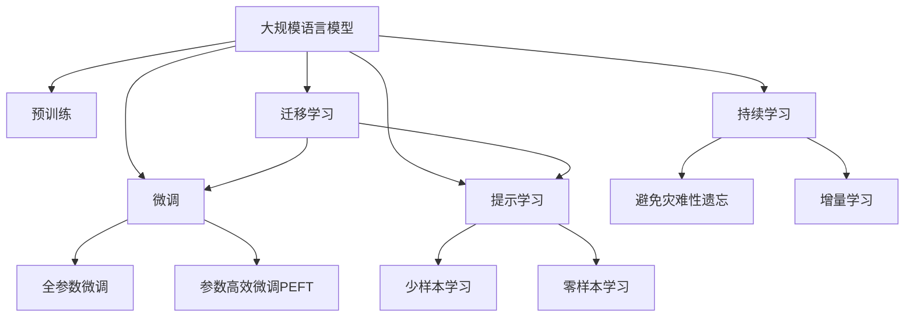

                 

# 大规模语言模型从理论到实践 由少至多提示

> 关键词：大规模语言模型, 提示学习, 自监督学习, Transformer, 预训练, 自然语言处理(NLP), 提示模板, 模型压缩

## 1. 背景介绍

### 1.1 问题由来

近年来，随着深度学习技术的飞速发展，大规模语言模型（Large Language Models, LLMs）在自然语言处理（NLP）领域取得了巨大的突破。这些大模型通过在海量无标签文本数据上进行预训练，学习到了丰富的语言知识和常识，并通过微调在特定任务上取得优异性能。然而，尽管大模型的预训练能力强大，但在特定领域或任务上，这些模型往往难以发挥最优表现。

为了解决这一问题，研究者们提出了提示学习（Prompt Learning）的概念。提示学习是一种通过精心设计输入文本格式的方式，引导大语言模型按照期望方式进行推理和生成的技术。这种技术不仅可以减少微调参数，还能在有限的标注数据上取得良好的性能。特别是在少样本学习和零样本学习等场景下，提示学习展示了其独特的优势。

### 1.2 问题核心关键点

提示学习是大规模语言模型微调中的一项重要技术，其核心在于如何通过输入文本的格式来优化模型的输出。这种方法不仅能够节省大量的标注数据，还能提升模型的泛化能力，减少过拟合风险。

提示学习的关键在于：
- **提示模板的设计**：提示模板需要具有引导性，能够清晰地描述任务和目标输出格式。
- **模型的理解能力**：模型需要具备较强的语言理解和生成能力，能够准确地根据提示模板生成符合要求的输出。

### 1.3 问题研究意义

提示学习对于拓展大语言模型的应用边界，提升下游任务的性能，加速NLP技术的产业化进程，具有重要意义：

1. **降低应用开发成本**：提示学习通过设计合适的提示模板，减少了从头开发所需的标注数据和人力成本。
2. **提升模型效果**：在少样本和零样本学习中，提示学习能够显著提升模型的性能，特别是对于数据稀缺的场景。
3. **加速开发进度**：提示学习使得开发者可以更快地完成任务适配，缩短开发周期。
4. **带来技术创新**：提示学习催生了少样本学习、零样本学习等新的研究方向，促进了NLP技术的发展。
5. **赋能产业升级**：提示学习使得NLP技术更容易被各行各业采用，为传统行业数字化转型升级提供了新的技术路径。

## 2. 核心概念与联系

### 2.1 核心概念概述

为更好地理解提示学习，本节将介绍几个密切相关的核心概念：

- **大规模语言模型（LLMs）**：指通过预训练学习到大量语言知识和常识的模型，如GPT、BERT等。
- **预训练（Pre-training）**：指在大规模无标签文本数据上，通过自监督学习任务训练通用语言模型的过程。
- **微调（Fine-tuning）**：指在预训练模型的基础上，使用下游任务的少量标注数据，通过有监督学习优化模型在特定任务上的性能。
- **提示学习（Prompt Learning）**：通过在输入文本中添加提示模板，引导大语言模型进行特定任务的推理和生成。
- **参数高效微调（PEFT）**：指在微调过程中，只更新少量的模型参数，而固定大部分预训练权重不变，以提高微调效率，避免过拟合的方法。
- **少样本学习（Few-shot Learning）**：指在只有少量标注样本的情况下，模型能够快速适应新任务的学习方法。
- **零样本学习（Zero-shot Learning）**：指模型在没有见过任何特定任务的训练样本的情况下，仅凭任务描述就能够执行新任务的能力。

这些概念之间的逻辑关系可以通过以下Mermaid流程图来展示：



这个流程图展示了大语言模型的核心概念及其之间的关系：

1. 大语言模型通过预训练获得基础能力。
2. 微调是对预训练模型进行任务特定的优化，可以分为全参数微调和参数高效微调（PEFT）。
3. 提示学习是一种不更新模型参数的方法，可以实现少样本学习和零样本学习。
4. 迁移学习是连接预训练模型与下游任务的桥梁，可以通过微调或提示学习来实现。
5. 持续学习旨在使模型能够不断学习新知识，同时避免遗忘旧知识。

这些概念共同构成了大语言模型的学习和应用框架，使其能够在各种场景下发挥强大的语言理解和生成能力。通过理解这些核心概念，我们可以更好地把握大语言模型的工作原理和优化方向。

## 3. 核心算法原理 & 具体操作步骤

### 3.1 算法原理概述

提示学习本质上是一种有监督的细粒度迁移学习过程。其核心思想是：通过在输入文本中添加提示模板，引导大语言模型进行特定任务的推理和生成。这种方法可以在有限的标注数据上，通过优化模型的推理逻辑，提高其在特定任务上的表现。

形式化地，假设预训练模型为 $M_{\theta}$，其中 $\theta$ 为预训练得到的模型参数。给定下游任务 $T$ 的标注数据集 $D=\{(x_i, y_i)\}_{i=1}^N, x_i \in \mathcal{X}, y_i \in \mathcal{Y}$。提示学习的目标是通过设计提示模板 $P(x)$，优化模型在输入 $x$ 上的输出 $M_{\theta}(x)$，使得其与任务标签 $y$ 一致。

### 3.2 算法步骤详解

基于提示学习的微调一般包括以下几个关键步骤：

**Step 1: 准备提示模板和数据集**
- 设计适合任务的提示模板 $P(x)$。
- 准备下游任务 $T$ 的标注数据集 $D$，划分为训练集、验证集和测试集。一般要求标注数据与预训练数据的分布不要差异过大。

**Step 2: 选择模型和提示模板**
- 选择合适的预训练语言模型 $M_{\theta}$ 作为初始化参数，如 BERT、GPT 等。
- 根据任务类型，设计合适的提示模板 $P(x)$，用于描述任务和目标输出格式。

**Step 3: 设置微调超参数**
- 选择合适的优化算法及其参数，如 AdamW、SGD 等，设置学习率、批大小、迭代轮数等。
- 设置正则化技术及强度，包括权重衰减、Dropout、Early Stopping 等。
- 确定冻结预训练参数的策略，如仅微调顶层，或全部参数都参与微调。

**Step 4: 执行梯度训练**
- 将训练集数据分批次输入模型，前向传播计算损失函数。
- 反向传播计算参数梯度，根据设定的优化算法和学习率更新模型参数。
- 周期性在验证集上评估模型性能，根据性能指标决定是否触发 Early Stopping。
- 重复上述步骤直到满足预设的迭代轮数或 Early Stopping 条件。

**Step 5: 测试和部署**
- 在测试集上评估提示学习后的模型 $M_{\theta}$ 的性能，对比提示学习前后的精度提升。
- 使用提示学习后的模型对新样本进行推理预测，集成到实际的应用系统中。
- 持续收集新的数据，定期重新提示学习模型，以适应数据分布的变化。

以上是基于提示学习的微调流程。在实际应用中，还需要针对具体任务的特点，对微调过程的各个环节进行优化设计，如改进提示模板设计，引入更多的正则化技术，搜索最优的超参数组合等，以进一步提升模型性能。

### 3.3 算法优缺点

提示学习作为一种微调技术，具有以下优点：
1. 简单高效。设计合适的提示模板，即可在有限的标注数据上取得良好的性能。
2. 适用范围广。提示学习适用于各种NLP任务，包括分类、匹配、生成等，提示模板的设计灵活。
3. 参数高效。利用参数高效微调技术，在固定大部分预训练参数的情况下，仍可取得不错的提升。
4. 效果显著。在少样本和零样本学习中，提示学习能够显著提升模型的性能，特别是在数据稀缺的场景下。

同时，该方法也存在一定的局限性：
1. 依赖提示模板。提示模板的设计对提示学习的性能影响较大，需要经过多次尝试和调整。
2. 泛化能力有限。当提示模板与实际任务不完全匹配时，提示学习的性能提升有限。
3. 可解释性不足。提示学习的结果缺乏可解释性，难以对其推理逻辑进行分析和调试。

尽管存在这些局限性，但就目前而言，提示学习仍然是NLP领域的重要技术范式，特别是在少样本和零样本学习等场景中展现了巨大的潜力。未来相关研究的重点在于如何进一步优化提示模板设计，提高模型的泛化能力和可解释性。

### 3.4 算法应用领域

提示学习已经在自然语言处理领域得到了广泛的应用，覆盖了几乎所有常见任务，例如：

- 文本分类：如情感分析、主题分类、意图识别等。通过提示模板描述任务和目标输出，微调模型学习文本-标签映射。
- 命名实体识别：识别文本中的人名、地名、机构名等特定实体。通过提示模板描述实体识别目标和格式，微调模型学习实体边界和类型。
- 关系抽取：从文本中抽取实体之间的语义关系。通过提示模板描述关系抽取目标和格式，微调模型学习实体-关系三元组。
- 问答系统：对自然语言问题给出答案。将问题-答案对作为提示模板，微调模型学习匹配答案。
- 机器翻译：将源语言文本翻译成目标语言。通过提示模板描述翻译任务和格式，微调模型学习语言-语言映射。
- 文本摘要：将长文本压缩成简短摘要。通过提示模板描述摘要生成目标和格式，微调模型学习抓取要点。
- 对话系统：使机器能够与人自然对话。通过对话历史和下一轮回复的提示模板，微调模型生成合理回复。

除了上述这些经典任务外，提示学习还被创新性地应用到更多场景中，如可控文本生成、常识推理、代码生成、数据增强等，为NLP技术带来了全新的突破。随着提示学习方法的不断进步，相信NLP技术将在更广阔的应用领域大放异彩。

## 4. 数学模型和公式 & 详细讲解 & 举例说明

### 4.1 数学模型构建

本节将使用数学语言对基于提示学习的大语言模型微调过程进行更加严格的刻画。

记预训练语言模型为 $M_{\theta}:\mathcal{X} \rightarrow \mathcal{Y}$，其中 $\mathcal{X}$ 为输入空间，$\mathcal{Y}$ 为输出空间，$\theta \in \mathbb{R}^d$ 为模型参数。假设提示学习的训练集为 $D=\{(x_i, y_i)\}_{i=1}^N, x_i \in \mathcal{X}, y_i \in \mathcal{Y}$。

定义模型 $M_{\theta}$ 在输入 $x$ 上的输出为 $M_{\theta}(x)$，通过提示模板 $P(x)$ 对输出进行引导，使得模型输出逼近真实标签 $y_i$。提示学习的损失函数定义为：

$$
\ell(M_{\theta}(x), P(x), y_i) = -[y_i\log M_{\theta}(P(x)) + (1-y_i)\log (1-M_{\theta}(P(x)))]
$$

其中 $P(x)$ 为提示模板，$M_{\theta}(P(x))$ 为模型在提示模板 $P(x)$ 下的输出。

在得到提示学习的损失函数后，通过梯度下降等优化算法，最小化经验风险，完成模型的迭代优化。重复上述过程直至收敛，最终得到适应下游任务的最优模型参数 $\theta^*$。

### 4.2 公式推导过程

以下我们以二分类任务为例，推导提示学习的损失函数及其梯度的计算公式。

假设模型 $M_{\theta}$ 在输入 $x$ 上的输出为 $\hat{y}=M_{\theta}(x) \in [0,1]$，表示样本属于正类的概率。真实标签 $y \in \{0,1\}$。则二分类交叉熵损失函数定义为：

$$
\ell(M_{\theta}(x),y) = -[y\log \hat{y} + (1-y)\log (1-\hat{y})]
$$

提示学习的损失函数可以表示为：

$$
\ell_{prompt}(M_{\theta}, P(x), y_i) = -[y_i\log M_{\theta}(P(x)) + (1-y_i)\log (1-M_{\theta}(P(x))]
$$

将 $P(x)$ 代入 $M_{\theta}(x)$ 中，得到：

$$
\ell_{prompt}(M_{\theta}, P(x), y_i) = -[y_i\log M_{\theta}(P(x)) + (1-y_i)\log (1-M_{\theta}(P(x)))
$$

然后，将提示模板 $P(x)$ 展开为：

$$
P(x) = \{p_1, p_2, ..., p_n\}
$$

其中 $p_i$ 表示提示模板中每个子提示。将 $P(x)$ 带入模型输出中，得到：

$$
M_{\theta}(P(x)) = \prod_{i=1}^n M_{\theta}(p_i)
$$

将上式代入提示学习的损失函数中，得到：

$$
\ell_{prompt}(M_{\theta}, \{p_1, p_2, ..., p_n\}, y_i) = -[y_i\log (\prod_{i=1}^n M_{\theta}(p_i)) + (1-y_i)\log (1-\prod_{i=1}^n M_{\theta}(p_i))]
$$

将上式进一步展开，得到：

$$
\ell_{prompt}(M_{\theta}, \{p_1, p_2, ..., p_n\}, y_i) = -[y_i\sum_{i=1}^n \log M_{\theta}(p_i) + (1-y_i)\log (1-\sum_{i=1}^n M_{\theta}(p_i))]
$$

在得到提示学习的损失函数后，即可带入参数更新公式，完成模型的迭代优化。重复上述过程直至收敛，最终得到适应下游任务的最优模型参数 $\theta^*$。

### 4.3 案例分析与讲解

以命名实体识别（Named Entity Recognition, NER）任务为例，说明如何设计提示模板并进行提示学习。

假设提示模板为：

$$
P(x) = \{[NER: person], [NER: location], [NER: organization]\}
$$

其中 [NER: person] 表示对文本中的人名进行识别，[NER: location] 表示对地点进行识别，[NER: organization] 表示对机构名进行识别。

对于输入文本 "John works at Google in New York"，提示模板变为：

$$
P(x) = \{John, works at, Google, in, New York\}
$$

将提示模板输入模型，得到输出概率分布。然后，根据实际标签，计算损失函数，并通过梯度下降更新模型参数。

例如，对于输入文本 "John works at Google in New York"，其真实标签为：

$$
y = \{person, organization, location\}
$$

则提示学习的损失函数为：

$$
\ell_{prompt}(M_{\theta}, P(x), y) = -[y_i\log M_{\theta}(p_1) + (1-y_i)\log (1-M_{\theta}(p_1)) + y_2\log M_{\theta}(p_2) + (1-y_2)\log (1-M_{\theta}(p_2)) + y_3\log M_{\theta}(p_3) + (1-y_3)\log (1-M_{\theta}(p_3))]
$$

通过迭代优化，更新模型参数，直至收敛。最终得到的模型参数 $\theta^*$ 可用于对新文本进行命名实体识别的提示学习。

## 5. 项目实践：代码实例和详细解释说明

### 5.1 开发环境搭建

在进行提示学习实践前，我们需要准备好开发环境。以下是使用Python进行PyTorch开发的环境配置流程：

1. 安装Anaconda：从官网下载并安装Anaconda，用于创建独立的Python环境。

2. 创建并激活虚拟环境：
```bash
conda create -n pytorch-env python=3.8 
conda activate pytorch-env
```

3. 安装PyTorch：根据CUDA版本，从官网获取对应的安装命令。例如：
```bash
conda install pytorch torchvision torchaudio cudatoolkit=11.1 -c pytorch -c conda-forge
```

4. 安装Transformers库：
```bash
pip install transformers
```

5. 安装各类工具包：
```bash
pip install numpy pandas scikit-learn matplotlib tqdm jupyter notebook ipython
```

完成上述步骤后，即可在`pytorch-env`环境中开始提示学习实践。

### 5.2 源代码详细实现

这里我们以命名实体识别（NER）任务为例，给出使用Transformers库对BERT模型进行提示学习的PyTorch代码实现。

首先，定义提示模板和数据处理函数：

```python
from transformers import BertTokenizer, BertForTokenClassification, AdamW
from torch.utils.data import Dataset, DataLoader
import torch
from tqdm import tqdm

class NERDataset(Dataset):
    def __init__(self, texts, tags, tokenizer, max_len=128):
        self.texts = texts
        self.tags = tags
        self.tokenizer = tokenizer
        self.max_len = max_len
        
    def __len__(self):
        return len(self.texts)
    
    def __getitem__(self, item):
        text = self.texts[item]
        tags = self.tags[item]
        
        encoding = self.tokenizer(text, return_tensors='pt', max_length=self.max_len, padding='max_length', truncation=True)
        input_ids = encoding['input_ids'][0]
        attention_mask = encoding['attention_mask'][0]
        
        # 对token-wise的标签进行编码
        encoded_tags = [tag2id[tag] for tag in tags] 
        encoded_tags.extend([tag2id['O']] * (self.max_len - len(encoded_tags)))
        labels = torch.tensor(encoded_tags, dtype=torch.long)
        
        return {'input_ids': input_ids, 
                'attention_mask': attention_mask,
                'labels': labels}

# 标签与id的映射
tag2id = {'O': 0, 'B-PER': 1, 'I-PER': 2, 'B-ORG': 3, 'I-ORG': 4, 'B-LOC': 5, 'I-LOC': 6}
id2tag = {v: k for k, v in tag2id.items()}

# 创建dataset
tokenizer = BertTokenizer.from_pretrained('bert-base-cased')

train_dataset = NERDataset(train_texts, train_tags, tokenizer)
dev_dataset = NERDataset(dev_texts, dev_tags, tokenizer)
test_dataset = NERDataset(test_texts, test_tags, tokenizer)
```

然后，定义模型和优化器：

```python
from transformers import BertForTokenClassification, AdamW

model = BertForTokenClassification.from_pretrained('bert-base-cased', num_labels=len(tag2id))

optimizer = AdamW(model.parameters(), lr=2e-5)
```

接着，定义训练和评估函数：

```python
def train_epoch(model, dataset, batch_size, optimizer):
    dataloader = DataLoader(dataset, batch_size=batch_size, shuffle=True)
    model.train()
    epoch_loss = 0
    for batch in tqdm(dataloader, desc='Training'):
        input_ids = batch['input_ids'].to(device)
        attention_mask = batch['attention_mask'].to(device)
        labels = batch['labels'].to(device)
        model.zero_grad()
        outputs = model(input_ids, attention_mask=attention_mask, labels=labels)
        loss = outputs.loss
        epoch_loss += loss.item()
        loss.backward()
        optimizer.step()
    return epoch_loss / len(dataloader)

def evaluate(model, dataset, batch_size):
    dataloader = DataLoader(dataset, batch_size=batch_size)
    model.eval()
    preds, labels = [], []
    with torch.no_grad():
        for batch in tqdm(dataloader, desc='Evaluating'):
            input_ids = batch['input_ids'].to(device)
            attention_mask = batch['attention_mask'].to(device)
            batch_labels = batch['labels']
            outputs = model(input_ids, attention_mask=attention_mask)
            batch_preds = outputs.logits.argmax(dim=2).to('cpu').tolist()
            batch_labels = batch_labels.to('cpu').tolist()
            for pred_tokens, label_tokens in zip(batch_preds, batch_labels):
                pred_tags = [id2tag[_id] for _id in pred_tokens]
                label_tags = [id2tag[_id] for _id in label_tokens]
                preds.append(pred_tags[:len(label_tags)])
                labels.append(label_tags)
                
    print(classification_report(labels, preds))
```

最后，启动训练流程并在测试集上评估：

```python
epochs = 5
batch_size = 16

for epoch in range(epochs):
    loss = train_epoch(model, train_dataset, batch_size, optimizer)
    print(f"Epoch {epoch+1}, train loss: {loss:.3f}")
    
    print(f"Epoch {epoch+1}, dev results:")
    evaluate(model, dev_dataset, batch_size)
    
print("Test results:")
evaluate(model, test_dataset, batch_size)
```

以上就是使用PyTorch对BERT进行命名实体识别任务提示学习的完整代码实现。可以看到，得益于Transformers库的强大封装，我们可以用相对简洁的代码完成BERT模型的加载和提示学习。

### 5.3 代码解读与分析

让我们再详细解读一下关键代码的实现细节：

**NERDataset类**：
- `__init__`方法：初始化文本、标签、分词器等关键组件。
- `__len__`方法：返回数据集的样本数量。
- `__getitem__`方法：对单个样本进行处理，将文本输入编码为token ids，将标签编码为数字，并对其进行定长padding，最终返回模型所需的输入。

**tag2id和id2tag字典**：
- 定义了标签与数字id之间的映射关系，用于将token-wise的预测结果解码回真实的标签。

**训练和评估函数**：
- 使用PyTorch的DataLoader对数据集进行批次化加载，供模型训练和推理使用。
- 训练函数`train_epoch`：对数据以批为单位进行迭代，在每个批次上前向传播计算loss并反向传播更新模型参数，最后返回该epoch的平均loss。
- 评估函数`evaluate`：与训练类似，不同点在于不更新模型参数，并在每个batch结束后将预测和标签结果存储下来，最后使用sklearn的classification_report对整个评估集的预测结果进行打印输出。

**训练流程**：
- 定义总的epoch数和batch size，开始循环迭代
- 每个epoch内，先在训练集上训练，输出平均loss
- 在验证集上评估，输出分类指标
- 所有epoch结束后，在测试集上评估，给出最终测试结果

可以看到，PyTorch配合Transformers库使得BERT提示学习的代码实现变得简洁高效。开发者可以将更多精力放在数据处理、模型改进等高层逻辑上，而不必过多关注底层的实现细节。

当然，工业级的系统实现还需考虑更多因素，如模型的保存和部署、超参数的自动搜索、更灵活的任务适配层等。但核心的提示学习范式基本与此类似。

## 6. 实际应用场景

### 6.1 智能客服系统

基于提示学习的对话技术，可以广泛应用于智能客服系统的构建。传统客服往往需要配备大量人力，高峰期响应缓慢，且一致性和专业性难以保证。而使用提示学习的对话模型，可以7x24小时不间断服务，快速响应客户咨询，用自然流畅的语言解答各类常见问题。

在技术实现上，可以收集企业内部的历史客服对话记录，将问题和最佳答复构建成监督数据，在此基础上对预训练对话模型进行提示学习。提示学习后的对话模型能够自动理解用户意图，匹配最合适的答案模板进行回复。对于客户提出的新问题，还可以接入检索系统实时搜索相关内容，动态组织生成回答。如此构建的智能客服系统，能大幅提升客户咨询体验和问题解决效率。

### 6.2 金融舆情监测

金融机构需要实时监测市场舆论动向，以便及时应对负面信息传播，规避金融风险。传统的人工监测方式成本高、效率低，难以应对网络时代海量信息爆发的挑战。基于提示学习的文本分类和情感分析技术，为金融舆情监测提供了新的解决方案。

具体而言，可以收集金融领域相关的新闻、报道、评论等文本数据，并对其进行主题标注和情感标注。在此基础上对预训练语言模型进行提示学习，使其能够自动判断文本属于何种主题，情感倾向是正面、中性还是负面。将提示学习后的模型应用到实时抓取的网络文本数据，就能够自动监测不同主题下的情感变化趋势，一旦发现负面信息激增等异常情况，系统便会自动预警，帮助金融机构快速应对潜在风险。

### 6.3 个性化推荐系统

当前的推荐系统往往只依赖用户的历史行为数据进行物品推荐，无法深入理解用户的真实兴趣偏好。基于提示学习的个性化推荐系统可以更好地挖掘用户行为背后的语义信息，从而提供更精准、多样的推荐内容。

在实践中，可以收集用户浏览、点击、评论、分享等行为数据，提取和用户交互的物品标题、描述、标签等文本内容。将文本内容作为模型输入，用户的后续行为（如是否点击、购买等）作为监督信号，在此基础上微调预训练语言模型。提示学习后的模型能够从文本内容中准确把握用户的兴趣点。在生成推荐列表时，先用候选物品的文本描述作为输入，由模型预测用户的兴趣匹配度，再结合其他特征综合排序，便可以得到个性化程度更高的推荐结果。

### 6.4 未来应用展望

随着提示学习方法的不断进步，基于微调范式将在更多领域得到应用，为传统行业带来变革性影响。

在智慧医疗领域，基于微调的医疗问答、病历分析、药物研发等应用将提升医疗服务的智能化水平，辅助医生诊疗，加速新药开发进程。

在智能教育领域，提示学习可应用于作业批改、学情分析、知识推荐等方面，因材施教，促进教育公平，提高教学质量。

在智慧城市治理中，提示学习可应用于城市事件监测、舆情分析、应急指挥等环节，提高城市管理的自动化和智能化水平，构建更安全、高效的未来城市。

此外，在企业生产、社会治理、文娱传媒等众多领域，基于提示学习的人工智能应用也将不断涌现，为经济社会发展注入新的动力。相信随着技术的日益成熟，提示学习技术将成为人工智能落地应用的重要范式，推动人工智能技术在更广阔的领域取得突破。

## 7. 工具和资源推荐

### 7.1 学习资源推荐

为了帮助开发者系统掌握提示学习理论基础和实践技巧，这里推荐一些优质的学习资源：

1. 《Transformer从原理到实践》系列博文：由大模型技术专家撰写，深入浅出地介绍了Transformer原理、BERT模型、提示学习等前沿话题。

2. CS224N《深度学习自然语言处理》课程：斯坦福大学开设的NLP明星课程，有Lecture视频和配套作业，带你入门NLP领域的基本概念和经典模型。

3. 《Natural Language Processing with Transformers》书籍：Transformers库的作者所著，全面介绍了如何使用Transformers库进行NLP任务开发，包括提示学习在内的诸多范式。

4. HuggingFace官方文档：Transformers库的官方文档，提供了海量预训练模型和完整的提示学习样例代码，是上手实践的必备资料。

5. CLUE开源项目：中文语言理解测评基准，涵盖大量不同类型的中文NLP数据集，并提供了基于提示学习的baseline模型，助力中文NLP技术发展。

通过对这些资源的学习实践，相信你一定能够快速掌握提示学习的精髓，并用于解决实际的NLP问题。

### 7.2 开发工具推荐

高效的开发离不开优秀的工具支持。以下是几款用于提示学习开发的常用工具：

1. PyTorch：基于Python的开源深度学习框架，灵活动态的计算图，适合快速迭代研究。大部分预训练语言模型都有PyTorch版本的实现。

2. TensorFlow：由Google主导开发的开源深度学习框架，生产部署方便，适合大规模工程应用。同样有丰富的预训练语言模型资源。

3. Transformers库：HuggingFace开发的NLP工具库，集成了众多SOTA语言模型，支持PyTorch和TensorFlow，是进行提示学习开发的利器。

4. Weights & Biases：模型训练的实验跟踪工具，可以记录和可视化模型训练过程中的各项指标，方便对比和调优。与主流深度学习框架无缝集成。

5. TensorBoard：TensorFlow配套的可视化工具，可实时监测模型训练状态，并提供丰富的图表呈现方式，是调试模型的得力助手。

6. Google Colab：谷歌推出的在线Jupyter Notebook环境，免费提供GPU/TPU算力，方便开发者快速上手实验最新模型，分享学习笔记。

合理利用这些工具，可以显著提升提示学习任务的开发效率，加快创新迭代的步伐。

### 7.3 相关论文推荐

提示学习作为大语言模型微调中的重要技术，其发展源于学界的持续研究。以下是几篇奠基性的相关论文，推荐阅读：

1. Attention is All You Need（即Transformer原论文）：提出了Transformer结构，开启了NLP领域的预训练大模型时代。

2. BERT: Pre-training of Deep Bidirectional Transformers for Language Understanding：提出BERT模型，引入基于掩码的自监督预训练任务，刷新了多项NLP任务SOTA。

3. Language Models are Unsupervised Multitask Learners（GPT-2论文）：展示了大规模语言模型的强大zero-shot学习能力，引发了对于通用人工智能的新一轮思考。

4. Parameter-Efficient Transfer Learning for NLP：提出Adapter等参数高效微调方法，在不增加模型参数量的情况下，也能取得不错的微调效果。

5. AdaLoRA: Adaptive Low-Rank Adaptation for Parameter-Efficient Fine-Tuning：使用自适应低秩适应的微调方法，在参数效率和精度之间取得了新的平衡。

这些论文代表了大语言模型微调技术的发展脉络。通过学习这些前沿成果，可以帮助研究者把握学科前进方向，激发更多的创新灵感。

## 8. 总结：未来发展趋势与挑战

### 8.1 总结

本文对基于提示学习的大语言模型微调方法进行了全面系统的介绍。首先阐述了提示学习的背景和意义，明确了其在大语言模型微调中的核心地位。其次，从原理到实践，详细讲解了提示学习的数学原理和关键步骤，给出了提示学习任务开发的完整代码实例。同时，本文还广泛探讨了提示学习在智能客服、金融舆情、个性化推荐等多个行业领域的应用前景，展示了提示学习的独特优势。

通过本文的系统梳理，可以看到，提示学习对于拓展大语言模型的应用边界，提升下游任务的性能，加速NLP技术的产业化进程，具有重要意义：

1. **降低应用开发成本**：提示学习通过设计合适的提示模板，减少了从头开发所需的标注数据和人力成本。
2. **提升模型效果**：在少样本和零样本学习中，提示学习能够显著提升模型的性能，特别是在数据稀缺的场景下。
3. **加速开发进度**：提示学习使得开发者可以更快地完成任务适配，缩短开发周期。
4. **带来技术创新**：提示学习催生了少样本学习、零样本学习等新的研究方向，促进了NLP技术的发展。
5. **赋能产业升级**：提示学习使得NLP技术更容易被各行各业采用，为传统行业数字化转型升级提供新的技术路径。

### 8.2 未来发展趋势

展望未来，提示学习技术将呈现以下几个发展趋势：

1. **提示模板的优化**：提示模板的设计将更加灵活多样，通过更丰富的语义信息，提升模型的泛化能力。
2. **模型规模增大**：随着算力成本的下降和数据规模的扩张，预训练语言模型的参数量还将持续增长。超大规模语言模型蕴含的丰富语言知识，将为提示学习提供更强的基础能力。
3. **自适应学习**：提示学习将更加注重模型的自适应能力，通过动态调整提示模板和优化算法，提高模型的学习效率和泛化性能。
4. **跨领域应用**：提示学习将不再局限于文本数据，也将拓展到图像、视频、语音等多模态数据微调。多模态信息的融合，将显著提升语言模型对现实世界的理解和建模能力。
5. **知识增强**：将符号化的先验知识，如知识图谱、逻辑规则等，与神经网络模型进行巧妙融合，引导提示学习过程学习更准确、合理的语言模型。同时加强不同模态数据的整合，实现视觉、语音等多模态信息与文本信息的协同建模。

以上趋势凸显了提示学习技术的广阔前景。这些方向的探索发展，必将进一步提升NLP系统的性能和应用范围，为人类认知智能的进化带来深远影响。

### 8.3 面临的挑战

尽管提示学习已经在NLP领域取得了显著成果，但在迈向更加智能化、普适化应用的过程中，它仍面临着诸多挑战：

1. **提示模板设计**：提示模板的设计对提示学习的性能影响较大，需要经过多次尝试和调整。
2. **泛化能力**：当提示模板与实际任务不完全匹配时，提示学习的性能提升有限。
3. **可解释性**：提示学习的结果缺乏可解释性，难以对其推理逻辑进行分析和调试。
4. **模型鲁棒性**：提示学习模型面对域外数据时，泛化性能往往大打折扣。
5. **知识整合能力**：现有的提示学习模型往往局限于任务内数据，难以灵活吸收和运用更广泛的先验知识。

正视提示学习面临的这些挑战，积极应对并寻求突破，将是大规模语言模型提示学习走向成熟的必由之路。相信随着学界和产业界的共同努力，这些挑战终将一一被克服，提示学习技术必将在构建人机协同的智能时代中扮演越来越重要的角色。

### 8.4 研究展望

面对提示学习面临的挑战，未来的研究需要在以下几个方面寻求新的突破：

1. **优化提示模板设计**：引入更多先验知识，如知识图谱、逻辑规则等，设计更加高效的提示模板，提升模型的泛化能力和可解释性。
2. **融合多模态数据**：将视觉、语音等多模态信息与文本信息进行协同建模，提高提示学习的鲁棒性和泛化能力。
3. **自适应学习算法**：开发更加自适应的提示学习算法，通过动态调整提示模板和优化算法，提高模型的学习效率和泛化性能。
4. **跨领域知识增强**：将知识图谱、逻辑规则等先验知识与神经网络模型进行融合，增强提示学习的知识整合能力。
5. **鲁棒性和鲁棒性**：引入对抗训练、噪声注入等技术，提高提示学习模型的鲁棒性和泛化能力。
6. **知识推理与生成**：结合因果分析、逻辑推理等方法，增强提示学习模型的知识推理和生成能力，提升其在复杂任务中的表现。

这些研究方向将进一步推动提示学习技术的发展，使其在更广阔的应用场景中发挥更大的价值。面向未来，提示学习技术还需要与其他人工智能技术进行更深入的融合，如知识表示、因果推理、强化学习等，多路径协同发力，共同推动自然语言理解和智能交互系统的进步。只有勇于创新、敢于突破，才能不断拓展语言模型的边界，让智能技术更好地造福人类社会。

## 9. 附录：常见问题与解答

**Q1：提示学习是否适用于所有NLP任务？**

A: 提示学习在大多数NLP任务上都能取得不错的效果，特别是对于数据量较小的任务。但对于一些特定领域的任务，如医学、法律等，仅仅依靠通用语料预训练的模型可能难以很好地适应。此时需要在特定领域语料上进一步预训练，再进行提示学习，才能获得理想效果。此外，对于一些需要时效性、个性化很强的任务，如对话、推荐等，提示学习方法也需要针对性的改进优化。

**Q2：提示模板的设计有哪些技巧？**

A: 提示模板的设计是提示学习的关键。好的提示模板应具备以下特点：
1. **明确性**：提示模板应明确描述任务目标和输出格式，让模型能够快速理解任务。
2. **简洁性**：提示模板应尽量简洁，避免过多的冗余信息，提高模型效率。
3. **多样性**：提示模板应设计多样，涵盖不同的任务场景，增强模型的泛化能力。
4. **可变性**：提示模板应具备可变性，根据不同的数据集和任务，调整提示模板以提高效果。

**Q3：提示学习模型的训练需要注意哪些问题？**

A: 提示学习模型的训练与普通模型的训练类似，但需要注意以下几点：
1. **学习率调整**：提示学习的学习率应小于预训练学习率，以避免破坏预训练权重。
2. **正则化技术**：提示学习模型应使用L2正则、Dropout等正则化技术，防止模型过拟合。
3. **早停策略**：提示学习模型应使用早停策略，一旦验证集性能不再提升，及时停止训练。
4. **模型保存**：提示学习模型应定期保存模型状态，防止训练过程中断。

**Q4：提示学习模型在实际部署时需要注意哪些问题？**

A: 将提示学习模型转化为实际应用，还需要考虑以下因素：
1. **模型裁剪**：去除不必要的层和参数，减小模型尺寸，加快推理速度。
2. **量化加速**：将浮点模型转为定点模型，压缩存储空间，提高计算效率。
3. **服务化封装**：将模型封装为标准化服务接口，便于集成调用。
4. **弹性伸缩**：根据请求流量动态调整资源配置，平衡服务质量和成本。
5. **监控告警**：实时采集系统指标，设置异常告警阈值，确保服务稳定性。
6. **安全防护**：采用访问鉴权、数据脱敏等措施，保障数据和模型安全。

提示学习模型需要从数据、算法、工程、业务等多个维度进行全面优化，才能真正实现其在实际场景中的应用价值。总之，提示学习技术还需要不断迭代和优化，方能充分发挥其在NLP领域的应用潜力。

---

作者：禅与计算机程序设计艺术 / Zen and the Art of Computer Programming

