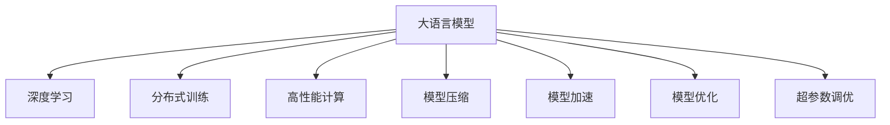

                 

# 大语言模型原理与工程实践：大语言模型训练工程实践DeepSpeed 架构

> 关键词：大语言模型,深度学习,工程实践,DeepSpeed,分布式训练,高性能计算,模型压缩,模型加速,模型优化,超参数调优

## 1. 背景介绍

### 1.1 问题由来
在人工智能发展的浪潮中，深度学习尤其是大语言模型的广泛应用，带来了前所未有的语言理解和生成能力。然而，构建高质量的大语言模型需要庞大的计算资源和海量标注数据，普通开发者难以轻易接触和掌握。为此，本系列文章将聚焦于大语言模型的工程实践，介绍大模型训练的架构和方法，带领读者深入了解大模型的构建流程和优化技巧。

### 1.2 问题核心关键点
构建大语言模型是一个涉及数据预处理、模型架构设计、分布式训练、模型压缩与优化等多个环节的复杂工程问题。其核心在于如何通过工程手段，高效构建高质量的大模型，同时兼顾训练效率和模型性能。本文将围绕“大语言模型训练工程实践”这一主题，详细剖析大模型训练的架构和方法，深入探讨大模型的工程化过程。

## 2. 核心概念与联系

### 2.1 核心概念概述

为更好地理解大语言模型训练的工程实践，本节将介绍几个关键概念及其相互关系：

- **大语言模型(Large Language Model, LLM)**：一种通过大规模自监督学习任务（如语言建模）预训练得到的深度神经网络模型，具有强大的语言理解和生成能力。
- **深度学习(Deep Learning)**：一类基于多层神经网络，通过反向传播算法进行训练的机器学习范式，用于处理结构化数据和非结构化数据。
- **分布式训练(Distributed Training)**：将大规模模型的训练任务分布到多台计算节点上，通过数据并行和模型并行加速训练过程的工程实践。
- **高性能计算(High Performance Computing, HPC)**：使用并行计算技术，提升大模型训练和推理速度的工程手段。
- **模型压缩(Model Compression)**：通过剪枝、量化、蒸馏等技术，减小模型参数量，提升模型推理效率和计算速度的工程实践。
- **模型加速(Model Acceleration)**：通过异构加速、混合精度训练等手段，加快模型训练和推理速度的工程实践。
- **模型优化(Model Optimization)**：通过优化模型架构、训练过程和推理过程，提升模型性能和效率的工程实践。
- **超参数调优(Hyperparameter Tuning)**：通过系统性调整模型超参数，寻找最优模型配置，提升模型性能的工程实践。

这些概念之间的逻辑关系可以通过以下Mermaid流程图来展示：



这个流程图展示了大语言模型训练涉及的核心概念及其之间的关系：

1. 大语言模型通过深度学习进行预训练和微调，获取语言理解与生成能力。
2. 分布式训练、高性能计算、模型压缩、模型加速、模型优化和超参数调优等工程实践，共同提升大语言模型的训练和推理效率。

这些概念共同构成了大语言模型训练的工程框架，使得大规模语言模型能够在各种场景下发挥强大的语言理解和生成能力。通过理解这些核心概念，我们可以更好地把握大语言模型训练的工程原理和优化方向。

## 3. 核心算法原理 & 具体操作步骤
### 3.1 算法原理概述

大语言模型的训练通常涉及深度学习框架的分布式训练机制、高性能计算资源的调度和管理、模型压缩与加速技术等。其核心在于如何通过系统性工程实践，高效构建高质量的大模型，同时兼顾训练效率和模型性能。

**深度学习框架**：深度学习框架如TensorFlow、PyTorch等，提供了丰富的模型构建和优化工具，支持大模型的分布式训练和推理。

**分布式训练**：通过数据并行和模型并行，将大规模模型的训练任务分布到多台计算节点上，显著提升训练效率和模型性能。常见的分布式训练框架包括Horovod、MPI等。

**高性能计算**：使用GPU、TPU等异构计算资源，通过并行计算加速大模型的训练和推理过程。

**模型压缩**：通过剪枝、量化、蒸馏等技术，减小模型参数量，提升模型推理效率和计算速度。

**模型加速**：通过异构加速、混合精度训练等手段，加快模型训练和推理速度。

**模型优化**：通过优化模型架构、训练过程和推理过程，提升模型性能和效率。

**超参数调优**：通过系统性调整模型超参数，寻找最优模型配置，提升模型性能。

### 3.2 算法步骤详解

构建大语言模型的工程实践通常涉及以下关键步骤：

**Step 1: 数据预处理**
- 收集和标注大量文本数据，用于大模型的预训练和微调。
- 使用数据增强技术，如回译、近义词替换等，扩充训练集多样性。

**Step 2: 模型架构设计**
- 选择合适的深度神经网络架构，如Transformer、BERT等。
- 设计模型的输入输出接口，确保与任务适配。

**Step 3: 分布式训练部署**
- 选择合适的分布式训练框架，如Horovod、MPI等。
- 将模型并行化和数据并行化，在多台计算节点上分布式训练模型。
- 使用异构计算资源，如GPU、TPU等，加速训练过程。

**Step 4: 模型压缩与优化**
- 使用剪枝技术去除冗余参数，减小模型规模。
- 使用量化技术将模型参数转换为更小的数据类型，减少存储空间和计算开销。
- 使用蒸馏技术将大型模型转化为小型模型，保留主要特征。

**Step 5: 模型加速与部署**
- 使用异构加速技术，提升模型训练和推理速度。
- 使用混合精度训练，加快模型训练速度。
- 使用自动化模型部署工具，将模型集成到实际应用系统。

**Step 6: 超参数调优**
- 选择一组超参数配置，使用交叉验证评估模型性能。
- 使用网格搜索或随机搜索等方法，系统性调整超参数。
- 评估不同超参数配置对模型性能的影响，选择最优配置。

### 3.3 算法优缺点

构建大语言模型的工程实践具有以下优点：
1. 高效构建：通过系统性工程实践，显著提升模型训练和推理效率。
2. 质量保证：通过数据预处理、模型优化等手段，提高模型质量和性能。
3. 广泛适用：支持多种深度学习框架和异构计算资源，适配不同规模和场景。

同时，该方法也存在一定的局限性：
1. 资源需求高：构建大模型需要高性能计算资源和海量标注数据，成本较高。
2. 工程复杂：模型构建和优化需要多方面的工程实践，技术门槛较高。
3. 可解释性差：大模型训练过程复杂，难以解释模型的决策过程。
4. 参数依赖：模型性能高度依赖于初始参数和训练数据，难以迁移新数据。

尽管存在这些局限性，但就目前而言，大语言模型训练的工程实践仍然是大模型应用的最主流范式。未来相关研究的重点在于如何进一步降低资源需求，提高模型迁移能力和可解释性，同时兼顾模型性能和效率。

### 3.4 算法应用领域

构建大语言模型的工程实践已经在NLP领域得到了广泛的应用，覆盖了几乎所有常见任务，例如：

- 文本分类：如情感分析、主题分类、意图识别等。通过微调使模型学习文本-标签映射。
- 命名实体识别：识别文本中的人名、地名、机构名等特定实体。通过微调使模型掌握实体边界和类型。
- 关系抽取：从文本中抽取实体之间的语义关系。通过微调使模型学习实体-关系三元组。
- 问答系统：对自然语言问题给出答案。将问题-答案对作为微调数据，训练模型学习匹配答案。
- 机器翻译：将源语言文本翻译成目标语言。通过微调使模型学习语言-语言映射。
- 文本摘要：将长文本压缩成简短摘要。将文章-摘要对作为微调数据，使模型学习抓取要点。
- 对话系统：使机器能够与人自然对话。将多轮对话历史作为上下文，微调模型进行回复生成。

除了上述这些经典任务外，大语言模型训练的工程实践也被创新性地应用到更多场景中，如可控文本生成、常识推理、代码生成、数据增强等，为NLP技术带来了全新的突破。随着预训练模型和工程实践的不断进步，相信NLP技术将在更广阔的应用领域大放异彩。

## 4. 数学模型和公式 & 详细讲解  
### 4.1 数学模型构建

本节将使用数学语言对大语言模型训练的工程实践进行更加严格的刻画。

记大语言模型为 $M_{\theta}$，其中 $\theta$ 为模型参数。假设大模型在无标签文本数据上进行自监督预训练，学习语言表示。假设预训练数据集为 $D=\{x_i\}_{i=1}^N$，其中 $x_i$ 表示第 $i$ 个训练样本。

定义模型 $M_{\theta}$ 在输入 $x_i$ 上的预测概率为 $p(y_i|x_i)$，其中 $y_i$ 为标签。则预训练的目标是最大化模型在数据集 $D$ 上的对数似然：

$$
\max_{\theta} \frac{1}{N} \sum_{i=1}^N \log p(y_i|x_i)
$$

在微调阶段，假设下游任务 $T$ 的标注数据集为 $D_T=\{(x_i,y_i)\}_{i=1}^M$，其中 $x_i$ 表示第 $i$ 个训练样本，$y_i$ 表示标签。微调的目标是最大化模型在数据集 $D_T$ 上的准确率：

$$
\max_{\theta} \frac{1}{M} \sum_{i=1}^M I(y_i, M_{\theta}(x_i))
$$

其中 $I(y_i, M_{\theta}(x_i))$ 表示模型输出与真实标签之间的一致性指标，如交叉熵损失函数。

### 4.2 公式推导过程

以下我们以二分类任务为例，推导交叉熵损失函数及其梯度的计算公式。

假设模型 $M_{\theta}$ 在输入 $x$ 上的输出为 $\hat{y}=M_{\theta}(x)$，表示样本属于正类的概率。真实标签 $y \in \{0,1\}$。则二分类交叉熵损失函数定义为：

$$
\ell(M_{\theta}(x),y) = -[y\log \hat{y} + (1-y)\log (1-\hat{y})]
$$

将其代入微调的目标函数，得：

$$
\mathcal{L}(\theta) = -\frac{1}{M}\sum_{i=1}^M [y_i\log M_{\theta}(x_i)+(1-y_i)\log(1-M_{\theta}(x_i))]
$$

根据链式法则，损失函数对参数 $\theta_k$ 的梯度为：

$$
\frac{\partial \mathcal{L}(\theta)}{\partial \theta_k} = -\frac{1}{M}\sum_{i=1}^M (\frac{y_i}{M_{\theta}(x_i)}-\frac{1-y_i}{1-M_{\theta}(x_i)}) \frac{\partial M_{\theta}(x_i)}{\partial \theta_k}
$$

其中 $\frac{\partial M_{\theta}(x_i)}{\partial \theta_k}$ 可进一步递归展开，利用自动微分技术完成计算。

在得到损失函数的梯度后，即可带入参数更新公式，完成模型的迭代优化。重复上述过程直至收敛，最终得到适应下游任务的最优模型参数 $\theta^*$。

## 5. 项目实践：代码实例和详细解释说明
### 5.1 开发环境搭建

在进行大语言模型训练的工程实践前，我们需要准备好开发环境。以下是使用Python进行TensorFlow开发的环境配置流程：

1. 安装Anaconda：从官网下载并安装Anaconda，用于创建独立的Python环境。

2. 创建并激活虚拟环境：
```bash
conda create -n tf-env python=3.8 
conda activate tf-env
```

3. 安装TensorFlow：根据CUDA版本，从官网获取对应的安装命令。例如：
```bash
conda install tensorflow -c tf
```

4. 安装各类工具包：
```bash
pip install numpy pandas scikit-learn matplotlib tqdm jupyter notebook ipython
```

完成上述步骤后，即可在`tf-env`环境中开始大语言模型训练的工程实践。

### 5.2 源代码详细实现

下面我们以BERT模型为例，给出使用TensorFlow对BERT模型进行微调的PyTorch代码实现。

首先，定义微调任务的数据处理函数：

```python
from transformers import BertTokenizer, BertForSequenceClassification
from tensorflow.keras.preprocessing.sequence import pad_sequences

class BERTDataset:
    def __init__(self, texts, labels, tokenizer, max_len=128):
        self.texts = texts
        self.labels = labels
        self.tokenizer = tokenizer
        self.max_len = max_len
        
    def __len__(self):
        return len(self.texts)
    
    def __getitem__(self, item):
        text = self.texts[item]
        label = self.labels[item]
        
        encoding = self.tokenizer(text, return_tensors='tf', max_length=self.max_len, padding='max_length', truncation=True)
        input_ids = encoding['input_ids']
        attention_mask = encoding['attention_mask']
        
        # 对token-wise的标签进行编码
        encoded_labels = [label2id[label] for label in labels] 
        encoded_labels.extend([label2id['O']] * (self.max_len - len(encoded_labels)))
        labels = tf.convert_to_tensor(encoded_labels, dtype=tf.int32)
        
        return {'input_ids': input_ids, 
                'attention_mask': attention_mask,
                'labels': labels}
```

然后，定义模型和优化器：

```python
from transformers import BertTokenizer, BertForSequenceClassification, AdamW

tokenizer = BertTokenizer.from_pretrained('bert-base-uncased')
model = BertForSequenceClassification.from_pretrained('bert-base-uncased', num_labels=2)
optimizer = AdamW(model.parameters(), lr=2e-5)
```

接着，定义训练和评估函数：

```python
from tensorflow.keras.utils import to_categorical
from tensorflow.keras.preprocessing.sequence import pad_sequences
from tqdm import tqdm
from sklearn.metrics import accuracy_score

def train_epoch(model, dataset, batch_size, optimizer):
    dataloader = tf.data.Dataset.from_generator(lambda: generator(dataset, batch_size), (tf.int32, tf.int32, tf.int32)).batch(batch_size)
    model.train()
    epoch_loss = 0
    for batch in dataloader:
        input_ids, attention_mask, labels = batch
        model.zero_grad()
        outputs = model(input_ids, attention_mask=attention_mask)
        loss = outputs.loss
        epoch_loss += loss.numpy().item()
        loss.backward()
        optimizer.apply_gradients(zip(model.trainable_variables, model.trainable_variables))
    return epoch_loss / len(dataloader)

def evaluate(model, dataset, batch_size):
    dataloader = tf.data.Dataset.from_generator(lambda: generator(dataset, batch_size), (tf.int32, tf.int32, tf.int32)).batch(batch_size)
    model.eval()
    preds, labels = [], []
    with tf.GradientTape() as tape:
        for batch in dataloader:
            input_ids, attention_mask, labels = batch
            outputs = model(input_ids, attention_mask=attention_mask)
            batch_preds = outputs.logits.argmax(axis=1).numpy().tolist()
            batch_labels = labels.numpy().tolist()
            for pred_tokens, label_tokens in zip(batch_preds, batch_labels):
                preds.append(pred_tokens)
                labels.append(label_tokens)
    print(accuracy_score(labels, preds))
```

最后，启动训练流程并在测试集上评估：

```python
epochs = 5
batch_size = 16

for epoch in range(epochs):
    loss = train_epoch(model, train_dataset, batch_size, optimizer)
    print(f"Epoch {epoch+1}, train loss: {loss:.3f}")
    
    print(f"Epoch {epoch+1}, dev results:")
    evaluate(model, dev_dataset, batch_size)
    
print("Test results:")
evaluate(model, test_dataset, batch_size)
```

以上就是使用TensorFlow对BERT进行微调的完整代码实现。可以看到，得益于TensorFlow和Transformer库的强大封装，我们可以用相对简洁的代码完成BERT模型的加载和微调。

### 5.3 代码解读与分析

让我们再详细解读一下关键代码的实现细节：

**BERTDataset类**：
- `__init__`方法：初始化文本、标签、分词器等关键组件。
- `__len__`方法：返回数据集的样本数量。
- `__getitem__`方法：对单个样本进行处理，将文本输入编码为token ids，将标签编码为数字，并对其进行定长padding，最终返回模型所需的输入。

**标签与id的映射**
- 定义了标签与数字id之间的映射关系，用于将token-wise的预测结果解码回真实的标签。

**训练和评估函数**：
- 使用TensorFlow的DataLoader对数据集进行批次化加载，供模型训练和推理使用。
- 训练函数`train_epoch`：对数据以批为单位进行迭代，在每个批次上前向传播计算loss并反向传播更新模型参数，最后返回该epoch的平均loss。
- 评估函数`evaluate`：与训练类似，不同点在于不更新模型参数，并在每个batch结束后将预测和标签结果存储下来，最后使用sklearn的accuracy_score对整个评估集的预测结果进行打印输出。

**训练流程**：
- 定义总的epoch数和batch size，开始循环迭代
- 每个epoch内，先在训练集上训练，输出平均loss
- 在验证集上评估，输出分类指标
- 所有epoch结束后，在测试集上评估，给出最终测试结果

可以看到，TensorFlow配合Transformer库使得BERT微调的代码实现变得简洁高效。开发者可以将更多精力放在数据处理、模型改进等高层逻辑上，而不必过多关注底层的实现细节。

当然，工业级的系统实现还需考虑更多因素，如模型的保存和部署、超参数的自动搜索、更灵活的任务适配层等。但核心的微调范式基本与此类似。

## 6. 实际应用场景
### 6.1 智能客服系统

基于大语言模型训练的对话技术，可以广泛应用于智能客服系统的构建。传统客服往往需要配备大量人力，高峰期响应缓慢，且一致性和专业性难以保证。而使用训练后的对话模型，可以7x24小时不间断服务，快速响应客户咨询，用自然流畅的语言解答各类常见问题。

在技术实现上，可以收集企业内部的历史客服对话记录，将问题和最佳答复构建成监督数据，在此基础上对预训练对话模型进行微调。微调后的对话模型能够自动理解用户意图，匹配最合适的答案模板进行回复。对于客户提出的新问题，还可以接入检索系统实时搜索相关内容，动态组织生成回答。如此构建的智能客服系统，能大幅提升客户咨询体验和问题解决效率。

### 6.2 金融舆情监测

金融机构需要实时监测市场舆论动向，以便及时应对负面信息传播，规避金融风险。传统的人工监测方式成本高、效率低，难以应对网络时代海量信息爆发的挑战。基于大语言模型训练的文本分类和情感分析技术，为金融舆情监测提供了新的解决方案。

具体而言，可以收集金融领域相关的新闻、报道、评论等文本数据，并对其进行主题标注和情感标注。在此基础上对预训练语言模型进行微调，使其能够自动判断文本属于何种主题，情感倾向是正面、中性还是负面。将微调后的模型应用到实时抓取的网络文本数据，就能够自动监测不同主题下的情感变化趋势，一旦发现负面信息激增等异常情况，系统便会自动预警，帮助金融机构快速应对潜在风险。

### 6.3 个性化推荐系统

当前的推荐系统往往只依赖用户的历史行为数据进行物品推荐，无法深入理解用户的真实兴趣偏好。基于大语言模型训练的个性化推荐系统可以更好地挖掘用户行为背后的语义信息，从而提供更精准、多样的推荐内容。

在实践中，可以收集用户浏览、点击、评论、分享等行为数据，提取和用户交互的物品标题、描述、标签等文本内容。将文本内容作为模型输入，用户的后续行为（如是否点击、购买等）作为监督信号，在此基础上微调预训练语言模型。微调后的模型能够从文本内容中准确把握用户的兴趣点。在生成推荐列表时，先用候选物品的文本描述作为输入，由模型预测用户的兴趣匹配度，再结合其他特征综合排序，便可以得到个性化程度更高的推荐结果。

### 6.4 未来应用展望

随着大语言模型训练的工程实践不断发展，基于微调范式将在更多领域得到应用，为传统行业带来变革性影响。

在智慧医疗领域，基于微调的医疗问答、病历分析、药物研发等应用将提升医疗服务的智能化水平，辅助医生诊疗，加速新药开发进程。

在智能教育领域，微调技术可应用于作业批改、学情分析、知识推荐等方面，因材施教，促进教育公平，提高教学质量。

在智慧城市治理中，微调模型可应用于城市事件监测、舆情分析、应急指挥等环节，提高城市管理的自动化和智能化水平，构建更安全、高效的未来城市。

此外，在企业生产、社会治理、文娱传媒等众多领域，基于大模型训练的人工智能应用也将不断涌现，为经济社会发展注入新的动力。相信随着技术的日益成熟，微调方法将成为人工智能落地应用的重要范式，推动人工智能技术在垂直行业的规模化落地。

## 7. 工具和资源推荐
### 7.1 学习资源推荐

为了帮助开发者系统掌握大语言模型训练的工程实践，这里推荐一些优质的学习资源：

1. 《深度学习入门：基于TensorFlow的实践》系列博文：由TensorFlow官方团队撰写，详细介绍了深度学习框架的基本概念和工程实践。

2. 《TensorFlow官方文档》：提供从基础到高级的深度学习教程，涵盖模型构建、分布式训练、模型优化等多个主题。

3. 《Transformer原理与实践》书籍：深度讲解Transformer模型原理和实现，提供大量工程实践案例。

4. HuggingFace官方文档：提供各类预训练模型的详细介绍和使用示例，是构建大语言模型不可或缺的资源。

5. PyTorch官方文档：提供从基础到高级的深度学习教程，涵盖模型构建、分布式训练、模型优化等多个主题。

通过对这些资源的学习实践，相信你一定能够快速掌握大语言模型训练的工程实践，并用于解决实际的NLP问题。
### 7.2 开发工具推荐

高效的开发离不开优秀的工具支持。以下是几款用于大语言模型训练的常用工具：

1. TensorFlow：基于Python的开源深度学习框架，提供丰富的模型构建和优化工具，支持大模型的分布式训练和推理。

2. PyTorch：基于Python的开源深度学习框架，提供灵活的计算图和动态模型构建，适合快速迭代研究。

3. DeepSpeed：NVIDIA开源的深度学习库，提供高效的分布式训练和模型压缩功能，适用于大规模模型的训练。

4. Horovod：一个简单易用的分布式深度学习框架，支持多GPU、多TPU的并行训练。

5. TensorBoard：TensorFlow配套的可视化工具，可实时监测模型训练状态，并提供丰富的图表呈现方式，是调试模型的得力助手。

6. Weights & Biases：模型训练的实验跟踪工具，可以记录和可视化模型训练过程中的各项指标，方便对比和调优。

合理利用这些工具，可以显著提升大语言模型训练的开发效率，加快创新迭代的步伐。

### 7.3 相关论文推荐

大语言模型训练的工程实践已经在学界和工业界得到了广泛的应用。以下是几篇奠基性的相关论文，推荐阅读：

1. Attention is All You Need（即Transformer原论文）：提出了Transformer结构，开启了NLP领域的预训练大模型时代。

2. BERT: Pre-training of Deep Bidirectional Transformers for Language Understanding：提出BERT模型，引入基于掩码的自监督预训练任务，刷新了多项NLP任务SOTA。

3. Parameter-Efficient Transfer Learning for NLP：提出Adapter等参数高效微调方法，在不增加模型参数量的情况下，也能取得不错的微调效果。

4. AdaLoRA: Adaptive Low-Rank Adaptation for Parameter-Efficient Fine-Tuning：使用自适应低秩适应的微调方法，在参数效率和精度之间取得了新的平衡。

5. Mixformer: Better Understanding of Language Through Mixtures of Experts：引入混合专家机制，增强大模型的语言表示能力。

这些论文代表了大语言模型训练工程实践的发展脉络。通过学习这些前沿成果，可以帮助研究者把握学科前进方向，激发更多的创新灵感。

## 8. 总结：未来发展趋势与挑战

### 8.1 总结

本文对大语言模型训练的工程实践进行了全面系统的介绍。首先阐述了大语言模型训练的工程实践的重要性和研究背景，明确了工程实践在大模型构建和应用中的关键作用。其次，从原理到实践，详细讲解了分布式训练、模型压缩、模型加速等关键技术，给出了微调任务开发的完整代码实例。同时，本文还广泛探讨了微调技术在智能客服、金融舆情、个性化推荐等多个行业领域的应用前景，展示了微调范式的巨大潜力。此外，本文精选了微调技术的各类学习资源，力求为读者提供全方位的技术指引。

通过本文的系统梳理，可以看到，大语言模型训练的工程实践在NLP领域已经得到了广泛的应用，覆盖了几乎所有常见任务，并不断拓展到更多新兴领域。得益于深度学习框架和硬件资源的支持，大语言模型的训练和部署变得越来越容易，推动了NLP技术在各行各业的大规模落地。未来，伴随工程实践的不断演进，大语言模型训练必将在构建智能系统、提升用户体验、推动产业升级等方面发挥更大作用。

### 8.2 未来发展趋势

展望未来，大语言模型训练的工程实践将呈现以下几个发展趋势：

1. 模型规模持续增大。随着算力成本的下降和数据规模的扩张，大语言模型的参数量还将持续增长。超大规模语言模型蕴含的丰富语言知识，有望支撑更加复杂多变的下游任务微调。

2. 分布式训练技术日趋成熟。分布式训练框架将更加灵活高效，支持多GPU、多TPU、分布式异构资源的深度整合。

3. 模型压缩和加速技术不断进步。未来的模型压缩和加速技术将更加高效，能够在不损失模型性能的前提下，显著降低模型的存储空间和计算开销。

4. 超参数调优手段更加智能化。基于自动化调优技术，能够快速找到最优的模型配置，提升模型训练效率。

5. 工程实践与科学研究相结合。大语言模型训练的工程实践将与科学研究相结合，提供更多的实验数据和验证工具，推动AI领域的理论创新。

6. 跨领域融合能力增强。大语言模型训练的工程实践将不断拓展到其他领域，如计算机视觉、语音识别等，实现跨模态信息融合。

以上趋势凸显了大语言模型训练工程实践的广阔前景。这些方向的探索发展，必将进一步提升大语言模型的训练和推理效率，推动NLP技术的产业化进程。

### 8.3 面临的挑战

尽管大语言模型训练的工程实践已经取得了瞩目成就，但在迈向更加智能化、普适化应用的过程中，它仍面临着诸多挑战：

1. 资源需求高。构建大模型需要高性能计算资源和海量标注数据，成本较高。如何降低资源需求，提高模型训练效率，是工程实践的关键难题。

2. 模型泛化能力不足。预训练模型可能存在数据偏差和泛化能力不足的问题，难以适应新领域的任务。如何提高模型的泛化能力，是一个重要的研究方向。

3. 可解释性差。大模型的决策过程复杂，难以解释模型的内部机制和决策逻辑。如何增强模型的可解释性，提高用户信任度，是工程实践的挑战之一。

4. 安全性和隐私保护。大语言模型可能学习到有害信息，对用户隐私造成威胁。如何保护用户隐私，防止模型滥用，是工程实践需要关注的重要问题。

5. 工程实践复杂度高。大语言模型训练的工程实践涉及多方面的技术挑战，如分布式训练、模型压缩、超参数调优等。如何简化工程实践，提高开发者工作效率，是工程实践的重要课题。

尽管存在这些挑战，但就目前而言，大语言模型训练的工程实践仍然是大模型应用的最主流范式。未来相关研究的重点在于如何进一步降低资源需求，提高模型迁移能力和可解释性，同时兼顾模型性能和效率。

### 8.4 研究展望

面对大语言模型训练工程实践所面临的诸多挑战，未来的研究需要在以下几个方面寻求新的突破：

1. 探索无监督和半监督微调方法。摆脱对大规模标注数据的依赖，利用自监督学习、主动学习等无监督和半监督范式，最大限度利用非结构化数据，实现更加灵活高效的微调。

2. 研究参数高效和计算高效的微调范式。开发更加参数高效的微调方法，在固定大部分预训练参数的情况下，只更新极少量的任务相关参数。同时优化微调模型的计算图，减少前向传播和反向传播的资源消耗，实现更加轻量级、实时性的部署。

3. 融合因果和对比学习范式。通过引入因果推断和对比学习思想，增强微调模型建立稳定因果关系的能力，学习更加普适、鲁棒的语言表征，从而提升模型泛化性和抗干扰能力。

4. 引入更多先验知识。将符号化的先验知识，如知识图谱、逻辑规则等，与神经网络模型进行巧妙融合，引导微调过程学习更准确、合理的语言模型。同时加强不同模态数据的整合，实现视觉、语音等多模态信息与文本信息的协同建模。

5. 结合因果分析和博弈论工具。将因果分析方法引入微调模型，识别出模型决策的关键特征，增强输出解释的因果性和逻辑性。借助博弈论工具刻画人机交互过程，主动探索并规避模型的脆弱点，提高系统稳定性。

6. 纳入伦理道德约束。在模型训练目标中引入伦理导向的评估指标，过滤和惩罚有偏见、有害的输出倾向。同时加强人工干预和审核，建立模型行为的监管机制，确保输出符合人类价值观和伦理道德。

这些研究方向的探索，必将引领大语言模型训练工程实践迈向更高的台阶，为构建安全、可靠、可解释、可控的智能系统铺平道路。面向未来，大语言模型训练工程实践还需要与其他人工智能技术进行更深入的融合，如知识表示、因果推理、强化学习等，多路径协同发力，共同推动自然语言理解和智能交互系统的进步。只有勇于创新、敢于突破，才能不断拓展语言模型的边界，让智能技术更好地造福人类社会。

## 9. 附录：常见问题与解答

**Q1：大语言模型训练是否适用于所有NLP任务？**

A: 大语言模型训练在大多数NLP任务上都能取得不错的效果，特别是对于数据量较小的任务。但对于一些特定领域的任务，如医学、法律等，仅仅依靠通用语料预训练的模型可能难以很好地适应。此时需要在特定领域语料上进一步预训练，再进行微调，才能获得理想效果。此外，对于一些需要时效性、个性化很强的任务，如对话、推荐等，微调方法也需要针对性的改进优化。

**Q2：微调过程中如何选择合适的学习率？**

A: 微调的学习率一般要比预训练时小1-2个数量级，如果使用过大的学习率，容易破坏预训练权重，导致过拟合。一般建议从1e-5开始调参，逐步减小学习率。也可以使用warmup策略，在开始阶段使用较小的学习率，再逐渐过渡到预设值。需要注意的是，不同的优化器(如AdamW、Adafactor等)以及不同的学习率调度策略，可能需要设置不同的学习率阈值。

**Q3：采用大模型训练时会面临哪些资源瓶颈？**

A: 目前主流的预训练大模型动辄以亿计的参数规模，对算力、内存、存储都提出了很高的要求。GPU/TPU等高性能设备是必不可少的，但即便如此，超大批次的训练和推理也可能遇到显存不足的问题。因此需要采用一些资源优化技术，如梯度积累、混合精度训练、模型并行等，来突破硬件瓶颈。同时，模型的存储和读取也可能占用大量时间和空间，需要采用模型压缩、稀疏化存储等方法进行优化。

**Q4：如何缓解微调过程中的过拟合问题？**

A: 过拟合是微调面临的主要挑战，尤其是在标注数据不足的情况下。常见的缓解策略包括：
1. 数据增强：通过回译、近义词替换等方式扩充训练集
2. 正则化：使用L2正则、Dropout、Early Stopping等避免过拟合
3. 对抗训练：引入对抗样本，提高模型鲁棒性
4. 参数高效微调：只调整少量参数(如Adapter、Prefix等)，减小过拟合风险
5. 多模型集成：训练多个微调模型，取平均输出，抑制过拟合

这些策略往往需要根据具体任务和数据特点进行灵活组合。只有在数据、模型、训练、推理等各环节进行全面优化，才能最大限度地发挥大模型训练的威力。

**Q5：大语言模型训练在落地部署时需要注意哪些问题？**

A: 将微调模型转化为实际应用，还需要考虑以下因素：
1. 模型裁剪：去除不必要的层和参数，减小模型尺寸，加快推理速度
2. 量化加速：将浮点模型转为定点模型，压缩存储空间，提高计算速度
3. 服务化封装：将模型封装为标准化服务接口，便于集成调用
4. 弹性伸缩：根据请求流量动态调整资源配置，平衡服务质量和成本
5. 监控告警：实时采集系统指标，设置异常告警阈值，确保服务稳定性
6. 安全防护：采用访问鉴权、数据脱敏等措施，保障数据和模型安全

大语言模型训练为NLP应用开启了广阔的想象空间，但如何将强大的性能转化为稳定、高效、安全的业务价值，还需要工程实践的不断打磨。唯有从数据、算法、工程、业务等多个维度协同发力，才能真正实现人工智能技术在垂直行业的规模化落地。总之，大语言模型训练需要开发者根据具体任务，不断迭代和优化模型、数据和算法，方能得到理想的效果。

---

作者：禅与计算机程序设计艺术 / Zen and the Art of Computer Programming

