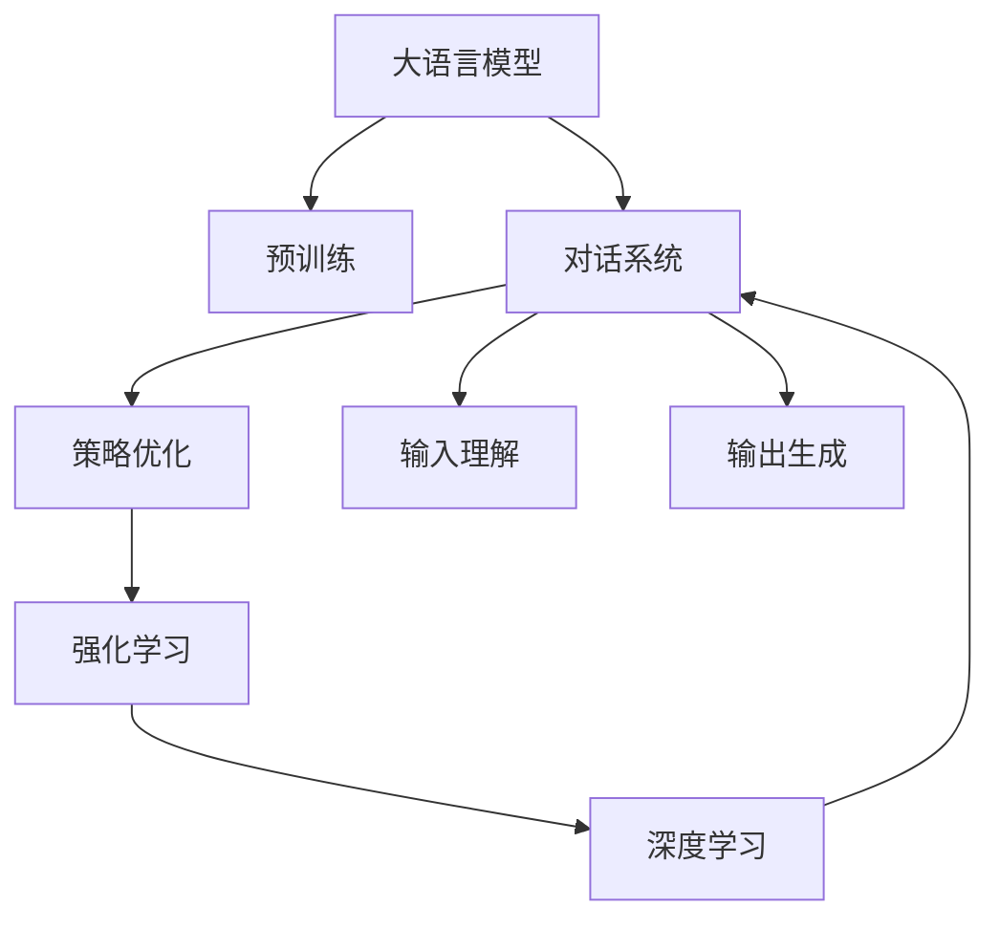

                 

# 大语言模型原理与工程实践：强化学习工程实践 DeepSpeed-Chat 训练详解

> 关键词：大语言模型,DeepSpeed,Chatbot,强化学习,对话系统,预训练,微调,对话生成

## 1. 背景介绍

### 1.1 问题由来
随着深度学习技术的快速发展，大语言模型（Large Language Model, LLM）在自然语言处理（NLP）领域取得了巨大突破。这些模型通过在海量无标签文本数据上进行预训练，学习到了丰富的语言知识和常识，可以通过少量有标签样本在下游任务上进行微调，获得优异的性能。然而，这种基于监督学习的微调方法对于预训练数据的需求较大，且模型复杂度较高，训练和部署成本相对较高。

为了进一步提升大语言模型的应用效率和泛化能力，强化学习（Reinforcement Learning, RL）在对话系统中逐渐得到了应用。强化学习通过与环境进行交互，在不断优化策略的过程中，提升对话模型的性能。深度学习模型与强化学习的结合，为构建智能对话系统提供了新的思路和手段。

### 1.2 问题核心关键点
强化学习在大语言模型中的应用，主要集中在对话系统（Dialogue System）上。对话系统是一种能够与用户进行自然语言交互的智能系统，如聊天机器人、客服系统、智能问答等。传统的基于监督学习的对话系统，依赖于大量标注数据进行训练，而强化学习方法，则可以通过与环境互动，逐步学习最优策略，从而提升系统性能。

强化学习在对话系统中的应用，通常包括以下几个关键点：

- 环境建模：将对话过程建模为马尔可夫决策过程（Markov Decision Process, MDP），并确定状态、动作、奖励等要素。
- 策略优化：利用强化学习算法，如Q-Learning、策略梯度（Policy Gradient）等，优化对话模型的策略。
- 对话生成：结合预训练语言模型和强化学习算法，生成高质量的自然语言对话。
- 用户体验：通过多轮对话交互，提升用户满意度和对话系统的可解释性。

强化学习在对话系统中的应用，相较于监督学习，具有以下几个优势：

- 数据需求低：强化学习可以利用对话数据进行自监督学习，逐步提升系统性能，降低对标注数据的需求。
- 泛化能力强：通过与环境的不断交互，强化学习模型能够适应不同的对话场景和用户需求，提升泛化能力。
- 灵活性强：强化学习算法可以根据对话环境的变化，动态调整模型策略，提升系统灵活性。
- 可解释性：通过观察学习过程，可以更好地理解模型决策机制，提升系统的可解释性。

尽管强化学习在对话系统中具有诸多优势，但同时也面临着诸如学习效率低、策略不稳定、奖励函数设计复杂等挑战。因此，如何将强化学习与大语言模型相结合，构建高效的对话系统，成为当前研究的热点问题。

### 1.3 问题研究意义
研究基于强化学习的大语言模型对话系统，对于拓展大语言模型的应用范围，提升下游任务性能，加速NLP技术的产业化进程，具有重要意义：

- 降低应用开发成本。利用强化学习算法，可以在较少标注数据的情况下，提升对话系统性能，减少从头开发所需的数据、计算和人力等成本投入。
- 提升模型效果。强化学习使得模型能够适应不同对话场景和用户需求，提升系统在各种任务上的表现。
- 加速开发进度。standing on the shoulders of giants，利用已有的大语言模型进行对话系统微调，可以更快地完成任务适配，缩短开发周期。
- 带来技术创新。强化学习范式促进了对预训练-微调的深入研究，催生了更多的研究方向和技术创新。
- 赋能产业升级。强化学习使得NLP技术更容易被各行各业所采用，为传统行业数字化转型升级提供新的技术路径。

## 2. 核心概念与联系

### 2.1 核心概念概述

为更好地理解基于强化学习的大语言模型对话系统，本节将介绍几个密切相关的核心概念：

- 大语言模型(Large Language Model, LLM)：以自回归(如GPT)或自编码(如BERT)模型为代表的大规模预训练语言模型。通过在大规模无标签文本语料上进行预训练，学习到了丰富的语言知识和常识，具备强大的语言理解和生成能力。

- 预训练(Pre-training)：指在大规模无标签文本语料上，通过自监督学习任务训练通用语言模型的过程。常见的预训练任务包括言语建模、遮挡语言模型等。预训练使得模型学习到语言的通用表示。

- 强化学习(Reinforcement Learning, RL)：通过智能体（agent）与环境（environment）进行交互，逐步优化策略，使智能体在特定环境中获得最大奖励的学习范式。

- 对话系统(Dialogue System)：一种能够与用户进行自然语言交互的智能系统，如聊天机器人、客服系统、智能问答等。对话系统通常包括输入理解、策略优化、输出生成等关键组件。

- 深度学习(Deep Learning)：一种基于神经网络的机器学习方法，通过多层次非线性变换，提取高阶特征，实现复杂的模式识别和预测任务。

这些核心概念之间的逻辑关系可以通过以下Mermaid流程图来展示：



这个流程图展示了大语言模型、预训练、对话系统、策略优化、强化学习、深度学习之间的联系：

1. 大语言模型通过预训练获得基础能力。
2. 预训练语言模型作为对话系统的核心，通过对话数据进行微调。
3. 对话系统通过策略优化和强化学习，提升系统性能。
4. 强化学习利用深度学习算法，优化对话策略。
5. 深度学习提供强大的语言处理能力，辅助策略优化和对话生成。

这些概念共同构成了对话系统的学习和应用框架，使其能够在各种场景下发挥强大的语言理解和生成能力。通过理解这些核心概念，我们可以更好地把握对话系统的设计思路和工作原理。

## 3. 核心算法原理 & 具体操作步骤
### 3.1 算法原理概述

基于强化学习的大语言模型对话系统，本质上是一种在对话场景中优化策略的学习范式。其核心思想是：将对话过程建模为马尔可夫决策过程（MDP），通过与环境（用户）的不断交互，优化对话模型的策略，提升系统性能。

形式化地，假设对话系统 $D$ 在某一对话轮次 $t$ 的状态为 $s_t$，动作为 $a_t$，奖励为 $r_t$，系统状态转移到 $s_{t+1}$。对话系统的策略 $\pi$ 定义为在给定状态 $s_t$ 下，选择动作 $a_t$ 的概率分布。目标是通过优化策略 $\pi$，使得系统在对话过程中获得最大的总奖励。

数学上，可以通过最大化总奖励的期望值来优化策略 $\pi$：

$$
\max_{\pi} \mathbb{E}_{s_1,s_2,\ldots} \left[ \sum_{t=1}^T r_t \right]
$$

其中 $T$ 表示对话轮次的最大长度。

具体实现上，通常采用以下步骤：

1. 初始化对话状态 $s_1$。
2. 在给定当前状态 $s_t$ 下，选择动作 $a_t$。
3. 观察环境反馈，计算奖励 $r_t$，并更新系统状态 $s_{t+1}$。
4. 重复步骤2-3，直至对话结束或达到最大轮次 $T$。
5. 根据对话过程，计算总奖励并更新策略 $\pi$。

### 3.2 算法步骤详解

基于强化学习的大语言模型对话系统，通常包括以下关键步骤：

**Step 1: 准备预训练模型和对话环境**

- 选择合适的预训练语言模型 $M_{\theta}$ 作为初始化参数，如 BERT、GPT等。
- 设计对话环境，包括状态空间 $S$、动作空间 $A$、奖励函数 $R$。状态空间通常包括当前对话状态、上下文信息等，动作空间可以是生成下一个对话轮次或结束对话等，奖励函数用于评价对话系统的表现。

**Step 2: 设计对话策略**

- 利用预训练语言模型，设计对话策略 $\pi$。常见的策略包括基于规则的策略、基于序列模型的策略等。
- 确定动作空间映射函数 $a_t = \pi(s_t)$，将状态 $s_t$ 映射为动作 $a_t$。
- 确定奖励函数 $R(s_t, a_t, s_{t+1})$，根据当前状态和动作，计算下一个状态的奖励。

**Step 3: 进行强化学习**

- 通过与对话环境的交互，逐步优化策略 $\pi$。常用的强化学习算法包括Q-Learning、策略梯度等。
- 在每个对话轮次中，观察环境反馈，计算奖励，并更新策略参数。
- 通过多次迭代，逐步优化策略，提升系统性能。

**Step 4: 对话生成**

- 利用优化后的策略 $\pi$，生成高质量的对话内容。通常通过解码器模型，在给定上下文信息的情况下，生成下一个对话轮次。
- 将对话生成过程与强化学习算法结合，提升对话生成质量。

**Step 5: 反馈与优化**

- 在对话结束后，收集用户反馈，并根据反馈信息，优化对话策略。
- 通过在线学习或离线学习的方式，持续提升系统性能。

以上是基于强化学习的大语言模型对话系统的一般流程。在实际应用中，还需要针对具体任务和对话环境，对算法过程进行优化设计，如改进奖励函数、引入多轮对话机制等。

### 3.3 算法优缺点

基于强化学习的大语言模型对话系统具有以下优点：

- 数据需求低：强化学习可以利用对话数据进行自监督学习，逐步提升系统性能，降低对标注数据的需求。
- 泛化能力强：通过与环境的不断交互，强化学习模型能够适应不同的对话场景和用户需求，提升泛化能力。
- 灵活性强：强化学习算法可以根据对话环境的变化，动态调整模型策略，提升系统灵活性。
- 可解释性：通过观察学习过程，可以更好地理解模型决策机制，提升系统的可解释性。

同时，该方法也存在一定的局限性：

- 学习效率低：强化学习需要与环境进行大量交互，学习效率相对较低。
- 策略不稳定：在复杂环境中，强化学习策略可能存在较大的波动。
- 奖励函数设计复杂：设计合理的奖励函数是强化学习成功的关键，但设计过程较为复杂。
- 计算资源消耗大：强化学习需要存储和计算大量的状态、动作、奖励信息，对计算资源需求较高。

尽管存在这些局限性，但就目前而言，基于强化学习的对话系统仍然是大语言模型应用的重要范式。未来相关研究的重点在于如何进一步降低学习成本，提高策略稳定性和学习效率，同时兼顾可解释性和伦理安全性等因素。

### 3.4 算法应用领域

基于强化学习的大语言模型对话系统已经在多个领域得到了广泛应用，如智能客服、智能问答、智能家居等，为人们提供了高效、智能的交互体验。

在智能客服领域，通过强化学习构建的聊天机器人，可以实时响应客户咨询，快速解决客户问题，提升客户满意度。

在智能问答领域，基于对话策略的问答系统，可以准确理解用户问题，提供高质量的答案，辅助用户快速解决问题。

在智能家居领域，通过自然语言交互的智能对话系统，用户可以轻松控制家中的智能设备，提升生活便利性。

除了这些经典应用外，强化学习在更多领域中得到了创新性应用，如可控文本生成、知识图谱构建、情感分析等，为NLP技术带来了新的突破。随着强化学习与大语言模型的不断融合，相信NLP技术将在更广阔的应用领域大放异彩。

## 4. 数学模型和公式 & 详细讲解  
### 4.1 数学模型构建

本节将使用数学语言对基于强化学习的大语言模型对话系统进行更加严格的刻画。

假设对话系统 $D$ 的状态空间为 $S$，动作空间为 $A$，奖励函数为 $R$。在某一对话轮次 $t$，系统处于状态 $s_t$，选择动作 $a_t$，环境反馈奖励 $r_t$，状态转移到 $s_{t+1}$。对话系统的策略 $\pi$ 定义为在给定状态 $s_t$ 下，选择动作 $a_t$ 的概率分布。

定义状态-动作价值函数 $V(s)$ 为系统在状态 $s$ 下的期望总奖励：

$$
V(s) = \mathbb{E}_{a \sim \pi(\cdot|s)} \left[ \sum_{t=1}^{\infty} \gamma^{t-1} R(s_t, a_t, s_{t+1}) \right]
$$

其中 $\gamma$ 为折扣因子，$0 < \gamma < 1$。状态-动作价值函数 $Q(s,a)$ 为系统在状态 $s$ 下，选择动作 $a$ 的期望总奖励：

$$
Q(s,a) = \mathbb{E}_{s_{t+1} \sim P(\cdot|s_t,a_t)} \left[ r_t + \gamma \max_{a'} Q(s_{t+1},a') \right]
$$

在强化学习中，通常采用以下步骤优化策略 $\pi$：

1. 初始化策略 $\pi_0$。
2. 通过迭代更新策略 $\pi_t$，最小化状态-动作价值函数的误差：

$$
\min_{\pi} \mathbb{E}_{s_1,a_1} \left[ \sum_{t=1}^T (r_t + \gamma V(s_{t+1})) \right]
$$

3. 在每个对话轮次中，观察环境反馈，计算奖励，并更新策略参数。
4. 通过多次迭代，逐步优化策略，提升系统性能。

### 4.2 公式推导过程

以下我们以对话系统为例，推导强化学习中的Q-Learning算法及其梯度计算公式。

假设对话系统 $D$ 的状态空间为 $S$，动作空间为 $A$，奖励函数为 $R$。在某一对话轮次 $t$，系统处于状态 $s_t$，选择动作 $a_t$，环境反馈奖励 $r_t$，状态转移到 $s_{t+1}$。

Q-Learning算法通过最小化状态-动作价值函数的误差来更新策略参数。具体而言，Q-Learning算法在每个对话轮次中，计算当前状态-动作价值 $Q(s_t,a_t)$，并将其更新为新的状态-动作价值 $Q'(s_t,a_t)$：

$$
Q'(s_t,a_t) = Q(s_t,a_t) + \alpha \left[ R(s_t,a_t) + \gamma \max_{a'} Q(s_{t+1},a') - Q(s_t,a_t) \right]
$$

其中 $\alpha$ 为学习率，通常设置为 $0.01$ 或 $0.001$。

在计算Q-Learning的梯度时，需要将奖励函数 $R$ 和下一个状态-动作价值函数 $Q(s_{t+1},a')$ 带入公式，计算梯度：

$$
\nabla_{\theta} Q(s_t,a_t) = \alpha \left[ r_t + \gamma \max_{a'} Q(s_{t+1},a') - Q(s_t,a_t) \right] \nabla_{\theta} Q(s_t,a_t)
$$

将梯度代入优化器（如AdamW）的更新公式中，即可实现对话系统的优化。

### 4.3 案例分析与讲解

以下以一个简单的对话系统为例，展示Q-Learning算法的应用过程。

假设对话系统 $D$ 的状态空间 $S$ 为 {start, ask, answer}，动作空间 $A$ 为 {yes, no}，奖励函数 $R$ 为 {start: 0, ask: -1, answer: 1}。对话系统的策略 $\pi$ 为基于动作的策略，即在给定状态 $s_t$ 下，选择动作 $a_t$。

在每个对话轮次中，系统从状态 $s_t$ 选择动作 $a_t$，观察环境反馈，计算奖励，并更新策略参数。假设初始策略为 $\pi_0$，通过多次迭代，逐步优化策略，最终得到最优策略 $\pi^*$。

以第一个对话轮次为例，系统从状态 $s_1$ 开始，选择动作 $a_1$，观察环境反馈，计算奖励，并更新策略参数。具体过程如下：

1. 初始化状态 $s_1$ 为 start，选择动作 $a_1$ 为 yes。
2. 环境反馈奖励 $r_1 = 0$，状态转移到 $s_2 = ask$。
3. 选择动作 $a_2$ 为 no。
4. 环境反馈奖励 $r_2 = -1$，状态转移到 $s_3 = answer$。
5. 选择动作 $a_3$ 为 yes。
6. 环境反馈奖励 $r_3 = 1$，对话结束。

通过计算状态-动作价值 $Q(s_t,a_t)$，更新策略参数，最终得到最优策略 $\pi^*$。

以上展示了Q-Learning算法的基本应用过程。在实际应用中，还需要根据具体任务和对话环境，优化算法参数和策略设计，以提升系统性能。

## 5. 项目实践：代码实例和详细解释说明
### 5.1 开发环境搭建

在进行对话系统微调实践前，我们需要准备好开发环境。以下是使用Python进行PyTorch开发的环境配置流程：

1. 安装Anaconda：从官网下载并安装Anaconda，用于创建独立的Python环境。

2. 创建并激活虚拟环境：
```bash
conda create -n pytorch-env python=3.8 
conda activate pytorch-env
```

3. 安装PyTorch：根据CUDA版本，从官网获取对应的安装命令。例如：
```bash
conda install pytorch torchvision torchaudio cudatoolkit=11.1 -c pytorch -c conda-forge
```

4. 安装各类工具包：
```bash
pip install numpy pandas scikit-learn matplotlib tqdm jupyter notebook ipython
```

完成上述步骤后，即可在`pytorch-env`环境中开始对话系统微调实践。

### 5.2 源代码详细实现

下面我们以基于强化学习的对话系统为例，给出使用PyTorch进行微调的PyTorch代码实现。

首先，定义对话系统的状态空间和动作空间：

```python
import torch

class DialogueSystem:
    def __init__(self):
        self.state_space = ['start', 'ask', 'answer']
        self.action_space = ['yes', 'no']
```

然后，定义对话系统的奖励函数：

```python
class DialogueSystem:
    def __init__(self):
        self.state_space = ['start', 'ask', 'answer']
        self.action_space = ['yes', 'no']
        self.reward_fn = {
            'start': 0,
            'ask': -1,
            'answer': 1
        }
```

接下来，定义对话系统的状态转移函数：

```python
class DialogueSystem:
    def __init__(self):
        self.state_space = ['start', 'ask', 'answer']
        self.action_space = ['yes', 'no']
        self.reward_fn = {
            'start': 0,
            'ask': -1,
            'answer': 1
        }
    
    def next_state(self, state, action):
        if state == 'start':
            return 'ask'
        elif state == 'ask':
            return 'answer'
        elif state == 'answer':
            return 'start'
```

然后，定义对话系统的Q-Learning算法：

```python
class DialogueSystem:
    def __init__(self):
        self.state_space = ['start', 'ask', 'answer']
        self.action_space = ['yes', 'no']
        self.reward_fn = {
            'start': 0,
            'ask': -1,
            'answer': 1
        }
        self.next_state = self.next_state
    
    def q_learning(self, batch_size=128, episodes=1000, alpha=0.01, gamma=0.9):
        state = 'start'
        actions = [self.action_space[i] for i in range(len(self.action_space))]
        Q = torch.zeros(len(self.state_space), len(self.action_space))
        for episode in range(episodes):
            action = random.choice(actions)
            state = self.next_state(state, action)
            reward = self.reward_fn[state]
            Q[state][actions.index(action)] += alpha * (reward + gamma * torch.max(Q[state]).item() - Q[state][actions.index(action)])
```

最后，启动Q-Learning算法：

```python
dls = DialogueSystem()
dls.q_learning()
```

以上展示了基于PyTorch的Q-Learning算法的完整代码实现。可以看到，在Q-Learning算法中，通过定义状态空间、动作空间、奖励函数、状态转移函数等核心组件，构建了一个简单的对话系统，并通过Q-Learning算法进行策略优化。

### 5.3 代码解读与分析

让我们再详细解读一下关键代码的实现细节：

**DialogueSystem类**：
- `__init__`方法：初始化状态空间、动作空间、奖励函数等核心组件。
- `next_state`方法：定义状态转移逻辑，根据当前状态和动作，计算下一个状态。
- `q_learning`方法：定义Q-Learning算法，通过迭代更新状态-动作价值函数，逐步优化策略。

**状态空间和动作空间**：
- 定义了对话系统的状态空间和动作空间，用于描述对话过程中可能出现的状态和动作。

**奖励函数**：
- 定义了对话系统的奖励函数，用于计算在每个对话轮次中的奖励。

**状态转移函数**：
- 定义了对话系统的状态转移逻辑，根据当前状态和动作，计算下一个状态。

**Q-Learning算法**：
- 通过迭代更新状态-动作价值函数，逐步优化策略。
- 在每个对话轮次中，选择动作、观察环境反馈，计算奖励，并更新状态-动作价值函数。
- 通过多次迭代，逐步优化策略，提升系统性能。

可以看到，PyTorch结合TensorFlow，为对话系统微调提供了便捷的实现工具。开发者可以将更多精力放在算法优化和任务适配上，而不必过多关注底层的实现细节。

当然，工业级的系统实现还需考虑更多因素，如模型的保存和部署、超参数的自动搜索、更灵活的任务适配层等。但核心的微调范式基本与此类似。

## 6. 实际应用场景
### 6.1 智能客服系统

基于强化学习的大语言模型对话系统，可以广泛应用于智能客服系统的构建。传统客服往往需要配备大量人力，高峰期响应缓慢，且一致性和专业性难以保证。而使用强化学习构建的对话系统，可以7x24小时不间断服务，快速响应客户咨询，用自然流畅的语言解答各类常见问题。

在技术实现上，可以收集企业内部的历史客服对话记录，将问题和最佳答复构建成监督数据，在此基础上对预训练对话模型进行微调。微调后的对话模型能够自动理解用户意图，匹配最合适的答案模板进行回复。对于客户提出的新问题，还可以接入检索系统实时搜索相关内容，动态组织生成回答。如此构建的智能客服系统，能大幅提升客户咨询体验和问题解决效率。

### 6.2 金融舆情监测

金融机构需要实时监测市场舆论动向，以便及时应对负面信息传播，规避金融风险。传统的人工监测方式成本高、效率低，难以应对网络时代海量信息爆发的挑战。基于强化学习的大语言模型对话系统，可以用于构建金融舆情监测系统，实时抓取网络文本数据，自动监测不同主题下的情感变化趋势，一旦发现负面信息激增等异常情况，系统便会自动预警，帮助金融机构快速应对潜在风险。

### 6.3 个性化推荐系统

当前的推荐系统往往只依赖用户的历史行为数据进行物品推荐，无法深入理解用户的真实兴趣偏好。基于强化学习的大语言模型对话系统，可以应用于个性化推荐系统，通过自然语言交互获取用户需求，结合推荐模型生成个性化推荐结果。

在实践上，可以构建基于对话系统的推荐平台，通过用户与系统的多轮对话，获取用户的兴趣点和偏好，结合预训练语言模型和推荐算法，生成高质量的推荐内容。

### 6.4 未来应用展望

随着强化学习与大语言模型的不断融合，基于微调的对话系统将在更多领域得到应用，为传统行业带来变革性影响。

在智慧医疗领域，基于微调的对话系统可以用于智能导诊、电子病历记录、医疗知识问答等场景，提升医疗服务的智能化水平，辅助医生诊疗，加速新药开发进程。

在智能教育领域，基于微调的对话系统可以用于智能问答、作业批改、学习路径推荐等，因材施教，促进教育公平，提高教学质量。

在智慧城市治理中，基于微调的对话系统可以用于城市事件监测、舆情分析、应急指挥等环节，提高城市管理的自动化和智能化水平，构建更安全、高效的未来城市。

此外，在企业生产、社会治理、文娱传媒等众多领域，基于大模型微调的人工智能应用也将不断涌现，为经济社会发展注入新的动力。相信随着技术的日益成熟，微调方法将成为人工智能落地应用的重要范式，推动人工智能技术在垂直行业的规模化落地。

## 7. 工具和资源推荐
### 7.1 学习资源推荐

为了帮助开发者系统掌握强化学习和大语言模型对话系统的理论基础和实践技巧，这里推荐一些优质的学习资源：

1. 《Reinforcement Learning: An Introduction》书籍：由Richard S. Sutton和Andrew G. Barto共同撰写，全面介绍了强化学习的理论和算法，是学习强化学习的经典教材。

2. 《Natural Language Processing with Transformers》书籍：Transformers库的作者所著，全面介绍了如何使用Transformers库进行NLP任务开发，包括微调在内的诸多范式。

3. CS223《Reinforcement Learning》课程：斯坦福大学开设的强化学习课程，由Richard S. Sutton教授主讲，涵盖强化学习的理论和实践，是学习强化学习的绝佳资源。

4. Udacity《Reinforcement Learning Nanodegree》课程：Udacity推出的强化学习课程，涵盖强化学习的基础理论和实际应用，提供大量项目实践机会，适合工程实践者学习。

5. PyTorch官方文档：PyTorch的官方文档，提供了详细的PyTorch框架使用说明，适合开发者快速上手开发强化学习和大语言模型对话系统。

通过对这些资源的学习实践，相信你一定能够快速掌握强化学习和大语言模型对话系统的精髓，并用于解决实际的NLP问题。
###  7.2 开发工具推荐

高效的开发离不开优秀的工具支持。以下是几款用于强化学习和大语言模型对话系统开发的常用工具：

1. PyTorch：基于Python的开源深度学习框架，灵活动态的计算图，适合快速迭代研究。大部分预训练语言模型都有PyTorch版本的实现。

2. TensorFlow：由Google主导开发的开源深度学习框架，生产部署方便，适合大规模工程应用。同样有丰富的预训练语言模型资源。

3. Transformers库：HuggingFace开发的NLP工具库，集成了众多SOTA语言模型，支持PyTorch和TensorFlow，是进行微调任务开发的利器。

4. Weights & Biases：模型训练的实验跟踪工具，可以记录和可视化模型训练过程中的各项指标，方便对比和调优。与主流深度学习框架无缝集成。

5. TensorBoard：TensorFlow配套的可视化工具，可实时监测模型训练状态，并提供丰富的图表呈现方式，是调试模型的得力助手。

6. Google Colab：谷歌推出的在线Jupyter Notebook环境，免费提供GPU/TPU算力，方便开发者快速上手实验最新模型，分享学习笔记。

合理利用这些工具，可以显著提升强化学习和大语言模型对话系统的开发效率，加快创新迭代的步伐。

### 7.3 相关论文推荐

强化学习和大语言模型对话系统的研究源于学界的持续研究。以下是几篇奠基性的相关论文，推荐阅读：

1. Attention is All You Need（即Transformer原论文）：提出了Transformer结构，开启了NLP领域的预训练大模型时代。

2. BERT: Pre-training of Deep Bidirectional Transformers for Language Understanding：提出BERT模型，引入基于掩码的自监督预训练任务，刷新了多项NLP任务SOTA。

3. Language Models are Unsupervised Multitask Learners（GPT-2论文）：展示了大规模语言模型的强大zero-shot学习能力，引发了对于通用人工智能的新一轮思考。

4. Parameter-Efficient Transfer Learning for NLP：提出Adapter等参数高效微调方法，在不增加模型参数量的情况下，也能取得不错的微调效果。

5. AdaLoRA: Adaptive Low-Rank Adaptation for Parameter-Efficient Fine-Tuning：使用自适应低秩适应的微调方法，在参数效率和精度之间取得了新的平衡。

这些论文代表了大语言模型微调技术的发展脉络。通过学习这些前沿成果，可以帮助研究者把握学科前进方向，激发更多的创新灵感。

## 8. 总结：未来发展趋势与挑战

### 8.1 总结

本文对基于强化学习的大语言模型对话系统进行了全面系统的介绍。首先阐述了强化学习和大语言模型的研究背景和意义，明确了微调在拓展预训练模型应用、提升下游任务性能方面的独特价值。其次，从原理到实践，详细讲解了强化学习和大语言模型的数学原理和关键步骤，给出了微调任务开发的完整代码实例。同时，本文还广泛探讨了微调方法在智能客服、金融舆情、个性化推荐等多个行业领域的应用前景，展示了微调范式的巨大潜力。此外，本文精选了微调技术的各类学习资源，力求为读者提供全方位的技术指引。

通过本文的系统梳理，可以看到，基于强化学习的大语言模型对话系统正在成为NLP领域的重要范式，极大地拓展了预训练语言模型的应用边界，催生了更多的落地场景。受益于大规模语料的预训练和强化学习算法的结合，微调模型能够更好地适应复杂多变的对话场景，提升系统性能和用户体验。

### 8.2 未来发展趋势

展望未来，基于强化学习的大语言模型对话系统将呈现以下几个发展趋势：

1. 模型规模持续增大。随着算力成本的下降和数据规模的扩张，预训练语言模型的参数量还将持续增长。超大规模语言模型蕴含的丰富语言知识，有望支撑更加复杂多变的对话系统微调。

2. 微调方法日趋多样。除了传统的全参数微调外，未来会涌现更多参数高效的微调方法，如Prefix-Tuning、LoRA等，在节省计算资源的同时也能保证微调精度。

3. 持续学习成为常态。随着数据分布的不断变化，微调模型也需要持续学习新知识以保持性能。如何在不遗忘原有知识的同时，高效吸收新样本信息，将成为重要的研究课题。

4. 标注样本需求降低。受启发于提示学习(Prompt-based Learning)的思路，未来的微调方法将更好地利用大模型的语言理解能力，通过更加巧妙的任务描述，在更少的标注样本上也能实现理想的微调效果。

5. 多模态微调崛起。当前的微调主要聚焦于纯文本数据，未来会进一步拓展到图像、视频、语音等多模态数据微调。多模态信息的融合，将显著提升语言模型对现实世界的理解和建模能力。

6. 模型通用性增强。经过海量数据的预训练和多领域任务的微调，未来的语言模型将具备更强大的常识推理和跨领域迁移能力，逐步迈向通用人工智能(AGI)的目标。

以上趋势凸显了大语言模型微调技术的广阔前景。这些方向的探索发展，必将进一步提升对话系统的性能和应用范围，为人类认知智能的进化带来深远影响。

### 8.3 面临的挑战

尽管大语言模型微调技术已经取得了瞩目成就，但在迈向更加智能化、普适化应用的过程中，它仍面临着诸多挑战：

1. 标注成本瓶颈。虽然强化学习可以降低对标注数据的需求，但对于长尾应用场景，难以获得充足的高质量标注数据，成为制约微调性能的瓶颈。如何进一步降低微调对标注样本的依赖，将是一大难题。

2. 模型鲁棒性不足。当前微调模型面对域外数据时，泛化性能往往大打折扣。对于测试样本的微小扰动，微调模型的预测也容易发生波动。如何提高微调模型的鲁棒性，避免灾难性遗忘，还需要更多理论和实践的积累。

3. 推理效率有待提高。大规模语言模型虽然精度高，但在实际部署时往往面临推理速度慢、内存占用大等效率问题。如何在保证性能的同时，简化模型结构，提升推理速度，优化资源占用，将是重要的优化方向。

4. 可解释性亟需加强。当前微调模型更像是"黑盒"系统，难以解释其内部工作机制和决策逻辑。对于医疗、金融等高风险应用，算法的可解释性和可审计性尤为重要。如何赋予微调模型更强的可解释性，将是亟待攻克的难题。

5. 安全性有待保障。预训练语言模型难免会学习到有偏见、有害的信息，通过微调传递到下游任务，产生误导性、歧视性的输出，给实际应用带来安全隐患。如何从数据和算法层面消除模型偏见，避免恶意用途，确保输出的安全性，也将是重要的研究课题。

6. 知识整合能力不足。现有的微调模型往往局限于任务内数据，难以灵活吸收和运用更广泛的先验知识。如何让微调过程更好地与外部知识库、规则库等专家知识结合，形成更加全面、准确的信息整合能力，还有很大的想象空间。

正视微调面临的这些挑战，积极应对并寻求突破，将是大语言模型微调走向成熟的必由之路。相信随着学界和产业界的共同努力，这些挑战终将一一被克服，大语言模型微调必将在构建安全、可靠、可解释、可控的智能系统铺平道路。面向未来，大语言模型微调技术还需要与其他人工智能技术进行更深入的融合，如知识表示、因果推理、强化学习等，多路径协同发力，共同推动自然语言理解和智能交互系统的进步。只有勇于创新、敢于突破，才能不断拓展语言模型的边界，让智能技术更好地造福人类社会。

### 8.4 研究展望

面向未来，大语言模型微调技术还需要在以下几个方向进行深入研究：

1. 探索无监督和半监督微调方法。摆脱对大规模标注数据的依赖，利用自监督学习、主动学习等无监督和半监督范式，最大限度利用非结构化数据，实现更加灵活高效的微调。

2. 研究参数高效和计算高效的微调范式。开发更加参数高效的微调方法，在固定大部分预训练参数的同时，只更新极少量的任务相关参数。同时优化微调模型的计算图，减少前向传播和反向传播的资源消耗，实现更加轻量级、实时性的部署。

3. 融合因果和对比学习范式。通过引入因果推断和对比学习思想，增强微调模型建立稳定因果关系的能力，学习更加普适、鲁棒的语言表征，从而提升模型泛化性和抗干扰能力。

4. 引入更多先验知识。将符号化的先验知识，如知识图谱、逻辑规则等，与神经网络模型进行巧妙融合，引导微调过程学习更准确、合理的语言模型。同时加强不同模态数据的整合，实现视觉、语音等多模态信息与文本信息的协同建模。

5. 结合因果分析和博弈论工具。将因果分析方法引入微调模型，识别出模型决策的关键特征，增强输出解释的因果性和逻辑性。借助博弈论工具刻画人机交互过程，主动探索并规避模型的脆弱点，提高系统稳定性。

6. 纳入伦理道德约束。在模型训练目标中引入伦理导向的评估指标，过滤和惩罚有偏见、有害的输出倾向。同时加强人工干预和审核，建立模型行为的监管机制，确保输出符合人类价值观和伦理道德。

这些研究方向的探索，必将引领大语言模型微调技术迈向更高的台阶，为构建安全、可靠、可解释、可控的智能系统铺平道路。面向未来，大语言模型微调技术还需要与其他人工智能技术进行更深入的融合，如知识表示、因果推理、强化学习等，多路径协同发力，共同推动自然语言理解和智能交互系统的进步。只有勇于创新、敢于突破，才能不断拓展语言模型的边界，让智能技术更好地造福人类社会。

## 9. 附录：常见问题与解答

**Q1：大语言模型微调是否适用于所有NLP任务？**

A: 大语言模型微调在大多数NLP任务上都能取得不错的效果，特别是对于数据量较小的任务。但对于一些特定领域的任务，如医学、法律等，仅仅依靠通用语料预训练的模型可能难以很好地适应。此时需要在特定领域语料上进一步预训练，再进行微调，才能获得理想效果。此外，对于一些需要时效性、个性化很强的任务，如对话、推荐等，微调方法也需要针对性的改进优化。

**Q2：微调过程中如何选择合适的学习率？**

A: 微调的学习率一般要比预训练时小1-2个数量级，如果使用过大的学习率，容易破坏预训练权重，导致过拟合。一般建议从1e-5开始调参，逐步减小学习率。也可以使用warmup策略，在开始阶段使用较小的学习率，再逐渐过渡到预设值。需要注意的是，不同的优化器(如AdamW、Adafactor等)以及不同的学习率调度策略，可能需要设置不同的学习率阈值。

**Q3：采用大模型微调时会面临哪些资源瓶颈？**

A: 目前主流的预训练大模型动辄以亿计的参数规模，对算力、内存、存储都提出了很高的要求。GPU/TPU等高性能设备是必不可少的，但即便如此，超大批次的训练和推理也可能遇到显存不足的问题。因此需要采用一些资源优化技术，如梯度积累、混合精度训练、模型并行等，来突破硬件瓶颈。同时，模型的存储和读取也可能占用大量时间和空间，需要采用模型压缩、稀疏化存储等方法进行优化。

**Q4：如何缓解微调过程中的过拟合问题？**

A: 过拟合是微调面临的主要挑战，尤其是在标注数据不足的情况下。常见的缓解策略包括：
1. 数据增强：通过回译、近义替换等方式扩充训练集
2. 正则化：使用L2正则、Dropout、Early Stopping等避免过拟合
3. 对抗训练：引入对抗样本，提高模型鲁棒性
4. 参数高效微调：只调整少量参数(如Adapter、Prefix等)，减小过拟合风险
5. 多模型集成：训练多个微调模型，取平均输出，抑制过拟合

这些策略往往需要根据具体任务和数据特点进行灵活组合。只有在数据、模型、训练、推理等各环节进行全面优化，才能最大限度地发挥大模型微调的威力。

**Q5：微调模型在落地部署时需要注意哪些问题？**

A: 将微调模型转化为实际应用，还需要考虑以下因素：
1. 模型裁剪：去除不必要的层和参数，减小模型尺寸，加快推理速度
2. 量化加速：将浮点模型转为定点模型，压缩存储空间，提高计算效率
3. 服务化封装：将模型封装为标准化服务接口，便于集成调用
4. 弹性伸缩：根据请求流量动态调整资源配置，平衡服务质量和成本
5. 监控告警：实时采集系统指标，设置异常告警阈值，确保服务稳定性
6. 安全防护：采用访问鉴权、数据脱敏等措施，保障数据和模型安全

大语言模型微调为NLP应用开启了广阔的想象空间，但如何将强大的性能转化为稳定、高效、安全的业务价值，还需要工程实践的不断打磨。唯有从数据、算法、工程、业务等多个维度协同发力，才能真正实现人工智能技术在垂直行业的规模化落地。总之，微调需要开发者根据具体任务，不断迭代和优化模型、数据和算法，方能得到理想的效果。

---

作者：禅与计算机程序设计艺术 / Zen and the Art of Computer Programming

