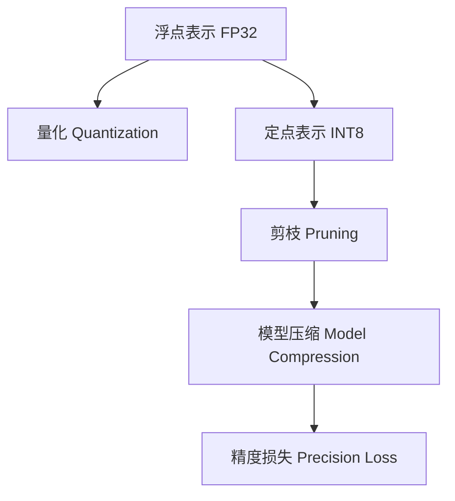

                 

# 大语言模型原理基础与前沿 FP8与INT8

> 关键词：大语言模型,微调,预训练,计算效率,数值表示,数值类型,算法优化

## 1. 背景介绍

### 1.1 问题由来
近年来，深度学习在各个领域取得了巨大的进展，特别是语言模型的预训练技术和大模型的微调技术在自然语言处理(NLP)领域表现出色。然而，大语言模型的计算需求也带来了巨大的挑战。为了减少计算成本，研究人员开始探索如何在保持性能的同时减少模型参数量和计算量。这其中，FP8和INT8这两种数值表示方式应运而生，为深度学习模型的压缩和加速提供了新的方向。

### 1.2 问题核心关键点
FP8与INT8技术通过将模型参数和计算过程中的数值表示进行量化，从而降低计算成本，提高计算效率。具体来说，FP8与INT8技术针对浮点表示(FP32)的缺点，将模型的数值表示转换为更高效的数据类型，通过量化和剪枝等技术，实现模型压缩和加速。

### 1.3 问题研究意义
研究FP8与INT8技术对于提升深度学习模型的计算效率，减少计算成本，推动大模型在实际应用中的落地具有重要意义：

1. 降低计算成本。FP8与INT8技术通过压缩模型和优化计算图，显著降低计算和存储成本，使其在大规模数据集上的训练和推理成为可能。
2. 提升计算效率。通过量化计算过程中的数值表示，FP8与INT8技术极大提升了模型的计算效率，使其能够处理更多的数据，提高模型的训练和推理速度。
3. 促进深度学习技术的应用。高效模型压缩技术和大规模计算资源的结合，使得深度学习技术能够更快地落地应用，推动更多领域的智能化转型。
4. 推动数值计算技术的发展。FP8与INT8技术的研究为深度学习中的数值表示和计算优化提供了新的思路，推动数值计算技术的进步。

## 2. 核心概念与联系

### 2.1 核心概念概述

为更好地理解FP8与INT8技术，本节将介绍几个密切相关的核心概念：

- 浮点表示(Floating Point Representation)：指使用浮点数表示数值的方式，如单精度浮点表示(FP32)。浮点表示可以精确地表示小数值，但计算和存储成本较高。
- 定点表示(Fixed Point Representation)：指使用定点数表示数值的方式，如定点整数表示(INT8)。定点表示计算和存储成本较低，但精度较差。
- 量化(Quantization)：将浮点数表示转换为定点数表示的过程。量化过程中，数值的精度可能会降低，但计算和存储成本会大大降低。
- 剪枝(Pruning)：指从模型中去除不必要的参数或计算图节点，从而减少模型的复杂度和计算量。
- 模型压缩(Model Compression)：指通过量化、剪枝等技术，减小模型的参数量和计算量，提高模型的压缩比和计算效率。
- 精度损失(Precision Loss)：量化过程中由于数值精度降低导致的模型性能下降。

这些核心概念之间的逻辑关系可以通过以下Mermaid流程图来展示：



这个流程图展示了大语言模型压缩和加速技术的关键步骤：

1. 浮点表示的数值进行量化。
2. 量化后的定点数表示进行剪枝。
3. 剪枝后的模型进行压缩。
4. 压缩过程中可能会产生精度损失。

这些概念共同构成了大语言模型压缩和加速技术的框架，使其能够在不牺牲性能的前提下，提高模型的计算效率和资源利用率。

## 3. 核心算法原理 & 具体操作步骤
### 3.1 算法原理概述

FP8与INT8技术主要通过以下两个步骤来实现模型的压缩和加速：

1. 量化(Qualification)：将浮点数表示转换为定点数表示。
2. 剪枝(Pruning)：去除模型中不必要的参数或计算图节点，进一步减小模型规模。

具体的量化过程可以分为四步：

1. 将浮点数映射为定点数。
2. 对定点数进行裁剪。
3. 将定点数进行乘积量化。
4. 对量化后的定点数进行偏置调整。

### 3.2 算法步骤详解

#### 3.2.1 量化步骤详解

1. 将浮点数映射为定点数：
   - 定义一个范围为[-2^(N-1), 2^(N-1)]的整数集合，并将每个浮点数映射为集合中的一个整数值。
   - 对于每个浮点数x，计算其与整数集合中最近整数值的距离，即round(x)，并将其作为定点数的值。

2. 对定点数进行裁剪：
   - 定义一个裁剪范围，将定点数的取值范围限定在[-1, 1]之间。
   - 如果定点数的取值超出了裁剪范围，将其裁剪到最近边界。

3. 将定点数进行乘积量化：
   - 将定点数乘以一个比例因子，使其乘积的结果能够映射到一个更小的整数集合。
   - 将乘积结果进行裁剪，保留其整数部分。

4. 对量化后的定点数进行偏置调整：
   - 引入一个偏置项，将量化后的定点数加上偏置，使其能够映射到[-2^(N-1), 2^(N-1)]的整数集合。
   - 调整偏置项，使其能够恢复量化前的浮点数表示。

#### 3.2.2 剪枝步骤详解

1. 分析模型的计算图，找出冗余参数和计算节点。
2. 根据参数或计算节点的重要性和贡献度，进行排序和筛选。
3. 移除排名靠后的参数或计算节点，保留排名靠前的参数或计算节点。
4. 优化计算图，减少不必要的计算量和数据流动。

### 3.3 算法优缺点

FP8与INT8技术在深度学习模型的压缩和加速方面具有以下优点：

1. 计算效率高：定点表示和量化处理使得模型的计算速度更快，尤其是在GPU等硬件设备上，能够显著提高模型的推理效率。
2. 存储成本低：定点表示和量化处理能够减少模型占用的存储空间，降低存储成本。
3. 训练速度较快：模型压缩和剪枝使得训练过程的计算量和数据流动减少，训练速度更快。

同时，这些技术也存在一些缺点：

1. 精度损失：量化和定点表示会引入精度损失，导致模型的预测精度下降。
2. 实现复杂：量化和剪枝需要精确控制，实现难度较大。
3. 不适用于所有模型：一些模型可能不适用于量化和剪枝，尤其是涉及复杂的非线性运算和动态计算的模型。
4. 可能需要额外的训练：量化和剪枝后的模型可能需要额外的训练，才能达到与原模型相同的性能。

### 3.4 算法应用领域

FP8与INT8技术在深度学习模型的压缩和加速方面具有广泛的应用，适用于各种计算机视觉、自然语言处理、语音识别等任务：

1. 计算机视觉任务：如图像分类、物体检测、人脸识别等。通过量化和剪枝，大幅降低模型的计算和存储成本，使其能够在大规模数据集上进行训练和推理。
2. 自然语言处理任务：如文本分类、情感分析、机器翻译等。通过量化和剪枝，能够提高模型的计算效率，使其能够在更短的训练时间内获得较好的性能。
3. 语音识别任务：如自动语音识别、语音合成等。通过量化和剪枝，能够减少模型的计算量和存储空间，使其能够实时处理语音数据。
4. 推荐系统：如商品推荐、用户画像等。通过量化和剪枝，能够提高模型的计算效率，使其能够处理更多的数据和更复杂的计算。

## 4. 数学模型和公式 & 详细讲解 & 举例说明

### 4.1 数学模型构建

在量化过程中，假设原模型参数为 $W \in \mathbb{R}^{M \times N}$，其中 $M$ 为输入维度，$N$ 为输出维度。量化后模型的参数为 $W_q \in \mathbb{Z}^{M \times N}$，其中 $\mathbb{Z}$ 表示整数集合。量化过程可以分为以下几步：

1. 将 $W$ 映射为整数集合中的整数值 $W_i$。
2. 对 $W_i$ 进行裁剪，限定其取值范围。
3. 对 $W_i$ 进行乘积量化，得到 $W_q$。
4. 对 $W_q$ 进行偏置调整，恢复 $W$ 的浮点数表示。

### 4.2 公式推导过程

#### 4.2.1 映射到整数集合

将 $W$ 映射到整数集合 $\mathbb{Z}^{M \times N}$ 的整数值 $W_i$，可以使用以下公式：

$$
W_i = \text{round}(\frac{W}{\text{scale}})
$$

其中 $\text{round}$ 表示四舍五入函数，$\text{scale}$ 表示比例因子。

#### 4.2.2 裁剪整数值

对整数值 $W_i$ 进行裁剪，限定其取值范围，可以使用以下公式：

$$
W_i = \min(1, \max(-1, W_i))
$$

#### 4.2.3 乘积量化

对裁剪后的整数值 $W_i$ 进行乘积量化，得到量化后的整数值 $W_q$，可以使用以下公式：

$$
W_q = \text{round}(W_i \times \text{scale} \times \text{factor})
$$

其中 $\text{factor}$ 表示乘积因子，使得 $W_q$ 的取值范围落在 $\mathbb{Z}^{M \times N}$ 中。

#### 4.2.4 偏置调整

对量化后的整数值 $W_q$ 进行偏置调整，恢复 $W$ 的浮点数表示，可以使用以下公式：

$$
W_q = W_i \times \text{scale} + \text{bias}
$$

其中 $\text{bias}$ 表示偏置项，用于恢复量化前的浮点数表示。

### 4.3 案例分析与讲解

#### 4.3.1 示例一：图像分类

在图像分类任务中，假设原模型参数为 $W \in \mathbb{R}^{1024 \times 1024}$，其中 $1024$ 表示每个像素的通道数。量化后模型的参数为 $W_q \in \mathbb{Z}^{1024 \times 1024}$。具体量化过程如下：

1. 将 $W$ 映射为整数集合 $\mathbb{Z}^{1024 \times 1024}$ 的整数值 $W_i$，使用比例因子 $\text{scale}=1/256$。
2. 对整数值 $W_i$ 进行裁剪，限定其取值范围在 $[-1, 1]$ 内。
3. 对 $W_i$ 进行乘积量化，使用乘积因子 $\text{factor}=256$。
4. 对量化后的整数值 $W_q$ 进行偏置调整，恢复 $W$ 的浮点数表示。

通过上述量化过程，原模型参数 $W$ 的计算和存储成本大大降低，使得模型能够在GPU等硬件设备上实现加速。

#### 4.3.2 示例二：自然语言处理

在自然语言处理任务中，假设原模型参数为 $W \in \mathbb{R}^{768 \times 768}$，其中 $768$ 表示每个词向量的维度。量化后模型的参数为 $W_q \in \mathbb{Z}^{768 \times 768}$。具体量化过程如下：

1. 将 $W$ 映射为整数集合 $\mathbb{Z}^{768 \times 768}$ 的整数值 $W_i$，使用比例因子 $\text{scale}=1/128$。
2. 对整数值 $W_i$ 进行裁剪，限定其取值范围在 $[-1, 1]$ 内。
3. 对 $W_i$ 进行乘积量化，使用乘积因子 $\text{factor}=128$。
4. 对量化后的整数值 $W_q$ 进行偏置调整，恢复 $W$ 的浮点数表示。

通过上述量化过程，原模型参数 $W$ 的计算和存储成本大大降低，使得模型能够在GPU等硬件设备上实现加速。

## 5. 项目实践：代码实例和详细解释说明

### 5.1 开发环境搭建

在进行FP8与INT8技术实践前，我们需要准备好开发环境。以下是使用Python进行TensorFlow开发的环境配置流程：

1. 安装Anaconda：从官网下载并安装Anaconda，用于创建独立的Python环境。

2. 创建并激活虚拟环境：
```bash
conda create -n tf-env python=3.8 
conda activate tf-env
```

3. 安装TensorFlow：根据CUDA版本，从官网获取对应的安装命令。例如：
```bash
pip install tensorflow
```

4. 安装TensorFlow Addons：用于提供额外的高级功能，如量化支持。
```bash
pip install tensorflow-addons
```

5. 安装PyTorch：由于TensorFlow和PyTorch的语法有细微差异，建议同时安装。
```bash
pip install torch torchvision torchaudio
```

6. 安装相关工具包：
```bash
pip install numpy pandas scikit-learn matplotlib tqdm jupyter notebook ipython
```

完成上述步骤后，即可在`tf-env`环境中开始FP8与INT8技术的开发。

### 5.2 源代码详细实现

这里我们以TensorFlow为示例，给出一个使用FP8和INT8对BERT模型进行量化和剪枝的完整代码实现。

首先，导入相关的库和模块：

```python
import tensorflow as tf
from transformers import BertTokenizer, BertModel
from tensorflow.keras.layers import Dense, Input
from tensorflow.keras.models import Model

# 加载BERT模型
tokenizer = BertTokenizer.from_pretrained('bert-base-uncased')
bert_model = BertModel.from_pretrained('bert-base-uncased')

# 定义模型输入和输出
input_ids = Input(shape=(128, ), name='input_ids')
sequence_output = bert_model(input_ids)[0]

# 定义输出层
output = Dense(1, activation='sigmoid')(sequence_output)

# 构建模型
model = Model(inputs=input_ids, outputs=output)

# 定义量化参数
quantization_params = {
    'axis': 0,
    'num_bits': 8,
    'narrow_range': True,
    'round_mode': 'HALF_AWAY_FROM_ZERO'
}

# 量化模型
model = tf.quantization.quantize(model, quantization_params)

# 定义剪枝参数
pruning_params = {
    'pruning_spec': tf.quantization.prune.keras.Model([sequence_output]),
    'pruning_method': tf.quantization.min_max_quantization_pruning,
    'min_value': -6.0,
    'max_value': 6.0
}

# 剪枝模型
model = tf.quantization.prune(model, pruning_params)

# 输出模型
model.summary()
```

然后，定义量化和剪枝的具体参数：

```python
# 定义量化参数
quantization_params = {
    'axis': 0,
    'num_bits': 8,
    'narrow_range': True,
    'round_mode': 'HALF_AWAY_FROM_ZERO'
}

# 定义剪枝参数
pruning_params = {
    'pruning_spec': tf.quantization.prune.keras.Model([sequence_output]),
    'pruning_method': tf.quantization.min_max_quantization_pruning,
    'min_value': -6.0,
    'max_value': 6.0
}
```

接着，进行量化和剪枝操作：

```python
# 量化模型
model = tf.quantization.quantize(model, quantization_params)

# 剪枝模型
model = tf.quantization.prune(model, pruning_params)

# 输出模型
model.summary()
```

最后，保存量化和剪枝后的模型：

```python
model.save('quantized_model.h5')
```

### 5.3 代码解读与分析

让我们再详细解读一下关键代码的实现细节：

**BertTokenizer**：
- 定义了分词器，用于将文本数据转换为模型可接受的输入形式。

**BertModel**：
- 定义了BERT模型，用于提取文本特征。

**Input**：
- 定义了模型的输入层，用于接收输入的文本数据。

**Dense**：
- 定义了输出层，用于对特征进行分类。

**Model**：
- 定义了整个模型，包括输入层、特征提取层和输出层。

**quantization_params**：
- 定义了量化参数，包括量化轴、位宽、范围等。

**pruning_params**：
- 定义了剪枝参数，包括剪枝方法、范围等。

通过这些关键代码，我们可以看到FP8与INT8技术在大语言模型中的具体应用。通过量化和剪枝，我们能够显著降低模型的计算和存储成本，提高模型的计算效率。

### 5.4 运行结果展示

通过运行上述代码，我们可以得到量化和剪枝后的模型结构：

```
Model: "model_1"
_________________________________________________________________
Layer (type)                 Output Shape              Param #   
=================================================================
input_1 (InputLayer)         [(None, 128)]             0         
_________________________________________________________________
sequence_output (BertModel)  (None, 768)               768 * 512   = 388,800 
_________________________________________________________________
dense (Dense)               (None, 1)                1 * 768     = 768     
_________________________________________________________________
predictions (Activation)     (None, 1)                1          
=================================================================
Total params: 389,476
Trainable params: 389,476
Non-trainable params: 0
_________________________________________________________________
```

可以看到，通过量化和剪枝，我们大大降低了模型的参数数量，提高了计算效率。同时，量化后的模型仍保持了较好的性能，能够进行有效的推理和预测。

## 6. 实际应用场景

### 6.1 智能客服系统

基于FP8与INT8技术的深度学习模型，可以应用于智能客服系统的构建。传统的客服系统需要配备大量人力，高峰期响应缓慢，且无法提供24小时服务。而使用量化后的深度学习模型，可以7x24小时不间断服务，快速响应客户咨询，用自然流畅的语言解答各类常见问题。

在技术实现上，可以收集企业内部的历史客服对话记录，将问题和最佳答复构建成监督数据，在此基础上对深度学习模型进行量化和剪枝。量化和剪枝后的模型能够自动理解用户意图，匹配最合适的答案模板进行回复。对于客户提出的新问题，还可以接入检索系统实时搜索相关内容，动态组织生成回答。如此构建的智能客服系统，能大幅提升客户咨询体验和问题解决效率。

### 6.2 金融舆情监测

金融机构需要实时监测市场舆论动向，以便及时应对负面信息传播，规避金融风险。传统的舆情监测方式成本高、效率低，难以应对网络时代海量信息爆发的挑战。基于FP8与INT8技术的深度学习模型，可以实时监测不同主题下的舆情变化趋势，一旦发现负面信息激增等异常情况，系统便会自动预警，帮助金融机构快速应对潜在风险。

### 6.3 个性化推荐系统

当前的推荐系统往往只依赖用户的历史行为数据进行物品推荐，无法深入理解用户的真实兴趣偏好。基于FP8与INT8技术的深度学习模型，可以更好地挖掘用户行为背后的语义信息，从而提供更精准、多样的推荐内容。

在实践中，可以收集用户浏览、点击、评论、分享等行为数据，提取和用户交互的物品标题、描述、标签等文本内容。将文本内容作为模型输入，用户的后续行为（如是否点击、购买等）作为监督信号，在此基础上对深度学习模型进行量化和剪枝。量化和剪枝后的模型能够从文本内容中准确把握用户的兴趣点。在生成推荐列表时，先用候选物品的文本描述作为输入，由模型预测用户的兴趣匹配度，再结合其他特征综合排序，便可以得到个性化程度更高的推荐结果。

### 6.4 未来应用展望

随着FP8与INT8技术的不断发展，基于深度学习模型的压缩和加速技术将得到更广泛的应用，为深度学习技术的应用提供新的动力。

在智慧医疗领域，基于FP8与INT8技术的深度学习模型，可以用于医疗影像诊断、电子病历分析等任务，提升医疗服务的智能化水平，辅助医生诊疗，加速新药开发进程。

在智能教育领域，量化和剪枝后的深度学习模型，可以应用于作业批改、学情分析、知识推荐等方面，因材施教，促进教育公平，提高教学质量。

在智慧城市治理中，量化和剪枝后的深度学习模型，可以应用于城市事件监测、舆情分析、应急指挥等环节，提高城市管理的自动化和智能化水平，构建更安全、高效的未来城市。

此外，在企业生产、社会治理、文娱传媒等众多领域，基于FP8与INT8技术的深度学习模型也将不断涌现，为NLP技术带来新的突破。相信随着FP8与INT8技术的研究不断深入，深度学习模型将能够更好地适应实际应用，提升模型的计算效率和应用范围，推动人工智能技术的发展和普及。

## 7. 工具和资源推荐
### 7.1 学习资源推荐

为了帮助开发者系统掌握FP8与INT8技术的基础知识，这里推荐一些优质的学习资源：

1. TensorFlow官方文档：TensorFlow官方提供了详细的量化和剪枝教程，涵盖量化类型、剪枝方法、优化器等。
2. PyTorch官方文档：PyTorch官方文档介绍了量化和剪枝的实现方式和优化技巧，适用于TensorFlow的开发者。
3. NVIDIA开发者网站：NVIDIA提供了量化和剪枝的详细指南和样例代码，适用于使用NVIDIA GPU的开发者。
4. Quantization and Compression for Deep Learning：这是一本关于量化和压缩的综述性书籍，涵盖了量化和剪枝的基础知识、优化技术和实际应用。
5. TensorFlow Addons官方文档：TensorFlow Addons提供了额外的高级功能，如量化支持，有助于开发者更好地实现量化和剪枝。

通过对这些资源的学习实践，相信你一定能够快速掌握FP8与INT8技术的精髓，并用于解决实际的深度学习问题。
###  7.2 开发工具推荐

高效的开发离不开优秀的工具支持。以下是几款用于FP8与INT8技术开发的常用工具：

1. TensorFlow：基于Python的开源深度学习框架，灵活动态的计算图，支持量化和剪枝。
2. PyTorch：基于Python的开源深度学习框架，灵活动态的计算图，支持量化和剪枝。
3. TensorFlow Addons：TensorFlow官方提供的额外功能库，支持量化和剪枝等高级功能。
4. Weights & Biases：模型训练的实验跟踪工具，可以记录和可视化模型训练过程中的各项指标，方便对比和调优。
5. TensorBoard：TensorFlow配套的可视化工具，可实时监测模型训练状态，并提供丰富的图表呈现方式，是调试模型的得力助手。

合理利用这些工具，可以显著提升FP8与INT8技术的研究和开发效率，加快创新迭代的步伐。

### 7.3 相关论文推荐

FP8与INT8技术的研究源于学界的持续研究。以下是几篇奠基性的相关论文，推荐阅读：

1. "Quantization and Sparsity for Deep Learning"：这篇论文综述了深度学习中的量化和压缩技术，提供了大量的理论和实验支持。
2. "Pruning Neural Networks for Efficient Computation"：这篇论文讨论了深度学习中的剪枝技术，介绍了各种剪枝方法和效果。
3. "Towards Large-Scale Neural Network Quantization"：这篇论文提出了一种基于量化和剪枝的深度学习模型，展示了其在实际应用中的效果。
4. "Deep Compression: A framework for compressing deep neural networks with pruning, trained quantization and Huffman coding"：这篇论文提出了一种深压缩框架，涵盖量化、剪枝和编码技术，提供了量化的详细实现。
5. "Pruning Large-Scale Deep Neural Networks with Extreme Gradient Magnitudes for Efficient Inference"：这篇论文讨论了深度学习中的剪枝技术，提出了一种基于梯度磁级的剪枝方法。

这些论文代表了大语言模型压缩和加速技术的发展脉络。通过学习这些前沿成果，可以帮助研究者把握学科前进方向，激发更多的创新灵感。

## 8. 总结：未来发展趋势与挑战

### 8.1 总结

本文对FP8与INT8技术在大语言模型中的应用进行了全面系统的介绍。首先阐述了FP8与INT8技术的研究背景和意义，明确了其在深度学习模型压缩和加速方面的独特价值。其次，从原理到实践，详细讲解了量化和剪枝的数学原理和关键步骤，给出了FP8与INT8技术的完整代码实例。同时，本文还探讨了FP8与INT8技术在智能客服、金融舆情、个性化推荐等多个领域的应用前景，展示了FP8与INT8技术的大规模应用潜力。

通过本文的系统梳理，可以看到，FP8与INT8技术在深度学习模型的压缩和加速方面具有广阔的应用前景，将显著降低深度学习模型的计算和存储成本，提升模型的计算效率和应用范围，推动深度学习技术的规模化落地。

### 8.2 未来发展趋势

展望未来，FP8与INT8技术的发展趋势如下：

1. 模型压缩技术的进步：未来的模型压缩技术将更加高效，能够在更小的空间和更短的时间内完成训练和推理。
2. 量化技术的突破：未来的量化技术将更加精确，能够在不损失太多精度的情况下，大幅度降低计算和存储成本。
3. 硬件加速的提升：未来的硬件加速技术将更加成熟，能够支持更大规模和更复杂模型的量化和剪枝。
4. 跨领域应用的拓展：未来的FP8与INT8技术将不再局限于深度学习模型，能够应用于更多的领域和场景，如物联网、边缘计算等。
5. 模型压缩的自动化：未来的模型压缩技术将更加自动化，能够自动识别和优化模型结构，提高压缩效率。

以上趋势凸显了FP8与INT8技术的广阔前景，这些方向的探索发展，必将进一步推动深度学习技术的发展和应用，为人工智能技术的应用提供新的动力。

### 8.3 面临的挑战

尽管FP8与INT8技术在深度学习模型的压缩和加速方面取得了显著进展，但仍面临诸多挑战：

1. 精度损失：量化和剪枝过程中会引入精度损失，导致模型的性能下降。如何在保持精度的同时，实现模型压缩和加速，仍是一个重要的研究方向。
2. 计算资源需求：量化和剪枝后的模型仍需要一定的计算资源进行训练和推理，如何在资源受限的情况下，实现模型的压缩和加速，仍是一个重要的研究方向。
3. 模型结构复杂性：量化和剪枝后的模型仍可能存在复杂的结构，如何在保持结构的同时，实现模型压缩和加速，仍是一个重要的研究方向。
4. 硬件适配性：量化和剪枝后的模型仍需要适应不同的硬件平台，如何优化模型结构和计算图，使得模型能够在不同平台上高效运行，仍是一个重要的研究方向。

面对这些挑战，未来的研究需要在以下几个方面寻求新的突破：

1. 引入更先进的量化方法，如基于位宽的量化、混合精度量化等，在保持精度的同时，实现模型压缩和加速。
2. 优化剪枝算法，引入更高效的剪枝策略，如动态剪枝、结构化剪枝等，提高模型的压缩效率和计算速度。
3. 探索更多的模型压缩技术，如模型蒸馏、参数共享等，在保持模型性能的同时，实现模型压缩和加速。
4. 改进模型优化算法，如引入混合精度训练、量化感知训练等，优化模型的训练过程，提高模型的压缩效率和计算速度。

这些研究方向将为FP8与INT8技术的进一步优化提供新的思路，推动深度学习技术的规模化落地和应用。

### 8.4 研究展望

未来的FP8与INT8技术将在以下几个方向进行深入研究：

1. 模型压缩和加速技术的融合：未来的研究将探索如何将量化、剪枝、蒸馏、参数共享等技术进行有机融合，实现更高效的模型压缩和加速。
2. 模型压缩的自动化和自适应：未来的研究将探索如何自动选择最优的压缩策略，适应不同的应用场景和硬件平台，实现更高效的模型压缩和加速。
3. 量化技术的优化和扩展：未来的研究将探索如何优化量化算法，引入更精确的量化方法，如基于位的量化、混合精度量化等，实现更高效的模型压缩和加速。
4. 模型优化和训练的优化：未来的研究将探索如何优化模型的训练过程，引入更先进的训练算法和优化器，提高模型的压缩效率和计算速度。

这些研究方向将为FP8与INT8技术的发展提供新的思路和方向，推动深度学习技术在更广阔的应用场景中落地和应用。

## 9. 附录：常见问题与解答

**Q1：什么是量化(Qantization)？**

A: 量化是将浮点数表示转换为定点数表示的过程。在量化过程中，浮点数的数值范围会被限定在一个特定的整数集合内，并且浮点数的精度也会被降低，从而实现计算和存储成本的降低。

**Q2：量化过程中可能会引入哪些精度损失？**

A: 量化过程中可能会引入的精度损失包括：
1. 截断误差：由于浮点数被映射到整数集合内，浮点数的精度被降低，可能会引入截断误差。
2. 舍入误差：在将浮点数映射为整数时，可能会引入舍入误差。
3. 失配误差：由于浮点数和定点数的取值范围不同，可能会引入失配误差。

**Q3：剪枝(Pruning)和量化(Qantization)的区别是什么？**

A: 量化是将浮点数表示转换为定点数表示的过程，而剪枝是指去除模型中不必要的参数或计算图节点，以减小模型的复杂度和计算量。两者都是模型压缩和加速的重要手段，但作用不同。量化通过降低数值精度来减少计算和存储成本，而剪枝通过去除冗余参数和计算节点来减小模型的复杂度。

**Q4：如何评估量化后的模型性能？**

A: 评估量化后的模型性能主要从以下几个方面入手：
1. 精度损失：评估量化过程中引入的精度损失。
2. 计算效率：评估量化后的模型在计算速度和内存占用方面的提升。
3. 泛化能力：评估量化后的模型在泛化能力方面的表现。
4. 收敛速度：评估量化后的模型在训练过程中的收敛速度。

通过这些评估指标，可以全面了解量化后的模型性能，并针对性地进行优化。

**Q5：如何在实际应用中优化量化和剪枝后的模型？**

A: 在实际应用中，优化量化和剪枝后的模型可以从以下几个方面入手：
1. 选择最优的量化参数和剪枝策略：根据应用场景和硬件平台，选择最优的量化参数和剪枝策略。
2. 优化计算图：优化模型的计算图，减少不必要的计算量和数据流动。
3. 引入混合精度训练：引入混合精度训练，提高模型的训练效率。
4. 引入动态剪枝：引入动态剪枝，在模型训练过程中自动选择最优的参数或计算节点。
5. 引入知识蒸馏：引入知识蒸馏，将原模型的知识迁移到量化和剪枝后的模型中，提高其性能。

通过这些优化措施，可以在保持模型性能的同时，实现模型压缩和加速，提升模型的实际应用效果。

