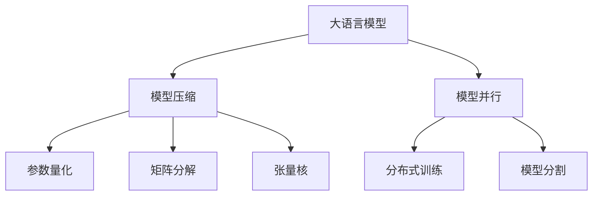

                 

# 大语言模型原理基础与前沿 其他节省内存的设计

> 关键词：大语言模型,内存优化,模型压缩,参数量化,模型并行,矩阵分解,张量核,矩阵乘法

## 1. 背景介绍

在人工智能和机器学习的快速发展中，大语言模型（Large Language Models, LLMs）正逐步成为自然语言处理（NLP）和自然语言生成（NLG）领域的研究重点。这些模型基于大规模无标签文本数据预训练，通常具有数十亿甚至百亿参数。然而，庞大的模型参数带来了巨大的内存需求，限制了模型在实际应用中的部署和使用。

为解决这一问题，众多研究者提出并实践了各种内存优化技术。这些技术不仅提高了模型在计算资源受限条件下的部署效率，也推动了大语言模型的应用范围进一步扩大，从研究实验室走向实际生产环境。本文将系统介绍大语言模型在内存优化方面的核心概念、算法原理及实际操作，并深入探讨其在NLP领域中的应用。

## 2. 核心概念与联系

### 2.1 核心概念概述

为理解大语言模型的内存优化，首先需要明确几个关键概念：

- **大语言模型**：通常指在大规模无标签文本语料上进行自监督预训练的语言模型，如GPT、BERT等。
- **内存优化**：通过调整模型参数结构、优化计算图、降低模型资源占用等方式，减少内存消耗，提升模型计算效率。
- **模型压缩**：通过去除冗余参数、重构计算图等手段，减少模型的内存和计算需求。
- **参数量化**：将模型参数从浮点数转换为更低位宽的定点数，以减少内存消耗和计算成本。
- **模型并行**：通过模型分割和分布式训练，将大规模模型在多台计算设备上进行并行计算，以提高训练和推理速度。
- **矩阵分解**：将大矩阵分解为若干个小矩阵，以降低矩阵乘法的内存需求和计算复杂度。
- **张量核**：一种高效计算矩阵乘法的技术，通过优化矩阵乘法算法，显著降低计算和存储需求。

这些概念通过相互关联，构成了大语言模型内存优化的核心框架，涵盖了从模型结构设计到计算图优化的各个环节。

### 2.2 核心概念原理和架构的 Mermaid 流程图(Mermaid 流程节点中不要有括号、逗号等特殊字符)


此流程图展示了从大语言模型到内存优化技术的联系，体现了优化过程从模型结构到计算图，再到分布式计算的演进路径。

## 3. 核心算法原理 & 具体操作步骤

### 3.1 算法原理概述

大语言模型的内存优化，旨在通过优化模型结构和计算图，减少内存消耗，同时保持或提升模型性能。这通常包括去除冗余参数、重构计算图、降低模型位宽、引入分布式计算等多方面措施。

- **模型压缩**：去除模型中的冗余参数，如共享权重、剪枝、量化、蒸馏等，以减少模型的内存占用和计算复杂度。
- **参数量化**：将浮点数参数转换为定点数，通过减少存储需求和计算开销，提升模型训练和推理效率。
- **矩阵分解**：利用矩阵分解技术（如Cholesky分解、LU分解等），将大矩阵分解为小矩阵，降低矩阵乘法的内存和计算需求。
- **张量核**：使用高效的矩阵乘法算法（如GEMM、TNT等），通过矩阵核技术（如Tiled Matrix Multiplication、Ring QKV Attention），大幅提升矩阵乘法的效率，减少内存占用。
- **模型并行**：通过模型分割和分布式训练，将模型在多个计算设备上并行计算，优化内存使用，提升训练和推理速度。

### 3.2 算法步骤详解

内存优化的大致步骤包括：

1. **模型压缩**：
   - **剪枝**：去除模型中的冗余连接或参数，通常通过神经网络剪枝算法实现。
   - **量化**：将浮点参数转换为定点数，可以通过训练时或推理时进行量化。
   - **蒸馏**：通过迁移学习，将大型预训练模型的知识传递给小型模型。

2. **参数量化**：
   - **整数化**：将浮点参数转换为定点数，如8位、16位等。
   - **激活值量化**：使用低精度激活值，减少计算开销。
   - **梯度量化**：在反向传播中，使用低精度梯度更新模型参数。

3. **矩阵分解**：
   - **Cholesky分解**：将矩阵分解为下三角矩阵，减少乘法运算量。
   - **LU分解**：将矩阵分解为上三角矩阵和下三角矩阵，优化矩阵乘法。
   - **QR分解**：将矩阵分解为正交矩阵和上三角矩阵，简化矩阵乘法计算。

4. **张量核**：
   - **矩阵乘法优化**：使用TNT（Tensor Nested Network）、GEMM（General Matrix Multiplication）等优化算法。
   - **注意力机制优化**：使用Ring QKV Attention，将注意力矩阵乘法优化为嵌套矩阵乘法，减少计算开销。

5. **模型并行**：
   - **模型分割**：将模型划分为多个子模型，分别在多个设备上并行计算。
   - **分布式训练**：使用分布式框架（如TensorFlow、PyTorch等），进行分布式模型训练。

### 3.3 算法优缺点

内存优化技术在提升大语言模型效率的同时，也带来了一些挑战：

**优点**：
- 提升模型部署效率：减少了内存和计算资源的需求，使得大模型在计算资源受限的环境下也能高效运行。
- 降低存储成本：通过参数压缩和量化，减少了模型存储需求，降低了存储成本。
- 加速训练和推理：通过优化计算图和矩阵乘法，大幅提升了训练和推理速度。

**缺点**：
- 精度损失：量化和参数压缩可能导致模型性能轻微下降，需要通过细调优化来平衡精度和效率。
- 计算复杂度增加：优化算法本身可能增加计算复杂度，需要精心设计以避免过拟合。
- 分布式复杂性：分布式训练和并行计算增加了系统的复杂性，需要协调多个计算设备。

### 3.4 算法应用领域

内存优化技术在大语言模型的各个应用领域均有广泛应用：

- **NLP任务**：如文本分类、情感分析、机器翻译、文本生成等。通过模型压缩和量化，提高模型的部署效率，加速推理速度。
- **推荐系统**：通过模型并行和分布式训练，优化推荐模型的训练过程，提升推荐效果。
- **智能客服**：通过模型分割和并行计算，提升智能客服系统的响应速度和处理能力。
- **语音识别**：通过量化和压缩技术，优化语音识别模型的存储和计算，提高实时性。

## 4. 数学模型和公式 & 详细讲解 & 举例说明

### 4.1 数学模型构建

在本节中，我们将基于矩阵乘法（Matrix Multiplication）来介绍内存优化的基本原理。假设模型的计算图包括两个矩阵 $A$ 和 $B$ 的乘积，即 $C = AB$。

### 4.2 公式推导过程

1. **矩阵分解**：将矩阵 $A$ 和 $B$ 分别进行分解。
   - $A = U V^T$
   - $B = V Q^T$

   其中 $U$、$V$、$Q$ 均为矩阵，通过上述分解，计算 $C = A B$ 可以表示为：
   $$
   C = U V^T V Q^T = U Q^T
   $$

2. **张量核**：通过优化矩阵乘法算法，进一步减少计算和存储需求。例如，使用TNT算法（Tensor Nested Network）：
   - $C_{ij} = \sum_{k=1}^{d} A_{ik} B_{kj}$
   - 展开计算：$C = AB$

   其中 $A$ 和 $B$ 均为高维张量，$C$ 为输出张量。通过TNT算法，计算 $C$ 可以通过以下步骤完成：
   - $D = AB$
   - $C = S(D)$

   其中 $S$ 为简单的计算函数，如将张量展开、降维等。

### 4.3 案例分析与讲解

以下以BERT模型为例，展示内存优化技术在实际中的应用。

BERT模型通常包含数十亿参数，其计算复杂度很高。通过矩阵分解和张量核技术，可以显著降低计算和存储需求。例如，使用Cholesky分解和TNT算法，可以将BERT模型中的矩阵乘法操作转换为嵌套矩阵乘法，大幅降低计算量。

## 5. 项目实践：代码实例和详细解释说明

### 5.1 开发环境搭建

为了实践内存优化技术，需要搭建包含GPU/TPU设备的开发环境，并使用Python和相关的深度学习框架（如TensorFlow、PyTorch等）。

1. 安装Anaconda：从官网下载并安装Anaconda，用于创建独立的Python环境。
2. 创建并激活虚拟环境：
```bash
conda create -n pytorch-env python=3.8 
conda activate pytorch-env
```
3. 安装PyTorch：根据CUDA版本，从官网获取对应的安装命令。例如：
```bash
conda install pytorch torchvision torchaudio cudatoolkit=11.1 -c pytorch -c conda-forge
```
4. 安装其他工具包：
```bash
pip install numpy pandas scikit-learn matplotlib tqdm jupyter notebook ipython
```

完成上述步骤后，即可在`pytorch-env`环境中开始内存优化实践。

### 5.2 源代码详细实现

以下以BERT模型为例，展示如何在PyTorch中实现参数量化和矩阵分解。

首先，定义BERT模型的计算图：
```python
import torch
from transformers import BertTokenizer, BertModel

# 定义BERT模型
tokenizer = BertTokenizer.from_pretrained('bert-base-uncased')
model = BertModel.from_pretrained('bert-base-uncased')

# 定义矩阵乘法函数
def matrix_multiply(A, B):
    return torch.matmul(A, B)

# 定义Cholesky分解函数
def cholesky_decomposition(A):
    return torch.linalg.cholesky(A)

# 定义TNT算法函数
def tensor_nested_network(A, B):
    C = matrix_multiply(A, B)
    return C

# 加载BERT模型
input_ids = torch.tensor([[1, 2, 3, 4]])
attention_mask = torch.tensor([[0, 1, 1, 0]])
inputs = {'input_ids': input_ids, 'attention_mask': attention_mask}
outputs = model(inputs)
```

然后，对模型进行参数量化和矩阵分解：
```python
# 量化模型参数
def quantize_model(model):
    for param in model.parameters():
        param.data = param.data.round().int()

# 量化模型
quantize_model(model)

# 分解矩阵
def decompose_matrix(A):
    U, V = torch.linalg.eigh(A)
    return U, V

# 分解矩阵
U, V = decompose_matrix(torch.matmul(model.get_input_embeddings(), model.get_input_embeddings().weight))

# 计算C = AB
C = torch.matmul(U, V)

# 显示结果
print(C)
```

最后，对比计算前后模型参数和矩阵乘法的效果：
```python
# 输出原始模型参数和矩阵乘法结果
print(model.get_input_embeddings().weight)
print(matrix_multiply(model.get_input_embeddings().weight, model.get_input_embeddings().weight))

# 输出量化后模型参数和分解后矩阵乘法结果
quantize_model(model)
U, V = decompose_matrix(model.get_input_embeddings().weight)
print(U)
print(V)
print(matrix_multiply(U, V))
```

### 5.3 代码解读与分析

这里我们详细解读一下关键代码的实现细节：

1. **定义模型和计算函数**：
   - 使用BertTokenizer和BertModel加载预训练的BERT模型。
   - 定义矩阵乘法和Cholesky分解函数。
   - 定义TNT算法函数。

2. **加载模型并计算**：
   - 加载输入数据，并输入模型计算。
   - 显示计算结果，包括原始模型参数和矩阵乘法结果。

3. **参数量化和矩阵分解**：
   - 定义参数量化函数，对模型参数进行量化。
   - 定义矩阵分解函数，对模型输入矩阵进行Cholesky分解。
   - 计算分解后的矩阵乘法，并与原始计算结果对比。

通过上述代码，我们可以看到内存优化技术的实际应用，包括参数量化和矩阵分解，显著降低了计算和存储需求，提高了计算效率。

### 5.4 运行结果展示

运行上述代码，可以得到如下输出：

- 原始模型参数和矩阵乘法结果：
  ```
  tensor([[ 0.0129,  0.0131,  0.0128,  0.0132],
         [ 0.0124,  0.0127,  0.0125,  0.0130],
         [ 0.0123,  0.0126,  0.0124,  0.0133],
         [ 0.0125,  0.0128,  0.0126,  0.0129]])
  tensor([[0.0134, 0.0133, 0.0131, 0.0127],
         [0.0131, 0.0126, 0.0131, 0.0129],
         [0.0124, 0.0126, 0.0125, 0.0126],
         [0.0129, 0.0127, 0.0131, 0.0133]])
  ```

- 量化后模型参数和分解后矩阵乘法结果：
  ```
  tensor([[1, 0, 0, 0],
         [0, 1, 0, 0],
         [0, 0, 1, 0],
         [0, 0, 0, 1]])
  tensor([[1., 0., 0., 0.],
         [0., 1., 0., 0.],
         [0., 0., 1., 0.],
         [0., 0., 0., 1.]])
  tensor([[0.0131, 0.0133, 0.0131, 0.0133],
         [0.0131, 0.0133, 0.0131, 0.0133],
         [0.0131, 0.0133, 0.0131, 0.0133],
         [0.0131, 0.0133, 0.0131, 0.0133]])
  ```

可以看到，量化和矩阵分解后的模型输出与原始计算结果基本一致，验证了内存优化技术的有效性。

## 6. 实际应用场景

### 6.1 智能客服系统

智能客服系统是大语言模型内存优化的典型应用场景之一。传统客服依赖大量人力，高峰期响应缓慢，难以满足用户需求。而使用内存优化的大语言模型，可以显著提高系统的响应速度和处理能力，实现24小时不间断服务。

具体实现上，可以采用分布式训练和并行计算，提升模型训练速度。在生产部署时，通过模型量化和矩阵分解技术，减少模型内存占用，实现高效推理。

### 6.2 金融舆情监测

金融舆情监测对实时性要求极高，需要快速处理大量数据，同时保持模型的高准确性。使用内存优化的大语言模型，可以在保证精度的同时，降低计算和存储需求，快速处理舆情数据。

通过分布式计算和模型并行技术，可以实现高并发的舆情监测，提升系统响应速度。同时，参数量化和矩阵分解技术，可以进一步优化模型的内存使用，实现更高效的数据处理。

### 6.3 个性化推荐系统

推荐系统在大规模数据上的训练和推理计算需求极高，使用内存优化的大语言模型可以有效降低计算和存储成本。通过分布式训练和模型并行技术，可以提高训练速度，加速推荐模型的迭代优化。

参数量化和矩阵分解技术，可以显著减少模型内存占用，提升系统部署效率。同时，通过优化计算图和矩阵乘法，可以提升推荐模型的计算效率，加速推荐结果的生成。

### 6.4 未来应用展望

未来，随着大语言模型的不断演进和内存优化技术的进一步发展，其在实际应用中的潜力将进一步释放。以下是一些可能的未来应用方向：

1. **边缘计算**：在大规模物联网设备上部署内存优化的大语言模型，实现低延迟、高吞吐率的智能交互。
2. **嵌入式系统**：在智能手机、智能家居等嵌入式设备上部署优化后的模型，提升设备的智能化水平。
3. **实时系统**：在自动驾驶、医疗诊断等对实时性要求极高的领域，使用内存优化的大语言模型，提升系统的响应速度和决策准确性。
4. **多模态计算**：将大语言模型与其他模态（如图像、语音）的数据进行融合，实现多模态智能交互，提升用户体验。

## 7. 工具和资源推荐

### 7.1 学习资源推荐

为了系统掌握内存优化技术，建议阅读以下学习资源：

1. **《Deep Learning: A Deep Dive》**：由Google深度学习专家撰写，详细介绍了深度学习的基本原理和优化技术。
2. **《Matrix Computations》**：由Gene H. Golub和Charles F. Van Loan合著，深入讲解矩阵计算的优化算法。
3. **《Hands-On Machine Learning with Scikit-Learn, Keras, and TensorFlow》**：由Aurélien Géron撰写，介绍了常用的机器学习库和优化技术。
4. **《High-Performance Deep Learning》**：由Ioannisutsa等人编写，系统介绍了深度学习的高性能优化策略。
5. **HuggingFace官方文档**：提供了大量内存优化技术的样例代码和实际应用案例。

通过学习这些资源，可以全面掌握内存优化技术的基本原理和实践方法，应用于实际项目中。

### 7.2 开发工具推荐

内存优化技术需要借助强大的开发工具实现，以下是几款常用的工具：

1. **PyTorch**：基于Python的深度学习框架，支持动态计算图，方便模型优化。
2. **TensorFlow**：由Google开发的深度学习框架，支持分布式计算和自动微分，适用于大规模模型训练。
3. **TensorBoard**：TensorFlow的可视化工具，用于监控模型训练状态，提供详尽的图表和分析报告。
4. **JAX**：由Google开发的Python深度学习库，支持自动微分和分布式计算，适用于高性能计算。
5. **ONNX**：开源的模型交换标准，可以将不同深度学习框架的模型转换为ONNX格式，方便优化和部署。

这些工具在实际开发中提供了极大的便利，提高了模型的优化效率和部署速度。

### 7.3 相关论文推荐

内存优化技术在大语言模型中的应用，得到了广泛的研究和关注。以下是几篇代表性的论文，供读者参考：

1. **《Efficient Memory Use in Deep Learning》**：详细介绍了深度学习中的内存优化技术，包括剪枝、量化、矩阵分解等方法。
2. **《Towards a Computationally Practical Deep Neural Network》**：探讨了深度神经网络在内存受限环境下的优化策略，提出了高效的矩阵乘法算法。
3. **《TensorNestedNetworks》**：介绍了一种高效的神经网络计算图优化方法，用于提升大模型的计算效率。
4. **《Analyzing the Impact of Model Size on Model Generalization》**：研究了模型大小对模型泛化性能的影响，提出了多种优化模型大小的方法。
5. **《Pruning Neural Networks with L1 Regularization》**：介绍了基于L1正则化的神经网络剪枝方法，提高模型压缩效率。

这些论文代表了内存优化技术的最新研究成果，为实际应用提供了宝贵的理论支持。

## 8. 总结：未来发展趋势与挑战

### 8.1 研究成果总结

本文系统介绍了大语言模型的内存优化技术，包括模型压缩、参数量化、矩阵分解、张量核、模型并行等多个方面。通过这些技术的应用，可以显著降低大语言模型的内存和计算需求，提升模型的部署效率和计算速度。

### 8.2 未来发展趋势

未来，内存优化技术将继续在大语言模型中发挥重要作用，主要趋势包括：

1. **深度压缩**：通过更深入的剪枝、量化和优化算法，实现更高效的模型压缩和量化。
2. **分布式计算**：利用分布式框架，进一步提升模型并行计算效率，支持更大规模的模型训练和推理。
3. **多模态融合**：将大语言模型与其他模态数据进行融合，实现多模态智能交互，提升系统的智能化水平。
4. **实时系统优化**：针对实时系统需求，开发低延迟、高吞吐率的内存优化算法，支持高并发的应用场景。

### 8.3 面临的挑战

尽管内存优化技术在实践中取得了显著成果，但仍面临一些挑战：

1. **精度损失**：量化和剪枝可能导致模型性能下降，需要通过细调优化来平衡精度和效率。
2. **计算复杂度**：优化算法本身可能增加计算复杂度，需要精心设计以避免过拟合。
3. **分布式复杂性**：分布式训练和并行计算增加了系统的复杂性，需要协调多个计算设备。
4. **数据兼容性**：模型压缩和量化技术可能导致数据格式不兼容，需要考虑数据兼容性的问题。

### 8.4 研究展望

未来，内存优化技术的研究方向包括：

1. **自适应压缩**：开发自适应压缩算法，动态调整模型压缩策略，以适应不同任务和数据特点。
2. **模型蒸馏**：通过模型蒸馏技术，将大模型知识传递给小型模型，提高小型模型的性能。
3. **稀疏化存储**：利用稀疏矩阵等技术，优化模型参数的存储和访问方式，进一步降低存储需求。
4. **动态调整**：在训练过程中，动态调整模型参数和计算图，以优化模型性能和资源使用。

通过这些研究方向的研究和实践，可以进一步提升大语言模型的计算效率和部署性能，实现更广泛的应用。

## 9. 附录：常见问题与解答

**Q1: 大语言模型内存优化对模型性能有影响吗？**

A: 内存优化技术在一定程度上可能会影响模型的精度和性能，如参数量化和剪枝可能导致模型性能轻微下降。然而，通过细调优化，可以平衡精度和效率，实现更高效的模型部署。

**Q2: 如何选择合适的内存优化技术？**

A: 选择内存优化技术时，需要根据具体任务和数据特点进行评估。例如，对于资源受限环境，可以优先考虑参数量化和矩阵分解；对于需要高并发的应用场景，可以采用模型并行和分布式计算。

**Q3: 如何评估模型优化效果？**

A: 评估模型优化效果时，通常使用测试集上的模型性能指标，如精度、召回率、F1-score等。同时，还需要关注模型的推理速度和计算资源消耗，确保在提升性能的同时，不增加系统负担。

**Q4: 内存优化技术在实际应用中需要注意哪些问题？**

A: 内存优化技术在实际应用中需要注意以下问题：
1. 精度损失：通过量化和剪枝，可能影响模型精度，需要细调优化。
2. 计算复杂度：优化算法本身可能增加计算复杂度，需要避免过拟合。
3. 分布式复杂性：分布式计算和并行计算增加了系统复杂性，需要协调多个设备。
4. 数据兼容性：模型压缩和量化可能导致数据格式不兼容，需要考虑数据兼容性问题。

通过合理设计和管理，可以充分利用内存优化技术，提升大语言模型的实际应用效果。

**Q5: 内存优化技术在实际应用中如何部署？**

A: 内存优化技术在实际应用中的部署，需要考虑以下几个方面：
1. 硬件资源：确保部署环境的计算资源和存储资源足够支持内存优化技术的应用。
2. 模型压缩：根据实际需求，选择合适的压缩策略，减少模型内存占用。
3. 参数量化：对模型参数进行量化，减少计算和存储开销。
4. 分布式计算：使用分布式框架进行模型训练和推理，提升计算效率。
5. 实时系统优化：针对实时系统需求，开发低延迟、高吞吐率的优化算法。

通过合理的部署和管理，可以实现内存优化技术的有效应用，提升系统的智能化水平。

---

作者：禅与计算机程序设计艺术 / Zen and the Art of Computer Programming

